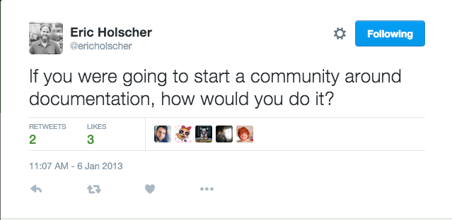

The Write the Docs Origin Story
-------------------------------

The story of how Write the Docs came to be has been told, but it's time to put it up on our own site. The first documentation of the emerging documentarian community comes appropriately enough in the form of a tweet from early 2013:

What happened next is best told in the words of one of the founders, Troy Howard (taken with permission from his blog, at http://blog.thoward37.me/articles/developer-to-documentarian/, with the very lightest of edits because, well, another writer is getting it up on the site and editing is what we do, yes?) He wrote it in early 2014, before the second conference. So read it, and ponder just how far we've come since then, too!

(From Troy's Blog)
~~~~~~~~~~~~~~~~~~

As a developer, I have always cared about documentation, but I'm not sure I ever thought about it deeply until I got to know Eric Holscher better. Sometime in early 2013, I ran into Eric at a local eatery, and we started discussing Read the Docs.[*] He had recently left his job at Urban Airship and was able to work on Read the Docs full time. This was going well, but he was concerned about the future of the project. There didn't seem to be a sense of community around documentation. Was documentation ever going to be given the focus it needed?

At the same time, I looked around me and realized that here in Portland, I was surrounded by some amazing people working with documentation; Noirin Plunkett, Luc Perkins, Leslie Hawthorn, Adron Hall, Joe Moon, Eric Redmond.[*] I saw a community that didn't see itself.

Eric Redmond was the first person I'd met with the (self-appointed) job title "documentarian".

Building a Community of Documentarians
~~~~~~~~~~~~~~~~~~~~~~~~~~~~~~~~~~~~~~

I have a habit of starting conferences, as well as local meetups, and creating terrible inside-joke-esque slang. I really enjoy helping people organize to create the things they want to see happen.

Naturally, my first reaction to Eric Holscher's existential angst about docs was, "Let's have a conference". I called up Eric Redmond and we had our first meeting of documentarians (I refer to them collectively as "the Erics").

    There exists a tribe of documentarians in the world. Up until this point, they haven’t had a central place to meet each other, and coalesce into a community. We are providing the space to allow this to happen, both in person and online.

The headline quote above is from a doc, then titled "Write the Docs: Manifesto," written that night. The Erics almost laughed the idea off at first; no one would come, no one would sponsor it. I said "no really, it's not that hard, let's see what could happen" and bought another round of beer. So, we created a landing page with minimal details, included a call to action and a mailing list signup form, then posted the link to Hacker News.

It seems we touched a nerve.

Originally, we were discussing a 50-100 person conference, mostly made up of local Portland people, probably mostly developers. Instead, we had hundreds of signups for the mailing list in the first day. Over the next couple months we were contacted by people from a variety of disciplines; technical writing industry groups, designers, typographers, literate programmers, API driven startups, and more. We quickly found a new venue, and sold out a 250 person conference. The experience was amazing. We'd found our tribe, and they'd found us.

Now, we're ramping up for year two, with conferences both in Portland and in Budapest this spring. We've seen local meetups spring up in San Francisco, Boston, and New York. We're working on building more.

[*] See https://readthedocs.org/, Eric's ongoing major contribution to the world of documentation.
[*] For more about some of these fine folks, see the program for the first WTD conference, at http://conf.writethedocs.org/na/2013/.