*****************************************
Write the Docs Salary Survey 2019 Results
*****************************************

.. h.gvypi898rlnx:

Introduction
============

The first ever Write the Docs Salary Survey aimed to gather data about
salaries for documentarians across the world, to help our community
members determine what appropriate salary ranges are and to provide a
benchmark for future negotiations.

The survey was open from September 12, 2019 until November 7, 2019. 705
documentarians started the survey and 649 finished it - a completion
rate of 92%.

The average time taken to complete all questions was 5 minutes and 10
seconds.

For ease of comparison, respondents were asked to convert their salary
figures to US dollars. All numbers in this report are US dollars.

Feedback
--------

We'd love your thoughts on this survey, so that we can continue to refine it over the years.
You can email us at support@writethedocs.org with your ideas.

--------------

.. h.i2t4zq90zgzk:

Section 1: Employment Parameters
================================

This section asked about the parameters of the respondent’s employment -
whether they were employees or self-employed, how many hours they
worked, whether they worked solo or as part of a team, and how focused
their role was on tasks related to documentation.

.. h.holt8zxpf36k:

Basis of Employment
-------------------

The vast majority of respondents were employees (94%) rather than
independent contractors, freelance operators, or self-employed (6%).

.. figure:: images/1.svg
   :alt: Figure: Basis of Employment

   Figure: Basis of Employment

--------------

.. h.kk8l4ab1mbd3:

Hours Worked
------------

Respondents were asked to enter the average number of hours they work
per week (whole numbers only).

Most survey respondents worked “full time” hours: 97% worked 30 hours
per week or above. 69% of respondents worked between 38 and 42 hours
each week - what is traditionally considered a “normal” full time
working week.

18% reported worked more than 42 hours per week, with 6% working 50 or
above.

4 respondents reported working 60 hours per week, the largest number
entered.

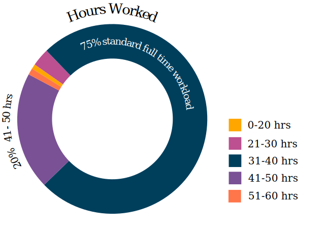

   Figure: Hours Worked

--------------

.. h.xeudi0on80uz:

Job Title
---------

Note: 3 respondents entered “N/A” or equivalent

With typos removed, capitalization standardized and abbreviations
expanded, 207 distinct job titles were entered as responses to this
question.

67% of respondents entered a job title that contained the words “Writer”
or “Author”. 62% of respondents entered a job title that contained the
words “Technical Writer” or “Technical Author”.

25% of respondents had the word “Senior” in their job title. 8% had
“Manager”, and 6% had “Lead”. On the other end of the scale, only 0.5%
included the word “Junior”.

By clustering job titles into groups, and separating out the writers,
editors, documentation and content craftspeople/specialists/consultants
and other roles centered around the creation of documentation - the bulk
of the respondents - a few other roles stand out.

.. table::  Other Roles

   +-----------------------------------+-----------------------------------+
   | Role Type                         | Number of Respondents             |
   +===================================+===================================+
   | CEOs, Directors and non-specific  | 24                                |
   | Managers/Team Leaders             |                                   |
   +-----------------------------------+-----------------------------------+
   | Information                       | 21                                |
   | Specialists/Analysts/Architects   |                                   |
   +-----------------------------------+-----------------------------------+
   | Engineers or Developers (Data     | 17                                |
   | Visualization, Artificial         |                                   |
   | Intelligence, Software)           |                                   |
   +-----------------------------------+-----------------------------------+
   | Support or User Assistance roles  | 12                                |
   +-----------------------------------+-----------------------------------+
   | Roles related to Knowledge        | 11                                |
   | Management                        |                                   |
   +-----------------------------------+-----------------------------------+
   | UX-related roles                  | 7                                 |
   +-----------------------------------+-----------------------------------+
   | Analyst Roles (Business, Systems, | 6                                 |
   | Technical)                        |                                   |
   +-----------------------------------+-----------------------------------+
   | Roles related to Education and    | 4                                 |
   | Training                          |                                   |
   +-----------------------------------+-----------------------------------+
   | Document Controllers              | 2                                 |
   +-----------------------------------+-----------------------------------+
   | Instructional Designers           | 2                                 |
   +-----------------------------------+-----------------------------------+
   | Community Engineer                | 1                                 |
   +-----------------------------------+-----------------------------------+
   | Developer Advocate                | 1                                 |
   +-----------------------------------+-----------------------------------+
   | DevOps                            | 1                                 |
   +-----------------------------------+-----------------------------------+
   | Marketing                         | 1                                 |
   +-----------------------------------+-----------------------------------+
   | Quality Assurance                 | 1                                 |
   +-----------------------------------+-----------------------------------+

   Figure: Job Title

--------------

.. h.5q6s9zr6qzq6:

Type of Role
------------

50% of respondents work as part of a team, while 29% work as a solo
documentarian. 17% are in manager or team leader roles and the remaining
4% indicated that they had a more unique split role or were part of a
team not made up of other documentarians.

Given that team leaders or managers are actually part of a team, and
most of the “other” responses indicated partial team roles, this means
that overall less than 30% of respondents work individually.

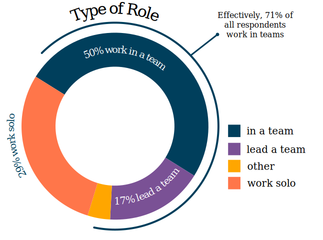

   Figure: Type of Role

--------------

.. h.2u53cvl6ll1e:

Length of time in current role
------------------------------

9% of respondents indicated they had worked in their current role for
less than one full year.

20% indicated one year, and a further 8% indicated more than one year
but less than 2 years.

2 years but less than 5 years made up 35%. 5 years but less than 10
years was another 19%.

Veterans of 10 or more years in their current role made up 9%. Of these,
9 individual respondents reported 30 years or more, with one respondent
reporting 40 years (the top value entered).

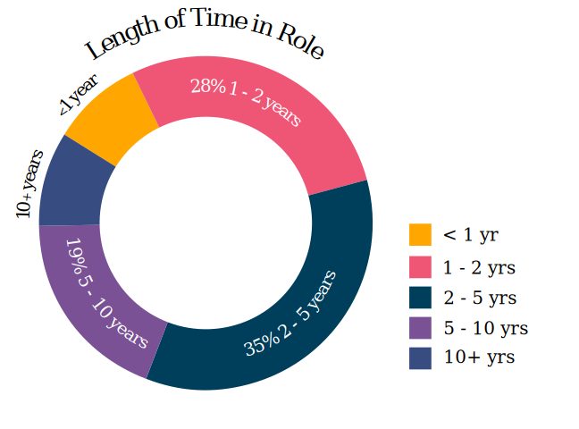

   Figure: Time in Current Role

--------------

.. h.dfv7pdw0gekn:

Proportion of role officially related to documentation
------------------------------------------------------

65% of respondents reported that documentation was the whole of their
official job description, and 30% reported that it was part of their
official job description. This overwhelming majority (95% of all
responses) is not surprising, given the focus of the Write the Docs
community.

What was interesting was the statistically relevant number of
respondents choosing the other two options: 4% said that although
documentation was not part of their job description, they were expected
to perform documentation-related tasks anyway, and 1.5% said that
although documentation was not part of their job description, and they
were not expected to perform documentation-related tasks, they did.

.. figure:: images/6.svg
   :alt: Figure: Official Role Breakdown

   Figure: Official Role Breakdown

--------------

.. h.ejn8zultdqlt:

Proportion of role actually related to documentation
----------------------------------------------------

6% of respondents reported that documentation made up one quarter or
less of their job. Of these, a little over a third estimated
documentation was 10% or less (and two respondents entered 0%).

A further 9% estimated that between one quarter and one half of their
job consisted of documentation-related tasks.

18% estimated between half and three quarters of their job was purely
documentation.

The majority (67%) had jobs focused on documentation more than three
quarters of their time. 47% estimated 90% or above, and 29% stated their
job was 100% documentation.

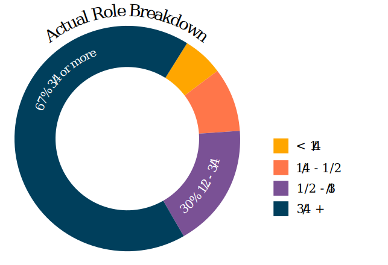

   Figure: Actual Role Breakdown

--------------

.. h.iha544grkavd:

Work Location
-------------

56% of respondents work on site at their employer’s office. 17% work
completely remotely, and the remaining 27% work partially remotely and
partially onsite.

Of the respondents that work completely on site, 55% do so by choice,
while for 45% it’s a requirement.

Of those that work entirely remotely, 74% do so by choice, while only
26% have no on site alternative available to them.

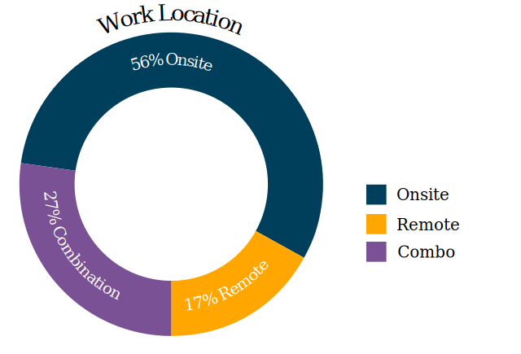

   Figure: Work Location

--------------

.. h.me9iqb10zfgx:

Section 2: Salary Information
=============================

This section contained questions that addressed the all-important salary
figure, additional benefits, level of satisfaction and reasons for
dissatisfaction.

.. h.7208juau05as:

Annual Salary
-------------

Note: as 97% (632) of respondents reporting working between 30 and 60
hours per week - a “full time” role - the 3% reporting fewer than 30
hours have been omitted from the figures in this section.

The median salary across all regions, before tax and any additional benefits, was $74,500 (meaning half of the
respondents earned more, and half earned less).

This figure is not very representative as it does not take into account
the socio-economic situation in the countries of the very highest
earners (out of the top 10 salary values, 9 were from the US and one
from the UK) and the very lowest (the bottom 10 salary values were from
 India, Asia, and Eastern Europe).

Figures grouped into regions make a more useful baseline from which to
determine what constitutes a “fair” salary.

.. h.mqgdllu8gaap:

Median Salary by Region and Country
-----------------------------------

.. table:: Median Salary by Region and Country

   +------------------+------------------+--------------------------------------+---------------------+---------------+
   | Region           |  Sub-region      | No of Respondents                    | Percentage of Total | Median Salary |
   |                  |                  | *(working 30+ hours)*                |                     |               |
   +==================+==================+======================================+=====================+===============+
   | North America    |                  | 386                                  | 61%                 | $90,000       |
   +------------------+------------------+--------------------------------------+---------------------+---------------+
   |                  | USA              | 344                                  | 54.4%               | $93,600       |
   +------------------+------------------+--------------------------------------+---------------------+---------------+
   |                  | Canada           | 42                                   | 6.6%                | $60,273       |
   +------------------+------------------+--------------------------------------+---------------------+---------------+
   | Europe           |                  | 164                                  | 25.9%               | $48,700       |
   +------------------+------------------+--------------------------------------+---------------------+---------------+
   |                  | EU Member States | 112                                  | 17.2%               | $46,104       |
   +------------------+------------------+--------------------------------------+---------------------+---------------+
   |                  | UK [#f1]_        | 36                                   | 5.5%                | $60,269       |
   +------------------+------------------+--------------------------------------+---------------------+---------------+
   |                  | Germany          | 24                                   | 3.7%                | $59,430       |
   +------------------+------------------+--------------------------------------+---------------------+---------------+
   |                  | Poland           | 12                                   | 1.8%                | $21,525       |
   +------------------+------------------+--------------------------------------+---------------------+---------------+
   |                  | Russia [#f2]_    | 9                                    | 1.4%                | $23,200       |
   +------------------+------------------+--------------------------------------+---------------------+---------------+
   | Oceania          |                  | 30                                   | 4.6%                | $66,674       |
   +------------------+------------------+--------------------------------------+---------------------+---------------+
   | Asia [#f3]_      |                  | 13                                   | 2%                  | $24,000       |
   +------------------+------------------+--------------------------------------+---------------------+---------------+
   | South America    |                  | 2                                    | 0.3%                | $36,588       |
   +------------------+------------------+--------------------------------------+---------------------+---------------+
   | Israel           |                  | 19                                   | 2.9%                | $84,000       |
   +------------------+------------------+--------------------------------------+---------------------+---------------+
   | No Country Given |                  | 18                                   | 2.7%                | $84,500       |
   +------------------+------------------+--------------------------------------+---------------------+---------------+

.. rubric:: Footnotes

.. [#f1] including Scotland - no respondents were reported from Wales or Northern Ireland
.. [#f2] the decision was made to include Russia in Europe due to the percentage of the population living in areas inside the European continent
.. [#f3] including South East Asian countries and East Asian countries

.. h.e48bbqcfc9pg:

USA
~~~

The median salary for the entire United States was $93,600 - 25.6%
higher than the overall median salary.

Given that the US accounted for such a significant proportion of the
data, breaking the data down further, by the most represented states,
seems useful as well. Note that 12 of the respondents who indicated that
they lived in the USA did not provide a city or state, so those values
have been omitted from the following breakdown.

.. table::  Median Salary by US State

   +--------------+---------------+
   | State        | Median Salary |
   +==============+===============+
   | Washington   | $126,500      |
   +--------------+---------------+
   | California   | $120,000      |
   +--------------+---------------+
   | New York     | $105,000      |
   +--------------+---------------+
   | Pennsylvania | $96,350       |
   +--------------+---------------+
   | Texas        | $92,000       |
   +--------------+---------------+
   | Oregon       | $89,000       |
   +--------------+---------------+
   | Virginia     | $78,625       |
   +--------------+---------------+

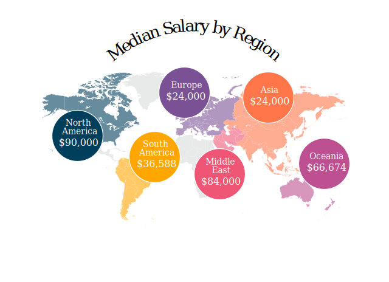

   Figure: Median Salary by Region and Country

--------------

.. h.ldoc9nicw4s7:

Additional Benefits
-------------------

Health insurance and paid vacation time were the most common benefits
reported, with 80% of respondents receiving health insurance and 80%
receiving vacation time.

The next most widespread benefits were professional development
(including conferences) at 56% and bonus payments at 52%. Childcare (5%)
and commission payments (0.6%) were low on the list, and 5% reported
that they did not receive any of the listed benefits.

27% of respondents entered additional benefits. The most common
included:

.. table::  Additional Benefits

   +-----------------------------------+-----------------------------------+
   | Benefit                           | Number of Respondents             |
   +===================================+===================================+
   | Pension, retirement fund,         | 54                                |
   | superannuation or related         |                                   |
   | benefits (including matching)     |                                   |
   +-----------------------------------+-----------------------------------+
   | Stock, stock options, shares or   | 52                                |
   | related benefits                  |                                   |
   +-----------------------------------+-----------------------------------+
   | Meals, meal vouchers or other     | 26                                |
   | food-related benefits             |                                   |
   +-----------------------------------+-----------------------------------+
   | Gym, fitness, sport or other      | 17                                |
   | wellness-related benefits         |                                   |
   +-----------------------------------+-----------------------------------+
   | Other types of insurance eg life, | 13                                |
   | accident, income protection etc   |                                   |
   +-----------------------------------+-----------------------------------+
   | Parking, transportation or        | 21                                |
   | commuting-related benefits        |                                   |
   +-----------------------------------+-----------------------------------+
   | Time off or bonuses for           | 5                                 |
   | community-related activities e.g. |                                   |
   | volunteering                      |                                   |
   +-----------------------------------+-----------------------------------+
   | Parental Leave                    | 5                                 |
   +-----------------------------------+-----------------------------------+
   | Unlimited PTO (paid/personal time | 3                                 |
   | off)                              |                                   |
   +-----------------------------------+-----------------------------------+

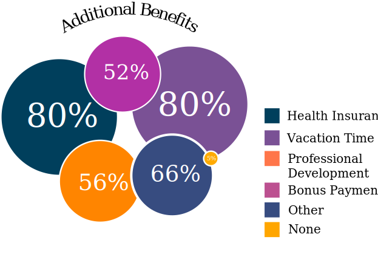

   Figure: Additional Benefits

--------------

.. h.b5gr6vrq3km8:

Satisfaction
------------

71% of respondents are satisfied with their current salary and benefits
package - with 26% of those reporting they were very satisfied.

On the other end of the scale, 13.5% are unsatisfied, with 2% of those
(14 respondents) rating themselves as very unsatisfied.

In the middle, 15.5% gave a neutral response - neither satisfied nor
unsatisfied.

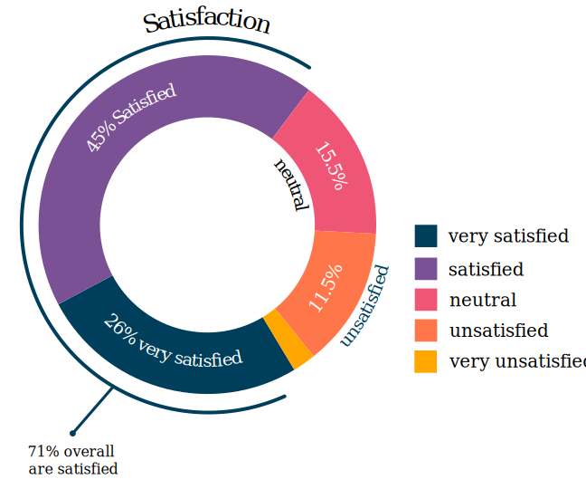

   Figure: Satisfaction

--------------

.. h.56ra7ztltpu6:

Reasons for dissatisfaction
---------------------------

Note: 56% of respondents did not answer this question. Although the
wording suggested that only those who indicated that they were
unsatisfied should answer this question, 16 of those that rated
themselves as “very satisfied” and 104 of those who rated themselves as
“satisfied” (around a third of the total “satisfied” respondents) gave
reasons for dissatisfaction - showing that there’s always room for
improvement.

The top reasons listed for dissatisfaction were:

.. table::  Top Reasons Listed for Salary Dissatisfaction

   +-----------------------------------+-----------------------------------+
   | Reason                            | Percentage of Dissatisfied        |
   |                                   | Respondents                       |
   +===================================+===================================+
   | salary or rate too low            | 47% (20% overall)                 |
   +-----------------------------------+-----------------------------------+
   | No opportunities for advancement  | 40%                               |
   +-----------------------------------+-----------------------------------+
   | Insufficient professional         | 29%                               |
   | development                       |                                   |
   +-----------------------------------+-----------------------------------+
   | Too high workload                 | 29%                               |
   +-----------------------------------+-----------------------------------+
   | Too much stress                   | 26%                               |
   +-----------------------------------+-----------------------------------+
   | Unsupportive workplace            | 22%                               |
   +-----------------------------------+-----------------------------------+
   | Toolset dissatisfaction           | 22%                               |
   +-----------------------------------+-----------------------------------+
   | Don’t feel respected              | 19%                               |
   +-----------------------------------+-----------------------------------+
   | Dissatisfaction with management   | 18%                               |
   +-----------------------------------+-----------------------------------+
   | Work is uninteresting             | 17%                               |
   +-----------------------------------+-----------------------------------+

After the most common reasons for dissatisfaction, the following reasons
were identified by smaller numbers of respondents:

.. table::  Less Common Reasons for Dissatisfaction

   +--------------------------+----------------------------------------+
   | Reason                   | Percentage of Dissatisfied Respondents |
   +==========================+========================================+
   | No remote opportunities  | 12.7%                                  |
   +--------------------------+----------------------------------------+
   | Too many hours           | 9.5%                                   |
   +--------------------------+----------------------------------------+
   | Gender discrimination    | 6%                                     |
   +--------------------------+----------------------------------------+
   | Lack of remote support   | 5.3%                                   |
   +--------------------------+----------------------------------------+
   | Age discrimination       | 4.6%                                   |
   +--------------------------+----------------------------------------+
   | Low workload             | 3.9%                                   |
   +--------------------------+----------------------------------------+
   | Racial discrimination    | 1.8%                                   |
   +--------------------------+----------------------------------------+
   | Education discrimination | 1.4%                                   |
   +--------------------------+----------------------------------------+
   | Too few hours            | 0.7%                                   |
   +--------------------------+----------------------------------------+

38 responses were entered for the “Other” option. After evaluation, some
of these responses were merged into the numbers for the areas listed
above. The remaining responses were grouped into the following areas:

.. table::  Other Reasons for Dissatisfaction

   +-------------------------------------------------+-----------------------+
   | Reason                                          | Number of Respondents |
   +=================================================+=======================+
   | Missing benefits (pension, parental leave, etc) | 9                     |
   +-------------------------------------------------+-----------------------+
   | Discrepancy between salary and cost of living   | 5                     |
   +-------------------------------------------------+-----------------------+
   | Unfair or inconsistent salary across roles      | 4                     |
   +-------------------------------------------------+-----------------------+
   | Role undervalued and/or underfunded             | 4                     |
   +-------------------------------------------------+-----------------------+
   | Responsibilities exceed pay grade               | 4                     |
   +-------------------------------------------------+-----------------------+

4 of the 14 respondents who rated themselves as “very unsatisfied” did
not indicate any reason.

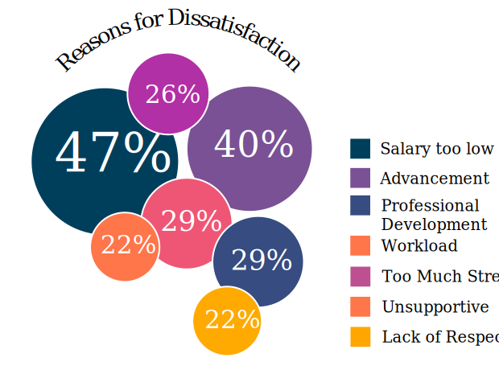

   Figure: Reasons for Dissatisfaction

--------------

.. h.hat0gifwex19:

Section 3: Organization Demographics
====================================

.. h.nn1hulquee40:

Type of Organization
--------------------

Large and medium-sized businesses dominated the results, with 41% of
respondents indicating they worked for a medium business and 39.5%, a
large business. Small business came in at 3rd place with 14% of the
responses.

Government, Non-Profit/Community Organization/NGO and Educational
Institutions accounted for less than 2% of the respondents.

10 “Other” responses were entered, covering startups, government
contractors and independent units within larger organizations.

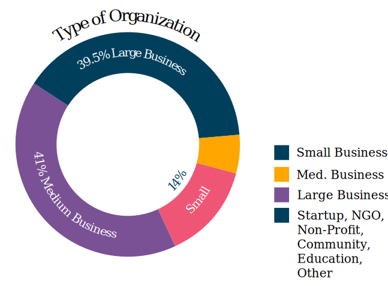

   Figure: Type of Organization

--------------

.. h.k3uydo48dz7b:

Section 4: Respondent Demographics
==================================

Note: The questions in this section were optional.

.. h.fzwggzhwhbwh:

Age
---

Note: 3 respondents skipped this question

The two largest age groups (26-35 year olds and 36-45 year olds)
combined formed 67.5% of the total respondents. Only 4.6% of respondents
fell into the youngest age group, and there were no respondents in the
66+ age bracket.  

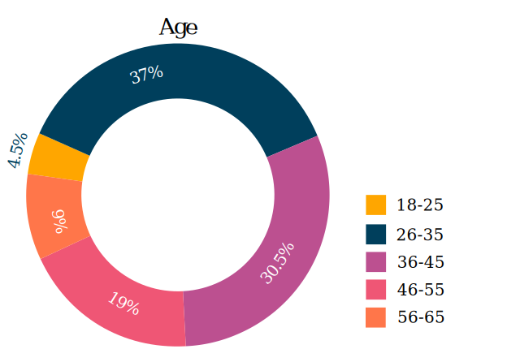

   Figure: Age

--------------

.. h.1w9hfqazunpy:

Gender Identity
---------------

Note: 3 respondents skipped this question, and 1 provided a nonsensical
answer which was discarded.

61% of the respondents identified as women, 36% as men, and 3% as
non-binary or “other”.

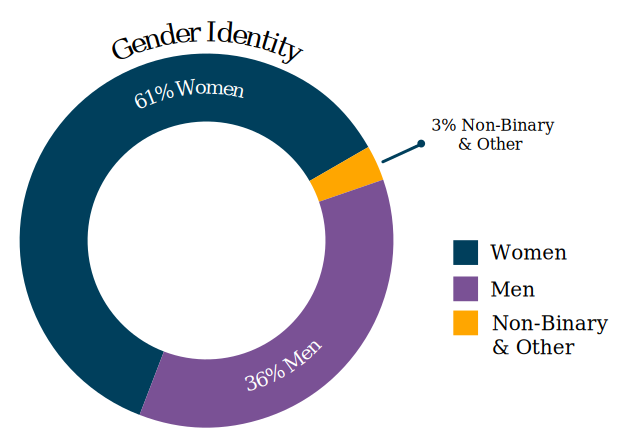

   Figure: Gender Identity

--------------

.. h.6ascb2ek053u:

Highest Education Level Achieved
--------------------------------

Note: one respondent skipped this question

95% of respondents had completed a college or university degree or
higher. Those completing technical college numbered less than 3%, and
those who completed high school only (including those who did some
college but did not achieve a formal qualification) accounted for the
remaining fraction.

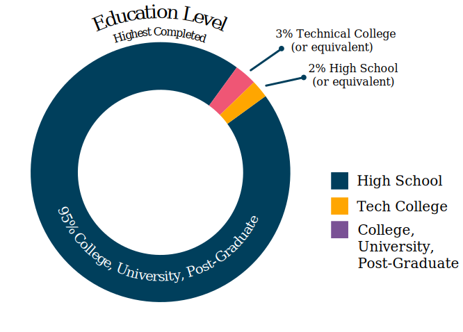

   Figure: Highest Education Level Achieved

--------------

.. h.hpkr7a16phmf:

Geographical Location
---------------------

18 respondents left this question blank or provided a non-quantifiable
response.

Out of the 594 valid responses:

.. table::  Most Common Geographical Locations

   +---------------+---------------------------+
   | Location      | Percentage of Respondents |
   +===============+===========================+
   | United States | 58%                       |
   +---------------+---------------------------+
   | Canada        | 7%                        |
   +---------------+---------------------------+
   | UK            | 6%                        |
   +---------------+---------------------------+
   | Australia     | 4%                        |
   +---------------+---------------------------+
   | Germany       | 4%                        |
   +---------------+---------------------------+
   | Israel        | 3%                        |
   +---------------+---------------------------+
   | Poland        | 2%                        |
   +---------------+---------------------------+

There were fewer than 10 individual respondents from each of the
following countries:

-  Russia
-  France
-  Ireland
-  The Netherlands
-  Spain
-  India
-  Romania
-  Czech Republic
-  Hungary
-  Denmark
-  Finland
-  Sweden
-  Ukraine
-  Bulgaria
-  New Zealand
-  Portugal
-  Belgium
-  Croatia
-  Estonia
-  Italy
-  Scotland
-  Serbia
-  Slovakia

There was one respondent only from each of the following countries:

-  Argentina
-  Austria
-  Brazil
-  Greece
-  Iceland
-  Japan
-  Malaysia
-  Nepal
-  Norway
-  Philippines
-  Singapore
-  Taiwan
-  Vietnam

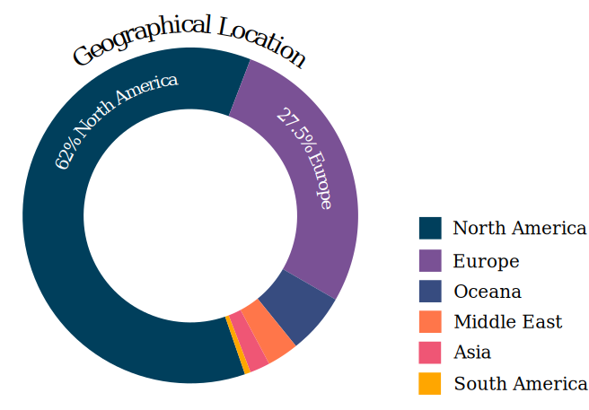

   Figure: Geographical Location
