.. raw:: html

   

.. _h.6rwfhxx07ix:

Write the Docs Salary Survey 2020 Results
=========================================

.. contents::
   :local:
   :depth: 2
   :backlinks: none

.. _h.rkx3h8wib5m0:

Introduction
------------

The Write the Docs Salary Survey aims to gather data about salaries for
documentarians across the world, to help our community members determine
what appropriate salary ranges are, and to provide a benchmark for
future negotiations.

In the second annual survey, which was open from mid-August until
mid-November 2020, we incorporated community feedback from the first
survey and revised the wording of some questions to reduce ambiguity. We
expanded the scope to better cater for independent contractors, people
who were currently out of work, and multiple currencies, and also added
a section about the impact of the COVID-19 pandemic.

805 people completed the survey in 2020, an increase of 24% over 2019.

This year, while our respondents specified the currency they were paid
in, all numbers in this report have been converted to US dollars for
ease of comparison, and the actual exchange rate used has been noted.

.. _h.mi2wl72iecns:

Feedback
~~~~~~~~

We’d love your thoughts on this survey, so that we can continue to
refine it over the years. You can email us at support@writethedocs.org
with your ideas.

--------------

.. _h.5zzagn8dynqk:

.. _h.aej71e9f3u7u:

Section 1: Employment Parameters
---------------------------------

In this section, we asked about the parameters of the respondent’s
employment: 

-  whether they were employees, self-employed, or had been employed or
   self-employed but were currently not working, 
-  the number of hours they worked and the length of time they had held
   the same position, 
-  whether they worked solo or as part of a team and how they classified
   their role, and
-  how focused their role was on tasks related to documentation.

.. _h.1rxh4j1e0028:

Basis of Employment
~~~~~~~~~~~~~~~~~~~

.. container:: question

   .. rubric:: What we asked
                                                                         
   1. What is the basis of your employment?                              
                                                                         
   -  I am an employee                                                   
   -  I am an independent contractor, freelance operator, or             
      self-employed                                                      
   -  I was an employee, but am not currently employed                   
   -  I was an independent contractor, freelance operator, or            
      self-employed, but do not currently have work                      

.. _h.a6zzsevd7quq:

.. _h.6wmey6kqcbaq:

.. _h.8urvv4x3m13k:

In 2019, respondents were asked if they were employees or independent
operators (contractors, freelancers, self-employed). In 2020, we
included new options for those who were not currently working at the
time of taking the survey. These respondents were asked to answer the
questions as if they were still in their previous employment or contract
situation, and their data is included in this report as such.

18 employees and 2 independent contractors filled out the survey on this
basis, or 2.5% of all respondents.

The ratios of employees to independent contractors stayed almost
identical: 93% of respondents were employees (versus 94% in 2019) while
the remaining 7% (versus 6% in 2019) were independent contractors,
freelance operators or self-employed.

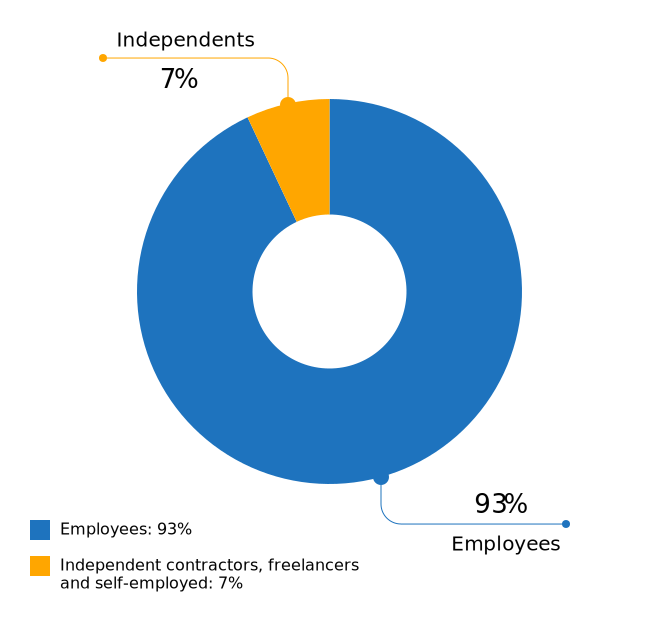

   Figure: Basis of Employment

--------------

.. _h.9uuxqs1c3zs6:

.. _h.x0at40dcmst6:

Hours Worked
~~~~~~~~~~~~

.. container:: question

   .. rubric:: What we asked
                                                                         
   2. How many hours per week do you work?                               
                                                                         
   Note for independent contractors, freelance operators, and the        
   self-employed:                                                        
   Please enter an average across all clients/jobs that you work for in  
   a typical week.                                                       
                                                                         
   -  1-20 hours                                                         
   -  21-30 hours                                                        
   -  31-40 hours                                                        
   -  41-50 hours                                                        
   -  51-60 hours                                                        
   -  More than 60 hours                                                 

.. _h.ue1e6t17jckk:

.. _h.wd8yiracsy1i:

As in 2019, most respondents worked “full-time” hours:

-  95.5% worked 31 hours per week or more,
-  38.4% reported working between 41 and 50 hours, and
-  3% reported between 51 and 60 hours.

Of the 4.5% working part-time:

-  1.6% worked up to 20 hours, and
-  2.9% worked between 21 and 30 hours.

3 respondents reported working over 60 hours per week: the highest
entered value was a staggering 80 hours. In contrast, the highest
reported number from 2019 was 60 hours, reported by 4 respondents.

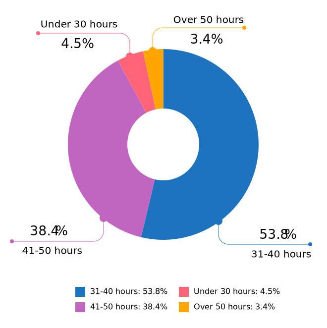

   Figure: Hours Worked

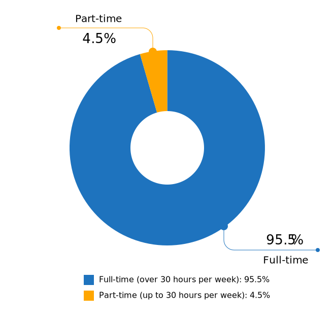

   Figure: Full-time vs Part-time

--------------

.. _h.ixe01ltyj13w:

Job Title
~~~~~~~~~

.. container:: question

   .. rubric:: What we asked
                                                                         
   3. What is your job title?                                            
                                                                         
   Note:                                                                 
   To help us process this information, please use full terms rather     
   than abbreviations. For example, use "Senior" rather than "Sr" and    
   "Technical" rather than "Tech".                                       

.. _h.dqiimb8ucbq2:

.. _h.79g43wra80rl:

With typos removed, capitalization standardized, and abbreviations
expanded, 255 distinct job titles were entered as responses to this
question (versus 207 in 2019). Only one respondent did not provide a
valid job title.

The most common job title entered was “Technical Writer”, making up 33%
of all respondents - but nearly double that (63% of respondents) entered
job titles that included that phrase.    

.. table::  Top Job Titles (including “technical writer”)
   :width: 80%
   :name: tbl-top-titles-inc

   +------------------------------+------------+
   | Job Title                    | % of total |
   +==============================+============+
   | Technical Writer             |     33.17% |
   +------------------------------+------------+
   | Senior Technical Writer      |     16.89% |
   +------------------------------+------------+
   | Principal Technical Writer   |      2.11% |
   +------------------------------+------------+
   | Lead Technical Writer        |      1.99% |
   +------------------------------+------------+
   | Staff Technical Writer       |      1.49% |
   +------------------------------+------------+
   | Information Developer        |      1.12% |
   +------------------------------+------------+
   | Technical Writer II          |      0.99% |
   +------------------------------+------------+
   | Junior Technical Writer      |      0.99% |
   +------------------------------+------------+
   | Documentation Manager        |      0.99% |
   +------------------------------+------------+
   | Senior Information Developer |      0.87% |
   +------------------------------+------------+

.. table:: Top Job Titles (excluding “technical writer”)
   :width: 80%
   :name: tbl-top-titles-excl

   +------------------------------+------------+
   | Job Title                    | % of total |
   +==============================+============+
   | Information Developer        |      4.43% |
   +------------------------------+------------+
   | Documentation Manager        |      3.94% |
   +------------------------------+------------+
   | Senior Information Developer |      3.45% |
   +------------------------------+------------+
   | Documentation Engineer       |      2.96% |
   +------------------------------+------------+
   | Project Manager              |      2.46% |
   +------------------------------+------------+
   | Senior Content Developer     |      1.97% |
   +------------------------------+------------+
   | Instructional Designer       |      1.97% |
   +------------------------------+------------+
   | Knowledge Manager            |      1.97% |
   +------------------------------+------------+
   | Content Developer            |      1.48% |
   +------------------------------+------------+
   | Information Architect        |      1.48% |
   +------------------------------+------------+

   Figure: Job Title Terms

--------------

.. _h.iuz8kwgw96la:

.. _h.q1gre05k74q0:

Type of Role
~~~~~~~~~~~~

.. container:: question

   .. rubric:: What we asked
                                                                         
   4. How would you broadly categorize your primary role?                
                                                                         
   Note:                                                                 
   If you are a team leader or manager but also work alongside your      
   team, please select the category of your team.                        
                                                                         
   -  I am a writer, content creator, producer, or editor                
   -  I am a developer or an engineer                                    
   -  I am an educator                                                   
   -  I work in a customer support role                                  
   -  I am an advocate or work in community outreach                     
   -  I work in marketing                                                
   -  I work primarily in a management role                              
   -  Other (please specify)                                             
                                                                         
   5. In your primary role, are you:                                     
                                                                         
   Note:                                                                 
   If you are a contractor or freelancer, this would apply to the        
   typical kind of job that you are brought on for.                      
                                                                         
   -  A solo worker                                                      
   -  Part of a team (either of people doing the same kind of role, or a 
      mixed-discipline team)                                             
   -  Part of multiple teams                                             
   -  A manager or team leader                                           
   -  Other (please specify)                                             

.. _h.lrj0vzfidi9z:

.. _h.5y5vyqts3p87:

In 2019, we attempted to illustrate the range of roles in the community
by analyzing job titles and grouping them by keyword. In 2020, we went
straight to the source and asked respondents to broadly categorize their
role themselves.

The majority of respondents (87.7%) placed themselves primarily in the
writer/creator/producer/editor role, with management coming in next at
4.8% followed by developer/engineer at 3.4%.

Support, educator, advocate/community outreach and marketing each had
single digit representation. 20 respondents (2.5%) chose “Other” and
entered a different categorization: these included information
architecture, analysis, content strategy, knowledge management and
product management.

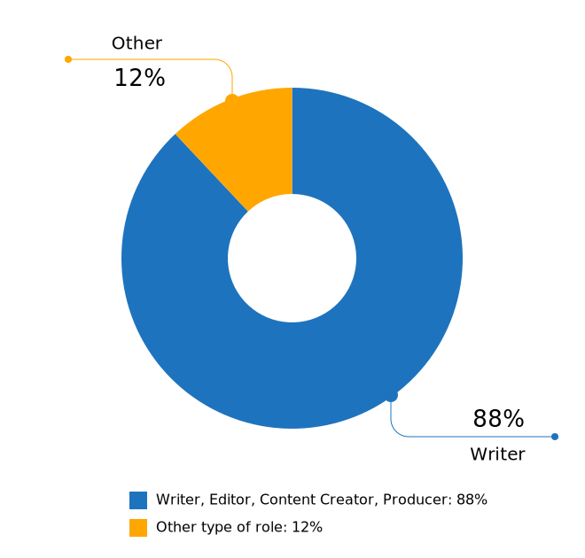

   Figure: Role Categorization - Major Grouping

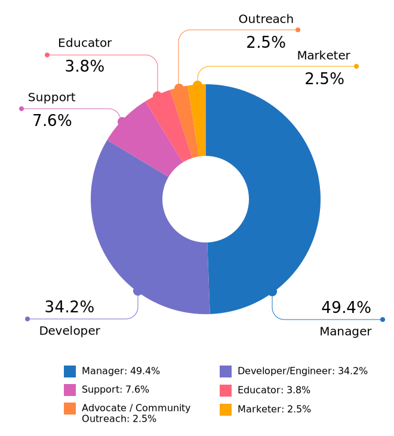

   Figure: Role Categorization - Minor Grouping (excluding writer/creator/editor)

Respondents were further asked to indicate if they worked primarily solo,
as part of a team (either a team made up of people doing the same kind
of job, or a multi-disciplinary team), as part of multiple teams, or as
a manager or team leader.

-  16.3% of respondents indicated that they work solo, a decrease from
   2019 (where nearly 30% reported working alone),
-  52.9% worked on a single team,
-  17% on multiple teams, and
-  13.3% lead a team.

4 respondents selected “Other” and entered more information: 3 of these
were special cases but essentially each worked as part of a team or
multiple teams, while the final case indicated a solo role.    

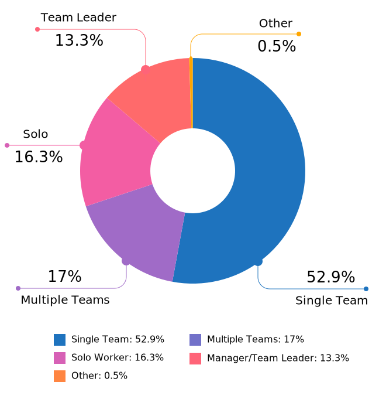

   Figure: Team Breakdown

--------------

.. _h.z2o42q0v1jm:

Length of time at current organization
~~~~~~~~~~~~~~~~~~~~~~~~~~~~~~~~~~~~~~

.. container:: question

   .. rubric:: What we asked
                                                                         
   6. How long have you worked at your current organization?             
                                                                         
   Note:                                                                 
   Please select the length of time for your position at your current    
   organization only - your total years of experience in documentation   
   will be covered in the individual demographics section.               
                                                                         
   If you are a contractor or freelance operator, please select the      
   length of time that you have been contracting or freelancing.         
                                                                         
   -  Less than 1 year                                                   
   -  1 - 2 years                                                        
   -  2 - 5 years                                                        
   -  5 - 10 years                                                       
   -  More than 10 years                                                 

.. _h.yuh1w98eebnf:

.. _h.pe72x68siudn:

Due to ambiguous wording, this question caused some confusion in 2019
with some respondents possibly entering the length of time they had been
working in documentation (which is covered in the demographics section)
rather than the amount of time working with their current employer.
Improved wording and additional clarification this year cleared this up.

Up until the 5 year mark, the numbers were split quite evenly:

-  26% of respondents had been in their current role for less than one
   year,
-  26.2% for between 1 and 2 years, and
-  29.2% for between 2 and 5 years - accounting for 81.3% of the total.

13.2% had been with their current employer for between 5 and 10 years,
and the remaining 5.5% (44 individual respondents) for more than 10
years.

Of those respondents who had been with their current employer for more
than 10 years,

-  61% reported between 11 and 15 years,
-  10 individual respondents indicated 20 years or more -  7 of these
   had clocked up either 20 or 21 years, and
-  single respondents each reported 23 years, 27 years, and 28 years.  

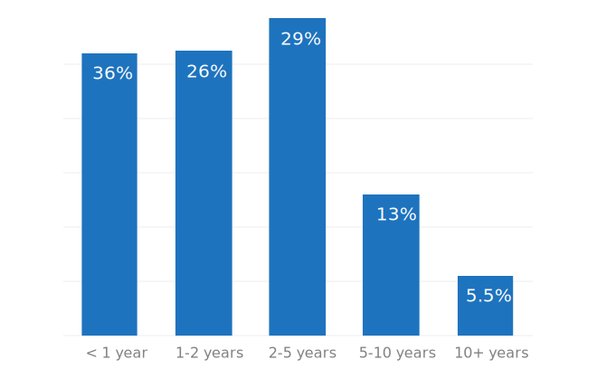

   Figure: Years in Current Role

--------------

.. _h.3pm4cxywjgki:

.. _h.wz6x1mltq3tv:

Proportion of role officially related to documentation
~~~~~~~~~~~~~~~~~~~~~~~~~~~~~~~~~~~~~~~~~~~~~~~~~~~~~~

.. container:: question

   .. rubric:: What we asked
                                                                         
    7. Documentation is:                                                 
                                                                         
   -  the whole of my official job description                           
   -  part of my official job description                                
   -  not officially part of my job description, but I am expected to    
      perform documentation-related tasks                                
   -  not officially part of my job description, and I am not expected   
      to perform documentation-related tasks, but I do anyway            

.. _h.3iqanhncc2zn:

.. _h.61il3vwswcpb:

69.6% of respondents reported that documentation was the whole of their
official job description, and 25.6% reported that it was only one part.

3.4% reported that documentation was not part of their official job
description but that they were still expected to perform
documentation-related tasks, and 1.5% stated that although documentation
was not part of their job description and they were not expected to
perform documentation-related tasks, they did anyway.

These overall proportions remain essentially unchanged from 2019’s
results.

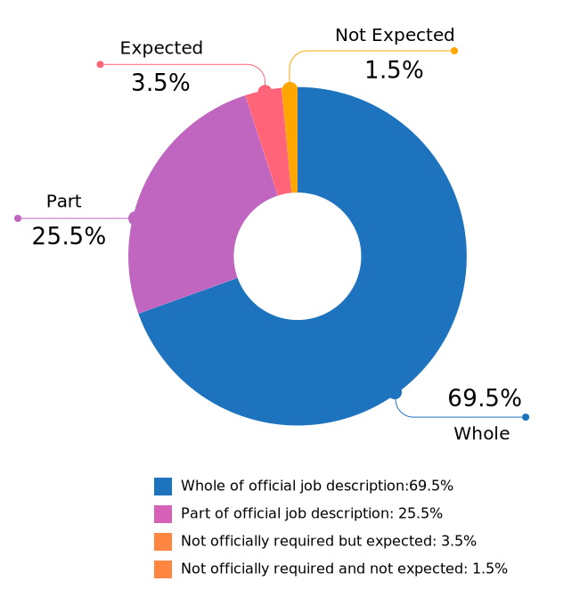

   Figure: Official Role Breakdown

--------------

.. _h.c8t2tqx7op77:

.. _h.1niu6xaanerh:

Proportion of role actually related to documentation
~~~~~~~~~~~~~~~~~~~~~~~~~~~~~~~~~~~~~~~~~~~~~~~~~~~~

.. container:: question

   .. rubric:: What we asked
                                                                         
   8. Approximately what percentage of your day-to-day tasks are         
   documentation-related?                                                
                                                                         
   -  0-25%                                                              
   -  25-50%                                                             
   -  50-75%                                                             
   -  75-100%                                                            

.. _h.jy53rn41y4ei:

.. _h.5h36v6tukpci:

-  5.5% of respondents reported that documentation made up one quarter
   or less of their day to day job,
-  8.4% estimated the split to be between one quarter and half,
-  28.3% put the number at between half and three quarters, and
-  57.8% reported focusing on documentation between three quarters and the whole of their work time.

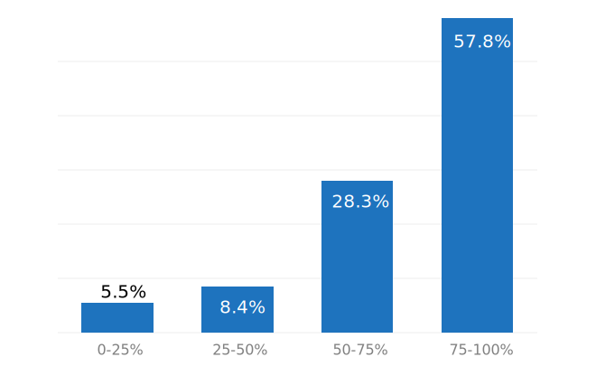

   Figure: Actual Role Breakdown (% of day-to-day tasks related to documentation)

--------------

.. _h.o4jrcdq48j67:

.. _h.67gf8afu01ua:

Section 2: Work Location and COVID-19
-------------------------------------

In 2019, we included one question about work location: whether the
respondent worked on site, remotely, or a combination of the two; the
possible responses were arranged to also show if the work location was
stipulated by the employer or the individual’s own choice.

We found that 56% of respondents worked completely on site, more than
half of them by choice, and 17% worked completely remotely, three
quarters of them by choice. The remaining 27% split their time between
onsite and remote work.

In 2020, the COVID-19 pandemic caused huge upheavals in the way that we
work, particularly with regard to work location, so this question was
converted into a whole new section.

--------------

.. _h.9iwji8l9lui8:

.. _h.bw1go4xu42f5:

Work Location
~~~~~~~~~~~~~

.. container:: question

   .. rubric:: What we asked
                                                                         
   9. Has your work location (i.e. onsite, remote) been affected by      
   COVID-19 (temporarily or permanently)?                                
                                                                         
   -  Yes                                                                
   -  No                                                                 
                                                                         
   The following questions (9a-9d) were shown to respondents who         
   answered “yes”:                                                       
                                                                         
   9a. Before COVID-19, what was your work location?                     
                                                                         
   -  I was required to be on-site full time                             
   -  I was on-site full time, but it was not required                   
   -  I was partially on-site, and partially remote                      
   -  I was fully remote, but it was by choice (i.e. an office location  
      was available to me)  
   -  I was fully remote, and it was required (i.e. no office location   
      was available to me)            
                                                                         
   9b. Since COVID-19, what is your work location?                       
                                                                         
   -  I am required to be on-site full time                              
   -  I am on-site full time, but it is not required                     
   -  I am partially on-site, and partially remote                       
   -  I am fully remote, but it is by choice (i.e. an office location is 
      available to me)                                                   
   -  I am fully remote, and it is required (i.e. no office location is  
      available to me)                                                                            
                                                                         
   9c. Do you expect your work location change to be permanent?          
                                                                         
   -  Yes                                                                
   -  No                                                                 
   -  Probably yes                                                       
   -  Probably no                                                        
   -  I do not know                                                      
                                                                         
   9d. How do you feel about the change to your work location?           
                                                                         
   -  Very negative                                                      
   -  Negative                                                           
   -  Neutral                                                            
   -  Positive                                                           
   -  Very positive                                                      
                                                                         
   The following questions (9e-9f) were shown to respondents who         
   answered “no” to question 9:                                          
                                                                         
   9e. What is your work location?                                       
                                                                         
   -  I am required to be on-site full time                              
   -  I am on-site full time, but it is not required                     
   -  I am partially on-site, and partially remote                       
   -  I am fully remote, but it is by choice (i.e. an office location is 
      available to me)                                                   
   -  I am fully remote, and it is required (i.e. no office location is  
      available to me)                                                   
                                                                         
   9f. How do you feel about your work location?                         
                                                                         
   -  Very negative                                                      
   -  Negative                                                           
   -  Neutral                                                            
   -  Positive                                                           
   -  Very positive                                                      

.. _h.ai9zky1g4jbi:

.. _h.g00o8i93w80k:

Work Location Changes due to COVID-19
^^^^^^^^^^^^^^^^^^^^^^^^^^^^^^^^^^^^^
80% of respondents said that their work location had changed, either
permanently or temporarily, due to COVID-19.

Note: a small number of respondents answered “yes” to the question of
whether their work location had changed due to COVID-19, but then
selected the same option for work location before and after/since the
pandemic. These responses were filtered out of the table below but not
out of the rest of the figures for this section, as we assumed that
“yes, things have changed” was the significant response, and the options
presented for remote and onsite work perhaps did not account for all the
subtleties of work location that are possible.

Overwhelmingly and unsurprisingly, the bulk of the changes reported are
from working on-site to working remote.

Of those reporting changes, nearly half (48.5%) had previously been
required to be on-site. Of those respondents, 50% were now required to
be remote, 35% were given the option to work remotely, and another 11.5%
were now partially onsite and partially remote. Only 3% were now working
onsite.

.. table:: Work Location Changes due to COVID-19
   :width: 100%
   :name: tbl-covid-changes-location

   +-----------------------+-----------------------+------------+
   | Pre-COVID-19          | Post-COVID-19         | % of Total |
   +=======================+=======================+============+
   | Onsite - required     | Remote - required     | 25.69%     |
   +-----------------------+-----------------------+------------+
   | Onsite - required     | Remote - not required | 17.89%     |
   +-----------------------+-----------------------+------------+
   | Partial               | Remote - required     | 15.94%     |
   +-----------------------+-----------------------+------------+
   | Onsite - not required | Remote - required     | 12.36%     |
   +-----------------------+-----------------------+------------+
   | Partial               | Remote - not required |  8.62%     |
   +-----------------------+-----------------------+------------+
   | Onsite - not required | Remote - not required |  7.48%     |
   +-----------------------+-----------------------+------------+
   | Onsite - required     | Partial               |  5.86%     |
   +-----------------------+-----------------------+------------+
   | Onsite - not required | Partial               |   2.6%     |
   +-----------------------+-----------------------+------------+
   | Remote - not required | Remote - required     |  2.11%     |
   +-----------------------+-----------------------+------------+
   | Other                 |                       |  1.46%     |
   +-----------------------+-----------------------+------------+

Respondents who indicated that they had experienced a work location
change due to COVID-19 were asked if they thought that the changes would
be permanent or temporary, and also how they felt about the change.

Opinions on the permanency of the changes were quite evenly spread -
however those who predicted “no” (25.4%) or “probably no” (22.2%) - a
combined 47.6% - outweighed those that predicted “yes” (13.2%) or
“probably yes” (22.9%) - a combined 36.1%.
 
 .. figure:: images/2020/permenancy-location-change.svg
   :alt: Figure: Permanency of Work Location Changes

   Figure: Predicted Permanency of Work Location Changes
 
While other aspects of living through a pandemic might be challenging, a
large proportion of respondents reported finding a silver lining in work
location changes. More than 60% of respondents reported feeling
“positive” (34.11%) or “very positive” (26.51%) about the change, 27.29%
felt “neutral”, and only 12.09% reported feeling “negative” (11.47%) or
“very negative” (0.62%, or 4 individuals).

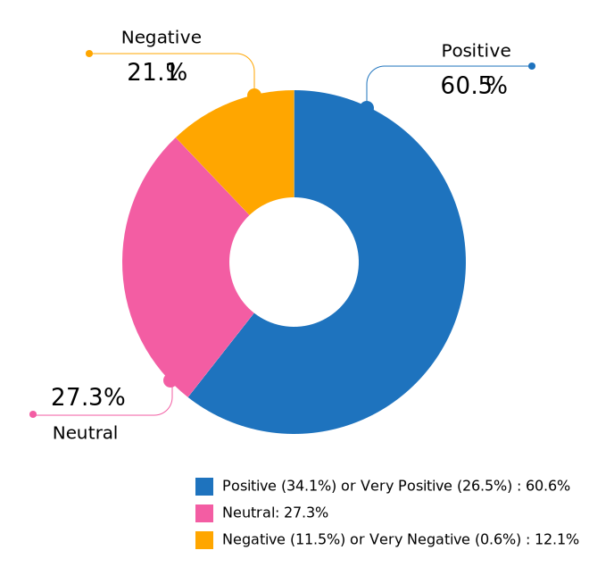

   Figure: Feelings About Work Location Change

--------------

.. _h.xvhht34qf1cm:

.. _h.7btw5lpuhsu:

Work Location Unchanged
'''''''''''''''''''''''

Of those respondents (20%) who indicated that their work location had
not changed due to COVID-19, 45% were required to be remote, 38.7% were
remote by choice, and 6.3% were partially onsite and partially remote.
Only 10% (16 individuals) worked onsite, either by choice (5%) or
necessity (5%).

.. figure:: images/2020/work-location-unchanged.svg
   :alt: Figure: Work Location (unchanged since COVID-19)

   Figure: Work Location (unchanged since COVID-19)

--------------

In response to their feelings about their work location, of the 83.8%
that worked remotely, 67.9% reported feeling “very positive” and 24.6%
reported “positive”. 10 individuals (7.5%) were “neutral” about their
work location, and no remote workers in this group felt at all negative
about the situation.

Similarly, no negativity was reported from the 16 respondents in this
group who worked on-site. Half of the on-site workers felt “very
positive” and the other half were split between “positive” and
 “neutral”. In fact, only 1 respondent - from the “partially remote,
partially onsite” segment - reported feeling “negative” about their work
location, and no one reported feeling “very negative”.

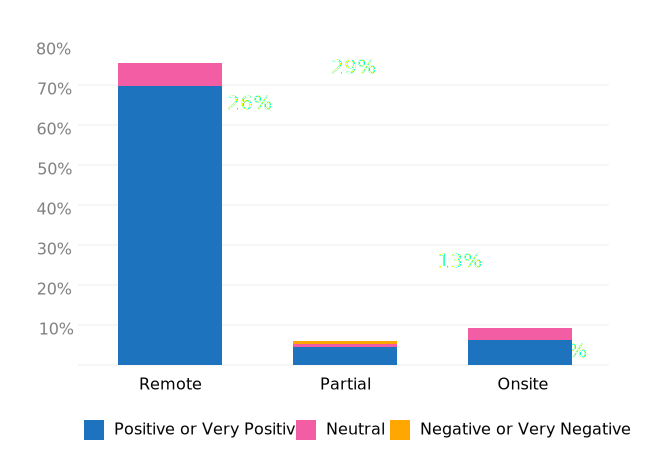

   Figure: Feelings about Work Location (where work location is unchanged since COVID-19)

.. _h.ynoi7l698d10:

Overall Work Location
'''''''''''''''''''''

Combining the results for respondents whose work location has changed
with those whose location has not gives a snapshot of the work location
of the whole community, both before the pandemic started and in the
latter half of 2020.

What comes out is - again, unsurprisingly - a complete reversal: prior
to the pandemic, more than half of respondents (58.26%) worked in
offices, but since COVID-19 that number has shrunk to only 3.6%. Remote
workers made up 20.62% of the pre-COVID-19 workforce; whereas the
pandemic has moved 87.7% of workers to remote.

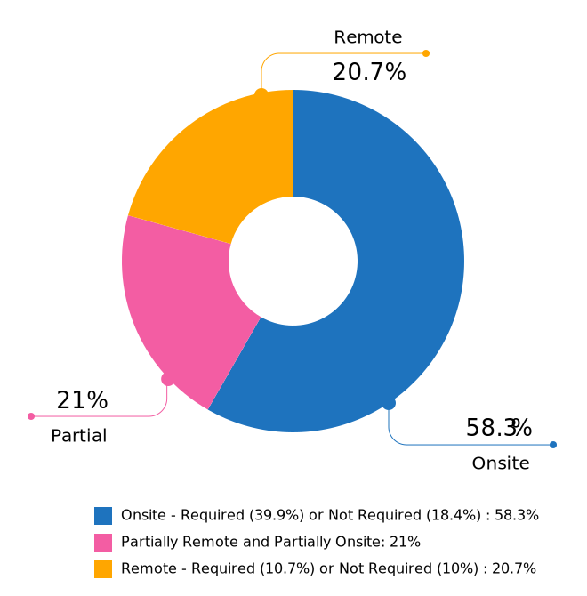

   Figure: Pre-COVID-19 Work Location - Overall
   
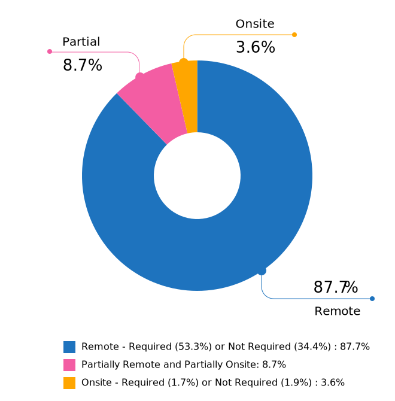

   Figure: Post-COVID-19 Work Location - Overall

--------------

.. _h.40anqossrxbh:

Other Changes Due to COVID-19
~~~~~~~~~~~~~~~~~~~~~~~~~~~~~

.. container:: question

   .. rubric:: What we asked
                                                                         
   10. Other than work location, has your employment been affected by    
   COVID-19? Check all that apply.                                       
                                                                         
   Note:                                                                 
   If your employment has not been affected, please check "none of the   
   above".                                                               
                                                                         
   If you have changed jobs since the pandemic started, please only      
   choose "I changed roles" if COVID-19 was a factor in this change.     
                                                                         
   -  Social distancing measures have been introduced in my workplace    
      (masks, distance between desks, maximum people in a room, online   
      meetings only etc)                                                 
   -   My hours have changed                                             
   -   I was furloughed                                                  
   -   I was laid off                                                    
   -   I changed roles (within the same organization)                    
   -   I changed roles (started work with a different organization)      
   -   Other (please specify)                                            
   -   None of the above                                                 

.. _h.thwzeueyahop:

.. _h.ktotl8ql9oy:

-  11.8% of respondents reported that their work situation had not been
   affected by COVID-19 in any way,
-  36.4% said that social distancing measures had been introduced in the
   workplace,
-  10.2% had their hours changed,
-  2.5% were furloughed,
-  3.9% were laid off,
-  9.2% of respondents moved to a new role in a new organization as a
   result of the pandemic, and
-  2.7% changed roles within the same organization.

.. table:: COVID-19 Changes (other than work location)
   :width: 80%
   :name: tbl-covid-changes-other

   +----------------------------------+-------------+
   | Change                           |  % of Total |
   +==================================+=============+
   | Work Location                    |     80.1%   |
   +----------------------------------+-------------+
   | Social Distancing                |     36.4%   |
   +----------------------------------+-------------+
   | Hours Changed                    |     10.2%   |
   +----------------------------------+-------------+
   | Changed Role (new organization)  |     9.2%    |
   +----------------------------------+-------------+
   | Laid Off                         |     3.9%    |
   +----------------------------------+-------------+
   | Changed Role (same organization) |     2.7%    |
   +----------------------------------+-------------+
   | Furloughed                       |     2.5%    |
   +----------------------------------+-------------+

8.9% of respondents gave additional information about other changes they
had experienced. These included:

Changes related to salary and benefits:

-  Salary cuts - both permanent and temporary
-  Raises and bonuses postponed or cancelled
-  Benefits reduced (e.g. 401k matching, commuting benefits)
-  Salaries paid late

Changes related to workload:

-  Reductions in the amount of work available
-  Increased workload
-  Increased overtime
-  More time required for people and project management
-  Increased oversight on productivity and time tracking

Changes related to personnel:

-  Hiring freezes and upcoming contracts cancelled
-  Team reorganizations and company restructures

Changes related to travel and events:

-  Work travel cancelled
-  In-person training, workshops, summits etc cancelled or shifted
   online

Some respondents called out positive changes: remote workers in
companies who felt disadvantaged compared to their onsite colleagues
found the playing field levelled as everyone was forced to work from
home; others found themselves growing professionally as they took on new
responsibilities. Several reported being able to get more done in their
new work location, although missing social interaction with colleagues
was seen as a downside by some.

--------------

.. _h.4nnwrkosj7n9:

.. _h.8aa942x2ky3i:

Section 3: Salary Information
-----------------------------

In 2019, as well as the all-important salary figure and a list of
benefits, we asked for the respondent’s level of satisfaction with their
salary and job, and if relevant, their reasons for dissatisfaction.

Upon reviewing the responses, it became apparent that we had
over-simplified a complex concept. Level of satisfaction with salary and
level of satisfaction with a job overall are often separate and distinct
- it is entirely possible to be extremely satisfied with every aspect of
a position other than the salary, and the reverse can also be true.

In 2020, we separated these two aspects - salary satisfaction and
overall job satisfaction - as well as providing a new section designed
for contractors, freelancers and independent operators with different
options for payment models (hourly rates, daily rates etc). Respondents
(both employees and independent contractors) were also able to specify
the currency that they were paid in.

.. _h.6kjlaj4kfell:

Salary - Employees
~~~~~~~~~~~~~~~~~~

.. container:: question

   .. rubric:: What we asked
                                                                         
   11a. What currency are you paid in?                                   
                                                                         
   -  United States Dollar (USD)                                         
   -  Euro (EUR)                                                         
   -  Canadian Dollar (CAD)                                              
   -  Australian Dollar (AUD)                                            
   -  New Zealand Dollar (NZD)                                           
   -  British Pound Sterling (GBP)                                       
   -  Other (please specify)                                             
                                                                         
   11c. What is your yearly salary, before tax and without any           
   additional benefits?                                                  
                                                                         
   Note:                                                                 
   Please do not include the currency symbol or any decimal places.      
   Commas can be used for digit grouping in the US/UK style (e.g. 50,000). 
                                                                         
   Example:                                                              
   Person A receives $4,000 take home pay each month, but an additional  
   30% is automatically withheld by their employer for income tax.       
   Person A would enter 62,400 below (monthly amount multiplied by 12,   
   plus 30%).                                                            

.. _h.nftt0v8ki24c:

.. _h.c59g4m2157w7:

Notes
^^^^^

As over 95% of respondents reporting working between 30 and 80 hours per
week - a “full time” role - those reporting fewer than 30 hours have been
omitted from the figures in this section.

While the survey specifically requested annual salary, a number of
respondents entered monthly salary. Where it was obvious that this is
what had occurred, the numbers were multiplied by 12 for the result
sets. There were 4 individual results where we could not be certain if
the salary figure was monthly or if a currency notation error had been
made, so these results were omitted from this section.

The following figures are therefore based on a reduced result set of 729
full-time employees.

.. _h.ngkdplm8xcnw:

Overall Median Salary - Employees
^^^^^^^^^^^^^^^^^^^^^^^^^^^^^^^^^

The median salary across all regions, before tax and any additional
benefits, was USD $80,000 (meaning half of the respondents earned more,
and half earned less).

This figure does not take into account the socio-economic situation in
the countries of the very highest earners (the top 10 salaries were all
from the United States) and the very lowest (the bottom 10 salaries were
from Asia and South America) - as well as the difference between the
country of the employee and the country of the employer. Figures grouped
into regions make a more useful baseline from which to determine what
constitutes a “fair” salary.

.. _h.28lzmhy15fb8:

.. table:: Median Salary by Region/Country of Employee
   :widths: 25 25 15 35
   :width: 100%
   :name: tbl-median-salary-country-employee

   +---------------+------------+----------------------------------------+----------------------+
   | Region        | Sub-region | No.                                    |  Median Salary (USD) |
   +===============+============+========================================+======================+
   | North America |            |                   397                  |               98,000 |
   +---------------+------------+----------------------------------------+----------------------+
   |               | USA        |                   348                  |              103,250 |
   +---------------+------------+----------------------------------------+----------------------+
   |               | Canada     |                   49                   |               61,600 |
   +---------------+------------+----------------------------------------+----------------------+
   | Europe        |            |                   181                  |               50,250 |
   +---------------+------------+----------------------------------------+----------------------+
   |               | UK         |                   34                   |               78,154 |
   +---------------+------------+----------------------------------------+----------------------+
   |               | Germany    |                   20                   |               71,400 |
   +---------------+------------+----------------------------------------+----------------------+
   |               | Poland     |                   28                   |               29,430 |
   +---------------+------------+----------------------------------------+----------------------+
   |               | Russia     |                   12                   |               20,085 |
   +---------------+------------+----------------------------------------+----------------------+
   | Oceania       |            |                   42                   |               80,290 |
   +---------------+------------+----------------------------------------+----------------------+
   | Asia          |            |                   43                   |               19,600 |
   +---------------+------------+----------------------------------------+----------------------+
   |               | India      |                   30                   |               19,600 |
   +---------------+------------+----------------------------------------+----------------------+
   | South America |            |                   16                   |               12,122 |
   +---------------+------------+----------------------------------------+----------------------+
   | Israel        |            |                   47                   |               90,000 |
   +---------------+------------+----------------------------------------+----------------------+

.. _h.3gbl0zy7nqr:

.. table:: Median Salary by Region/Country of Employer
   :widths: 25 25 15 35
   :width: 100%
   :name: tbl-median-salary-country-employer
   
   +---------------+------------+----------------------+---------------------+
   | Region        | Sub-region | No.                  | Median Salary (USD) |
   +===============+============+======================+=====================+
   | North America |            |          379         |              92,000 |
   +---------------+------------+----------------------+---------------------+
   |               | USA        |          351         |              95,000 |
   +---------------+------------+----------------------+---------------------+
   |               | Canada     |          28          |              56,980 |
   +---------------+------------+----------------------+---------------------+
   | Multinational |            |          145         |              83,080 |
   +---------------+------------+----------------------+---------------------+
   | Europe        |            |          114         |              48,106 |
   +---------------+------------+----------------------+---------------------+
   |               | UK         |          24          |              74,839 |
   +---------------+------------+----------------------+---------------------+
   |               | Germany    |          14          |              59,143 |
   +---------------+------------+----------------------+---------------------+
   |               | Poland     |          12          |              30,510 |
   +---------------+------------+----------------------+---------------------+
   |               | France     |          12          |              52,717 |
   +---------------+------------+----------------------+---------------------+
   | Oceania       |            |          23          |              70,300 |
   +---------------+------------+----------------------+---------------------+
   | Asia          |            |          26          |              23,100 |
   +---------------+------------+----------------------+---------------------+
   |               | India      |          15          |              19,600 |
   +---------------+------------+----------------------+---------------------+
   | South America |            |          11          |              10,830 |
   +---------------+------------+----------------------+---------------------+
   | Israel        |            |          30          |              91,800 |
   +---------------+------------+----------------------+---------------------+

.. _h.icddugtseuyl:

.. _h.9aqux01xcsln:

Note: median figures are not broken out for countries with fewer than 10 responses.

Currencies
^^^^^^^^^^

Respondents reported being paid in a total of 31 different currencies. Where the location country of the respondent and the location country of the employer organization were different, in most cases the respondent was paid in the currency of their location country (possibly for legal reasons, in many cases). There were 21 individual exceptions to this rule, with some respondents located in Ukraine, Romania, Serbia, Belarus, Canada, Argentina, Vietnam and Colombia being paid in the currency of their employer's country.

The exact exchange rates used to convert the salary figures to USD are listed in the table below.

.. table:: Exchange Rate (to 1 USD) as of Nov 2020
   :widths: 55 15 15 15 
   :width: 100%
   :name: tbl-currencies
   
   +----------------------+------+-----+----------+
   | Currency             | Code | No. | Rate     |
   +======================+======+=====+==========+
   | United States Dollar | USD  | 370 | 1        |
   +----------------------+------+-----+----------+
   | Euro                 | EUR  | 77  | 1.19     |
   +----------------------+------+-----+----------+
   | New Israeli Sheqel   | ILS  | 47  | 0.3      |
   +----------------------+------+-----+----------+
   | Canadian Dollar      | CAD  | 46  | 0.77     |
   +----------------------+------+-----+----------+
   | Australian Dollar    | AUD  | 40  | 0.74     |
   +----------------------+------+-----+----------+
   | Great Britain Pound  | GBP  | 34  | 1.34     |
   +----------------------+------+-----+----------+
   | Indian Rupee         | INR  | 30  | 0.014    |
   +----------------------+------+-----+----------+
   | Polish Zloty         | PLN  | 28  | 0.27     |
   +----------------------+------+-----+----------+
   | Brazilian Real       | BRL  | 14  | 0.19     |
   +----------------------+------+-----+----------+
   | Russian Ruble        | RUB  | 10  | 0.013    |
   +----------------------+------+-----+----------+
   | Swedish Krona        | SEK  | 5   | 0.12     |
   +----------------------+------+-----+----------+
   | Czech Koruna         | CZK  | 3   | 0.046    |
   +----------------------+------+-----+----------+
   | Romanian Leu         | RON  | 3   | 0.24     |
   +----------------------+------+-----+----------+
   | New Zealand Dollar   | NZD  | 2   | 0.7      |
   +----------------------+------+-----+----------+
   | Rand                 | ZAR  | 2   | 0.066    |
   +----------------------+------+-----+----------+
   | Korean Wan           | KRW  | 2   | 0.0009   |
   +----------------------+------+-----+----------+
   | Indonesian Rupiah    | IDR  | 2   | 0.000071 |
   +----------------------+------+-----+----------+
   | New Taiwan Dollar    | TWD  | 1   | 0.035    |
   +----------------------+------+-----+----------+
   | Ukrainian Hryvnia    | UAH  | 1   | 0.035    |
   +----------------------+------+-----+----------+
   | Kenyan Shilling      | KES  | 1   | 0.0091   |
   +----------------------+------+-----+----------+
   | Philippine Peso      | PHP  | 1   | 0.021    |
   +----------------------+------+-----+----------+
   | Japanese Yen         | JPY  | 1   | 0.0096   |
   +----------------------+------+-----+----------+
   | Norwegian Krone      | NOK  | 1   | 0.11     |
   +----------------------+------+-----+----------+
   | Hong Kong Dollar     | HKD  | 1   | 0.13     |
   +----------------------+------+-----+----------+
   | Pakistan Rupee       | PKR  | 1   | 0.0063   |
   +----------------------+------+-----+----------+
   | Hungarian Forint     | HUF  | 1   | 0.0033   |
   +----------------------+------+-----+----------+
   | Mexican Peso         | MXN  | 1   | 0.05     |
   +----------------------+------+-----+----------+
   | Croatian Kuna        | HRK  | 1   | 0.16     |
   +----------------------+------+-----+----------+
   | Bangladeshi Taka     | BDT  | 1   | 0.012    |
   +----------------------+------+-----+----------+
   | Swiss Franc          | CHF  | 1   | 1.1      |
   +----------------------+------+-----+----------+
   | Danish Krone         | DKK  | 1   | 0.16     |
   +----------------------+------+-----+----------+

.. _h.uv7bee10mpdu:

Additional Benefits - Employees
^^^^^^^^^^^^^^^^^^^^^^^^^^^^^^^

.. container:: question

   .. rubric:: What we asked
                                                                         
   12. Does your salary package include any additional benefits? Check   
   all that apply.                                                       
                                                                         
   -  Paid vacation time (in excess of government-mandated minimums)     
   -  Health insurance (in excess of government-mandated minimums)       
   -  Pension, superannuation, or retirement fund (in excess of any      
      government-mandated minimums)                                      
   -   Stocks, shares, stock options, or equity                          
   -   Commission payments                                               
   -   Bonus payments                                                    
   -   Professional development / ongoing education / conference budget  
   -   Meals, meal vouchers, or food-related benefits                    
   -   Gym, fitness, sport, or other wellness-related benefits           
   -   Other types of insurance e.g. life insurance, accident insurance, 
      income protection insurance                                        
   -   Paid parental leave (in excess of government-mandated minimum)    
   -   Time off or bonuses for community-related activities              
   -   Unlimited PTO (paid/personal time off)                            
   -   None of the above                                                 
   -   Other (please specify)                                            

.. _h.ury4804ee83n:

.. _h.82paah39bexu:

.. _h.xxbkvlsxlohc:

For this section, we included the respondents with ambiguous salary
numbers that were excluded from the salary section, and also included
those working fewer than 30 hours per week - bringing the total number
to 750, or all respondents who identified as employees.

In 2019, this section caused some debate due to the differences in labor
laws in different countries: in almost all countries apart from the US,
employees are entitled to paid vacation time and paid sick leave by law,
and many also mandate pension contributions and/or paid parental leave.
Similarly, many countries have universal health care, negating the need
for employer-provided health cover. To make this clearer, in 2020 we
asked respondents to only check the boxes for vacation time, health
insurance, pension plans and parental leave if their employee benefit
was in excess of what was required by law in the country where they
live.

.. table:: Additional Employee Benefits
   :widths: 80 20
   :width: 100%
   :name: tbl-additional-benefits-employees

   +-----------------------------------------------------------------------------------------------+------------------+
   | Benefit                                                                                       | % of Total       |
   +===============================================================================================+==================+
   | Health insurance \*                                                                           |           75.60% |
   +-----------------------------------------------------------------------------------------------+------------------+
   | Paid vacation time \*                                                                         |           70.90% |
   +-----------------------------------------------------------------------------------------------+------------------+
   | Professional development / ongoing education / conference budget                              |           51.90% |
   +-----------------------------------------------------------------------------------------------+------------------+
   | Bonus/Commission payments                                                                     |           49.40% |
   +-----------------------------------------------------------------------------------------------+------------------+
   | Pension, superannuation, or retirement fund \*                                                |           48.80% |
   +-----------------------------------------------------------------------------------------------+------------------+
   | Other types of insurance e.g. life insurance, accident insurance, income protection insurance |           45.30% |
   +-----------------------------------------------------------------------------------------------+------------------+
   | Stocks, shares, stock options, or equity                                                      |           44.90% |
   +-----------------------------------------------------------------------------------------------+------------------+
   | Gym, fitness, sport, or other wellness-related benefits                                       |           40.50% |
   +-----------------------------------------------------------------------------------------------+------------------+
   | Paid parental leave \*                                                                        |           37.47% |
   +-----------------------------------------------------------------------------------------------+------------------+
   | Meals, meal vouchers, or food-related benefits                                                |           32.50% |
   +-----------------------------------------------------------------------------------------------+------------------+
   | Time off or bonuses for community-related activities                                          |           27.73% |
   +-----------------------------------------------------------------------------------------------+------------------+
   | Unlimited PTO (paid/personal time off)                                                        |           21.87% |
   +-----------------------------------------------------------------------------------------------+------------------+
   | None                                                                                          |            3.20% |
   +-----------------------------------------------------------------------------------------------+------------------+

\* In excess of any government-mandated minimums

Of the respondents who chose “other” and entered details of their
additional benefits, most could be mapped to one of the existing
categories. The ones that could not (and which were mentioned by more
than one respondent) included:

-  Transportation benefits - including company vehicle and public
   transport passes or reimbursements
-  Co-working or home office budget
-  Phone and internet cost reimbursement

--------------

.. _h.d1bvk2j618c1:

.. _h.uzawuco1e56:

Salary Satisfaction - Employees
^^^^^^^^^^^^^^^^^^^^^^^^^^^^^^^

.. container:: question

   .. rubric:: What we asked
                                                                         
   13. How satisfied are you with your current salary and benefits?      
                                                                         
   -  Very unsatisfied                                                   
   -  Unsatisfied                                                        
   -  Neutral                                                            
   -  Satisfied                                                          
   -  Very satisfied                                                     

.. _h.u1fcrkhtlu2z:

.. _h.27k9816btjio:

On the whole, most employee respondents were satisfied (40.27%) or very
satisfied (31.87%) with their salary and benefits. Those with neutral
feelings made up 17.2% of employees, with those that were unsatisfied
(8.8%) or very unsatisfied (1.87%) in the minority.  

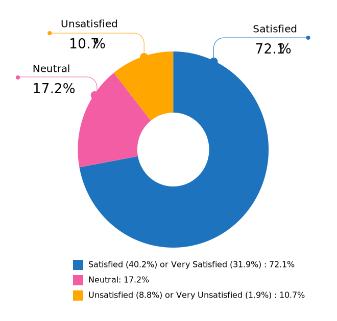

   Figure: Salary Satisfaction (Employees)

--------------

.. _h.m1e5r8v9zp8:

.. _h.iaqpgx5t6vx2:

Reasons for Salary Dissatisfaction - Employees
^^^^^^^^^^^^^^^^^^^^^^^^^^^^^^^^^^^^^^^^^^^^^^

.. container:: question

   .. rubric:: What we asked
                                                                         
   13b. If you are not completely satisfied with your salary or          
   benefits, is it because (check all that apply, or check "none of the  
   above"):                                                              
                                                                         
   -  Salary is too low                                                  
   -  Benefits are missing or insufficient                               
   -  Discrepancy between salary and cost of living in my area           
   -  Unfair or inconsistent salary across similar roles in my           
      organization                                                       
   -  I work too many hours                                              
   -  I don't work enough hours                                          
   -  Responsibilities exceed pay grade                                  
   -  Other (please specify)                                             
   -  None of the above                                                  

.. _h.vafe1wjkp8se:

.. _h.f5gt8chok72i:

Of the respondents who indicated that they were not “very satisfied”
with their salary and/or benefits, 127 did not specify a reason.

.. table:: Reasons for Salary Dissatisfaction (Employees)
   :widths: 70 30
   :width: 100%
   :name: tbl-salary-dissatisfaction-reasons-employees

   +-----------------------------------------------------------------------+--------------------------------+
   | Reason                                                                |  % of dissatisfied             |
   +=======================================================================+================================+
   | Salary is too low                                                     |              36.99%            |
   +-----------------------------------------------------------------------+--------------------------------+
   | Responsibilities exceed pay grade                                     |              26.61%            |
   +-----------------------------------------------------------------------+--------------------------------+
   | Benefits missing or insufficient                                      |              19.96%            |
   +-----------------------------------------------------------------------+--------------------------------+
   | Unfair or inconsistent salary across similar roles in my organization |              17.03%            |
   +-----------------------------------------------------------------------+--------------------------------+
   | Discrepancy between salary and cost of living in my area              |              13.89%            |
   +-----------------------------------------------------------------------+--------------------------------+
   | I work too many hours                                                 |              9.39%             |
   +-----------------------------------------------------------------------+--------------------------------+
   | I don't work enough hours                                             |              0.78%             |
   +-----------------------------------------------------------------------+--------------------------------+

.. _h.9vn8g9rj8ar:

Job Satisfaction - Employees
^^^^^^^^^^^^^^^^^^^^^^^^^^^^

.. container:: question

   .. rubric:: What we asked
                                                                         
   14. How satisfied are you with your current job overall?              
                                                                         
   -  Very unsatisfied                                                   
   -  Unsatisfied                                                        
   -  Neutral                                                            
   -  Satisfied                                                          
   -  Very satisfied                                                     

.. _h.z128ssyjd5kp:

.. _h.lqogmyfxvbat:

.. _h.3nlrfzylfisp:

Three quarters of respondents were “satisfied” (45.73%) or “very
satisfied” (29.6%) with their job overall. 16.53% indicated “neutral”
feelings, with less than 10% indicating they were “unsatisfied” (6.27%)
or “very unsatisfied” (1.87%, or 14 individuals).

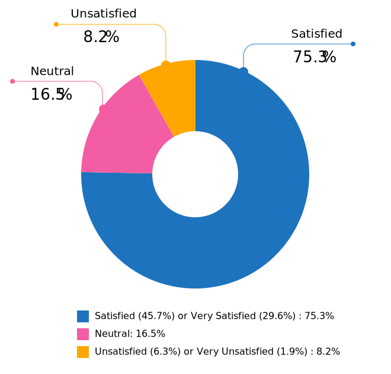

   Figure: Overall Job Satisfaction (Employees)

--------------

.. _h.9vn8g9rj8ar-1:

.. _h.75ltpl28q7ms:

Reasons for Overall Job Dissatisfaction - Employees
^^^^^^^^^^^^^^^^^^^^^^^^^^^^^^^^^^^^^^^^^^^^^^^^^^^

.. container:: question

   .. rubric:: What we asked
                                                                         
   14b. If you are not completely satisfied with your job, is it because 
   (check all that apply, or check "none of the above"):                 
                                                                         
   -  My workload is too high                                            
   -  My workload is too low                                             
   -  There is too much stress or pressure                               
   -  The work is not interesting or challenging enough                  
   -  Role is undervalued or underfunded                                 
   -  No opportunities for advancement                                   
   -  Unsupportive work environment                                      
   -  Insufficient opportunities for professional development            
   -  Outdated toolset                                                   
   -  Management not open to change                                      
   -  No opportunity for remote work                                     
   -  I don't feel supported as a remote worker                          
   -  I don't feel respected                                             
   -  I am discriminated against on the basis of gender                  
   -  I am discriminated against on the basis of race or nationality     
   -  I am discriminated against on the basis of age                     
   -  I am discriminated against on the basis of education level         
   -  Other (please specify)                                             
   -  None of the above                                                  

.. _h.2jypcom8j2ab:

.. _h.te5nwngm4rb3:

.. _h.h3is3pda4wyd:

19 respondents - including 2 who indicated that they were “very
unsatisfied” with their overall job situation - did not indicate a
reason for dissatisfaction.

.. table:: Reasons for Overall Dissatisfaction (Employees)
   :widths: 70 30
   :width: 100%
   :name: tbl-overall-dissatisfaction-reasons-employees

   +----------------------------------------------------------------+--------------------------------+
   | Reason                                                         |  % of dissatisfied             |
   +================================================================+================================+
   | Role is undervalued or underfunded                             |              46.02%            |
   +----------------------------------------------------------------+--------------------------------+
   | No opportunities for advancement                               |              27.65%            |
   +----------------------------------------------------------------+--------------------------------+
   | My workload is too high                                        |              24.81%            |
   +----------------------------------------------------------------+--------------------------------+
   | The work is not interesting or challenging enough              |              22.16%            |
   +----------------------------------------------------------------+--------------------------------+
   | There is too much stress or pressure                           |              21.59%            |
   +----------------------------------------------------------------+--------------------------------+
   | Insufficient opportunities for professional development        |              21.4%             |
   +----------------------------------------------------------------+--------------------------------+
   | Outdated toolset                                               |              20.27%            |
   +----------------------------------------------------------------+--------------------------------+
   | Management not open to change                                  |              16.29%            |
   +----------------------------------------------------------------+--------------------------------+
   | I don’t feel respected                                         |              15.15%            |
   +----------------------------------------------------------------+--------------------------------+
   | Unsupportive work environment                                  |              12.69%            |
   +----------------------------------------------------------------+--------------------------------+
   | My workload is too low                                         |              3.98%             |
   +----------------------------------------------------------------+--------------------------------+
   | I don’t feel supported as a remote worker                      |              3.98%             |
   +----------------------------------------------------------------+--------------------------------+
   | No opportunity for remote work                                 |              3.41%             |
   +----------------------------------------------------------------+--------------------------------+
   | I am discriminated against on the basis of gender              |              3.03%             |
   +----------------------------------------------------------------+--------------------------------+
   | I am discriminated against on the basis of age                 |              2.84%             |
   +----------------------------------------------------------------+--------------------------------+
   | I am discriminated against on the basis of race or nationality |              0.76%             |
   +----------------------------------------------------------------+--------------------------------+
   | I am discriminated against on the basis of education level     |              0.38%             |
   +----------------------------------------------------------------+--------------------------------+

Of the respondents who chose “Other” and provided detail, the common
themes were:

-  Too many meetings or bureaucratic overhead
-  Frustration with competency of team members or management
-  Bullying and/or harassment
-  Instability (both related to COVID-19 and general)
-  Politics within the organization

--------------

.. _h.mlr7o5huxglp:

.. _h.qtod9j3w960q:

Salary - Independent Contractors, Freelancers, and Self-Employed
~~~~~~~~~~~~~~~~~~~~~~~~~~~~~~~~~~~~~~~~~~~~~~~~~~~~~~~~~~~~~~~~

Due to the low number of responses and danger of exposing identifiable data, salary data for independent contractors, freelancers and the self-employed could not be calculated in the same way as for employees. Data for this section will be released in a report update once it has been processed. 

--------------

.. _h.vukt8j30sxvr:

.. _h.icsaw01cvshe:

Section 4: Organization Demographics
------------------------------------

Some issues with clarity of questions in this section in the 2019 survey
meant that much of the data was not particularly useful. For 2020, we
re-worded the questions and added additional notes.

Contractors were asked to answer this section based either on their main
client or contract, or their typical client or contract.

.. _h.kb15hpmkb6wh:

Organization Size
~~~~~~~~~~~~~~~~~

.. container:: question

   .. rubric:: What we asked
                                                                         
   15. What is the approximate size of your organization, in number of   
   employees?                                                            
                                                                         
   -  Less than 10                                                       
   -  10 - 50                                                            
   -  50 - 100                                                           
   -  100 - 1000                                                         
   -  1000 - 10,000                                                      
   -  10,000 - 100,000                                                   
   -  More than 100,000                                                  

.. _h.51jh3h13lsy2:

.. _h.94u4s757uj73:

.. _h.kzi1mox14328:

Very small operations of 1-10 employees only represented just 1.4% of
the total (11 responses). 10-50 employee operations accounted for
another 7.8%, with the 50-100 employee bracket next at 9.7%.

The next option, 100-1000 employees, had the largest number of responses
at 35%, and another 24.2% went to organizations made up of 1,000-10,000
employees. 10,000-100,000 employee operations employed 12.4% of
respondents, and the largest bracket, over 100,000 employees, accounted
for the final 9.4%.

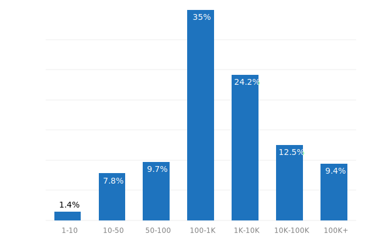

   Figure: Organization Size (number of employees)

--------------

.. _h.b1wkbzdgh4g6:

.. _h.mk53cpv01nrf:

Industry
~~~~~~~~

.. container:: question

   .. rubric:: What we asked
                                                                         
   16. What industry does your organization operate in?                  
                                                                         
   Note: for software development and IT companies:                      
   Please choose the industry that your product or service primarily     
   serves.                                                               
                                                                         
   For example, if your organization produces e-learning software,       
   select "Education, Training". If you work for a company that makes    
   point of sale systems for restaurants, select "Food, Beverages".      
                                                                         
   Please only select "Software Development, Software Development Tools" 
   if your organization's customers are software developers.             
                                                                         
   -  Advertising, Marketing                                             
   -  Agriculture                                                        
   -  Airlines, Aerospace, Defense, Military                             
   -  Automotive                                                         
   -  Business Support, Professional Services, Sales, Consulting         
   -  Construction, Machinery, Homes                                     
   -  Education, Training                                                
   -  Entertainment, Leisure, Gaming                                     
   -  Finance, Banking, Financial Services, Financial Technology         
   -  Food, Beverages                                                    
   -  Government                                                         
   -  Healthcare, Medical, Pharmaceuticals, Biotechnology                
   -  Insurance                                                          
   -  Legal Services                                                     
   -  Manufacturing, Hardware                                            
   -  Media, Radio, TV, Journalism                                       
   -  Non-profit, Community                                              
   -  Retail, Consumer Products                                          
   -  Real Estate                                                        
   -  Science, Research                                                  
   -  Security                                                           
   -  Software Development, Software Development Tools (not              
      industry-specific)                                                 
   -  Telecommunications, Technology, Internet, Electronics              
   -  Transportation, Delivery, Logistics, GPS, Mapping                  
   -  Travel, Hotels                                                     
   -  Utilities, Energy, Mining, Extraction                              

.. _h.xssp95t724sg:

.. _h.90vpmf1nt9st:

.. _h.2mven1a5yjly:

The notes for this question clarified that respondents who work in IT
and software should choose the industry that their organization
services, after some confusion around this question in our 2019 survey.
While IT and software still accounted for the largest share of responses
- 36.3% - the spread of other industries gave a clearer picture of the
range of organizations employing documentarians in our community.

Telecommunications came in next at 15.2%, followed by Finance at 8.3%.
The next set of industries - Health, Professional Services, Security,
Advertising, Manufacturing, and Retail - each made up between 2% and 5%
of responses.

Education, Transport, Aerospace/Defence, Entertainment, Government,
Automotive, Construction and Utilities each accounted for between 10 and
15 responses each. Travel, Food, Science, Insurance, Non-Profit, Media,
Real Estate, Agriculture and Legal were selected by under 10 respondents
each.

The “Other” category was selected by 37 respondents. In all cases, the
entered field could be mapped to one of the categories listed.

--------------

.. table:: All Organization Industries
   :width: 100%
   :widths: 80 20
   :name: tbl-org-industries

   +--------------------------------------------------------------------------+------------+
   | Industry                                                                 | % of Total |
   +==========================================================================+============+
   | Software Development, Software Development Tools (not industry-specific) |     38.63% |
   +--------------------------------------------------------------------------+------------+
   | Telecommunications, Technology, Internet, Electronics                    |     15.28% |
   +--------------------------------------------------------------------------+------------+
   | Finance, Banking, Financial Services, Financial Technology               |      8.45% |
   +--------------------------------------------------------------------------+------------+
   | Healthcare, Medical, Pharmaceuticals, Biotechnology                      |      4.60% |
   +--------------------------------------------------------------------------+------------+
   | Business Support, Professional Services, Sales, Consulting               |      3.98% |
   +--------------------------------------------------------------------------+------------+
   | Security                                                                 |      3.35% |
   +--------------------------------------------------------------------------+------------+
   | Manufacturing, Hardware                                                  |      2.73% |
   +--------------------------------------------------------------------------+------------+
   | Retail, Consumer Products                                                |      2.73% |
   +--------------------------------------------------------------------------+------------+
   | Education, Training                                                      |      1.86% |
   +--------------------------------------------------------------------------+------------+
   | Transportation, Delivery, Logistics, GPS, Mapping                        |      1.86% |
   +--------------------------------------------------------------------------+------------+
   | Airlines, Aerospace, Defense, Military                                   |      1.74% |
   +--------------------------------------------------------------------------+------------+
   | Entertainment, Leisure, Gaming                                           |      1.49% |
   +--------------------------------------------------------------------------+------------+
   | Automotive                                                               |      1.37% |
   +--------------------------------------------------------------------------+------------+
   | Government                                                               |      1.37% |
   +--------------------------------------------------------------------------+------------+
   | Utilities, Energy, Mining, Extraction                                    |      1.37% |
   +--------------------------------------------------------------------------+------------+
   | Construction, Machinery, Homes                                           |      1.24% |
   +--------------------------------------------------------------------------+------------+
   | Travel, Hotels                                                           |      0.87% |
   +--------------------------------------------------------------------------+------------+
   | Food, Beverages                                                          |      0.62% |
   +--------------------------------------------------------------------------+------------+
   | Insurance                                                                |      0.62% |
   +--------------------------------------------------------------------------+------------+
   | Non-profit, Community                                                    |      0.62% |
   +--------------------------------------------------------------------------+------------+
   | Science, Research                                                        |      0.62% |
   +--------------------------------------------------------------------------+------------+
   | Media, Radio, TV, Journalism                                             |      0.50% |
   +--------------------------------------------------------------------------+------------+
   | Other                                                                    |      0.50% |
   +--------------------------------------------------------------------------+------------+
   | Real Estate                                                              |      0.37% |
   +--------------------------------------------------------------------------+------------+
   | Agriculture                                                              |      0.25% |
   +--------------------------------------------------------------------------+------------+
   | Legal Services                                                           |      0.12% |
   +--------------------------------------------------------------------------+------------+

--------------

.. _h.ttdz1cb2555x:

.. _h.gl0ydj4yv8b0:

Organization Location
~~~~~~~~~~~~~~~~~~~~~

.. container:: question

   .. rubric:: What we asked
                                                                         
   17. Where is your organization based?\*                               
                                                                         
   Note:                                                                 
   This is the primary location of the organization that you work for.   
   The location where you live will be covered in the next section.      
                                                                         
   -  Country                                                            
   -  State, Province, Territory or Region, if applicable                
   -  City                                                               

.. _h.chttanrzi2n:

.. _h.bt4xyiwl19t:

.. _h.wbslhhyt9pr0:

Respondents were asked to select the primary geographical location of
the organization that they work for.

The US accounted for 46.6% of the responses, the largest share. Second
after that was “Multi-national or global organization” with 20%.

37 other countries made up the remaining 33.4%. Israel (4.2%), Canada
(3.8%), United Kingdom (3.2%), Australia (2.9%) and India (2.4%) held
the highest share. Each of the other 31 countries listed accounted for
less than 2% of the total.

--------------

.. _h.iq745xeinf7k:

Section 5: Respondent Demographics
----------------------------------

.. _h.sljt9ro3aswr:

Age
~~~

.. container:: question

   .. rubric:: What we asked
                                                                         
   What is your age?                                                     
                                                                         
   -  18-25                                                              
   -  26-35                                                              
   -  36-45                                                              
   -  46-55                                                              
   -  56-65                                                              
   -  66+                                                                
   -  I'd rather not say                                                 

.. _h.r1ouunjt2fga:

.. vale off

.. _h.qravpnx0n97n:

The two largest-represented age groups (26 to 35-year-olds and 36 to 45-year-olds) 
combined formed 64% of the total respondents. 46 to 55-year-olds made
up 19.8%, and 56 to 65-year-olds another 9.4%.

The youngest age bracket took 5.7% of the total and the oldest bracket
(66+ years) took 0.6% or 5 individuals (there were no respondents in
this group in 2019).

.. vale on

2 respondents chose not to answer this question.

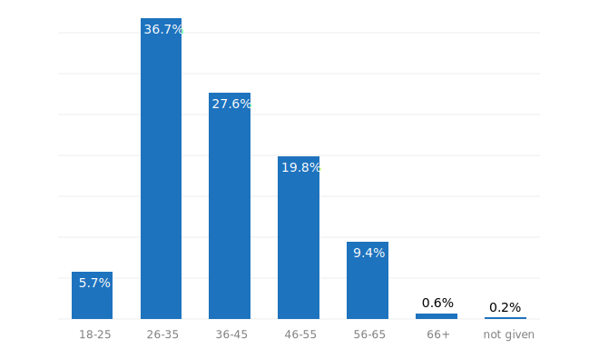

   Figure: Age Group of Respondents

--------------

.. _h.ngwvsti4e3pz:

.. _h.pui0qyhbbc09:

Gender Identity
~~~~~~~~~~~~~~~

.. container:: question

   .. rubric:: What we asked
                                                                         
   19. What gender identity do you most identify with?                   
                                                                         
   -  Woman                                                              
   -  Man                                                                
   -  Non-binary                                                         
   -  Other (please specify)                                             
   -  I'd rather not say                                                 

.. _h.83165ti5nc0w:

.. _h.tym545ppyhwj:

57.8% of respondents identified as women, 37.5% as men, and 2.4% as
non-binary or “other” - a similar breakdown to 2019’s results. 19
respondents (2.4% of the total) chose not to answer.

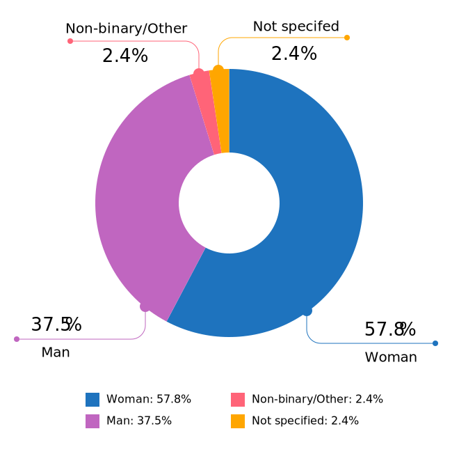
   
   Figure: Gender Identity
   
--------------

.. _h.rj96u3l6zhc0:

.. _h.3ppqxqi9mzxd:

Years of Experience in Documentation
~~~~~~~~~~~~~~~~~~~~~~~~~~~~~~~~~~~~

.. container:: question

   .. rubric:: What we asked
                                                                         
   20. How many years of experience do you have in documentation?        
                                                                         
   -  Less than 1 year                                                   
   -  1 - 2 years                                                        
   -  2 - 5 years                                                        
   -  5 - 10 years                                                       
   -  More than 10 years                                                 
   -  I'd rather not say                                                 
                                                                         
   Those who selected “More than 10 years” were asked to specify an      
   exact number.                                                         

.. _h.lx079twuga2h:

.. _h.4inw73p5s63e:

.. _h.jnqjntolmml9:

3.5% reported having up to a year of experience, and 7% between 1 and 2
years. 23.9% fell into the 2-5 years of experience bracket, and 25.5%
had 5-10 years under their belts.

The largest group was those with over 10 years of experience, just under
40% of respondents. Of these, 198 reported between 10 and 20 years, 100
reported between 20 and 30 years, and 23 reported over 30 years -  7 of
which were veterans of over 40 years. The highest reported value was 44
years (1 respondent).

3 respondents chose not to answer this question.

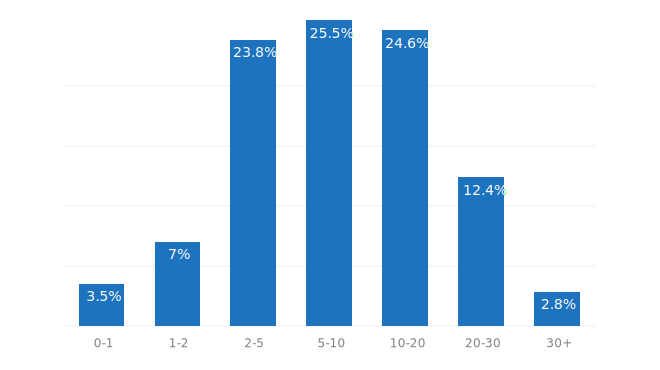

   Figure: Years of Experience in Documentation

--------------

.. _h.rrzbdd2h1tvt:

.. _h.g01gv7j39jh4:

Highest Education Level Achieved
~~~~~~~~~~~~~~~~~~~~~~~~~~~~~~~~

.. container:: question

   .. rubric:: What we asked
                                                                         
   21. What is the highest level of education that you have completed?   
                                                                         
   -  High School or equivalent                                          
   -  Technical College Qualification or equivalent                      
   -  College or University Graduate Qualification (Certificate,         
      Diploma, Associate Degree, Bachelor's Degree)                      
   -  Post-Graduate Degree (Master's Degree, Post-Graduate Diploma or    
      Certificate, Doctorate)                                            
   -  Other (please specify)                                             
   -  I'd rather not say                                                 

.. _h.vi4dy4aviqw5:

.. _h.ibh9srgci3ft:

.. _h.7pf3ad9ycjuh:

.. _h.m4orif6ybf55:

The majority of respondents - 93.3% had completed a college or university graduate
qualification or higher - 54% had a graduate qualification (Certificate,
Diploma, Associate Degree, or Bachelor's Degree) and 39% had completed a
post-graduate qualification (Master's Degree, Post-Graduate Diploma or
Certificate, or Doctorate). Those completing technical college or
equivalent numbered 2.2%, and those completing high school only
(including those who did some tertiary education but did not achieve a
formal qualification) accounted for 4% of respondents, and technical
college 2.2%.

The responses entered for “Other” resulted in a new category being added
for those that are still currently studying: 2 respondents indicated
that they are currently working towards a degree.

2 respondents chose not to answer this question. 

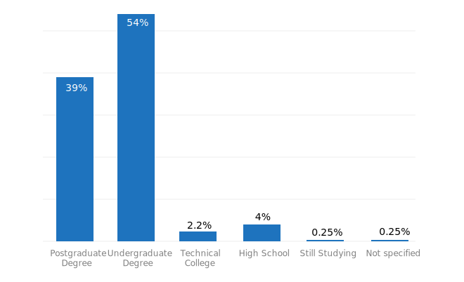

   Figure: Highest Education Level Completed

--------------

.. _h.bxzph4uqk1fm:

.. _h.phzzr093gwm6:

Geographical Location
~~~~~~~~~~~~~~~~~~~~~

.. container:: question

   .. rubric:: What we asked
                                                                         
   22a. Where are you based?                                             
                                                                         
   -  Country                                                            
   -  State, Province, Territory, or Region                              
   -  City                                                               

.. _h.2p8ogrpmwizb:

.. _h.1ulwyklmb12i:

In 2019, 58% of survey respondents who provided a location were based in
the United States. As the Write the Docs community is international, one
of our aims for 2020 was to try and expand the reach of the survey to
documentarians in more countries, in order to make the results more
comprehensive.

In 2020, we had some success with this: while the number of US residents
increased slightly (373 individuals versus 350 in 2019), this only made
up 46% of the total number of responses, meaning that the 24% increase
in total survey reach was largely from our international community.

While the number of respondents from Canada and Germany decreased, there
were significant increases in responses from Australia, Brazil, India,
Israel, Poland and Ukraine.

No responses were recorded in 2020 from Bulgaria, Greece, Iceland,
Italy, Malaysia, Nepal, Singapore or Slovakia - all of which were
represented in 2019. Bangladesh, Belarus, Colombia, Hong Kong, Indonesia,
Kenya, Mexico, Pakistan, South Africa, South Korea and Switzerland
appeared as new countries in the result set.

.. table:: Top Geographical Locations - North America
   :widths: 30 30 30 10
   :width: 100%
   :name: tbl-top-geo-north-america

   +---------------+------------------+---------------+--------------------+
   | Country       | State/Province   | City          | No.                |
   +===============+==================+===============+====================+
   | United States |                  |               |         373        |
   +---------------+------------------+---------------+--------------------+
   |               | California       |               |         102        |
   +---------------+------------------+---------------+--------------------+
   |               |                  | San Francisco |         23         |
   +---------------+------------------+---------------+--------------------+
   |               | Texas            |               |         39         |
   +---------------+------------------+---------------+--------------------+
   |               |                  | Austin        |         19         |
   +---------------+------------------+---------------+--------------------+
   |               |                  | Dallas        |         10         |
   +---------------+------------------+---------------+--------------------+
   |               | Oregon           |               |         24         |
   +---------------+------------------+---------------+--------------------+
   |               |                  | Portland      |         20         |
   +---------------+------------------+---------------+--------------------+
   |               | Washington       |               |         23         |
   +---------------+------------------+---------------+--------------------+
   |               |                  | Seattle       |         18         |
   +---------------+------------------+---------------+--------------------+
   |               | Massachusetts    |               |         20         |
   +---------------+------------------+---------------+--------------------+
   | Canada        |                  |               |         54         |
   +---------------+------------------+---------------+--------------------+
   |               | Ontario          |               |         30         |
   +---------------+------------------+---------------+--------------------+
   |               |                  | Toronto       |         13         |
   +---------------+------------------+---------------+--------------------+
   |               | British Columbia |               |         13         |
   +---------------+------------------+---------------+--------------------+
   |               |                  | Vancouver     |          7         |
   +---------------+------------------+---------------+--------------------+

.. table:: Top Geographical Locations - Europe
   :widths: 50 40 10
   :width: 100%
   :name: tbl-top-geo-europe

   +----------------+---------+--------------------+
   | Country        | City    | No.                |
   +================+=========+====================+
   | United Kingdom |         |         37         |
   +----------------+---------+--------------------+
   |                | London  |         16         |
   +----------------+---------+--------------------+
   | Poland         |         |         33         |
   +----------------+---------+--------------------+
   |                | Kraków  |         11         |
   +----------------+---------+--------------------+
   |                | Wrocław |          9         |
   +----------------+---------+--------------------+
   | Germany        |         |         23         |
   +----------------+---------+--------------------+
   |                | Berlin  |         10         |
   +----------------+---------+--------------------+
   | France         |         |         15         |
   +----------------+---------+--------------------+
   | Ukraine        |         |         15         |
   +----------------+---------+--------------------+
   |                | Kyiv    |          8         |
   +----------------+---------+--------------------+
   | Russia         |         |         12         |
   +----------------+---------+--------------------+
   | Netherlands    |         |         11         |
   +----------------+---------+--------------------+
   | Spain          |         |          9         |
   +----------------+---------+--------------------+
   | Ireland        |         |          8         |
   +----------------+---------+--------------------+

.. table:: Top Geographical Locations - Other Regions
   :widths: 30 30 30 10
   :width: 100%
   :name: tbl-top-geo-other

   +---------------------------+-----------+-----------+--------------------+
   | Region                    | Country   | City      | No.                |
   +===========================+===========+===========+====================+
   | Middle East               | Israel    |           |         52         |
   +---------------------------+-----------+-----------+--------------------+
   |                           |           | Tel Aviv  |         17         |
   +---------------------------+-----------+-----------+--------------------+
   | Asia                      |           |           |         50         |
   +---------------------------+-----------+-----------+--------------------+
   |                           | India     |           |         35         |
   +---------------------------+-----------+-----------+--------------------+
   | Oceania                   |           |           |         48         |
   +---------------------------+-----------+-----------+--------------------+
   |                           | Australia |           |         45         |
   +---------------------------+-----------+-----------+--------------------+
   |                           |           | Brisbane  |         16         |
   +---------------------------+-----------+-----------+--------------------+
   |                           |           | Melbourne |         15         |
   +---------------------------+-----------+-----------+--------------------+
   | South and Central America |           |           |         17         |
   +---------------------------+-----------+-----------+--------------------+
   |                           | Brazil    |           |         14         |
   +---------------------------+-----------+-----------+--------------------+
   | Africa                    |           |           |          3         |
   +---------------------------+-----------+-----------+--------------------+

.. raw:: html

   

