.. raw:: html

   

*****************************************
Write the Docs Salary Survey 2021 Results
*****************************************

.. contents::
   :local:
   :depth: 2
   :backlinks: none

Introduction
============ 

The Write the Docs Salary Survey gathers salary data for documentarians across the world, to help our community members determine what appropriate salary ranges are, and to provide a benchmark for future negotiations.

Here we present the results of the third annual survey, which gathered submissions between October 11 and December 20, 2021. Although employees and independent contractors filled out different survey forms this time around, all questions other than for Section 3 (Salary Information) were identical and the data from both forms was combined to produce this report. 

In total, 959 documentarians (887 employees and 72 independent contractors) filled out the 2021 survey – a 19% increase from 2020 and a 48% increase from 2019. 

.. raw:: html

   <figure>
      <object role="img" aria-label="Survey growth (2019-2021)" aria-describedby="figure-introduction_desc" type="image/svg+xml" data="/_images/2021-survey-growth.svg">
         
Bar chart showing survey growth in number of respondents between 2019 and 2021

      </object> 
      <figcaption>Figure: Survey growth (2019-2021)</figcaption>
   </figure>

Feedback
--------

We’d love your thoughts on this survey, so that we can continue to refine it. Email us at support@writethedocs.org with your ideas.

Section 1: Employment parameters
================================

In this section, we asked about the parameters of the respondent’s employment:

- whether they were employees, self-employed, or had been employed or self-employed but were currently not working,
- the number of hours they worked and the length of time they had held the same position, 
- whether they worked solo or as part of a team and how they classified their role, and
- how focused their role was on tasks related to documentation.

1.1 Basis of employment
-----------------------

.. container:: question
   
   .. rubric:: What we asked

   1. What is the basis of your employment?

      - I am an employee
      - I was an employee, but am not currently employed
      - I am an independent contractor, freelance operator, or self-employed
      - I was an independent contractor, freelance operator, or self-employed, but do not currently have work

Of the 959 respondents who completed the survey in 2021, 887 were employees (92.5% of the total) and 72 were independent contractors (7.5% of the total). 

.. raw:: html

   <figure>
      <object role="img" aria-label="Basis of employment (2021)" aria-describedby="figure-basis1_desc" type="image/svg+xml" data="/_images/2021-basis-of-employment.svg">
         
Donut chart showing proportion of employee to contractor respondents

      </object> 
      <figcaption>Figure: Basis of employment (2021)</figcaption>
   </figure>

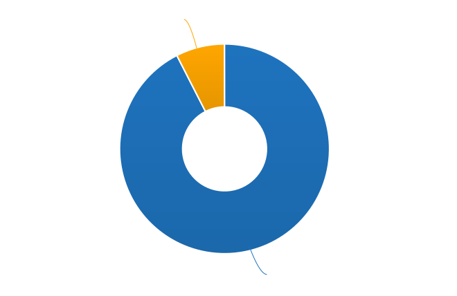

Although employees have historically made up the majority of all respondents, there has been a slight increase in the proportion of independent contractors each year - from 5.7% in 2019, to 6.8% in 2020, to 7.5% in 2021. 

.. raw:: html

   <figure>
      <object role="img" aria-label="Ratio of employee to contractor respondents (2019-2021)" aria-describedby="figure-basis2_desc" type="image/svg+xml" data="/_images/2021-employee-contractor-ratio.svg">
         
Bar chart showing how employee respondents continue to outnumber contractor respondents by more than 10 to 1 over the three years the survey has run, with just a small increase in contractors each year.

      </object> 
      <figcaption>Figure: Ratio of employee to contractor respondents (2019-2021)</figcaption>
   </figure>

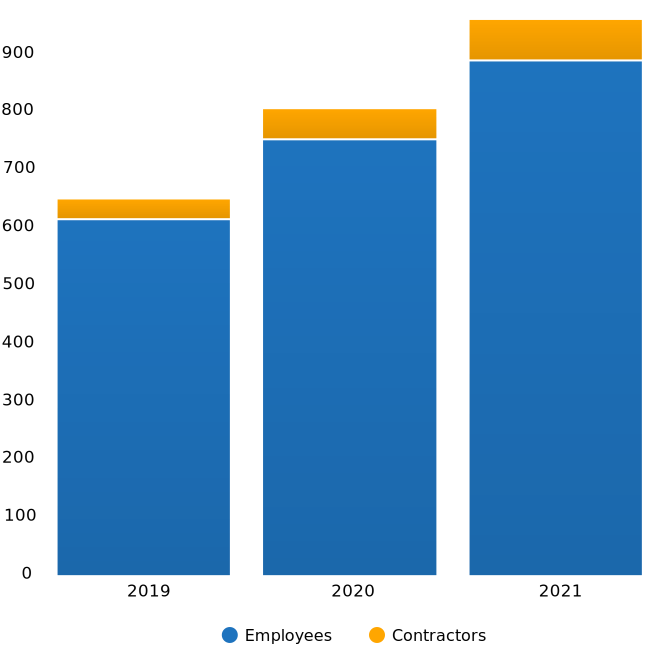

In 2020 we introduced an option for people who were unemployed (or in the case of independent contractors, who were not currently working any contracts). We asked these respondents to answer the questions as though they were still in their previous employment or contract situation. 

This option was included in 2021, and 7 employees and 3 independent contractors selected unemployed as their status – only 1% of all respondents. By contrast, in 2020, more than twice as many respondents indicated they were currently unemployed - 18 employees and 2 independent contractors, or 2.5% of all respondents. 

1.2 Hours worked
----------------

.. container:: question
   
   .. rubric:: What we asked

   2. How many hours per week do you work?

      - 1-20 hours
      - 21-30 hours
      - 31-40 hours
      - 41-50 hours
      - 51-60 hours
      - More than 60 hours

As in previous years, most respondents worked traditional “full-time” hours:

- 96% worked 31 hours per week or more
- 32% worked between 41 and 50 hours
- Only 2% worked 51 hours or more

One respondent entered more than 60 hours - that person reported working 70 hours each week.  

.. raw:: html

   <figure>
      <object role="img" aria-label="Hours worked - employees (2021)" aria-describedby="figure-hours-employees_desc" type="image/svg+xml" data="/_images/2021-hours-worked-employees.svg">
         
Bar chart showing weekly hours worked by employee respondents

      </object> 
      <figcaption>Figure: Hours worked - employees (2021)</figcaption>
   </figure>

Of the 4% of respondents who worked fewer than 31 hours per week, around half worked up to 20 and the other half worked between 21 and 30 hours. Notably, 56% of those working 30 hours or less were classified as independent contractors (29% of all contractors).    

.. raw:: html

   <figure>
      <object role="img" aria-label="Weekly hours worked - contractors (2021)" aria-describedby="figure-hours-contractors_desc" type="image/svg+xml" data="/_images/2021-hours-worked-contractors.svg">
         
Donut chart showing weekly hours worked by contractor respondents (2021)

      </object> 
      <figcaption>Figure: Weekly hours worked - contractors (2021)</figcaption>
   </figure>

1.3 Job title
----------------

.. container:: question
   
   .. rubric:: What we asked

   3. What is your job title?
   
      Note: To help us process this information, please use full terms rather than abbreviations. For example, use "Senior" rather than "Sr" and "Technical" rather than "Tech".

With abbreviations expanded, typos corrected, and capitalization standardized, 270 distinct job titles emerged (versus 255 in 2020, and 207 in 2019). 

“Technical Writer”, entered by 31% of respondents, was by far the most widely-used title, followed by “Senior Technical Writer” which accounted for another 20%. 

The next most widely-used titles were a long way behind the frontrunners: “Lead Technical Writer” represented 3% of all respondents, followed by “Staff Technical Writer” with 2.2%. 

- 76% of all titles contained the word “technical”
- 66% contained “writer”, while only 1% contained “author”
- 20% contained “manager”, “lead”, “head” or “director”
- 27% contained “senior”, but only 1% contained “junior”
- 7% contained “document” or “documentation”
- 5.9% contained “content”
- 5.2% contained “develop” (encompassing “developer” and “development”), while 2.2% contained “engineer” or “engineering”, and only 1.25% contained “design”
- 1.5% contained “editor”
- 1.5% contained “communication”
- 1.25% contained “support”, and 0.5% contained “customer”
  
.. raw:: html

   <figure>
      <object role="img" aria-label="Job title word cloud (2021)" aria-describedby="figure-job-title_desc" type="image/svg+xml" data="/_images/2021-jobtitles-wordcloud.svg">
         
Word cloud showing terms used in job titles, sized proportionately to the number of occurrences of each.

      </object> 
      <figcaption>Figure: Job title word cloud (2021)</figcaption>
   </figure>

1.4 Type of role
----------------

.. container:: question
   
   .. rubric:: What we asked

   4. How would you broadly categorize your primary role? 
      
      Note: If you are a team leader or manager but also work alongside your team, please select the category of your team.
  
      - I am a writer, content creator, producer, or editor
      - I am a developer or an engineer
      - I am an educator
      - I work in a customer support role
      - I am an advocate or work in community outreach
      - I work in marketing
      - I work primarily in a management role
      - Other (please specify)
  
   5. In your primary role, are you:
   
      - A solo worker
      - Part of a team (either of people doing the same kind of role, or a mixed-discipline team)
      - Part of multiple teams
      - A manager or team leader
      - Other (please specify)

The majority of respondents (85%) placed themselves in the writer, content creator, producer or editor category, slightly down from 87.7% in 2020. 

.. raw:: html

   <figure>
      <object role="img" aria-label="Role categorization - major grouping (2021)" aria-describedby="figure-role-major_desc" type="image/svg+xml" data="/_images/2021-role-breakdown-major.svg">
         
Donut chart showing major role categorization of respondents - the majority (85%) being writers, content creators, producers or editors, and only 15% categorizing themselves as one of the other six categories

      </object> 
      <figcaption>Figure: Role categorization - major grouping (2021)</figcaption>
   </figure>

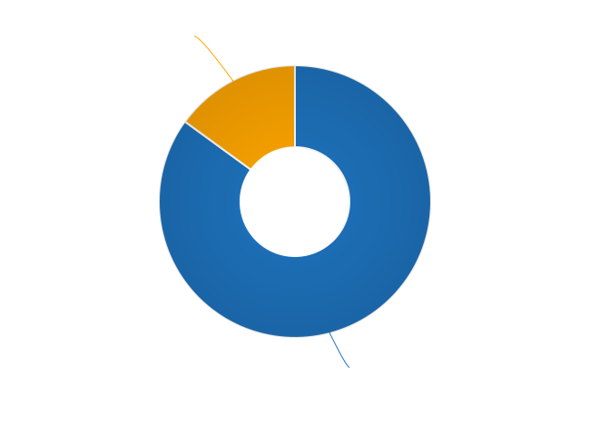

Of the remaining 15%, nearly half selected management - 7.4% of the total, an increase from 2020’s 4.8%. Developer/engineer made up ust under 20% of the non-writer categories - 2.9% of the total, up from 2.4% in 2020. 

Support made up 7.7% of the non-writers - just over 1% overall. The remaining three categories each held less than 1% of the total each (advocate/community outreach, marketing, educator).

2% of the total respondents selected the Other category, and while some of these responses fit into the writer/content creator/producer/editor category, some indicated an evenly split role (e.g. developer and writer; writer and evangelist). Additional entered responses included product manager, quality manager, research, and strategy-based roles. 

.. raw:: html

   <figure>
      <object role="img" aria-label="Role categorization - minor grouping (2021)" aria-describedby="figure-role-minor_desc" type="image/svg+xml" data="/_images/2021-role-breakdown-minor.svg">
         
Donut chart showing role categorization of the 15% of total respondendents who did not place themselves in the writer, content creator, producer or editor role: 

      </object> 
      <figcaption>Figure: Role categorization - minor grouping (2021)</figcaption>
   </figure>

Respondents were asked to indicate if they worked primarily solo, as part of a team (either a team made up of people doing the same kind of job, or a multi-disciplinary team), as part of multiple teams, or as a manager or team leader.

- 16.3% of respondents indicated that they worked solo (the same percentage as in 2020),
- 52.5% worked on a single team,
- 15.5% on multiple teams, and
- 15.2% lead a team

0.5% selected "Other" and entered additional comments - these respondents were either split between solo and team, or consultants to multiple teams, or both managers and team members. 

.. raw:: html

   <figure>
      <object role="img" aria-label="Team breakdown (2021)" aria-describedby="figure-team_desc" type="image/svg+xml" data="/_images/2021-team-breakdown.svg">
         
Donut chart showing team breakdown

      </object> 
      <figcaption>Figure: Team breakdown (2021)</figcaption>
   </figure>

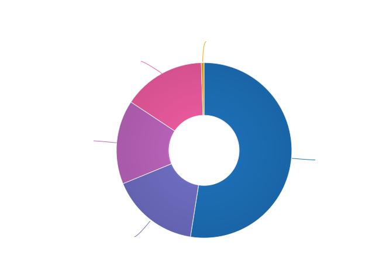
 
1.5 Length of time at current organization
------------------------------------------

.. container:: question
   
   .. rubric:: What we asked

   6. How long have you worked at your current organization?
   
      Note:
      Please select the length of time for your position at your current organization only - your total years of experience in documentation will be covered in the individual demographics section.
   
      If you have changed roles at the same organization, please select the length of time that you have been in your current role.

      - Less than 1 year
      - 1 - 2 years
      - 2 - 5 years
      - 5 - 10 years
      - More than 10 years

Perhaps reflecting the job market upheaval caused by the pandemic, 31.7% of respondents reported having been in their current position for less than 1 year, up from 26% in 2020.  

- 18% had held their current role for between 1 and 2 years (down from 26.2% in 2020), 
- 31.8% clocked in between 2 and 5 years (up from 29.2% in 2020),
- 12.8% reported between 5 and 10 years (down from 12.3% in 2020), and
- 5.7% had been in their current position for over 10 years (around the same as in 2020). 

Of those respondents reporting more than 10 years in their current position:

- 61.8% (34 individuals) reported between 11 and 15 years, 
- 21.8% (12 individuals) reported between 16 and 20 years, and
- 16.4% (9 individuals) reported between 21 and 35 years.

Single respondents reported 24, 29, 32 and 35 years tenure – an increase from 2020, when the “high scores” in this category were single respondents each reporting 27 and 28 years.  

.. raw:: html

   <figure>
      <object role="img" aria-label="Time in role (2021)" aria-describedby="figure-time_desc" type="image/svg+xml" data="/_images/2021-time-in-role.svg">
         
Bar chart showing time in current role - with 31.7% of respondents reporting less than 1 year, 18% between 1 and 2 years, 31.8% between 2 and 5 years, 12.8% between 5 and 10 years, and 5.7% with more than 10 years

      </object> 
      <figcaption>Figure: Time in role (2021)</figcaption>
   </figure>

1.6 Proportion of role officially related to documentation
----------------------------------------------------------

.. container:: question
   
   .. rubric:: What we asked

   7. Documentation is:

      - the whole of my official job description
      - part of my official job description 
      - not officially part of my job description, but I am expected to perform documentation-related tasks
      - not officially part of my job description, and I am not expected to perform documentation-related tasks, but I do anyway

Not surprisingly for a community of documentarians, the largest proportion of respondents - 69% - reported that documentation makes up the whole of their official job description.

- 25.4% reported that it was only part,
- 4.4% reported that documentation was not part of their official job description but they were still expected to perform documentation-related tasks, and 
- 1.2% fit into the final category, those who performed documentation-related tasks despite it not being part of their job description and it not being expected of them. 

These ratios remain essentially unchanged from 2020 and 2019. 

.. raw:: html

   <figure>
      <object role="img" aria-label="Proportion of role officially devoted to documentation (2021)" aria-describedby="figure-proportion-official_desc" type="image/svg+xml" data="/_images/2021-proportion-official.svg">
         
Donut chart showing proportion of role officially devoted to documentation: 69% said that documentation was the whole of their official job description, 25.4% said documentation was only part, 4.4% said documentation was not part of their role but they were expected to perform documentation-related tasks, and 1.2% said documentation was not part of their job description and even though it was not expected of them, they performed documentation-related tasks anyway

      </object> 
      <figcaption>Figure: Proportion of role officially devoted to documentation (2021)</figcaption>
   </figure>

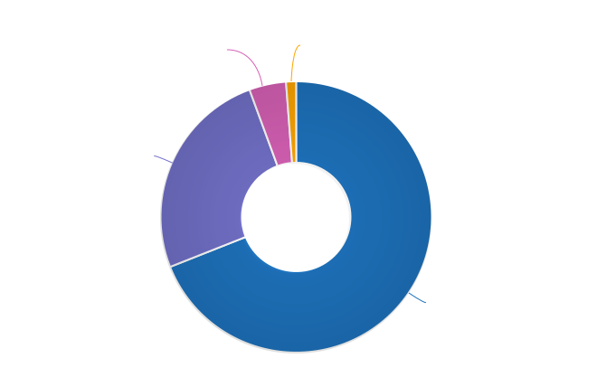

1.7 Proportion of role actually related to documentation
--------------------------------------------------------

.. container:: question
   
   .. rubric:: What we asked

   8. Approximately what percentage of your day-to-day tasks are documentation-related?

      - 0-25%
      - 25-50%
      - 50-75%
      - 75-100%

The proportions for this question remained mostly the same as in 2020 and 2019. 

- 5% of respondents reported that documentation-related tasks made up one quarter or less of their day-to-day work activities,
- 9.8% estimated the split to be between one quarter and half,
- 28.2% put the number at between half and three quarters, and
- 57% reported focusing on documentation between three quarters and the whole of their work time.

.. raw:: html

   <figure>
      <object role="img" aria-label="Proportion of role actually related to documentation (2021)" aria-describedby="figure-proportion-actual_desc" type="image/svg+xml" data="/_images/2021-proportion-actual.svg">
         
Bar chart showing proportion of day-to-day tasks that are actually related to documentation - with 5% of respondents estimating up to 25%, 9.8% of respondents estimating 25-50%, 28.2% of respondents estimating 50-75%, and 57% of respondents estimating 75-100%

      </object> 
      <figcaption>Figure: Proportion of role actually related to documentation (2021)</figcaption>
   </figure>

Section 2: Work Location and COVID-19
=====================================

In 2019, we included one question about work location: whether the respondent worked on site, remotely (at home, at a co-working space, or at another non-employer provided location), or a combination of the two; the possible responses were arranged to also show if the work location was stipulated by the employer, or the respondent’s own choice. 

In 2020, the COVID-19 pandemic caused upheavals in the way we work – not just in terms of work location, although moving from on-site office locations to remote work was a change that affected nearly 80% of the respondents. In 2021, although the pandemic is still ongoing, we’re adapting our lives to co-exist with it and while some of the changes to our work environment have been reverted, some others have become permanent, and others still are in a state of flux. 

Note for this section: respondents were advised that if they have changed jobs during 2021 and the change was not due to COVID-19 directly, they should answer the questions from the perspective of their new employer.

2.1 Work location
-----------------

.. container:: question
   
   .. rubric:: What we asked

   \9. Has your work location (i.e. onsite, remote) been affected by COVID-19 (temporarily or permanently)?

      - Yes
      - No

   Those who answered "Yes" were then asked:

   9a. Before COVID-19, what was your work location?

      - I was required to be on-site full time
      - I was on-site full time, but it was not required
      - I was partially on-site, and partially remote
      - I was fully remote, but it was by choice (i.e. an office location was available to me)
      - I was fully remote, and it was required (i.e. no office location was available to me)

   9b. What is your current work location?

      - I am required to be on-site full time
      - I am on-site full time, but it is not required
      - I am partially on-site, and partially remote
      - I am fully remote, but it is by choice (i.e. an office location is available to me)
      - I am fully remote, and it is required (i.e. no office location is available to me)

   9c. What changes occurred to your work location as a result of COVID-19?

      - My work location changed permanently
      - My work location changed temporarily and has now changed back
      - My work location changed temporarily and has not yet changed back
      - My work location has changed multiple times but is now permanent
      - My work location has changed multiple times and may change again
      - Other (please specify)

   9e. How do you feel about the changes to your work location?

      - Very negative
      - Negative
      - Neutral
      - Positive
      - Very positive

   Those who answered "No" to question 9 were instead asked:

   9f. What is your work location?

      - I am required to be on-site full time
      - I am on-site full time, but it is not required
      - I am partially on-site, and partially remote
      - I am fully remote, but it is by choice (i.e. an office location is available to me)
      - I am fully remote, and it is required (i.e. no office location is available to me)

   9g. How do you feel about your work location?

      - Very negative
      - Negative
      - Neutral
      - Positive
      - Very positive

In 2021, 73.9% of respondents reported that their work location had been affected by COVID-19 - down from 80% in 2020. 

Work location - affected by COVID-19
~~~~~~~~~~~~~~~~~~~~~~~~~~~~~~~~~~~~

As in 2020, of those who had their work location changed due to the pandemic, by far the largest group were those who changed from working onsite (i.e. in their employer's premises) to working remotely (i.e. working from home or another location not provided by their employer) - this accounted for 45.6% of respondents. 

.. raw:: html

   <figure>
      <object role="img" aria-label="Work location - pre-COVID-19 (2021)" aria-describedby="figure-work-location-pre_desc" type="image/svg+xml" data="/_images/2021-work-location-pre.svg">
         
Donut chart showing work location prior to COVID-19: 52.3% were required to be onsite; 22.7% were partially onsite and partially remote; 15.1% were onsite by choice; 5.6% were required to be remote; 4.3% were remote by choice.

      </object> 
      <figcaption>Figure: Work location - pre-COVID-19 (2021)</figcaption> 
   </figure>

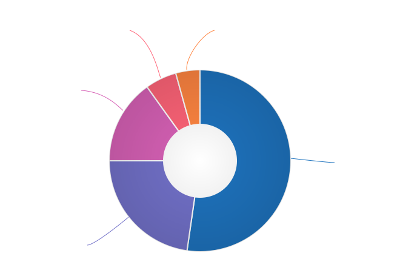

Additionally:

- 17.3% transitioned from partially remote to completely remote, and
- 16.8% transitioned from onsite to partially remote.  

.. raw:: html

   <figure>
      <object role="img" aria-label="Work location - post-COVID-19 (2021)" aria-describedby="figure-work-location-post_desc" type="image/svg+xml" data="/_images/2021-work-location-post.svg">
         
Donut chart showing work location since COVID-19: 44.1% were remote by choice; 27.5% were required to be remote; 22.6% were partially onsite and partially remote; 3.2% were onsite by choice; 2.5% were required to be onsite.

      </object> 
      <figcaption>Figure: Work location - post-COVID-19 (2021)</figcaption> 
   </figure>

In 2020, we asked respondents if they thought the changes to their work location would be permanent or temporary: 

- nearly half (47.6%) predicted that the changes would not be permanent (“no” or “probably no”),
- 36.1% thought they would be permanent (“yes” or “probably yes”), and
- the remaining 16.3% were unsure.  

In 2021, given that the situation was still ongoing, we instead asked respondents about the current status of the changes. 

The largest group (albeit only by a small margin) - 37.5% - reported that their work location change was temporary, but had not yet changed back. Another 34.8% reported that their work location change had become permanent.

Of the remaining responses:

- 14.4% reported that their work location change had been temporary and had now changed back,
- 9.6% had experienced multiple changes which were not yet permanent, and
- 1.4% had experienced multiple changes but had settled on a permanent situation.

The final 2.3% of respondents who inidcated that they had experienced a work location due to COVID-19 selected "other" and entered more detail - most of these indicated that they were as yet unsure if the changes were going to be permanent or not. 

.. raw:: html

   <figure>
      <object role="img" aria-label="Work location changes due to COVID-19 (2021)" aria-describedby="figure-work-location-changes_desc" type="image/svg+xml" data="/_images/2021-work-location-changes.svg">
         
Donut chart showing status of work locations changes due to the COVID-19 pandemic: 37.5% of respondents report that their work location change is temporary but has not yet changed back; 34.9% state that the change is now permanent; 14.4% report that the change was temporary and has now changed back; 9.6% have experienced multiple changes that are not yet permanent; 1.4% have experienced multiple changes that are now permanent; and 2.3% indicated their situation did not fit any of the provided options.

      </object> 
      <figcaption>Figure: Work location changes due to COVID-19 (2021)</figcaption> 
   </figure>

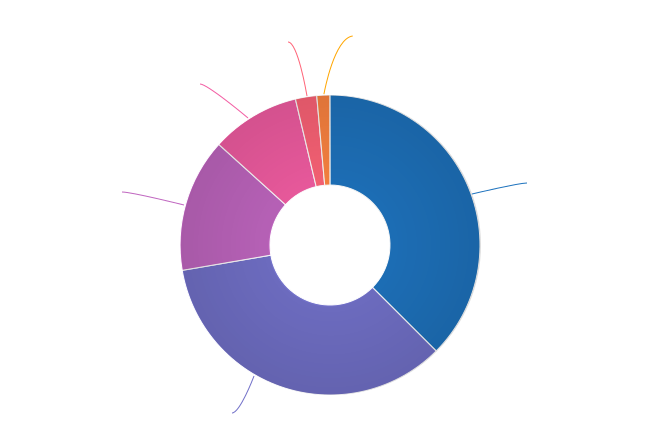

As in 2020, we asked how respondents felt about the changes to their work location. In 2021:

- 69.7% felt positive or very positive (up from 60.6% in 2020),
- 21.3% reported neutral feelings (down from 27.3% in 2020), and
- only 9% felt negative or very negative (down from 12.1% in 2020).

.. raw:: html

   <figure>
      <object role="img" aria-label="Feelings about pandemic-related work location change (2021)" aria-describedby="figure-feelings-location-change_desc" type="image/svg+xml" data="/_images/2021-feelings-location-change.svg">
         
Donut chart showing respondent attitudes towards the work location changes brought about by the COVID-19 pandemic: 69.7% feel positive or very positive; 21.3% feel neutral; 9% felt negative or very negative.

      </object> 
      <figcaption>Figure: Feelings about pandemic-related work location change (2021)</figcaption> 
   </figure>

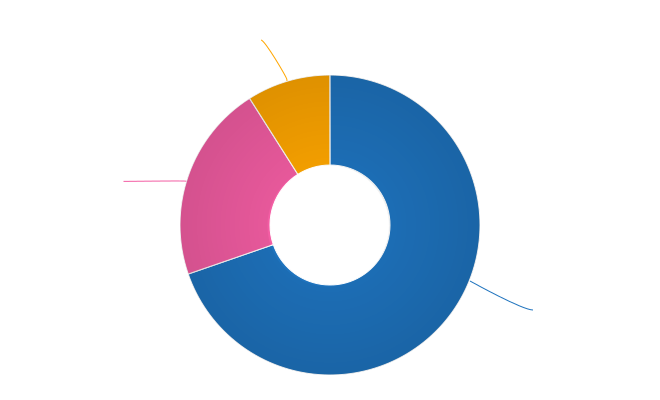

Work location - unaffected by COVID-19
~~~~~~~~~~~~~~~~~~~~~~~~~~~~~~~~~~~~~~

For those 26.1% of respondents who indicated that their work location had not been affected by COVID-19, we asked where they work from, and how they felt about it:

- 85.2% worked remotely, either by requirement (51.6%) or by choice (33.6%),
- 8% worked onsite, with 5.6% required to be onsite and 2.4% working onsite by choice, and  
- 6.8% worked partially remote, partially onsite.

.. raw:: html

   <figure>
      <object role="img" aria-label="Work location - unaffected by COVID-19 (2021)" aria-describedby="figure-work-location-unaffected_desc" type="image/svg+xml" data="/_images/2021-work-location-unaffected.svg">
         
Donut chart showing respondent attitudes towards the work location changes brought about by the COVID-19 pandemic: 69.7% feel positive or very positive; 21.3% feel neutral; 9% felt negative or very negative.

      </object> 
      <figcaption>Figure: Work location - unaffected by COVID-19 (2021)</figcaption> 
   </figure>

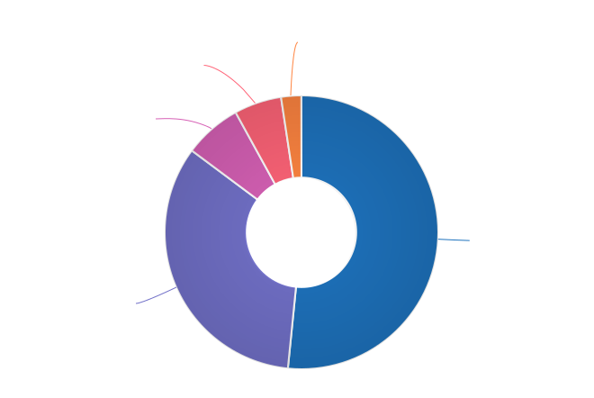

The overwhelming majority of respondents in this category were happy with their work location:

- 87.2% reported feeling positive - and 67.2% of those classed themselves as “very positive”,
- 10.8% were neutral, 
- a mere 2% (5 individuals) reported feeling negative, and 
- no one reported that they felt “very negative”.

.. raw:: html

   <figure>
      <object role="img" aria-label="Feelings about work location - unaffected by COVID-19 (2021)" aria-describedby="figure-feelings-work-location-unaffected_desc" type="image/svg+xml" data="/_images/2021-feelings-work-location-unaffected.svg">
         
Donut chart showing respondent attitudes towards their work location, where they have been unaffected by the COVID-19 pandemic: 87.2% feel positive or very positive; 10.8% feel neutral; 2% feel negative.

      </object> 
      <figcaption>Figure: Feelings about work location - unaffected by COVID-19 (2021)</figcaption> 
   </figure>

2.2 Other changes due to COVID-19
---------------------------------

.. container:: question
   
   .. rubric:: What we asked

   10. Other than work location, has your employment been affected by COVID-19? Check all that apply.

      Note: If your employment has not been affected, please check "none of the above". If you have changed jobs since the pandemic started, please only choose "I changed roles" if COVID-19 was a factor in this change.
   
      - Social distancing measures have been introduced in my workplace (masks, distance between desks, maximum people in a room, online meetings only etc)
      - My hours have changed
      - I was furloughed
      - I was laid off
      - I changed roles (within the same organization)
      - I changed roles (started work with a different organization)
      - Other (please specify)
      - None of the above

Although work location was the big upheaval caused by the pandemic, changes occurred in other areas too for 61.8% of respondents.

- 43.9% reported social distancing in the workplace,
- 16.8% changed roles – with 17.2% going to a new organization entirely and 2.6% changing roles within the same organization,
- 5.6% reported changes in their working hours,
- 2.7% were laid off, and 
- 1.4% were furloughed. 

Section 3: Salary
=================

In this section, we asked the all-important salary questions: how much respondents were paid, what additional benefits they received, and how happy they were with their salary and with their job overall. Independent contractors were able to specify whether they typically used an hourly rate, a day rate or a different payment structure. 

2019 and 2020's surveys asked respondents to indicate reasons that they were not completely satisfied with their salary, benefits and overall job. In 2021, in addition to asking these negatively-oriented questions, we turned the focus around and asked what aspects of their employment situation they felt positive about.  

3.1 Currencies
--------------

Both employees and independent contractors were asked to specify the currency they were paid in. Respondents reported being paid in 32 different currencies (10 different currencies for independent contractors). To make comparisons, all numbers were converted to USD using mid-market exchange rates averaged for the whole of 2021.  

.. raw:: html

   

.. table:: Currencies and exchange rates (to 1 USD)
   :width: 100%
   :name: tbl-2021-currencies

   +------------------------+------+-----------+-------------+---------------+
   | Currency               | Code | Employees | Contractors | Exchange Rate |
   +========================+======+===========+=============+===============+
   | United States Dollar   | USD  |    483    |      41     |             1 |
   +------------------------+------+-----------+-------------+---------------+
   | Euro                   | EUR  |     96    |      10     |       1.18318 |
   +------------------------+------+-----------+-------------+---------------+
   | Canadian Dollar        | CAD  |     75    |      3      |      0.797833 |
   +------------------------+------+-----------+-------------+---------------+
   | Israeli Shekel         | NIS  |     41    |      4      |      0.309524 |
   +------------------------+------+-----------+-------------+---------------+
   | British Pound Sterling | GBP  |     39    |      4      |      1.375083 |
   +------------------------+------+-----------+-------------+---------------+
   | Russian Ruble          | RUB  |     37    |      1      |      0.013571 |
   +------------------------+------+-----------+-------------+---------------+
   | Australian Dollar      | AUD  |     26    |      3      |      0.751259 |
   +------------------------+------+-----------+-------------+---------------+
   | Indian Rupee           | INR  |     25    |      --     |      0.013527 |
   +------------------------+------+-----------+-------------+---------------+
   | Polish Zloty           | PLN  |     12    |      4      |      0.259198 |
   +------------------------+------+-----------+-------------+---------------+
   | Swedish Krona          | SEK  |     8     |      --     |      0.116586 |
   +------------------------+------+-----------+-------------+---------------+
   | New Zealand Dollar     | NZD  |     5     |      --     |      0.706957 |
   +------------------------+------+-----------+-------------+---------------+
   | Chinese Yuan           | CNY  |     4     |      --     |      0.154996 |
   +------------------------+------+-----------+-------------+---------------+
   | Romanian Leu           | RON  |     4     |      --     |      0.240528 |
   +------------------------+------+-----------+-------------+---------------+
   | Czech Koruna           | CZK  |     4     |      1      |      0.046131 |
   +------------------------+------+-----------+-------------+---------------+
   | Croatian Kuna          | HRK  |     3     |      --     |      0.157143 |
   +------------------------+------+-----------+-------------+---------------+
   | Hungarian Forint       | HUF  |     3     |      --     |      0.003301 |
   +------------------------+------+-----------+-------------+---------------+
   | Swiss Franc            | CHF  |     2     |      1      |      1.094205 |
   +------------------------+------+-----------+-------------+---------------+
   | Japanese Yen           | JPY  |     3     |      --     |      0.009113 |
   +------------------------+------+-----------+-------------+---------------+
   | Sri Lankan Rupee       | LKR  |     2     |      --     |      0.005044 |
   +------------------------+------+-----------+-------------+---------------+
   | Mexican Peso           | MXN  |     2     |      --     |      0.049323 |
   +------------------------+------+-----------+-------------+---------------+
   | Philippine Peso        | PHP  |     2     |      --     |      0.020301 |
   +------------------------+------+-----------+-------------+---------------+
   | Ukrainian Hryvnia      | UAH  |     2     |      --     |       0.03666 |
   +------------------------+------+-----------+-------------+---------------+
   | Argentinian Peso       | ARS  |     1     |      --     |      0.010557 |
   +------------------------+------+-----------+-------------+---------------+
   | Brazilian Real         | BRL  |     1     |      --     |      0.185533 |
   +------------------------+------+-----------+-------------+---------------+
   | Danish Krone           | DKK  |     1     |      --     |      0.159071 |
   +------------------------+------+-----------+-------------+---------------+
   | Nigerian Naira         | NGN  |     1     |      --     |       0.00247 |
   +------------------------+------+-----------+-------------+---------------+
   | Norwegian Krone        | NOK  |     1     |      --     |      0.116379 |
   +------------------------+------+-----------+-------------+---------------+
   | Singaporean Dollar     | SGD  |     1     |      --     |      0.744207 |
   +------------------------+------+-----------+-------------+---------------+
   | Turkish Lira           | TRY  |     1     |      --     |      0.115802 |
   +------------------------+------+-----------+-------------+---------------+
   | Taiwanese New Dollar   | TWD  |     1     |      --     |      0.035798 |
   +------------------------+------+-----------+-------------+---------------+
   | Vietnamese Dong        | VND  |     1     |      --     |      4.36E-05 |
   +------------------------+------+-----------+-------------+---------------+
   | Japanese Yen           | JPY  |     1     |      --     |      0.009113 |
   +------------------------+------+-----------+-------------+---------------+
   | South African Rand     | ZAR  |     1     |      --     |      0.067726 |
   +------------------------+------+-----------+-------------+---------------+

.. raw:: html

   

3.2 Salary – employees
----------------------

.. container:: question
   
   .. rubric:: What we asked

   11a. What currency are you paid in?

      - United States Dollar (USD)
      - Euro (EUR)
      - Canadian Dollar (CAD)
      - Israeli Shekel (NIS)
      - Australian Dollar (AUD)
      - British Pound Sterling (GBP)
      - Indian Rupee (INR)
      - Polish Zloty (PLN)
      - Brazilian Real (BRL)
      - Russian Ruble (RUB)
      - Other

   11c. What is your salary (including tax)?
      
         Note: 
         Please do not include the currency symbol or any decimal places.

   11d. Is this a monthly or yearly salary?

      - Monthly Salary
      - Yearly Salary

As 96% of respondents reporting working traditional “full-time” hours (between 30 and 50 hours per week) or more, those working fewer than 30 hours have been omitted from the figures in this section, which represents the reduced result set of 871 full-time employees.

In previous years, we asked respondents to enter their annual salary, which resulted in some confusion for respondents from countries where salary is typically discussed on a monthly basis. This year, we allowed respondents to select whether they were entering a monthly or yearly salary (76.1% entered an annual figure, and 23.9% chose monthly). All monthly salaries were then multiplied by 12 to allow for comparison. 

Overall median salary – employees
~~~~~~~~~~~~~~~~~~~~~~~~~~~~~~~~~

The median salary across all regions was **USD $80,870** (meaning half of respondents earned more, and half earned less). This figure is slightly higher than the overall median in 2020 (USD $80,000), and an increase from the overall median in 2019 (USD $74,500).

Median salary by respondent region - employees
~~~~~~~~~~~~~~~~~~~~~~~~~~~~~~~~~~~~~~~~~~~~~~

Given the range of socio-economic differences in the countries in the survey results, median salary figures broken down by country of residence of employee is more useful than overall median salary. 

In order to protect the privacy of respondents, median salaries are not shown for any country or region with less than 10 respondents. Countries excluded by this condition are:

- Sweden
- China
- Romania
- Spain
- New Zealand
- Portugal
- Belarus
- Hungary
- Czech Republic
- Japan
- Croatia
- Vietnam
- Switzerland
- Mexico
- Sri Lanka
- Italy
- Philippines
- Slovenia
- South Africa
- Lithuania
- Estonia
- Denmark
- Cyprus
- Bolivia
- Brazil
- Singapore
- Nigeria
- Taiwan
- Bangladesh
- Belgium
- Turkey
- Norway
- Austria
- Serbia
- Argentina

.. raw:: html

   

.. table:: Median salary by respondent region - employees
   :width: 100%
   :name: tbl-medianbyregion-employees

   +---------------+----------------+--------------------+---------------------+
   | Region        | Country        | No.                | Median (USD)        |
   +===============+================+====================+=====================+
   | North America |                | 518                | 99,426              |
   +---------------+----------------+--------------------+---------------------+
   |               | USA            | 441                | 105,000             |
   +---------------+----------------+--------------------+---------------------+
   |               | Canada         | 75                 | 71,805              |
   +---------------+----------------+--------------------+---------------------+
   | Europe        |                | 233                | 48,211              |
   +---------------+----------------+--------------------+---------------------+
   |               | United Kingdom | 36                 | 82,505              |
   +---------------+----------------+--------------------+---------------------+
   |               | Russia         | 38                 | 21,333              |
   +---------------+----------------+--------------------+---------------------+
   |               | Ukraine        | 27                 | 20,676              |
   +---------------+----------------+--------------------+---------------------+
   |               | Germany        | 21                 | 68,624              |
   +---------------+----------------+--------------------+---------------------+
   |               | France         | 15                 | 54,900              |
   +---------------+----------------+--------------------+---------------------+
   |               | Finland        | 13                 | 52,533              |
   +---------------+----------------+--------------------+---------------------+
   |               | Netherlands    | 12                 | 62,974              |
   +---------------+----------------+--------------------+---------------------+
   |               | Poland         | 12                 | 34,992              |
   +---------------+----------------+--------------------+---------------------+
   |               | Ireland        | 11                 | 69,808              |
   +---------------+----------------+--------------------+---------------------+
   | Asia          |                | 42                 | 28,617              |
   +---------------+----------------+--------------------+---------------------+
   |               | India          | 25                 | 24,349              |
   +---------------+----------------+--------------------+---------------------+
   | Middle East   | Israel         | 41                 | 104,000             |
   +---------------+----------------+--------------------+---------------------+
   | Oceania       |                | 32                 | 77,755              |
   +---------------+----------------+--------------------+---------------------+
   |               | Australia      | 27                 | 78,882              |
   +---------------+----------------+--------------------+---------------------+

.. raw:: html

   

Other breakdowns of median salary - employees
~~~~~~~~~~~~~~~~~~~~~~~~~~~~~~~~~~~~~~~~~~~~~

In the salary results, clear correlations can be seen between median salary and years of experience, organization size, and gender identity. 

Median salary by gender identity - employees
^^^^^^^^^^^^^^^^^^^^^^^^^^^^^^^^^^^^^^^^^^^^

Please note that due to the low number of respondents, non-binary and other gender identities could not be included in this section, and breakdowns by gender identity for Oceania, South America and Africa also had to be excluded. 

The so-called gender pay gap, much-discussed recently, is apparent in the 2021 survey results. The global median salary for women, who make up 60.5% of employee respondents working full-time hours, is USD $77,390 - 9% lower than the median salary for their male counterparts (USD $85,000). 

When broken down by region, the trend continues everywhere except for the Middle East (which in our results is actually only represented by Israel), where woman are paid 3.5% more than men. In Europe the difference is only 3.7%, but in Asia it is 26.3% - albeit with much smaller sample sizes than in North America or Europe. 

.. table:: Median employee salary by gender identity - North America
   :width: 100%
   :name: tbl-medianbygender-employees-northamerica

   +--------+-----+--------------+
   | Gender | No. | Median (USD) |
   +========+=====+==============+
   | men    | 202 | 103,500      |
   +--------+-----+--------------+
   | women  | 303 | 95,000       |
   +--------+-----+--------------+

.. table:: Median employee salary by gender identity - Europe
   :width: 100%
   :name: tbl-medianbygender-employees-europe

   +--------+-----+--------------+
   | Gender | No. | Median (USD) |
   +========+=====+==============+
   | men    | 83  | 48,274       |
   +--------+-----+--------------+
   | women  | 144 | 46,464       |
   +--------+-----+--------------+

.. table:: Median employee salary by gender identity - Asia
   :width: 100%
   :name: tbl-medianbygender-employees-asia

   +--------+-----+--------------+
   | Gender | No. | Median (USD) |
   +========+=====+==============+
   | men    | 21  | 34,872       |
   +--------+-----+--------------+
   | women  | 21  | 25,701       |
   +--------+-----+--------------+

.. table:: Median employee salary by gender identity - Middle East/Israel
   :width: 100%
   :name: tbl-medianbygender-employees-israel

   +--------+-----+--------------+
   | Gender | No. | Median (USD) |
   +========+=====+==============+
   | men    | 19  | 100,286      |
   +--------+-----+--------------+
   | women  | 21  | 104,000      |
   +--------+-----+--------------+

Despite this obvious trend in most regions, only 1.6% of respondents indicated in the job satisfaction section that they felt discriminated against on the basis of gender. 

Median salary by years experience - employees
^^^^^^^^^^^^^^^^^^^^^^^^^^^^^^^^^^^^^^^^^^^^^

When looking at all regions, the median salary for the most experienced respondents - those with more than 10 years of experience - is more than double the median salary for those with less than 1 year of experience. Similarly, the median for those in the industry for more than 20 years is just under double the median for those with between 1 and 5 years of experience. 

.. table:: Median employee salary by years experience
   :width: 100%
   :name: tbl-medianbyexperience-employees

   +--------------+---------+--------------+
   | Experience   | No.     | Median (USD) |
   +==============+=========+==============+
   | 0-1 year     | 36      | 47,922       |
   +--------------+---------+--------------+
   | 1-5 years    | 267     | 60,000       |
   +--------------+---------+--------------+
   | 5-10 years   | 243     | 77,848       |
   +--------------+---------+--------------+
   | 10-20 years  | 186     | 96,259       |
   +--------------+---------+--------------+
   | 20-30+ years | 150     | 110,714      |
   +--------------+---------+--------------+

The contrast is less marked when looking only at respondents living in North America. In this region, salaries are higher across all experience levels, but the median for the most experienced is only 60% more than the median for the least experienced. 

.. table:: Median employee salary by years experience - North America
   :width: 100%
   :name: tbl-medianbyexperience-employees-northamerica

   +--------------+--------+--------------+
   | Experience   | No.    | Median (USD) |
   +==============+========+==============+
   | 0-1 year     | 13     | 73,000       |
   +--------------+--------+--------------+
   | 1-5 years    | 153    | 75,000       |
   +--------------+--------+--------------+
   | 5-10 years   | 139    | 100,000      |
   +--------------+--------+--------------+
   | 10-20 years  | 107    | 110,350      |
   +--------------+--------+--------------+
   | 20-30+ years | 110    | 120,000      |
   +--------------+--------+--------------+

Median salary by organization size - employees
^^^^^^^^^^^^^^^^^^^^^^^^^^^^^^^^^^^^^^^^^^^^^^

Globally, median salaries follow a general pattern: the larger the organization, the higher the median salary. 

.. table:: Median employee salary by organization size
   :width: 100%
   :name: tbl-medianbyorgsize-employees

   +-------------------+-------------+--------------+
   | Organization size | No.         | Median (USD) |
   +===================+=============+==============+
   | 1-100             | 133         | 70,000       |
   +-------------------+-------------+--------------+
   | 100-1000          | 325         | 73,500       |
   +-------------------+-------------+--------------+
   | 1000-10,000       | 233         | 82,505       |
   +-------------------+-------------+--------------+
   | 10,000-100,000    | 96          | 94,827       |
   +-------------------+-------------+--------------+
   | 100,000+          | 100         | 117,125      |
   +-------------------+-------------+--------------+

Like with years of experience, the contrast is less marked when looking at only respondents residing in North America - where the median salary for organizations of 1-100 employees is the same as the median salary for organizations with 100-1000 employees.

.. table:: Median employee salary by organization size - North America
   :width: 100%
   :name: tbl-medianbyorgsize-employees-northamerica

   +-------------------+-----+--------------+
   | Organization size | No. | Median (USD) |
   +===================+=====+==============+
   | 1-100             | 65  | 85,000       |
   +-------------------+-----+--------------+
   | 100-1000          | 180 | 85,000       |
   +-------------------+-----+--------------+
   | 1000-10,000       | 134 | 103,000      |
   +-------------------+-----+--------------+
   | 10,000-100,000    | 67  | 105,000      |
   +-------------------+-----+--------------+
   | 100,000+          | 79  | 125,000      |
   +-------------------+-----+--------------+

3.3 Additional benefits – employees
-----------------------------------

In almost all countries apart from the US, employees are entitled to paid vacation time and paid sick leave by law, and many also mandate pension contributions and/or paid parental leave. Similarly, many countries have universal health care, negating the need for employer-provided health cover. To make this clearer, we asked respondents to only check the boxes for vacation time, health insurance, pension plans and parental leave if their employee benefit was in excess of what is required by law in the country where they live. 

.. container:: question
   
   .. rubric:: What we asked

   12. Does your salary package include any additional benefits? Check all that apply.

      - Paid vacation time (in excess of government-mandated minimums)
      - Health insurance (in excess of government-mandated minimums)
      - Pension, superannuation, or retirement fund (in excess of any government-mandated minimums)
      - Stocks, shares, stock options, or equity
      - Commission payments
      - Bonus payments
      - Professional development / ongoing education / conference budget
      - Meals, meal vouchers, or food-related benefits
      - Gym, fitness, sport, or other wellness-related benefits
      - Other types of insurance e.g. life insurance, accident insurance, income protection insurance
      - Paid parental leave (in excess of government-mandated minimum)
      - Time off or bonuses for community-related activities
      - Unlimited PTO (paid/personal time off)
      - Transportation-related benefits (company car, public transport passes, parking, fuel vouchers or reimbursements for any transport-related cost)
      - Home office or co-working office budget
      - Phone and/or internet-related benefits or reimbursements
      - None of the above
      - Other (please specify)

A small percentage of employee respondents (3%) indicated that they did not receive any of the benefits listed. 

.. table:: Benefits - employees
   :width: 100%
   :name: tbl-benefits-employees

   +-------------------------------------------------------------------------------------------------------------------------------------------------+------------------+
   | Benefit                                                                                                                                         | %                |
   +=================================================================================================================================================+==================+
   | Health insurance *                                                                                                                              |           78.2%  |
   +-------------------------------------------------------------------------------------------------------------------------------------------------+------------------+
   | Paid vacation time *                                                                                                                            |           77.7%  |
   +-------------------------------------------------------------------------------------------------------------------------------------------------+------------------+
   | Professional development / ongoing education / conference budget                                                                                |           53.4%  |
   +-------------------------------------------------------------------------------------------------------------------------------------------------+------------------+
   | Bonuses or commission payments                                                                                                                  |              51% |
   +-------------------------------------------------------------------------------------------------------------------------------------------------+------------------+
   | Stocks, shares, stock options, or equity                                                                                                        |           49.5%  |
   +-------------------------------------------------------------------------------------------------------------------------------------------------+------------------+
   | Other types of insurance e.g. life insurance, accident insurance, income protection insurance                                                   |           48.1%  |
   +-------------------------------------------------------------------------------------------------------------------------------------------------+------------------+
   | Pension, superannuation, or retirement fund *                                                                                                   |           46.2%  |
   +-------------------------------------------------------------------------------------------------------------------------------------------------+------------------+
   | Paid parental leave *                                                                                                                           |           42.8%  |
   +-------------------------------------------------------------------------------------------------------------------------------------------------+------------------+
   | Gym, fitness, sport, or other wellness-related benefits                                                                                         |           41.8%  |
   +-------------------------------------------------------------------------------------------------------------------------------------------------+------------------+
   | Home office or co-working office budget (including laptops and other items of equipment)                                                        |           32.8%  |
   +-------------------------------------------------------------------------------------------------------------------------------------------------+------------------+
   | Meals, meal vouchers, or food-related benefits                                                                                                  |           30.8%  |
   +-------------------------------------------------------------------------------------------------------------------------------------------------+------------------+
   | Phone and/or internet-related benefits or reimbursements                                                                                        |           29.9%  |
   +-------------------------------------------------------------------------------------------------------------------------------------------------+------------------+
   | Time off or bonuses for community-related activities                                                                                            |           27.2%  |
   +-------------------------------------------------------------------------------------------------------------------------------------------------+------------------+
   | Unlimited PTO (paid/personal time off)                                                                                                          |           25.9%  |
   +-------------------------------------------------------------------------------------------------------------------------------------------------+------------------+
   | Transportation-related benefits (company car, public transport passes, parking, fuel vouchers or reimbursements for any transport-related cost) |           24.2%  |
   +-------------------------------------------------------------------------------------------------------------------------------------------------+------------------+

\* In excess of any government-mandated minimums

3.4 Salary satisfaction – employees
-----------------------------------

.. container:: question
   
   .. rubric:: What we asked

   13. How satisfied are you with your current salary and benefits?

      - Very unsatisfied
      - Unsatisfied
      - Neutral
      - Satisfied
      - Very satisfied

   13b. If you are not completely satisfied with your current salary and benefits, what are your reasons? Check all that apply, or check "none of the above":

      - Salary is too low
      - Benefits are missing or insufficient
      - Discrepancy between salary and cost of living in my area
      - Unfair or inconsistent salary across similar roles in my organization
      - I work too many hours
      - I don't work enough hours
      - Responsibilities exceed pay grade
      - Other (please specify)
      - None of the above

On the whole, most respondents - 72.8% - were “satisfied” (45.2%) or “very satisfied” (27.6%) with their salary and benefits package. 

- 14.5% were “neutral”, and 
- only 12.6% were “unsatisfied” (9.2%) or very “unsatisfied” (3.4%).

.. raw:: html

   <figure>
      <object role="img" aria-label="Salary satisfaction - employees (2021)" aria-describedby="figure-salary-satisfaction-employees_desc" type="image/svg+xml" data="/_images/2021-salary-satisfaction-employees.svg">
         
Donut chart showing reported satisfaction with salary and benefits, for employee respondents: 72.8% were “satisfied”, 14.5% were “neutral” and 12.6% were “unsatisfied”.

      </object> 
      <figcaption>Figure: Salary satisfaction - employees (2021)</figcaption>
   </figure>

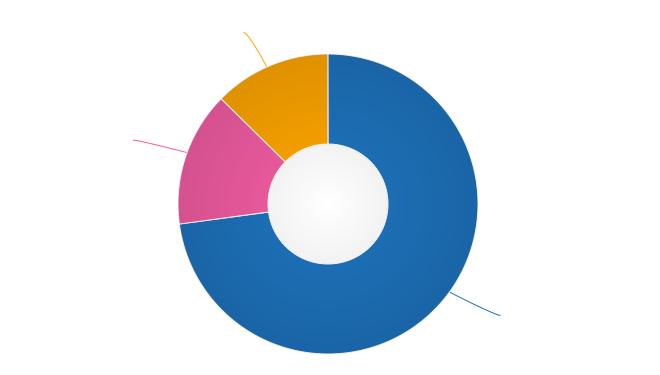

Respondents were able to select reasons for dissatisfaction, even if they indicated that they were “very satisfied”. In total, 45.8% of employee respondents did not select any reasons for dissatisfaction with their salary and benefits.  

.. table:: Reasons for salary dissatisfaction - employees
   :width: 100%
   :name: tbl-salary-reasons-employees

   +-----------------------------------------------------------------------+-------+
   | Reason                                                                | %     |
   +=======================================================================+=======+
   | Salary is too low                                                     | 24.6% |
   +-----------------------------------------------------------------------+-------+
   | Responsibilities exceed pay grade                                     | 19.3% |
   +-----------------------------------------------------------------------+-------+
   | Benefits are missing or insufficient                                  | 15.7% |
   +-----------------------------------------------------------------------+-------+
   | Discrepancy between salary and cost of living in my area              | 13.2% |
   +-----------------------------------------------------------------------+-------+
   | Unfair or inconsistent salary across similar roles in my organization | 12.9% |
   +-----------------------------------------------------------------------+-------+
   | I work too many hours                                                 | 8%    |
   +-----------------------------------------------------------------------+-------+
   | I don’t work enough hours                                             | 0.5%  |
   +-----------------------------------------------------------------------+-------+

Of those who selected “Other” and entered a reason for dissatisfaction with their salary, cost of living increases and “worthless” stock options were the most common complaints that didn’t fit into one of the existing categories. 

3.5 Overall job satisfaction - employees
----------------------------------------

.. container:: question
   
   .. rubric:: What we asked

   14. How satisfied are you with your current job overall?

      - Very unsatisfied
      - Unsatisfied
      - Neutral
      - Satisfied
      - Very satisfied

   14b. If you are not completely satisfied with your job overall, what are your reasons? Check all that apply, or check "none of the above":

      - My workload is too high
      - My workload is too low
      - There is too much stress or pressure
      - The work is not interesting or challenging enough
      - Role is undervalued or underfunded
      - No opportunities for advancement
      - Unsupportive work environment
      - Insufficient opportunities for professional development
      - Outdated toolset
      - Management not open to change
      - No opportunity for remote work
      - I don't feel supported as a remote worker
      - I don't feel respected
      - I am discriminated against on the basis of gender
      - I am discriminated against on the basis of race or nationality
      - I am discriminated against on the basis of age
      - I am discriminated against on the basis of education level
      - I am discriminated against for some other reason, or a reason I do not wish to share
      - Too much bureaucratic overhead/too many meetings
      - Issues with co-workers
      - Bullying and/or harassment
      - Organizational politics
      - Job instability (COVID-related or otherwise)
      - Other (please specify)
      - None of the above

The majority of respondents – 75.9% - rated their overall employment situation in a positive light. Nearly half (49.5%) indicated that they were “satisfied”, with 26.4% extending that to “very satisfied”.
A further 15.2% felt “neutral”. Only 8.9% rated their employment situation negatively – 7.2% indicated that they were “unsatisfied”, and only 1.7% had reason to be “very unsatisfied”. 

.. raw:: html

   <figure>
      <object role="img" aria-label="Overall job satisfaction - employees (2021)" aria-describedby="figure-job-satisfaction-employees_desc" type="image/svg+xml" data="/_images/2021-job-satisfaction-employees.svg">
         
Donut chart showing reported overall job satisfaction by employee respondents: 75.9% felt satisfied; 12.5% felt neutral; 8.9% felt unsatisfied.

      </object> 
      <figcaption>Figure: Overall job satisfaction - employees (2021)</figcaption>
   </figure>

In 2021, 32.7% of employees did not indicate any reasons for dissatisfaction. 

As in 2020, the top reason for dissatisfaction overall was “Role is undervalued or underfunded”, with 28.3% of all respondents in this category selecting this reason. 

.. table:: Reasons for overall job dissatisfaction - employees 
   :width: 100%
   :name: tbl-job-reasons-employees

   +--------------------------------------------------------------------------------------+-------+
   | Reason                                                                               | %     |
   +======================================================================================+=======+
   | Role is undervalued or underfunded                                                   | 28.3% |
   +--------------------------------------------------------------------------------------+-------+
   | No opportunities for advancement                                                     | 18.9% |
   +--------------------------------------------------------------------------------------+-------+
   | My workload is too high                                                              | 17.5% |
   +--------------------------------------------------------------------------------------+-------+
   | Organizational politics                                                              | 16.1% |
   +--------------------------------------------------------------------------------------+-------+
   | There is too much stress or pressure                                                 | 15.8% |
   +--------------------------------------------------------------------------------------+-------+
   | The work is not interesting or challenging enough                                    | 14.8% |
   +--------------------------------------------------------------------------------------+-------+
   | Outdated toolset                                                                     | 14.7% |
   +--------------------------------------------------------------------------------------+-------+
   | Insufficient opportunities for professional development                              | 14.2% |
   +--------------------------------------------------------------------------------------+-------+
   | Too much bureaucratic overhead/too many meetings                                     | 13.9% |
   +--------------------------------------------------------------------------------------+-------+
   | Management not open to change                                                        | 10.4% |
   +--------------------------------------------------------------------------------------+-------+
   | I don't feel respected                                                               | 8.0%  |
   +--------------------------------------------------------------------------------------+-------+
   | Unsupportive work environment                                                        | 5.9%  |
   +--------------------------------------------------------------------------------------+-------+
   | Issues with co-workers                                                               | 4.3%  |
   +--------------------------------------------------------------------------------------+-------+
   | My workload is too low                                                               | 3.8%  |
   +--------------------------------------------------------------------------------------+-------+
   | Job instability (COVID-related or otherwise)                                         | 3.7%  |
   +--------------------------------------------------------------------------------------+-------+
   | I don't feel supported as a remote worker                                            | 3.3%  |
   +--------------------------------------------------------------------------------------+-------+
   | No opportunity for remote work                                                       | 2.8%  |
   +--------------------------------------------------------------------------------------+-------+
   | I am discriminated against on the basis of gender                                    | 1.6%  |
   +--------------------------------------------------------------------------------------+-------+
   | I am discriminated against for some other reason, or a reason I do not wish to share | 1.2%  |
   +--------------------------------------------------------------------------------------+-------+
   | Bullying and/or harassment                                                           | 1.2%  |
   +--------------------------------------------------------------------------------------+-------+
   | I am discriminated against on the basis of age                                       | 0.9%  |
   +--------------------------------------------------------------------------------------+-------+
   | I am discriminated against on the basis of education level                           | 0.5%  |
   +--------------------------------------------------------------------------------------+-------+
   | I am discriminated against on the basis of race or nationality                       | 0.3%  |
   +--------------------------------------------------------------------------------------+-------+

3.6 Positive job aspects - employees
------------------------------------

In previous surveys, we asked respondents to specify reasons for dissatisfaction, but didn’t provide the opportunity to highlight aspects that are satisfying about their salary, benefits, and job. In 2021 we corrected this oversight.

.. container:: question
   
   .. rubric:: What we asked

   14g. What do you like about your current job? Check all that apply, or check "none of the above":

      - I like and/or respect my co-workers
      - I like and/or respect the organization I work for
      - I'm compensated fairly for the work I do
      - I'm satisfied with my benefits
      - My workload is manageable
      - My manager's expectations are realistic/reasonable
      - The work is sufficiently interesting and/or challenging
      - My contributions are valued
      - I feel respected
      - I have opportunities for career development and advancement
      - I have opportunities for professional development/learning
      - I have flexibility in working hours or location
      - Other (please specify)
      - None of the above

While 67.3% of respondents selected something other than “none” for question 14b (reasons for dissatisfaction), over half of those respondents only chose one reason out of the 24 remaining choices, and only 9.4% selected more than five.  

In contrast, when asked to specify what they felt positive about in their jobs, only 4 individuals chose “none of the above”, and of the 13 other potential reasons, the median number of reasons selected was 8 – with 14.8% of respondents checking off all 12 reasons. That’s a lot of positivity! 

.. table:: Reasons for job satisfaction - employees
   :width: 100%
   :name: tbl-satisfaction-employees

   +-------------------------------------------------------------+-------+
   | Reason                                                      | %     |
   +=============================================================+=======+
   | I like and/or respect my co-workers                         | 88.8% |
   +-------------------------------------------------------------+-------+
   | I have flexibility in working hours or location             | 79.5% |
   +-------------------------------------------------------------+-------+
   | My manager's expectations are realistic/reasonable          | 71.0% |
   +-------------------------------------------------------------+-------+
   | I like and/or respect the organization I work for           | 68.3% |
   +-------------------------------------------------------------+-------+
   | The work is sufficiently interesting and/or challenging     | 65.6% |
   +-------------------------------------------------------------+-------+
   | My workload is manageable                                   | 63.5% |
   +-------------------------------------------------------------+-------+
   | I feel respected                                            | 63.2% |
   +-------------------------------------------------------------+-------+
   | My contributions are valued                                 | 62.6% |
   +-------------------------------------------------------------+-------+
   | I'm compensated fairly for the work I do                    | 60.2% |
   +-------------------------------------------------------------+-------+
   | I have opportunities for career development and advancement | 58.2% |
   +-------------------------------------------------------------+-------+
   | I'm satisfied with my benefits                              | 57.7% |
   +-------------------------------------------------------------+-------+
   | I have opportunities for professional development/learning  | 54.1% |
   +-------------------------------------------------------------+-------+

1.7% of respondents selected “Other” and wrote in more detail. The common themes in these notes were:

- positive work-life balance
- mentoring
- strong team dynamics  
- pride in the quality of the work produced
- positive impact (“doing good in the world”) 

3.7 Salary – independent contractors, freelancers and self-employed
-------------------------------------------------------------------

.. container:: question
   
   .. rubric:: What we asked

   11h. Which fee structures do you typically use? Check all that apply.

      - Hourly rate
      - Day rate
      - Other (please specify)

      11k. What is your hourly rate (including tax)? OR 11l. What is your day rate (including tax)?
      
      Note: Please enter your rate as a whole number, without decimal places. Currency symbols are not required. Commas are ok. 
      If you charge different rates, enter your most common rate, or an average if you feel that is more accurate.

      Respondents who selected “Other” were shown an additional instruction:

      You've indicated that you use a fee structure other than an hourly or daily rate. To make it possible for us to compare rates for contractors and freelance operators, we would appreciate if you could estimate the equivalent hourly or daily rate for your alternative fee structure.

In 2021, we received submissions from 72 independent contractor, freelancer or self-employed respondents (hereinafter referred to as “contractors” for simplicity) – 7.5% of the total number of survey respondents. Although this represents an increase over the number of contractor submissions in 2019 and 2020, the low number makes it difficult to extract meaningful region, country or role-related median rate information without compromising the privacy of individuals in our community.

73.6% of contractors bill their clients using an hourly rate fee structure, whereas 16.7% bill using a day rate fee structure, and only 3 individuals use both. 16.6% indicated that they used a different fee structure either instead of or in addition to the hourly rate or day rate – the majority of those specified a monthly fee structure.

To enable comparisons to be drawn, we asked contractors using alternative fee structures to estimate an equivalent hourly rate or a day rate (or both). In the final count, we had 55 individual hourly rates and 20 day rates in our 2021 data set.

Median hourly rate (USD) - contractors 
~~~~~~~~~~~~~~~~~~~~~~~~~~~~~~~~~~~~~~

The overall median hourly rate was **USD $46** (from 55 respondents in 13 countries). The only regions with enough data to safely split out, taking the privacy of respondents into account, are shown in the table below.

.. table:: Median hourly rate (USD) by region - contractors
   :width: 100%
   :name: tbl-median-region-contractors

   +-------------------------------------------------------------------------------------------+-----+--------------+
   | Region                                                                                    | No. | Median (USD) |
   +===========================================================================================+=====+==============+
   | North America (United States, Canada)                                                     | 30  | $50          |
   +-------------------------------------------------------------------------------------------+-----+--------------+
   | Europe overall                                                                            | 18  | $30          |
   +-------------------------------------------------------------------------------------------+-----+--------------+
   | European countries with a lower cost-of-living (Ukraine, Poland, Czech Republic, Croatia) | 10  | $19          |
   +-------------------------------------------------------------------------------------------+-----+--------------+

Median day rate (USD) - contractors
~~~~~~~~~~~~~~~~~~~~~~~~~~~~~~~~~~~~~~

The overall median day rate was **USD $389** (from 20 respondents in 14 countries). Due to the low number of respondents entering a day rate, there is not enough data to allow us to publish regional medians without compromising the privacy of community members.  

3.8 Salary/Rate satisfaction – independent contractors, freelancers and self-employed
-------------------------------------------------------------------------------------

.. container:: question
   
   .. rubric:: What we asked

   13d. How satisfied are you with your freelance or contract rates?

      - Very unsatisfied
      - Unsatisfied
      - Neutral
      - Satisfied
      - Very satisfied

   13e. If you are not completely satisfied with your freelance or contract rates, is it because (check all that apply, or check "none of the above"):

      - Rate is too low
      - Benefits are missing or insufficient
      - Discrepancy between rate and cost of living in my area
      - Unfair or inconsistent rates across similar roles in the organization(s) I work for
      - I work too many hours
      - I don't work enough hours
      - Responsibilities exceed pay grade
      - Accounting/management overhead is too high
      - Other (please specify)
      - None of the above

70.9% of contractors reported being “satisfied” (54.2%) or “very satisfied” (16.7%) with their rates. 15.3% were “neutral”, and 13.9% were “unsatisfied”. None of the respondents said they were “very unsatisfied”. 

.. raw:: html

   <figure>
      <object role="img" aria-label="Rate satisfaction - contractors (2021)" aria-describedby="figure-salary-satisfaction-contractors_desc" type="image/svg+xml" data="/_images/2021-rate-satisfaction-contractors.svg">
         
Donut chart showing satisfaction with contract/freelance rates of independent contractor respondents: 70.9% felt satisfied; 15.3% felt neutral; 13.9% felt unsatisfied.

      </object> 
      <figcaption>Figure: Rate satisfaction - contractors (2021)</figcaption>
   </figure>

36.1% of contractors did not list any reasons for dissatisfaction with their rates – the same percentage who cited “missing benefits”, the top reason. 23.6% stated that their rate was too low, while 11.1% felt that their responsibilities exceeded their pay grade. 

.. table:: Reasons for contract rate dissatisfaction - contractors
   :width: 100%
   :name: tbl-rate-reasons-contractors

   +-------------------------------------------------------------------------------------+-------+
   | Reason                                                                              | %     |
   +=====================================================================================+=======+
   | Benefits are missing or insufficient                                                | 36.1% |
   +-------------------------------------------------------------------------------------+-------+
   | Rate is too low                                                                     | 23.6% |
   +-------------------------------------------------------------------------------------+-------+
   | Responsibilities exceed pay grade                                                   | 11.1% |
   +-------------------------------------------------------------------------------------+-------+
   | Accounting/management overhead is too high                                          | 9.7%  |
   +-------------------------------------------------------------------------------------+-------+
   | Discrepancy between rate and cost of living in my area                              | 8.3%  |
   +-------------------------------------------------------------------------------------+-------+
   | Unfair or inconsistent rates across similar roles in the organization(s) I work for | 6.9%  |
   +-------------------------------------------------------------------------------------+-------+
   | I don't work enough hours                                                           | 5.6%  |
   +-------------------------------------------------------------------------------------+-------+
   | I work too many hours                                                               | 2.8%  |
   +-------------------------------------------------------------------------------------+-------+

15.3% selected “Other” and wrote in more detail. The common themes across these comments were:

- The feeling of missing out on being part of a team
- Difficulty in negotiation of rates
- Over-qualified for available opportunities, or rate ceiling for region already reached
- Self-discipline

3.9 Overall satisfaction – independent contractors, freelancers and self-employed
---------------------------------------------------------------------------------

.. container:: question
   
   .. rubric:: What we asked

   14d. How satisfied are you overall with your freelance or contract situation?

      - Very unsatisfied
      - Unsatisfied
      - Neutral
      - Satisfied
      - Very satisfied

   14e. If you are not completely satisfied with your overall freelance or contract situation, what are the reasons? Check all that apply, or check "none of the above":

      - My workload is too high
      - My workload is too low
      - There is too much stress or pressure
      - The work is not interesting or challenging enough
      - Role is undervalued or underfunded
      - No opportunities for advancement
      - Unsupportive work environment
      - Insufficient opportunities for professional development
      - Outdated toolset
      - Management not open to change
      - No opportunity for remote work
      - I don't feel supported as a remote worker
      - I don't feel respected
      - I am discriminated against on the basis of gender
      - I am discriminated against on the basis of race or nationality
      - I am discriminated against on the basis of age
      - I am discriminated against on the basis of education level
      - I am discriminated against for some other reason, or a reason I do not wish to share
      - Too much bureaucratic overhead/too many meetings
      - Issues with co-workers
      - Bullying and/or harassment
      - Organizational politics
      - Job instability (COVID-related or otherwise)
      - Other (please specify)
      - None of the above

76.4% of contractors reported being “satisfied” (63.9%) or “very satisfied” (12.5%) with their contracting situation overall. 9.7% indicated they felt “neutral”, and 13.9% reported feeling “unsatisfied”. No contractors reported feeling “very unsatisfied”. 

.. raw:: html

   <figure>
      <object role="img" aria-label="Overall freelance/contract situation satisfaction - contractors (2021)" aria-describedby="figure-overall-satisfaction-contractors_desc" type="image/svg+xml" data="/_images/2021-overall-satisfaction-contractors.svg">
         
Donut chart showing satisfaction with overall freelance or contract situation of independent contractor respondents: 76.4% felt satisfied; 9.7% felt neutral; 13.9% felt unsatisfied.

      </object> 
      <figcaption>Figure: Overall freelance/contract situation satisfaction - contractors (2021)</figcaption>
   </figure>

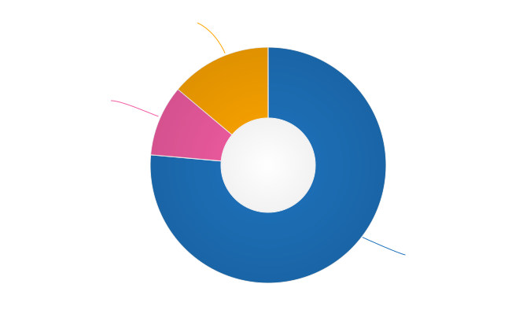

19.4% of contractors did not select any reasons for dissatisfaction with their contracting situation overall. As with employees, the top reason for dissatisfaction was “Role is undervalued or underfunded” (27.8% of contractors, and 28.3% of employees). Unlike employees, however, the next top reason was “Job instability (COVID-related or otherwise)” with 26.4% selecting this (compared to only 3.4% of employees). “No opportunities for advancement” was next, with 18.1% of contractors indicating this (a similar proportion to employees, at 18.9%, the second most common reason selected).

.. table:: Reasons for overall dissatisfaction - contractors
   :width: 100%
   :name: tbl-overall-reasons-contractors

   +--------------------------------------------------------------------------------------+-------+
   | Reason                                                                               | %     |
   +======================================================================================+=======+
   | Role is undervalued or underfunded                                                   | 27.8% |
   +--------------------------------------------------------------------------------------+-------+
   | Job instability (COVID-related or otherwise)                                         | 26.4% |
   +--------------------------------------------------------------------------------------+-------+
   | No opportunities for advancement                                                     | 18.1% |
   +--------------------------------------------------------------------------------------+-------+
   | Insufficient opportunities for professional development                              | 15.3% |
   +--------------------------------------------------------------------------------------+-------+
   | Outdated toolset                                                                     | 15.3% |
   +--------------------------------------------------------------------------------------+-------+
   | The work is not interesting or challenging enough                                    | 13.9% |
   +--------------------------------------------------------------------------------------+-------+
   | There is too much stress or pressure                                                 | 12.5% |
   +--------------------------------------------------------------------------------------+-------+
   | Management not open to change                                                        | 11.1% |
   +--------------------------------------------------------------------------------------+-------+
   | Too much bureaucratic overhead/too many meetings                                     | 9.7%  |
   +--------------------------------------------------------------------------------------+-------+
   | Unsupportive work environment                                                        | 9.7%  |
   +--------------------------------------------------------------------------------------+-------+
   | My workload is too high                                                              | 8.3%  |
   +--------------------------------------------------------------------------------------+-------+
   | My workload is too low                                                               | 8.3%  |
   +--------------------------------------------------------------------------------------+-------+
   | Organizational politics                                                              | 8.3%  |
   +--------------------------------------------------------------------------------------+-------+
   | Issues with co-workers                                                               | 8.3%  |
   +--------------------------------------------------------------------------------------+-------+
   | I don't feel supported as a remote worker                                            | 6.9%  |
   +--------------------------------------------------------------------------------------+-------+
   | I don't feel respected                                                               | 5.6%  |
   +--------------------------------------------------------------------------------------+-------+
   | No opportunity for remote work                                                       | 2.8%  |
   +--------------------------------------------------------------------------------------+-------+
   | Bullying and/or harassment                                                           | 2.8%  |
   +--------------------------------------------------------------------------------------+-------+
   | I am discriminated against on the basis of gender                                    | 2.8%  |
   +--------------------------------------------------------------------------------------+-------+
   | I am discriminated against on the basis of age                                       | 2.8%  |
   +--------------------------------------------------------------------------------------+-------+
   | I am discriminated against on the basis of education level                           | 1.4%  |
   +--------------------------------------------------------------------------------------+-------+
   | I am discriminated against for some other reason, or a reason I do not wish to share | 1.4%  |
   +--------------------------------------------------------------------------------------+-------+

11.1% of contractors chose “Other” and added additional comments. The general sentiments included:

- Difficulties in finding part time jobs
- Sporadic work
- Difficulties in negotiations over rates and conditions

3.10 Positive job aspects - contractors
---------------------------------------

.. container:: question
   
   .. rubric:: What we asked

   14i. What do you like about your current freelance or contract situation? Check all that apply, or check "none of the above":

      - I like and/or respect my co-workers
      - I like and/or respect the organization/s I contract for
      - I'm compensated fairly for the work I do
      - I'm satisfied with my benefits
      - My workload is manageable
      - The expectations on me are realistic/reasonable
      - My work is sufficiently interesting and/or challenging
      - My contributions are valued
      - I feel respected
      - I have opportunities for career development and advancement
      - I have opportunities for professional development/learning
      - I have flexibility in working hours or location
      - Other (please specify)
      - None of the above

As with the employee respondents, contractors on average chose many positive aspects about their contract/freelance situation. The top reason, indicated by 81.9% of contractors, was “I have flexibility in working hours or location” – this was also the second top reason selected by employees (79.5%). The next most selected reason was “I like and/or respect my co-workers” with 75%.

.. table:: Reasons for job satisfaction - contractors
   :width: 100%
   :name: tbl-satisfaction-contractors

   +-------------------------------------------------------------+-------+
   | Reason                                                      | %     |
   +=============================================================+=======+
   | I have flexibility in working hours or location             | 81.9% |
   +-------------------------------------------------------------+-------+
   | I like and/or respect my co-workers                         | 75.0% |
   +-------------------------------------------------------------+-------+
   | My workload is manageable                                   | 66.7% |
   +-------------------------------------------------------------+-------+
   | I like and/or respect the organization/s I contract for     | 62.5% |
   +-------------------------------------------------------------+-------+
   | I have opportunities for professional development/learning  | 61.1% |
   +-------------------------------------------------------------+-------+
   | The expectations on me are realistic/reasonable             | 61.1% |
   +-------------------------------------------------------------+-------+
   | I'm compensated fairly for the work I do                    | 59.7% |
   +-------------------------------------------------------------+-------+
   | My work is sufficiently interesting and/or challenging      | 59.7% |
   +-------------------------------------------------------------+-------+
   | My contributions are valued                                 | 59.7% |
   +-------------------------------------------------------------+-------+
   | I feel respected                                            | 56.9% |
   +-------------------------------------------------------------+-------+
   | I have opportunities for career development and advancement | 18.1% |
   +-------------------------------------------------------------+-------+
   | I'm satisfied with my benefits                              | 15.3% |
   +-------------------------------------------------------------+-------+

Only 1 contractor chose not to select any positive aspects. 

Section 4: Organization demographics
====================================

This section of the survey contained questions relating to the organization that the respondent worked for: the organization size, industry and main geographical location. 
Contractors were asked to profile either their main client organization or the typical client organization they work for, at their discretion. 

4.1 Organization size
---------------------

.. container:: question
   
   .. rubric:: What we asked

   15. What is the approximate size of your organization, in number of employees?

      - Less than 10     
      - 10 – 50       
      - 50 – 100      
      - 100 – 1000    
      - 1000 – 10,000      
      - 10,000 – 100,000      
      - More than 100,000

Very small operations (up to 10 employees) again made up the smallest proportion of responses at just over 1% (11 individual respondents). At the other end of the scale, the largest proportion of respondents – 35.6% – worked for organizations made up of between 100 and 1000 employees.
 
- 25.3% – the second largest group of respondents – worked for medium-large organizations with 1,000 to 10,000 employees
- 11.2% worked for large organizations with 10,000 to 100,000 employees
- 10.8% worked for organizations with over 100,000 employees
- 8.3% worked for small companies, with 50 to 100 employees, and
- 7.4% worked for companies with between 10 and 50 employees.

.. raw:: html

   <figure>
      <object role="img" aria-label="Organization size (2021)" aria-describedby="figure-org-size_desc" type="image/svg+xml" data="/_images/2021-organization-size.svg">
         
Bar chart showing employer organization size

      </object> 
      <figcaption>Figure: Organization size (2021)</figcaption>
   </figure>

.. figure:: images/2021/2021-organization-size.svg
   :class: hide

4.2 Industry
------------

.. container:: question
   
   .. rubric:: What we asked

   16. Which industry does your organization operate in?

      - Advertising, Marketing
      - Agriculture
      - Airlines, Aerospace, Defense, Military
      - Automotive
      - Business Support, Professional Services, Sales, Consulting
      - Construction, Machinery, Homes
      - Education, Training
      - Entertainment, Leisure, Gaming
      - Finance, Banking, Financial Services, Financial Technology
      - Food, Beverages
      - Government
      - Healthcare, Medical, Pharmaceuticals, Biotechnology
      - Insurance
      - Legal Services
      - Manufacturing, Hardware
      - Media, Radio, TV, Journalism
      - Non-profit, Community
      - Retail, Consumer Products
      - Real Estate
      - Science, Research
      - Security
      - Software Development, Software Development Tools (not industry-specific)
      - Telecommunications, Technology, Internet, Electronics
      - Transportation, Delivery, Logistics, GPS, Mapping
      - Travel, Hospitality, Holidays
      - Utilities, Energy, Mining, Extraction
      - Other (please specify)

      Note for software development and IT companies:
      
      Please choose the industry that your product or service primarily serves.
      For example, if your organization produces e-learning software, select "Education, Training". If you work for a company that makes point of sale systems for restaurants, select "Food, Beverages".
      Please only select "Software Development, Software Development Tools" if your organization's customers are software developers.

After examining the 65 typed-in responses that were given when Other was selected, some clarifications were added to the list of industries and several additions were made, which are reflected in the table below and will be included in the survey questions in 2022. 

The largest proportion of respondents chose Software Development (not industry-specific) as their organization’s primary industry: 33.2%. The second largest industry was Telecommunications with 14%, ahead of Finance and Banking, with 9.1%. 

.. table:: Organization industry
   :width: 100%
   :name: tbl-org-industry

   +------------------------------------------------------------------------------------------------------------------------+-------+
   | Industry                                                                                                               | %     |
   +========================================================================================================================+=======+
   | Software Development, Software Development Tools (not industry-specific), Open Source                                  | 33.2% |
   +------------------------------------------------------------------------------------------------------------------------+-------+
   | Telecommunications, Technology, Internet, Electronics, Hosting, Domains                                                | 14.0% |
   +------------------------------------------------------------------------------------------------------------------------+-------+
   | Finance, Banking, Financial Services, Financial Technology                                                             | 9.1%  |
   +------------------------------------------------------------------------------------------------------------------------+-------+
   | Business Support, Professional Services, Sales, Consulting, Risk Management, Process Automation, Compliance, Contracts | 5.9%  |
   +------------------------------------------------------------------------------------------------------------------------+-------+
   | Healthcare, Medical, Pharmaceuticals, Biotechnology                                                                    | 5.1%  |
   +------------------------------------------------------------------------------------------------------------------------+-------+
   | Security, Cybersecurity                                                                                                | 3.8%  |
   +------------------------------------------------------------------------------------------------------------------------+-------+
   | Manufacturing, Hardware, Engineering, Precision Engineering                                                            | 3.8%  |
   +------------------------------------------------------------------------------------------------------------------------+-------+
   | Advertising, Marketing, CRM                                                                                            | 2.9%  |
   +------------------------------------------------------------------------------------------------------------------------+-------+
   | Retail, Consumer Products                                                                                              | 2.4%  |
   +------------------------------------------------------------------------------------------------------------------------+-------+
   | Education, Training                                                                                                    | 2.3%  |
   +------------------------------------------------------------------------------------------------------------------------+-------+
   | Entertainment, Leisure, Gaming, Sports, E-Sports                                                                       | 2.2%  |
   +------------------------------------------------------------------------------------------------------------------------+-------+
   | Transportation, Delivery, Logistics, GPS, Mapping, Supply Chain                                                        | 1.9%  |
   +------------------------------------------------------------------------------------------------------------------------+-------+
   | Government                                                                                                             | 1.5%  |
   +------------------------------------------------------------------------------------------------------------------------+-------+
   | Airlines, Aerospace, Defense, Military, Maritime                                                                       | 1.3%  |
   +------------------------------------------------------------------------------------------------------------------------+-------+
   | Media, Radio, TV, Journalism                                                                                           | 1.3%  |
   +------------------------------------------------------------------------------------------------------------------------+-------+
   | Utilities, Energy, Mining, Extraction                                                                                  | 1.3%  |
   +------------------------------------------------------------------------------------------------------------------------+-------+
   | Insurance                                                                                                              | 1.1%  |
   +------------------------------------------------------------------------------------------------------------------------+-------+
   | Multiple Industries                                                                                                    | 1.1%  |
   +------------------------------------------------------------------------------------------------------------------------+-------+
   | Data Analytics, Data Science, Data Warehousing, AI, Machine Learning                                                   | 1.0%  |
   +------------------------------------------------------------------------------------------------------------------------+-------+
   | Construction, Machinery, Homes, Building, Architecture, Engineering                                                    | 0.6%  |
   +------------------------------------------------------------------------------------------------------------------------+-------+
   | Automotive                                                                                                             | 0.6%  |
   +------------------------------------------------------------------------------------------------------------------------+-------+
   | Science, Research                                                                                                      | 0.5%  |
   +------------------------------------------------------------------------------------------------------------------------+-------+
   | Real Estate                                                                                                            | 0.4%  |
   +------------------------------------------------------------------------------------------------------------------------+-------+
   | Legal Services                                                                                                         | 0.4%  |
   +------------------------------------------------------------------------------------------------------------------------+-------+
   | Non-profit, Community                                                                                                  | 0.3%  |
   +------------------------------------------------------------------------------------------------------------------------+-------+
   | Human Resources, Recruitment                                                                                           | 0.3%  |
   +------------------------------------------------------------------------------------------------------------------------+-------+
   | Event Management, Event Services                                                                                       | 0.3%  |
   +------------------------------------------------------------------------------------------------------------------------+-------+
   | Food, Beverages                                                                                                        | 0.3%  |
   +------------------------------------------------------------------------------------------------------------------------+-------+
   | Design                                                                                                                 | 0.2%  |
   +------------------------------------------------------------------------------------------------------------------------+-------+
   | Agriculture                                                                                                            | 0.2%  |
   +------------------------------------------------------------------------------------------------------------------------+-------+
   | Translation, Localization                                                                                              | 0.2%  |
   +------------------------------------------------------------------------------------------------------------------------+-------+
   | Travel, Hospitality, Holidays                                                                                          | 0.2%  |
   +------------------------------------------------------------------------------------------------------------------------+-------+
   | Other                                                                                                                  | 0.1%  |
   +------------------------------------------------------------------------------------------------------------------------+-------+
   | Manufacturing, Hardware                                                                                                | 0.1%  |
   +------------------------------------------------------------------------------------------------------------------------+-------+
   | Culture, Arts, Heritage                                                                                                | 0.1%  |
   +------------------------------------------------------------------------------------------------------------------------+-------+

4.3 Organization location
-------------------------

.. container:: question
   
   .. rubric:: What we asked

   17. In which country is your organization based?
      
      Note: This is the primary location, headquarters or main location of the organization that you work for. If your organization operates in multiple countries independently, select "multi-national or global organization". The location where you live will be covered in Section 6.

As in 2020, the United States accounted for 46.6% of all employer organizations – the largest group. Another 21.4% worked for a global or multinational organization. 
The next best-represented country was Canada, with 5%, followed by Russia with 3.3%, Great Britain with 3%, Germany with 2.9%, Israel with 2.6% and Australia with 2%.

.. table:: Organization location
   :width: 100%
   :name: tbl-org-location

   +---------------------------------------------------------------------------------------------------------------------------------------+-------+
   | Country                                                                                                                               | %     |
   +=======================================================================================================================================+=======+
   | United States                                                                                                                         | 46.6% |
   +---------------------------------------------------------------------------------------------------------------------------------------+-------+
   | Global or Multinational Organization                                                                                                  | 21.4% |
   +---------------------------------------------------------------------------------------------------------------------------------------+-------+
   | Canada                                                                                                                                | 5.0%  |
   +---------------------------------------------------------------------------------------------------------------------------------------+-------+
   | Russia                                                                                                                                | 3.3%  |
   +---------------------------------------------------------------------------------------------------------------------------------------+-------+
   | Great Britain                                                                                                                         | 3.0%  |
   +---------------------------------------------------------------------------------------------------------------------------------------+-------+
   | Germany                                                                                                                               | 2.9%  |
   +---------------------------------------------------------------------------------------------------------------------------------------+-------+
   | Israel                                                                                                                                | 2.6%  |
   +---------------------------------------------------------------------------------------------------------------------------------------+-------+
   | Australia                                                                                                                             | 2.0%  |
   +---------------------------------------------------------------------------------------------------------------------------------------+-------+
   | Ukraine                                                                                                                               | 1.8%  |
   +---------------------------------------------------------------------------------------------------------------------------------------+-------+
   | France                                                                                                                                | 1.6%  |
   +---------------------------------------------------------------------------------------------------------------------------------------+-------+
   | Netherlands, Finland                                                                                                                  | 1.3%  |
   +---------------------------------------------------------------------------------------------------------------------------------------+-------+
   | India                                                                                                                                 | 0.9%  |
   +---------------------------------------------------------------------------------------------------------------------------------------+-------+
   | Sweden, Poland                                                                                                                        | 0.6%  |
   +---------------------------------------------------------------------------------------------------------------------------------------+-------+
   | Japan                                                                                                                                 | 0.5%  |
   +---------------------------------------------------------------------------------------------------------------------------------------+-------+
   | China, Ireland, New Zealand                                                                                                           | 0.4%  |
   +---------------------------------------------------------------------------------------------------------------------------------------+-------+
   | Switzerland, Austria                                                                                                                  | 0.3%  |
   +---------------------------------------------------------------------------------------------------------------------------------------+-------+
   | Sri Lanka, Singapore, Portugal, Romania, Mexico, Belarus                                                                              | 0.2%  |
   +---------------------------------------------------------------------------------------------------------------------------------------+-------+
   | Czech Republic, Denmark, Philippines, Spain, Estonia, Swaziland, Algeria, Hungary, Italy, Brazil, Vietnam, Nigeria, Taiwan, Argentina | 0.1%  |
   +---------------------------------------------------------------------------------------------------------------------------------------+-------+

Organization location breakdown - United States
~~~~~~~~~~~~~~~~~~~~~~~~~~~~~~~~~~~~~~~~~~~~~~~

Nearly half of all employer organizations based in the United States were based in California, with New York, Texas and Massachusetts coming in with 7%, 6.7% and 4.9% respectively. No other state made up more than 4% of the total. 

Section 5: Respondent demographics
==================================

This section collected demographic information on the respondent themselves. All questions except for country (and in the case of the US, Canada, Australia and the United Kingdom, state, province or region) included an “I’d rather not say” option – while anonymity is important, country and state level information is critical to the usefulness of the data we collect. 

5.1 Age
-------

.. container:: question
   
   .. rubric:: What we asked

   18. What is your age?

      - 18-25
      - 26-35
      - 36-45
      - 46-55
      - 56-65
      - 66+
      - I'd rather not say

The two largest-represented age groups (26-35 year olds and 36-45 year olds) combined formed 64.6% of the total number of respondents. 46-55 year olds made up 17.3% and 56-65 year olds another 9%.
The youngest age bracket (18-25 year olds) made up 6.3%, and the oldest bracket – those 66 years old or more – came in at 1.6% or 15 individuals, which is 3 times the number of respondents in that bracket in 2020 (there were no respondents in this bracket in 2019). 13 respondents chose not to provide their age range. 

.. raw:: html

   <figure>
      <object role="img" aria-label="Respondent age range (2021)" aria-describedby="figure-age_desc" type="image/svg+xml" data="/_images/2021-respondent-age.svg">
         
Bar chart showing age range of respondents: 18-25 year olds made up 6.3%; 26-35 year olds made up 35.8%; 36-45 year olds made up 28.8%; 46-55 year olds made up 17.3%; 56-65 year olds made up 9%; over 66 year olds made up 1.6%.

      </object> 
      <figcaption>Figure: Respondent age range (2021)</figcaption>
   </figure>

5.2 Gender Identity
-------------------

.. container:: question
   
   .. rubric:: What we asked

   19. What gender identity do you most identify with?

      - Woman
      - Man
      - Non-binary
      - Other (please specify)
      - I'd rather not say

57.5% of respondents identified as women, 38% as men, and 2.3% as non-binary, genderqueer or other. 21 respondents chose not to answer this question. 

These proportions are mostly unchanged from previous surveys.  

.. raw:: html

   <figure>
      <object role="img" aria-label="Respondent gender identity (2021)" aria-describedby="figure-gender_desc" type="image/svg+xml" data="/_images/2021-gender-identity.svg">
         
Donut chart showing respondent gender identity: 57.5% most identify as women, 38% as men, 2.3% as non-binary or other; and 2.2% chose not to specify.

      </object> 
      <figcaption>Figure: Respondent gender identity (2021)</figcaption>
   </figure>

5.3 Years of experience in documentation
----------------------------------------

.. container:: question
   
   .. rubric:: What we asked

   20. How many years of experience do you have in documentation?

      - Less than 1 year
      - 1 - 2 years
      - 2 - 5 years
      - 5 - 10 years
      - 10 - 15 years
      - 15 - 20 years
      - 20 - 25 years
      - 25 - 30 years
      - More than 30 years
      - I'd rather not say

Due to the high number of survey respondents with more than 10 years of experience working in documentation, the potential responses to this question were broken up with greater granularity than in previous surveys. 

26.8% of respondents had between 5 and 10 years of experience. Those with more than 10 years of experience accounted for 38.1%, while relative newcomers with up to 5 years of experience made up 34.5%. 7 individuals chose not to respond.

Of the 28 respondents reporting more than 30 years of experience, 24 fell between 31 and 38 years. Individual respondents reported 40 and 41 years, with 2 respondents each reporting 45 years. 

.. raw:: html

   <figure>
      <object role="img" aria-label="Years of experience in documentation (2021)" aria-describedby="figure-experience_desc" type="image/svg+xml" data="/_images/2021-years-experience.svg">
         
Bar chart showing respondent's years of experience in documentation: those with less than 1 year made up 4.4%; between 1 and 2 years made up 7.3%; between 2 and 5 years made up 22.8%; between 5 and 10 years made up 26.7%; between 10 and 15 years made up 12.5%; between 15 and 20 years made up 8.2%; between 20 and 25 years made up 9.4%; between 25 and 30 years made up 5%; more than 30 years made up 2.9%.

      </object> 
      <figcaption>Figure: Years of experience in documentation (2021)</figcaption>
   </figure>

.. figure:: images/2021/2021-years-experience.svg
   :class: hide

5.4 Highest education level completed
-------------------------------------

.. container:: question
   
   .. rubric:: What we asked

   21. What is the highest level of education that you have completed?

      - High School or equivalent
      - Technical College Qualification or equivalent
      - College or University Under-Graduate Qualification (Certificate, Diploma, Associate Degree, Bachelor's Degree)
      - Post-Graduate Degree (Master's Degree, Post-Graduate Diploma or Certificate, Doctorate)
      - Other (please specify)
      - I'd rather not say

53.3% of respondents had a college or university under-graduate qualification, or equivalent. 39.5% had gone on to earn post-graduate qualifications. 
Only 3.6% of respondents selected high school as their highest completed level of education, with 2.6% completing a technical college or equivalent degree. 9 respondents chose not to answer. 

.. raw:: html

   <figure>
      <object role="img" aria-label="Highest education level completed (2021)" aria-describedby="figure-education_desc" type="image/svg+xml" data="/_images/2021-education-level.svg">
         
Donut chart showing respondent's highest level of education completed: 3.6% completed high school or equivalent; 2.6% completed technical college or equivalent; 53.3% completed an under-graduate degree, and 39.5% completed a post-graduate degree.

      </object> 
      <figcaption>Figure: Highest education level completed (2021)</figcaption>
   </figure>

5.5 Geographical location
-------------------------

.. container:: question
   
   .. rubric:: What we asked

   Respondents were asked to select a country, then a state, province territory or region, if relevant, and finally to enter a city or town. 
   
   While selection of a country was mandatory (in order to ensure the data collected was useful), respondents could enter “N/A” or similar for city/town if they did not wish to provide further information.  

This year’s survey drew responses from 49 different countries – that number was 45 in 2020, and 43 in 2019.  

Just under half (49.4%) of all respondents live in the United States – a slightly higher proportion than in 2020 (46%), but still lower than in 2019 (58%). Canada was the next best-represented country with 8.2%, followed by Israel with 4.7% and the United Kingdom with 4.6%. 

.. raw:: html

   

.. table:: Respondent location
   :width: 100%
   :name: tbl-respondent-location

   +---------------+----------------+-------------+------------+
   | Region        | Country        | Respondents | % of total |
   +===============+================+=============+============+
   | North America |                | 556         | 58%        |
   +---------------+----------------+-------------+------------+
   |               | United States  | 474         |            |
   +---------------+----------------+-------------+------------+
   |               | Canada         | 80          |            |
   +---------------+----------------+-------------+------------+
   |               | Mexico         | 2           |            |
   +---------------+----------------+-------------+------------+
   | Europe        |                | 272         | 28.4%      |
   +---------------+----------------+-------------+------------+
   |               | United Kingdom | 44          |            |
   +---------------+----------------+-------------+------------+
   |               | Russia         | 39          |            |
   +---------------+----------------+-------------+------------+
   |               | Ukraine        | 36          |            |
   +---------------+----------------+-------------+------------+
   |               | Germany        | 26          |            |
   +---------------+----------------+-------------+------------+
   |               | Poland         | 16          |            |
   +---------------+----------------+-------------+------------+
   |               | France         | 15          |            |
   +---------------+----------------+-------------+------------+
   |               | Netherlands    | 14          |            |
   +---------------+----------------+-------------+------------+
   |               | Finland        | 13          |            |
   +---------------+----------------+-------------+------------+
   |               | Ireland        | 13          |            |
   +---------------+----------------+-------------+------------+
   |               | Sweden         | 8           |            |
   +---------------+----------------+-------------+------------+
   |               | Portugal       | 6           |            |
   +---------------+----------------+-------------+------------+
   |               | Croatia        | 5           |            |
   +---------------+----------------+-------------+------------+
   |               | Czech Republic | 5           |            |
   +---------------+----------------+-------------+------------+
   |               | Romania        | 5           |            |
   +---------------+----------------+-------------+------------+
   |               | Spain          | 5           |            |
   +---------------+----------------+-------------+------------+
   |               | Belarus        | 3           |            |
   +---------------+----------------+-------------+------------+
   |               | Hungary        | 3           |            |
   +---------------+----------------+-------------+------------+
   |               | Switzerland    | 3           |            |
   +---------------+----------------+-------------+------------+
   |               | Austria        | 2           |            |
   +---------------+----------------+-------------+------------+
   |               | Italy          | 2           |            |
   +---------------+----------------+-------------+------------+
   |               | Belgium        | 1           |            |
   +---------------+----------------+-------------+------------+
   |               | Cyprus         | 1           |            |
   +---------------+----------------+-------------+------------+
   |               | Denmark        | 1           |            |
   +---------------+----------------+-------------+------------+
   |               | Estonia        | 1           |            |
   +---------------+----------------+-------------+------------+
   |               | Lithuania      | 1           |            |
   +---------------+----------------+-------------+------------+
   |               | Norway         | 1           |            |
   +---------------+----------------+-------------+------------+
   |               | Serbia         | 1           |            |
   +---------------+----------------+-------------+------------+
   |               | Slovenia       | 1           |            |
   +---------------+----------------+-------------+------------+
   |               | Turkey         | 1           |            |
   +---------------+----------------+-------------+------------+
   | Middle East   | Israel         | 45          | 4.7%       |
   +---------------+----------------+-------------+------------+
   | Asia          |                | 43          | 4.5%       |
   +---------------+----------------+-------------+------------+
   |               | India          | 26          |            |
   +---------------+----------------+-------------+------------+
   |               | China          | 5           |            |
   +---------------+----------------+-------------+------------+
   |               | Japan          | 3           |            |
   +---------------+----------------+-------------+------------+
   |               | Phillippines   | 2           |            |
   +---------------+----------------+-------------+------------+
   |               | Sri Lanka      | 2           |            |
   +---------------+----------------+-------------+------------+
   |               | Vietnam        | 2           |            |
   +---------------+----------------+-------------+------------+
   |               | Bangladesh     | 1           |            |
   +---------------+----------------+-------------+------------+
   |               | Singapore      | 1           |            |
   +---------------+----------------+-------------+------------+
   |               | Taiwan         | 1           |            |
   +---------------+----------------+-------------+------------+
   | Oceania       |                | 36          | 3.8%       |
   +---------------+----------------+-------------+------------+
   |               | Australia      | 31          |            |
   +---------------+----------------+-------------+------------+
   |               | New Zealand    | 5           |            |
   +---------------+----------------+-------------+------------+
   | Africa        |                | 4           | 0.4%       |
   +---------------+----------------+-------------+------------+
   |               | Nigeria        | 3           |            |
   +---------------+----------------+-------------+------------+
   |               | South Africa   | 1           |            |
   +---------------+----------------+-------------+------------+
   | South America |                | 3           | 0.3%       |
   +---------------+----------------+-------------+------------+
   |               | Argentina      | 1           |            |
   +---------------+----------------+-------------+------------+
   |               | Bolivia        | 1           |            |
   +---------------+----------------+-------------+------------+
   |               | Brazil         | 1           |            |
   +---------------+----------------+-------------+------------+

.. raw:: html

   

.. raw:: html

   
