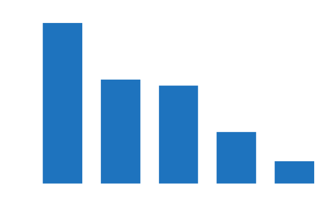
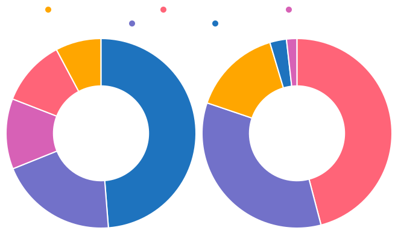
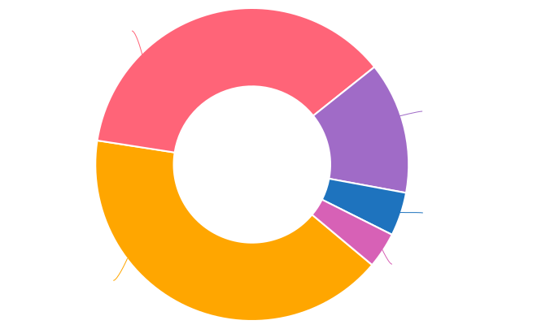
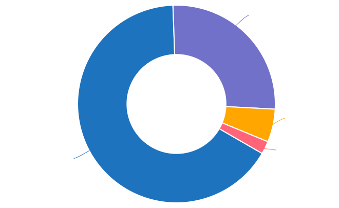

.. raw:: html

   

*****************************************
Write the Docs Salary Survey 2022 Results
*****************************************

.. contents::
   :local:
   :depth: 2
   :backlinks: none

Introduction
============ 

Now in its fourth year, the Write the Docs Salary Survey collects information from documentarians across various regions, covering not only salaries but also work environments and perspectives on job-related issues. Our aims are to assist community members in determining appropriate salary brackets, provide a reference point for future wage negotiations, and spark discussion.

The 2022 survey accumulated data from 525 participants, including both employees and independent contractors, located in 43 countries. Although the number of responses has decreased compared to previous years (with 959 in 2021, 805 in 2020, and 649 in 2019), the information obtained remains significant, and we trust that the resulting insights will aid community members in better understanding the salary landscape.

.. container:: note
   
   .. rubric:: Note on independent contractors

   Unfortunately, due to the small number of contractor respondents, no statistically relevant data can be extracted regarding income or satisfaction for this group. The salary and salary satisfaction data is therefore drawn from employee respondents only. For all other questions, the data is from both groups combined. 

Feedback
--------

We’d love your thoughts on this survey, so that we can continue to develop and refine it. Email us at support@writethedocs.org with your ideas.

Employment parameters
=====================

In this section, we asked about the parameters of the respondent’s employment:

- the number of hours they worked, or if they were not currently working,
- the length of time they had held the same position, 
- whether they worked solo or as part of a team and how they classified their role, and
- how focused their role was on tasks related to documentation.

Basis of employment
-------------------

While the majority of respondents – historically and in 2022 – are employees, a proportion are classified as independent contractors, freelance operators or self-employed individuals. To better cater for the differences between these groups, we ran two different versions of the survey side by side, starting in 2021. 

In 2022, 93.5% of respondents (491 individuals) were employees, and 6.5% (34 individuals) were independent contractors - similar ratios to previous years.

.. table:: Basis of employment (2019-2022)
   :width: 100%
   :widths: 50 25 25
   :name: tbl-2022-basis-of-employment-history

   +-------------+-------------+-------------+
   | Survey year |  Employees  | Contractors |
   +=============+=============+=============+
   | 2019        | 652 (93.9%) | 42 (6.1%)   |
   +-------------+-------------+-------------+
   | 2020        | 748 (92.9%) | 57 (7.1%)   |
   +-------------+-------------+-------------+
   | 2021        | 887 (92.5%) | 72 (7.5%)   |
   +-------------+-------------+-------------+
   | 2022        | 491 (93.5%) | 34 (6.5%)   |
   +-------------+-------------+-------------+

.. raw:: html

   <figure>
      <object role="img" aria-label="Basis of employment (2019-2022)" aria-describedby="figure-basis-of-employment-history-desc" type="image/svg+xml" data="/_images/2022-basis-of-employment-history.svg" id="fig-2022-basis-of-employment-history">
         
Stacked vertical bar chart showing number of employee and contractor respondents in each survey, 2019 until 2022.

      </object> 
      <figcaption>
         Figure: Basis of employment (2019-2022)
         <a class="headerlink" href="#fig-2022-basis-of-employment-history" title="Permalink to this figure">¶</a>
      </figcaption>
   </figure>

Hours worked
------------

.. raw:: html
   
   

What we asked (click to expand)

.. container:: question

   How many hours per week do you work?

   - I’m not currently working
   - 1–20 hours
   - 21–30 hours
   - 31–40 hours
   - 41–50 hours
   - 51–60 hours
   - More than 60 hours

.. raw:: html

   

In 2022, only 6 individual respondents (1.1%) reported that they were not currently working – down from 2021, when 2.5% (20 respondents) indicated this. Unemployed respondents were asked to complete the survey as though they were still in their previous employment situation.

The majority of respondents worked traditional "full-time" hours:

- 95.2% worked more than 30 hours per week
- 62.4% worked between 31 and 40 hours
- 2.8% worked 51 hours or more

Of the 4 individuals who entered more than 60 hours, 3 reported working 65 hours per week, and one person reported working 80 hours per week. 

.. table:: Weekly hours worked (2022)
   :width: 100%
   :widths: 70 15 15
   :name: tbl-2022-weekly-hours-worked

   +--------------+-----+-------+
   | Hours worked | No. | %     |
   +==============+=====+=======+
   | 1-20 hours   |  10 | 1.9%  |
   +--------------+-----+-------+
   | 21-30 hours  |  15 | 2.9%  |
   +--------------+-----+-------+
   | 31-40 hours  | 324 | 62.4% |
   +--------------+-----+-------+
   | 41-50 hours  |  56 | 30.1% |
   +--------------+-----+-------+
   | 51-60 hours  |  10 | 1.9%  |
   +--------------+-----+-------+
   | 61+ hours    |   4 | 0.8%  |
   +--------------+-----+-------+

.. raw:: html

   <figure>
      <object role="img" aria-label="Hours worked (2022)" aria-describedby="figure-hours-worked_desc" type="image/svg+xml" data="/_images/2022-hours-worked.svg">
         
Bar chart showing weekly hours worked

      </object> 
      <figcaption>Figure: Hours worked (2022)</figcaption>
   </figure>

Job title
---------

.. raw:: html
   
   

What we asked (click to expand)

.. container:: question

   What is your job title?

.. raw:: html

   

With typos removed and abbreviations expanded, 171 unique job titles emerged (1 respondent indicated that they did not have a job title). Although this number, which represents around 3.07 respondents per unique title, is fewer than in previous years - there were around 3.55 respondents per distinct title in 2021, 3.16 in 2020, and 3.13 in 2019 - the trends are similar: "Technical Writer" was the most widely-used exact title at 27.8%, followed by "Senior Technical Writer" at 17%. 

Of all titles:

- 73.5% contained the word "technical"
- 68% contained "writer" or "writing" but only 1.9% contained "editor" or "editing"
- 62.4% contained both the words "technical" and "writer" - only 1% contained "author"
- 28.9% contained "senior" but only 1% contained "junior"
- 13% contained "manager", "management", "head" or "director", while 5.7% contained "lead" or "leader" 
- 10.6% contained "docs", "document" or "documentation", and another 6% contained "content"
- 7.6% contained "developer" or "development", while 4% contained "engineer" or "engineering"
- 2.3% contained "communication" or "communications"
- 1% contained "support"

.. table:: Most widely-used job titles (2022)
   :width: 100%
   :widths: 70 15 15
   :name: tbl-2022-top-job-titles

   +----------------------------+-----+-------+
   | Job title                  | No. |     % |
   +============================+=====+=======+
   | Technical Writer           | 146 | 27.8% |
   +----------------------------+-----+-------+
   | Senior Technical Writer    |  89 | 17.0% |
   +----------------------------+-----+-------+
   | Lead Technical Writer      |  18 |  3.4% |
   +----------------------------+-----+-------+
   | Documentation Manager      |   8 |  1.5% |
   +----------------------------+-----+-------+
   | Technical Writing Manager  |   8 |  1.5% |
   +----------------------------+-----+-------+
   | Associate Technical Writer |   7 |  1.3% |
   +----------------------------+-----+-------+
   | Documentation Specialist   |   7 |  1.3% |
   +----------------------------+-----+-------+
   | Technical Writer II        |   7 |  1.3% |
   +----------------------------+-----+-------+
   | Technical Writer I         |   6 |  1.1% |
   +----------------------------+-----+-------+
   | Technical Editor           |   6 |  1.1% |
   +----------------------------+-----+-------+

.. raw:: html

   <figure>
      <object role="img" aria-label="Job title wordcloud (2022)" aria-describedby="figure-job-title-wordcloud_desc" type="image/svg+xml" data="/_images/2022-job-titles-wordcloud.svg">
         
Job title wordcloud

      </object> 
      <figcaption>Figure: Job title wordcloud (2022)</figcaption>
   </figure>

Type of role
------------

.. raw:: html
   
   

What we asked

.. container:: question

   How would you categorize your role? If you wear multiple hats, select all options that apply.

   - Writer, content creator, producer, editor
   - Developer, engineer
   - Educator
   - Customer support
   - Advocate, community outreach
   - Marketing
   - Management
   - Other

   In your role, are you:

   - A solo worker
   - Part of a team
   - Part of multiple teams
   - A manager or team leader
   - Other (please specify)

.. raw:: html

   

Role category
~~~~~~~~~~~~~

For the first time this year, respondents could select more than one role category - and 38.5% did so. Two roles were selected by 23.2% of respondents, and another 9.5% selected three roles. 

Although "Writer/Creator/Editor" was still the top category - 93.9% of respondents defining their role at least partly this way, and 57.1% identified only this category - removing the requirement for respondents to narrow their role down to just one category allowed a fuller picture of the diversity of the community to emerge, showing cross-overs with the roles of Manager (16.2%), Developer/Engineer (13.3%), Educator (12.6%), Advocate (7.8%), Support (7.2%) and Marketing (5%).

Overall, respondents selected 57 different combinations of the 8 role categories.  

.. table:: Top role category combinations (2022)
   :width: 100%
   :widths: 70 15 15
   :name: tbl-2022-top-role-category-combinations

   +-------------------------------------------------------+-----+-------+
   | Role category combination                             | No. | %     |
   +=======================================================+=====+=======+
   | Writer/Creator/Editor                                 | 300 | 57.1% |
   +-------------------------------------------------------+-----+-------+
   | Writer/Creator/Editor + Management                    |  45 |  8.6% |
   +-------------------------------------------------------+-----+-------+
   | Writer/Creator/Editor + Developer/Engineer            |  32 |  6.1% |
   +-------------------------------------------------------+-----+-------+
   | Writer/Creator/Editor + Educator                      |  17 |  3.2% |
   +-------------------------------------------------------+-----+-------+
   | Management                                            |  10 |  1.9% |
   +-------------------------------------------------------+-----+-------+
   | Other combinations (52 more in total)                 | 121 | 23.1% |
   +-------------------------------------------------------+-----+-------+

.. raw:: html

   <figure>
      <object role="img" aria-label="Top role category combinations (2022)" aria-describedby="figure-top-role-category-combinations_desc" type="image/svg+xml" data="/_images/2022-role-category.svg">
         
Donut chart showing top role category combinations for respondents in 2022.

      </object> 
      <figcaption>Figure: Top role category combinations (2022)</figcaption>
   </figure>

.. table:: Role categories (2022)
   :width: 100%
   :widths: 70 15 15
   :name: tbl-2022-single-role-categories

   +-------------------------------------------------------+-----+-------+
   | Role category                                         | No. | %     |
   +=======================================================+=====+=======+
   | Writer/Creator/Editor                                 | 493 | 93.9% |
   +-------------------------------------------------------+-----+-------+
   | Management                                            |  85 | 16.2% |
   +-------------------------------------------------------+-----+-------+
   | Developer/Engineer                                    |  70 | 13.3% |
   +-------------------------------------------------------+-----+-------+
   | Educator                                              |  66 | 12.6% |
   +-------------------------------------------------------+-----+-------+
   | Advocate                                              |  41 |  7.8% |
   +-------------------------------------------------------+-----+-------+
   | Support                                               |  38 |  7.2% |
   +-------------------------------------------------------+-----+-------+
   | Marketing                                             |  26 |    5% |
   +-------------------------------------------------------+-----+-------+
   | Other                                                 |  26 |    5% |
   +-------------------------------------------------------+-----+-------+

Of those who selected "Other", responses included project manager, product owner/manager, information architect, and UX writer. 

Team breakdown
~~~~~~~~~~~~~~

When taking into account respondents who work on a team, work on multiple teams, and those who manage teams, 83.4% of respondents have roles that are team-based. Solo workers make up 15.4%, with the 1.1% selecting "other" mostly reporting some combination of solo and team work. 

.. table:: Team breakdown (2022)
   :width: 100%
   :widths: 70 15 15
   :name: tbl-2022-team-breakdown

   +------------------------+-----+-------+
   | Team Type              | No. | %     |
   +========================+=====+=======+
   | Part of a team         | 238 | 45.3% |
   +------------------------+-----+-------+
   | Part of multiple teams | 115 | 21.9% |
   +------------------------+-----+-------+
   | Manager or team leader | 85  | 16.2% |
   +------------------------+-----+-------+
   | Solo workers           | 81  | 15.4% |
   +------------------------+-----+-------+
   | Other                  | 6   | 1.1%  |
   +------------------------+-----+-------+

.. raw:: html

   <figure>
      <object role="img" aria-label="Team breakdown (2022)" aria-describedby="figure-team-breakdown_desc" type="image/svg+xml" data="/_images/2022-team-breakdown.svg">
         
Team breakdown (2022)

      </object> 
      <figcaption>Figure: Team breakdown (2022)</figcaption>
   </figure>

Length of time at current organization
--------------------------------------

.. raw:: html
   
   

What we asked

.. container:: question

   How long have you worked at your current organization?
   
   Note:
   Please select the length of time for your position at your current organization only – your total years of experience in documentation will be covered in the individual demographics section. If you have changed roles at the same organization, please select the length of time that you have been in your current role.

   - Less than 1 year
   - More than 1 year but less than 2 years
   - More than 2 years but less than 5 years
   - More than 5 years but less than 10 years
   - More than 10 years

.. raw:: html

   

Reflecting an increasingly volatile job market, 36.8% of respondents reported being employed at their current organization for less than one year. This is a significant increase from 31.7% in 2021, 26% in 2020, and just 9% in 2019. Notably, it is the first time since the survey began that the number of individuals in new positions exceeds those who have held their current job for a medium-term or extended duration.    

.. table:: Length of time at current organization (2022)
   :width: 100%
   :widths: 70 15 15
   :name: tbl-2022-time-current-organization

   +------------------------------------------+-----+-------+
   | Length of time                           | No. | %     |
   +==========================================+=====+=======+
   | Less than 1 year                         | 193 | 36.8% |
   +------------------------------------------+-----+-------+
   | More than 1 year but less than 2 years   | 125 | 23.8% |
   +------------------------------------------+-----+-------+
   | More than 2 years but less than 5 years  | 118 | 22.5% |
   +------------------------------------------+-----+-------+
   | More than 5 years but less than 10 years | 62  | 11.8% |
   +------------------------------------------+-----+-------+
   | More than 10 years                       | 27  | 5.1%  |
   +------------------------------------------+-----+-------+

.. raw:: html

   <figure>
      <object role="img" aria-label="Length of time at current organization (2022)" aria-describedby="figure-time-current-organization_desc" type="image/svg+xml" data="/_images/2022-time-current-organization.svg">
         
Length of time at current organization (2022)

      </object> 
      <figcaption>Figure: Length of time at current organization (2022)</figcaption>
   </figure>

Of those 5.1% who had been in their current position for 10 or more years, around half reported a tenure between 10 and 20 years, while the other half reported a duration between 20 and 25 years. One respondent indicated they had held their current position for 31 years. 

Proportion of role related to documentation
-------------------------------------------

.. raw:: html
   
   

What we asked

.. container:: question

   Documentation is:

   - the whole of my official job description
   - part of my official job description
   - not officially part of my job description, but I am expected to perform documentation-related tasks
   - not officially part of my job description, and I am not expected to perform documentation-related tasks, but I do anyway

   Approximately what percentage of your day-to-day tasks are documentation-related?

   - 0-25%
   - 26-50%
   - 51-75%
   - 76-100%

.. raw:: html

   

As Write the Docs is a documentation-focused community, it's not surprising that the majority of respondents (73.1% in 2022) reported that documentation makes up both their whole official job description, and most or all of their day-to-day tasks (90.3% reporting more than 51% of their daily workload). Given the cross-disciplinary nature of documentation work, it's also not surprising that a proportion of respondents also work outside of that definition, and that there are even a small number documenting "by stealth": those that are not officially designated as documentation employees or not required to perform documentation-related tasks, but do anyway.

.. table:: Portion of role officially documentation-related (2022)
   :width: 100%
   :widths: 70 15 15
   :name: tbl-2022-portion-of-role-officially-documentation-related

   +--------------------------------------+-----+-------+
   | Portion of role                      | No. | %     |
   +======================================+=====+=======+
   | Wholly documentation                 | 384 | 73.1% |
   +--------------------------------------+-----+-------+
   | Partly documentation                 | 126 | 24.0% |
   +--------------------------------------+-----+-------+
   | Not documentation, but it's expected | 12  | 2.3%  |
   +--------------------------------------+-----+-------+
   | Not documentation, and not expected  | 3   | 0.6%  |
   +--------------------------------------+-----+-------+

.. raw:: html

   <figure>
      <object role="img" aria-label="Portion of role officially documentation-related (2022)" aria-describedby="figure-proportion-official_desc" type="image/svg+xml" data="/_images/2022-proportion-official.svg">
         
Donut chart showing the proportion of respondent's official job description that is related to documentation in 2022.

      </object> 
      <figcaption>Figure: Portion of role officially documentation-related (2022)</figcaption>
   </figure>

.. table:: Portion of role actually documentation-related (2022)
   :width: 100%
   :widths: 70 15 15
   :name: tbl-2022-portion-of-role-actually-documentation-related

   +--------------------------------------+-----+-------+
   | Portion of role                      | No. | %     |
   +======================================+=====+=======+
   | 76%-100%                             | 293 | 55.8% |
   +--------------------------------------+-----+-------+
   | 51%-75%                              | 160 | 30.5% |
   +--------------------------------------+-----+-------+
   | 26%-50%                              | 47  | 9.0%  |
   +--------------------------------------+-----+-------+
   | 0-25%                                | 25  | 4.8%  |
   +--------------------------------------+-----+-------+

.. raw:: html

   <figure>
      <object role="img" aria-label="Portion of role actually documentation-related (2022)" aria-describedby="figure-proportion-actual_desc" type="image/svg+xml" data="/_images/2022-proportion-actual.svg">
         
Vertical bar chart showing the proportion of respondent's actual day to day tasks that are related to documentation in 2022.

      </object> 
      <figcaption>Figure: Portion of role actually documentation-related (2022)</figcaption>
   </figure>

Interestingly, of the respondents who indicated that documentation was the whole of their official job description, 31% reported spending less than three quarters of their daily work time on documentation, with 5% reporting less than half their time. 

Work location and COVID-19
==========================

In the 2019 survey, we asked respondents about their work location - whether they worked from an office, remotely, or a mixture, and whether this was their choice or if work location was stipulated by their employer. 

In 2020, the COVID-19 pandemic led to many changes to the way we live and work. Although work location was not the only area impacted, moving from an on-site office location to remote work was a change reported by nearly 80% of respondents. 

There was some uncertainty about whether to include COVID-19 questions section in the 2022 survey. It was decided that with a number of companies publicly announcing the implementation of "back to the office" policies, these questions were still relevant. 

For the purpose of this section, we consider “remote” to have the same meaning as “work from home” or “home office”.

.. raw:: html
   
   

What we asked

.. container:: question

   Has your work location (i.e. on-site, remote) been affected by COVID-19 (temporarily or permanently)?

   - Yes
   - No

   Those who answered "Yes" were then asked:

   Before COVID-19, what was your work location?

   - I was required to be on-site full time
   - I was on-site full time, but it was not required
   - I was partially on-site, and partially remote
   - I was fully remote, but it was by choice (i.e. an office location was available to me)
   - I was fully remote, and it was required (i.e. no office location was available to me)

   What is your current work location?

   - I am required to be on-site full time
   - I am on-site full time, but it is not required
   - I am partially on-site, and partially remote
   - I am fully remote, but it is by choice (i.e. an office location is available to me)
   - I am fully remote, and it is required (i.e. no office location is available to me)

   What changes occurred to your work location as a result of COVID-19?

   - My work location changed permanently
   - My work location changed temporarily and has now changed back
   - My work location changed temporarily and has not yet changed back
   - My work location has changed multiple times but is now permanent
   - My work location has changed multiple times and may change again
   - Other (please specify)

   How do you feel about the changes to your work location?

   - Very negative
   - Negative
   - Neutral
   - Positive
   - Very positive

   Those who answered "No" to whether their work location had changed as a result of COVID-19 were instead asked:

   What is your work location?

   - I am required to be on-site full time
   - I am on-site full time, but it is not required
   - I am partially on-site, and partially remote
   - I am fully remote, but it is by choice (i.e. an office location is available to me)
   - I am fully remote, and it is required (i.e. no office location is available to me)

   How do you feel about your work location?

   - Very negative
   - Negative
   - Neutral
   - Positive
   - Very positive

.. raw:: html

   

Affected by COVID-19
--------------------

53.9% of respondents reported that their workplace had changed due to COVID-19 - down from 73.9% in 2021, and 80% in 2020. This decrease reflects the number of people who have started new jobs since the pandemic started.

As in previous years, the bulk of the changes were moving from on-site to remote or partially remote. 

.. table:: Work location - pre-COVID-19 (2022)
   :width: 100%
   :widths: 70 15 15
   :name: tbl-2022-work-location-pre-covid19

   +-------------------------+-----+--------+
   | Work location           | No. | %      |
   +=========================+=====+========+
   | On-site (required)      | 138 | 48.76% |
   +-------------------------+-----+--------+
   | Partial                 | 57  | 20.14% |
   +-------------------------+-----+--------+
   | On-site (not required)  | 34  | 12.01% |
   +-------------------------+-----+--------+
   | Remote (not required)   | 32  | 11.31% |
   +-------------------------+-----+--------+
   | Remote (required)       | 22  | 7.77%  |
   +-------------------------+-----+--------+

.. table:: Work location - current (2022)
   :width: 100%
   :widths: 70 15 15
   :name: tbl-2022-work-location-current

   +------------------------+-----+--------+
   | Work location          | No. | %      |
   +========================+=====+========+
   | Remote (not required)  | 130 | 45.94% |
   +------------------------+-----+--------+
   | Partial                | 97  | 34.28% |
   +------------------------+-----+--------+
   | Remote (required)      | 43  | 15.19% |
   +------------------------+-----+--------+
   | On-site (required)     | 8   | 2.83%  |
   +------------------------+-----+--------+
   | On-site (not required) | 5   | 1.77%  |
   +------------------------+-----+--------+

.. raw:: html

   <figure>
      <object role="img" aria-label="Work location (affected by COVID-19) (2022)" aria-describedby="figure-work-location-affected_desc" type="image/svg+xml" data="/_images/2022-work-location-affected.svg">
         
Two donut charts showing work location, pre-COVID-19 and currently, for respondents who indicated that their workplace had been affected by the pandemic.

      </object> 
      <figcaption>Figure: Work location (affected by COVID-19) (2022)</figcaption>
   </figure>

A sign that the situation is settling down, perhaps: 54.4% of respondents in this category reported that their work location change (or, in the case of 7.1% of respondents, multiple changes) had now become permanent, and 17.7% stated that the change had been temporary and was now changed back. 

.. table:: Work location changes (2022)
   :width: 100%
   :widths: 70 15 15
   :name: tbl-2022-work-location-changes

   +--------------------------------------------------------+-----+-------+
   | Change                                                 | No. | %     |
   +========================================================+=====+=======+
   | Work location changed permanently                      | 134 | 47.3% |
   +--------------------------------------------------------+-----+-------+
   | Work location changed temporarily, now back            | 50  | 17.7% |
   +--------------------------------------------------------+-----+-------+
   | Work location changed temporarily, not yet back        | 36  | 12.7% |
   +--------------------------------------------------------+-----+-------+
   | Work location changed multiple times, now permanent    | 24  | 8.5%  |
   +--------------------------------------------------------+-----+-------+
   | Work location changed multiple times, may change again | 20  | 7.1%  |
   +--------------------------------------------------------+-----+-------+
   | Other                                                  | 19  | 6.7%  |
   +--------------------------------------------------------+-----+-------+

The attitude towards pandemic-related work location change is overwhelmingly a happy one: 73.5% felt that the change was "positive", and just over half of those felt it was "very positive", whereas only 5.6% reported "negative" or "very negative" feelings.  

.. table:: Feelings about work location changes (2022)
   :width: 100%
   :widths: 70 15 15
   :name: tbl-2022-work-location-changes-feelings

   +-------------------------------------+-----+-------+
   | Feelings about work location change | No. | %     |
   +=====================================+=====+=======+
   | Very positive                       | 107 | 37.8% |
   +-------------------------------------+-----+-------+
   | Positive                            | 101 | 35.7% |
   +-------------------------------------+-----+-------+
   | Neutral                             | 59  | 20.8% |
   +-------------------------------------+-----+-------+
   | Negative                            | 12  |  4.2% |
   +-------------------------------------+-----+-------+
   | Very negative                       | 4   |  1.4% |
   +-------------------------------------+-----+-------+

Not affected by COVID-19
------------------------

46.1% of respondents indicated that their current work location was unaffected by COVID-19. Of these, the majority worked remotely - 41.3% were required to be remote, and 36.8% were remote by choice. 13.6% were partially remote, and only 8.2% worked on-site (4.5% by requirement and 3.7% by choice).

.. table:: Work location - unaffected by COVID-19 (2022)
   :width: 100%
   :widths: 70 15 15
   :name: tbl-2022-work-location-unaffected

   +------------------------+-----+-------+
   | Work location          | No. | %     |
   +========================+=====+=======+
   | On-site (required)     | 11  |  4.5% |
   +------------------------+-----+-------+
   | On-site (not required) | 9   |  3.7% |
   +------------------------+-----+-------+
   | Partial                | 33  | 13.6% |
   +------------------------+-----+-------+
   | Remote (not required)  | 89  | 36.8% |
   +------------------------+-----+-------+
   | Remote (required)      | 100 | 41.3% |
   +------------------------+-----+-------+

.. raw:: html

   <figure>
      <object role="img" aria-label="Work location (unaffected by COVID-19) (2022)" aria-describedby="figure-work-location-unaffected_desc" type="image/svg+xml" data="/_images/2022-work-location-unaffected.svg">
         
Donut chart showing work location for respondents who indicated that their workplace had not been affected by the pandemic.

      </object> 
      <figcaption>Figure: Work location (unaffected by COVID-19) (2022)</figcaption>
   </figure>

Overall, this group was happy about their work location: 66.1% reported feeling "very positive", 26.4% "positive", 5.4% "neutral", and only 2.1% "negative" (no respondents felt "very negative").

Breaking down attitudes by work location, those who are able to choose their work location - be it on-site, remote, or a combination - are generally happier than those who have their workplace stipulated by their employer. All of the negative responses were attributed to respondents required to be on-site, required to be remote, or partial (implying that one portion of the partial arrangement was required, and not that respondent's preference).

.. table:: Feelings about work location - unaffected by COVID-19 (2022)
   :width: 100%
   :widths: 70 15 15
   :name: tbl-2022-work-location-feelings-unaffected

   +------------------------+-----+-------+
   | Feelings               | No. | %     |
   +========================+=====+=======+
   | Very Negative          |   0 |  0.0% |
   +------------------------+-----+-------+
   | Negative               |   5 |  2.1% |
   +------------------------+-----+-------+
   | Neutral                |  13 |  5.4% |
   +------------------------+-----+-------+
   | Positive               |  64 | 26.4% |
   +------------------------+-----+-------+
   | Very Positive          | 160 | 66.1% |
   +------------------------+-----+-------+

.. raw:: html

   <figure>
      <object role="img" aria-label="Feelings about work location (unaffected by COVID-19) (2022)" aria-describedby="figure-work-location-unaffected-feelings_desc" type="image/svg+xml" data="/_images/2022-work-location-unaffected-feelings.svg">
         
Donut chart showing feelings about work location for respondents who indicated that their workplace had not been affected by the pandemic.

      </object> 
      <figcaption>Figure: Feelings about work location (unaffected by COVID-19) (2022)</figcaption>
   </figure>

Overall work location
---------------------

Combining the "current" work location for respondents affected by COVID-19 with the work location for those unaffected, we can put together an overall picture. 

68.9% of all resondents work remotely, either by choice (41.7%) or as required by their employer (27.2%). Another 24.8% work partially on-site and partially remote. Only 6.3% work completely on-site (3.6% are required to do so and 2.7% do so by choice). 

.. table:: Work location - overall (2022)
   :width: 100%
   :widths: 70 15 15
   :name: tbl-2022-work-location-overall

   +------------------------+-----+-------+
   | Work location          | No. | %     |
   +========================+=====+=======+
   | On-site (required)     | 19  | 3.6%  |
   +------------------------+-----+-------+
   | On-site (not required) | 14  | 2.7%  |
   +------------------------+-----+-------+
   | Partial                | 130 | 24.8% |
   +------------------------+-----+-------+
   | Remote (not required)  | 219 | 41.7% |
   +------------------------+-----+-------+
   | Remote (required)      | 143 | 27.2% |
   +------------------------+-----+-------+

.. raw:: html

   <figure>
      <object role="img" aria-label="Work location (combined) (2022)" aria-describedby="figure-work-location-combined_desc" type="image/svg+xml" data="/_images/2022-work-location-overall.svg">
         
Donut chart showing work location for all respondents combined (those whose work location was affected by COVID-19 and those whose work location was not affected).

      </object> 
      <figcaption>Figure: Work location (combined) (2022)</figcaption>
   </figure>

Just over half of respondents reported feeling "very positive" about their work location, and another 31.4% felt "positive". 13.7% were "neutral", and 3.2% reported negative feelings. Only 0.8% of all respondents - 4 individuals - reported "very negative" feelings.

.. table:: Feelings about work location - overall (2022)
   :width: 100%
   :widths: 70 15 15
   :name: tbl-2022-work-location-feelings-overall

   +------------------------+-----+-------+
   | Feelings               | No. | %     |
   +========================+=====+=======+
   | Very Negative          | 4   | 0.8%  |
   +------------------------+-----+-------+
   | Negative               | 17  | 3.2%  |
   +------------------------+-----+-------+
   | Neutral                | 72  | 13.7% |
   +------------------------+-----+-------+
   | Positive               | 165 | 31.4% |
   +------------------------+-----+-------+
   | Very Positive          | 267 | 50.9% |
   +------------------------+-----+-------+

.. raw:: html

   <figure>
      <object role="img" aria-label="Feelings about work location (combined) (2022)" aria-describedby="figure-work-location-combined-feelings_desc" type="image/svg+xml" data="/_images/2022-work-location-overall-feelings.svg">
         
Donut chart showing feelings about work location for all respondents combined (those whose work location was affected by COVID-19 and those whose work location was not affected).

      </object> 
      <figcaption>Figure: Feelings about work location (combined) (2022)</figcaption>
   </figure>

Breaking this down by work location, the same patterns emerge. 89.1% of respondents who were working remote by choice reported feeling "very positive" (61.2%) or "positive" (27.9%), with only 0.9% feeling "negative" and no one reporting "very negative" feelings. For those working remote by requirement, while 92% were happy with the arrangement (67.1% "very positive" and 25.2% "positive"), 2.8% reported "negative" feelings.     

For those working partially remote and partially on-site, opinions were more evenly dispersed - 46.2% felt "positive", 25.4% declared they were "neutral", and 6.9% harbored "negative" feelings (5.4% "negative" and 1.5% "very negative").

The number of respondents working on-site was small (6.3%, or 33 individuals), which means that any generalizations are not representative. For the record, "neutral" feelings were the most common at 30.3%.

Salary and benefits
===================

This section is where the survey forms diverged for employees and contractors: employees were asked for their monthly or yearly salary and any additional benefits, and contractors were asked for their fee structures and rates. Both groups were asked to evaluate their levels of satisfaction with their salary and their overall work situation, for any reasons for dissatisfaction with either, and also what they liked about their work.  

Unfortunately, due to the small number of contractor respondents (only 34), no statistically relevant data can be extracted regarding income or satisfaction for this group. The data in this section is therefore drawn from employee respondents only.   

Currencies
----------

Respondents reported being paid in 27 different currencies. To make comparisons possible, all currencies were converted to USD using mid-market exchange rates, averaged for the whole of 2022. 

.. raw:: html

   

.. table:: Currencies - employees (2022)
   :width: 100%
   :widths: 45 15 15 25
   :name: tbl-2022-currency-employees

   +-----------------------------+------+-----+---------------+
   | Currency                    | Code | No. | Exchange rate |
   +=============================+======+=====+===============+
   | United States Dollar        |  USD | 235 |             1 |
   +-----------------------------+------+-----+---------------+
   | Euro                        |  EUR | 75  |      1.053783 |
   +-----------------------------+------+-----+---------------+
   | Canadian Dollar             |  CAD | 34  |      0.769193 |
   +-----------------------------+------+-----+---------------+
   | Indian Rupee                |  INR | 26  |      0.012738 |
   +-----------------------------+------+-----+---------------+
   | British Pound Stirling      |  GBP | 23  |      1.237188 |
   +-----------------------------+------+-----+---------------+
   | Romanian Leu                |  RON | 21  |        0.2126 |
   +-----------------------------+------+-----+---------------+
   | Russian Ruble               |  RUB | 18  |         0.015 |
   +-----------------------------+------+-----+---------------+
   | Australian Dollar           |  AUD | 16  |      0.694662 |
   +-----------------------------+------+-----+---------------+
   | Israeli Shekel              |  NIS | 15  |      0.298003 |
   +-----------------------------+------+-----+---------------+
   | Swedish Krona               |  SEK | 4   |      0.099175 |
   +-----------------------------+------+-----+---------------+
   | Czech Koruna                |  CZK | 4   |      0.042892 |
   +-----------------------------+------+-----+---------------+
   | New Zealand Dollar          |  NZD | 3   |      0.635617 |
   +-----------------------------+------+-----+---------------+
   | Hungarian Forint            |  HUF | 2   |      0.002707 |
   +-----------------------------+------+-----+---------------+
   | Norwegian Krone             |  NOK | 2   |      0.104386 |
   +-----------------------------+------+-----+---------------+
   | Armenian Dram               |  AMD | 1   |        0.0024 |
   +-----------------------------+------+-----+---------------+
   | Polish Zloty                |  PLN | 1   |       0.22511 |
   +-----------------------------+------+-----+---------------+
   | Croatian Kuna               |  HRK | 1   |        0.1387 |
   +-----------------------------+------+-----+---------------+
   | Brazilian Real              |  BRL | 1   |         0.195 |
   +-----------------------------+------+-----+---------------+
   | South African Rand          |  ZAR | 1   |      0.061331 |
   +-----------------------------+------+-----+---------------+
   | Japanese Yen                |  JPY | 1   |      0.007657 |
   +-----------------------------+------+-----+---------------+
   | South Korean Wan            |  KRW | 1   |        0.0008 |
   +-----------------------------+------+-----+---------------+
   | New Taiwan Dollar           |  TWD | 1   |        0.0333 |
   +-----------------------------+------+-----+---------------+
   | Swiss Franc                 |  CHF | 1   |      1.048015 |
   +-----------------------------+------+-----+---------------+
   | Serbian Dinar               |  RSD | 1   |        0.0089 |
   +-----------------------------+------+-----+---------------+
   | Icelandic Krona             |  ISK | 1   |        0.0073 |
   +-----------------------------+------+-----+---------------+
   | Singapore Dollar            |  SGD | 1   |      0.725526 |
   +-----------------------------+------+-----+---------------+
   | Kenyan Shilling             |  KES | 1   |         0.008 |
   +-----------------------------+------+-----+---------------+

.. raw:: html

   

Salary
------

.. raw:: html
   
   

What we asked

.. container:: question

   What currency are you paid in?

   Would you prefer to enter your salary as a yearly or monthly amount?
   
   What is your salary (including tax)?

.. raw:: html

   

Employees were given the option of entering their salary as a monthly or as a yearly figure, to cater for different countries where one or the other is the norm. Monthly salaries were multiplied by 12 in order to compare them to annual salaries. 

In 2022, 79% of employee respondents entered an annual salary figure, and 21% entered a monthly figure. 

As 95.2% of respondents reported working full-time hours (more than 30 per week), the salaries for those working part-time hours (less than 30 per week) have been omitted from the figures in this section. 

Median salary
~~~~~~~~~~~~~

The median employee salary across all regions was USD $79,506 (meaning half of all respondent earned more, and half earned less). This is lower than the overall median in 2021 and 2020 (USD $80,870 and USD $80,000, respectively), but higher than the overall median in 2019 (USD $74,500).

Median salary by respondent region
~~~~~~~~~~~~~~~~~~~~~~~~~~~~~~~~~~

Given the range of socio-economic differences in the countries in the survey results, median salary figures broken down by country of residence of employee is more useful than overall median salary.

In order to protect the privacy of respondents, median salaries are not shown for any country or region with less than 10 respondents. Countries excluded by this condition are:

- Armenia
- Belarus
- Belgium
- Brazil
- Croatia
- Czech Republic
- Estonia
- Finland
- France
- Greece
- Hungary
- Iceland
- Ireland
- Italy
- Japan
- Kazakhstan
- Netherands
- New Zealand
- Norway
- Poland
- Portugal
- Serbia
- Singapore
- Slovenia
- South Africa
- South Korea
- Spain
- Sweden
- Switzerland
- Taiwan
- Ukraine

.. table:: Median salary by respondent region (2022)
   :width: 100%
   :widths: 30 30 15 25
   :name: tbl-2022-median-salary-by-respondent-region

   +---------------+----------------+-----+--------------+
   | Region        | Country        | No. | Median (USD) |
   +===============+================+=====+==============+
   | North America |                | 256 |     $104,750 |
   +---------------+----------------+-----+--------------+
   |               | USA            | 222 |     $110,500 |
   +---------------+----------------+-----+--------------+
   |               | Canada         |  34 |      $73,458 |
   +---------------+----------------+-----+--------------+
   | Europe        |                | 154 |      $52,265 |
   +---------------+----------------+-----+--------------+
   |               | Romania        |  20 |      $36,280 |
   +---------------+----------------+-----+--------------+
   |               | United Kingdom |  20 |      $69,902 |
   +---------------+----------------+-----+--------------+
   |               | Russia         |  17 |      $21,600 |
   +---------------+----------------+-----+--------------+
   |               | Germany        |  15 |      $62,468 |
   +---------------+----------------+-----+--------------+
   | Asia          |                |  30 |      $29,297 |
   +---------------+----------------+-----+--------------+
   |               | India          |  26 |      $26,113 |
   +---------------+----------------+-----+--------------+
   | Oceania       |                |  19 |      $91,695 |
   +---------------+----------------+-----+--------------+
   |               | Australia      |  16 |      $95,169 |
   +---------------+----------------+-----+--------------+
   | Middle East   | Israel         |  15 |     $106,566 |
   +---------------+----------------+-----+--------------+

Median salary by US state
~~~~~~~~~~~~~~~~~~~~~~~~~

Out of the 37 US states represented in the results, only 5 had more than the minimum 10 respondents required to calculate a median by region. While California drew the most respondents (37), Washington took the top spot for median salary with USD $140,350.

.. table:: Median salary by US state (2022)
   :width: 100%
   :widths: 60 15 25
   :name: tbl-2022-median-salary-by-us-state

   +--------------------+-----+------------------+
   | US state           | No. |     Median (USD) |
   +====================+=====+==================+
   | Washington         |  12 |         $140,350 |
   +--------------------+-----+------------------+
   | California         |  37 |         $135,000 |
   +--------------------+-----+------------------+
   | Oregon             |  15 |         $115,000 |
   +--------------------+-----+------------------+
   | Colorado           |  13 |         $110,000 |
   +--------------------+-----+------------------+
   | Texas              |  18 |          $95,000 |
   +--------------------+-----+------------------+

Median salary by gender identity
~~~~~~~~~~~~~~~~~~~~~~~~~~~~~~~~

Due to there being fewer than 10 respondents, non-binary and "other" gender identities could not be included in this section, and breakdowns by gender identity for regions other than North America and Europe are also not possible. 

Illustrating the much-discussed gender pay gap in effect, the median salary for men was 14.4% higher than the median for women in North America, and 26.7% higher in Europe.

.. table:: Median salary by gender identity - North America (2022)
   :width: 100%
   :widths: 60 15 25
   :name: tbl-2022-median-salary-by-gender-identity-north-america

   +-----------------+-----+--------------+
   | Gender identity | No. | Median (USD) |
   +=================+=====+==============+
   | Man             | 86  | $115,000     |
   +-----------------+-----+--------------+
   | Woman           | 156 | $100,500     |
   +-----------------+-----+--------------+

.. table:: Median salary by gender identity - Europe (2022)
   :width: 100%
   :widths: 60 15 25
   :name: tbl-2022-median-salary-by-gender-identity-europe

   +-----------------+-----+--------------+
   | Gender identity | No. | Median (USD) |
   +=================+=====+==============+
   | Man             | 61  | $57,960      |
   +-----------------+-----+--------------+
   | Woman           | 86  | $45,729      |
   +-----------------+-----+--------------+

Median salary by years experience
~~~~~~~~~~~~~~~~~~~~~~~~~~~~~~~~~

As a general rule, as experience increases, median salary rises - ranging from $54,613 for those with 1-2 years of experience, peaking at $130,197 for those with 25-30 years of experience, and dropping off slightly to $115,500 for those with more than 30 years of experience. 

However, in this year's results there is a new spike in salaries for respondents with less than 1 year of experience - this group's median is USD $3,500 higher than the slightly more experienced bracket of 1-2 years.

.. table:: Median salary by years experience (2022)
   :width: 100%
   :widths: 60 15 25
   :name: tbl-2022-median-salary-by-years-experience

   +-------------+-----+--------------+
   | Experience  | No. | Median (USD) |
   +=============+=====+==============+
   | 0-1 years   | 21  | $57,958      |
   +-------------+-----+--------------+
   | 1-2 years   | 40  | $54,613      |
   +-------------+-----+--------------+
   | 2-5 years   | 98  | $73,921      |
   +-------------+-----+--------------+
   | 5-10 years  | 122 | $71,968      |
   +-------------+-----+--------------+
   | 10-15 years | 78  | $84,151      |
   +-------------+-----+--------------+
   | 15-20 years | 43  | $91,547      |
   +-------------+-----+--------------+
   | 20-25 years | 36  | $120,000     |
   +-------------+-----+--------------+
   | 25-30 years | 22  | $130,197     |
   +-------------+-----+--------------+
   | 30+ years   | 16  | $115,500     |
   +-------------+-----+--------------+

Median salary by organization size
~~~~~~~~~~~~~~~~~~~~~~~~~~~~~~~~~~

While there is a general trend for higher salaries at larger organizations, the uneven distribution of respondent numbers makes concrete conclusions difficult to draw. 

.. table:: Median salary by organization size (2022)
   :width: 100%
   :widths: 60 15 25
   :name: tbl-2022-median-salary-by-organization-size

   +--------------------------+-----+--------------+
   | Organization size        | No. | Median (USD) |
   +==========================+=====+==============+
   | 1-50 employees           |  26 |      $66,324 |
   +--------------------------+-----+--------------+
   | 51-1,000 employees       | 234 |      $80,000 |
   +--------------------------+-----+--------------+
   | 1,001-10,000 employees   | 126 |      $79,989 |
   +--------------------------+-----+--------------+
   | 10,001-100,000 employees |  50 |      $77,235 |
   +--------------------------+-----+--------------+
   | 100,001+ employees       |  40 |      $95,127 |
   +--------------------------+-----+--------------+

Benefits
--------

In almost all countries apart from the US, employees are entitled to paid vacation time and paid sick leave by law, and many also mandate pension contributions and/or paid parental leave. Similarly, many countries have some form of universal health care, negating the need for employer-provided health cover. To make this clearer, we asked respondents to only check the boxes for vacation time, health insurance, pension plans and parental leave if their employee benefit was in excess of what is required by law in the country where they live.

.. raw:: html
   
   

What we asked

.. container:: question

   Does your salary package include any additional benefits? 

   - Paid vacation time (in excess of government-mandated minimums)
   - Paid parental leave (in excess of government-mandated minimum)
   - Time off or bonuses for community-related activities
   - Unlimited PTO (paid/personal time off)
   - Health insurance (in excess of government-mandated minimums)
   - Other types of insurance e.g. life insurance, accident insurance, income protection insurance
   - Pension, superannuation, or retirement fund (in excess of any government-mandated minimums)
   - Stocks, shares, stock options, or equity
   - Commission or bonus payments
   - Professional development / ongoing education / conference budget
   - Meals, meal vouchers, or food-related benefits
   - Gym, fitness, sport, or other wellness-related benefits
   - Transportation-related benefits (company car, public transport passes, parking, fuel vouchers or reimbursements for any transport-related cost)
   - Home office or co-working office budget (including for laptops or other equipment)
   - Phone and/or internet-related benefits or reimbursements
   - None of the above
   - Other (please specify)

.. raw:: html

   

A small number of respondents (4.1, representing 20 individuals) indicated that they did not receive any of the listed benefits.

.. table:: Benefits (2022)
   :width: 100%
   :widths: 70 15 15
   :name: tbl-2022-employee-benefits

   +-------------------------------------------------------------------------------------------------------------------------------------------------+-----+-------+
   | Benefit                                                                                                                                         | No. | %     |
   +=================================================================================================================================================+=====+=======+
   | Health insurance *                                                                                                                              | 363 | 73.9% |
   +-------------------------------------------------------------------------------------------------------------------------------------------------+-----+-------+
   | Paid vacation time                                                                                                                              | 336 | 68.4% |
   +-------------------------------------------------------------------------------------------------------------------------------------------------+-----+-------+
   | Other types of insurance e.g. life insurance, accident insurance, income protection insurance                                                   | 268 | 54.6% |
   +-------------------------------------------------------------------------------------------------------------------------------------------------+-----+-------+
   | Professional development / ongoing education / conference budget                                                                                | 265 | 54.0% |
   +-------------------------------------------------------------------------------------------------------------------------------------------------+-----+-------+
   | Stocks, shares, stock options, or equity                                                                                                        | 242 | 49.3% |
   +-------------------------------------------------------------------------------------------------------------------------------------------------+-----+-------+
   | Paid parental leave *                                                                                                                           | 225 | 45.8% |
   +-------------------------------------------------------------------------------------------------------------------------------------------------+-----+-------+
   | Pension, superannuation, or retirement fund *                                                                                                   | 219 | 44.6% |
   +-------------------------------------------------------------------------------------------------------------------------------------------------+-----+-------+
   | Gym, fitness, sport, or other wellness-related benefits                                                                                         | 203 | 41.3% |
   +-------------------------------------------------------------------------------------------------------------------------------------------------+-----+-------+
   | Home office or co-working office budget (including laptops and other items of equipment)                                                        | 200 |  40.7 |
   +-------------------------------------------------------------------------------------------------------------------------------------------------+-----+-------+
   | Meals, meal vouchers, or food-related benefits                                                                                                  | 174 |  35.4 |
   +-------------------------------------------------------------------------------------------------------------------------------------------------+-----+-------+
   | Bonuses or commission payments                                                                                                                  | 165 | 33.6% |
   +-------------------------------------------------------------------------------------------------------------------------------------------------+-----+-------+
   | Unlimited PTO (paid/personal time off)                                                                                                          | 162 | 33.0% |
   +-------------------------------------------------------------------------------------------------------------------------------------------------+-----+-------+
   | Time off or bonuses for community-related activities                                                                                            | 150 | 30.5% |
   +-------------------------------------------------------------------------------------------------------------------------------------------------+-----+-------+
   | Phone and/or internet-related benefits or reimbursements                                                                                        | 149 | 30.3% |
   +-------------------------------------------------------------------------------------------------------------------------------------------------+-----+-------+
   | Transportation-related benefits (company car, public transport passes, parking, fuel vouchers or reimbursements for any transport-related cost) | 123 | 25.1% |
   +-------------------------------------------------------------------------------------------------------------------------------------------------+-----+-------+

\* In excess of any government-mandated minimums

.. raw:: html

   <figure>
      <object role="img" aria-label="Employee Benefits (2022)" aria-describedby="figure-employee-benefits-desc" type="image/svg+xml" data="/_images/2022-employee-benefits.svg">
         
Horizontal bar chart showing employee benefits.

      </object> 
      <figcaption>Figure: Employee Benefits (2022)</figcaption>
   </figure>

Salary satisfaction
-------------------

.. raw:: html
   
   

What we asked

.. container:: question

   Considering only your salary and benefits, rate your level of satisfaction:

   -	Very unsatisfied
   -	Unsatisfied
   -	Neutral
   -	Satisfied
   -	Very satisfied

   What reasons do you have for dissatisfaction with your salary and benefits, if any?

   -	Salary is too low
   -	Benefits are missing or insufficient
   -	Discrepancy between salary and cost of living in my area
   -	Unfair or inconsistent salary across similar roles in my organization
   -	I know or suspect a gender pay gap exists in my organization
   -	I work too many hours
   -	I don't work enough hours
   -	Responsibilities exceed pay grade
   -	Other (please specify)
   -	None of the above

   Considering your overall employment conditions - separate from your salary and benefits - rate your level of satisfaction:

   -	Very unsatisfied
   -	Unsatisfied
   -	Neutral
   -	Satisfied
   -	Very satisfied

   What reasons do you have for dissatisfaction with your overall employment conditions, if any?

   -	My workload is too high
   -	My workload is too low
   -	There is too much stress or pressure
   -	The work is not interesting or challenging enough
   -	Role is undervalued or underfunded
   -	No opportunities for advancement
   -	Unsupportive work environment
   -	Insufficient opportunities for professional development
   -	Outdated toolset
   -	Management not open to change
   -	No opportunity for remote work
   -	I don't feel supported as a remote worker
   -	No office location is available to me
   -	I don't feel respected
   -	I am discriminated against on the basis of gender
   -	I am discriminated against on the basis of race or nationality
   -	I am discriminated against on the basis of age
   -	I am discriminated against on the basis of education level
   -	I am discriminated against for some other reason, or a reason I do not wish to share
   -	Too much bureaucratic overhead/too many meetings
   -	Issues with co-workers
   -	Bullying and/or harassment
   -	Organizational politics
   -	Lack of pay transparency
   -	Job instability (COVID-related or otherwise)
   -	Other (please specify)
   -	None of the above

   Considering your salary, benefits, and overall employment conditions, what do you like about your current job?

   -	I like and/or respect my co-workers
   -	I like and/or respect the organization I work for
   -	I'm compensated fairly for the work I do
   -	I'm satisfied with my benefits
   -	My workload is manageable
   -	My manager's expectations are realistic/reasonable
   -	The work is sufficiently interesting and/or challenging
   -	My contributions are valued
   -	I feel respected
   -	I feel I am making a positive impact (in my organization, industry, community, or the wider world)
   -	I have opportunities for career development and advancement
   -	I have opportunities for professional development/learning
   -	I have flexibility in working hours or location
   -	I feel I have work-life balance
   -	Other (please specify)
   -	None of the above

.. raw:: html

   

Considering only their salary and benefits, employee respondents were asked to rate their level of satisfaction. The majority of respondents reported being satisfied (47.9%) or very satisfied (27.3%) with their salaries. Fewer participants indicated feeling neutral (14.7%), unsatisfied (7.9%), or very unsatisfied (2.2%) about their earnings.

.. table:: Salary satisfaction (2022)
   :width: 100%
   :widths: 70 15 15
   :name: tbl-2022-employee-salary-satisfaction

   +------------------+------+-------+
   | Satisfaction     | No.  | %     |
   +==================+======+=======+
   | Very unsatisfied |   11 |  2.2% |
   +------------------+------+-------+
   | Unsatisfied      |   39 | 7.90% |
   +------------------+------+-------+
   | Neutral          |   72 | 14.7% |
   +------------------+------+-------+
   | Satisfied        |  235 | 47.9% |
   +------------------+------+-------+
   | Very satisfied   |  134 | 27.3% |
   +------------------+------+-------+

.. raw:: html

   <figure>
      <object role="img" aria-label="Salary satisfaction (2022)" aria-describedby="figure-salary-satisfaction_desc" type="image/svg+xml" data="/_images/2022-salary-satisfaction.svg">
         
Donut chart showing level of satisfaction with salary and benefits for employee respondents.

      </object> 
      <figcaption>Figure: Salary satisfaction (2022)</figcaption>
   </figure>

Respondents were then asked to indicate reasons for any dissatisfaction - again, considering only their salary and benefits. The largest proportion of respondents - 42.4% - chose no reason (including 2 of the respondents who indicated they were "very unsatisfied").

.. table:: Reasons for salary dissatisfaction (2022)
   :width: 100%
   :widths: 70 15 15
   :name: tbl-2022-employee-reasons-salary-dissatisfaction

   +----------------------------+------+-------+
   | Reason                     | No.  | %     |
   +============================+======+=======+
   | None                       |  208 | 42.4% |
   +----------------------------+------+-------+
   | Salary too low             |  117 | 23.8% |
   +----------------------------+------+-------+
   | Excess responsibility      |   93 | 18.9% |
   +----------------------------+------+-------+
   | Cost of living discrepancy |   88 | 17.9% |
   +----------------------------+------+-------+
   | Missing benefits           |   85 | 17.3% |
   +----------------------------+------+-------+
   | Unfair or inconsistent     |   65 | 13.2% |
   +----------------------------+------+-------+
   | Gender pay gap             |   39 | 7.90% |
   +----------------------------+------+-------+
   | Too many hours             |   33 |  6.7% |
   +----------------------------+------+-------+
   | Other                      |   22 |  4.9% |
   +----------------------------+------+-------+
   | Too few hours              |    2 |  0.4% |
   +----------------------------+------+-------+

Of those respondents who chose "other" and entered an additional reason, the main areas of complaint were lack of 401k matching, no raises or low raises, and lowered effective income through inflation and currency fluctuations. Several respondents noted that although their salary was competitive for the area in which they reside, it was not competitive for the wider region - information gleaned from previous years' salary survey results.

Overall job satisfaction
------------------------

Respondents were asked to consider their overall employment situation - separate from salary and benefits - and rate their level of satisfaction. Most respondents reported being satisfied (46.8%) or very satisfied (32.6%) with their job. A smaller percentage of participants expressed feeling neutral (13.2%), unsatisfied (6.7%), or very unsatisfied (0.6%) about their employment.

.. table:: Overall job satisfaction (2022)
   :width: 100%
   :widths: 70 15 15
   :name: tbl-2022-employee-overall-job-satisfaction

   +------------------+-----+-------+
   | Satisfaction     | No. | %     |
   +==================+=====+=======+
   | Very unsatisfied |   3 |  0.6% |
   +------------------+-----+-------+
   | Unsatisfied      |  33 |  6.7% |
   +------------------+-----+-------+
   | Neutral          |  65 | 13.2% |
   +------------------+-----+-------+
   | Satisfied        | 230 | 46.8% |
   +------------------+-----+-------+
   | Very satisfied   | 160 | 32.6% |
   +------------------+-----+-------+

.. raw:: html

   <figure>
      <object role="img" aria-label="Job satisfaction (2022)" aria-describedby="figure-job-satisfaction_desc" type="image/svg+xml" data="/_images/2022-job-satisfaction.svg">
         
Donut chart showing level of satisfaction with overall employment situation for employee respondents.

      </object> 
      <figcaption>Figure: Job satisfaction (2022)</figcaption>
   </figure>

Respondents were then asked to select reasons for dissatisfaction, if any. Again, the largest proportion of respondents - 33.2% - did not choose or enter a reason (including one respondent who indicated they were "very unsatisfied"). 

.. table:: Reasons for overall job dissatisfaction (2022)
   :width: 100%
   :widths: 70 15 15
   :name: tbl-2022-employee-reasons-overall-job-dissatisfaction

   +---------------------------------------+-----+-------+
   | Reason                                | No. | %     |
   +=======================================+=====+=======+
   | None                                  | 163 | 33.2% |
   +---------------------------------------+-----+-------+
   | Undervalued or underfunded            | 140 | 28.5% |
   +---------------------------------------+-----+-------+
   | Lack of pay transparency              |  94 | 19.1% |
   +---------------------------------------+-----+-------+
   | Organizational politics               |  88 | 17.9% |
   +---------------------------------------+-----+-------+
   | Workload too high                     |  86 | 17.5% |
   +---------------------------------------+-----+-------+
   | No advancement                        |  85 | 17.3% |
   +---------------------------------------+-----+-------+
   | Stress or pressure                    |  70 | 14.3% |
   +---------------------------------------+-----+-------+
   | Bureaucractic overhead                |  67 | 13.6% |
   +---------------------------------------+-----+-------+
   | Toolset                               |  65 | 13.2% |
   +---------------------------------------+-----+-------+
   | Insufficient professional development |  60 | 12.2% |
   +---------------------------------------+-----+-------+
   | Uninteresting work                    |  53 | 10.8% |
   +---------------------------------------+-----+-------+
   | Management                            |  43 |  8.8% |
   +---------------------------------------+-----+-------+
   | Lack of respect                       |  40 |  8.1% |
   +---------------------------------------+-----+-------+
   | Job instability                       |  34 |  6.9% |
   +---------------------------------------+-----+-------+
   | Unsupportive environment              |  33 |  6.7% |
   +---------------------------------------+-----+-------+
   | Other                                 |  25 |  5.1% |
   +---------------------------------------+-----+-------+
   | Co-workers                            |  22 |  4.5% |
   +---------------------------------------+-----+-------+
   | No remote support                     |  18 |  3.7% |
   +---------------------------------------+-----+-------+
   | Workload too low                      |  16 |  3.3% |
   +---------------------------------------+-----+-------+
   | No remote work                        |  14 |  2.9% |
   +---------------------------------------+-----+-------+
   | Discrimination - other                |   8 |  1.6% |
   +---------------------------------------+-----+-------+
   | No office location                    |   7 |  1.4% |
   +---------------------------------------+-----+-------+
   | Discrimination - gender               |   7 |  1.4% |
   +---------------------------------------+-----+-------+
   | Discrimination - race or nationality  |   6 |  1.2% |
   +---------------------------------------+-----+-------+
   | Bullying or harassment                |   5 |    1% |
   +---------------------------------------+-----+-------+
   | Discrimination - age                  |   2 |  0.4% |
   +---------------------------------------+-----+-------+
   | Discrimination - education            |   1 |  0.2% |
   +---------------------------------------+-----+-------+

Of those respondents who chose "other" and entered additional reasons, many cited issues with management ("chaos", lack of leadership, not modelling corporate values, inexperienced and out of touch managers). Another common area of concern was around work location: being forced back into working on-site, or an employer refusing to consider remote work. On the other end of the spectrum, several respondents missed working face-to-face with co-workers or had issues with their remote work setup, such as timezone mismatches. 

Positive job aspects
--------------------

Respondents in general selected far more reasons to be happy about their job than reasons to be unhappy. Only one respondent chose "none", and most respondents selected more than one reason. 

.. table:: Positive job aspects (2022)
   :width: 100%
   :widths: 70 15 15
   :name: tbl-2022-employee-positive-aspects

   +---------------------------+-----+-------+
   | Reasons                   | No. | %     |
   +===========================+=====+=======+
   | Like/respect co-workers   | 436 | 88.8% |
   +---------------------------+-----+-------+
   | Flexibility               | 412 | 83.9% |
   +---------------------------+-----+-------+
   | Work-life balance         | 346 | 70.5% |
   +---------------------------+-----+-------+
   | Reasonable expectations   | 345 | 70.3% |
   +---------------------------+-----+-------+
   | Interesting               | 327 | 66.6% |
   +---------------------------+-----+-------+
   | Manageable workload       | 322 | 65.6% |
   +---------------------------+-----+-------+
   | Contributions valued      | 307 | 62.5% |
   +---------------------------+-----+-------+
   | Like/respect organization | 304 | 61.9% |
   +---------------------------+-----+-------+
   | Fair compensation         | 297 | 60.5% |
   +---------------------------+-----+-------+
   | Respect                   | 285 |   58% |
   +---------------------------+-----+-------+
   | Satisfied with benefits   | 278 | 56.6% |
   +---------------------------+-----+-------+
   | Positive impact           | 270 |   55% |
   +---------------------------+-----+-------+
   | Professional development  | 237 | 48.3% |
   +---------------------------+-----+-------+
   | Career advancement        | 194 | 39.5% |
   +---------------------------+-----+-------+
   | Other                     |  10 |    2% |
   +---------------------------+-----+-------+
   | None                      |   1 |  0.2% |
   +---------------------------+-----+-------+

10 respondents who selected "other" and entered additional things that they liked about their job. The themes included:

- flexibility around returning to work after children
- mentoring
- improving processes
- learning something new every day
- helping people
- opportunity to work on open-source projects
- autonomy

Pay transparency
================

New in the 2022 survey, we explored a concept that’s garnering a lot of attention lately: pay transparency. We define organizations with pay transparency as those that are open about salaries and benefits for existing and prospective employees and contractors.

.. raw:: html
   
   

What we asked

.. container:: question

   Is there an official pay transparency policy at your organization?

   -	Yes - compensation is disclosed for all roles, levels, and job listings to all employees and candidates
   -	Yes - but disclosure is limited to certain roles, levels, candidacy or employment status, or location
   -	Yes - the policy forbids disclosure on compensation
   -	No - there is no policy on compensation disclosure
   -	I am not sure 

   Regardless of official policy, is there a culture of sharing salary information at your organization?

   -	Yes - all or most of my co-workers openly share salary information
   -	Partial - some of my co-workers share salary information
   -	No - salary information is not openly shared
   -	I'm not sure, or I do not participate

   Regardless of the situation at your organization, how do you personally feel about pay transparency?

   -	Strongly oppose
   -	Oppose
   -	Neutral
   -	Support
   -	Strongly support

.. raw:: html

   

Pay transparency policy
-----------------------

52.4% of all respondents reported that there was no pay transparency policy at their organization, and another 23.8% were unsure. 9.5% of companies had a partial policy, limiting diclosure to certain roles, levels, status or location. 9% of organizations had an explicit policy forbidding pay disclosure. 

Just 5.3% of organizations - the smallest proportion - had a fully open pay transparency policy.  

.. table:: Pay transparency policy (2022)
   :width: 100%
   :widths: 70 15 15
   :name: tbl-2022-pay-transparency-policy

   +-----------------------------+-----+-------+
   | Pay transparency policy     | No. | %     |
   +=============================+=====+=======+
   | No policy                   | 275 | 52.4% |
   +-----------------------------+-----+-------+
   | Unsure                      | 125 | 23.8% |
   +-----------------------------+-----+-------+
   | Yes - partial transparency  |  50 | 9.5%  |
   +-----------------------------+-----+-------+
   | Yes - explicitly forbidden  |  47 | 9.0%  |
   +-----------------------------+-----+-------+
   | Yes - full pay transparency |  28 | 5.3%  |
   +-----------------------------+-----+-------+

.. raw:: html

   <figure>
      <object role="img" aria-label="Pay transparency policy (2022)" aria-describedby="figure-pay-transparency-policy_desc" type="image/svg+xml" data="/_images/2022-pay-transparency-policy.svg">
         
Donut chart showing type of pay transparency policy, if any, at respondent's organizations.

      </object> 
      <figcaption>Figure: Pay transparency policy (2022)</figcaption>
   </figure>

Pay transparency practise
-------------------------

Regardless of official policy - or in the absence of an official policy - it seemed plausible that employees at some organizations would have an informal culture of sharing with regards to salary information. Only 1.7% of respondents reported that this existed in their workplace. 17.9% said that this was partially true, and another 14.5% said they were unsure or did not participate. The largest percentage - 65.9% - reported that there was no informal sharing of salary data. 

.. table:: Pay transparency practise (2022)
   :width: 100%
   :widths: 70 15 15
   :name: tbl-2022-pay-transparency-practise

   +-----------------------------+-----+-------+
   | Unofficial pay transparency | No. | %     |
   +=============================+=====+=======+
   | No                          | 346 | 65.9% |
   +-----------------------------+-----+-------+
   | Partial                     |  94 | 17.9% |
   +-----------------------------+-----+-------+
   | Unsure                      |  76 | 14.5% |
   +-----------------------------+-----+-------+
   | Yes                         |   9 | 1.7%  |
   +-----------------------------+-----+-------+

.. raw:: html

   <figure>
      <object role="img" aria-label="Pay transparency practise (2022)" aria-describedby="figure-pay-transparency-practise_desc" type="image/svg+xml" data="/_images/2022-pay-transparency-practise.svg">
         
Donut chart showing type of unofficial pay transparency practise, if any, at respondent's organizations.

      </object> 
      <figcaption>Figure: Pay transparency practise (2022)</figcaption>
   </figure>

Pay transparency support
------------------------

Three quarters of all respondents expressed support for pay transparency, with 45% saying they strongly supported such measures. Another 20.4% were neutral on the topic, and only 4% opposed it (1% in strong opposition).

.. table:: Pay transparency support (2022)
   :width: 100%
   :widths: 70 15 15
   :name: tbl-2022-pay-transparency-support

   +------------------+-----+-------+
   | Support level    | No. | %     |
   +==================+=====+=======+
   | Strongly oppose  | 5   | 1.0%  |
   +------------------+-----+-------+
   | Oppose           | 16  | 3.0%  |
   +------------------+-----+-------+
   | Neutral          | 107 | 20.4% |
   +------------------+-----+-------+
   | Support          | 161 | 30.7% |
   +------------------+-----+-------+
   | Strongly support | 236 | 45.0% |
   +------------------+-----+-------+

.. raw:: html

   <figure>
      <object role="img" aria-label="Pay transparency support (2022)" aria-describedby="figure-pay-transparency-support_desc" type="image/svg+xml" data="/_images/2022-pay-transparency-support.svg">
         
Donut chart showing level of personal support for pay transparency among respondents.

      </object> 
      <figcaption>Figure: Pay transparency support (2022)</figcaption>
   </figure>

Organization demographics
=========================

The questions in this section relate to the employing organization (or main/typical organization, in the case of contractors who work for multiple companies).  

Organization size
-----------------

.. raw:: html
   
   

What we asked

.. container:: question
   
   What is the approximate size of your organization, in number of employees?

   -	Less than 10
   -	11 - 50
   -	51 - 100
   -	101 – 1,000
   -	1,001 - 10,000
   -	10,001 - 100,000
   -	More than 100,000

.. raw:: html

   

Medium-sized organizations accounted for over half of the employers in the 2022 results, with the remaining portions evenly split between very large and very small operations. 

.. table:: Organization size (2022)
   :width: 100%
   :widths: 70 15 15
   :name: tbl-2022-organization-size

   +--------------------------+-------+-------+
   | Organization size        | No.   |     % |
   +==========================+=======+=======+
   | 1-10 employees           | 7     | 1.3%  |
   +--------------------------+-------+-------+
   | 11-50 employees          | 33    | 6.3%  |
   +--------------------------+-------+-------+
   | 51-100 employees         | 54    | 10.3% |
   +--------------------------+-------+-------+
   | 101-1,000 employees      | 196   | 37.3% |
   +--------------------------+-------+-------+
   | 1,001-10,000 employees   | 137   | 26.1% |
   +--------------------------+-------+-------+
   | 10,001-100,000 employees | 54    | 10.3% |
   +--------------------------+-------+-------+
   | 100,000+ employees       | 44    | 8.4%  |
   +--------------------------+-------+-------+

Organization industry
---------------------

.. raw:: html
   
   

What we asked

.. container:: question
   
   Which industries does your organization operate in?

   -	Advertising, CRM, Marketing, Sales (online and offline)
   -	Agriculture
   -	Airlines, Aerospace, Defense, Maritime, Military
   -	Automotive
   -	Business Support, Professional Services, Planning, Project Management, Risk Management, Compliance, Process Automation, Consulting
   -	Construction, Building, Engineering, Machinery, Homes
   -	Culture, Arts, Heritage
   -	Data Analytics, Data Science, AI, Machine Learning
   -	Design
   -	Education, Training
   -	Entertainment, Leisure, Gaming, Sports, E-Sports
   -	Events, Event Management, Event Services, Venues, Audio/Video
   -	Finance, Banking, Financial Services, Financial Technology
   -	Food, Beverages
   -	Government
   -	Healthcare, Medical, Pharmaceuticals, Biotechnology
   -	Human Resources, Recruitment
   -	Insurance
   -	Legal Services
   -	Manufacturing, Engineering, Precision Engineering, Hardware
   -	Media, Radio, TV, Journalism
   -	Non-profit, Community
   -	Retail, Consumer Products
   -	Real Estate
   -	Science, Research
   -	Security, Cybersecurity
   -	Software Development, Software Development Tools (not industry-specific),Open Source
   -	Telecommunications, Technology, Internet, Electronics, Domain Registration, Web Hosting
   -	Translation, Localization
   -	Transportation, Delivery, Logistics, GPS, Mapping, Supply Chain
   -	Travel, Hospitality, Holidays
   -	Utilities, Energy, Mining, Extraction
   -	Other

.. raw:: html

   

Based on feedback from previous surveys, we altered this question in 2022 to allow multiple industries to be selected. 33.7% of respondents chose more than one industry – 18.7% selected two, and 6.1% selected three. In total, 974 industries were chosen by the 525 respondents. 

While each of the 33 industries in the list accounted for at least 3 individual responses, the largest industry represented in 2022 (as in previous years) was software development (not industry-specific), with 24.2% of the total. Finance, telecommunications, data (a new category in 2022 that includes data science, data analytics, AI and machine learning, and blockchain), security and healthcare each accounted for more than 5%. The other 27 categories shared the remainder. 

.. table:: Organization industry (2022)
   :width: 100%
   :widths: 80 10 10
   :name: tbl-2022-organization-industry

   +------------------------------------------------------------------------------------------------------------------------------------+-----+------------+
   | Industry                                                                                                                           | No. | %          |
   +====================================================================================================================================+=====+============+
   | Software Development, Software Development Tools (not industry-specific), Open Source                                              | 237 | 24.3%      |
   +------------------------------------------------------------------------------------------------------------------------------------+-----+------------+
   | Finance, Banking, Financial Services, Financial Technology                                                                         | 85  | 8.7%       |
   +------------------------------------------------------------------------------------------------------------------------------------+-----+------------+
   | Telecommunications, Technology, Internet, Electronics, Domain Registration, Web Hosting, Cloud Services, Crypto                    | 72  | 7.4%       |
   +------------------------------------------------------------------------------------------------------------------------------------+-----+------------+
   | Data Analytics, Data Science, AI, Machine Learning, Blockchain                                                                     | 67  | 6.9%       |
   +------------------------------------------------------------------------------------------------------------------------------------+-----+------------+
   | Security, Computer Security, Cybersecurity                                                                                         | 55  | 5.6%       |
   +------------------------------------------------------------------------------------------------------------------------------------+-----+------------+
   | Healthcare, Medical, Pharmaceuticals, Biotechnology                                                                                | 52  | 5.3%       |
   +------------------------------------------------------------------------------------------------------------------------------------+-----+------------+
   | Business Support, Professional Services, Planning, Project Management, Risk Management, Compliance, Process Automation, Consulting | 44  | 4.5%       |
   +------------------------------------------------------------------------------------------------------------------------------------+-----+------------+
   | Advertising, CRM, Marketing, Sales (online and offline)                                                                            | 42  | 4.3%       |
   +------------------------------------------------------------------------------------------------------------------------------------+-----+------------+
   | Manufacturing, Engineering, Precision Engineering, Hardware                                                                        | 35  | 3.6%       |
   +------------------------------------------------------------------------------------------------------------------------------------+-----+------------+
   | Airlines, Space and Aerospace, Defense, Maritime, Military                                                                         | 26  | 2.7%       |
   +------------------------------------------------------------------------------------------------------------------------------------+-----+------------+
   | Education, Training                                                                                                                | 24  | 2.5%       |
   +------------------------------------------------------------------------------------------------------------------------------------+-----+------------+
   | Government                                                                                                                         | 24  | 2.5%       |
   +------------------------------------------------------------------------------------------------------------------------------------+-----+------------+
   | Entertainment, Leisure, Gaming, Sports, E-Sports                                                                                   | 22  | 2.3%       |
   +------------------------------------------------------------------------------------------------------------------------------------+-----+------------+
   | Transportation, Delivery, Logistics, GPS, Mapping, Supply Chain                                                                    | 20  | 2.1%       |
   +------------------------------------------------------------------------------------------------------------------------------------+-----+------------+
   | Automotive                                                                                                                         | 19  | 2.0%       |
   +------------------------------------------------------------------------------------------------------------------------------------+-----+------------+
   | Insurance                                                                                                                          | 18  | 1.8%       |
   +------------------------------------------------------------------------------------------------------------------------------------+-----+------------+
   | Construction, Building, Engineering, Machinery, Homes                                                                              | 17  | 1.7%       |
   +------------------------------------------------------------------------------------------------------------------------------------+-----+------------+
   | Utilities, Energy, Mining, Extraction, Waste Management, Recycling                                                                 | 15  | 1.5%       |
   +------------------------------------------------------------------------------------------------------------------------------------+-----+------------+
   | Retail, Consumer Products, Ecommerce                                                                                               | 14  | 1.4%       |
   +------------------------------------------------------------------------------------------------------------------------------------+-----+------------+
   | Science, Research                                                                                                                  | 13  | 1.3%       |
   +------------------------------------------------------------------------------------------------------------------------------------+-----+------------+
   | Translation, Localization, Internationalization                                                                                    | 9   | 0.9%       |
   +------------------------------------------------------------------------------------------------------------------------------------+-----+------------+
   | Design                                                                                                                             | 8   | 0.8%       |
   +------------------------------------------------------------------------------------------------------------------------------------+-----+------------+
   | Media, Social Media, Radio, TV, Journalism, Publishing                                                                             | 8   | 0.8%       |
   +------------------------------------------------------------------------------------------------------------------------------------+-----+------------+
   | Food, Beverages                                                                                                                    | 8   | 0.8%       |
   +------------------------------------------------------------------------------------------------------------------------------------+-----+------------+
   | Culture, Arts, Heritage                                                                                                            | 7   | 0.7%       |
   +------------------------------------------------------------------------------------------------------------------------------------+-----+------------+
   | Human Resources, Recruitment, Careers, Jobs                                                                                        | 7   | 0.7%       |
   +------------------------------------------------------------------------------------------------------------------------------------+-----+------------+
   | Agriculture                                                                                                                        | 6   | 0.6%       |
   +------------------------------------------------------------------------------------------------------------------------------------+-----+------------+
   | Travel, Hospitality, Holidays, Hotels, Accommodation                                                                               | 5   | 0.5%       |
   +------------------------------------------------------------------------------------------------------------------------------------+-----+------------+
   | Non-profit, Community                                                                                                              | 5   | 0.5%       |
   +------------------------------------------------------------------------------------------------------------------------------------+-----+------------+
   | Events, Event Management, Event Services, Venues, Audio/Video                                                                      | 4   | 0.4%       |
   +------------------------------------------------------------------------------------------------------------------------------------+-----+------------+
   | Real Estate                                                                                                                        | 3   | 0.3%       |
   +------------------------------------------------------------------------------------------------------------------------------------+-----+------------+
   | Legal Services                                                                                                                     | 3   | 0.3%       |
   +------------------------------------------------------------------------------------------------------------------------------------+-----+------------+

Location
--------

.. raw:: html
   
   

What we asked

.. container:: question
   
   In which country is your organization based?
   
   - State, Province, Territory or Region
   - City or Town

.. raw:: html

   

47.2% of all organizations employing survey respondents in 2022 were based in North America, with the vast majority of those in the United States (43.8% of the total, versus 3.4% for Canada). Global or Multinational organizations accounted for the second largest proportion, 25.7%. European countries account for another 20%.

The remaining organizations were based in 36 different countries, with no single nation accounting for more than 3% of the total. 

.. table:: Organization location - country (2022)
   :width: 100%
   :widths: 40 40 10 10
   :name: tbl-2022-organization-location-country

   +---------------+----------------------+-----+-------+
   | Region        | Country              | No. | %     |
   +===============+======================+=====+=======+
   | Multinational or global              | 135 | 25.7% |
   +---------------+----------------------+-----+-------+
   | North America |                      |     |       |
   +---------------+----------------------+-----+-------+
   |               | United States        | 230 | 43.8% |
   +---------------+----------------------+-----+-------+
   |               | Canada               |  18 |  3.4% |
   +---------------+----------------------+-----+-------+
   | Europe        |                      |     |       |
   +---------------+----------------------+-----+-------+
   |               | Russia               |  15 |  2.9% |
   +---------------+----------------------+-----+-------+
   |               | United Kingdom       |  13 |  2.5% |
   +---------------+----------------------+-----+-------+
   |               | Germany              |  13 |  2.5% |
   +---------------+----------------------+-----+-------+
   |               | France               |  10 |  1.9% |
   +---------------+----------------------+-----+-------+
   |               | Netherlands          |   9 |  1.7% |
   +---------------+----------------------+-----+-------+
   |               | Ukraine              |   5 |  1.0% |
   +---------------+----------------------+-----+-------+
   |               | Finland              |   5 |  1.0% |
   +---------------+----------------------+-----+-------+
   |               | Switzerland          |   4 |  0.8% |
   +---------------+----------------------+-----+-------+
   |               | Romania              |   4 |  0.8% |
   +---------------+----------------------+-----+-------+
   |               | Ireland              |   4 |  0.8% |
   +---------------+----------------------+-----+-------+
   |               | Spain                |   3 |  0.6% |
   +---------------+----------------------+-----+-------+
   |               | Slovenia             |   3 |  0.6% |
   +---------------+----------------------+-----+-------+
   |               | Portugal             |   3 |  0.6% |
   +---------------+----------------------+-----+-------+
   |               | Norway               |   3 |  0.6% |
   +---------------+----------------------+-----+-------+
   |               | Czech Republic       |   2 |  0.4% |
   +---------------+----------------------+-----+-------+
   |               | Armenia              |   2 |  0.4% |
   +---------------+----------------------+-----+-------+
   |               | Sweden               |   1 |  0.2% |
   +---------------+----------------------+-----+-------+
   |               | Serbia               |   1 |  0.2% |
   +---------------+----------------------+-----+-------+
   |               | Malta                |   1 |  0.2% |
   +---------------+----------------------+-----+-------+
   |               | Italy                |   1 |  0.2% |
   +---------------+----------------------+-----+-------+
   |               | Iceland              |   1 |  0.2% |
   +---------------+----------------------+-----+-------+
   |               | Hungary              |   1 |  0.2% |
   +---------------+----------------------+-----+-------+
   |               | Denmark              |   1 |  0.2% |
   +---------------+----------------------+-----+-------+
   |               | Croatia              |   1 |  0.2% |
   +---------------+----------------------+-----+-------+
   | Asia          |                      |     |       |
   +---------------+----------------------+-----+-------+
   |               | India                |  13 |  2.5% |
   +---------------+----------------------+-----+-------+
   |               | Taiwan               |   1 |  0.2% |
   +---------------+----------------------+-----+-------+
   |               | South Korea          |   1 |  0.2% |
   +---------------+----------------------+-----+-------+
   |               | Singapore            |   1 |  0.2% |
   +---------------+----------------------+-----+-------+
   |               | Pakistan             |   1 |  0.2% |
   +---------------+----------------------+-----+-------+
   |               | Japan                |   1 |  0.2% |
   +---------------+----------------------+-----+-------+
   | Middle East   |                      |     |       |
   +---------------+----------------------+-----+-------+
   |               | Israel               |   7 |  1.3% |
   +---------------+----------------------+-----+-------+
   |               | United Arab Emirates |   1 |  0.2% |
   +---------------+----------------------+-----+-------+
   | Oceania       |                      |     |       |
   +---------------+----------------------+-----+-------+
   |               | Australia            |   7 |  1.3% |
   +---------------+----------------------+-----+-------+
   |               | New Zealand          |   2 |  0.4% |
   +---------------+----------------------+-----+-------+
   | South America |                      |     |       |
   +---------------+----------------------+-----+-------+
   |               | Brazil               |   1 |  0.2% |
   +---------------+----------------------+-----+-------+

Respondent demographics
=======================

This section asked questions relating to the respondent – their age, gender identity, experience, education and location. All questions had an option for “rather not say” except for country and state, province. territory or region, which are necessary to meet the survey’s central goal.

Age
---

.. raw:: html
   
   

What we asked

.. container:: question

   What is your age?

   -	18-25
   -	26-35
   -	36-45
   -	46-55
   -	56-65
   -	66+
   -	I'd rather not say

.. raw:: html

   

As in previous surveys, two age brackets – 26-35 year olds and 36-45 year olds – made up 68.4% of the total number of respondents. The oldest bracket (66+) made up 1% of the total, while the youngest (18-25 year olds) made up 5.1%. Only 0.6% (3 individuals) did not provide an answer.  

.. table:: Age group (2022)
   :width: 100%
   :widths: 70 15 15
   :name: tbl-2022-age-group

   +-----------------+-----+-------+
   | Age group       | No. | %     |
   +=================+=====+=======+
   | 18-25 years     | 27  | 5.1%  |
   +-----------------+-----+-------+
   | 26-35 years     | 192 | 36.6% |
   +-----------------+-----+-------+
   | 36-45 years     | 167 | 31.8% |
   +-----------------+-----+-------+
   | 46-55 years     | 97  | 18.5% |
   +-----------------+-----+-------+
   | 56-65 years     | 34  | 6.5%  |
   +-----------------+-----+-------+
   | 66+ years       | 5   | 1.0%  |
   +-----------------+-----+-------+

Gender identity
---------------

.. raw:: html
   
   

What we asked

.. container:: question
   
   What gender identity do you most identify with?

   -	Woman
   -	Man
   -	Non-binary
   -	Other (please specify)
   -	I'd rather not say

.. raw:: html

   

57.6% of respondents identified as women, 39.9% as men, and 2.5% as non-binary or other. 2.1% did not provide an answer. 
These proportions have not significantly changed over the four surveys conducted. 

.. table:: Gender identity (2022)
   :width: 100%
   :widths: 70 15 15
   :name: tbl-2022-gender-identity

   +-----------------+-----+-------+
   | Gender identity | No. | %     |
   +=================+=====+=======+
   | Woman           | 296 | 56.4% |
   +-----------------+-----+-------+
   | Man             | 205 | 39.1% |
   +-----------------+-----+-------+
   | Non-binary      | 11  |  2.1% |
   +-----------------+-----+-------+
   | Other           | 2   |  0.4% |
   +-----------------+-----+-------+

.. raw:: html

   <figure>
      <object role="img" aria-label="Gender identity (2022)" aria-describedby="figure-gender-identity_desc" type="image/svg+xml" data="/_images/2022-gender-identity.svg">
         
Donut chart showing gender identity.

      </object> 
      <figcaption>Figure: Gender identity (2022)</figcaption>
   </figure>

Experience
----------

.. raw:: html
   
   

What we asked

.. container:: question
   
   How many years of experience do you have in documentation?

   -	Less than 1 year
   -	More than 1 year but less than 2 years
   -	More than 2 years but less than 5 years
   -	More than 5 years but less than 10 years
   -	More than 10 years but less than 15 years
   -	More than 15 years but less than 20 years
   -	More than 20 years but less than 25 years
   -	More than 25 years but less than 30 years
   -	More than 30 years
   -	I'd rather not say

.. raw:: html

   

5% of respondents were new to the field of documentation, with less than 1 year of experience. Another 8.2% had between 1 and 2 years of experience. 

The largest bracket was 5-10 years, with nearly a quarter (24.8%) of respondents falling into this group.

At the other end of the scale, 3.4% of respondents had 30 or more years of experience. Of these 18 individuals, 16 reported between 30 and 38 years in total, with two veterans reporting 41 and 42 years. 

1 respondent chose not to provide a response.  

.. table:: Experience (2022)
   :width: 100%
   :widths: 70 15 15
   :name: tbl-2022-experience

   +------------------+-----+-------+
   | Experience       | No. | %     |
   +==================+=====+=======+
   | 0-1 years        | 26  | 5.0%  |
   +------------------+-----+-------+
   | 1-2 years        | 43  | 8.2%  |
   +------------------+-----+-------+
   | 2-5 years        | 108 | 20.6% |
   +------------------+-----+-------+
   | 5-10 years       | 130 | 24.8% |
   +------------------+-----+-------+
   | 10-15 years      | 83  | 15.8% |
   +------------------+-----+-------+
   | 15-20 years      | 52  | 9.9%  |
   +------------------+-----+-------+
   | 20-25 years      | 40  | 7.6%  |
   +------------------+-----+-------+
   | 25-30 years      | 24  | 4.6%  |
   +------------------+-----+-------+
   | 30+ years        | 18  | 3.4%  |
   +------------------+-----+-------+

Education
---------

.. raw:: html
   
   

What we asked

.. container:: question
   
   What is the highest level of education that you have completed?

   If your education level isn't listed, choose the option that's the closest equivalent to the level you have completed. 
   
   Note: the question asks for the highest level completed so if you are still working towards a qualification, please select the highest level you have actually finished.

   -	High school
   -	Technical or vocational qualification
   -	College or university graduate qualification (certificate, diploma, associate degree, bachelor's degree)
   -	Multiple graduate qualifications
   -	Post-graduate degree (master's degree, post-graduate diploma or certificate, doctorate)
   -	Multiple post-graduate qualifications
   -	None of the above
   -	I'd rather not say

.. raw:: html

   

Based on the responses gathered from previous surveys, this year additional options were added for those holding multiple qualifications. 

The majority of respondents – 94.4% – listed college or university qualifications (or equivalent) as their highest level of education. Nearly half held a single graduate qualification (49.3%), while another 37.1% held a single post-graduate qualification. 8% held multiple qualifications – 5.1% multiple post-graduate, and 2.9% multiple graduate.

Technical or vocational qualifications accounted for 2.1% of the responses, and high school for 3%. A single respondent indicated that they had no formal educational qualifications, and a single respondent chose not to provide a response.

.. table:: Education (2022)
   :width: 100%
   :widths: 70 15 15
   :name: tbl-2022-education

   +-------------------------+-----+-------+
   | Education level         | No. | %     |
   +=========================+=====+=======+
   | Graduate                | 259 | 49.3% |
   +-------------------------+-----+-------+
   | Post-graduate           | 195 | 37.1% |
   +-------------------------+-----+-------+
   | Multiple post-graduate  | 27  | 5.1%  |
   +-------------------------+-----+-------+
   | High school             | 16  | 3.0%  |
   +-------------------------+-----+-------+
   | Multiple graduate       | 15  | 2.9%  |
   +-------------------------+-----+-------+
   | Technical or vocational | 11  | 2.1%  |
   +-------------------------+-----+-------+

.. raw:: html

   <figure>
      <object role="img" aria-label="Education level (2022)" aria-describedby="figure-education-level_desc" type="image/svg+xml" data="/_images/2022-education-level.svg">
         
Donut chart showing the highest education level achieved by respondents.

      </object> 
      <figcaption>Figure: Education level (2022)</figcaption>
   </figure>

Location
--------

.. raw:: html
   
   

What we asked

.. container:: question

   Which of the following best describes the type of area where you reside?

   -	Rural area (low population density, ≤5000 people)
   -	Town or suburban area (medium population density, ≤50,000 people)
   -	City or urban area (high population density, >50,000 people)

   Please refer to this World Bank article on Degree of Urbanization [https://blogs.worldbank.org/sustainablecities/how-do-we-define-cities-towns-and-rural-areas] for more clarification.

   In which country are you based?
   
   - State, Province, Territory or Region
   - City or Town

.. raw:: html

   

In an effort to more effectively gather information on how geographical location affects income without requiring detailed location information, we added a new question about the type of area where respondents reside: rural (low population density), town or suburban area (semi-dense population density) or city (high population density). 

In the respondent demographic data for this year’s survey, 43 different countries were represented. 46.9% of respondents live in the United States – this number is around the same as last year’s survey. Canada was next with 7.4% of respondents, and India was the third best represented individual nation, with 5% of the total.

Overall, 69.7% of respondents across all countries were city dwellers, 23.4% resided in semi-dense regions, and only 6.9% classified their location as rural. Looking at individual regions, North America had a slightly higher percentage of semi-dense dwellers, while in Europe and Oceania cities were better represented.

.. table:: Respondent location - area type (2022)
   :width: 100%
   :widths: 70 15 15
   :name: tbl-2022-respondent-location-area-type

   +------------+-----+-------+
   | Area type  | No. | %     |
   +============+=====+=======+
   | City       | 366 | 69.7% |
   +------------+-----+-------+
   | Semi-dense | 123 | 23.4% |
   +------------+-----+-------+
   | Rural      | 36  | 6.9%  |
   +------------+-----+-------+

.. raw:: html

   <figure>
      <object role="img" aria-label="Respondent location - area type (2022)" aria-describedby="figure-respondent-location-area-type_desc" type="image/svg+xml" data="/_images/2022-respondent-location-area-type.svg">
         
Donut chart showing the area type that respondents live in: city/high density, suburban/semi-dense, or rural/low density.

      </object> 
      <figcaption>Figure: Respondent location - area type (2022)</figcaption>
   </figure>

.. table:: Respondent location - region and country (2022)
   :width: 100%
   :widths: 35 35 15 15
   :name: tbl-2022-respondent-location-region-country

   +---------------+----------------+-----+-------+
   | Region        | Country        | No. | %     |
   +===============+================+=====+=======+
   | North America |                | 285 | 54.3% |
   +---------------+----------------+-----+-------+
   |               | United States  | 246 | 46.9% |
   +---------------+----------------+-----+-------+
   |               | Canada         | 39  | 7.4%  |
   +---------------+----------------+-----+-------+
   | Europe        |                | 168 | 32%   |
   +---------------+----------------+-----+-------+
   |               | United Kingdom | 24  | 4.6%  |
   +---------------+----------------+-----+-------+
   |               | Romania        | 21  | 4.0%  |
   +---------------+----------------+-----+-------+
   |               | Germany        | 18  | 3.4%  |
   +---------------+----------------+-----+-------+
   |               | Russia         | 18  | 3.4%  |
   +---------------+----------------+-----+-------+
   |               | Ireland        | 9   | 1.7%  |
   +---------------+----------------+-----+-------+
   |               | Netherlands    | 9   | 1.7%  |
   +---------------+----------------+-----+-------+
   |               | France         | 8   | 1.5%  |
   +---------------+----------------+-----+-------+
   |               | Spain          | 8   | 1.5%  |
   +---------------+----------------+-----+-------+
   |               | Ukraine        | 6   | 1.1%  |
   +---------------+----------------+-----+-------+
   |               | Czech Republic | 5   | 1.0%  |
   +---------------+----------------+-----+-------+
   |               | Finland        | 4   | 0.8%  |
   +---------------+----------------+-----+-------+
   |               | Slovenia       | 4   | 0.8%  |
   +---------------+----------------+-----+-------+
   |               | Sweden         | 4   | 0.8%  |
   +---------------+----------------+-----+-------+
   |               | Armenia        | 3   | 0.6%  |
   +---------------+----------------+-----+-------+
   |               | Croatia        | 3   | 0.6%  |
   +---------------+----------------+-----+-------+
   |               | Estonia        | 3   | 0.6%  |
   +---------------+----------------+-----+-------+
   |               | Italy          | 3   | 0.6%  |
   +---------------+----------------+-----+-------+
   |               | Portugal       | 3   | 0.6%  |
   +---------------+----------------+-----+-------+
   |               | Hungary        | 2   | 0.4%  |
   +---------------+----------------+-----+-------+
   |               | Norway         | 2   | 0.4%  |
   +---------------+----------------+-----+-------+
   |               | Poland         | 2   | 0.4%  |
   +---------------+----------------+-----+-------+
   |               | Serbia         | 2   | 0.4%  |
   +---------------+----------------+-----+-------+
   |               | Belarus        | 1   | 0.2%  |
   +---------------+----------------+-----+-------+
   |               | Belgium        | 1   | 0.2%  |
   +---------------+----------------+-----+-------+
   |               | Georgia        | 1   | 0.2%  |
   +---------------+----------------+-----+-------+
   |               | Greece         | 1   | 0.2%  |
   +---------------+----------------+-----+-------+
   |               | Iceland        | 1   | 0.2%  |
   +---------------+----------------+-----+-------+
   |               | Kazakhstan     | 1   | 0.2%  |
   +---------------+----------------+-----+-------+
   |               | Switzerland    | 1   | 0.2%  |
   +---------------+----------------+-----+-------+
   | Asia          |                | 31  | 5.9%  |
   +---------------+----------------+-----+-------+
   |               | India          | 26  | 5%    |
   +---------------+----------------+-----+-------+
   |               | Japan          | 1   | 0.2%  |
   +---------------+----------------+-----+-------+
   |               | Pakistan       | 1   | 0.2%  |
   +---------------+----------------+-----+-------+
   |               | Singapore      | 1   | 0.2%  |
   +---------------+----------------+-----+-------+
   |               | South Korea    | 1   | 0.2%  |
   +---------------+----------------+-----+-------+
   |               | Taiwan         | 1   | 0.2%  |
   +---------------+----------------+-----+-------+
   | Oceania       |                | 23  | 4.4%  |
   +---------------+----------------+-----+-------+
   |               | Australia      | 19  | 3.6%  |
   +---------------+----------------+-----+-------+
   |               | New Zealand    | 4   | 0.8%  |
   +---------------+----------------+-----+-------+
   | Middle East   |                |     |       |
   +---------------+----------------+-----+-------+
   |               | Israel         | 15  | 2.9%  |
   +---------------+----------------+-----+-------+
   | Africa        |                | 2   | 0.4%  |
   +---------------+----------------+-----+-------+
   |               | Kenya          | 1   | 0.2%  |
   +---------------+----------------+-----+-------+
   |               | South Africa   | 1   | 0.2%  |
   +---------------+----------------+-----+-------+
   | South America |                | 1   | 0.2%  |
   +---------------+----------------+-----+-------+
   |               | Brazil         | 1   | 0.2%  |
   +---------------+----------------+-----+-------+

.. table:: Respondent location - US state (2022)
   :width: 100%
   :widths: 70 15 15
   :name: tbl-2022-respondent-location-us-state

   +-----------------------+-----+-------+
   | US State              | No. | %     |
   +=======================+=====+=======+
   | California            | 41  | 16.7% |
   +-----------------------+-----+-------+
   | Texas                 | 22  | 8.9%  |
   +-----------------------+-----+-------+
   | Oregon                | 16  | 6.5%  |
   +-----------------------+-----+-------+
   | Colorado              | 14  | 5.7%  |
   +-----------------------+-----+-------+
   | Washington            | 13  | 5.3%  |
   +-----------------------+-----+-------+
   | New York              | 11  | 4.5%  |
   +-----------------------+-----+-------+
   | Pennsylvania          | 10  | 4.1%  |
   +-----------------------+-----+-------+
   | Ohio                  | 10  | 4.1%  |
   +-----------------------+-----+-------+
   | New Jersey            | 8   | 3.3%  |
   +-----------------------+-----+-------+
   | Massachusetts         | 8   | 3.3%  |
   +-----------------------+-----+-------+
   | Florida               | 7   | 2.8%  |
   +-----------------------+-----+-------+
   | Georgia               | 7   | 2.8%  |
   +-----------------------+-----+-------+
   | Tennessee             | 6   | 2.4%  |
   +-----------------------+-----+-------+
   | North Carolina        | 6   | 2.4%  |
   +-----------------------+-----+-------+
   | Missouri              | 6   | 2.4%  |
   +-----------------------+-----+-------+
   | Virginiania           | 5   | 2.0%  |
   +-----------------------+-----+-------+
   | Wisconsin             | 5   | 2.0%  |
   +-----------------------+-----+-------+
   | Utah                  | 5   | 2.0%  |
   +-----------------------+-----+-------+
   | Minnesota             | 4   | 1.6%  |
   +-----------------------+-----+-------+
   | Illinois              | 4   | 1.6%  |
   +-----------------------+-----+-------+
   | Montana               | 4   | 1.6%  |
   +-----------------------+-----+-------+
   | Maine                 | 3   | 1.2%  |
   +-----------------------+-----+-------+
   | Arizona               | 3   | 1.2%  |
   +-----------------------+-----+-------+
   | Vermont               | 3   | 1.2%  |
   +-----------------------+-----+-------+
   | Iowa                  | 3   | 1.2%  |
   +-----------------------+-----+-------+
   | Maryland              | 3   | 1.2%  |
   +-----------------------+-----+-------+
   | Oklahoma              | 3   | 1.2%  |
   +-----------------------+-----+-------+
   | Kentucky              | 2   | 0.8%  |
   +-----------------------+-----+-------+
   | Kansas                | 2   | 0.8%  |
   +-----------------------+-----+-------+
   | New Hampshire         | 2   | 0.8%  |
   +-----------------------+-----+-------+
   | Idaho                 | 2   | 0.8%  |
   +-----------------------+-----+-------+
   | Nevada                | 2   | 0.8%  |
   +-----------------------+-----+-------+
   | Alabama               | 2   | 0.8%  |
   +-----------------------+-----+-------+
   | Mississippi           | 1   | 0.4%  |
   +-----------------------+-----+-------+
   | Indiana               | 1   | 0.4%  |
   +-----------------------+-----+-------+
   | Arkansas              | 1   | 0.4%  |
   +-----------------------+-----+-------+
   | District of Columbia  | 1   | 0.4%  |
   +-----------------------+-----+-------+

.. raw:: html

   

