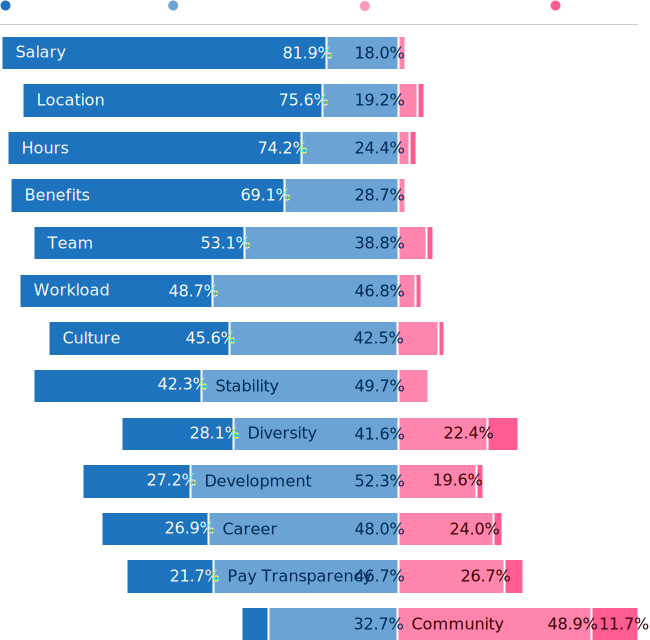

:template: survey/layout.html

.. title:: Documentation Salary Survey Results 2023

.. |icon-info| raw:: html

	<i class="fa-solid fa-circle-info"></i>

.. |icon-question| raw:: html

   <i class="fa-solid fa-circle-question"></i>

.. |25| replace:: :abbr:`25 (25th percentile - one quarter of all salaries were lower than this value)`:sup:`th`

.. |25th| replace:: 25\ :sup:`th`

.. |50| replace:: :abbr:`50 (50th percentile or median - half of all salaries were higher than this value, half were lower)`:sup:`th`

.. |50th| replace:: 50\ :sup:`th`

.. |75| replace:: :abbr:`75 (75th percentile - one quarter of all salaries were higher than this value)`:sup:`th`

.. |75th| replace:: 75\ :sup:`th`

.. |N| replace:: :abbr:`No. (Number of respondents)`

.. |%| replace:: :abbr:`% (Percentage of total respondents)`

.. raw:: html   
   
  <nav>

.. contents::
   :local:
   :depth: 3
   :backlinks: none

.. raw:: html

  </nav>
   
<a href="/">Home</a> &raquo; <a href="/surveys/">Salary Surveys</a> &raquo;

  <main>
      

.. _top:

****************************************
Documentation Salary Survey 2023 Results
****************************************

Introduction
============ 

In this, the fifth annual Write the Docs documentation salary survey, we gathered data from a record-breaking 1017 individual respondents - 938 employees and 79 contractors - in 53 countries, working across dozens of industries, with experience ranging from less than one year to over 40 years. 

In a hurry? Jump straight to `Median salary`_ or `Median hourly rate`_.

.. container:: note

   .. rubric:: |icon-info| Note on independent contractors, freelancers and the self-employed

   In this year's survey, we asked those who filled out the survey as independent contractors, freelancers or self-employed people what term they used to describe their type of employment. Just over half (53.2%) preferred the term "contractor", another 27.8% used "self-employed", and 16.5% used "freelancer". In this report, we'll use the term "contractors" to refer to this entire group.

Feedback
--------

We're always keen to hear your thoughts on this survey, so that we can continue to develop and refine it - and if you have used the data to help negotiate a raise or evaluate an offer, we would love to know about it! Email us at support@writethedocs.org with your feedback, ideas and experiences. 

Here are just some of the anonymous comments that respondents submitted in 2024:

.. pull-quote::

   I have a pretty good grasp on what salary I should be aiming for thanks to this survey! I hope other writers find this information as useful as I have. 

   WTD surveys (along with TechCommNZ surveys) are very useful in salary negotiations and my manager really appreciates that I bring facts and data to the table. In fact, we wait until info is available before sitting down each year.

   WTD Salary Survey helped me understand the value of my work. I decided to look for another job with a better pay range because of it. It gave me the courage to make that leap and get a higher-paying job.

   This has helped me ensure the members of my team are within an acceptable pay range and to advocate for across the board salary increases in the past.

Employment parameters
=====================

This section establishes the parameters of the respondent's employment: the type of employment, number of hours worked, job title and type of role, length of time in current position, and how focused the role is on documentation.

Basis of employment
-------------------

.. raw:: html
   
   

What we asked (click to expand)

.. container:: question

   |icon-question| On what basis are you filling out this survey?

   - I'm an employee
   - I was an employee, but am not currently working
   - I'm an independent contractor, freelance operator, or self-employed
   - I was an independent contractor, freelance operator, or self-employed, but am not currently working

.. raw:: html

   

In 2023, 92.2% of respondents (938) were employees and 7.8% (79 individuals) were contractors. 

Of the employees, 3% stated they were currently unemployed, while this number was only 0.5% for contractors. Respondents not currently working were asked to fill out the survey as if they were still at their previous employer or contract. 

.. table:: Basis of employment (2019-2023)
   :widths: 40 10 10 20 10 10
   :name: tbl-2023-basis-of-employment-history

   +-------------+-------------+-+-------------+
   | Survey year | Employees   | | Contractors |
   +=============+=====+=======+=+======+======+
   |             | |N| | |%|   | | |N|  | |%|  |
   +-------------+-----+-------+-+------+------+
   | 2019        | 652 | 93.9% | |   42 | 6.1% |
   +-------------+-----+-------+-+------+------+
   | 2020        | 748 | 92.9% | |   57 | 7.1% |
   +-------------+-----+-------+-+------+------+
   | 2021        | 887 | 92.5% | |   72 | 7.5% |
   +-------------+-----+-------+-+------+------+
   | 2022        | 491 | 93.5% | |   34 | 6.5% |
   +-------------+-----+-------+-+------+------+
   | 2023        | 938 | 92.2% | |   79 | 7.8% |
   +-------------+-----+-------+-+------+------+

Hours worked
------------

.. raw:: html
   
   

What we asked

.. container:: question

   |icon-question| How many hours per week do you work?

   - 1–20 hours
   - 21–30 hours
   - 31–40 hours
   - 41–50 hours
   - 51–60 hours
   - More than 60 hours

.. raw:: html

   

As in previous years, the majority (96%) of respondents worked traditional "full-time" hours each week: 

- 69.7% worked between 31 and 40 hours
- 24.5% worked between 41 and 50 hours
- 1.9% worked between 51 and 60 hours 

Only one respondent worked more than 60 hours - this person indicated that they put in 95 hours per week.

Of those that worked fewer hours: 

- 2.2% worked 21 to 30 hours each week
- 1.7% worked 1 to 20 hours 

.. table:: Weekly hours worked
   :widths: 70 15 15
   :name: tbl-2023-weekly-hours-worked
   :class: std3col

   +--------------+-----+-------+
   | Hours worked | |N| | |%|   |
   +==============+=====+=======+
   | 1-20 hours   |  17 | 1.7%  |
   +--------------+-----+-------+
   | 21-30 hours  |  22 | 2.2%  |
   +--------------+-----+-------+
   | 31-40 hours  | 709 | 69.7% |
   +--------------+-----+-------+
   | 41-50 hours  | 249 | 24.5% |
   +--------------+-----+-------+
   | 51-60 hours  |  19 | 1.9%  |
   +--------------+-----+-------+
   | 61+ hours    |   1 | 0.8%  |
   +--------------+-----+-------+

Job title
---------

.. raw:: html
   
   

What we asked

.. container:: question

   |icon-question| What is your job title?

.. raw:: html

   

With typos fixed, abbreviations expanded, stop words removed and keyword faceting applied, 275 unique job titles could be discerned. One respondent indicated that they did not have a job title.    
      
As in previous years, the most widely used exact title was "Technical Writer", reported by 32% of respondents - in fact this phrase appeared in the top 5 job titles and in 67.9% of all job titles.  

.. raw:: html

   
<input type="radio" id="tabA3-1" name="tabGroupA3" class="tab" checked tabindex="0"><label for="tabA3-1">Technical Writer</label><input type="radio" id="tabA3-2" name="tabGroupA3" class="tab"><label for="tabA3-2">Other titles</label>

.. table:: Most widely-used job titles
   :widths: 70 15 15
   :name: tbl-2023-top-job-titles
   :class: std3col

   +----------------------------+-----+-------+
   | Job title                  | |N| | |%|   |
   +============================+=====+=======+
   | Technical Writer           | 321 | 31.6% |
   +----------------------------+-----+-------+
   | Senior Technical Writer    | 191 | 18.8% |
   +----------------------------+-----+-------+
   | Lead Technical Writer      | 39  | 3.8%  |
   +----------------------------+-----+-------+
   | Staff Technical Writer     | 24  | 2.4%  |
   +----------------------------+-----+-------+
   | Principal Technical Writer | 19  | 1.9%  |
   +----------------------------+-----+-------+
   | Documentation Manager      | 15  | 1.5%  |
   +----------------------------+-----+-------+
   | Technical Writing Manager  | 13  | 1.3%  |
   +----------------------------+-----+-------+
   | Technical Writer II        | 12  | 1.2%  |
   +----------------------------+-----+-------+
   | Documentation Specialist   | 8   | 0.8%  |
   +----------------------------+-----+-------+
   | Technical Author           | 7   | 0.7%  |
   +----------------------------+-----+-------+

.. raw:: html

	

.. table:: Job titles excluding "technical writer"
   :widths: 70 15 15
   :name: tbl-2023-job-titles-excluding-technical-writer
   :class: std3col

   +---------------------------------------+-----+------+
   | Title                                 | |N| | |%|  |
   +=======================================+=====+======+
   | Information Developer                 | 5   | 1.7% |
   +---------------------------------------+-----+------+
   | Content Developer                     | 5   | 1.7% |
   +---------------------------------------+-----+------+
   | Information Architect                 | 4   | 1.3% |
   +---------------------------------------+-----+------+
   | Technical Editor                      | 4   | 1.3% |
   +---------------------------------------+-----+------+
   | Knowledge Manager                     | 4   | 1.3% |
   +---------------------------------------+-----+------+
   | Head of Documentation                 | 3   | 1%   |
   +---------------------------------------+-----+------+
   | Senior Technical Curriculum Developer | 3   | 1%   |
   +---------------------------------------+-----+------+
   | Documentation Engineer                | 3   | 1%   |
   +---------------------------------------+-----+------+
   | UX Writer                             | 2   | 0.7% |
   +---------------------------------------+-----+------+
   | Product Manager                       | 2   | 0.7% |
   +---------------------------------------+-----+------+

.. raw:: html

   

.. raw:: html

   <figure>
      <object role="img" aria-label="Job title word cloud" aria-describedby="figure_job-title-word-cloud_desc" type="image/svg+xml" data="/_images/2023-job-title-word-cloud.svg">
         
Word cloud showing relative weights of job title keywords

      </object> 
      <figcaption>Figure: Job title word cloud</figcaption>
   </figure>

Type of role
------------

.. raw:: html
   
   

What we asked

.. container:: question

   |icon-question| How would you categorize your role? Select multiple roles, if appropriate.

   - Writer, content creator, producer, editor
   - Developer, engineer
   - Educator
   - Customer support
   - Advocate, community outreach
   - Marketing
   - Management
   - Other

   With regard to working with other people, are you typically (select multiple if appropriate):

   - A solo worker
   - Part of a team of people with the same or similar roles
   - Part of a team of people with different roles
   - Part of multiple teams
   - A manager or team leader
   - Other (please specify)

.. raw:: html

   

Role category
~~~~~~~~~~~~~

Most respondents identified their role as "writer, content creator, producer, editor" - 59.4% selected only this category, while 95.6% included it alongside other categories. The second most widely-selected was "management", with 15.5% of respondents selecting this along with other categories and 2.3% selecting it as their only role category, followed by "developer, engineer", included by 10.5% of all respondents. In total, respondents selected 63 different combinations of the 8 role categories. 

.. table:: Top role category combinations
   :widths: 70 15 15
   :name: tbl-2023-top-role-category-combinations
   :class: std3col

   +---------------------------------------------------------+-----+-------+
   | Category                                                | |N| | |%|   |
   +=========================================================+=====+=======+
   | Writer/Creator/Editor                                   | 604 | 59.4% |
   +---------------------------------------------------------+-----+-------+
   | Writer/Creator/Editor + Management                      | 69  | 6.8%  |
   +---------------------------------------------------------+-----+-------+
   | Writer/Creator/Editor + Developer/Engineer              | 45  | 4.4%  |
   +---------------------------------------------------------+-----+-------+
   | Writer/Creator/Editor + Educator                        | 40  | 3.9%  |
   +---------------------------------------------------------+-----+-------+
   | Writer/Creator/Editor + Support                         | 24  | 2.4%  |
   +---------------------------------------------------------+-----+-------+
   | Management                                              | 23  | 2.3%  |
   +---------------------------------------------------------+-----+-------+
   | Writer/Creator/Editor + Advocate                        | 19  | 1.9%  |
   +---------------------------------------------------------+-----+-------+
   | Writer/Creator/Editor + Marketing                       | 17  | 1.7%  |
   +---------------------------------------------------------+-----+-------+
   | Writer/Creator/Editor + Other                           | 17  | 1.7%  |
   +---------------------------------------------------------+-----+-------+
   | Writer/Creator/Editor + Educator + Management           | 14  | 1.4%  |
   +---------------------------------------------------------+-----+-------+
   | Writer/Creator/Editor + Developer/Engineer + Management | 10  | 1.0%  |
   +---------------------------------------------------------+-----+-------+

Of those respondents who chose "Other" and provided more detail, the additional categories included project management, product management, process management, information architecture, instructional design, QA/testing, content strategy, mentoring, and translation - as well as some terms which can be bundled under the heading "DocOps": documentation tool and workflow administration, repository maintenance, and documentation infrastructure development and support. 

Team breakdown
~~~~~~~~~~~~~~

The most widely-selected team configurations were single category: 25.2% of respondents worked only on a team made up of people with the same or similar roles, while 12.7% worked only on a team made up of people with differing roles. 8.5% worked only solo, and 7.1% selected only management. These four configurations covered just over half of all respondents - the other half chose a combination of categories. 

Of the 18.8% who indicated that they worked as a manager or team leader, 62.3% also fulfilled other team roles. 

.. table:: Team breakdown
   :widths: 70 15 15
   :name: tbl-2023-team-breakdown
   :class: std3col

   +--------------------------------------------------------------------------------------+-----+-------+
   | Team breakdown                                                                       | |N| | |%|   |
   +======================================================================================+=====+=======+
   | Team - similar roles                                                                 | 256 | 25.2% |
   +--------------------------------------------------------------------------------------+-----+-------+
   | Team - different roles                                                               | 129 | 12.7% |
   +--------------------------------------------------------------------------------------+-----+-------+
   | Solo worker                                                                          | 86  | 8.5%  |
   +--------------------------------------------------------------------------------------+-----+-------+
   | Manager or team leader                                                               | 72  | 7.1%  |
   +--------------------------------------------------------------------------------------+-----+-------+
   | Team - similar roles, Team - different roles                                         | 58  | 5.7%  |
   +--------------------------------------------------------------------------------------+-----+-------+
   | Solo worker, Team - different roles                                                  | 58  | 5.7%  |
   +--------------------------------------------------------------------------------------+-----+-------+
   | Team - similar roles, Team - different roles, Multiple teams                         | 52  | 5.1%  |
   +--------------------------------------------------------------------------------------+-----+-------+
   | Team - different roles, Multiple teams                                               | 31  | 3.0%  |
   +--------------------------------------------------------------------------------------+-----+-------+
   | Team - similar roles, Manager or team leader                                         | 31  | 3.0%  |
   +--------------------------------------------------------------------------------------+-----+-------+
   | Team - similar roles, Multiple teams                                                 | 30  | 2.9%  |
   +--------------------------------------------------------------------------------------+-----+-------+
   | Solo worker, Team - different roles, Multiple teams                                  | 29  | 2.9%  |
   +--------------------------------------------------------------------------------------+-----+-------+
   | Multiple teams                                                                       | 28  | 2.8%  |
   +--------------------------------------------------------------------------------------+-----+-------+

Length of time in current role
------------------------------

.. raw:: html
   
   

What we asked

.. container:: question

   |icon-question| Employees: 

   How long have you worked in your current role, at your current organization?
   
   Note:
   Please select the length of time for your position at your current organization only – your total years of experience in documentation will be covered in the individual demographics section. If you have changed roles at the same organization, please select the length of time that you have been in your current role.

   - Less than 1 year
   - More than 1 year but less than 2 years
   - More than 2 years but less than 5 years
   - More than 5 years but less than 10 years
   - More than 10 years

   Contractors: 

   How long have you worked as a contractor or freelancer, or been self-employed?

   Note:
   This is how long you have been a contractor or freelancer only - your total years of experience in documentation will be covered later on.

   - Less than 1 year
   - More than 1 year but less than 2 years
   - More than 2 years but less than 5 years
   - More than 5 years but less than 10 years
   - More than 10 years

.. raw:: html

   

A spike in respondents with new jobs was first seen in 2021, with 31.7% of respondents reported being in their current position at their current organization for less than a year. In 2022, this number peaked at 36.8% - when respondents with new jobs outstripped the number who had held their current position for medium or long terms. In 2023, the number of respondents with new jobs has fallen again, to 20.3% - lower than in 2020 although still well above the 9% reported in 2019. 

.. table:: Length of time in current role
   :widths: 70 15 15
   :name: tbl-2023-length-of-time-in-current-role
   :class: std3col

   +-------------------------+-----+-------+
   | Years                   | |N| | |%|   |
   +=========================+=====+=======+
   | 0-1 years               | 206 | 20.3% |
   +-------------------------+-----+-------+
   | 1-2 years               | 235 | 23.1% |
   +-------------------------+-----+-------+
   | 2-5 years               | 326 | 32.1% |
   +-------------------------+-----+-------+
   | 5-10 years              | 166 | 16.3% |
   +-------------------------+-----+-------+
   | 10+ years               | 84  | 8.3%  |
   +-------------------------+-----+-------+

.. raw:: html

   <figure>
      <object role="img" aria-label="Length of time in current role at current organization" aria-describedby="figure_length-of-time-in-current-role_desc" type="image/svg+xml" data="/_images/2023-length-of-time-in-current-role.svg">
         
Length of time in current role (at current organization - employee respondents who have changed roles at the same organization were instructed to specify the length of time they had been in their current role only, not the total length of time at the organization)

      </object> 
      <figcaption>Figure: Length of time in current role</figcaption>
   </figure>

.. figure:: images/2023/2023-length-of-time-in-current-role.svg
   :class: hide

Proportion of role related to documentation
-------------------------------------------

.. raw:: html
   
   

What we asked

.. container:: question

   |icon-question| Documentation is:

   - the whole of my official job description
   - part of my official job description
   - not officially part of my job description, but I am expected to perform documentation-related tasks
   - not officially part of my job description, and I am not expected to perform documentation-related tasks, but I do anyway

   Approximately what percentage of your day-to-day tasks are documentation-related?

   - 0-25%
   - 26-50%
   - 51-75%
   - 76-100%

.. raw:: html

   

The majority of respondents (73.5% in 2023, almost exactly the same proportion as in 2022) reported that documentation makes up both their whole official job description, and most or all of their day-to-day tasks (87.2% reporting more than 51% of their daily workload). The portion of respondents performing documentation-related tasks even though it's not part of their job description remained steady. 

.. raw:: html

   

.. raw:: html

   <input type="radio" id="tabA7-1" name="tabGroupA7" class="tab" checked tabindex="0"><label for="tabA7-1">Official role</label><input type="radio" id="tabA7-2" name="tabGroupA7" class="tab"><label for="tabA7-2">Actual role</label>

.. table:: Portion of role officially documentation-related
   :widths: 70 15 15
   :name: tbl-2023-portion-of-role-officially-documentation-related
   :class: std3col

   +--------------------------------------+-----+-------+
   | Portion of role                      | |N| | |%|   |
   +======================================+=====+=======+
   | Wholly documentation                 | 747 | 73.5% |
   +--------------------------------------+-----+-------+
   | Partly documentation                 | 238 | 23.4% |
   +--------------------------------------+-----+-------+
   | Not documentation, but it's expected | 22  | 2.2%  |
   +--------------------------------------+-----+-------+
   | Not documentation, and not expected  | 10  | 1.0%  |
   +--------------------------------------+-----+-------+

.. raw:: html

   

.. table:: Portion of role actually documentation-related
   :widths: 70 15 15
   :name: tbl-2023-portion-of-role-actually-documentation-related
   :class: std3col

   +--------------------------------------+-----+-------+
   | Portion of role                      | |N| | |%|   |
   +======================================+=====+=======+
   | 76-100%                              | 582 | 57.2% |
   +--------------------------------------+-----+-------+
   | 51-75%                               | 305 | 30.0% |
   +--------------------------------------+-----+-------+
   | 26-50%                               |  87 | 8.6%  |
   +--------------------------------------+-----+-------+
   | 0-25%                                | 43  | 4.2%  |
   +--------------------------------------+-----+-------+   

.. raw:: html

   

.. raw:: html

   <figure>
      <object role="img" aria-label="Portion of role officially documentation-related" aria-describedby="figure_proportion-of-role-officially-docs-related_desc" type="image/svg+xml" data="/_images/2023-portion-of-role-officially-docs-related.svg">
         
Donut chart showing what proportion of respondents official job description was documentation-related.

      </object> 
      <figcaption>Figure: Portion of role officially documentation-related</figcaption>
   </figure>

.. raw:: html

   <figure>
      <object role="img" aria-label="Portion of role actually documentation-related" aria-describedby="figure_proportion-of-role-actually-docs-related_desc" type="image/svg+xml" data="/_images/2023-proportion-actual.svg">
         
Donut chart showing what proportion of respondents actual day-to-day tasks are documentation-related.

      </object> 
      <figcaption>Figure: Portion of role actually documentation-related</figcaption>
   </figure>

Job changes
===========

In the 2022 survey results, we saw more employee respondents in new positions - jobs that they'd held for less than one year - than in any previous survey. To better explore how the job market shake-up of the past few years is affecting our community - both employees and contractors - we added this new section for job changes.

Employment or contract status change
------------------------------------

.. raw:: html
   
   

What we asked

.. container:: question

   |icon-question| Employees:

   Has your employment status changed in the past year? 
   
   - Yes
   - No

   Examples of an employment status change: you left a job; were promoted, laid off, made redundant or terminated; you started a new role.

   What are the circumstances of your employment status change? Check all that apply.

   - I was promoted within the same organization
   - I moved to another position within the same organization
   - I started a new position in a new organization
   - I was made redundant, downsized or laid off due to restructuring/bankruptcy/closure
   - My employment was terminated for another reason
   - I resigned in order to accept another offer of employment
   - I resigned, but not to accept another offer of employment
   - I would rather not say
   - Other (please specify)

   Contractors:

   Has your contract/freelance status changed in the past year? 

   - Yes
   - No

   Examples of a contract/freelance status change: a contract or project cancelled prematurely; your regular freelance workload dried up unexpectedly; you started a new contract.

   What are the circumstances of your contract/freelance status change? Check all that apply.

   - I started a new contract or freelance project (or multiple projects)
   - A contract or freelance project ended prematurely
   - A contract or freelance project ended as expected
   - My contract was not renewed as expected
   - I resigned in order to start another contract
   - I resigned, but not to start another contract
   - I "fired" a freelance client
   - My freelance work pipeline dried up
   - I left employment in order to start as a contractor/freelancer
   - I finished contracting/freelancing in order to accept a position as an employee
   - I would rather not say
   - Other (please specify)

.. raw:: html

   

36.5% of respondents reported undergoing a change in their employment status in the past year, with contractors reporting changes at a slightly higher rate (43%) than employees (35.9%).

Of the employees experiencing employment changes, starting a new position at a new organization was the most reported change (46%). 28.8% were promoted within the same organization.

Of the contractors, having a contract or project ending prematurely was the most reported change (41%). 35.3% started a new contract.

.. raw:: html

   

.. raw:: html

   <input type="radio" id="tabB2-1" name="tabGroupB2" class="tab" checked tabindex="0"><label for="tabB2-1">Employees</label><input type="radio" id="tabB2-2" name="tabGroupB2" class="tab"><label for="tabB2-2">Contractors</label>

.. table:: Employment change - employees
   :widths: 70 15 15
   :name: tbl-2023-employment-change-employees
   :class: std3col

   +---------------------+-----+-------+
   | Change              | |N| | |%|   |
   +=====================+=====+=======+
   | New position        | 155 | 46.0% |
   +---------------------+-----+-------+
   | Promotion           |  97 | 28.8% |
   +---------------------+-----+-------+
   | Redundancy          |  84 | 24.9% |
   +---------------------+-----+-------+
   | Resigned with offer |  54 | 16.0% |
   +---------------------+-----+-------+
   | Lateral move        |  21 |  6.2% |
   +---------------------+-----+-------+
   | Resigned            |  13 |  3.9% |
   +---------------------+-----+-------+
   | Terminated          |  11 |  3.3% |
   +---------------------+-----+-------+

.. raw:: html

   

.. table:: Employment change - contractors
   :widths: 70 15 15
   :name: tbl-2023-employment-change-contractors
   :class: std3col

   +----------------------------+-----+-------+
   | Change                     | |N| | |%|   |
   +============================+=====+=======+
   | Contract ended prematurely |  14 | 41.2% |
   +----------------------------+-----+-------+
   | New contract               |  12 | 35.3% |
   +----------------------------+-----+-------+
   | Left employment            |   8 | 23.5% |
   +----------------------------+-----+-------+
   | Contracted ended normally  |   7 | 20.6% |
   +----------------------------+-----+-------+
   | Pipeline dried up          |   6 | 17.6% |
   +----------------------------+-----+-------+
   | Contract not renewed       |   5 | 14.7% |
   +----------------------------+-----+-------+
   | Resigned with offer        |   4 | 11.8% |
   +----------------------------+-----+-------+
   | Fired client               |   3 |  8.8% |
   +----------------------------+-----+-------+
   | Left contracting           |   2 |  5.9% |
   +----------------------------+-----+-------+

.. raw:: html

   

Job or contract search status
-----------------------------

.. raw:: html
   
   

What we asked

.. container:: question

   |icon-question| Employees:

   What is your current job search status?

   - I'm not looking for a new position, and am not open to employment offers
   - I'm not looking for a new position, but am open to employment offers
   - I'm not looking for a new position, but expect to be within the next year
   - I'm actively looking for a new position

   Contractors: 

   What is your current contract/freelance search status?

   - I'm not looking for new contracts or freelance projects, and am not open to offers
   - I'm not looking for new contracts or freelance projects, but am open to offers
   - I'm not looking for new contracts or freelance projects, but expect to be within the next year
   - I'm actively looking for new contracts or freelance projects

.. raw:: html  

   

The majority of respondents - 46.3% of employees and 38% of contractors - stated that while they were not actively looking for new positions or contracts, they were open to considering offers that might come their way. 14% of employees and 29.1% of contractors said they were actively looking for new work. 

.. raw:: html

   

.. raw:: html

   <input type="radio" id="tabB3-1" name="tabGroupB3" class="tab" checked><label for="tabB3-1">Employees</label><input type="radio" id="tabB3-2" name="tabGroupB3" class="tab"><label for="tabB3-2">Contractors</label>

.. table:: Current job search status - employees
   :widths: 70 15 15
   :name: tbl-2023-current-job-search-status-employees
   :class: std3col

   +--------------------------------------------------------+-----+-------+
   | Search status                                          | |N| | |%|   |
   +========================================================+=====+=======+
   | Not actively looking, but open to offers               | 434 | 46.3% |
   +--------------------------------------------------------+-----+-------+
   | Not actively looking, not open to offers               | 298 | 31.8% |
   +--------------------------------------------------------+-----+-------+
   | Actively looking                                       | 131 | 14.0% |
   +--------------------------------------------------------+-----+-------+
   | Not looking yet, but expect to be within the next year | 75  | 8.0%  |
   +--------------------------------------------------------+-----+-------+

.. raw:: html

   

.. table:: Current work search status - contractors
   :widths: 70 15 15
   :name: tbl-2023-current-work-search-status-contractors
   :class: std3col

   +--------------------------------------------------------+-----+-------+
   | Search status                                          | |N| | |%|   |
   +========================================================+=====+=======+
   | Not actively looking, but open to offers               | 30  | 38.0% |
   +--------------------------------------------------------+-----+-------+
   | Actively looking                                       | 23  | 29.1% |
   +--------------------------------------------------------+-----+-------+
   | Not actively looking, not open to offers               | 18  | 22.8% |
   +--------------------------------------------------------+-----+-------+
   | Not looking yet, but expect to be within the next year | 8   | 10.1% |
   +--------------------------------------------------------+-----+-------+

.. raw:: html

	

Job security and stability
--------------------------

.. raw:: html
   
   

What we asked

.. container:: question

   |icon-question| How would you characterize your current feelings of job security and stability, or contract/freelance income security and stability, compared to this time last year?

   - I'm less confident in my job security or contract/freelance income security than I was last year
   - My confidence level is around the same
   - I'm more confident in my job security or contract/freelance income security than I was last year

.. raw:: html

   

Note: Employees and contractors who had indicated that they were currently unemployed were not shown this question. 

Just over half of all respondents (54.1%) reported feeling the same level of job security and stability, compared to the previous year. 30.5% felt less secure, and only 15.4% felt more secure. The difference in responses between employees and contractors for this question was not significantly different.

.. table:: Feelings of job security and stability
   :widths: 70 15 15
   :name: tbl-2023-feelings-of-job-security-combined
   :class: std3col

   +----------------------------------------+-----+-------+
   | Feelings                               | |N| | |%|   |
   +========================================+=====+=======+
   | The same as last year                  | 531 | 54.1% |
   +----------------------------------------+-----+-------+
   | Less secure than last year             | 299 | 30.5% |
   +----------------------------------------+-----+-------+
   | More secure than last year             | 151 | 15.4% |
   +----------------------------------------+-----+-------+

Job offer considerations
------------------------

.. raw:: html
   
   

What we asked

.. container:: question

   |icon-question| When considering an offer of employment, how important do you consider the following 13 factors? 
   
   The options for each were: not relevant, not very important, somewhat important, very important.

   - Salary
   - Benefits (i.e. paid vacation, pension, insurance etc)
   - Hours and flexibility
   - Workload and responsibilities
   - Career advancement opportunities
   - Professional development opportunities
   - Work location (remote/on-site/hybrid)
   - Management/team/co-workers
   - Organization's reputation, financial standing/stability, and job security
   - Organization's culture
   - Organization's community involvement
   - Organization's pay transparency policy
   - Organization's diversity/inclusivity policy

.. raw:: html

   

Note: This question - new for 2023 - was only shown to employees. 

While some obvious factors were given high importance by most respondents - salary, work location, hours, and benefits - other factors resulted in more varied results. The only factor that the majority of respondents agreed was not very important was community involvement. Stability, diversity, professional development, career advancement and pay transparency were all found to be "somewhat important" by the majority of respondents, but for all of these factors there was a wide range of variations in the responses. 

.. table:: Employee job offer considerations
   :widths: 32 17 17 17 17
   :name: tbl-2023-employee-job-offer-considerations
   :class: fivecol

   +------------------+------------------------------------------+
   | Factor           |                Importance                |
   |                  +-------+----------+----------+------------+
   |                  | Very  | Somewhat | Not very | None       |
   +==================+=======+==========+==========+============+
   | Salary           | 81.9% | 18.0%    | 0.1%     | 0%         |
   +------------------+-------+----------+----------+------------+
   | Location         | 75.6% | 19.2%    | 4.8%     | 0.4%       |
   +------------------+-------+----------+----------+------------+
   | Hours            | 74.2% | 24.4%    | 1.4%     | 0%         |
   +------------------+-------+----------+----------+------------+
   | Benefits         | 69.1% | 28.7%    | 1.7%     | 0.5%       |
   +------------------+-------+----------+----------+------------+
   | Team             | 53.1% | 38.8%    | 7.2%     | 0.9%       |
   +------------------+-------+----------+----------+------------+
   | Workload         | 48.7% | 46.8%    | 4.3%     | 0.2%       |
   +------------------+-------+----------+----------+------------+
   | Culture          | 45.6% | 42.5%    | 10.3%    | 1.5%       |
   +------------------+-------+----------+----------+------------+
   | Stability        | 42.3% | 49.7%    | 7.6%     | 0.4%       |
   +------------------+-------+----------+----------+------------+
   | Diversity        | 28.1% | 41.6%    | 22.4%    | 7.9%       |
   +------------------+-------+----------+----------+------------+
   | Development      | 27.2% | 52.3%    | 19.6%    | 0.9%       |
   +------------------+-------+----------+----------+------------+
   | Career           | 26.9% | 48.0%    | 24.0%    | 1.2%       |
   +------------------+-------+----------+----------+------------+
   | Pay transparency | 21.7% | 46.7%    | 26.7%    | 4.9%       |
   +------------------+-------+----------+----------+------------+
   | Community        | 6.6%  | 32.7%    | 48.9%    | 11.7%      |
   +------------------+-------+----------+----------+------------+

.. raw:: html

   <figure>
      <object role="img" aria-label="Job offer considerations" aria-describedby="figure_job-offer-considerations_desc" type="image/svg+xml" data="/_images/2023-job-offer-considerations.svg">
         
Diverging stacked horizontal bar chart showing level of importance given to various factors by employee respondents when considering an offer of employment.

      </object> 
      <figcaption>Figure: Employee job offer considerations</figcaption>
   </figure>

Workplace
=========

The questions in this section relate to respondents' workplace: whether they work from home, from an office, or a combination, and how they feel about that. We were also interested in how the much-discussed "back to the office" mandates have affected our community. 

.. container:: note

   .. rubric:: |icon-info| Note on use of the term "remote"

   In previous surveys, this was some confusion as to the definition of the term "remote", as many people suddenly forced to work from home due to the pandemic did not think of that situation as working remotely. To clarify, we consider the word "remote" to have the same meaning as "work from home" or "home office".

Work location
-------------

.. raw:: html
   
   

What we asked

.. container:: question

   |icon-question| What is your current work location?

   - I am required to be on-site full time
   - I am on-site full time, but it is not required
   - I am partially on-site, and partially remote (hybrid)
   - I am fully remote, but it is by choice (i.e. an office location is available to me)
   - I am fully remote, and it is required (i.e. no office location is available to me)

   How do you feel about your work location?

   - Very negative
   - Negative
   - Neutral
   - Positive
   - Very Positive

.. raw:: html

   

The majority of respondents reported working remotely, with the number doing so by choice (36.2%) higher than the number required to do so by their employer (29%). 

.. table:: Work location
   :widths: 70 15 15
   :name: tbl-2023-work-location
   :class: std3col

   +------------------------+-----+-------+
   | Work location          | |N| | |%|   |
   +========================+=====+=======+
   | Remote (not required)  | 368 | 36.2% |
   +------------------------+-----+-------+
   | Remote (required)      | 295 | 29.0% |
   +------------------------+-----+-------+
   | Hybrid                 | 287 | 28.2% |
   +------------------------+-----+-------+
   | On-site (not required) | 35  | 3.4%  |
   +------------------------+-----+-------+
   | On-site (required)     | 32  | 3.1%  |
   +------------------------+-----+-------+

.. raw:: html

   <figure>
      <object role="img" aria-label="Work location" aria-describedby="figure_work-location_desc" type="image/svg+xml" data="/_images/2023-work-location.svg">
         
Donut chart showing current work location - remote, hybrid, on-site - and whether the location is their choice or their employer's.

      </object> 
      <figcaption>Figure: Work location</figcaption>
   </figure>

The majority of respondents (80.8%) reported feeling "positive" about their work location, with 51.8% feeling "very positive". 

.. table:: Feelings about work location
   :widths: 70 15 15
   :name: tbl-2023-feelings-about-work-location
   :class: std3col

   +------------------------------+-----+-------+
   | Feelings                     | |N| | |%|   |
   +==============================+=====+=======+
   | Very positive                | 527 | 51.8% |
   +------------------------------+-----+-------+
   | Positive                     | 295 | 29.0% |
   +------------------------------+-----+-------+
   | Neutral                      | 134 | 13.2% |
   +------------------------------+-----+-------+
   | Negative                     | 51  | 5.0%  |
   +------------------------------+-----+-------+
   | Very negative                | 10  | 1.0%  |
   +------------------------------+-----+-------+

.. raw:: html

   <figure>
      <object role="img" aria-label="Work location" aria-describedby="figure_feelings-about-work-location_desc" type="image/svg+xml" data="/_images/2023-feelings-about-work-location.svg">
         
Donut chart showing respondents feelings about their work location.

      </object> 
      <figcaption>Figure: Feelings about work location</figcaption>
   </figure>

"Return to office" (RTO) mandates
---------------------------------

.. container:: note

   .. rubric:: |icon-info| Note on use of the term "post-pandemic"

   The survey questions originally included the term "post-pandemic" to describe "return to office" mandates. However, as was correctly pointed out by several community members, the COVID-19 pandemic is not over, and is still very much a concern for at-risk groups. Removing this term does not alter the meaning or intention of the question and so has been left out of this report. 

.. raw:: html
   
   

What we asked

.. container:: question

   |icon-question| Has your organization implemented a "return to office" policy - requesting or requiring that remote or "work from home" employees return to working on-site?

   - Yes, it's required all of the time
   - Yes, it's required but only part of the time (hybrid work is ok)
   - Yes, it's encouraged but not mandatory
   - Yes, but only for some roles
   - No, remote work is still allowed/encouraged/required
   - No, my position was always remote-only
   - No, my position was always hybrid
   - No, my position was always on-site only
   - I don't know

   How do you feel about your organization's "return to office" policy?

   - Very negative
   - Negative
   - Neutral
   - Positive
   - Very Positive

.. raw:: html

   

55.1% of respondents reported that they have not been affected by "return to office" (RTO) policies. 42.8% have been affected, with only 2.2% unsure. 

Of those that were not affected, 26.2% - the largest segment overall - reported that remote work was still allowed, encouraged or required, with another 23.4% stating that their position was always remote-only. 

For those that have been affected, most reported that a hybrid model was being mandated (24.2% overall).  

.. raw:: html

   
<input type="radio" id="tabC3-1" name="tabGroupC3" class="tab" checked><label for="tabC3-1">Not affected</label><input type="radio" id="tabC3-2" name="tabGroupC3" class="tab"><label for="tabC3-2">Affected</label>

.. table:: Not affected by mandates
   :widths: 70 15 15
   :name: tbl-2023-return-to-the-office-mandates-not-affected
   :class: std3col

   +------------------------------------------------------+-----+-------+
   | RTO Status                                           | |N| | |%|   |
   +======================================================+=====+=======+
   | No, remote work is still allowed/encouraged/required | 266 | 47.5% |
   +------------------------------------------------------+-----+-------+
   | No, my position was always remote-only               | 238 | 42.5% |
   +------------------------------------------------------+-----+-------+
   | No, my position was always hybrid                    | 37  | 6.6%  |
   +------------------------------------------------------+-----+-------+
   | No, my position was always on-site only              | 19  | 3.4%  |
   +------------------------------------------------------+-----+-------+

.. raw:: html

	

.. table:: Affected by mandates
   :widths: 70 15 15
   :name: tbl-2023-return-to-the-office-mandates-affected
   :class: std3col

   +------------------------------------------------------------------+-----+-------+
   | RTO Status                                                       | |N| | |%|   |
   +==================================================================+=====+=======+
   | Yes, it's required but only part of the time (hybrid work is ok) | 246 | 56.6% |
   +------------------------------------------------------------------+-----+-------+
   | Yes, it's encouraged but not mandatory                           | 102 | 23.4% |
   +------------------------------------------------------------------+-----+-------+
   | Yes, but only for some roles                                     | 64  | 14.7% |
   +------------------------------------------------------------------+-----+-------+
   | Yes, it's required all of the time                               | 23  | 5.3%  |
   +------------------------------------------------------------------+-----+-------+

.. raw:: html

   

Those who reported being affected by an RTO policy were asked about their feelings on the situation. 

Those who were required to return to the office on a part-time basis were quite evenly split between neutral (32.9%), negative (26%) and very negative (22%). Those who were positive (14.6%) or very positive (4.5%) were in the minority.

Those who reported that a return was being encouraged by not required were less negative overall - 41% reported "neutral", with the remainder split evenly between positive and negative. 

Those affected by a full time RTO mandate felt predominantly negative, with only 3 individuals reporting positive feelings. 

Preferred work location
-----------------------

.. raw:: html
   
   

What we asked

.. container:: question

   |icon-question| Regardless of the policy at your current organization or your current situation, what is your preferred work location?

   - I prefer to work on-site on a full-time basis
   - I prefer to work remotely/from home on a full-time basis
   - I prefer the flexibility of a hybrid work location (partly on-site, partly remote)
   - I have no strong preference

.. raw:: html

   

Regardless of their current situation, 58% of all respondents said that their preferred work location is remote. Another 38.2% favored a hybrid model (some days in the office, some days working from home or another location). Only 2.6% said they preferred working on-site at their employer's office, and 1.3% stated no preference. 

.. table:: Preferred work location
   :widths: 70 15 15
   :name: tbl-2023-preferred-work-location
   :class: std3col

   +-------------------------+-----+-------+
   | Preferred work location | |N| | |%|   |
   +=========================+=====+=======+
   | Remote                  | 590 | 58.0% |
   +-------------------------+-----+-------+
   | Hybrid                  | 388 | 38.2% |
   +-------------------------+-----+-------+
   | On-site                 | 26  | 2.6%  |
   +-------------------------+-----+-------+
   | No preference           | 13  | 1.3%  |
   +-------------------------+-----+-------+

Employee salary, benefits and satisfaction
==========================================

To protect the privacy of our community, we do not publish median salary figures for any region or category with less than 10 respondents. In previous years, this has meant that median salaries could only be given for a few regions and countries, and a handful of US states.     

With this year's survey amassing the highest number of submissions yet, we can now provide a more extensive range of salary breakdowns. Alongside the baseline data for Africa, which encompasses respondents from South Africa, Kenya, and Nigeria, we have gathered enough data to publish median salaries (|50th| percentile) for 15 individual countries, 17 US states, 3 Canadian provinces (including separate figures for each province's capital city), and 3 Australian states.

In regions or categories meet the minimum threshold of 30 respondents, we're also providing the |25th| percentile (the value below which 25% of the data falls) and |75th| percentile (the value below which 75% of the data falls).

Currency
--------

.. raw:: html
   
   

What we asked

.. container:: question

   |icon-question| What currency are you paid in? 

.. raw:: html

   

Employee respondents reported being paid in 26 different currencies. To make comparisons possible, all currencies were converted to USD using mid-market exchange rates, averaged for the whole of 2023.

.. table:: Currencies and exchange rates - employees
   :widths: 55 10 10 10 15
   :name: tbl-2023-currencies-employees
   :class: std3col

   +--------------------------------------+------+---------+
   | Currency (code)                      | |N|  | Rate    |
   +======================================+======+=========+
   | United States Dollar (USD)           | 487  | 1.00000 |
   +--------------------------------------+------+---------+
   | Euro (EUR)                           | 147  | 1.08396 |
   +--------------------------------------+------+---------+
   | Canadian Dollar (CAD)                | 73   | 0.74068 |
   +--------------------------------------+------+---------+
   | British Pound Sterling (GBP)         | 55   | 1.25209 |
   +--------------------------------------+------+---------+
   | Australian Dollar (AUD)              | 41   | 0.65884 |
   +--------------------------------------+------+---------+
   | Indian Rupee (INR)                   | 27   | 0.01209 |
   +--------------------------------------+------+---------+
   | Romanian Leu (RON)                   | 17   | 0.23000 |
   +--------------------------------------+------+---------+
   | Polish Zloty (PLN)                   | 13   | 0.24198 |
   +--------------------------------------+------+---------+
   | Russian Ruble (RUB)                  | 12   | 0.01190 |
   +--------------------------------------+------+---------+
   | Israeli New Shekel (NIS)             | 12   | 0.26921 |
   +--------------------------------------+------+---------+
   | Czech Koruna (CZK)                   | 8    | 0.04484 |
   +--------------------------------------+------+---------+
   | South African Rand (ZAR)             | 7    | 0.05359 |
   +--------------------------------------+------+---------+
   | Ukrainian Hryvnia (UAH)              | 6    | 0.02720 |
   +--------------------------------------+------+---------+
   | Mexican Peso (MXN)                   | 5    | 0.05734 |
   +--------------------------------------+------+---------+
   | Japanese Yen (JPY)                   | 5    | 0.00700 |
   +--------------------------------------+------+---------+
   | Brazilian Real (BRL)                 | 4    | 0.20030 |
   +--------------------------------------+------+---------+
   | New Zealand Dollar (NZD)             | 4    | 0.61072 |
   +--------------------------------------+------+---------+
   | Swedish Krona (SEK)                  | 4    | 0.09427 |
   +--------------------------------------+------+---------+
   | Swiss Franc (CHF)                    | 4    | 1.12614 |
   +--------------------------------------+------+---------+
   | Norwegian Krone (NOK)                | 1    | 0.09413 |
   +--------------------------------------+------+---------+
   | United Arab Emirates Dirham (AED)    | 1    | 0.27227 |
   +--------------------------------------+------+---------+
   | Indonesian Rupiah (IDR)              | 1    | 0.00007 |
   +--------------------------------------+------+---------+
   | Kenyan Shilling (KES)                | 1    | 0.00720 |
   +--------------------------------------+------+---------+
   | Thai Baht (THB)                      | 1    | 0.02851 |
   +--------------------------------------+------+---------+
   | Singapore Dollar (SGD)               | 1    | 0.74368 |
   +--------------------------------------+------+---------+
   | Danish Krone (DKK)                   | 1    | 0.14532 |
   +--------------------------------------+------+---------+

Pay interval
------------

.. raw:: html
   
   

What we asked

.. container:: question

   |icon-question| Would you prefer to enter your salary as a yearly or monthly amount?

.. raw:: html

   

In some locations, it is customary to discuss salary as a yearly figure, while in other it is more common to talk about monthly salaries. Respondents were asked to specify if they were entering a yearly or monthly figure, and all monthly salaries were multiplied by 12 to allow for comparison. In total, 81.1% of employee respondents chose to enter their salary as a yearly figure, with 18.9% choosing monthly. 

Median salary
-------------

.. raw:: html
   
   

What we asked

.. container:: question

   |icon-question| What is your total (gross) salary (including tax)? Note: If your total compensation is made up of a base salary and significant bonus, equity or commission payments, please enter your total compensation here (or an average, if it fluctuates).

.. raw:: html

   

As in previous years, salaries for those working part-time hours (less than 30 per week) have been omitted from the figures in this section. The median salaries are based on 922 full-time employee respondents.  

.. container:: note

   .. rubric:: |icon-info| Definition of percentile values

   Previous survey results have only reported the median salary - the number in the middle of the range, sometimes referred to as the |50th| percentile. Due to the increase in numbers and finer-grained location data, we're able this year to also publish figures for the |25th| and |75th| percentile figures, for regions where there are more than 30 respondents. 

   In the following tables, the following definitions apply:

   - |25th| percentile: one quarter of all respondents earned less, three quarters earned more
   - |50th| percentile (median): half of all respondents earned more, half earned less
   - |75th| percentile: one quarter of all respondents earned more, three  quarters earned less

Median salary by respondent region
~~~~~~~~~~~~~~~~~~~~~~~~~~~~~~~~~~

Given the range of socio-economic differences in the countries in the survey results, median salary figures broken down by country of residence of employee is more useful than overall median salary.

.. container:: note

   .. rubric:: |icon-info| Privacy and salary information

   In order to protect the privacy of respondents, median salaries are not shown for any country or region with less than 10 respondents. Countries with respondents in 2024 that are excluded by this condition are:

   - North America: Puerto Rico, St Kitts & Nevis, Mexico
   - Europe: Spain, Czech Republic, Finland, Italy, Switzerland, Croatia, Sweden, Serbia, Austria, Slovenia, Estonia, Greece, Belgium, Lithuania, Bulgaria, Norway, Turkey, Cyprus, Montenegro, Denmark
   - Oceania: New Zealand
   - Asia: Japan, Singapore, Thailand, Indonesia 
   - Middle East: United Arab Emirates, Lebanon
   - Africa: South Africa, Kenya, Nigeria 
   - South America: Brazil, Argentina 

.. table:: Salary (USD) by respondent region
   :name: tbl-2023-salary-by-respondent-region
   :class: medians

   +-------------------------+-------------+--------------+--------------+
   | Region (|N|)            | |25|        |  |50|        | |75|         |
   +=========================+=============+==============+==============+
   | **Worldwide** (922)     | **$58,534** | **$82,418**  | **$118,571** |
   +-------------------------+-------------+--------------+--------------+
   | **North America** (526) | **$80,000** | **$105,000** | **$140,000** |
   +-------------------------+-------------+--------------+--------------+
   | - USA (444)             |     $86,962 |     $114,000 |     $147,000 |
   +-------------------------+-------------+--------------+--------------+
   | - Canada (74)           |     $62,217 |      $73,050 |      $92,215 |
   +-------------------------+-------------+--------------+--------------+
   | **Europe** (287)        | **$37,749** |  **$56,580** |  **$75,739** |
   +-------------------------+-------------+--------------+--------------+
   | - United Kingdom (54)   |     $56,203 |      $72,058 |      $86,660 |
   +-------------------------+-------------+--------------+--------------+
   | - Ukraine (36)          |     $21,636 |      $28,525 |      $40,725 |
   +-------------------------+-------------+--------------+--------------+
   | - Germany (32)          |     $64,496 |      $76,473 |      $90,240 |
   +-------------------------+-------------+--------------+--------------+
   | - France (21)           |             |      $45,526 |              |
   +-------------------------+-------------+--------------+--------------+
   | - Poland (18)           |             |      $38,475 |              |
   +-------------------------+-------------+--------------+--------------+
   | - Romania (17)          |             |      $39,631 |              |
   +-------------------------+-------------+--------------+--------------+
   | - Ireland (12)          |             |      $81,189 |              |
   +-------------------------+-------------+--------------+--------------+
   | - Portugal (11)         |             |      $66,159 |              |
   +-------------------------+-------------+--------------+--------------+
   | - Russia (11)           |             |      $21,420 |              |
   +-------------------------+-------------+--------------+--------------+
   | - Netherlands (11)      |             |      $78,045 |              |
   +-------------------------+-------------+--------------+--------------+
   | **Oceania** (43)        | **$72,474** |  **$85,648** | **$102,450** |
   +-------------------------+-------------+--------------+--------------+
   | - Australia (39)        |     $72,474 |      $88,944 |     $103,109 |
   +-------------------------+-------------+--------------+--------------+
   | **Asia** (36)           | **$15,128** |  **$30,225** |  **$48,693** |
   +-------------------------+-------------+--------------+--------------+
   | - India (28)            |             |      $22,106 |              |
   +-------------------------+-------------+--------------+--------------+
   | **Middle East** (14)    | **--**      |  **$95,301** | **--**       |
   +-------------------------+-------------+--------------+--------------+
   | - Israel (12)           |             |      $96,916 |              |
   +-------------------------+-------------+--------------+--------------+
   | **Africa** (10)         | **--**      |  **$45,019** | **--**       |
   +-------------------------+-------------+--------------+--------------+

Median salary by respondent region - further breakdowns
~~~~~~~~~~~~~~~~~~~~~~~~~~~~~~~~~~~~~~~~~~~~~~~~~~~~~~~

Respondent numbers allow some additional breakdowns by US state, Candian province and Australian state, as well as a handful of North American cities. 

.. raw:: html

   
<input type="radio" id="tabD3-1" name="tabGroupD3" class="tab" checked><label for="tabD3-1">United States</label><input type="radio" id="tabD3-2" name="tabGroupD3" class="tab"><label for="tabD3-2">Canada</label><input type="radio" id="tabD3-3" name="tabGroupD3" class="tab"><label for="tabD3-3">Australia</label>

.. table:: Salary (USD) by respondent region - USA
   :name: tbl-2023-salary-by-respondent-region-usa
   :class: medians

   +---------------------+-----------+----------+-----------+
   | State (|N|)         | |25|      | |50|     | |75|      |
   +=====================+===========+==========+===========+
   | California (65)     |  $100,995 | $149,347 |  $180,000 |
   +---------------------+-----------+----------+-----------+
   | - San Franciso (10) |           | $200,000 |           |
   +---------------------+-----------+----------+-----------+
   | Texas (41)          |   $95,000 | $115,300 |  $140,000 |
   +---------------------+-----------+----------+-----------+
   | - Austin (19)       |           | $128,623 |           |
   +---------------------+-----------+----------+-----------+
   | North Carolina (27) |           | $114,000 |           |
   +---------------------+-----------+----------+-----------+
   | Washington (25)     |           | $150,000 |           |
   +---------------------+-----------+----------+-----------+
   | - Seattle (11)      |           | $170,000 |           |
   +---------------------+-----------+----------+-----------+
   | Oregon (25)         |           | $115,448 |           |
   +---------------------+-----------+----------+-----------+
   | - Portland (17)     |           | $104,000 |           |
   +---------------------+-----------+----------+-----------+
   | Colorado (23)       |           | $133,000 |           |
   +---------------------+-----------+----------+-----------+
   | Florida (20)        |           |  $90,500 |           |
   +---------------------+-----------+----------+-----------+
   | New York (20)       |           | $104,250 |           |
   +---------------------+-----------+----------+-----------+
   | Massachusetts (19)  |           | $133,034 |           |
   +---------------------+-----------+----------+-----------+
   | Minnesota (15)      |           | $100,000 |           |
   +---------------------+-----------+----------+-----------+
   | Michigan (15)       |           |  $88,000 |           |
   +---------------------+-----------+----------+-----------+
   | Pennsylvania (15)   |           | $114,000 |           |
   +---------------------+-----------+----------+-----------+
   | Wisconsin (14)      |           | $100,375 |           |
   +---------------------+-----------+----------+-----------+
   | Virginia (14)       |           |  $89,750 |           |
   +---------------------+-----------+----------+-----------+
   | Georgia (12)        |           | $115,000 |           |
   +---------------------+-----------+----------+-----------+
   | Ohio (12)           |           | $107,050 |           |
   +---------------------+-----------+----------+-----------+
   | Utah (11)           |           | $108,819 |           |
   +---------------------+-----------+----------+-----------+

.. raw:: html

   

.. table:: Salary (USD) by respondent region - Canada
   :name: tbl-2023-salary-by-respondent-region-canada
   :class: medians

   +-----------------------+-----------+---------+-----------+
   | Province (|N|)        | |25|      | |50|    | |75|      |
   +=======================+===========+=========+===========+
   | Ontario (37)          |   $62,217 | $70,365 |   $85,179 |
   +-----------------------+-----------+---------+-----------+
   |  - Toronto (15)       |           | $70,365 |           |
   +-----------------------+-----------+---------+-----------+
   | Quebec (13)           |           | $67,798 |           |
   +-----------------------+-----------+---------+-----------+
   | - Montreal (10)       |           | $78,764 |           |
   +-----------------------+-----------+---------+-----------+
   | British Columbia (12) |           | $90,734 |           |
   +-----------------------+-----------+---------+-----------+
   | - Vancouver (10)      |           | $85,179 |           |
   +-----------------------+-----------+---------+-----------+

.. raw:: html

   

.. table:: Salary (USD) by respondent region - Australia
   :name: tbl-2023-salary-by-respondent-region-australia
   :class: std3col

   +-----------------+-----+--------------+
   | State           | |N| | |50|         |
   +=================+=====+==============+
   | Queensland      | 12  | $84,990      |
   +-----------------+-----+--------------+
   | New South Wales | 12  | $94,570      |
   +-----------------+-----+--------------+
   | Victoria        | 11  | $93,556      |
   +-----------------+-----+--------------+

.. raw:: html

   

Median salary by gender identity
~~~~~~~~~~~~~~~~~~~~~~~~~~~~~~~~

Due to numbers, we are only able to break down salary by gender identity for women (59.9% of all respondents) and men (34.7% of all respondents). In almost every region, men earned more than women, by as much as 76% in Asia - although with such a small sample size that is unlikely to be truly representative. 

The only region where the median for women was higher was North America overall - but even here, the 75th percentile salary was higher for men, and when looking at the two largest countries in that region (the United States and Canada) men were paid more overall. 

.. raw:: html

   
<input type="radio" id="tabD33-1" name="tabGroupD33" class="tab" checked><label for="tabD33-1">Women</label><input type="radio" id="tabD33-2" name="tabGroupD33" class="tab"><label for="tabD33-2">Men</label><input type="radio" id="tabD33-3" name="tabGroupD33" class="tab"><label for="tabD33-3">Comparison</label>

.. table:: Salary (USD) by gender identity - women
   :name: tbl-2023-salary-by-gender-identity-women
   :class: medians

   +-------------------------+-------------+--------------+--------------+
   | Region (|N|)            | |25|        | |50|         | |75|         |
   +=========================+=============+==============+==============+
   | **Worldwide** (544)     | **$55,060** | **$80,000**  | **$114,250** |
   +-------------------------+-------------+--------------+--------------+
   | **North America** (310) | **$80,000** | **$107,338** | **$140,000** |
   +-------------------------+-------------+--------------+--------------+
   | - United States (262)   |     $86,512 |     $112,700 |     $144,750 |
   +-------------------------+-------------+--------------+--------------+
   | - Canada (43)           |     $62,588 |      $70,365 |      $96,289 |
   +-------------------------+-------------+--------------+--------------+
   | **Europe** (179)        | **$34,063** | **$52,030**  | **$71,682**  |
   +-------------------------+-------------+--------------+--------------+
   | - United Kingdom (34)   |     $57,283 |      $72,058 |      $81,073 |
   +-------------------------+-------------+--------------+--------------+
   | - Ukraine (28)          |             |      $27,081 |              |
   +-------------------------+-------------+--------------+--------------+
   | - Germany (20)          |             |      $74,251 |              |
   +-------------------------+-------------+--------------+--------------+
   | - France (15)           |             |      $45,526 |              |
   +-------------------------+-------------+--------------+--------------+
   | - Romania (15)          |             |      $38,502 |              |
   +-------------------------+-------------+--------------+--------------+
   | - Poland (11)           |             |      $32,519 |              |
   +-------------------------+-------------+--------------+--------------+
   | - Ireland (10)          |             |      $80,051 |              |
   +-------------------------+-------------+--------------+--------------+
   | **Oceania** (21)        | **--**      | **$80,612**  | **--**       |
   +-------------------------+-------------+--------------+--------------+
   | - Australia (17)        |             |      $82,356 |              |
   +-------------------------+-------------+--------------+--------------+
   | **Asia** (20)           | **--**      | **$21,762**  | **--**       |
   +-------------------------+-------------+--------------+--------------+
   | - India (15)            |             |      $19,344 |              |
   +-------------------------+-------------+--------------+--------------+

.. raw:: html

   

.. table:: Salary (USD) by gender identity - men
   :name: tbl-2023-salary-by-gender-identity-men
   :class: medians

   +-------------------------+-------------+--------------+--------------+
   | Region (|N|)            | |25|        | |50|         | |75|         |
   +=========================+=============+==============+==============+
   | **Worldwide** (326)     | **$62,671** | **$90,000**  | **$128,840** |
   +-------------------------+-------------+--------------+--------------+
   | **North America** (185) | **$80,000** | **$105,000** | **$147,665** |
   +-------------------------+-------------+--------------+--------------+
   | - United States (156)   |     $87,369 |     $114,000 |     $150,000 |
   +-------------------------+-------------+--------------+--------------+
   | - Canada (26)           |             |      $77,772 |              |
   +-------------------------+-------------+--------------+--------------+
   | **Europe** (94)         | **$43,832** | **$65,355**  | **$91,762**  |
   +-------------------------+-------------+--------------+--------------+
   | - United Kingdom (18)   |             |      $74,124 |              |
   +-------------------------+-------------+--------------+--------------+
   | - Germany (11)          |             |      $80,755 |              |
   +-------------------------+-------------+--------------+--------------+
   | **Oceania** (19)        | **--**      | **$93,556**  | **--**       |
   +-------------------------+-------------+--------------+--------------+
   | - Australia (19)        |             | $93,556      |              |
   +-------------------------+-------------+--------------+--------------+
   | **Asia** (13)           | **--**      | **$38,495**  | **--**       |
   +-------------------------+-------------+--------------+--------------+
   | - India (10)            |             |      $33,489 |              |
   +-------------------------+-------------+--------------+--------------+

.. raw:: html

   

.. table:: Median salary (USD) by gender identity - comparison
   :name: tbl-2023-salary-by-gender-identity-comparison
   :class: medians

   +----------------------+--------------+--------------+-----------+
   | Region               |    Women     |      Men     |  Diff     |
   +======================+==============+==============+===========+
   | **Worldwide**        |  **$80,000** |  **$90,000** | **12.5%** |
   +----------------------+--------------+--------------+-----------+
   | **North America**    | **$107,338** | **$105,000** | **-2.2%** |
   +----------------------+--------------+--------------+-----------+
   | - United States      | $112,700     | $114,000     |  1.2%     |
   +----------------------+--------------+--------------+-----------+
   | - Canada             |  $70,365     |  $77,772     | 10.5%     |
   +----------------------+--------------+--------------+-----------+
   | **Europe**           |  **$52,030** |  **$65,355** | **25.6%** |
   +----------------------+--------------+--------------+-----------+
   | - United Kingdom     |  $72,058     |  $74,124     |  2.9%     |
   +----------------------+--------------+--------------+-----------+
   | - Germany            |  $74,251     |  $80,755     |  8.8%     |
   +----------------------+--------------+--------------+-----------+
   | **Oceania**          |  **$80,612** |  **$93,556** | **16.0%** |
   +----------------------+--------------+--------------+-----------+
   | - Australia          |  $82,356     |  $93,556     | 13.6%     |
   +----------------------+--------------+--------------+-----------+
   | **Asia**             |  **$21,762** |  **$38,495** | **76.9%** |
   +----------------------+--------------+--------------+-----------+
   | - India              |  $19,344     |  $33,489     | 73.1%     |
   +----------------------+--------------+--------------+-----------+

.. raw:: html

   

Median salary by years of experience
~~~~~~~~~~~~~~~~~~~~~~~~~~~~~~~~~~~~

.. raw:: html

   
<input type="radio" id="tabD43-1" name="tabGroupD43" class="tab" checked><label for="tabD43-1">0-2 years</label><input type="radio" id="tabD43-2" name="tabGroupD43" class="tab"><label for="tabD43-2">2-5 years</label><input type="radio" id="tabD43-3" name="tabGroupD43" class="tab"><label for="tabD43-3">5-10 years</label>

.. table:: Salary (USD) by experience - 0-2 years
   :name: tbl-2023-salary-by-experience-0-2yrs
   :class: medians

   +----------------------+-----------+--------------+-----------+
   | Region (|N|)         | |25|      |       |50|   | |75|      |
   +======================+===========+==============+===========+
   | Worldwide (78)       |   $39,028 |      $60,000 |   $75,251 |
   +----------------------+-----------+--------------+-----------+
   | North America (43)   |   $60,000 |      $70,000 |   $86,525 |
   +----------------------+-----------+--------------+-----------+
   | - United States (38) |   $60,400 |      $72,400 |   $88,263 |
   +----------------------+-----------+--------------+-----------+
   | Europe (28)          |           |      $39,377 |           |
   +----------------------+-----------+--------------+-----------+

.. raw:: html

   

.. table:: Salary (USD) by experience - 2-5 years
   :name: tbl-2023-salary-by-experience-2-5yrs
   :class: medians

   +----------------------+-----------+---------+-----------+
   | Region (|N|)         | |25|      | |50|    | |75|      |
   +======================+===========+=========+===========+
   | Worldwide (186)      |   $39,309 | $65,109 |   $85,750 |
   +----------------------+-----------+---------+-----------+
   | North America (84)   |   $68,786 | $81,695 |  $100,000 |
   +----------------------+-----------+---------+-----------+
   | - United States (63) |   $78,205 | $90,000 |  $109,500 |
   +----------------------+-----------+---------+-----------+
   | - Canada (18)        |           | $64,069 |           |
   +----------------------+-----------+---------+-----------+
   | Europe (85)          |   $32,519 | $45,526 |   $62,653 |
   +----------------------+-----------+---------+-----------+
   | - Ukraine (17)       |           | $27,316 |           |
   +----------------------+-----------+---------+-----------+
   | - Germany (11)       |           | $72,625 |           |
   +----------------------+-----------+---------+-----------+
   | - Poland (11)        |           | $34,845 |           |
   +----------------------+-----------+---------+-----------+

.. raw:: html

   

.. table:: Salary (USD) by experience - 5-10 years
   :name: tbl-2023-salary-by-experience-5-10yrs
   :class: medians

   +-----------------------+---------+----------+----------+
   | Region (|N|)          | |25|    | |50|     | |75|     |
   +=======================+=========+==========+==========+
   | Worldwide (256)       | $59,618 |  $80,800 | $119,427 |
   +-----------------------+---------+----------+----------+
   | North America (141)   | $78,250 | $105,000 | $140,000 |
   +-----------------------+---------+----------+----------+
   | - United States (120) | $85,750 | $115,000 | $147,587 |
   +-----------------------+---------+----------+----------+
   | - Canada (19)         | $61,477 |  $67,798 |  $94,437 |
   +-----------------------+---------+----------+----------+
   | Europe (86)           | $42,215 |  $64,460 |  $79,783 |
   +-----------------------+---------+----------+----------+
   | - United Kingdom (19) |         |  $75,126 |          |
   +-----------------------+---------+----------+----------+
   | - Germany (11)        |         |  $77,070 |          |
   +-----------------------+---------+----------+----------+
   | Oceania (11)          |         |  $82,447 |          |
   +-----------------------+---------+----------+----------+
   | Asia (10)             |         |  $25,733 |          |
   +-----------------------+---------+----------+----------+

.. raw:: html

   

.. raw:: html

   
<input type="radio" id="tabD53-1" name="tabGroupD53" class="tab" checked><label for="tabD53-1">10-15 years</label><input type="radio" id="tabD53-2" name="tabGroupD53" class="tab"><label for="tabD53-2">15-20 years</label><input type="radio" id="tabD53-3" name="tabGroupD53" class="tab"><label for="tabD53-3">20+ years</label>

.. table:: Salary (USD) by experience - 10-15 years
   :name: tbl-2023-salary-by-experience-10-15yrs
   :class: medians

   +----------------------+---------+----------+----------+
   | Region (|N|)         | |25|    | |50|     | |75|     |
   +======================+=========+==========+==========+
   | Worldwide (147)      | $62,545 |  $90,017 | $133,000 |
   +----------------------+---------+----------+----------+
   | North America (78)   | $87,000 | $128,812 | $155,158 |
   +----------------------+---------+----------+----------+
   | - United States (67) | $97,000 | $135,000 | $162,500 |
   +----------------------+---------+----------+----------+
   | - Canada (10)        |         |  $72,217 |          |
   +----------------------+---------+----------+----------+
   | Europe (50)          | $48,240 |  $63,483 |  $90,005 |
   +----------------------+---------+----------+----------+
   | Oceania (11)         |         |  $90,262 |          |
   +----------------------+---------+----------+----------+
   | - Australia (10)     |         |  $90,986 |          |
   +----------------------+---------+----------+----------+

.. raw:: html

   

.. table:: Salary (USD) by experience - 15-20 years
   :name: tbl-2023-salary-by-experience-15-20yrs
   :class: medians

   +----------------------+---------+----------+----------+
   | Region (|N|)         | |25|    | |50|     | |75|     |
   +======================+=========+==========+==========+
   | Worldwide (95)       | $75,955 |  $96,000 | $124,500 |
   +----------------------+---------+----------+----------+
   | North America (54)   | $94,250 | $115,000 | $142,500 |
   +----------------------+---------+----------+----------+
   | - United States (47) | $98,450 | $122,000 | $146,000 |
   +----------------------+---------+----------+----------+
   | Europe (22)          |         |  $70,913 |          |
   +----------------------+---------+----------+----------+

.. raw:: html

   

.. table:: Salary (USD) by experience - 20+ years
   :name: tbl-2023-salary-by-experience-20-plus-yrs
   :class: medians

   +-----------------------+----------+----------+----------+
   | Region (|N|)          |     |25| |     |50| |     |75| |
   +=======================+==========+==========+==========+
   | Worldwide (156)       |  $95,000 | $115,149 | $147,783 |
   +-----------------------+----------+----------+----------+
   | North America (122)   | $104,250 | $125,000 | $160,000 |
   +-----------------------+----------+----------+----------+
   | - United States (106) | $108,000 | $126,473 | $163,000 |
   +-----------------------+----------+----------+----------+
   | - Canada (15)         |          | $112,584 |          |
   +-----------------------+----------+----------+----------+
   | Europe (16)           |          |  $62,390 |          |
   +-----------------------+----------+----------+----------+

.. raw:: html

   

Median salary by organization size (employees)
~~~~~~~~~~~~~~~~~~~~~~~~~~~~~~~~~~~~~~~~~~~~~~

.. raw:: html

   
<input type="radio" id="tabD63-1" name="tabGroupD63" class="tab" checked><label for="tabD63-1">1-100</label><input type="radio" id="tabD63-2" name="tabGroupD63" class="tab"><label for="tabD63-2">101-1K</label><input type="radio" id="tabD63-3" name="tabGroupD63" class="tab"><label for="tabD63-3">1,001-10K</label>

.. table:: Salary (USD) by org size - 1-100 employees
   :name: tbl-2023-salary-by-org-size-1-100
   :class: medians

   +----------------------+---------+----------+----------+
   | Region (|N|)         |    |25| |     |50| |     |75| |
   +======================+=========+==========+==========+
   | Worldwide (130)      | $49,007 |  $71,289 | $100,000 |
   +----------------------+---------+----------+----------+
   | North America (56)   | $73,841 |  $98,050 | $141,250 |
   +----------------------+---------+----------+----------+
   | - United States (46) | $88,119 | $101,440 | $143,750 |
   +----------------------+---------+----------+----------+
   | Europe (53)          | $35,771 |  $54,632 |  $70,457 |
   +----------------------+---------+----------+----------+
   | Oceania (10)         |         |  $72,473 |          |
   +----------------------+---------+----------+----------+

.. raw:: html

   

.. table:: Salary (USD) by org size - 101-1,000 employees
   :name: tbl-2023-salary-by-org-size-101-1000
   :class: medians

   +-----------------------+---------+----------+----------+
   | Region (|N|)          |    |25| |     |50| |     |75| |
   +=======================+=========+==========+==========+
   | Worldwide (340)       | $56,580 |  $80,000 | $105,000 |
   +-----------------------+---------+----------+----------+
   | North America (176)   | $77,133 |  $98,000 | $130,009 |
   +-----------------------+---------+----------+----------+
   | - United States (140) | $81,875 | $105,000 | $137,625 |
   +-----------------------+---------+----------+----------+
   | - Canada (34)         | $63,328 |  $73,791 |  $87,956 |
   +-----------------------+---------+----------+----------+
   | Europe (124)          | $42,000 |  $58,534 |  $77,855 |
   +-----------------------+---------+----------+----------+
   | - United Kingdom (24) |         |  $73,561 |          |
   +-----------------------+---------+----------+----------+
   | - Germany (17)        |         |  $77,070 |          |
   +-----------------------+---------+----------+----------+
   | - Ukraine (13)        |         |  $32,519 |          |
   +-----------------------+---------+----------+----------+
   | - France (12)         |         |  $47,375 |          |
   +-----------------------+---------+----------+----------+
   | Oceania (17)          |         |  $82,356 |          |
   +-----------------------+---------+----------+----------+
   | - Australia (15)      |         |  $82,356 |          |
   +-----------------------+---------+----------+----------+

.. raw:: html

   

.. table:: Salary (USD) by org size - 1,001-10,000 employees
   :name: tbl-2023-salary-by-org-size-1001-10000
   :class: medians

   +-----------------------+---------+----------+----------+
   | Region (|N|)          |    |25| |     |50| |     |75| |
   +=======================+=========+==========+==========+
   | Worldwide (258)       | $60,559 |  $82,490 | $118,382 |
   +-----------------------+---------+----------+----------+
   | North America (158)   | $78,255 | $106,250 | $133,643 |
   +-----------------------+---------+----------+----------+
   | - United States (137) | $82,534 | $110,000 | $140,000 |
   +-----------------------+---------+----------+----------+
   | - Canada (19)         | $62,217 |  $67,798 |  $77,519 |
   +-----------------------+---------+----------+----------+
   | Europe (74)           | $34,726 |  $54,993 |  $79,783 |
   +-----------------------+---------+----------+----------+
   | - United Kingdom (13) | $56,156 |  $62,605 |  $80,001 |
   +-----------------------+---------+----------+----------+
   | - Ukraine (11)        | $18,000 |  $25,200 |  $44,032 |
   +-----------------------+---------+----------+----------+
   | Asia (12)             | $22,278 |  $31,968 |  $55,312 |
   +-----------------------+---------+----------+----------+

.. raw:: html

   

.. raw:: html

   
<input type="radio" id="tabD73-1" name="tabGroupD73" class="tab" checked><label for="tabD73-1">10,001-100K</label><input type="radio" id="tabD73-2" name="tabGroupD73" class="tab"><label for="tabD73-2">100K +</label>

.. table:: Salary (USD) by org size - 10,001-100K employees
   :name: tbl-2023-salary-by-org-size-10001-100k
   :class: medians

   +----------------------+---------+----------+----------+
   | Region (|N|)         |    |25| |     |50| |     |75| |
   +======================+=========+==========+==========+
   | Worldwide (139)      | $70,891 | $100,000 | $133,750 |
   +----------------------+---------+----------+----------+
   | North America (99)   | $90,000 | $110,000 | $148,500 |
   +----------------------+---------+----------+----------+
   | - United States (90) | $94,050 | $112,700 | $152,700 |
   +----------------------+---------+----------+----------+
   | Europe (28)          | $38,853 |  $54,430 |  $72,747 |
   +----------------------+---------+----------+----------+

.. raw:: html

   

.. table:: Salary (USD) by org size - 100K + employees
   :name: tbl-2023-salary-by-org-size-100k-plus
   :class: medians

   +----------------------+----------+----------+----------+
   | Region (|N|)         |     |25| |     |50| |     |75| |
   +======================+==========+==========+==========+
   | Worldwide (55)       |  $55,315 | $128,623 | $160,500 |
   +----------------------+----------+----------+----------+
   | North America (37)   | $115,448 | $152,258 | $190,000 |
   +----------------------+----------+----------+----------+
   | - United States (31) | $129,312 | $158,900 | $199,500 |
   +----------------------+----------+----------+----------+

.. raw:: html

   

Employee benefits
-----------------

.. raw:: html
   
   

What we asked

.. container:: question

   |icon-question| Does your salary package include any additional benefits? Check all that apply, or select "none of the above".

   - Paid vacation time (in excess of government-mandated minimums)
   - Paid parental leave (in excess of government-mandated minimum)
   - Time off or bonuses for community-related activities
   - Unlimited PTO (paid/personal time off)
   - Health insurance (in excess of government-mandated minimums)
   - Other types of insurance e.g. life insurance, accident insurance, income protection insurance
   - Pension, superannuation, 401(k) matching or retirement fund (in excess of any government-mandated minimums)
   - Stocks, shares, stock options, or equity
   - Commission or bonus payments
   - Professional development / ongoing education / conference budget
   - Meals, meal vouchers, or food-related benefits
   - Gym, fitness, sport, or other wellness-related benefits
   - Transportation-related benefits (company car, public transport passes, parking, fuel vouchers or reimbursements for any transport-related cost)
   - Home office or co-working office budget (including for laptops or other equipment)
   - Phone and/or internet-related benefits or reimbursements
   - None of the above
   - Other (please specify)

.. raw:: html

   

.. container:: note

   .. rubric:: |icon-info| Differences in international labor laws

   In nearly all countries outside the US, the law ensures that employees receive paid vacation time and sick leave, with many also requiring pension contributions and/or offering paid parental leave. Likewise, many countries provide some level of universal health care, eliminating the necessity for employer-provided health coverage. To make this clearer, we asked respondents to indicate only those benefits — vacation time, health insurance, pension plans, and parental leave — that are in excess of the legal requirements in their country of residence.

.. table:: Employee benefits
   :widths: 70 15 15
   :name: tbl-2023-employee-benefits
   :class: std3col

   +----------------------------------------------------------------------------+------+-------+
   | Benefit                                                                    | |N|  | |%|   |
   +============================================================================+======+=======+
   | Health insurance *                                                         | 729  | 77.7% |
   +----------------------------------------------------------------------------+------+-------+
   | Paid vacation time *                                                       | 653  | 69.6% |
   +----------------------------------------------------------------------------+------+-------+
   | Pension, superannuation plan, 401(k) matching or retirement fund *         | 536  | 57.1% |
   +----------------------------------------------------------------------------+------+-------+
   | Other types of insurance eg life, accident, income protection              | 517  | 55.1% |
   +----------------------------------------------------------------------------+------+-------+
   | Professional development, education or conference budget                   | 463  | 49.4% |
   +----------------------------------------------------------------------------+------+-------+
   | Stocks, shares, stock options, or equity                                   | 441  | 47.0% |
   +----------------------------------------------------------------------------+------+-------+
   | Paid parental leave *                                                      | 434  | 46.3% |
   +----------------------------------------------------------------------------+------+-------+
   | Gym, fitness, sport, or other wellness-related benefits                    | 344  | 36.7% |
   +----------------------------------------------------------------------------+------+-------+
   | Home office or co-working office budget                                    | 327  | 34.9% |
   +----------------------------------------------------------------------------+------+-------+
   | Time off or bonuses for community-related activities                       | 296  | 31.6% |
   +----------------------------------------------------------------------------+------+-------+
   | Commission or bonus payments                                               | 295  | 31.4% |
   +----------------------------------------------------------------------------+------+-------+
   | Unlimited PTO (paid/personal time off)                                     | 286  | 30.5% |
   +----------------------------------------------------------------------------+------+-------+
   | Meals, meal vouchers, or food-related benefits                             | 254  | 27.1% |
   +----------------------------------------------------------------------------+------+-------+
   | Phone or internet-related benefits or reimbursements                       | 222  | 23.7% |
   +----------------------------------------------------------------------------+------+-------+
   | Transportation-related benefits (car, parking, fuel, public transport etc) | 184  | 19.6% |
   +----------------------------------------------------------------------------+------+-------+

.. raw:: html 
   
   

\* in excess of any government-mandated minimums

.. raw:: html 

   

Employee satisfaction
---------------------

.. raw:: html
   
   

What we asked

.. container:: question

   |icon-question| Considering only your salary and benefits, rate your level of satisfaction:

   - Very unsatisfied
   - Unsatisfied
   - Neutral
   - Satisfied
   - Very satisfied

   What reasons do you have for dissatisfaction with your salary and benefits, if any? Check all that apply, or check "none of the above":

   - Salary is too low
   - Benefits are missing or insufficient
   - Discrepancy between salary and cost of living in my area
   - Unfair or inconsistent salary across similar roles in my organization
   - I know or suspect a gender pay gap exists in my organization
   - I work too many hours
   - I don't work enough hours
   - Responsibilities exceed pay grade
   - None of the above
   - Other (please specify)

   Considering your overall employment conditions - separate from your salary and benefits - rate your level of satisfaction:

   - Very unsatisfied
   - Unsatisfied
   - Neutral
   - Satisfied
   - Very satisfied

   What reasons do you have for dissatisfaction with your overall employment conditions, if any? Check all that apply, or check "none of the above":

   - My workload is too high
   - My workload is too low
   - There is too much stress or pressure
   - The work is not interesting or challenging enough
   - Role is undervalued or underfunded
   - No opportunities for advancement
   - Unsupportive work environment
   - Insufficient opportunities for professional development
   - Outdated, inadequate or unsatisfactory toolset
   - Management not open to change
   - No opportunity for remote work
   - I don't feel supported as a remote worker
   - No office location is available to me
   - I don't feel respected
   - I am discriminated against on the basis of gender
   - I am discriminated against on the basis of race or nationality
   - I am discriminated against on the basis of age
   - I am discriminated against on the basis of education level
   - I am discriminated against for some other reason, or a reason I do not wish to share
   - Too much bureaucratic overhead/too many meetings
   - Issues with co-workers
   - Bullying and/or harassment
   - Organizational politics
   - Lack of pay transparency
   - Job instability
   - None of the above
   - Other (please specify)

   Considering your salary, benefits, and overall employment conditions, what do you like about your current job? Check all that apply, or check "none of the above":

   - I like and/or respect my co-workers
   - I like and/or respect the organization I work for
   - I'm compensated fairly for the work I do
   - I'm satisfied with my benefits
   - My workload is manageable
   - My manager's expectations are realistic/reasonable
   - The work is sufficiently interesting and/or challenging
   - My contributions are valued
   - I feel respected
   - I feel I am making a positive impact (in my organization, industry, community, or the wider world)
   - I have opportunities for career development and advancement
   - I have opportunities for professional development/learning
   - I have flexibility in working hours or location
   - I feel I have work-life balance
   - None of the above
   - Other (please specify)

.. raw:: html

   

Looking at all regions, 68.7% of all employee respondents were satisfied with their salary and benefits package - 25.6% rated themselves "very satisfied". 

.. raw:: html

   
<input type="radio" id="tabF1a-1" name="tabGroupF1a" class="tab" checked><label for="tabF1a-1">Salary satisfaction</label><input type="radio" id="tabF1a-2" name="tabGroupF1a" class="tab"><label for="tabF1a-2">Job satisfaction</label>

.. table:: Employee salary satisfaction
   :widths: 70 15 15
   :name: tbl-2023-employee-salary-satisfaction
   :class: std3col

   +---------------------+-----+-------+
   | Salary satisfaction | |N| | |%|   |
   +=====================+=====+=======+
   | Satisfied           | 398 | 43.2% |
   +---------------------+-----+-------+
   | Very satisfied      | 237 | 25.7% |
   +---------------------+-----+-------+
   | Neutral             | 150 | 16.3% |
   +---------------------+-----+-------+
   | Unsatisfied         | 119 | 12.9% |
   +---------------------+-----+-------+
   | Very unsatisfied    | 18  | 2.0%  |
   +---------------------+-----+-------+

.. raw:: html

   

.. table:: Employee job satisfaction
   :widths: 70 15 15
   :name: tbl-2023-employee-job-satisfaction
   :class: std3col

   +--------------------------+-----+-------+
   | Job satisfaction         | |N| | |%|   |
   +==========================+=====+=======+
   | Satisfied                | 436 | 46.5% |
   +--------------------------+-----+-------+
   | Very satisfied           | 224 | 23.9% |
   +--------------------------+-----+-------+
   | Neutral                  | 165 | 17.6% |
   +--------------------------+-----+-------+
   | Unsatisfied              | 95  | 10.1% |
   +--------------------------+-----+-------+
   | Very unsatisfied         | 18  | 1.9%  |
   +--------------------------+-----+-------+

.. raw:: html

   

Factors affecting salary satisfaction
-------------------------------------

35.1% of employee respondents - the largest group - said that they had no reasons for dissatisfaction with their salary and benefits. The next most-selected option was "salary is too low", with 30.5%.

As a result of 5 submissions in the "other" category, a new factor was added to these results, "No raises or adjustments for inflation", which will be included as an option for this question in 2024. It's worth noting that had this option been included in the question, other respondents may have selected it, so it's possible that this factor is affecting the industry more than these results would suggest.

.. table:: Factors affecting employee salary satisfaction
   :widths: 70 15 15
   :name: tbl-2023-factors-affecting-employee-salary-satisfaction
   :class: std3col

   +-----------------------------------------------------------------------+-----+-------+
   | Factor                                                                | |N| | |%|   |
   +=======================================================================+=====+=======+
   | None of the above                                                     | 329 | 35.1% |
   +-----------------------------------------------------------------------+-----+-------+
   | Salary is too low                                                     | 286 | 30.5% |
   +-----------------------------------------------------------------------+-----+-------+
   | Discrepancy between salary and cost of living in my area              | 217 | 23.1% |
   +-----------------------------------------------------------------------+-----+-------+
   | Responsibilities exceed pay grade                                     | 213 | 22.7% |
   +-----------------------------------------------------------------------+-----+-------+
   | Benefits are missing or insufficient                                  | 198 | 21.1% |
   +-----------------------------------------------------------------------+-----+-------+
   | Unfair or inconsistent salary across similar roles in my organization | 155 | 16.5% |
   +-----------------------------------------------------------------------+-----+-------+
   | I know or suspect a gender pay gap exists in my organization          | 108 | 11.5% |
   +-----------------------------------------------------------------------+-----+-------+
   | I work too many hours                                                 |  82 |  8.7% |
   +-----------------------------------------------------------------------+-----+-------+
   | I don't work enough hours                                             |   9 |  1.0% |
   +-----------------------------------------------------------------------+-----+-------+
   | No raises or adjustments for inflation *                              |   5 |  0.5% |
   +-----------------------------------------------------------------------+-----+-------+

.. raw:: html 
   
   

\* A new factor, added to the 2023 results as a result of multiple submissions in the "other" category

.. raw:: html 

   

.. raw:: html

   <figure>
      <object role="img" aria-label="Factors affecting salary satisfaction" aria-describedby="figure_factors-affecting-salary-satisfaction_desc" type="image/svg+xml" data="/_images/2023-factors-affecting-salary-satisfaction.svg">
         
Horizontal bar chart showing factors affecting salary satisfaction, as reported by employee respondents in 2023.

      </object> 
      <figcaption>Figure: Factors affecting salary satisfaction</figcaption>
   </figure>

.. figure:: images/2023/2023-factors-affecting-salary-satisfaction.svg
   :class: hide

Factors affecting overall job satisfaction
------------------------------------------

The most cited factor affecting overall job satisfaction among employees was "Role is undervalued or underfunded" - this option was selected by 34.7% of respondents. 

Of the 19 respondents who selected "other" and provided more detail, those that did not fit into an existing category included:

- issues with communication within the organization
- poorly defined or badly executed business processes
- bad experiences with human resources
- poor leadership and incompetence at the executive level
- issues around the implementation of remote/WFH versus on-site work and "return to the office" mandates

.. table:: Factors affecting employee job satisfaction
   :widths: 70 15 15
   :name: tbl-2023-factors-affecting-employee-job-satisfaction
   :class: std3col

   +--------------------------------------------------------------------------------------+-----+-------+
   | Factor                                                                               | |N| | |%|   |
   +======================================================================================+=====+=======+
   | Role is undervalued or underfunded                                                   | 320 | 34.7% |
   +--------------------------------------------------------------------------------------+-----+-------+
   | None of the above                                                                    | 223 | 24.2% |
   +--------------------------------------------------------------------------------------+-----+-------+
   | No opportunities for advancement                                                     | 212 | 23.0% |
   +--------------------------------------------------------------------------------------+-----+-------+
   | There is too much stress or pressure                                                 | 182 | 19.7% |
   +--------------------------------------------------------------------------------------+-----+-------+
   | Insufficient opportunities for professional development                              | 180 | 19.5% |
   +--------------------------------------------------------------------------------------+-----+-------+
   | Organizational politics                                                              | 166 | 18.0% |
   +--------------------------------------------------------------------------------------+-----+-------+
   | My workload is too high                                                              | 162 | 17.6% |
   +--------------------------------------------------------------------------------------+-----+-------+
   | Outdated, inadequate or unsatisfactory toolset                                       | 158 | 17.1% |
   +--------------------------------------------------------------------------------------+-----+-------+
   | Too much bureaucratic overhead/too many meetings                                     | 155 | 16.8% |
   +--------------------------------------------------------------------------------------+-----+-------+
   | Management not open to change                                                        | 142 | 15.4% |
   +--------------------------------------------------------------------------------------+-----+-------+
   | The work is not interesting or challenging enough                                    | 138 | 15.0% |
   +--------------------------------------------------------------------------------------+-----+-------+
   | Job instability                                                                      | 130 | 14.1% |
   +--------------------------------------------------------------------------------------+-----+-------+
   | Unsupportive work environment                                                        | 117 | 12.7% |
   +--------------------------------------------------------------------------------------+-----+-------+
   | I don't feel respected                                                               | 84  | 9.1%  |
   +--------------------------------------------------------------------------------------+-----+-------+
   | Issues with co-workers                                                               | 58  | 6.3%  |
   +--------------------------------------------------------------------------------------+-----+-------+
   | I don't feel supported as a remote worker                                            | 45  | 4.9%  |
   +--------------------------------------------------------------------------------------+-----+-------+
   | No opportunity for remote work                                                       | 44  | 4.8%  |
   +--------------------------------------------------------------------------------------+-----+-------+
   | My workload is too low                                                               | 32  | 3.5%  |
   +--------------------------------------------------------------------------------------+-----+-------+
   | Bullying and/or harassment                                                           | 27  | 2.9%  |
   +--------------------------------------------------------------------------------------+-----+-------+
   | I am discriminated against on the basis of gender                                    | 24  | 2.6%  |
   +--------------------------------------------------------------------------------------+-----+-------+
   | No office location is available to me                                                | 19  | 2.1%  |
   +--------------------------------------------------------------------------------------+-----+-------+
   | I am discriminated against on the basis of age                                       | 10  | 1.1%  |
   +--------------------------------------------------------------------------------------+-----+-------+
   | I am discriminated against for some other reason, or a reason I do not wish to share | 10  | 1.1%  |
   +--------------------------------------------------------------------------------------+-----+-------+
   | I am discriminated against on the basis of race or nationality                       | 3   | 0.3%  |
   +--------------------------------------------------------------------------------------+-----+-------+

Factors enhancing job satisfaction
----------------------------------

On the whole, respondents were very positive about the best aspects of their jobs. 85% said that they liked and/or respected their co-workers, and 72% highlighted flexibility in working hours or location. 

Of those respondents who selected "other" and provided more detail, factors included:

- autonomy and freedom
- work related to personal interests
- support through times of personal difficulty
- competency in leadership
- fully remote/WFH schedule

.. table:: Factors enhancing employee job satisfaction
   :widths: 70 15 15
   :name: tbl-2023-factors-enhancing-employee-job-satisfaction
   :class: std3col

   +----------------------------------------------------------------------------------------------------+-----+-------+
   | Factor                                                                                             | |N| | |%|   |
   +====================================================================================================+=====+=======+
   | I like and/or respect my co-workers                                                                | 794 | 84.8% |
   +----------------------------------------------------------------------------------------------------+-----+-------+
   | I have flexibility in working hours or location                                                    | 673 | 71.9% |
   +----------------------------------------------------------------------------------------------------+-----+-------+
   | My manager's expectations are realistic/reasonable                                                 | 610 | 65.2% |
   +----------------------------------------------------------------------------------------------------+-----+-------+
   | I feel I have work-life balance                                                                    | 608 | 65.0% |
   +----------------------------------------------------------------------------------------------------+-----+-------+
   | My workload is manageable                                                                          | 584 | 62.4% |
   +----------------------------------------------------------------------------------------------------+-----+-------+
   | The work is sufficiently interesting and/or challenging                                            | 558 | 59.6% |
   +----------------------------------------------------------------------------------------------------+-----+-------+
   | I'm satisfied with my benefits                                                                     | 511 | 54.6% |
   +----------------------------------------------------------------------------------------------------+-----+-------+
   | I'm compensated fairly for the work I do                                                           | 499 | 53.3% |
   +----------------------------------------------------------------------------------------------------+-----+-------+
   | I like and/or respect the organization I work for                                                  | 494 | 52.8% |
   +----------------------------------------------------------------------------------------------------+-----+-------+
   | My contributions are valued                                                                        | 466 | 49.8% |
   +----------------------------------------------------------------------------------------------------+-----+-------+
   | I feel respected                                                                                   | 456 | 48.7% |
   +----------------------------------------------------------------------------------------------------+-----+-------+
   | I feel I am making a positive impact (in my organization, industry, community, or the wider world) | 411 | 43.9% |
   +----------------------------------------------------------------------------------------------------+-----+-------+
   | I have opportunities for career development and advancement                                        | 252 | 26.9% |
   +----------------------------------------------------------------------------------------------------+-----+-------+

Contract rates and satisfaction
===============================

.. container:: note

   .. rubric:: |icon-info| Note on median rates for contractors

   While the 2023 survey results include more contractors than in any previous year (79) this number is too low, and the respondents too geographically diverse, to determine median rates except for the very largest regions (the United States and Europe). Numbers are provided where possible, but it should be noted that the sample size is not large enough to provide meaningful insight. 

   For example, out of the 58 hourly rates entered, the highest value is 57 times higher than the lowest value. Even when only examining data for the United States, where 27 hourly rates were entered, the highest rate is 44 times higher than the lowest rate. Trying to segment these values further - by region, type of role, gender etc - results in numbers far too low to publish. 

Preferred term
--------------

.. raw:: html
   
   

What we asked

.. container:: question

   |icon-question| What's your preferred term to describe the kind of work you do?

   - I consider myself a contractor
   - I consider myself a freelancer
   - I consider myself self-employed
   - I prefer a different term (please specify)

.. raw:: html

   

For the first time this year, we asked those respondents who are not employees what term they use to describe the kind of work they do. 53.2% term themselves "contractors", while 27.8% prefer "self-employed" and 16.5% use "freelancer". Of those who chose "other", the two terms added were "agency" and "consultant".

Several contractor respondents indicated that they were contractors by necessity rather than choice, taking contracts either because they were unable to find a suitable employment offer, or anticipating an employment offer after a period of contracting. 

.. table:: Preferred term - contractors
   :widths: 70 15 15
   :name: tbl-2023-preferred-term-contractors
   :class: std3col

   +----------------+-----+-------+
   | Preferred term | |N| | |%|   |
   +================+=====+=======+
   | Contractor     | 42  | 53.2% |
   +----------------+-----+-------+
   | Self-employed  | 22  | 27.8% |
   +----------------+-----+-------+
   | Freelancer     | 13  | 16.5% |
   +----------------+-----+-------+
   | Other          | 2   | 2.5%  |
   +----------------+-----+-------+

Type of contract work
---------------------

.. raw:: html
   
   

What we asked

.. container:: question

   |icon-question| What kind of contract, freelance or self-employed work do you typically engage in? Check all that apply. 

   - I work for multiple clients at the same time
   - I work for one client at a time
   - I work on short-term projects (spanning days or weeks)
   - I work on medium-term projects (spanning 1 to 6 months)
   - I work on long-term projects (6 to 12 months or longer)
   - I offer a specific product or products
   - I offer a specific service or services
   - Other (please specify)

.. raw:: html

   

Contractor work type - clients
~~~~~~~~~~~~~~~~~~~~~~~~~~~~~~

48% of contractor clients indicated that they worked exclusively for a single client at a time. Another 34% indicated that they worked exclusively for multiple clients at a time. 13% worked at times for either a single client or multiple clients, and 5% did not indicate whether they worked for a single client or multiple. 

.. table:: Contractor work type - clients
   :widths: 70 15 15
   :name: tbl-2023-contractor-work-type-clients
   :class: std3col

   +----------------------------------+-----+-------+
   | Client type                      | |N| | |%|   |
   +==================================+=====+=======+
   | Single client                    |  38 | 48.1% |
   +----------------------------------+-----+-------+
   | Multiple clients                 |  27 | 34.2% |
   +----------------------------------+-----+-------+
   | Both single and multiple clients |  10 | 12.7% |
   +----------------------------------+-----+-------+
   | Not specified                    |   4 |  5.1% |
   +----------------------------------+-----+-------+

Contractor work type - duration
~~~~~~~~~~~~~~~~~~~~~~~~~~~~~~~

.. table:: Contractor work type - duration
   :widths: 70 15 15
   :name: tbl-2023-contractor-work-type-duration
   :class: std3col

   +--------------------------------------------------+-----+-------+
   | Typical contract length                          | |N| | |%|   |
   +==================================================+=====+=======+
   | No term selected                                 |  29 | 36.7% |
   +--------------------------------------------------+-----+-------+
   | Exclusively long term (6 to 12 months or longer) |  16 | 20.3% |
   +--------------------------------------------------+-----+-------+
   | Medium and long term                             |  10 | 12.7% |
   +--------------------------------------------------+-----+-------+
   | Short, medium and long term                      |  10 | 12.7% |
   +--------------------------------------------------+-----+-------+
   | Exclusively medium term (1 to 6 months)          |   5 |  6.3% |
   +--------------------------------------------------+-----+-------+
   | Short and medium term                            |   4 |  5.1% |
   +--------------------------------------------------+-----+-------+
   | Short and long term                              |   4 |  5.1% |
   +--------------------------------------------------+-----+-------+
   | Exclusively short term (days or weeks)           |   1 |  1.3% |
   +--------------------------------------------------+-----+-------+

Contractor work type - products and services
~~~~~~~~~~~~~~~~~~~~~~~~~~~~~~~~~~~~~~~~~~~~

.. table:: Contractor work type - products and services
   :widths: 70 15 15
   :name: tbl-2023-contractor-work-type-products-and-services
   :class: std3col

   +-----------------------------------------------------+------+-------+
   | Product or service offering                         | |N|  | |%|   |
   +=====================================================+======+=======+
   | Offering neither                                    |   56 | 70.9% |
   +-----------------------------------------------------+------+-------+
   | Exclusively offering a service/services             |   21 | 26.6% |
   +-----------------------------------------------------+------+-------+
   | Exclusively offering a product/products             |    1 |  1.3% |
   +-----------------------------------------------------+------+-------+
   | Offering both                                       |    1 |  1.3% |
   +-----------------------------------------------------+------+-------+

Currency and rates
------------------

.. raw:: html
   
   

What we asked

.. container:: question

   |icon-question| What is the primary currency that you use?

   What is your hourly rate?
   What is you day rate?
   What is your monthly rate?
   Note: Please don't include any VAT, GST or sales tax. 

.. raw:: html

   

Currencies
~~~~~~~~~~

Contractor respondents were paid in 7 different currencies. To make comparisons possible, all currencies were converted to USD using mid-market exchange rates, averaged for the whole of 2023.

.. table:: Currencies and exchange rates - contractors
   :widths: 70 15 15 
   :name: tbl-2023-currencies-exchange-rates-contractors
   :class: std3col

   +------------------------------+-----+---------+
   | Currency                     | |N| | Rate    |
   +==============================+=====+=========+
   | United States Dollar (USD)   | 44  |       1 |
   +------------------------------+-----+---------+
   | Euro (EUR)                   | 15  | 1.08396 |
   +------------------------------+-----+---------+
   | Canadian Dollar (CAD)        | 7   | 0.74068 |
   +------------------------------+-----+---------+
   | Australian Dollar (AUD)      | 5   | 0.65884 |
   +------------------------------+-----+---------+
   | British Pound Sterling (GBP) | 5   | 1.25209 |
   +------------------------------+-----+---------+
   | Ukrainian Hryvnia (UAH)      | 2   |  0.0272 |
   +------------------------------+-----+---------+
   | Polish Zloty (PLN)           | 1   | 0.24198 |
   +------------------------------+-----+---------+

Location of contractors
~~~~~~~~~~~~~~~~~~~~~~~

.. raw:: html

   
<input type="radio" id="tabZ3-1" name="tabGroupZ3" class="tab" checked><label for="tabZ3-1">North America</label><input type="radio" id="tabZ3-2" name="tabGroupZ3" class="tab"><label for="tabZ3-2">Europe</label><input type="radio" id="tabZ3-3" name="tabGroupZ3" class="tab"><label for="tabZ3-3">Other regions</label>

.. table:: Location - North America - contractors
   :widths: 70 15 15
   :name: tbl-2023-geographical-location-north-america-contractors
   :class: std3col

   +------------------+-----+-------+
   | Region           | |N| | |%|   |
   +==================+=====+=======+
   | North America    |  35 | 44.3% |
   +------------------+-----+-------+
   | - United States  |  28 |       |
   +------------------+-----+-------+
   | - Canada         |   7 |       |
   +------------------+-----+-------+

.. raw:: html

   

.. table:: Location - Europe - contractors
   :widths: 70 15 15
   :name: tbl-2023-geographical-location-europe-contractors
   :class: std3col

   +------------------+-----+-------+
   | Region           | |N| | |%|   |
   +==================+=====+=======+
   | Europe           |  34 | 43.0% |
   +------------------+-----+-------+
   | - Poland         |   9 |       |
   +------------------+-----+-------+
   | - Ukraine        |   9 |       |
   +------------------+-----+-------+
   | - United Kingdom |   5 |       |
   +------------------+-----+-------+
   | - Netherlands    |   3 |       |
   +------------------+-----+-------+
   | - Germany        |   2 |       |
   +------------------+-----+-------+
   | - Hungary        |   2 |       |
   +------------------+-----+-------+
   | - Portugal       |   1 |       |
   +------------------+-----+-------+
   | - Spain          |   1 |       |
   +------------------+-----+-------+
   | - Georgia        |   1 |       |
   +------------------+-----+-------+
   | - Austria        |   1 |       |
   +------------------+-----+-------+
   
.. raw:: html

   

.. table:: Location - other regions - contractors
   :widths: 70 15 15
   :name: tbl-2023-geographical-location-other-regions-contractors
   :class: std3col

   +------------------+-----+-------+
   | Region           | |N| | |%|   |
   +==================+=====+=======+
   | Oceania          |   6 |  7.6% |
   +------------------+-----+-------+
   | - Australia      |   6 |       |
   +------------------+-----+-------+
   | Africa           |   3 |  3.8% |
   +------------------+-----+-------+
   | - Nigeria        |   1 |       |
   +------------------+-----+-------+
   | - South Africa   |   1 |       |
   +------------------+-----+-------+
   | - Rwanda         |   1 |       |
   +------------------+-----+-------+
   | South America    |   1 |  1.3% |
   +------------------+-----+-------+
   | - Argentina      |   1 |       |
   +------------------+-----+-------+

.. raw:: html

   

Fee structures
~~~~~~~~~~~~~~

Comparing payment rates for contractors is difficult due to the number of different ways that individuals in this group operate. To simplify this as much as possible while still allowing comparisons, contractors were asked to estimate their hourly rate, day rate or monthly rate - or one of each type of rate, if appropriate - even if they normally used a different fee structure. Contractors charging multiple rates or in multiple currencies were asked to enter their most common rate, or an average if they felt that was more representative.  

The hourly rate was the most popular option, utilized by 73.4% of respondents (and exclusively by 41.8%). Next was monthly rates, entered by 43% of respondents (exclusively by 20.3%). Day rates were entered by 38% of respondents, but only exclusively by 6.3%.

41.8% of respondents entered a figure for all three fee structures. 8.9% entered both hourly and day rates, and there were no respondents entering only hourly and monthly, or only daily and monthly figures. 

Median hourly rate
~~~~~~~~~~~~~~~~~~

The median hourly rate across all regions (from 58 respondents) was USD $53. Drilling down to North America (34 respondents), that rises to USD $55, and this number stays the same when examining the United States only (27 respondents). 

Looking at Europe, the median hourly rate was USD $33 (19 respondents). No further splits are possible in this region. 

Median day rate
~~~~~~~~~~~~~~~

The median day rate across all regions (30 respondents) was USD $447. Looking at North America only (12 respondents), this goes up to USD $465, and in the United States only (10 respondents) to USD $480.  

Looking only at Europe (13 respondents), the median day rate was USD $242.

Median monthly rate
~~~~~~~~~~~~~~~~~~~

The median monthly rate across all regions (34 respondents) was USD $4,168. There were not enough monthly rate values entered to publish a figure for North America or the United States, but examining Europe only (20 respondents) the median was USD $3,519. No further breakdowns are possible.

Contractor satisfaction
-----------------------

.. raw:: html
   
   

What we asked

.. container:: question

   |icon-question| Considering only your contractor or freelance rates, gauge your level of satisfaction:

   - Very unsatisfied
   - Unsatisfied
   - Neutral
   - Satisfied
   - Very satisfied

   What reasons do you have for dissatisfaction with your contract or freelance rates, if any? Check all that apply, or check "none of the above". 
   Note: Due to the many different types of contract and freelance work, some of these may not apply to your situation.
 
   - Rate is too low
   - Discrepancy between rate and cost of living in my area
   - Unfair or inconsistent rates across similar roles in the organizations I work for
   - I know or suspect a gender pay gap exists in the organizations I work for
   - I work too many hours
   - I don't work enough hours
   - Responsibilities exceed pay grade
   - Accounting/management overhead is too high
   - None of the above
   - Other (please specify)

   Considering your overall contract or freelance conditions - separate from your rates - gauge your level of satisfaction:

   - Very unsatisfied
   - Unsatisfied
   - Neutral
   - Satisfied
   - Very satisfied

   What reasons do you have for dissatisfaction with your overall contract or freelance situation, if any? Check all that apply, or check "none of the above".
   Note: Due to the many different types of contract and freelance work, some of these may not apply to your situation.

   - My workload is too high
   - My workload is too low
   - There is too much stress or pressure
   - The work is not interesting or challenging enough
   - Role is undervalued or underfunded
   - No opportunities for advancement
   - Difficulty increasing rates
   - Unsupportive work environment
   - Insufficient opportunities for professional development
   - Outdated, inadequate or unsatisfactory toolset
   - Management not open to change
   - No opportunity for remote or hybrid work
   - I don't feel supported as a remote worker
   - No office location is available to me
   - I don't feel respected
   - I am discriminated against on the basis of gender
   - I am discriminated against on the basis of race or nationality
   - I am discriminated against on the basis of age
   - I am discriminated against on the basis of education level
   - I am discriminated against for some other reason, or a reason I do not wish to share
   - Too much bureaucratic overhead/too many meetings
   - Issues with co-workers
   - Bullying and/or harassment
   - Organizational politics
   - Lack of pay transparency
   - Job instability
   - None of the above
   - Other (please specify)

   Considering both your rates and overall conditions, what do you like about your current contract, freelance or self-employment situation? Check all that apply, or check "none of the above":

   - I like and/or respect my co-workers
   - I like and/or respect the organization/s I contract for
   - I'm compensated fairly for the work I do
   - My workload is manageable
   - The expectations upon me are realistic/reasonable
   - The work is sufficiently interesting and/or challenging
   - My contributions are valued
   - I feel respected
   - I feel I am making a positive impact (in my organization, industry, community, or the wider world)
   - I have opportunities for career development and advancement
   - I have opportunities for professional development/learning
   - I have flexibility in working hours or location
   - I feel I have work-life balance
   - None of the above
   - Other (please specify)

.. raw:: html

   

.. raw:: html

   
<input type="radio" id="tabF1b-1" name="tabGroupF1b" class="tab" checked><label for="tabF1b-1">Rate satisfaction</label><input type="radio" id="tabF1b-2" name="tabGroupF1b" class="tab"><label for="tabF1b-2">Overall satisfaction</label>

.. table:: Rate satisfaction - contractors
   :widths: 70 15 15
   :name: tbl-2023-rate-satisfaction-contractors
   :class: std3col

   +-------------------+-----+-------+
   | Rate satisfaction | |N| | |%|   |
   +===================+=====+=======+
   | Satisfied         | 39  | 49.4% |
   +-------------------+-----+-------+
   | Neutral           | 14  | 17.7% |
   +-------------------+-----+-------+
   | Very satisfied    | 14  | 17.7% |
   +-------------------+-----+-------+
   | Unsatisfied       | 11  | 13.9% |
   +-------------------+-----+-------+
   | Very unsatisfied  | 1   | 1.3%  |
   +-------------------+-----+-------+

.. raw:: html

	

.. table:: Overall satisfaction - contractors
   :widths: 70 15 15
   :name: tbl-2023-overall-satisfaction-contractors
   :class: std3col

   +----------------------+-----+-------+
   | Overall satisfaction | |N| | |%|   |
   +======================+=====+=======+
   | Satisfied            | 39  | 49.4% |
   +----------------------+-----+-------+
   | Very satisfied       | 20  | 25.3% |
   +----------------------+-----+-------+
   | Neutral              | 13  | 16.5% |
   +----------------------+-----+-------+
   | Unsatisfied          | 7   | 8.9%  |
   +----------------------+-----+-------+

.. raw:: html

   

Factors affecting contractor satisfaction
-----------------------------------------

.. raw:: html

   
<input type="radio" id="tabF2b-1" name="tabGroupF2b" class="tab" checked><label for="tabF2b-1">Rate factors</label><input type="radio" id="tabF2b-2" name="tabGroupF2b" class="tab"><label for="tabF2b-2">Overall factors</label><input type="radio" id="tabF2b-3" name="tabGroupF2b" class="tab"><label for="tabF2b-3">Positive factors</label>

.. table:: Factors affecting rate satisfaction - contractors
   :widths: 70 15 15
   :name: tbl-2023-factors-affecting-rate-satisfaction-contractors
   :class: std3col

   +-----------------------------------------------------------------------------------+-----+-------+
   | Factor                                                                            | |N| | |%|   |
   +===================================================================================+=====+=======+
   | Discrepancy between rate and cost of living in my area                            | 17  | 21.3% |
   +-----------------------------------------------------------------------------------+-----+-------+
   | Rate is too low                                                                   | 16  | 20.0% |
   +-----------------------------------------------------------------------------------+-----+-------+
   | Responsibilities exceed pay grade                                                 | 16  | 20.0% |
   +-----------------------------------------------------------------------------------+-----+-------+
   | Unfair or inconsistent rates across similar roles in the organizations I work for | 13  | 16.3% |
   +-----------------------------------------------------------------------------------+-----+-------+
   | I work too many hours                                                             | 6   | 7.5%  |
   +-----------------------------------------------------------------------------------+-----+-------+
   | I don't work enough hours                                                         | 5   | 6.3%  |
   +-----------------------------------------------------------------------------------+-----+-------+
   | I know or suspect a gender pay gap exists in my organization                      | 5   | 6.3%  |
   +-----------------------------------------------------------------------------------+-----+-------+
   | Accounting/management overhead is too high                                        | 2   | 2.5%  |
   +-----------------------------------------------------------------------------------+-----+-------+

.. raw:: html

	

.. table:: Factors affecting overall satisfaction - contractors
   :widths: 70 15 15
   :name: tbl-2023-factors-affecting-overall-satisfaction-contractors
   :class: std3col

   +--------------------------------------------------------------------------------------+-----+------+
   | Factor                                                                               | |N| | |%|  |
   +======================================================================================+=====+======+
   | Role is undervalued or underfunded                                                   | 25  | 9.9% |
   +--------------------------------------------------------------------------------------+-----+------+
   | Difficulties increasing rates                                                        | 24  | 9.5% |
   +--------------------------------------------------------------------------------------+-----+------+
   | Outdated, inadequate or unsatisfactory toolset                                       | 19  | 7.5% |
   +--------------------------------------------------------------------------------------+-----+------+
   | The work is not interesting or challenging enough                                    | 18  | 7.1% |
   +--------------------------------------------------------------------------------------+-----+------+
   | Job instability                                                                      | 18  | 7.1% |
   +--------------------------------------------------------------------------------------+-----+------+
   | No opportunities for advancement                                                     | 19  | 7.5% |
   +--------------------------------------------------------------------------------------+-----+------+
   | Insufficient opportunities for professional development                              | 16  | 6.3% |
   +--------------------------------------------------------------------------------------+-----+------+
   | Organizational politics                                                              | 14  | 5.5% |
   +--------------------------------------------------------------------------------------+-----+------+
   | Management not open to change                                                        | 13  | 5.1% |
   +--------------------------------------------------------------------------------------+-----+------+
   | Lack of pay transparency                                                             | 11  | 4.3% |
   +--------------------------------------------------------------------------------------+-----+------+
   | I don't feel respected                                                               | 11  | 4.3% |
   +--------------------------------------------------------------------------------------+-----+------+
   | My workload is too high                                                              | 9   | 3.6% |
   +--------------------------------------------------------------------------------------+-----+------+
   | There is too much stress or pressure                                                 | 7   | 2.8% |
   +--------------------------------------------------------------------------------------+-----+------+
   | Too much bureaucratic overhead/too many meetings                                     | 8   | 3.2% |
   +--------------------------------------------------------------------------------------+-----+------+
   | Unsupportive work environment                                                        | 5   | 2.0% |
   +--------------------------------------------------------------------------------------+-----+------+
   | My workload is too low                                                               | 6   | 2.4% |
   +--------------------------------------------------------------------------------------+-----+------+
   | Issues with co-workers                                                               | 5   | 2.0% |
   +--------------------------------------------------------------------------------------+-----+------+
   | No opportunity for remote work                                                       | 4   | 1.6% |
   +--------------------------------------------------------------------------------------+-----+------+
   | I am discriminated against on the basis of age                                       | 3   | 1.2% |
   +--------------------------------------------------------------------------------------+-----+------+
   | I don't feel supported as a remote worker                                            | 4   | 1.6% |
   +--------------------------------------------------------------------------------------+-----+------+
   | No office location is available to me                                                | 3   | 1.2% |
   +--------------------------------------------------------------------------------------+-----+------+
   | Bullying and/or harassment                                                           | 3   | 1.2% |
   +--------------------------------------------------------------------------------------+-----+------+
   | I am discriminated against on the basis of gender                                    | 3   | 1.2% |
   +--------------------------------------------------------------------------------------+-----+------+
   | I am discriminated against for some other reason, or a reason I do not wish to share | 2   | 0.8% |
   +--------------------------------------------------------------------------------------+-----+------+
   | I am discriminated against on the basis of education level                           | 2   | 0.8% |
   +--------------------------------------------------------------------------------------+-----+------+
   | I am discriminated against on the basis of race or nationality                       | 1   | 0.4% |
   +--------------------------------------------------------------------------------------+-----+------+

.. raw:: html

	

.. table:: Factors enhancing overall satisfaction - contractors
   :widths: 70 15 15
   :name: tbl-2023-factors-enhancing-overall-satisfaction-contractors
   :class: std3col

   +----------------------------------------------------------------------------------------------------+-----+-------+
   | Factor                                                                                             | |N| | |%|   |
   +====================================================================================================+=====+=======+
   | I like and/or respect my co-workers                                                                | 61  | 11.8% |
   +----------------------------------------------------------------------------------------------------+-----+-------+
   | My workload is manageable                                                                          | 56  | 10.9% |
   +----------------------------------------------------------------------------------------------------+-----+-------+
   | I have flexibility in working hours or location                                                    | 60  | 11.6% |
   +----------------------------------------------------------------------------------------------------+-----+-------+
   | I feel respected                                                                                   | 48  | 9.3%  |
   +----------------------------------------------------------------------------------------------------+-----+-------+
   | My manager's expectations are realistic/reasonable                                                 | 46  | 8.9%  |
   +----------------------------------------------------------------------------------------------------+-----+-------+
   | My contributions are valued                                                                        | 46  | 8.9%  |
   +----------------------------------------------------------------------------------------------------+-----+-------+
   | The work is sufficiently interesting and/or challenging                                            | 44  | 8.5%  |
   +----------------------------------------------------------------------------------------------------+-----+-------+
   | I like and/or respect the organization I work for                                                  | 41  | 7.9%  |
   +----------------------------------------------------------------------------------------------------+-----+-------+
   | I feel I am making a positive impact (in my organization, industry, community, or the wider world) | 38  | 7.4%  |
   +----------------------------------------------------------------------------------------------------+-----+-------+
   | I'm compensated fairly for the work I do                                                           | 39  | 7.6%  |
   +----------------------------------------------------------------------------------------------------+-----+-------+
   | I have opportunities for professional development/learning                                         | 25  | 4.8%  |
   +----------------------------------------------------------------------------------------------------+-----+-------+
   | I have opportunities for career development and advancement                                        | 12  | 2.3%  |
   +----------------------------------------------------------------------------------------------------+-----+-------+

.. raw:: html

   

Pay transparency
================

Organizations with pay transparency are open about salaries and benefits for existing and prospective employees and contractors. Due to feedback from contractors in 2022, pay transparency questions were only shown to employee respondents. 

.. container:: note

   .. rubric:: |icon-info| Pay transparency legislation

   A number of US states have made some level of pay transparency law - Maryland, Colorado, Connecticut, Nevada, Rhode Island, Washington, California and New York - and a number of others are considering doing so. The exact requirements, level of compliance and enforcement mechanisms vary from state to state, and as most laws have only been enacted recently, it will take some time for the effects to be felt. An overview is available here: `Quick facts about state salary range transparency laws <https://www.americanprogress.org/article/quick-facts-about-state-salary-range-transparency-laws/>`_

   Additionally, The European Parliament approved a new Pay Transparency Directive in March 2023. EU member states have three years to enact legislation based on the directive. Part of the directive involves measuring and eliminating any gender-based pay discrepancies. More information is available here: `Commission welcomes the political agreement on new EU rules for pay transparency <https://ec.europa.eu/commission/presscorner/detail/en/ip_22_7739>`_

Official pay transparency policy
--------------------------------

.. raw:: html
   
   

What we asked

.. container:: question

   |icon-question| Is there an official pay transparency policy at your organization?

   - Yes - compensation is disclosed for all roles, levels, and job listings to all employees and candidates
   - Yes - but disclosure is limited to certain roles, levels, candidacy or employment status, or location
   - Yes - the policy forbids disclosure on compensation
   - No - there is no policy on compensation disclosure
   - I am not sure

.. raw:: html

   

52.2% of respondents reported that there was no official pay transparency policy at their organization, and 23.9% were unsure. These numbers are almost exactly the same as last year, which was the first time that this question was included. 

9.8% of organizations had a partial policy, and 6.8% had a full open pay transparency (slightly up from 5.3% last year). 7.2% had a policy forbidding any pay disclosure, which is slightly down from 9% last year. 

.. table:: Pay transparency policy
   :widths: 70 15 15
   :name: tbl-2023-pay-transparency-policy
   :class: std3col

   +----------------------------------+-----+-------+
   | Official policy                  | |N| | |%|   |
   +==================================+=====+=======+
   | No policy                        | 490 | 52.2% |
   +----------------------------------+-----+-------+
   | Unsure                           | 224 | 23.9% |
   +----------------------------------+-----+-------+
   | Yes - partial transparency       | 92  | 9.8%  |
   +----------------------------------+-----+-------+
   | Yes - disclosure is forbidden    | 68  | 7.2%  |
   +----------------------------------+-----+-------+
   | Yes - full transparency          | 64  | 6.8%  |
   +----------------------------------+-----+-------+

Pay transparency culture
------------------------

.. raw:: html
   
   

What we asked

.. container:: question

   |icon-question| Regardless of official policy, is there a culture of sharing salary information at your organization?

   - Yes - all or most of my co-workers openly share salary information
   - Partial - some of my co-workers share salary information
   - No - salary information is not openly shared
   - I'm not sure, or I do not participate

.. raw:: html

   

Showing that salary is still very much a taboo subject, 67.1% of respondents reported that there was no sharing between colleagues at their organization. 18.7% said there was some sharing, and only 1.4% reported that their co-workers were open about salary.

.. table:: Pay transparency culture
   :widths: 70 15 15
   :name: tbl-2023-pay-transparency-culture
   :class: std3col

   +----------------------------+-----+-------+
   | Pay transparency culture   | |N| | |%|   |
   +============================+=====+=======+
   | No sharing                 | 629 | 67.1% |
   +----------------------------+-----+-------+
   | Partial sharing            | 175 | 18.7% |
   +----------------------------+-----+-------+
   | Unsure / don't participate | 121 | 12.9% |
   +----------------------------+-----+-------+
   | Yes                        | 13  | 1.4%  |
   +----------------------------+-----+-------+

Feelings about pay transparency
-------------------------------

.. raw:: html
   
   

What we asked

.. container:: question

   |icon-question| Regardless of the situation at your organization, how do you personally feel about pay transparency?

   - Strongly oppose
   - Oppose
   - Neutral
   - support
   - Strongly support

.. raw:: html

   

74.9% of respondents were supportive of pay transparency, with 45.7% expressing strong support. Those in opposition were in the minority (3.6%).   

.. table:: Feelings about pay transparency
   :widths: 70 15 15
   :name: tbl-2023-feelings-about-pay-transparency
   :class: std3col

   +---------------------------------+-----+-------+
   | Feelings                        | |N| | |%|   |
   +=================================+=====+=======+
   | Strongly support                | 429 | 45.7% |
   +---------------------------------+-----+-------+
   | Support                         | 274 | 29.2% |
   +---------------------------------+-----+-------+
   | Neutral                         | 201 | 21.4% |
   +---------------------------------+-----+-------+
   | Oppose                          | 29  | 3.1%  |
   +---------------------------------+-----+-------+
   | Strongly oppose                 | 5   | 0.5%  |
   +---------------------------------+-----+-------+

Organization demographics
=========================

This section concerns employing organizations. Contractors were asked to either answer about the main organization they work for, or a typical/respresentative organization, whichever felt most appropriate to them.

Organization size
-----------------

.. raw:: html
   
   

What we asked

.. container:: question

   |icon-question| What is the approximate size of your organization, in number of employees?

   - Less than 10
   - 11 - 50
   - 51 - 100
   - 101 - 1000
   - 1001 - 10,000
   - 10,001 - 100,000
   - More than 100,000

.. raw:: html

   

As in previous years, medium-sized organizations make up the largest proportion of the results. When separating the employee respondents from the contractor respondents, a different pattern emerges - contractors are generally spread much more evenly between small, medium and large organizations.  

.. raw:: html

   
<input type="radio" id="tabG1-1" name="tabGroupG1" class="tab" checked tabindex="0"><label for="tabG1-1">Employees</label><input type="radio" id="tabG1-2" name="tabGroupG1" class="tab"><label for="tabG1-2">Contractors</label>

.. table:: Organization size - employees only
   :widths: 70 15 15
   :name: tbl-2023-organization-size-employees
   :class: std3col

   +-------------------------------+-----+-------+
   | Organization size (employees) | |N| |   |%| |
   +===============================+=====+=======+
   | 1-10                          |  7  |  0.7% |
   +-------------------------------+-----+-------+
   | 11-50                         |  52 |  5.5% |
   +-------------------------------+-----+-------+
   | 51-100                        |  75 |  8.0% |
   +-------------------------------+-----+-------+
   | 101-1,000                     | 347 | 37.0% |
   +-------------------------------+-----+-------+
   | 1,001-10,000                  | 261 | 27.8% |
   +-------------------------------+-----+-------+
   | 10,001-100,000                | 141 | 15.0% |
   +-------------------------------+-----+-------+
   | 100,000+                      |  55 |  5.9% |
   +-------------------------------+-----+-------+

.. raw:: html

	

.. table:: Organization size - contractors only
   :widths: 70 15 15
   :name: tbl-2023-organization-size-contractors
   :class: std3col

   +--------------------------------------------+-----+-------+
   | Organization size (employees)              | |N| | |%|   |
   +============================================+=====+=======+
   | 1-10                                       | 12  | 15.2% |
   +--------------------------------------------+-----+-------+
   | 11-50                                      | 12  | 15.2% |
   +--------------------------------------------+-----+-------+
   | 51-100                                     | 13  | 16.5% |
   +--------------------------------------------+-----+-------+
   | 101-1000                                   | 12  | 15.2% |
   +--------------------------------------------+-----+-------+
   | 1001-10,000                                | 14  | 17.7% |
   +--------------------------------------------+-----+-------+
   | 10,001-100,000                             | 9   | 11.4% |
   +--------------------------------------------+-----+-------+
   | 100,000+                                   | 7   | 8.9%  |
   +--------------------------------------------+-----+-------+

.. raw:: html

   

Organization type and industry
------------------------------

.. raw:: html
   
   

What we asked

.. container:: question

   |icon-question| This organization is primarily:

   - A non-profit, community, political, educational or governmental organization, or an NGO
   - A business, corporation or other for-profit organization

   Which industry (or industries) does your organization operate in? Select one or multiple, as appropriate.

   - Advertising, CRM, Marketing, Sales (online and offline)
   - Agriculture
   - Airlines, Aerospace, Defense, Maritime, Military
   - Automotive
   - Business Support, Professional Services, Planning, Project Management, Risk Management, Compliance, Process Automation, Consulting
   - Construction, Building, Engineering, Machinery, Homes
   - Culture, Arts, Heritage
   - Data Analytics, Data Science, AI, Machine Learning
   - Design
   - Education, Training
   - Entertainment, Leisure, Gaming, Sports, E-Sports
   - Events, Event Management, Event Services, Venues, Audio/Video
   - Finance, Banking, Financial Services, Financial Technology
   - Food, Beverages
   - Government
   - Healthcare, Medical, Pharmaceuticals, Biotechnology
   - Human Resources, Recruitment
   - Insurance
   - Legal Services
   - Manufacturing, Engineering, Precision Engineering, Hardware
   - Media, Radio, TV, Journalism
   - Non-profit, Community
   - Retail, Consumer Products, Fashion
   - Real Estate
   - Science, Research
   - Security, Cybersecurity
   - Software Development, Software Development Tools (not industry-specific), Open Source
   - Telecommunications, Technology, Internet, Electronics, Domain Registration, Web Hosting
   - Translation, Localization
   - Transportation, Delivery, Logistics, GPS, Mapping, Supply Chain
   - Travel, Hospitality, Holidays
   - Utilities, Energy, Mining, Extraction
   - Other (please specify)

.. raw:: html

   

Respondents who selected software development or software development tools were asked to also select the industries that the software product or service created by the organization primarily caters to, if possible. For example, e-learning software would also be categorized as "Education, Training" and point of sale software for restaurants would also be "Food, Beverages". 

The majority of organizations represented in the results - 94.8% - were for-profit businesses or corporations rather than non-profit, community, political, educational or government organizations, or NGOs.

Based on feedback and "other" entries for industry, the final list of industries has been adjusted for the final results. One entirely new industry group has been added - Parks, Recreation, Nature, Wildnerness, Outdoors, Conservation, Ecotourism - and several others have had their definitions expanded.

69.3% of respondents chose a single industry from the list, and 20% selected two, and 6% selected three different industries. 

.. table:: Organization industry
   :widths: 70 15 15
   :name: tbl-2023-organization-industry
   :class: std3col

   +----------------------------------------------------------------------------------------------------------------------------------------------------------------------------+-----+-------+
   | Industry                                                                                                                                                                   | |N| | |%|   |
   +============================================================================================================================================================================+=====+=======+
   | Software, Software Development, Software Development Tools, Open Source                                                                                                    | 420 | 26.5% |
   +----------------------------------------------------------------------------------------------------------------------------------------------------------------------------+-----+-------+
   | Telecommunications, Technology, Internet, Networking, IT Services, IT Infrastructure, Electronics, Domain Registration, Web Hosting, Ecommerce, Cloud Services, Blockchain | 192 | 12.1% |
   +----------------------------------------------------------------------------------------------------------------------------------------------------------------------------+-----+-------+
   | Finance, Banking, Financial Services, Financial Technology, Payments, Accounting, Taxation, Cryptocurrency                                                                 | 141 |  8.9% |
   +----------------------------------------------------------------------------------------------------------------------------------------------------------------------------+-----+-------+
   | Healthcare, Medical, Pharmaceuticals, Biotechnology                                                                                                                        |  94 |  5.9% |
   +----------------------------------------------------------------------------------------------------------------------------------------------------------------------------+-----+-------+
   | Manufacturing, Engineering, Precision Engineering, Hardware, Semiconductor                                                                                                 |  85 |  5.4% |
   +----------------------------------------------------------------------------------------------------------------------------------------------------------------------------+-----+-------+
   | Data Analytics, Data Science, AI, Machine Learning, Semantic Technologies                                                                                                  |  80 |  5.1% |
   +----------------------------------------------------------------------------------------------------------------------------------------------------------------------------+-----+-------+
   | Business Support, Professional Services, Planning, Project Management, Risk Management, Compliance, Process Automation, Consulting, Outsourcing                            |  72 |  4.5% |
   +----------------------------------------------------------------------------------------------------------------------------------------------------------------------------+-----+-------+
   | Security, Cybersecurity                                                                                                                                                    |  60 |  3.8% |
   +----------------------------------------------------------------------------------------------------------------------------------------------------------------------------+-----+-------+
   | Advertising, CRM, Marketing, Sales, Customer Service, Customer Support                                                                                                     |  45 |  2.8% |
   +----------------------------------------------------------------------------------------------------------------------------------------------------------------------------+-----+-------+
   | Entertainment, Leisure, Gaming, Gambling, Sports, E-Sports                                                                                                                 |  41 |  2.6% |
   +----------------------------------------------------------------------------------------------------------------------------------------------------------------------------+-----+-------+
   | Government                                                                                                                                                                 |  33 |  2.1% |
   +----------------------------------------------------------------------------------------------------------------------------------------------------------------------------+-----+-------+
   | Airlines, Aerospace, Defense, Maritime, Military                                                                                                                           |  31 |  2.0% |
   +----------------------------------------------------------------------------------------------------------------------------------------------------------------------------+-----+-------+
   | Education, Training, Instructional Design, Learning                                                                                                                        |  29 |  1.8% |
   +----------------------------------------------------------------------------------------------------------------------------------------------------------------------------+-----+-------+
   | Transportation, Delivery, Logistics, GPS, Mapping, Supply Chain                                                                                                            |  28 |  1.8% |
   +----------------------------------------------------------------------------------------------------------------------------------------------------------------------------+-----+-------+
   | Insurance                                                                                                                                                                  |  27 |  1.7% |
   +----------------------------------------------------------------------------------------------------------------------------------------------------------------------------+-----+-------+
   | Automotive                                                                                                                                                                 |  26 |  1.6% |
   +----------------------------------------------------------------------------------------------------------------------------------------------------------------------------+-----+-------+
   | Science, Research                                                                                                                                                          |  24 |  1.5% |
   +----------------------------------------------------------------------------------------------------------------------------------------------------------------------------+-----+-------+
   | Retail, Consumer Products, Fashion                                                                                                                                         |  24 |  1.5% |
   +----------------------------------------------------------------------------------------------------------------------------------------------------------------------------+-----+-------+
   | Construction, Building, Engineering, Machinery, Homes                                                                                                                      |  24 |  1.5% |
   +----------------------------------------------------------------------------------------------------------------------------------------------------------------------------+-----+-------+
   | Utilities, Waste Management, Recycling, Energy, Mining, Extraction                                                                                                         |  18 |  1.1% |
   +----------------------------------------------------------------------------------------------------------------------------------------------------------------------------+-----+-------+
   | Non-profit, Community                                                                                                                                                      |  11 |  0.7% |
   +----------------------------------------------------------------------------------------------------------------------------------------------------------------------------+-----+-------+
   | Human Resources, Recruitment                                                                                                                                               |  10 |  0.6% |
   +----------------------------------------------------------------------------------------------------------------------------------------------------------------------------+-----+-------+
   | Culture, Arts, Heritage                                                                                                                                                    |   9 |  0.6% |
   +----------------------------------------------------------------------------------------------------------------------------------------------------------------------------+-----+-------+
   | Translation, Localization                                                                                                                                                  |   9 |  0.6% |
   +----------------------------------------------------------------------------------------------------------------------------------------------------------------------------+-----+-------+
   | Media, Radio, TV, Journalism                                                                                                                                               |   8 |  0.5% |
   +----------------------------------------------------------------------------------------------------------------------------------------------------------------------------+-----+-------+
   | Design, Printing, Packaging                                                                                                                                                |   8 |  0.5% |
   +----------------------------------------------------------------------------------------------------------------------------------------------------------------------------+-----+-------+
   | Travel, Hospitality, Holidays                                                                                                                                              |   7 |  0.4% |
   +----------------------------------------------------------------------------------------------------------------------------------------------------------------------------+-----+-------+
   | Agriculture                                                                                                                                                                |   7 |  0.4% |
   +----------------------------------------------------------------------------------------------------------------------------------------------------------------------------+-----+-------+
   | Events, Event Management, Event Services, Venues, Audio/Video                                                                                                              |   6 |  0.4% |
   +----------------------------------------------------------------------------------------------------------------------------------------------------------------------------+-----+-------+
   | Food, Beverages                                                                                                                                                            |   6 |  0.4% |
   +----------------------------------------------------------------------------------------------------------------------------------------------------------------------------+-----+-------+
   | Legal Services                                                                                                                                                             |   6 |  0.4% |
   +----------------------------------------------------------------------------------------------------------------------------------------------------------------------------+-----+-------+
   | Real Estate                                                                                                                                                                |   2 |  0.1% |
   +----------------------------------------------------------------------------------------------------------------------------------------------------------------------------+-----+-------+
   | Parks, Recreation, Nature, Wildnerness, Outdoors, Conservation, Ecotourism                                                                                                 |   1 |  0.1% |
   +----------------------------------------------------------------------------------------------------------------------------------------------------------------------------+-----+-------+

Organization origin and location
--------------------------------

.. raw:: html
   
   

What we asked

.. container:: question

   |icon-question| Is this a multinational organization? Note: A multinational organization is defined as one that has office locations and business operations in two or more countries.

   Where is your organization based?

   Note: This is the primary location, headquarters or main location - or for multinational organizations, the location where the organization originated. This is not your location - that will be covered in the next section.

   Country: 

   State/Province/Region: 
   
   City/Town (optional): 

.. raw:: html

   

79.8% of respondents reported that their employer organization was a multinational organization - one with office locations and business operations in two or more countries. These respondents were asked to specify the location where the organization originated.

A total of 63.3% of organizations originated in North America, with the bulk of those being US-based. 

.. raw:: html

   
<input type="radio" id="tabG3-1" name="tabGroupG3" class="tab" checked tabindex="0"><label for="tabG3-1">North America</label><input type="radio" id="tabG3-2" name="tabGroupG3" class="tab"><label for="tabG3-2">Europe</label><input type="radio" id="tabG3-3" name="tabGroupG3" class="tab"><label for="tabG3-3">Other regions</label>

.. table:: Organization location - North America
   :widths: 70 15 15
   :name: tbl-2023-organization-location-north-america
   :class: std3col

   +----------------------------------------+---------+-----------+
   | Region                                 |   |N|   |       |%| |
   +========================================+=========+===========+
   | **North America**                      | **644** | **63.3%** |
   +----------------------------------------+---------+-----------+
   | - United States                        |   587   |           |
   +----------------------------------------+---------+-----------+
   | - Canada                               |    52   |           |
   +----------------------------------------+---------+-----------+
   | - United States Minor Outlying Islands |    3    |           |
   +----------------------------------------+---------+-----------+
   | - Mexico                               |    2    |           |
   +----------------------------------------+---------+-----------+
 
.. raw:: html

	

.. table:: Organization location - Europe
   :widths: 70 15 15
   :name: tbl-2023-organization-location-europe
   :class: std3col

   +----------------------------------------+---------+-----------+
   | Region                                 |   |N|   |       |%| |
   +========================================+=========+===========+
   | **Europe**                             | **288** | **28.3%** |
   +----------------------------------------+---------+-----------+
   | - United Kingdom                       |    52   |           |
   +----------------------------------------+---------+-----------+
   | - Germany                              |    49   |           |
   +----------------------------------------+---------+-----------+
   | - Ukraine                              |    31   |           |
   +----------------------------------------+---------+-----------+
   | - France                               |    28   |           |
   +----------------------------------------+---------+-----------+
   | - Russia                               |    13   |           |
   +----------------------------------------+---------+-----------+
   | - Switzerland                          |    13   |           |
   +----------------------------------------+---------+-----------+
   | - Netherlands                          |    13   |           |
   +----------------------------------------+---------+-----------+
   | - Finland                              |    11   |           |
   +----------------------------------------+---------+-----------+
   | - Sweden                               |    10   |           |
   +----------------------------------------+---------+-----------+
   | - Denmark                              | 8       |           |
   +----------------------------------------+---------+-----------+
   | - Spain                                | 7       |           |
   +----------------------------------------+---------+-----------+
   | - Czech Republic                       | 7       |           |
   +----------------------------------------+---------+-----------+
   | - Portugal                             | 5       |           |
   +----------------------------------------+---------+-----------+
   | - Belgium                              | 5       |           |
   +----------------------------------------+---------+-----------+
   | - Norway                               | 5       |           |
   +----------------------------------------+---------+-----------+
   | - Romania                              | 5       |           |
   +----------------------------------------+---------+-----------+
   | - Poland                               | 4       |           |
   +----------------------------------------+---------+-----------+
   | - Malta                                | 4       |           |
   +----------------------------------------+---------+-----------+
   | - Italy                                | 3       |           |
   +----------------------------------------+---------+-----------+
   | - Ireland                              | 3       |           |
   +----------------------------------------+---------+-----------+
   | - Greece                               | 2       |           |
   +----------------------------------------+---------+-----------+
   | - Estonia                              | 2       |           |
   +----------------------------------------+---------+-----------+
   | - Hungary                              | 2       |           |
   +----------------------------------------+---------+-----------+
   | - Lithuania                            | 1       |           |
   +----------------------------------------+---------+-----------+
   | - Slovenia                             | 1       |           |
   +----------------------------------------+---------+-----------+
   | - Austria                              | 1       |           |
   +----------------------------------------+---------+-----------+
   | - Gibraltar                            | 1       |           |
   +----------------------------------------+---------+-----------+
   | - North Macedonia                      | 1       |           |
   +----------------------------------------+---------+-----------+
   | - Cyprus                               | 1       |           |
   +----------------------------------------+---------+-----------+

.. raw:: html

	

.. table:: Organization location - Other regions
   :widths: 70 15 15
   :name: tbl-2023-organization-location-other-regions
   :class: std3col

   +----------------------------------------+---------+-----------+
   | Region                                 |   |N|   |       |%| |
   +========================================+=========+===========+
   | **Oceania**                            | **35**  | **3.4%**  |
   +----------------------------------------+---------+-----------+
   | - Australia                            | 32      |           |
   +----------------------------------------+---------+-----------+
   | - New Zealand                          | 3       |           |
   +----------------------------------------+---------+-----------+
   | **Asia**                               | **26**  | **2.6%**  |
   +----------------------------------------+---------+-----------+
   | - India                                | 12      |           |
   +----------------------------------------+---------+-----------+
   | - Japan                                | 7       |           |
   +----------------------------------------+---------+-----------+
   | - Singapore                            | 3       |           |
   +----------------------------------------+---------+-----------+
   | - Hong Kong                            | 2       |           |
   +----------------------------------------+---------+-----------+
   | - South Korea                          | 1       |           |
   +----------------------------------------+---------+-----------+
   | - China                                | 1       |           |
   +----------------------------------------+---------+-----------+
   | **Middle East**                        | **17**  | **1.7%**  |
   +----------------------------------------+---------+-----------+
   | - Israel                               | 15      |           |
   +----------------------------------------+---------+-----------+
   | - Saudi Arabia                         | 1       |           |
   +----------------------------------------+---------+-----------+
   | - United Arab Emirates                 | 1       |           |
   +----------------------------------------+---------+-----------+
   | **South America**                      | **5**   | **0.5%**  |
   +----------------------------------------+---------+-----------+
   | - Brazil                               |    5    |           |
   +----------------------------------------+---------+-----------+
   | **Central America**                    | **1**   | **0.1%**  |
   +----------------------------------------+---------+-----------+
   | - Costa Rica                           |    1    |           |
   +----------------------------------------+---------+-----------+
   | **Africa**                             | **1**   | **0.1%**  |
   +----------------------------------------+---------+-----------+
   | - South Africa                         |    1    |           |
   +----------------------------------------+---------+-----------+

.. raw:: html

   

Respondent demographics
=======================

Who makes up the Write the Docs community? The questions in this section on respondent age, gender identity, education, experience, and location provide context for the salary/rate and satisfaction data. All questions in this section had an "I'd rather not say" option, with the exception of geographical location (country and state or province only), without which the core objective of the survey cannot be achieved.    

Age group
---------

.. raw:: html
   
   

What we asked

.. container:: question

   |icon-question| What is your age?

   - 18-25
   - 26-35
   - 36-45
   - 46-55
   - 56-65
   - 66+
   - I'd rather not say

.. raw:: html

   

The age group split was very neat this year - approximately one third of respondents were in the 26-35 year old age group, and another third were in the 36-45 year old age group. The remaining third were mostly in the older groups - 46-55, 56-65, and 66+ - although 3.2% fell into the 18-25 year old group and 1.2% chose not to supply an answer. 

.. table:: Age group
   :widths: 70 15 15
   :name: tbl-2023-age-group
   :class: std3col

   +---------------+-----+-------+
   | Age group     | |N| |   |%| |
   +===============+=====+=======+
   | 18-25         |  33 |  3.2% |
   +---------------+-----+-------+
   | 26-35         | 339 | 33.3% |
   +---------------+-----+-------+
   | 36-45         | 342 | 33.6% |
   +---------------+-----+-------+
   | 46-55         | 175 | 17.2% |
   +---------------+-----+-------+
   | 56-65         | 100 |  9.8% |
   +---------------+-----+-------+
   | 66+           |  16 |  1.6% |
   +---------------+-----+-------+
   | not-specified |  12 |  1.2% |
   +---------------+-----+-------+

.. raw:: html

   <figure>
      <object role="img" aria-label="Respondent age group" aria-describedby="figure_respondent-age-group_desc" type="image/svg+xml" data="/_images/2023-respondent-age-group.svg">
         
Vertical bar chart showing age groupings of respondents. 

      </object> 
      <figcaption>Figure: Respondent age group</figcaption>
   </figure>

Gender identity
---------------

.. raw:: html
   
   

What we asked

.. container:: question

   |icon-question| What gender identity do you most identify with?

   - Woman
   - Man
   - Non-binary
   - Other (please specify)
   - I'd rather not say

.. raw:: html

   

The majority of respondents in 2023 were women - accounting for 59.9% of the total, slightly higher than in previous surveys. Men made up 34.7% - slightly lower than in previous surveys. 2.9% of respondents were non-binary, 0.3% chose "other", and 2.2% did not provide an answer. 

.. table:: Gender identity
   :widths: 70 15 15
   :name: tbl-2023-gender-identity
   :class: std3col

   +-----------------+-----+-------+
   | Gender identity | |N| | |%|   |
   +=================+=====+=======+
   | Woman           | 609 | 59.9% |
   +-----------------+-----+-------+
   | Man             | 353 | 34.7% |
   +-----------------+-----+-------+
   | Non-binary      | 30  | 2.9%  |
   +-----------------+-----+-------+
   | Not specified   | 22  | 2.2%  |
   +-----------------+-----+-------+
   | Other           | 3   | 0.3%  |
   +-----------------+-----+-------+

.. raw:: html

   <figure>
      <object role="img" aria-label="Respondent gender identity" aria-describedby="figure_respondent-gender-identity_desc" type="image/svg+xml" data="/_images/2023-respondent-gender-identity.svg">
         
Donut chart showing gender identity of respodnents.

      </object> 
      <figcaption>Figure: Respondent gender identity</figcaption>
   </figure>

Experience
----------

.. raw:: html
   
   

What we asked

.. container:: question

   |icon-question| How many years of experience do you have in documentation?

   - Less than 1 year
   - More than 1 year but less than  2 years
   - More than 2 years but less than  5 years
   - More than 5 years but less than 10 years
   - More than 10 years but less than 15 years
   - More than 15 years but less than 20 years
   - More than 20 years but less than 25 years
   - More than 25 years but less than 30 years
   - More than 30 years (please specify)
   - I'd rather not say

.. raw:: html

   

The experience level of respondents in 2023 was similar to previous years - around half fell into either the 5-10 years range (27.8%) or 2-5 years range (20%). 43.4% of respondents were spread out over the most experienced ranges - starting from 10 years of experience and going all the way up to 50 years in the documentation game. Only 8.3% were new documentarians (2.9% with less than one year and 5.4% with 1-2 years). 0.4% did not provide an answer. 

.. table:: Experience in documentation
   :widths: 70 15 15
   :name: tbl-2023-experience
   :class: std3col

   +---------------------+-----+-------+
   | Years of experience | |N| | |%|   |
   +=====================+=====+=======+
   | 0-1                 | 30  | 2.9%  |
   +---------------------+-----+-------+
   | 1-2                 | 55  | 5.4%  |
   +---------------------+-----+-------+
   | 2-5                 | 203 | 20.0% |
   +---------------------+-----+-------+
   | 5-10                | 283 | 27.8% |
   +---------------------+-----+-------+
   | 10-15               | 161 | 15.8% |
   +---------------------+-----+-------+
   | 15-20               | 101 | 9.9%  |
   +---------------------+-----+-------+
   | 20-25               | 70  | 6.9%  |
   +---------------------+-----+-------+
   | 25-30               | 63  | 6.2%  |
   +---------------------+-----+-------+
   | 30+                 | 47  | 4.6%  |
   +---------------------+-----+-------+
   | Not specified       | 4   | 0.4%  |
   +---------------------+-----+-------+

Education level
---------------

.. raw:: html
   
   

What we asked

.. container:: question

   |icon-question| What is the highest level of education that you have completed?
   If your education level isn't listed, choose the option that's the closest equivalent to the level you have completed. We're asking for the highest level completed, so if you are still working towards a qualification, please select the highest level you have actually finished.

   - High school
   - Technical or vocational qualification
   - College or university graduate qualification (certificate, diploma, associate degree, bachelor's degree)
   - Multiple graduate qualifications
   - Post-graduate degree (master's degree, post-graduate diploma or certificate, doctorate, PhD)
   - Multiple post-graduate qualifications
   - None of the above
   - I'd rather not say

.. raw:: html

   

Overall, most respondents are university- or college-educated: 93.9% held at least one undergraduate qualification, and 41.3% also held a postgraduate qualification. 3.5% held multiple undergraduate qualifications, and 3.7% held multiple post-graduate qualifications. 0.4% chose not to answer, and 2 individuals indicated that they had none of the listed qualifications.     

.. table:: Highest education level completed
   :widths: 70 15 15
   :name: tbl-2023-education
   :class: std3col

   +----------------------------+-----+-------+
   | Education Level            | |N| |   |%| |
   +============================+=====+=======+
   | High school                |  40 |  3.9% |
   +----------------------------+-----+-------+
   | Technical or vocational    |  16 |  1.6% |
   +----------------------------+-----+-------+
   | Graduate                   | 499 | 49.1% |
   +----------------------------+-----+-------+
   | Multiple graduate          |  36 |  3.5% |
   +----------------------------+-----+-------+
   | Post-graduate              | 382 | 37.6% |
   +----------------------------+-----+-------+
   | Multiple post-graduate     |  38 |  3.7% |
   +----------------------------+-----+-------+
   | Not specified              |  4  |  0.4% |
   +----------------------------+-----+-------+
   | None of the listed options |  2  |  0.2% |
   +----------------------------+-----+-------+

Location
--------

.. raw:: html
   
   

What we asked

.. container:: question

   |icon-question| Which of the following best describes the type of area where you reside?

   - Rural area (low population density, ≤5000 people)
   - Town or suburban area (medium population density, ≤50,000 people)
   - City or urban area (high population density, >50,000 people)
   
   Please refer to this World Bank article on Degree of Urbanization [https://blogs.worldbank.org/sustainablecities/how-do-we-define-cities-towns-and-rural-areas] for more clarification.

   Country: 
   
   State/Province/Region: 
   
   City/Town (optional): 

.. raw:: html

   

While most questions in this section were optional, general geographical location was not - this is because without country and state/province/region, we cannot calculate regional median salaries, which is one of the main objectives of the survey. For privacy reasons, finer-grained geographical location is optional.

The majority of respondents - 70.3% - reported living in a city or urban area, with 23.7% in a town or suburban (semi-dense) location and only 6% living in a rural area. 

.. table:: Degree of urbanization 
   :widths: 70 15 15                
   :name: tbl-2023-degree-of-urbanization
   :class: std3col

   +-----------------------+-----+-------+
   | Area type             | |N| | |%|   |
   +=======================+=====+=======+
   | City or urban area    | 715 | 70.3% |
   +-----------------------+-----+-------+
   | Town or suburban area | 241 | 23.7% |
   +-----------------------+-----+-------+
   | Rural area            | 61  | 6.0%  |
   +-----------------------+-----+-------+

A little over half of respondents (55.7%) were based in North America, the bulk of those in the United States. 

New countries appearing in the results for 2023 include the Caribbean nation St Kitts & Nevis, Puerto Rico, United Arab Emirates, Lebanon, and Rwanda. 

.. raw:: html

   
<input type="radio" id="tabH6-1" name="tabGroupH6" class="tab" checked><label for="tabH6-1">North America</label><input type="radio" id="tabH6-2" name="tabGroupH6" class="tab"><label for="tabH6-2">Europe</label><input type="radio" id="tabH6-3" name="tabGroupH6" class="tab"><label for="tabH6-3">Other Regions</label>

.. table:: Respondent location - North America
   :widths: 70 15 15                
   :name: tbl-2023-respondent-location-north-america
   :class: std3col

   +------------------------+-----+--------+
   | Region                 | |N| | |%|    |
   +========================+=====+========+
   | North America          | 566 |  55.7% |
   +------------------------+-----+--------+
   | - United States        | 477 |  46.9% |
   +------------------------+-----+--------+
   | - Canada               |  81 |   8.0% |
   +------------------------+-----+--------+
   | - Mexico               | 6   | 0.6%   |
   +------------------------+-----+--------+
   | - St Kitts & Nevis     | 1   | 0.1%   |
   +------------------------+-----+--------+
   | - Puerto Rico          | 1   | 0.1%   |
   +------------------------+-----+--------+

.. raw:: html

	

.. table:: Respondent location - Europe
   :widths: 70 15 15
   :name: tbl-2023-respondent-location-europe
   :class: std3col

   +------------------------+-----+--------+
   | Region                 | |N| | |%|    |
   +========================+=====+========+
   | Europe                 | 330 | 32.4%  |
   +------------------------+-----+--------+
   | - United Kingdom       | 62  | 6.1%   |
   +------------------------+-----+--------+
   | - Ukraine              | 45  | 4.4%   |
   +------------------------+-----+--------+
   | - Germany              | 36  | 3.5%   |
   +------------------------+-----+--------+
   | - Poland               | 27  | 2.7%   |
   +------------------------+-----+--------+
   | - France               | 21  | 2.1%   |
   +------------------------+-----+--------+
   | - Romania              | 17  | 1.7%   |
   +------------------------+-----+--------+
   | - Netherlands          | 15  | 1.5%   |
   +------------------------+-----+--------+
   | - Portugal             | 12  | 1.2%   |
   +------------------------+-----+--------+
   | - Ireland              | 12  | 1.2%   |
   +------------------------+-----+--------+
   | - Russia               | 12  | 1.2%   |
   +------------------------+-----+--------+
   | - Czech Republic       | 10  | 1.0%   |
   +------------------------+-----+--------+
   | - Spain                | 10  | 1.0%   |
   +------------------------+-----+--------+
   | - Finland              | 9   | 0.9%   |
   +------------------------+-----+--------+
   | - Italy                | 5   | 0.5%   |
   +------------------------+-----+--------+
   | - Croatia              | 4   | 0.4%   |
   +------------------------+-----+--------+
   | - Switzerland          | 4   | 0.4%   |
   +------------------------+-----+--------+
   | - Sweden               | 4   | 0.4%   |
   +------------------------+-----+--------+
   | - Slovenia             | 3   | 0.3%   |
   +------------------------+-----+--------+
   | - Austria              | 3   | 0.3%   |
   +------------------------+-----+--------+
   | - Serbia               | 3   | 0.3%   |
   +------------------------+-----+--------+
   | - Belgium              | 2   | 0.2%   |
   +------------------------+-----+--------+
   | - Estonia              | 2   | 0.2%   |
   +------------------------+-----+--------+
   | - Greece               | 2   | 0.2%   |
   +------------------------+-----+--------+
   | - Hungary              | 2   | 0.2%   |
   +------------------------+-----+--------+
   | - Lithuania            | 1   | 0.1%   |
   +------------------------+-----+--------+
   | - Norway               | 1   | 0.1%   |
   +------------------------+-----+--------+
   | - Turkey               | 1   | 0.1%   |
   +------------------------+-----+--------+
   | - Cyprus               | 1   | 0.1%   |
   +------------------------+-----+--------+
   | - Montenegro           | 1   | 0.1%   |
   +------------------------+-----+--------+
   | - Georgia              | 1   | 0.1%   |
   +------------------------+-----+--------+
   | - Bulgaria             | 1   | 0.1%   |
   +------------------------+-----+--------+
   | - Denmark              | 1   | 0.1%   |
   +------------------------+-----+--------+

.. raw:: html

	

.. table:: Respondent location - Other regions
   :widths: 70 15 15
   :name: tbl-2023-respondent-location-other-regions
   :class: std3col

   +------------------------+-----+--------+
   | Region                 | |N| | |%|    |
   +========================+=====+========+
   | Oceania                |  51 |   5.0% |
   +------------------------+-----+--------+
   | - Australia            | 47  | 4.6%   |
   +------------------------+-----+--------+
   | - New Zealand          | 4   | 0.4%   |
   +------------------------+-----+--------+
   | Asia                   |  36 |   3.5% |
   +------------------------+-----+--------+
   | - India                | 28  | 2.8%   |
   +------------------------+-----+--------+
   | - Japan                | 5   | 0.5%   |
   +------------------------+-----+--------+
   | - Singapore            | 1   | 0.1%   |
   +------------------------+-----+--------+
   | - Indonesia            | 1   | 0.1%   |
   +------------------------+-----+--------+
   | - Thailand             | 1   | 0.1%   |
   +------------------------+-----+--------+
   | Middle East            | 14  | 1.4%   |
   +------------------------+-----+--------+
   | - Israel               | 12  | 1.2%   |
   +------------------------+-----+--------+
   | - United Arab Emirates | 1   | 0.1%   |
   +------------------------+-----+--------+
   | - Lebanon              | 1   | 0.1%   |
   +------------------------+-----+--------+
   | Africa                 | 13  | 1.3%   |
   +------------------------+-----+--------+
   | - South Africa         | 9   | 0.9%   |
   +------------------------+-----+--------+
   | - Nigeria              | 2   | 0.2%   |
   +------------------------+-----+--------+
   | - Rwanda               | 1   | 0.1%   |
   +------------------------+-----+--------+
   | - Kenya                | 1   | 0.1%   |
   +------------------------+-----+--------+
   | South America          | 7   | 0.7%   |
   +------------------------+-----+--------+
   | - Brazil               | 5   | 0.5%   |
   +------------------------+-----+--------+
   | - Argentina            | 2   | 0.2%   |
   +------------------------+-----+--------+

.. raw:: html

   

Respondent location regional breakdowns
---------------------------------------

.. raw:: html

   
<input type="radio" id="tabH62-1" name="tabGroupH62" class="tab" checked><label for="tabH62-1">USA</label><input type="radio" id="tabH62-2" name="tabGroupH62" class="tab"><label for="tabH62-2">Canada</label><input type="radio" id="tabH62-3" name="tabGroupH62" class="tab"><label for="tabH62-3">Australia</label>

.. table:: Respondent location - US state
   :widths: 70 15 15
   :name: tbl-2023-respondent-location-us-state
   :class: std3col

   +-----------------+-----+-------+
   | US State        | |N| | |%|   |
   +=================+=====+=======+
   | California      | 70  | 14.7% |
   +-----------------+-----+-------+
   | - San Francisco | 10  |       |
   +-----------------+-----+-------+
   | Texas           | 44  | 9.2%  |
   +-----------------+-----+-------+
   | - Austin        | 20  |       |
   +-----------------+-----+-------+
   | Oregon          | 29  | 6.1%  |
   +-----------------+-----+-------+
   | - Portland      | 20  |       |
   +-----------------+-----+-------+
   | North Carolina  | 27  | 5.7%  |
   +-----------------+-----+-------+
   | Washington      | 27  | 5.7%  |
   +-----------------+-----+-------+
   | - Seattle       | 12  |       |
   +-----------------+-----+-------+
   | Colorado        | 24  | 5.0%  |
   +-----------------+-----+-------+
   | Massachusetts   | 22  | 4.6%  |
   +-----------------+-----+-------+
   | New York        | 20  | 4.2%  |
   +-----------------+-----+-------+
   | Florida         | 20  | 4.2%  |
   +-----------------+-----+-------+
   | Virginia        | 19  | 4.0%  |
   +-----------------+-----+-------+
   | Michigan        | 16  | 3.4%  |
   +-----------------+-----+-------+
   | Pennsylvania    | 15  | 3.1%  |
   +-----------------+-----+-------+
   | Minnesota       | 15  | 3.1%  |
   +-----------------+-----+-------+
   | Wisconsin       | 14  | 2.9%  |
   +-----------------+-----+-------+
   | Ohio            | 13  | 2.7%  |
   +-----------------+-----+-------+
   | Georgia         | 12  | 2.5%  |
   +-----------------+-----+-------+
   | Utah            | 11  | 2.3%  |
   +-----------------+-----+-------+
   | Illinois        | 10  | 2.1%  |
   +-----------------+-----+-------+
   | New Jersey      | 9   | 1.9%  |
   +-----------------+-----+-------+
   | Missouri        | 7   | 1.5%  |
   +-----------------+-----+-------+
   | Vermont         | 7   | 1.5%  |
   +-----------------+-----+-------+
   | Maryland        | 6   | 1.3%  |
   +-----------------+-----+-------+
   | Indiana         | 5   | 1.0%  |
   +-----------------+-----+-------+
   | Arizona         | 5   | 1.0%  |
   +-----------------+-----+-------+
   | Tennessee       | 5   | 1.0%  |
   +-----------------+-----+-------+
   | New Hampshire   | 4   | 0.8%  |
   +-----------------+-----+-------+
   | Kansas          | 4   | 0.8%  |
   +-----------------+-----+-------+
   | Nevada          | 3   | 0.6%  |
   +-----------------+-----+-------+
   | Alabama         | 3   | 0.6%  |
   +-----------------+-----+-------+
   | Oklahoma        | 2   | 0.4%  |
   +-----------------+-----+-------+
   | Delaware        | 1   | 0.2%  |
   +-----------------+-----+-------+
   | South Carolina  | 1   | 0.2%  |
   +-----------------+-----+-------+
   | Louisiana       | 1   | 0.2%  |
   +-----------------+-----+-------+
   | Iowa            | 1   | 0.2%  |
   +-----------------+-----+-------+
   | Alaska          | 1   | 0.2%  |
   +-----------------+-----+-------+
   | South Dakota    | 1   | 0.2%  |
   +-----------------+-----+-------+
   | Nebraska        | 1   | 0.2%  |
   +-----------------+-----+-------+
   | Rhode Island    | 1   | 0.2%  |
   +-----------------+-----+-------+
   | Connecticut     | 1   | 0.2%  |
   +-----------------+-----+-------+

.. raw:: html

   

.. table:: Respondent location - Canadian province
   :widths: 70 15 15
   :name: tbl-2023-respondent-location-canadian-province
   :class: std3col

   +---------------------------+-----+-------+
   | Province                  | |N| | |%|   |
   +===========================+=====+=======+
   | Ontario                   | 41  | 50.6% |
   +---------------------------+-----+-------+
   | - Toronto                 | 17  |       |
   +---------------------------+-----+-------+
   | Quebec                    | 14  | 17.3% |
   +---------------------------+-----+-------+
   | - Montreal                | 11  |       |
   +---------------------------+-----+-------+
   | British Columbia          | 13  | 16.0% |
   +---------------------------+-----+-------+
   | - Vancouver               | 10  |       |
   +---------------------------+-----+-------+
   | Alberta                   | 7   | 8.6%  |
   +---------------------------+-----+-------+
   | New Brunswick             | 2   | 2.5%  |
   +---------------------------+-----+-------+
   | Saskatchewan              | 2   | 2.5%  |
   +---------------------------+-----+-------+
   | Manitoba                  | 1   | 1.2%  |
   +---------------------------+-----+-------+
   | Newfoundland and Labrador | 1   | 1.2%  |
   +---------------------------+-----+-------+

.. raw:: html

   

.. table:: Respondent location - Australian state
   :widths: 70 15 15
   :name: tbl-2023-respondent-location-australian-state
   :class: std3col

   +-------------------+-----+-------+
   | State             | |N| | |%|   |
   +===================+=====+=======+
   | Queensland        | 16  | 34.0% |
   +-------------------+-----+-------+
   | - Brisbane        | 9   |       |
   +-------------------+-----+-------+
   | Victoria          | 14  | 29.8% |
   +-------------------+-----+-------+
   | - Melbourne       | 11  |       |
   +-------------------+-----+-------+
   | New South Wales   | 13  | 27.7% |
   +-------------------+-----+-------+
   | - Sydney          | 6   |       |
   +-------------------+-----+-------+
   | South Australia   | 2   | 4.3%  |
   +-------------------+-----+-------+
   | Tasmania          | 1   | 2.1%  |
   +-------------------+-----+-------+
   | Western Australia | 1   | 2.1%  |
   +-------------------+-----+-------+

.. raw:: html

   

Survey feedback
===============

For the first time this year, we included a mini "meta-survey" - a handful of questions about the survey itself.  

.. raw:: html
   
   

What we asked

.. container:: question

   |icon-question| Have you participated in a WTD Salary Survey before?

   How would you rate the following three aspects of the survey? Options given for each were: excellent, good, OK, not great, no opinion.

   - Relevance of the questions
   - Usability of the survey form and website
   - Length of the survey

.. raw:: html

   

More than half of the 2023 respondents - 58.2% - were first-time WTD Salary Survey participants. 

Regarding the relevance of the questions, 52.2% rated them "excellent", and another 38.8% thought they were "good". 7.7% felt they were just "OK", and only 0.5% chose "not great". 0.8% chose not to share an opinion. 

Concerning the usability of the survey form and website, over half rated it "excellent", with another 28.8% rating it "good". 6.1% chose "ok", 1.1% thought it was "no great" and 0.5% had no opinion. 

The length of the survey has been an area of concern for the survey team, so we were quite relieved to find that 80.3% of respondents said that the length was "just right". However, a significant proportion - 13.6% - were of the opinion that the survey was too long (and another 1.2% chose "far too long") so this is something we will take into consideration in future surveys. 4% had no opinion and a very small percentage of survey fans (0.8%) said that it was "too short". 