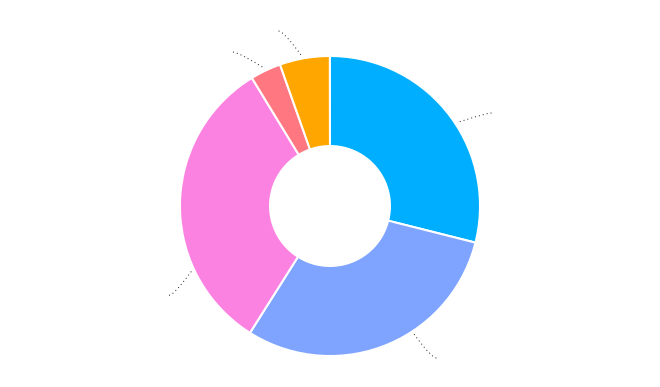

:template: survey/layout.html
:survey_year: 2024
:description: The 6th annual WTD Documentation Salary Survey was filled out by xxx documentarians in xx countries, working across dozens of industries. Check out the full results here!

.. title:: Documentation Salary Survey Results 2024

.. |icon-info| raw:: html

	<i class="fa-solid fa-circle-info"></i>

.. |icon-question| raw:: html

   <i class="fa-solid fa-circle-question"></i>

.. |25| replace:: :abbr:`25 (25th percentile - one quarter of all salaries were lower than this value)`:sup:`th`

.. |25th| replace:: 25\ :sup:`th`

.. |50| replace:: :abbr:`50 (50th percentile or median - half of all salaries were higher than this value, half were lower)`:sup:`th`

.. |50th| replace:: 50\ :sup:`th`

.. |75| replace:: :abbr:`75 (75th percentile - one quarter of all salaries were higher than this value)`:sup:`th`

.. |75th| replace:: 75\ :sup:`th`

.. |N| replace:: :abbr:`No. (Number of respondents)`

.. |%| replace:: :abbr:`% (Percentage of total respondents)`

.. raw:: html   
   
  <nav>

.. contents::
   :local:
   :depth: 3
   :backlinks: none

.. raw:: html

   
Previous Survey Results:

   <a href="/surveys/salary-survey/2023/">2023</a>
   <a href="/surveys/salary-survey/2022/">2022</a>
   <a href="/surveys/salary-survey/2021/">2021</a>
   <a href="/surveys/salary-survey/2020/">2020</a>
   <a href="/surveys/salary-survey/2019/">2019</a>
  </nav>
   
<a href="/">Home</a> &raquo; <a href="/surveys/">Salary Surveys</a> &raquo;

  <main>

.. _top:

****************************************
Documentation Salary Survey 2024 Results
****************************************

Introduction
============

.. WRITE: write intro

In a hurry? Jump straight to `Median salary`_ or `Median hourly rate`_.

.. IDEA: reorganization idea: put median salaries first, and then provide the background information that went into the median figures.

.. container:: note

   .. rubric:: |icon-info| Note on independent contractors, freelancers and the self-employed

   In this year’s survey, we asked those who filled out the survey as independent contractors, freelancers or self-employed people what term they used to describe their type of employment. More than half (63.8%) preferred the term “contractor”, with only 18.1% using “freelancer” and 10.6% using “self-employed”. In this report, we’ll use the term “contractors” to refer to this entire group.

Feedback
--------

We're always keen to hear your thoughts on this survey, so that we can continue to develop and refine it - and if you have used the data to help negotiate a raise or evaluate an offer, we would love to know about it! Email us at support@writethedocs.org with your feedback, ideas and experiences. 

Here are just some of the anonymous comments that respondents submitted in 2024:

.. pull-quote::

   I used the results of this survey to ask for a raise a few years ago. It helped enormously - I got the most significant raise I've ever received!

   I negotiated a much higher salary bracket when hiring a new team member. Other (paid) salary calibrators don't have enough info for tech writers and the 'AI' estimates are always too low.

   Data from past years helped me understand how underpaid I was at the time and gave me confidence to negotiate with the next opportunity. 

   In 2025, I expect to convert from a contractor to a full-time employee. I fully expect that I will need to negotiate my salary and will lean heavily on the WTD Salary Survey to do so.

Employment parameters
=====================

This section establishes the parameters of the respondent's employment: the type of employment, number of hours worked, job title and type of role, length of time in current position, and how focused the role is on documentation. 

Basis of employment
-------------------

.. raw:: html
   
   

What we asked (click to expand)

.. container:: question

   |icon-question| In the past year, I have worked as:

   - an employee
   - a contractor
   - both employee and contractor

   |icon-question| As an employee, currently:

   - I'm employed
   - I'm not employed

   |icon-question| As a contractor, currently:

   - I have work
   - I don't have work

.. raw:: html

   

As in previous surveys, employees made up the majority of respondents (686, or 87.9%). Contractors made up 8.5% (66 individuals).

For the first time this year, we included a third option - for respondents who had worked in the past year as both employee and contractor. 28 respondents (3.6%) chose this option, and provided both salary and contract rate data. This means that in total there are 714 employee responses and 94 contractor responses.

.. table:: Basis of employment (2019-2024)
   :widths: 40 10 10 20 10 10
   :name: tbl-2024-basis-of-employment-history
   :class: sortable

   +-------------+-----------------+-+------------------+
   | Survey year | Employees       | | Contractors      |
   +=============+=========+=======+=+==========+=======+
   |             | |N|     | |%|   | | |N|      |  |%|  |
   +-------------+---------+-------+-+----------+-------+
   | 2019        | 652     | 93.9% | | 42       |  6.1% |
   +-------------+---------+-------+-+----------+-------+
   | 2020        | 748     | 92.9% | | 57       |  7.1% |
   +-------------+---------+-------+-+----------+-------+
   | 2021        | 887     | 92.5% | | 72       |  7.5% |
   +-------------+---------+-------+-+----------+-------+
   | 2022        | 491     | 93.5% | | 34       |  6.5% |
   +-------------+---------+-------+-+----------+-------+
   | 2023        | 938     | 92.2% | | 79       |  7.8% |
   +-------------+---------+-------+-+----------+-------+
   | 2024 [*]_   | 714     | 88.4% | | 94       | 11.6% |
   +-------------+---------+-------+-+----------+-------+

.. [*] Totals include 66 respondents who worked as both employee and contractor 

As in previous years, we encouraged those currently not working to respond as though still at their previous job/contract, provided they had worked at least some of the past year. 16 employees (2.3%) and 7 contractors (10.6%) filled out the survey on this basis.

Of the 28 respondents who had worked as both employee and contractor in the past year, 15 were currently working in both capacities. 9 were currently working as employee but not contractor, 2 were currently working as contractor but not as employee, and another 2 were not currently working in either capacity. 

Hours worked 
------------

.. raw:: html
   
   

What we asked

.. container:: question

   |icon-question| How many hours per week do you work?

   - 1–20 hours
   - 21–30 hours
   - 31–40 hours
   - 41–50 hours
   - 51–60 hours
   - More than 60 hours

.. raw:: html

   

As in previous years, the majority (96%) of respondents worked traditional "full-time" hours each week: 

- 68.2% worked between 31 and 40 hours
- 24.9% worked between 41 and 50 hours
- 2.2% worked between 51 and 60 hours 

For the first time this year, no respondents reported working more than 60 hours.

4.8% of respondents worked fewer hours: 

- 2.7% worked 21 to 30 hours each week
- 2.1% worked 1 to 20 hours 

.. table:: Weekly hours worked (2024)
   :widths: 70 15 15
   :name: tbl-2024-weekly-hours-worked
   :class: std3col sortable

   +--------------+-----+-------+
   | Hours worked | |N| | |%|   |
   +==============+=====+=======+
   | 31-40        | 532 | 68.2% |
   +--------------+-----+-------+
   | 41-50        | 194 | 24.9% |
   +--------------+-----+-------+
   | 21-30        | 21  | 2.7%  |
   +--------------+-----+-------+
   | 51-60        | 17  | 2.2%  |
   +--------------+-----+-------+
   | 1-20         | 16  | 2.1%  |
   +--------------+-----+-------+

.. IDEA: split contractor hours vs employee hours?

Job title
---------

.. raw:: html
   
   

What we asked

.. container:: question

   |icon-question| What is your job title?

.. raw:: html

   

With typos fixed, abbreviations expanded, stop words removed and keyword faceting applied, 217 unique job titles could be discerned. One respondent indicated that they did not have a job title.    
      
As in previous years, the most widely used exact title was "Technical Writer", reported by 26.8% of respondents. This exact phrase appeared in 6 of the top 10 job titles, in 51 of the 217 unique job titles, and in 65.2% of all job titles.  

.. raw:: html

   
<input type="radio" id="tabA3-1" name="tabGroupA3" class="tab" checked tabindex="0"><label for="tabA3-1">Top job titles</label><input type="radio" id="tabA3-2" name="tabGroupA3" class="tab"><label for="tabA3-2">Excluding "technical writer"</label>

.. table:: Most widely-used job titles
   :widths: 70 15 15
   :name: tbl-2024-top-job-titles
   :class: std3col sortable

   +-------------------------------------+-----+-------+
   | Title                               | |N| | |%|   |
   +=====================================+=====+=======+
   | Technical Writer                    | 209 | 26.8% |
   +-------------------------------------+-----+-------+
   | Senior Technical Writer             | 158 | 20.3% |
   +-------------------------------------+-----+-------+
   | Lead Technical Writer               | 32  | 4.1%  |
   +-------------------------------------+-----+-------+
   | Staff Technical Writer              | 26  | 3.3%  |
   +-------------------------------------+-----+-------+
   | Principal Technical Writer          | 16  | 2.1%  |
   +-------------------------------------+-----+-------+
   | Documentation Manager               | 12  | 1.5%  |
   +-------------------------------------+-----+-------+
   | Technical Writer II                 | 12  | 1.5%  |
   +-------------------------------------+-----+-------+
   | Manager, Technical Writing          | 10  | 1.3%  |
   +-------------------------------------+-----+-------+
   | Technical Author                    | 8   | 1.0%  |
   +-------------------------------------+-----+-------+
   | Senior Documentation Manager        | 6   | 0.8%  |
   +-------------------------------------+-----+-------+

.. raw:: html

	

.. table:: Job titles excluding "technical writer"
   :widths: 70 15 15
   :name: tbl-2024-job-titles-excluding-technical-writer
   :class: std3col sortable

   +-------------------------------------+-----+------+
   | Title                               | |N| | |%|  |
   +=====================================+=====+======+
   | Documentation Manager               | 12  | 7.1% |
   +-------------------------------------+-----+------+
   | Documentation Specialist            | 6   | 3.6% |
   +-------------------------------------+-----+------+
   | Senior Documentation Manager        | 6   | 3.6% |
   +-------------------------------------+-----+------+
   | Content Developer                   | 5   | 3.0% |
   +-------------------------------------+-----+------+
   | Knowledge Manager                   | 5   | 3.0% |
   +-------------------------------------+-----+------+
   | Documentation Engineer              | 5   | 3.0% |
   +-------------------------------------+-----+------+
   | User Assistance Developer           | 4   | 2.4% |
   +-------------------------------------+-----+------+
   | Documentation Team Lead             | 4   | 2.4% |
   +-------------------------------------+-----+------+
   | Information Developer               | 4   | 2.4% |
   +-------------------------------------+-----+------+
   | Manager, Product Documentation      | 3   | 1.8% |
   +-------------------------------------+-----+------+

.. raw:: html

   

.. raw:: html

   <figure>
      <object role="img" aria-label="Job title word cloud" aria-describedby="figure_job-title-word-cloud_desc" type="image/svg+xml" data="/_images/2024-job-title-word-cloud.svg">
         
Word cloud showing relative weights of job title keywords

      </object> 
      <figcaption>Figure: Job title word cloud</figcaption>
   </figure>

.. IDEA: split contractor job titles vs employee job titles?

Role category
-------------

.. raw:: html
   
   

What we asked

.. container:: question

   |icon-question| How would you categorize your primary role?

   Please select one category - you will be able to select additional categories in the next question.

   - Technical writer
   - UX writer
   - Editor
   - Programmer-writer (code, sample apps etc)
   - Content producer (visual, audio, interactive content, etc)
   - Educator, trainer, instructional designer
   - Developer, engineer
   - Support
   - Developer relations, outreach
   - Translation, localization
   - Project or product manager
   - Testing, quality assurance
   - Information architecture
   - DocOps (infrastructure, tools etc)
   - Other (please specify)

   What additional roles do you also perform?

   Select multiple if appropriate, or select "None".

   - Technical writer
   - UX writer
   - Editor
   - Programmer-writer (code, sample apps etc)
   - Content producer (visual, audio, interactive content etc)
   - Educator, trainer, instructional designer
   - Developer, engineer
   - Support
   - Developer relations, outreach, advocate
   - Subject matter expert
   - Translation, localization
   - Project or product manager
   - Testing, quality assurance
   - Information architecture
   - DocOps (infrastructure, process, tools etc)
   - Manager or team leader
   - Marketing
   - Mentoring
   - Other (please specify)
   - None

.. raw:: html

   

   

Question background

.. container:: question

   |icon-info| Given that job titles and the responsibilities they entail varies widely, this question attempts to add context to the salary data by identifying the type of work being primarily performed. 
   
   We added the original version of this question - which asked respondents to broadly categorize their role into one of a limited set of options - in the second survey, in 2020. Starting in 2022, we allowed respondents to choose multiple role categories. This highlighted the breadth of talent in our community, but made comparing salaries more difficult.

   After community consultation in 2024, we split this question into two parts - one for primary role category, and one for additional roles - and expanded the number of options. 
   

.. raw:: html

   

Primary role category
~~~~~~~~~~~~~~~~~~~~~

Technical writer was by far the most widely-selected primary role category, chosen by 83.7% of respondents. Editor, DocOps and project/product manager counted for around 2% each. 

7 respondents selected "other" and provided more detail: most were all-rounders who performed a combination of roles, although "content strategist", "communications writer" and "rebranding tech" were also mentioned.

.. table:: Primary role categories
   :widths: 70 15 15
   :name: tbl-2024-top-role-categories
   :class: std3col sortable

   +------------------------------------------------+-----+-------+
   | Role category                                  | |N| | |%|   |
   +================================================+=====+=======+
   | Technical writer                               | 652 | 84.7% |
   +------------------------------------------------+-----+-------+
   | Editor                                         | 20  | 2.6%  |
   +------------------------------------------------+-----+-------+
   | DocOps                                         | 18  | 2.3%  |
   +------------------------------------------------+-----+-------+
   | Project or product manager                     | 16  | 2.1%  |
   +------------------------------------------------+-----+-------+
   | Programmer-writer                              | 12  | 1.6%  |
   +------------------------------------------------+-----+-------+
   | UX writer                                      | 10  | 1.3%  |
   +------------------------------------------------+-----+-------+
   | Support                                        | 9   | 1.2%  |
   +------------------------------------------------+-----+-------+
   | Content producer                               | 8   | 1.0%  |
   +------------------------------------------------+-----+-------+
   | Information architecture                       | 6   | 0.8%  |
   +------------------------------------------------+-----+-------+
   | Developer or engineer                          | 4   | 0.5%  |
   +------------------------------------------------+-----+-------+
   | Developer relations, outreach or advocate      | 4   | 0.5%  |
   +------------------------------------------------+-----+-------+
   | Educator, trainer, or instructional designer   | 2   | 0.3%  |
   +------------------------------------------------+-----+-------+
   | Testing, quality assurance                     | 2   | 0.3%  |
   +------------------------------------------------+-----+-------+

Additional role categories
~~~~~~~~~~~~~~~~~~~~~~~~~~

.. WRITE: additional role categories

.. TABLE: additional role categories table

.. table:: Additional role categories
   :widths: 70 15 15
   :name: tbl-2023-top-role-category-combinations
   :class: std3col sortable

   +---------------------------------------------------------+-----+-------+
   | Category                                                | |N| | |%|   |
   +=========================================================+=====+=======+
   | Writer/Creator/Editor                                   | 604 | 59.4% |
   +---------------------------------------------------------+-----+-------+
   | Writer/Creator/Editor + Management                      | 69  | 6.8%  |
   +---------------------------------------------------------+-----+-------+
   | Writer/Creator/Editor + Developer/Engineer              | 45  | 4.4%  |
   +---------------------------------------------------------+-----+-------+
   | Writer/Creator/Editor + Educator                        | 40  | 3.9%  |
   +---------------------------------------------------------+-----+-------+
   | Writer/Creator/Editor + Support                         | 24  | 2.4%  |
   +---------------------------------------------------------+-----+-------+
   | Management                                              | 23  | 2.3%  |
   +---------------------------------------------------------+-----+-------+
   | Writer/Creator/Editor + Advocate                        | 19  | 1.9%  |
   +---------------------------------------------------------+-----+-------+
   | Writer/Creator/Editor + Marketing                       | 17  | 1.7%  |
   +---------------------------------------------------------+-----+-------+
   | Writer/Creator/Editor + Other                           | 17  | 1.7%  |
   +---------------------------------------------------------+-----+-------+
   | Writer/Creator/Editor + Educator + Management           | 14  | 1.4%  |
   +---------------------------------------------------------+-----+-------+
   | Writer/Creator/Editor + Developer/Engineer + Management | 10  | 1.0%  |
   +---------------------------------------------------------+-----+-------+

Team configuration
------------------

.. raw:: html
   
   

What we asked

.. container:: question

   |icon-question| When working with other people, what is your typical role?

   Select multiple options, if appropriate.

   - A solo worker
   - Part of a team of people with the same or similar roles
   - Part of a team of people with different roles
   - Part of multiple teams
   - A manager or team leader
   - Other (please specify)

.. raw:: html

   

.. WRITE: writeup 2024 team breakdown

.. TABLE: update team breakdown table

.. table:: Team configuration
   :widths: 70 15 15
   :name: tbl-2023-team-configuration
   :class: std3col sortable

   +--------------------------------------------------------------------------------------+-----+-------+
   | Team configuration                                                                   | |N| | |%|   |
   +======================================================================================+=====+=======+
   | Team - similar roles                                                                 | 256 | 25.2% |
   +--------------------------------------------------------------------------------------+-----+-------+
   | Team - different roles                                                               | 129 | 12.7% |
   +--------------------------------------------------------------------------------------+-----+-------+
   | Solo worker                                                                          | 86  | 8.5%  |
   +--------------------------------------------------------------------------------------+-----+-------+
   | Manager or team leader                                                               | 72  | 7.1%  |
   +--------------------------------------------------------------------------------------+-----+-------+
   | Team - similar roles, Team - different roles                                         | 58  | 5.7%  |
   +--------------------------------------------------------------------------------------+-----+-------+
   | Solo worker, Team - different roles                                                  | 58  | 5.7%  |
   +--------------------------------------------------------------------------------------+-----+-------+
   | Team - similar roles, Team - different roles, Multiple teams                         | 52  | 5.1%  |
   +--------------------------------------------------------------------------------------+-----+-------+
   | Team - different roles, Multiple teams                                               | 31  | 3.0%  |
   +--------------------------------------------------------------------------------------+-----+-------+
   | Team - similar roles, Manager or team leader                                         | 31  | 3.0%  |
   +--------------------------------------------------------------------------------------+-----+-------+
   | Team - similar roles, Multiple teams                                                 | 30  | 2.9%  |
   +--------------------------------------------------------------------------------------+-----+-------+
   | Solo worker, Team - different roles, Multiple teams                                  | 29  | 2.9%  |
   +--------------------------------------------------------------------------------------+-----+-------+
   | Multiple teams                                                                       | 28  | 2.8%  |
   +--------------------------------------------------------------------------------------+-----+-------+

Length of time in current role
------------------------------

.. WRITE: writeup 2024 "time in current role"

.. raw:: html
   
   

What we asked

.. container:: question

   |icon-question| Employees: 

   How long have you worked at your current organization, in your current role?
   
   Please select the length of time for your current position at your current organization only - your total years of experience in documentation will be covered in the individual demographics section.

   If you have changed roles at the same organization, please select the length of time that you have been in your current role.

   - Less than 1 year
   - 1 year or more but less than 2 years
   - 2 years or more but less than 5 years
   - 5 years or more but less than 10 years
   - 10 years or more (please specify)

   Contractors: 

   How long have you worked as a contractor or freelancer, or been self-employed?

   This is how long you have been a contractor or freelancer only - your total years of experience in documentation will be covered later on.

   - Less than 1 year
   - 1 year or more but less than 2 years
   - 2 years or more but less than 5 years
   - 5 years or more but less than 10 years
   - 10 years or more (please specify)

.. raw:: html

   

A spike in respondents with new jobs was first seen in 2021, with 31.7% of respondents reported being in their current position at their current organization for less than a year. In 2022, this number peaked at 36.8% - when respondents with new jobs outstripped the number who had held their current position for medium or long terms. In 2023, the number of respondents with new jobs has fallen again, to 20.3% - lower than in 2020 although still well above the 9% reported in 2019. 

.. TABLE: time in current role

.. table:: Length of time in current role
   :widths: 70 15 15
   :name: tbl-2023-length-of-time-in-current-role
   :class: std3col sortable

   +-------------------------+-----+-------+
   | Years                   | |N| | |%|   |
   +=========================+=====+=======+
   | 0-1 years               | 206 | 20.3% |
   +-------------------------+-----+-------+
   | 1-2 years               | 235 | 23.1% |
   +-------------------------+-----+-------+
   | 2-5 years               | 326 | 32.1% |
   +-------------------------+-----+-------+
   | 5-10 years              | 166 | 16.3% |
   +-------------------------+-----+-------+
   | 10+ years               | 84  | 8.3%  |
   +-------------------------+-----+-------+

.. CHART: chart for "time in current role"

.. raw:: html

   <figure>
      <object role="img" aria-label="Length of time in current role at current organization" aria-describedby="figure_length-of-time-in-current-role_desc" type="image/svg+xml" data="/_images/2023-length-of-time-in-current-role.svg">
         
Length of time in current role (at current organization - employee respondents who have changed roles at the same organization were instructed to specify the length of time they had been in their current role only, not the total length of time at the organization)

      </object> 
      <figcaption>Figure: Length of time in current role</figcaption>
   </figure>

.. figure:: images/2024/2024-length-of-time-in-current-role.svg
   :class: hide

Proportion of role related to documentation
-------------------------------------------

.. raw:: html
   
   

What we asked

.. container:: question

   |icon-question| Documentation is:

   - the whole of my official job description
   - part of my official job description
   - not officially part of my job description, but I am expected to perform documentation-related tasks
   - not officially part of my job description, and I am not expected to perform documentation-related tasks, but I do anyway

   Approximately what percentage of your day-to-day tasks are documentation-related?

   - 0-25%
   - 26-50%
   - 51-75%
   - 76-100%

.. raw:: html

   

.. WRITE: write up "proportion of role"

.. TABLE: update tables for "proportion of role"

.. CHART: charts for "proportion of role"

The majority of respondents (73.5% in 2023, almost exactly the same proportion as in 2022) reported that documentation makes up both their whole official job description, and most or all of their day-to-day tasks (87.2% reporting more than 51% of their daily workload). The portion of respondents performing documentation-related tasks even though it's not part of their job description remained steady. 

.. raw:: html

   

.. raw:: html

   <input type="radio" id="tabA7-1" name="tabGroupA7" class="tab" checked tabindex="0"><label for="tabA7-1">Official role</label><input type="radio" id="tabA7-2" name="tabGroupA7" class="tab"><label for="tabA7-2">Actual role</label>

.. table:: Portion of role officially documentation-related
   :widths: 70 15 15
   :name: tbl-2023-portion-of-role-officially-documentation-related
   :class: std3col sortable

   +--------------------------------------+-----+-------+
   | Portion of role                      | |N| | |%|   |
   +======================================+=====+=======+
   | Wholly documentation                 | 747 | 73.5% |
   +--------------------------------------+-----+-------+
   | Partly documentation                 | 238 | 23.4% |
   +--------------------------------------+-----+-------+
   | Not documentation, but it's expected | 22  | 2.2%  |
   +--------------------------------------+-----+-------+
   | Not documentation, and not expected  | 10  | 1.0%  |
   +--------------------------------------+-----+-------+

.. raw:: html

   

.. table:: Portion of role actually documentation-related
   :widths: 70 15 15
   :name: tbl-2023-portion-of-role-actually-documentation-related
   :class: std3col sortable

   +--------------------------------------+-----+-------+
   | Portion of role                      | |N| | |%|   |
   +======================================+=====+=======+
   | 76-100%                              | 582 | 57.2% |
   +--------------------------------------+-----+-------+
   | 51-75%                               | 305 | 30.0% |
   +--------------------------------------+-----+-------+
   | 26-50%                               |  87 | 8.6%  |
   +--------------------------------------+-----+-------+
   | 0-25%                                | 43  | 4.2%  |
   +--------------------------------------+-----+-------+   

.. raw:: html

   

.. raw:: html

   <figure>
      <object role="img" aria-label="Portion of role officially documentation-related" aria-describedby="figure_proportion-of-role-officially-docs-related_desc" type="image/svg+xml" data="/_images/2023-portion-of-role-officially-docs-related.svg">
         
Donut chart showing what proportion of respondents official job description was documentation-related.

      </object> 
      <figcaption>Figure: Portion of role officially documentation-related</figcaption>
   </figure>

.. figure:: images/2024/2024-portion-of-role-officially-docs-related.svg
   :class: hide

.. raw:: html

   <figure>
      <object role="img" aria-label="Portion of role actually documentation-related" aria-describedby="figure_proportion-of-role-actually-docs-related_desc" type="image/svg+xml" data="/_images/2023-proportion-actual.svg">
         
Donut chart showing what proportion of respondents actual day-to-day tasks are documentation-related.

      </object> 
      <figcaption>Figure: Portion of role actually documentation-related</figcaption>
   </figure>

.. figure:: images/2024/2024-proportion-actual.svg
   :class: hide

Job changes
===========

Salary or contract earnings changes
-----------------------------------

.. raw:: html
   
   

What we asked

.. container:: question

   |icon-question| 

   Employees:

   Has your salary changed in the past year? Please do not take outside factors such as inflation, cost of living or currency conversion rates into account - just the actual amount of compensation you receive.

   - Yes - my salary increased
   - Yes - my salary decreased
   - No - my salary stayed the same

   Contractors:

   Have your total contract or freelance earnings changed in the past year?

   Please do not take outside factors such as inflation, cost of living or currency conversion rates into account - just the total amount of money you received from work you have done in the past year.

   - Yes - my earnings increased
   - Yes - my earnings decreased
   - No - my earnings stayed the same   

.. raw:: html

   

   

Question background

.. container:: question

   |icon-info| In the 2022 survey results, we saw more employee respondents in new positions - jobs that they'd held for less than one year - than in any previous survey. To better explore how the job market shake-up of the past few years is affecting our community - both employees and contractors - we added this new section for job changes in 2023.

   After community input in 2024, we changed the format of the question to ask about salary or earnings changes directly, rather than asking about changes in employment or contract status.

.. raw:: html

   

Of the 713 respondents who worked as employees in the past year, 75% reported that their salary had increased in the past year. 22.3% reported no change, and 2.7% reported a decrease.

Among the 94 respondents who had worked on a contract basis, only 46.8% reported an earnings increase. 37.2% reported no change, and 16% reported a decrease.

.. raw:: html

   

.. raw:: html

   <input type="radio" id="tabB22-1" name="tabGroupB22" class="tab" checked tabindex="0"><label for="tabB22-1">Employees</label><input type="radio" id="tabB22-2" name="tabGroupB22" class="tab"><label for="tabB22-2">Contractors</label>

.. table:: Salary change
   :widths: 70 15 15
   :name: tbl-2024-salary-change
   :class: std3col sortable

   +-------------------+------+-------+
   | Salary change     | |N|  | |%|   |
   +===================+======+=======+
   | Increase          | 535  | 75.0% |
   +-------------------+------+-------+
   | No change         | 159  | 22.3% |
   +-------------------+------+-------+
   | Decrease          | 19   | 2.7%  |
   +-------------------+------+-------+

.. raw:: html

   

.. table:: Contract earnings change
   :widths: 70 15 15
   :name: tbl-2024-earnings-change
   :class: std3col sortable

   +--------------------+-----+-------+
   | Earnings change    | |N| | |%|   |
   +====================+=====+=======+
   | Increase           | 44  | 46.8% |
   +--------------------+-----+-------+
   | No change          | 35  | 37.2% |
   +--------------------+-----+-------+
   | Decrease           | 15  | 16.0% |
   +--------------------+-----+-------+

.. raw:: html

   

Reasons for salary increase or decrease
---------------------------------------

.. raw:: html
   
   

What we asked

.. container:: question

   |icon-question| 

   Why did your salary increase? Select multiple, if appropriate.

   - I received or negotiated a raise
   - I was promoted within the same organization
   - I moved to another position within the same organization
   - I started a new position in a new organization
   - Other (please specify)

   OR

   Why did your salary decrease? Select multiple, if appropriate.

   - Organizational salary cuts
   - I was made redundant, downsized or laid off due to restructuring/bankruptcy/closure
   - My employment was terminated
   - I resigned
   - I moved to another position with the same organization at a lower salary
   - I started a new position in a new organization at a lower salary
   - Other (please specify)

   Regardless of outcome, did you attempt to negotiate a salary increase in the past year? This could be through formal or informal procedures.
   
   - yes
   - no

.. raw:: html

   

   
61.6% of employees reporting an increase in salary attributed this to a raise. 17.4% received a promotion, and 13.9% started a new position.

After examining the responses entered by those respondents who selected "Other" and provided more detail, four additional options were added to the reasons for salary increase: 

- "Adjustment" refers to a salary increase to account for inflation, cost-of-living increases, currency exchange rates or similar - rather than a performance, merit or tenure-based raise;
- "Position change" refers to a change in location, increase in responsibilities or wider scope of tasks that warranted a salary increase, without actually being a promotion or lateral move;
- "Equity" refers to the maturation of stock options or other equity-based compensation increases; and
- "Bonus" refers to a one-time or annual bonus payment that was not part of the respondent's regular salary.

50% of employees reporting a decrease in salary attributed this to starting a new position at a lower salary. 20.8% were made redundant, 12.5% experienced organizational salary cuts, and 8.3% had their employment terminated.

There was only one "other" response for salary decrease, representing a potentially common option which was added:

-  "Relocation" refers to a decrease in salary due to a move to a location with a lower cost of living or lower salary expectations.

32.8% of employees attempted to negotiate a salary increase in the past year.

.. raw:: html

   

.. raw:: html

   <input type="radio" id="tabB32-1" name="tabGroupB32" class="tab" checked tabindex="0"><label for="tabB32-1">Salary increase</label><input type="radio" id="tabB32-2" name="tabGroupB32" class="tab"><label for="tabB32-2">Salary decrease</label>

.. table:: Salary increase
   :widths: 70 15 15
   :name: tbl-2024-salary-increase
   :class: std3col sortable

   +--------------------+-----+-------+
   | Increase reason    | |N| | |%|   |
   +====================+=====+=======+
   | Raise              | 369 | 61.6% |
   +--------------------+-----+-------+
   | Promotion          | 104 | 17.4% |
   +--------------------+-----+-------+
   | New position       | 83  | 13.9% |
   +--------------------+-----+-------+
   | Adjustment         | 24  | 4.0%  |
   +--------------------+-----+-------+
   | Lateral move       | 9   | 1.5%  |
   +--------------------+-----+-------+
   | Position change    | 7   | 1.2%  |
   +--------------------+-----+-------+
   | Equity             | 2   | 0.3%  |
   +--------------------+-----+-------+
   | Bonus              | 1   | 0.2%  |
   +--------------------+-----+-------+

.. raw:: html

   

.. table:: Salary decrease
   :widths: 70 15 15
   :name: tbl-2024-salary-decrease
   :class: std3col sortable

   +-------------------------+-----+-------+
   | Decrease reason         | |N| | |%|   |
   +=========================+=====+=======+
   | New position            | 12  | 50.0% |
   +-------------------------+-----+-------+
   | Redundancy              | 5   | 20.8% |
   +-------------------------+-----+-------+
   | Organizational cuts     | 3   | 12.5% |
   +-------------------------+-----+-------+
   | Termination             | 2   | 8.3%  |
   +-------------------------+-----+-------+
   | Lateral                 | 1   | 4.2%  |
   +-------------------------+-----+-------+
   | Relocation              | 1   | 4.2%  |
   +-------------------------+-----+-------+

.. raw:: html

   

Reasons for contract earnings increase or decrease
--------------------------------------------------

.. raw:: html
   
   

What we asked

.. container:: question

   |icon-question| 

   Why did your contract or freelance earnings increase? Select multiple, if appropriate.

   - I started a new contract or freelance project (or multiple projects)
   - I raised my rate
   - I worked more hours
   - Other (please specify)

   OR 

   Why did your contract or freelance earnings decrease? Select multiple, if appropriate.

   - A contract or freelance project ended prematurely
   - A contract or freelance project ended as expected
   - My contract was not renewed or extended as expected
   - I resigned from a contract or "fired" a freelance client
   - My freelance work pipeline dried up
   - I lowered my rate
   - I worked fewer hours
   - Other (please specify)

   Regardless of outcome, did you attempt to negotiate a contract or freelance rate increase in the past year?

   - yes
   - no

.. raw:: html

   

Of those contractors reporting an increase in their earnings, 36.5% raised their rate, 34.9% started new contracts or projects, and 14.3% worked more hours.

Four additional options were added to the reasons for contract earnings increase, based on responses entered by those who selected "Other" and provided more detail:

   - "Received a raise" - as distinct from "raised rate" - applies to those contactors who work a single contract in the manner of a regular employee, and received a raise from their client/employer;
   - "Job changes" to describe taking on additional responsibility or work scope within the same contract, leading to an increase in earnings;
   - "Bonus" for a one-off additional payment; and
   - "Promotion" for a change in role or responsibility - again applying to those contractors working a single contract in the manner of a regular employee.

Of those contractors reporting a decrease in their earnings, 20% reported that their pipeline dried up, 16% worked fewer hours, and 16% had a contract end prematurely.

Two new options were added to the reasons for earnings decrease, based on responses entered by those who selected "Other":

   - "Stopgap contracting" for those who took on contracts at a lower rate as a temporary measure after losing permanent employment, while searching for a new permanent position; and
   - "Relocation" for those who moved to a location with a lower cost of living or lower salary expectations.

45.7% of contractors reported that they attempted to negotiate a rate increase in the past year.

.. raw:: html

   

.. raw:: html

   <input type="radio" id="tabB2-1" name="tabGroupB2" class="tab" checked tabindex="0"><label for="tabB2-1">Earnings increase</label><input type="radio" id="tabB2-2" name="tabGroupB2" class="tab"><label for="tabB2-2">Earnings decrease</label>

.. table:: Earnings increase
   :widths: 70 15 15
   :name: tbl-2024-earnings-increase
   :class: std3col sortable

   +-----------------------------+-----+-------+
   | Increase reason             | |N| | |%|   |
   +=============================+=====+=======+
   | Raised rate                 | 23  | 36.5% |
   +-----------------------------+-----+-------+
   | New contract(s)/project(s)  | 22  | 34.9% |
   +-----------------------------+-----+-------+
   | Worked more hours           | 9   | 14.3% |
   +-----------------------------+-----+-------+
   | Received a raise            | 5   | 7.9%  |
   +-----------------------------+-----+-------+
   | Job changes                 | 2   | 3.2%  |
   +-----------------------------+-----+-------+
   | Bonus                       | 1   | 1.6%  |
   +-----------------------------+-----+-------+
   | Promotion                   | 1   | 1.6%  |
   +-----------------------------+-----+-------+

.. raw:: html

   

.. table:: Earnings decrease
   :widths: 70 15 15
   :name: tbl-2024-earnings-decrease
   :class: std3col sortable

   +--------------------------------+-----+-------+
   | Decrease reason                | |N| | |%|   |
   +================================+=====+=======+
   | Pipeline dried up              | 5   | 20.0% |
   +--------------------------------+-----+-------+
   | Stopgap contracting            | 4   | 16.0% |
   +--------------------------------+-----+-------+
   | Fewer hours                    | 4   | 16.0% |
   +--------------------------------+-----+-------+
   | Contract ended prematurely     | 4   | 16.0% |
   +--------------------------------+-----+-------+
   | Contracted ended normally      | 2   | 8.0%  |
   +--------------------------------+-----+-------+
   | Contract not renewed           | 2   | 8.0%  |
   +--------------------------------+-----+-------+
   | Lowered rate                   | 2   | 8.0%  |
   +--------------------------------+-----+-------+
   | Resigned or fired client       | 1   | 4.0%  |
   +--------------------------------+-----+-------+
   | Relocation                     | 1   | 4.0%  |
   +--------------------------------+-----+-------+

.. raw:: html

   

Job or contract search status
-----------------------------

.. raw:: html
   
   

What we asked

.. container:: question

   |icon-question| Employees:

   What is your current job search status?

   - I'm not looking for a new position, and am not open to employment offers
   - I'm not looking for a new position, but am open to employment offers
   - I'm not looking for a new position, but expect to be within the next year
   - I'm actively looking for a new position
   - I'm actively looking for a new position and would also consider contract/freelance opportunities

   Contractors: 

   What is your current contract/freelance search status?

   - I'm not looking for new contracts or freelance projects, and am not open to offers
   - I'm not looking for new contracts or freelance projects, but am open to offers
   - I'm not looking for new contracts or freelance projects, but expect to be within the next year
   - I'm actively looking for new contracts or freelance projects
   - I'm actively looking for new contracts or freelance projects and would also consider taking a permanent position
   - I'm only contracting while I search for a permanent position

.. raw:: html  

   

The top two responses to "what is your job/contract search status" were the same for employees and contractors: 

- 46.8% of employees and 30.9% of contractors reported that they were not actively looking for new positions, but were open to offers; whereas 
- 29.5% of employees and 23.4% of contractors reported that they were not actively looking for new positions and were not open to offers.

5.5% of employees were actively looking for new positions and would also consider contract/freelance opportunities, while 18.1% of contractors were actively looking for new contracts or freelance projects and would also consider taking a permanent position. 17% of contractors were only contracting while searching for a permanent position.

.. raw:: html

   

.. raw:: html

   <input type="radio" id="tabB3-1" name="tabGroupB3" class="tab" checked><label for="tabB3-1">Employees</label><input type="radio" id="tabB3-2" name="tabGroupB3" class="tab"><label for="tabB3-2">Contractors</label>

.. table:: Current job search status - employees
   :widths: 70 15 15
   :name: tbl-2024-current-job-search-status-employees
   :class: std3col sortable

   +------------------------------------------------------------+-----+-------+
   | Search status                                              | |N| | |%|   |
   +============================================================+=====+=======+
   | Not actively looking - open to offers                      | 334 | 46.8% |
   +------------------------------------------------------------+-----+-------+
   | Not actively looking - not open to offers                  | 210 | 29.5% |
   +------------------------------------------------------------+-----+-------+
   | Actively looking                                           | 66  | 9.3%  |
   +------------------------------------------------------------+-----+-------+
   | Not looking yet, but expect to be within the next year     | 64  | 9.0%  |
   +------------------------------------------------------------+-----+-------+
   | Actively looking, would consider contract                  | 39  | 5.5%  |
   +------------------------------------------------------------+-----+-------+

.. raw:: html

   

.. table:: Current work search status - contractors
   :widths: 70 15 15
   :name: tbl-2024-current-work-search-status-contractors
   :class: std3col sortable

   +-------------------------------------------------------------+-----+-------+
   | Search status                                               | |N| | |%|   |
   +=============================================================+=====+=======+
   | Not actively looking - open to offers                       | 29  | 30.9% |
   +-------------------------------------------------------------+-----+-------+
   | Not actively looking - not open to offers                   | 22  | 23.4% |
   +-------------------------------------------------------------+-----+-------+
   | Actively looking, would consider a permanent position       | 17  | 18.1% |
   +-------------------------------------------------------------+-----+-------+
   | Only contracting while looking for a permanent position     | 16  | 17.0% |
   +-------------------------------------------------------------+-----+-------+
   | Not looking yet, but expect to be within the next year      | 6   | 6.4%  |
   +-------------------------------------------------------------+-----+-------+
   | Actively looking for new contracts/freelance projects       | 4   | 4.3%  |
   +-------------------------------------------------------------+-----+-------+

.. raw:: html

	

Job security and stability
--------------------------

.. raw:: html
   
   

What we asked

.. container:: question

   |icon-question| 
   
   Employees who are currently working:
   
   How would you characterize your current feelings of job security and stability compared to this time last year?

   - More confident
   - Around the same
   - Less confident

   Contractors who are currently working:

   How would you characterize your current feelings of contract/freelance income security and stability compared to this time last year?

   - More confident
   - Around the same
   - Less confident

.. raw:: html

   

Employees and contractors who had indicated that they were currently unemployed were not shown this question. 

Around half of all employees (51.4%) and half of all contractors (50% exactly) reported that their confidence in their job security and stability was around the same as last year. However, while 26.6% of employees reported feeling more confident, only 19.7% of contractors did. Conversely, 21.9% of employees reported feeling less confident, compared to 30.3% of contractors.

.. raw:: html

   

   <input type="radio" id="tabB553-1" name="tabGroupB553" class="tab" checked><label for="tabB553-1">Employees</label><input type="radio" id="tabB553-2" name="tabGroupB553" class="tab"><label for="tabB553-2">Contractors</label>

.. table:: Employee job security
   :widths: 70 15 15
   :name: tbl-2024-job-security-employees
   :class: std3col sortable

   +-------------------------------------------+-----+-------+
   | Job security confidence vs last year      | |N| | |%|   |
   +===========================================+=====+=======+
   | Around the same                           | 357 | 51.5% |
   +-------------------------------------------+-----+-------+
   | More confident                            | 184 | 26.6% |
   +-------------------------------------------+-----+-------+
   | Less confident                            | 152 | 21.9% |
   +-------------------------------------------+-----+-------+

.. raw:: html

   

.. table:: Contractor job security
   :widths: 70 15 15
   :name: tbl-2024-job-security-contractor
   :class: std3col sortable

   +------------------------------------------+-----+-------+
   | Job security confidence vs last year     | |N| | |%|   |
   +==========================================+=====+=======+
   | Around the same                          | 38  | 50.0% |
   +------------------------------------------+-----+-------+
   | Less confident                           | 23  | 30.3% |
   +------------------------------------------+-----+-------+
   | More confident                           | 15  | 19.7% |
   +------------------------------------------+-----+-------+

.. raw:: html

	

.. CHART: job security

Job search confidence
---------------------

.. raw:: html
   
   

What we asked

.. container:: question

   |icon-question| 

   Employees who are currently not working, or who indicated that they were actively looking for a new position:

   How would you characterize your confidence in your ability to secure a new position with terms favorable to you?

   - Very confident
   - Confident
   - Neutral
   - Not confident
   - Not confident at all

   Contractors who are currently not working, or who indicated that they were actively looking for new contracts or freelance projects:

   How would you characterize your confidence in your ability to secure a new contract or freelance project/client with terms favorable to you?

   - Very confident
   - Confident
   - Neutral
   - Not confident
   - Not confident at all

.. raw:: html
   
   

Employees and contractors were shown this question if they indicated that they were currently not working, or if they indicated that they were actively looking for a new position or new contract.

Amongst employees, job search confidence was mixed, with around a third (30%) feeling "confident" and another third (27.5%) feeling "not confident". Similarly, a smaller proportion (10%) felt "very confident" and an almost equal number (11.3%) "not confident at all".

Amongst contractors - a smaller number of respondents overall - the trend was towards the negative, with 40.9% feeling "not confident" and 13.6% feeling "not confident at all". 

.. raw:: html

   

   <input type="radio" id="tabB563-1" name="tabGroupB563" class="tab" checked><label for="tabB563-1">Employees</label><input type="radio" id="tabB563-2" name="tabGroupB563" class="tab"><label for="tabB563-2">Contractors</label>

.. table:: Employee job search confidence
   :widths: 70 15 15
   :name: tbl-2024-job-search-confidence-employees
   :class: std3col sortable

   +---------------------------+-----+-------+
   | Job search confidence     | |N| | |%|   |
   +===========================+=====+=======+
   | Confident                 | 24  | 30.0% |
   +---------------------------+-----+-------+
   | Not confident             | 22  | 27.5% |
   +---------------------------+-----+-------+
   | Neutral                   | 17  | 21.3% |
   +---------------------------+-----+-------+
   | Not confident at all      | 9   | 11.3% |
   +---------------------------+-----+-------+
   | Very confident            | 8   | 10.0% |
   +---------------------------+-----+-------+

.. raw:: html

   

.. table:: Contractor job search confidence
   :widths: 70 15 15
   :name: tbl-2024-job-search-confidence-contractor
   :class: std3col sortable

   +----------------------------+-----+-------+
   | Contract search confidence | |N| | |%|   |
   +============================+=====+=======+
   | Not confident              | 9   | 40.9% |
   +----------------------------+-----+-------+
   | Very confident             | 4   | 18.2% |
   +----------------------------+-----+-------+
   | Neutral                    | 3   | 13.6% |
   +----------------------------+-----+-------+
   | Not confident at all       | 3   | 13.6% |
   +----------------------------+-----+-------+
   | Confident                  | 3   | 13.6% |
   +----------------------------+-----+-------+

.. raw:: html

	

.. CHART: job search confidence

Workplace
=========

The questions in this section relate to respondents' workplace: whether they work from home, from an office, or a combination, and how they feel about that. We were also interested in how the much-discussed "back to the office" mandates have affected our community. 

.. container:: note

   .. rubric:: |icon-info| Note on use of the term "remote"

   In previous surveys, this was some confusion as to the definition of the term "remote", as many people suddenly forced to work from home due to the pandemic did not think of that situation as working remotely. To clarify, we consider the word "remote" to have the same meaning as "work from home" or "home office".

Work location
-------------

.. raw:: html
   
   

What we asked

.. container:: question

   |icon-question| What is your current work location?

   - I am required to be on-site full time
   - I am on-site full time, but it is not required
   - I am partially on-site, and partially remote (hybrid)
   - I am fully remote, but it is by choice (i.e. an office location is available to me)
   - I am fully remote, and it is required (i.e. no office location is available to me)

   How do you feel about your work location?

   - Very negative
   - Negative
   - Neutral
   - Positive
   - Very Positive

.. raw:: html

   

.. WRITE: writeup findings for work location

The majority of respondents reported working remotely, with the number doing so by choice (36.2%) higher than the number required to do so by their employer (29%). 

.. TABLE: work location (Looker Studio file exists)

.. table:: Work location
   :widths: 70 15 15
   :name: tbl-2023-work-location
   :class: std3col sortable

   +------------------------+-----+-------+
   | Work location          | |N| | |%|   |
   +========================+=====+=======+
   | Remote (not required)  | 368 | 36.2% |
   +------------------------+-----+-------+
   | Remote (required)      | 295 | 29.0% |
   +------------------------+-----+-------+
   | Hybrid                 | 287 | 28.2% |
   +------------------------+-----+-------+
   | On-site (not required) | 35  | 3.4%  |
   +------------------------+-----+-------+
   | On-site (required)     | 32  | 3.1%  |
   +------------------------+-----+-------+

.. CHART: work location

.. raw:: html

   <figure>
      <object role="img" aria-label="Work location" aria-describedby="figure_work-location_desc" type="image/svg+xml" data="/_images/2023-work-location.svg">
         
Donut chart showing current work location - remote, hybrid, on-site - and whether the location is their choice or their employer's.

      </object> 
      <figcaption>Figure: Work location</figcaption>
   </figure>

.. WRITE: writeup findings for feelings about work location

The majority of respondents (80.8%) reported feeling "positive" about their work location, with 51.8% feeling "very positive". 

.. TABLE: feelings about work location

.. table:: Feelings about work location
   :widths: 70 15 15
   :name: tbl-2023-feelings-about-work-location
   :class: std3col sortable

   +------------------------------+-----+-------+
   | Feelings                     | |N| | |%|   |
   +==============================+=====+=======+
   | Very positive                | 527 | 51.8% |
   +------------------------------+-----+-------+
   | Positive                     | 295 | 29.0% |
   +------------------------------+-----+-------+
   | Neutral                      | 134 | 13.2% |
   +------------------------------+-----+-------+
   | Negative                     | 51  | 5.0%  |
   +------------------------------+-----+-------+
   | Very negative                | 10  | 1.0%  |
   +------------------------------+-----+-------+

.. CHART: feelings about work location

.. raw:: html

   <figure>
      <object role="img" aria-label="Work location" aria-describedby="figure_feelings-about-work-location_desc" type="image/svg+xml" data="/_images/2023-feelings-about-work-location.svg">
         
Donut chart showing respondents feelings about their work location.

      </object> 
      <figcaption>Figure: Feelings about work location</figcaption>
   </figure>

.. figure:: images/2024/2024-feelings-about-work-location.svg
   :class: hide

"Return to office" (RTO) mandates
---------------------------------

.. raw:: html
   
   

What we asked

.. container:: question

   |icon-question|  In the past year, has your organization (or for contractors, any organization that you work for) implemented an RTO (return to office) policy - requesting or requiring that remote or "work from home" employees/contractors return to working on-site?

   - Yes, it's required all of the time
   - Yes, it's required but only part of the time (hybrid work is ok)
   - Yes, it's encouraged but not mandatory
   - Yes, but only for some roles
   - No, remote work is still allowed/encouraged/required
   - No, my position was always remote-only
   - No, my position was always hybrid
   - No, my position was always on-site only
   - I don't know, or it doesn't apply to the kind of work I do

   How do you feel about your organization's "return to office" policy?

   - Very negative
   - Negative
   - Neutral
   - Positive
   - Very Positive

.. raw:: html

   

.. WRITE: "return to office" mandates

55.1% of respondents reported that they have not been affected by "return to office" (RTO) policies. 42.8% have been affected, with only 2.2% unsure. 

Of those that were not affected, 26.2% - the largest segment overall - reported that remote work was still allowed, encouraged or required, with another 23.4% stating that their position was always remote-only. 

For those that have been affected, most reported that a hybrid model was being mandated (24.2% overall).  

.. TABLE: "return to office" mandates

.. raw:: html

   
<input type="radio" id="tabC3-1" name="tabGroupC3" class="tab" checked><label for="tabC3-1">Not affected</label><input type="radio" id="tabC3-2" name="tabGroupC3" class="tab"><label for="tabC3-2">Affected</label>

.. table:: Not affected by mandates
   :widths: 70 15 15
   :name: tbl-2023-return-to-the-office-mandates-not-affected
   :class: std3col sortable

   +------------------------------------------------------+-----+-------+
   | RTO Status                                           | |N| | |%|   |
   +======================================================+=====+=======+
   | No, remote work is still allowed/encouraged/required | 266 | 47.5% |
   +------------------------------------------------------+-----+-------+
   | No, my position was always remote-only               | 238 | 42.5% |
   +------------------------------------------------------+-----+-------+
   | No, my position was always hybrid                    | 37  | 6.6%  |
   +------------------------------------------------------+-----+-------+
   | No, my position was always on-site only              | 19  | 3.4%  |
   +------------------------------------------------------+-----+-------+

.. raw:: html

	

.. table:: Affected by mandates
   :widths: 70 15 15
   :name: tbl-2023-return-to-the-office-mandates-affected
   :class: std3col sortable

   +------------------------------------------------------------------+-----+-------+
   | RTO Status                                                       | |N| | |%|   |
   +==================================================================+=====+=======+
   | Yes, it's required but only part of the time (hybrid work is ok) | 246 | 56.6% |
   +------------------------------------------------------------------+-----+-------+
   | Yes, it's encouraged but not mandatory                           | 102 | 23.4% |
   +------------------------------------------------------------------+-----+-------+
   | Yes, but only for some roles                                     | 64  | 14.7% |
   +------------------------------------------------------------------+-----+-------+
   | Yes, it's required all of the time                               | 23  | 5.3%  |
   +------------------------------------------------------------------+-----+-------+

.. raw:: html

   

.. WRITE: feelings about "return to office" mandates

Those who reported being affected by an RTO policy were asked about their feelings on the situation. 

Those who were required to return to the office on a part-time basis were quite evenly split between neutral (32.9%), negative (26%) and very negative (22%). Those who were positive (14.6%) or very positive (4.5%) were in the minority.

Those who reported that a return was being encouraged by not required were less negative overall - 41% reported "neutral", with the remainder split evenly between positive and negative. 

Those affected by a full time RTO mandate felt predominantly negative, with only 3 individuals reporting positive feelings. 

Preferred work location
-----------------------

.. raw:: html
   
   

What we asked

.. container:: question

   |icon-question| Regardless of the policy at your current organization or your current situation, what is your preferred work location?

   - I prefer to work on-site on a full-time basis
   - I prefer to work remotely/from home on a full-time basis
   - I prefer the flexibility of a hybrid work location (partly on-site, partly remote)
   - I have no strong preference / it depends on the situation

.. raw:: html

   

.. WRITE: preferred work location

Regardless of their current situation, 58% of all respondents said that their preferred work location is remote. Another 38.2% favored a hybrid model (some days in the office, some days working from home or another location). Only 2.6% said they preferred working on-site at their employer's office, and 1.3% stated no preference. 

.. TABLE: preferred work location

.. table:: Preferred work location
   :widths: 70 15 15
   :name: tbl-2023-preferred-work-location
   :class: std3col sortable

   +-------------------------+-----+-------+
   | Preferred work location | |N| | |%|   |
   +=========================+=====+=======+
   | Remote                  | 590 | 58.0% |
   +-------------------------+-----+-------+
   | Hybrid                  | 388 | 38.2% |
   +-------------------------+-----+-------+
   | On-site                 | 26  | 2.6%  |
   +-------------------------+-----+-------+
   | No preference           | 13  | 1.3%  |
   +-------------------------+-----+-------+

.. CHART: preferred work location

Employee salary, benefits and satisfaction
==========================================

.. WRITE: "employee salary, benefits and satisfaction" intro

To protect the privacy of our community, we do not publish median salary figures for any region or category with less than 10 respondents. In previous years, this has meant that median salaries could only be given for a few regions and countries, and a handful of US states.     

With this year's survey amassing the highest number of submissions yet, we can now provide a more extensive range of salary breakdowns. Alongside the baseline data for Africa, which encompasses respondents from South Africa, Kenya, and Nigeria, we have gathered enough data to publish median salaries (|50th| percentile) for 15 individual countries, 17 US states, 3 Canadian provinces (including separate figures for each province's largest city), and 3 Australian states.

In regions or categories meet the minimum threshold of 30 respondents, we're also providing the |25th| percentile (the value below which 25% of the data falls) and |75th| percentile (the value below which 75% of the data falls).

Currency
--------

.. WRITE: add one "what we asked" section which includes all salary parts

.. WRITE: currency

.. raw:: html
   
   

What we asked

.. container:: question

   |icon-question| What currency are you paid in? 

.. raw:: html

   

Employee respondents reported being paid in 26 different currencies. To make comparisons possible, all currencies were converted to USD using mid-market exchange rates, averaged for the whole of 2023.

.. TABLE: currency

.. table:: Currencies and exchange rates - employees
   :widths: 55 10 10 10 15
   :name: tbl-2023-currencies-employees
   :class: std3col sortable

   +--------------------------------------+------+---------+
   | Currency (code)                      | |N|  | Rate    |
   +======================================+======+=========+
   | United States Dollar (USD)           | 487  | 1.00000 |
   +--------------------------------------+------+---------+
   | Euro (EUR)                           | 147  | 1.08396 |
   +--------------------------------------+------+---------+
   | Canadian Dollar (CAD)                | 73   | 0.74068 |
   +--------------------------------------+------+---------+
   | British Pound Sterling (GBP)         | 55   | 1.25209 |
   +--------------------------------------+------+---------+
   | Australian Dollar (AUD)              | 41   | 0.65884 |
   +--------------------------------------+------+---------+
   | Indian Rupee (INR)                   | 27   | 0.01209 |
   +--------------------------------------+------+---------+
   | Romanian Leu (RON)                   | 17   | 0.23000 |
   +--------------------------------------+------+---------+
   | Polish Zloty (PLN)                   | 13   | 0.24198 |
   +--------------------------------------+------+---------+
   | Russian Ruble (RUB)                  | 12   | 0.01190 |
   +--------------------------------------+------+---------+
   | Israeli New Shekel (NIS)             | 12   | 0.26921 |
   +--------------------------------------+------+---------+
   | Czech Koruna (CZK)                   | 8    | 0.04484 |
   +--------------------------------------+------+---------+
   | South African Rand (ZAR)             | 7    | 0.05359 |
   +--------------------------------------+------+---------+
   | Ukrainian Hryvnia (UAH)              | 6    | 0.02720 |
   +--------------------------------------+------+---------+
   | Mexican Peso (MXN)                   | 5    | 0.05734 |
   +--------------------------------------+------+---------+
   | Japanese Yen (JPY)                   | 5    | 0.00700 |
   +--------------------------------------+------+---------+
   | Brazilian Real (BRL)                 | 4    | 0.20030 |
   +--------------------------------------+------+---------+
   | New Zealand Dollar (NZD)             | 4    | 0.61072 |
   +--------------------------------------+------+---------+
   | Swedish Krona (SEK)                  | 4    | 0.09427 |
   +--------------------------------------+------+---------+
   | Swiss Franc (CHF)                    | 4    | 1.12614 |
   +--------------------------------------+------+---------+
   | Norwegian Krone (NOK)                | 1    | 0.09413 |
   +--------------------------------------+------+---------+
   | United Arab Emirates Dirham (AED)    | 1    | 0.27227 |
   +--------------------------------------+------+---------+
   | Indonesian Rupiah (IDR)              | 1    | 0.00007 |
   +--------------------------------------+------+---------+
   | Kenyan Shilling (KES)                | 1    | 0.00720 |
   +--------------------------------------+------+---------+
   | Thai Baht (THB)                      | 1    | 0.02851 |
   +--------------------------------------+------+---------+
   | Singapore Dollar (SGD)               | 1    | 0.74368 |
   +--------------------------------------+------+---------+
   | Danish Krone (DKK)                   | 1    | 0.14532 |
   +--------------------------------------+------+---------+

Pay interval
------------

.. raw:: html
   
   

What we asked

.. container:: question

   |icon-question| Would you prefer to enter your salary as a yearly or monthly amount?

.. raw:: html

   

In some locations, it is customary to discuss salary as a yearly figure, while in other it is more common to talk about monthly salaries. Respondents were asked to specify if they were entering a yearly or monthly figure, and all monthly salaries were multiplied by 12 to allow for comparison. In total, 81.1% of employee respondents chose to enter their salary as a yearly figure, with 18.9% choosing monthly. 

Median salary
-------------

.. raw:: html
   
   

What we asked

.. container:: question

   |icon-question| What is your total (gross) salary (including tax)? Note: If your total compensation is made up of a base salary and significant bonus, equity or commission payments, please enter your total compensation here (or an average, if it fluctuates).

.. raw:: html

   

As in previous years, salaries for those working part-time hours (less than 30 per week) have been omitted from the figures in this section. The median salaries are based on 922 full-time employee respondents.  

.. IDEA: create view excluding non-full-time employees

.. WRITE: update definition of percentile values section

.. container:: note

   .. rubric:: |icon-info| Definition of percentile values

   Previous survey results have only reported the median salary - the number in the middle of the range, sometimes referred to as the |50th| percentile. Due to the increase in numbers and finer-grained location data, we're able this year to also publish figures for the |25th| and |75th| percentile figures, for regions where there are more than 30 respondents. 

   In the following tables, the following definitions apply:

   - |25th| percentile: one quarter of all respondents earned less, three quarters earned more
   - |50th| percentile (median): half of all respondents earned more, half earned less
   - |75th| percentile: one quarter of all respondents earned more, three  quarters earned less

Median salary by respondent region
~~~~~~~~~~~~~~~~~~~~~~~~~~~~~~~~~~

Given the range of socio-economic differences in the countries in the survey results, median salary figures broken down by country of residence of employee is more useful than overall median salary.

.. WRITE: update privacy section with excluded countries

.. container:: note

   .. rubric:: |icon-info| Privacy and salary information

   In order to protect the privacy of respondents, median salaries are not shown for any country or region with less than 10 respondents. Countries with respondents in 2024 that are excluded by this condition are:

   - North America: Puerto Rico, St Kitts & Nevis, Mexico
   - Europe: Spain, Czech Republic, Finland, Italy, Switzerland, Croatia, Sweden, Serbia, Austria, Slovenia, Estonia, Greece, Belgium, Lithuania, Bulgaria, Norway, Turkey, Cyprus, Montenegro, Denmark
   - Oceania: New Zealand
   - Asia: Japan, Singapore, Thailand, Indonesia 
   - Middle East: United Arab Emirates, Lebanon
   - Africa: South Africa, Kenya, Nigeria 
   - South America: Brazil, Argentina 

.. TABLE: update table for median salary by respondent region 

.. table:: Salary (USD) by respondent region
   :name: tbl-2023-salary-by-respondent-region
   :class: medians sortable

   +-------------------------+-------------+--------------+--------------+
   | Region (|N|)            | |25|        |  |50|        | |75|         |
   +=========================+=============+==============+==============+
   | **Worldwide** (922)     | **$58,534** | **$82,418**  | **$118,571** |
   +-------------------------+-------------+--------------+--------------+
   | **North America** (526) | **$80,000** | **$105,000** | **$140,000** |
   +-------------------------+-------------+--------------+--------------+
   | - USA (444)             |     $86,962 |     $114,000 |     $147,000 |
   +-------------------------+-------------+--------------+--------------+
   | - Canada (74)           |     $62,217 |      $73,050 |      $92,215 |
   +-------------------------+-------------+--------------+--------------+
   | **Europe** (287)        | **$37,749** |  **$56,580** |  **$75,739** |
   +-------------------------+-------------+--------------+--------------+
   | - United Kingdom (54)   |     $56,203 |      $72,058 |      $86,660 |
   +-------------------------+-------------+--------------+--------------+
   | - Ukraine (36)          |     $21,636 |      $28,525 |      $40,725 |
   +-------------------------+-------------+--------------+--------------+
   | - Germany (32)          |     $64,496 |      $76,473 |      $90,240 |
   +-------------------------+-------------+--------------+--------------+
   | - France (21)           |             |      $45,526 |              |
   +-------------------------+-------------+--------------+--------------+
   | - Poland (18)           |             |      $38,475 |              |
   +-------------------------+-------------+--------------+--------------+
   | - Romania (17)          |             |      $39,631 |              |
   +-------------------------+-------------+--------------+--------------+
   | - Ireland (12)          |             |      $81,189 |              |
   +-------------------------+-------------+--------------+--------------+
   | - Portugal (11)         |             |      $66,159 |              |
   +-------------------------+-------------+--------------+--------------+
   | - Russia (11)           |             |      $21,420 |              |
   +-------------------------+-------------+--------------+--------------+
   | - Netherlands (11)      |             |      $78,045 |              |
   +-------------------------+-------------+--------------+--------------+
   | **Oceania** (43)        | **$72,474** |  **$85,648** | **$102,450** |
   +-------------------------+-------------+--------------+--------------+
   | - Australia (39)        |     $72,474 |      $88,944 |     $103,109 |
   +-------------------------+-------------+--------------+--------------+
   | **Asia** (36)           | **$15,128** |  **$30,225** |  **$48,693** |
   +-------------------------+-------------+--------------+--------------+
   | - India (28)            |             |      $22,106 |              |
   +-------------------------+-------------+--------------+--------------+
   | **Middle East** (14)    | **--**      |  **$95,301** | **--**       |
   +-------------------------+-------------+--------------+--------------+
   | - Israel (12)           |             |      $96,916 |              |
   +-------------------------+-------------+--------------+--------------+
   | **Africa** (10)         | **--**      |  **$45,019** | **--**       |
   +-------------------------+-------------+--------------+--------------+

Median salary by respondent region - further breakdowns
~~~~~~~~~~~~~~~~~~~~~~~~~~~~~~~~~~~~~~~~~~~~~~~~~~~~~~~

.. TABLE: median salary by respondent region - further breakdowns 

Respondent numbers allow some additional breakdowns by US state, Candian province and Australian state, as well as a handful of North American cities. 

.. raw:: html

   
<input type="radio" id="tabD3-1" name="tabGroupD3" class="tab" checked><label for="tabD3-1">United States</label><input type="radio" id="tabD3-2" name="tabGroupD3" class="tab"><label for="tabD3-2">Canada</label><input type="radio" id="tabD3-3" name="tabGroupD3" class="tab"><label for="tabD3-3">Australia</label>

.. table:: Salary (USD) by respondent region - USA
   :name: tbl-2023-salary-by-respondent-region-usa
   :class: medians sortable

   +---------------------+-----------+----------+-----------+
   | State (|N|)         | |25|      | |50|     | |75|      |
   +=====================+===========+==========+===========+
   | California (65)     |  $100,995 | $149,347 |  $180,000 |
   +---------------------+-----------+----------+-----------+
   | - San Franciso (10) |           | $200,000 |           |
   +---------------------+-----------+----------+-----------+
   | Texas (41)          |   $95,000 | $115,300 |  $140,000 |
   +---------------------+-----------+----------+-----------+
   | - Austin (19)       |           | $128,623 |           |
   +---------------------+-----------+----------+-----------+
   | North Carolina (27) |           | $114,000 |           |
   +---------------------+-----------+----------+-----------+
   | Washington (25)     |           | $150,000 |           |
   +---------------------+-----------+----------+-----------+
   | - Seattle (11)      |           | $170,000 |           |
   +---------------------+-----------+----------+-----------+
   | Oregon (25)         |           | $115,448 |           |
   +---------------------+-----------+----------+-----------+
   | - Portland (17)     |           | $104,000 |           |
   +---------------------+-----------+----------+-----------+
   | Colorado (23)       |           | $133,000 |           |
   +---------------------+-----------+----------+-----------+
   | Florida (20)        |           |  $90,500 |           |
   +---------------------+-----------+----------+-----------+
   | New York (20)       |           | $104,250 |           |
   +---------------------+-----------+----------+-----------+
   | Massachusetts (19)  |           | $133,034 |           |
   +---------------------+-----------+----------+-----------+
   | Minnesota (15)      |           | $100,000 |           |
   +---------------------+-----------+----------+-----------+
   | Michigan (15)       |           |  $88,000 |           |
   +---------------------+-----------+----------+-----------+
   | Pennsylvania (15)   |           | $114,000 |           |
   +---------------------+-----------+----------+-----------+
   | Wisconsin (14)      |           | $100,375 |           |
   +---------------------+-----------+----------+-----------+
   | Virginia (14)       |           |  $89,750 |           |
   +---------------------+-----------+----------+-----------+
   | Georgia (12)        |           | $115,000 |           |
   +---------------------+-----------+----------+-----------+
   | Ohio (12)           |           | $107,050 |           |
   +---------------------+-----------+----------+-----------+
   | Utah (11)           |           | $108,819 |           |
   +---------------------+-----------+----------+-----------+

.. raw:: html

   

.. table:: Salary (USD) by respondent region - Canada
   :name: tbl-2023-salary-by-respondent-region-canada
   :class: medians sortable

   +-----------------------+-----------+---------+-----------+
   | Province (|N|)        | |25|      | |50|    | |75|      |
   +=======================+===========+=========+===========+
   | Ontario (37)          |   $62,217 | $70,365 |   $85,179 |
   +-----------------------+-----------+---------+-----------+
   |  - Toronto (15)       |           | $70,365 |           |
   +-----------------------+-----------+---------+-----------+
   | Quebec (13)           |           | $67,798 |           |
   +-----------------------+-----------+---------+-----------+
   | - Montreal (10)       |           | $78,764 |           |
   +-----------------------+-----------+---------+-----------+
   | British Columbia (12) |           | $90,734 |           |
   +-----------------------+-----------+---------+-----------+
   | - Vancouver (10)      |           | $85,179 |           |
   +-----------------------+-----------+---------+-----------+

.. raw:: html

   

.. table:: Salary (USD) by respondent region - Australia
   :name: tbl-2023-salary-by-respondent-region-australia
   :class: std3col sortable

   +-----------------+-----+--------------+
   | State           | |N| | |50|         |
   +=================+=====+==============+
   | Queensland      | 12  | $84,990      |
   +-----------------+-----+--------------+
   | New South Wales | 12  | $94,570      |
   +-----------------+-----+--------------+
   | Victoria        | 11  | $93,556      |
   +-----------------+-----+--------------+

.. raw:: html

   

Median salary by gender identity
~~~~~~~~~~~~~~~~~~~~~~~~~~~~~~~~

.. WRITE: median salary by gender identity  

Due to numbers, we are only able to break down salary by gender identity for women (59.9% of all respondents) and men (34.7% of all respondents). In almost every region, men earned more than women, by as much as 76% in Asia - although with such a small sample size that is unlikely to be truly representative. 

The only region where the median for women was higher was North America overall - but even here, the 75th percentile salary was higher for men, and when looking at the two largest countries in that region (the United States and Canada) men were paid more overall. 

.. TABLE: median salary by gender identity

.. raw:: html

   
<input type="radio" id="tabD33-1" name="tabGroupD33" class="tab" checked><label for="tabD33-1">Women</label><input type="radio" id="tabD33-2" name="tabGroupD33" class="tab"><label for="tabD33-2">Men</label><input type="radio" id="tabD33-3" name="tabGroupD33" class="tab"><label for="tabD33-3">Comparison</label>

.. table:: Salary (USD) by gender identity - women
   :name: tbl-2023-salary-by-gender-identity-women
   :class: medians sortable

   +-------------------------+-------------+--------------+--------------+
   | Region (|N|)            | |25|        | |50|         | |75|         |
   +=========================+=============+==============+==============+
   | **Worldwide** (544)     | **$55,060** | **$80,000**  | **$114,250** |
   +-------------------------+-------------+--------------+--------------+
   | **North America** (310) | **$80,000** | **$107,338** | **$140,000** |
   +-------------------------+-------------+--------------+--------------+
   | - United States (262)   |     $86,512 |     $112,700 |     $144,750 |
   +-------------------------+-------------+--------------+--------------+
   | - Canada (43)           |     $62,588 |      $70,365 |      $96,289 |
   +-------------------------+-------------+--------------+--------------+
   | **Europe** (179)        | **$34,063** | **$52,030**  | **$71,682**  |
   +-------------------------+-------------+--------------+--------------+
   | - United Kingdom (34)   |     $57,283 |      $72,058 |      $81,073 |
   +-------------------------+-------------+--------------+--------------+
   | - Ukraine (28)          |             |      $27,081 |              |
   +-------------------------+-------------+--------------+--------------+
   | - Germany (20)          |             |      $74,251 |              |
   +-------------------------+-------------+--------------+--------------+
   | - France (15)           |             |      $45,526 |              |
   +-------------------------+-------------+--------------+--------------+
   | - Romania (15)          |             |      $38,502 |              |
   +-------------------------+-------------+--------------+--------------+
   | - Poland (11)           |             |      $32,519 |              |
   +-------------------------+-------------+--------------+--------------+
   | - Ireland (10)          |             |      $80,051 |              |
   +-------------------------+-------------+--------------+--------------+
   | **Oceania** (21)        | **--**      | **$80,612**  | **--**       |
   +-------------------------+-------------+--------------+--------------+
   | - Australia (17)        |             |      $82,356 |              |
   +-------------------------+-------------+--------------+--------------+
   | **Asia** (20)           | **--**      | **$21,762**  | **--**       |
   +-------------------------+-------------+--------------+--------------+
   | - India (15)            |             |      $19,344 |              |
   +-------------------------+-------------+--------------+--------------+

.. raw:: html

   

.. table:: Salary (USD) by gender identity - men
   :name: tbl-2023-salary-by-gender-identity-men
   :class: medians sortable

   +-------------------------+-------------+--------------+--------------+
   | Region (|N|)            | |25|        | |50|         | |75|         |
   +=========================+=============+==============+==============+
   | **Worldwide** (326)     | **$62,671** | **$90,000**  | **$128,840** |
   +-------------------------+-------------+--------------+--------------+
   | **North America** (185) | **$80,000** | **$105,000** | **$147,665** |
   +-------------------------+-------------+--------------+--------------+
   | - United States (156)   |     $87,369 |     $114,000 |     $150,000 |
   +-------------------------+-------------+--------------+--------------+
   | - Canada (26)           |             |      $77,772 |              |
   +-------------------------+-------------+--------------+--------------+
   | **Europe** (94)         | **$43,832** | **$65,355**  | **$91,762**  |
   +-------------------------+-------------+--------------+--------------+
   | - United Kingdom (18)   |             |      $74,124 |              |
   +-------------------------+-------------+--------------+--------------+
   | - Germany (11)          |             |      $80,755 |              |
   +-------------------------+-------------+--------------+--------------+
   | **Oceania** (19)        | **--**      | **$93,556**  | **--**       |
   +-------------------------+-------------+--------------+--------------+
   | - Australia (19)        |             | $93,556      |              |
   +-------------------------+-------------+--------------+--------------+
   | **Asia** (13)           | **--**      | **$38,495**  | **--**       |
   +-------------------------+-------------+--------------+--------------+
   | - India (10)            |             |      $33,489 |              |
   +-------------------------+-------------+--------------+--------------+

.. raw:: html

   

.. table:: Median salary (USD) by gender identity - comparison
   :name: tbl-2023-salary-by-gender-identity-comparison
   :class: medians sortable

   +----------------------+--------------+--------------+-----------+
   | Region               |    Women     |      Men     |  Diff     |
   +======================+==============+==============+===========+
   | **Worldwide**        |  **$80,000** |  **$90,000** | **12.5%** |
   +----------------------+--------------+--------------+-----------+
   | **North America**    | **$107,338** | **$105,000** | **-2.2%** |
   +----------------------+--------------+--------------+-----------+
   | - United States      | $112,700     | $114,000     |  1.2%     |
   +----------------------+--------------+--------------+-----------+
   | - Canada             |  $70,365     |  $77,772     | 10.5%     |
   +----------------------+--------------+--------------+-----------+
   | **Europe**           |  **$52,030** |  **$65,355** | **25.6%** |
   +----------------------+--------------+--------------+-----------+
   | - United Kingdom     |  $72,058     |  $74,124     |  2.9%     |
   +----------------------+--------------+--------------+-----------+
   | - Germany            |  $74,251     |  $80,755     |  8.8%     |
   +----------------------+--------------+--------------+-----------+
   | **Oceania**          |  **$80,612** |  **$93,556** | **16.0%** |
   +----------------------+--------------+--------------+-----------+
   | - Australia          |  $82,356     |  $93,556     | 13.6%     |
   +----------------------+--------------+--------------+-----------+
   | **Asia**             |  **$21,762** |  **$38,495** | **76.9%** |
   +----------------------+--------------+--------------+-----------+
   | - India              |  $19,344     |  $33,489     | 73.1%     |
   +----------------------+--------------+--------------+-----------+

.. raw:: html

   

Median salary by years of experience
~~~~~~~~~~~~~~~~~~~~~~~~~~~~~~~~~~~~

.. TABLE: median salary by years of experience

.. raw:: html

   
<input type="radio" id="tabD43-1" name="tabGroupD43" class="tab" checked><label for="tabD43-1">0-2 years</label><input type="radio" id="tabD43-2" name="tabGroupD43" class="tab"><label for="tabD43-2">2-5 years</label><input type="radio" id="tabD43-3" name="tabGroupD43" class="tab"><label for="tabD43-3">5-10 years</label>

.. table:: Salary (USD) by experience - 0-2 years
   :name: tbl-2023-salary-by-experience-0-2yrs
   :class: medians sortable

   +----------------------+-----------+--------------+-----------+
   | Region (|N|)         | |25|      |       |50|   | |75|      |
   +======================+===========+==============+===========+
   | Worldwide (78)       |   $39,028 |      $60,000 |   $75,251 |
   +----------------------+-----------+--------------+-----------+
   | North America (43)   |   $60,000 |      $70,000 |   $86,525 |
   +----------------------+-----------+--------------+-----------+
   | - United States (38) |   $60,400 |      $72,400 |   $88,263 |
   +----------------------+-----------+--------------+-----------+
   | Europe (28)          |           |      $39,377 |           |
   +----------------------+-----------+--------------+-----------+

.. raw:: html

   

.. table:: Salary (USD) by experience - 2-5 years
   :name: tbl-2023-salary-by-experience-2-5yrs
   :class: medians sortable

   +----------------------+-----------+---------+-----------+
   | Region (|N|)         | |25|      | |50|    | |75|      |
   +======================+===========+=========+===========+
   | Worldwide (186)      |   $39,309 | $65,109 |   $85,750 |
   +----------------------+-----------+---------+-----------+
   | North America (84)   |   $68,786 | $81,695 |  $100,000 |
   +----------------------+-----------+---------+-----------+
   | - United States (63) |   $78,205 | $90,000 |  $109,500 |
   +----------------------+-----------+---------+-----------+
   | - Canada (18)        |           | $64,069 |           |
   +----------------------+-----------+---------+-----------+
   | Europe (85)          |   $32,519 | $45,526 |   $62,653 |
   +----------------------+-----------+---------+-----------+
   | - Ukraine (17)       |           | $27,316 |           |
   +----------------------+-----------+---------+-----------+
   | - Germany (11)       |           | $72,625 |           |
   +----------------------+-----------+---------+-----------+
   | - Poland (11)        |           | $34,845 |           |
   +----------------------+-----------+---------+-----------+

.. raw:: html

   

.. table:: Salary (USD) by experience - 5-10 years
   :name: tbl-2023-salary-by-experience-5-10yrs
   :class: medians sortable

   +-----------------------+---------+----------+----------+
   | Region (|N|)          | |25|    | |50|     | |75|     |
   +=======================+=========+==========+==========+
   | Worldwide (256)       | $59,618 |  $80,800 | $119,427 |
   +-----------------------+---------+----------+----------+
   | North America (141)   | $78,250 | $105,000 | $140,000 |
   +-----------------------+---------+----------+----------+
   | - United States (120) | $85,750 | $115,000 | $147,587 |
   +-----------------------+---------+----------+----------+
   | - Canada (19)         | $61,477 |  $67,798 |  $94,437 |
   +-----------------------+---------+----------+----------+
   | Europe (86)           | $42,215 |  $64,460 |  $79,783 |
   +-----------------------+---------+----------+----------+
   | - United Kingdom (19) |         |  $75,126 |          |
   +-----------------------+---------+----------+----------+
   | - Germany (11)        |         |  $77,070 |          |
   +-----------------------+---------+----------+----------+
   | Oceania (11)          |         |  $82,447 |          |
   +-----------------------+---------+----------+----------+
   | Asia (10)             |         |  $25,733 |          |
   +-----------------------+---------+----------+----------+

.. raw:: html

   

.. TABLE: median salary by years of experience

.. raw:: html

   
<input type="radio" id="tabD53-1" name="tabGroupD53" class="tab" checked><label for="tabD53-1">10-15 years</label><input type="radio" id="tabD53-2" name="tabGroupD53" class="tab"><label for="tabD53-2">15-20 years</label><input type="radio" id="tabD53-3" name="tabGroupD53" class="tab"><label for="tabD53-3">20+ years</label>

.. table:: Salary (USD) by experience - 10-15 years
   :name: tbl-2023-salary-by-experience-10-15yrs
   :class: medians sortable

   +----------------------+---------+----------+----------+
   | Region (|N|)         | |25|    | |50|     | |75|     |
   +======================+=========+==========+==========+
   | Worldwide (147)      | $62,545 |  $90,017 | $133,000 |
   +----------------------+---------+----------+----------+
   | North America (78)   | $87,000 | $128,812 | $155,158 |
   +----------------------+---------+----------+----------+
   | - United States (67) | $97,000 | $135,000 | $162,500 |
   +----------------------+---------+----------+----------+
   | - Canada (10)        |         |  $72,217 |          |
   +----------------------+---------+----------+----------+
   | Europe (50)          | $48,240 |  $63,483 |  $90,005 |
   +----------------------+---------+----------+----------+
   | Oceania (11)         |         |  $90,262 |          |
   +----------------------+---------+----------+----------+
   | - Australia (10)     |         |  $90,986 |          |
   +----------------------+---------+----------+----------+

.. raw:: html

   

.. table:: Salary (USD) by experience - 15-20 years
   :name: tbl-2023-salary-by-experience-15-20yrs
   :class: medians sortable

   +----------------------+---------+----------+----------+
   | Region (|N|)         | |25|    | |50|     | |75|     |
   +======================+=========+==========+==========+
   | Worldwide (95)       | $75,955 |  $96,000 | $124,500 |
   +----------------------+---------+----------+----------+
   | North America (54)   | $94,250 | $115,000 | $142,500 |
   +----------------------+---------+----------+----------+
   | - United States (47) | $98,450 | $122,000 | $146,000 |
   +----------------------+---------+----------+----------+
   | Europe (22)          |         |  $70,913 |          |
   +----------------------+---------+----------+----------+

.. raw:: html

   

.. table:: Salary (USD) by experience - 20+ years
   :name: tbl-2023-salary-by-experience-20-plus-yrs
   :class: medians sortable

   +-----------------------+----------+----------+----------+
   | Region (|N|)          |     |25| |     |50| |     |75| |
   +=======================+==========+==========+==========+
   | Worldwide (156)       |  $95,000 | $115,149 | $147,783 |
   +-----------------------+----------+----------+----------+
   | North America (122)   | $104,250 | $125,000 | $160,000 |
   +-----------------------+----------+----------+----------+
   | - United States (106) | $108,000 | $126,473 | $163,000 |
   +-----------------------+----------+----------+----------+
   | - Canada (15)         |          | $112,584 |          |
   +-----------------------+----------+----------+----------+
   | Europe (16)           |          |  $62,390 |          |
   +-----------------------+----------+----------+----------+

.. raw:: html

   

Median salary by organization size (employees)
~~~~~~~~~~~~~~~~~~~~~~~~~~~~~~~~~~~~~~~~~~~~~~

.. TABLE: update tables for median salary by organization size

.. raw:: html

   
<input type="radio" id="tabD63-1" name="tabGroupD63" class="tab" checked><label for="tabD63-1">1-100</label><input type="radio" id="tabD63-2" name="tabGroupD63" class="tab"><label for="tabD63-2">101-1K</label><input type="radio" id="tabD63-3" name="tabGroupD63" class="tab"><label for="tabD63-3">1,001-10K</label>

.. table:: Salary (USD) by org size - 1-100 employees
   :name: tbl-2023-salary-by-org-size-1-100
   :class: medians sortable

   +----------------------+---------+----------+----------+
   | Region (|N|)         |    |25| |     |50| |     |75| |
   +======================+=========+==========+==========+
   | Worldwide (130)      | $49,007 |  $71,289 | $100,000 |
   +----------------------+---------+----------+----------+
   | North America (56)   | $73,841 |  $98,050 | $141,250 |
   +----------------------+---------+----------+----------+
   | - United States (46) | $88,119 | $101,440 | $143,750 |
   +----------------------+---------+----------+----------+
   | Europe (53)          | $35,771 |  $54,632 |  $70,457 |
   +----------------------+---------+----------+----------+
   | Oceania (10)         |         |  $72,473 |          |
   +----------------------+---------+----------+----------+

.. raw:: html

   

.. table:: Salary (USD) by org size - 101-1,000 employees
   :name: tbl-2023-salary-by-org-size-101-1000
   :class: medians sortable

   +-----------------------+---------+----------+----------+
   | Region (|N|)          |    |25| |     |50| |     |75| |
   +=======================+=========+==========+==========+
   | Worldwide (340)       | $56,580 |  $80,000 | $105,000 |
   +-----------------------+---------+----------+----------+
   | North America (176)   | $77,133 |  $98,000 | $130,009 |
   +-----------------------+---------+----------+----------+
   | - United States (140) | $81,875 | $105,000 | $137,625 |
   +-----------------------+---------+----------+----------+
   | - Canada (34)         | $63,328 |  $73,791 |  $87,956 |
   +-----------------------+---------+----------+----------+
   | Europe (124)          | $42,000 |  $58,534 |  $77,855 |
   +-----------------------+---------+----------+----------+
   | - United Kingdom (24) |         |  $73,561 |          |
   +-----------------------+---------+----------+----------+
   | - Germany (17)        |         |  $77,070 |          |
   +-----------------------+---------+----------+----------+
   | - Ukraine (13)        |         |  $32,519 |          |
   +-----------------------+---------+----------+----------+
   | - France (12)         |         |  $47,375 |          |
   +-----------------------+---------+----------+----------+
   | Oceania (17)          |         |  $82,356 |          |
   +-----------------------+---------+----------+----------+
   | - Australia (15)      |         |  $82,356 |          |
   +-----------------------+---------+----------+----------+

.. raw:: html

   

.. table:: Salary (USD) by org size - 1,001-10,000 employees
   :name: tbl-2023-salary-by-org-size-1001-10000
   :class: medians sortable

   +-----------------------+---------+----------+----------+
   | Region (|N|)          |    |25| |     |50| |     |75| |
   +=======================+=========+==========+==========+
   | Worldwide (258)       | $60,559 |  $82,490 | $118,382 |
   +-----------------------+---------+----------+----------+
   | North America (158)   | $78,255 | $106,250 | $133,643 |
   +-----------------------+---------+----------+----------+
   | - United States (137) | $82,534 | $110,000 | $140,000 |
   +-----------------------+---------+----------+----------+
   | - Canada (19)         | $62,217 |  $67,798 |  $77,519 |
   +-----------------------+---------+----------+----------+
   | Europe (74)           | $34,726 |  $54,993 |  $79,783 |
   +-----------------------+---------+----------+----------+
   | - United Kingdom (13) | $56,156 |  $62,605 |  $80,001 |
   +-----------------------+---------+----------+----------+
   | - Ukraine (11)        | $18,000 |  $25,200 |  $44,032 |
   +-----------------------+---------+----------+----------+
   | Asia (12)             | $22,278 |  $31,968 |  $55,312 |
   +-----------------------+---------+----------+----------+

.. raw:: html

   

.. raw:: html

   
<input type="radio" id="tabD73-1" name="tabGroupD73" class="tab" checked><label for="tabD73-1">10,001-100K</label><input type="radio" id="tabD73-2" name="tabGroupD73" class="tab"><label for="tabD73-2">100K +</label>

.. table:: Salary (USD) by org size - 10,001-100K employees
   :name: tbl-2023-salary-by-org-size-10001-100k
   :class: medians sortable

   +----------------------+---------+----------+----------+
   | Region (|N|)         |    |25| |     |50| |     |75| |
   +======================+=========+==========+==========+
   | Worldwide (139)      | $70,891 | $100,000 | $133,750 |
   +----------------------+---------+----------+----------+
   | North America (99)   | $90,000 | $110,000 | $148,500 |
   +----------------------+---------+----------+----------+
   | - United States (90) | $94,050 | $112,700 | $152,700 |
   +----------------------+---------+----------+----------+
   | Europe (28)          | $38,853 |  $54,430 |  $72,747 |
   +----------------------+---------+----------+----------+

.. raw:: html

   

.. table:: Salary (USD) by org size - 100K + employees
   :name: tbl-2023-salary-by-org-size-100k-plus
   :class: medians sortable

   +----------------------+----------+----------+----------+
   | Region (|N|)         |     |25| |     |50| |     |75| |
   +======================+==========+==========+==========+
   | Worldwide (55)       |  $55,315 | $128,623 | $160,500 |
   +----------------------+----------+----------+----------+
   | North America (37)   | $115,448 | $152,258 | $190,000 |
   +----------------------+----------+----------+----------+
   | - United States (31) | $129,312 | $158,900 | $199,500 |
   +----------------------+----------+----------+----------+

.. raw:: html

   

Employee benefits
-----------------

.. raw:: html
   
   

What we asked

.. container:: question

   |icon-question| Does your salary package include any of the following statutory benefits?

   Labor laws in some countries mandate that employees receive some or all of the following benefits as part of their employment (in some cases depending on the size or type of employer).

   Please indicate if you have access to any of the following statutory benefits. Check all that apply, or select "none of the above".

   - Paid vacation
   - Paid parental leave
   - Paid sick leave
   - Healthcare benefits
   - Pension / superannuation / retirement
   - None of the above

   Does your salary package include any of the following statutory benefits, in excess of the required minimums?

   Please indicate if you receive any of the following benefits, in excess of any government-mandated minimums that may apply, as part of your salary package.

   Check all that apply, or select "none of the above".

   For example, in Germany, employees are legally entitled to 20 days of paid vacation per year. An employee living in Germany who has a paid vacation allowance of 30 days would therefore select "paid vacation" for this question, as they receive more than the government mandated minimum.

   - Paid vacation
   - Paid parental leave
   - Paid sick leave
   - Healthcare benefits
   - Pension / superannuation / retirement
   - I'm not sure
   - None of the above

   Does your salary package include any of the following non-statutory benefits?

   Check all that apply, or select "none of the above".

   - Time off or bonuses for community-related activities
   - 401(k) matching or equivalent (additional pension contributions)
   - Unlimited PTO (paid/personal time off)
   - Insurance e.g. life, accident, income protection
   - Stocks, shares, stock options, or equity
   - Commission or bonus payments
   - Professional development / ongoing education / conference budget
   - Meals, meal vouchers, or food-related benefits
   - Gym, fitness, sport, or other wellness-related benefits
   - Transportation-related benefits (company car, public transport passes, parking, fuel vouchers or reimbursements for any transport-related cost)
   - Home office or co-working office budget (including for laptops or other equipment)
   - Phone and/or internet-related benefits or reimbursements
   - Other (please specify)
   - None of the above

.. raw:: html

   

   

Question background

.. container:: question

   |icon-info| 

   This question was overhauled in 2024 to distinguish between benefits that are mandated by law in the country of employment, and those that are provided by the employer in addition to what is legally required. Instead of one questoion asking about all benefits, we now ask three separate questions: one about statutory benefits, one about statutory benefits in excess of legal requirements, and one about non-statutory benefits.

.. raw:: html

   

.. WRITE: employee benefits

writeup

.. TABLE: employee benefits

.. table:: Employee benefits
   :widths: 70 15 15
   :name: tbl-2023-employee-benefits
   :class: std3col sortable

   +----------------------------------------------------------------------------+------+-------+
   | Benefit                                                                    | |N|  | |%|   |
   +============================================================================+======+=======+
   | Health insurance *                                                         | 729  | 77.7% |
   +----------------------------------------------------------------------------+------+-------+
   | Paid vacation time *                                                       | 653  | 69.6% |
   +----------------------------------------------------------------------------+------+-------+
   | Pension, superannuation plan, 401(k) matching or retirement fund *         | 536  | 57.1% |
   +----------------------------------------------------------------------------+------+-------+
   | Other types of insurance eg life, accident, income protection              | 517  | 55.1% |
   +----------------------------------------------------------------------------+------+-------+
   | Professional development, education or conference budget                   | 463  | 49.4% |
   +----------------------------------------------------------------------------+------+-------+
   | Stocks, shares, stock options, or equity                                   | 441  | 47.0% |
   +----------------------------------------------------------------------------+------+-------+
   | Paid parental leave *                                                      | 434  | 46.3% |
   +----------------------------------------------------------------------------+------+-------+
   | Gym, fitness, sport, or other wellness-related benefits                    | 344  | 36.7% |
   +----------------------------------------------------------------------------+------+-------+
   | Home office or co-working office budget                                    | 327  | 34.9% |
   +----------------------------------------------------------------------------+------+-------+
   | Time off or bonuses for community-related activities                       | 296  | 31.6% |
   +----------------------------------------------------------------------------+------+-------+
   | Commission or bonus payments                                               | 295  | 31.4% |
   +----------------------------------------------------------------------------+------+-------+
   | Unlimited PTO (paid/personal time off)                                     | 286  | 30.5% |
   +----------------------------------------------------------------------------+------+-------+
   | Meals, meal vouchers, or food-related benefits                             | 254  | 27.1% |
   +----------------------------------------------------------------------------+------+-------+
   | Phone or internet-related benefits or reimbursements                       | 222  | 23.7% |
   +----------------------------------------------------------------------------+------+-------+
   | Transportation-related benefits (car, parking, fuel, public transport etc) | 184  | 19.6% |
   +----------------------------------------------------------------------------+------+-------+

.. raw:: html 
   
   

\* in excess of any government-mandated minimums

.. raw:: html 

   

Employee satisfaction
---------------------

.. raw:: html
   
   

What we asked

.. container:: question

   |icon-question| Considering only your salary and benefits, rate your level of satisfaction:

   - Very unsatisfied
   - Unsatisfied
   - Neutral
   - Satisfied
   - Very satisfied

   Considering your overall employment conditions - separate from your salary and benefits - rate your level of satisfaction:

   - Very unsatisfied
   - Unsatisfied
   - Neutral
   - Satisfied
   - Very satisfied

   How strongly do you agree with the following statements about your salary and benefits? 

   - I'm paid fairly 
   - My salary keeps up with inflation / cost-of-living 
   - My benefits are sufficient 

   How strongly do you agree with the following statements about your job?

   - My hours are reasonable
   - I have flexibility in my hours
   - My responsibilities are reasonable
   - My workload is manageable
   - I have opportunities for career advancement
   - I have opportunities for professional development
   - My work is sufficiently interesting/challenging
   - I'm satisfied with the systems and toolsets I use

   How strongly do you agree with the following statements about your workplace (remote, on-site or hybrid environment)?

   - I have flexibility in my work location
   - Our remote work systems, tools and practices function well
   - Our on-site work systems, tools and practices function well
   - Our hybrid work systems, tools and practices function well

   How strongly do you agree with the following statements about your team and organization?

   - To my knowledge, salaries are consistent across similar roles
   - To my knowledge, all genders are paid equally
   - My role is sufficiently valued/funded
   - I like and/or respect my managers and team leaders
   - I like and/or respect my co-workers
   - I like and/or respect my organization
   - I'm satisfied with our methodologies, systems and practices

.. raw:: html

   

   

Question background

.. container:: question

   |icon-info| 

   This question was overhauled in 2024 to be more positive in outlook. Rather than asking respondents to choose from a list of factors that may affect their satisfaction, we asked them to rate their agreement with a series of statements about their salary and benefits, job, workplace, team and organization.

.. raw:: html

   

.. WRITE: employee satisfaction results

Looking at all regions, 68.7% of all employee respondents were satisfied with their salary and benefits package - 25.6% rated themselves "very satisfied". 

.. TABLE: employee satisfaction

.. raw:: html

   
<input type="radio" id="tabF1a-1" name="tabGroupF1a" class="tab" checked><label for="tabF1a-1">Salary satisfaction</label><input type="radio" id="tabF1a-2" name="tabGroupF1a" class="tab"><label for="tabF1a-2">Job satisfaction</label>

.. table:: Employee salary satisfaction
   :widths: 70 15 15
   :name: tbl-2023-employee-salary-satisfaction
   :class: std3col sortable

   +---------------------+-----+-------+
   | Salary satisfaction | |N| | |%|   |
   +=====================+=====+=======+
   | Satisfied           | 398 | 43.2% |
   +---------------------+-----+-------+
   | Very satisfied      | 237 | 25.7% |
   +---------------------+-----+-------+
   | Neutral             | 150 | 16.3% |
   +---------------------+-----+-------+
   | Unsatisfied         | 119 | 12.9% |
   +---------------------+-----+-------+
   | Very unsatisfied    | 18  | 2.0%  |
   +---------------------+-----+-------+

.. raw:: html

   

.. table:: Employee job satisfaction
   :widths: 70 15 15
   :name: tbl-2023-employee-job-satisfaction
   :class: std3col sortable

   +--------------------------+-----+-------+
   | Job satisfaction         | |N| | |%|   |
   +==========================+=====+=======+
   | Satisfied                | 436 | 46.5% |
   +--------------------------+-----+-------+
   | Very satisfied           | 224 | 23.9% |
   +--------------------------+-----+-------+
   | Neutral                  | 165 | 17.6% |
   +--------------------------+-----+-------+
   | Unsatisfied              | 95  | 10.1% |
   +--------------------------+-----+-------+
   | Very unsatisfied         | 18  | 1.9%  |
   +--------------------------+-----+-------+

.. raw:: html

   

Factors affecting salary satisfaction
-------------------------------------

.. IDEA: work out how to compare 2024 satisfaction data to previous years

35.1% of employee respondents - the largest group - said that they had no reasons for dissatisfaction with their salary and benefits. The next most-selected option was "salary is too low", with 30.5%.

As a result of 5 submissions in the "other" category, a new factor was added to these results, "No raises or adjustments for inflation", which will be included as an option for this question in 2024. It's worth noting that had this option been included in the question, other respondents may have selected it, so it's possible that this factor is affecting the industry more than these results would suggest.

.. table:: Factors affecting employee salary satisfaction
   :widths: 70 15 15
   :name: tbl-2023-factors-affecting-employee-salary-satisfaction
   :class: std3col sortable

   +-----------------------------------------------------------------------+-----+-------+
   | Factor                                                                | |N| | |%|   |
   +=======================================================================+=====+=======+
   | None of the above                                                     | 329 | 35.1% |
   +-----------------------------------------------------------------------+-----+-------+
   | Salary is too low                                                     | 286 | 30.5% |
   +-----------------------------------------------------------------------+-----+-------+
   | Discrepancy between salary and cost of living in my area              | 217 | 23.1% |
   +-----------------------------------------------------------------------+-----+-------+
   | Responsibilities exceed pay grade                                     | 213 | 22.7% |
   +-----------------------------------------------------------------------+-----+-------+
   | Benefits are missing or insufficient                                  | 198 | 21.1% |
   +-----------------------------------------------------------------------+-----+-------+
   | Unfair or inconsistent salary across similar roles in my organization | 155 | 16.5% |
   +-----------------------------------------------------------------------+-----+-------+
   | I know or suspect a gender pay gap exists in my organization          | 108 | 11.5% |
   +-----------------------------------------------------------------------+-----+-------+
   | I work too many hours                                                 |  82 |  8.7% |
   +-----------------------------------------------------------------------+-----+-------+
   | I don't work enough hours                                             |   9 |  1.0% |
   +-----------------------------------------------------------------------+-----+-------+
   | No raises or adjustments for inflation *                              |   5 |  0.5% |
   +-----------------------------------------------------------------------+-----+-------+

.. raw:: html 
   
   

\* A new factor, added to the 2023 results as a result of multiple submissions in the "other" category

.. raw:: html 

   

.. CHART: chart for employee salary satisfaction factors

.. raw:: html

   <figure>
      <object role="img" aria-label="Factors affecting salary satisfaction" aria-describedby="figure_factors-affecting-salary-satisfaction_desc" type="image/svg+xml" data="/_images/2023-factors-affecting-salary-satisfaction.svg">
         
Horizontal bar chart showing factors affecting salary satisfaction, as reported by employee respondents in 2023.

      </object> 
      <figcaption>Figure: Factors affecting salary satisfaction</figcaption>
   </figure>

.. figure:: images/2023/2023-factors-affecting-salary-satisfaction.svg
   :class: hide

Factors affecting overall job satisfaction
------------------------------------------

The most cited factor affecting overall job satisfaction among employees was "Role is undervalued or underfunded" - this option was selected by 34.7% of respondents. 

Of the 19 respondents who selected "other" and provided more detail, those that did not fit into an existing category included:

- issues with communication within the organization
- poorly defined or badly executed business processes
- bad experiences with human resources
- poor leadership and incompetence at the executive level
- issues around the implementation of remote/WFH versus on-site work and "return to the office" mandates

.. table:: Factors affecting employee job satisfaction
   :widths: 70 15 15
   :name: tbl-2023-factors-affecting-employee-job-satisfaction
   :class: std3col sortable

   +--------------------------------------------------------------------------------------+-----+-------+
   | Factor                                                                               | |N| | |%|   |
   +======================================================================================+=====+=======+
   | Role is undervalued or underfunded                                                   | 320 | 34.7% |
   +--------------------------------------------------------------------------------------+-----+-------+
   | None of the above                                                                    | 223 | 24.2% |
   +--------------------------------------------------------------------------------------+-----+-------+
   | No opportunities for advancement                                                     | 212 | 23.0% |
   +--------------------------------------------------------------------------------------+-----+-------+
   | There is too much stress or pressure                                                 | 182 | 19.7% |
   +--------------------------------------------------------------------------------------+-----+-------+
   | Insufficient opportunities for professional development                              | 180 | 19.5% |
   +--------------------------------------------------------------------------------------+-----+-------+
   | Organizational politics                                                              | 166 | 18.0% |
   +--------------------------------------------------------------------------------------+-----+-------+
   | My workload is too high                                                              | 162 | 17.6% |
   +--------------------------------------------------------------------------------------+-----+-------+
   | Outdated, inadequate or unsatisfactory toolset                                       | 158 | 17.1% |
   +--------------------------------------------------------------------------------------+-----+-------+
   | Too much bureaucratic overhead/too many meetings                                     | 155 | 16.8% |
   +--------------------------------------------------------------------------------------+-----+-------+
   | Management not open to change                                                        | 142 | 15.4% |
   +--------------------------------------------------------------------------------------+-----+-------+
   | The work is not interesting or challenging enough                                    | 138 | 15.0% |
   +--------------------------------------------------------------------------------------+-----+-------+
   | Job instability                                                                      | 130 | 14.1% |
   +--------------------------------------------------------------------------------------+-----+-------+
   | Unsupportive work environment                                                        | 117 | 12.7% |
   +--------------------------------------------------------------------------------------+-----+-------+
   | I don't feel respected                                                               | 84  | 9.1%  |
   +--------------------------------------------------------------------------------------+-----+-------+
   | Issues with co-workers                                                               | 58  | 6.3%  |
   +--------------------------------------------------------------------------------------+-----+-------+
   | I don't feel supported as a remote worker                                            | 45  | 4.9%  |
   +--------------------------------------------------------------------------------------+-----+-------+
   | No opportunity for remote work                                                       | 44  | 4.8%  |
   +--------------------------------------------------------------------------------------+-----+-------+
   | My workload is too low                                                               | 32  | 3.5%  |
   +--------------------------------------------------------------------------------------+-----+-------+
   | Bullying and/or harassment                                                           | 27  | 2.9%  |
   +--------------------------------------------------------------------------------------+-----+-------+
   | I am discriminated against on the basis of gender                                    | 24  | 2.6%  |
   +--------------------------------------------------------------------------------------+-----+-------+
   | No office location is available to me                                                | 19  | 2.1%  |
   +--------------------------------------------------------------------------------------+-----+-------+
   | I am discriminated against on the basis of age                                       | 10  | 1.1%  |
   +--------------------------------------------------------------------------------------+-----+-------+
   | I am discriminated against for some other reason, or a reason I do not wish to share | 10  | 1.1%  |
   +--------------------------------------------------------------------------------------+-----+-------+
   | I am discriminated against on the basis of race or nationality                       | 3   | 0.3%  |
   +--------------------------------------------------------------------------------------+-----+-------+

Factors enhancing job satisfaction
----------------------------------

On the whole, respondents were very positive about the best aspects of their jobs. 85% said that they liked and/or respected their co-workers, and 72% highlighted flexibility in working hours or location. 

Of those respondents who selected "other" and provided more detail, factors included:

- autonomy and freedom
- work related to personal interests
- support through times of personal difficulty
- competency in leadership
- fully remote/WFH schedule

.. table:: Factors enhancing employee job satisfaction
   :widths: 70 15 15
   :name: tbl-2023-factors-enhancing-employee-job-satisfaction
   :class: std3col sortable

   +----------------------------------------------------------------------------------------------------+-----+-------+
   | Factor                                                                                             | |N| | |%|   |
   +====================================================================================================+=====+=======+
   | I like and/or respect my co-workers                                                                | 794 | 84.8% |
   +----------------------------------------------------------------------------------------------------+-----+-------+
   | I have flexibility in working hours or location                                                    | 673 | 71.9% |
   +----------------------------------------------------------------------------------------------------+-----+-------+
   | My manager's expectations are realistic/reasonable                                                 | 610 | 65.2% |
   +----------------------------------------------------------------------------------------------------+-----+-------+
   | I feel I have work-life balance                                                                    | 608 | 65.0% |
   +----------------------------------------------------------------------------------------------------+-----+-------+
   | My workload is manageable                                                                          | 584 | 62.4% |
   +----------------------------------------------------------------------------------------------------+-----+-------+
   | The work is sufficiently interesting and/or challenging                                            | 558 | 59.6% |
   +----------------------------------------------------------------------------------------------------+-----+-------+
   | I'm satisfied with my benefits                                                                     | 511 | 54.6% |
   +----------------------------------------------------------------------------------------------------+-----+-------+
   | I'm compensated fairly for the work I do                                                           | 499 | 53.3% |
   +----------------------------------------------------------------------------------------------------+-----+-------+
   | I like and/or respect the organization I work for                                                  | 494 | 52.8% |
   +----------------------------------------------------------------------------------------------------+-----+-------+
   | My contributions are valued                                                                        | 466 | 49.8% |
   +----------------------------------------------------------------------------------------------------+-----+-------+
   | I feel respected                                                                                   | 456 | 48.7% |
   +----------------------------------------------------------------------------------------------------+-----+-------+
   | I feel I am making a positive impact (in my organization, industry, community, or the wider world) | 411 | 43.9% |
   +----------------------------------------------------------------------------------------------------+-----+-------+
   | I have opportunities for career development and advancement                                        | 252 | 26.9% |
   +----------------------------------------------------------------------------------------------------+-----+-------+

Contract rates and satisfaction
===============================

.. WRITE: determine if we have publishable data for median contract rates and update note text

.. container:: note

   .. rubric:: |icon-info| Note on median rates for contractors

   While the 2023 survey results include more contractors than in any previous year (79) this number is too low, and the respondents too geographically diverse, to determine median rates except for the very largest regions (the United States and Europe). Numbers are provided where possible, but it should be noted that the sample size is not large enough to provide meaningful insight. 

   For example, out of the 58 hourly rates entered, the highest value is 57 times higher than the lowest value. Even when only examining data for the United States, where 27 hourly rates were entered, the highest rate is 44 times higher than the lowest rate. Trying to segment these values further - by region, type of role, gender etc - results in numbers far too low to publish. 

Preferred term
--------------

.. raw:: html
   
   

What we asked

.. container:: question

   |icon-question| What's your preferred term to describe the kind of work you do?

   - I consider myself a contractor
   - I consider myself a freelancer
   - I consider myself self-employed
   - I prefer a different term (please specify)

.. raw:: html

   

   

Question background

.. container:: question

   |icon-info| In the first few surveys, we often struggled with the wording to describe the group of respondents who are not employees - "contractors, freelance operators, and self-employed people" is cumbersome and doesn't really "roll off the tongue". While we often used "contractor" as a catch-all shorthand term, we were aware that this might not be the preferred term for everyone.

   In 2023, we asked respondents who are not employees what term they prefer to describe the kind of work they do. The results from that year indicated that "contractor" was the most widely-used term, so that's what we used as a shorthand term throughout 2023's results and in the survey form for 2024. 

   We'll continue to ask this question in future surveys to ensure that we're using the most appropriate term.  

.. raw:: html

   

.. WRITE: preferred term results

For the first time this year, we asked those respondents who are not employees what term they use to describe the kind of work they do. 53.2% term themselves "contractors", while 27.8% prefer "self-employed" and 16.5% use "freelancer". Of those who chose "other", the two terms added were "agency" and "consultant".

Several contractor respondents indicated that they were contractors by necessity rather than choice, taking contracts either because they were unable to find a suitable employment offer, or anticipating an employment offer after a period of contracting. 

.. TABLE: preferred term

.. table:: Preferred term - contractors
   :widths: 70 15 15
   :name: tbl-2023-preferred-term-contractors
   :class: std3col sortable

   +----------------+-----+-------+
   | Preferred term | |N| | |%|   |
   +================+=====+=======+
   | Contractor     | 42  | 53.2% |
   +----------------+-----+-------+
   | Self-employed  | 22  | 27.8% |
   +----------------+-----+-------+
   | Freelancer     | 13  | 16.5% |
   +----------------+-----+-------+
   | Other          | 2   | 2.5%  |
   +----------------+-----+-------+

Type of contract work
---------------------

.. raw:: html
   
   

What we asked

.. container:: question

   |icon-question| What kind of contract, freelance or self-employed work do you typically engage in? Check all that apply. 

   - I work for multiple clients at the same time
   - I work for one client at a time
   - I work on short-term projects (days or weeks)
   - I work on medium-term projects (1 to 6 months)
   - I work on long-term projects (6 to 12 months or longer)
   - I offer a specific product or products
   - I offer a specific service or services
   - I work as a contractor or freelance to supplement my regular employment income
   - I work as a contractor or freelance as a stopgap while looking for permanent employment
   - I work as a contractor or freelance with a view to securing permanent employment with the same organization
   - Other (please specify)

.. raw:: html

   

   

Question background

.. container:: question

   |icon-info| 

.. WRITE: question background for type of contract work

.. raw:: html

   

Contractor work type - clients
~~~~~~~~~~~~~~~~~~~~~~~~~~~~~~

.. WRITE: writeup for contractor work type - clients

48% of contractor clients indicated that they worked exclusively for a single client at a time. Another 34% indicated that they worked exclusively for multiple clients at a time. 13% worked at times for either a single client or multiple clients, and 5% did not indicate whether they worked for a single client or multiple. 

.. TABLE: contractor work type (use tabbed tables on this section?)

.. table:: Contractor work type - clients
   :widths: 70 15 15
   :name: tbl-2023-contractor-work-type-clients
   :class: std3col sortable

   +----------------------------------+-----+-------+
   | Client type                      | |N| | |%|   |
   +==================================+=====+=======+
   | Single client                    |  38 | 48.1% |
   +----------------------------------+-----+-------+
   | Multiple clients                 |  27 | 34.2% |
   +----------------------------------+-----+-------+
   | Both single and multiple clients |  10 | 12.7% |
   +----------------------------------+-----+-------+
   | Not specified                    |   4 |  5.1% |
   +----------------------------------+-----+-------+

Contractor work type - duration
~~~~~~~~~~~~~~~~~~~~~~~~~~~~~~~

.. TABLE: contractor work type - duration

.. table:: Contractor work type - duration
   :widths: 70 15 15
   :name: tbl-2023-contractor-work-type-duration
   :class: std3col sortable

   +--------------------------------------------------+-----+-------+
   | Typical contract length                          | |N| | |%|   |
   +==================================================+=====+=======+
   | No term selected                                 |  29 | 36.7% |
   +--------------------------------------------------+-----+-------+
   | Exclusively long term (6 to 12 months or longer) |  16 | 20.3% |
   +--------------------------------------------------+-----+-------+
   | Medium and long term                             |  10 | 12.7% |
   +--------------------------------------------------+-----+-------+
   | Short, medium and long term                      |  10 | 12.7% |
   +--------------------------------------------------+-----+-------+
   | Exclusively medium term (1 to 6 months)          |   5 |  6.3% |
   +--------------------------------------------------+-----+-------+
   | Short and medium term                            |   4 |  5.1% |
   +--------------------------------------------------+-----+-------+
   | Short and long term                              |   4 |  5.1% |
   +--------------------------------------------------+-----+-------+
   | Exclusively short term (days or weeks)           |   1 |  1.3% |
   +--------------------------------------------------+-----+-------+

Contractor work type - products and services
~~~~~~~~~~~~~~~~~~~~~~~~~~~~~~~~~~~~~~~~~~~~

.. TABLE: contractor work type - products and services

.. table:: Contractor work type - products and services
   :widths: 70 15 15
   :name: tbl-2023-contractor-work-type-products-and-services
   :class: std3col sortable

   +-----------------------------------------------------+------+-------+
   | Product or service offering                         | |N|  | |%|   |
   +=====================================================+======+=======+
   | Offering neither                                    |   56 | 70.9% |
   +-----------------------------------------------------+------+-------+
   | Exclusively offering a service/services             |   21 | 26.6% |
   +-----------------------------------------------------+------+-------+
   | Exclusively offering a product/products             |    1 |  1.3% |
   +-----------------------------------------------------+------+-------+
   | Offering both                                       |    1 |  1.3% |
   +-----------------------------------------------------+------+-------+

Contract rates
--------------

.. raw:: html
   
   

What we asked

.. container:: question

   |icon-question| Comparing payment rates for contractors, freelancers and self-employed people is difficult due to the number of different ways that individuals in this group operate.

   To simplify this as much as possible while still allowing comparisons, please estimate one or more of the following rate types, even if you normally use a different fee structure.

   Don't include any VAT, GST or sales tax. If you normally charge different rates, enter your most common rate, or an average if you feel that is more representative.

   - My hourly rate is: [currency] [rate]
   - My day rate is: [currency] [rate]
   - My monthly rate is: [currency] [rate]

.. raw:: html

   

Currencies
~~~~~~~~~~

.. WRITE: currency summary

Contractor respondents were paid in 7 different currencies. To make comparisons possible, all currencies were converted to USD using mid-market exchange rates, averaged for the whole of 2023.

.. TABLE: currencies

.. table:: Currencies and exchange rates - contractors
   :widths: 70 15 15 
   :name: tbl-2023-currencies-exchange-rates-contractors
   :class: std3col sortable

   +------------------------------+-----+---------+
   | Currency                     | |N| | Rate    |
   +==============================+=====+=========+
   | United States Dollar (USD)   | 44  |       1 |
   +------------------------------+-----+---------+
   | Euro (EUR)                   | 15  | 1.08396 |
   +------------------------------+-----+---------+
   | Canadian Dollar (CAD)        | 7   | 0.74068 |
   +------------------------------+-----+---------+
   | Australian Dollar (AUD)      | 5   | 0.65884 |
   +------------------------------+-----+---------+
   | British Pound Sterling (GBP) | 5   | 1.25209 |
   +------------------------------+-----+---------+
   | Ukrainian Hryvnia (UAH)      | 2   |  0.0272 |
   +------------------------------+-----+---------+
   | Polish Zloty (PLN)           | 1   | 0.24198 |
   +------------------------------+-----+---------+

Location of contractors
~~~~~~~~~~~~~~~~~~~~~~~

.. WRITE: contractor location summary

.. TABLE: contractor location

.. raw:: html

   
<input type="radio" id="tabZ3-1" name="tabGroupZ3" class="tab" checked><label for="tabZ3-1">North America</label><input type="radio" id="tabZ3-2" name="tabGroupZ3" class="tab"><label for="tabZ3-2">Europe</label><input type="radio" id="tabZ3-3" name="tabGroupZ3" class="tab"><label for="tabZ3-3">Other regions</label>

.. table:: Location - North America - contractors
   :widths: 70 15 15
   :name: tbl-2023-geographical-location-north-america-contractors
   :class: std3col sortable

   +------------------+-----+-------+
   | Region           | |N| | |%|   |
   +==================+=====+=======+
   | North America    |  35 | 44.3% |
   +------------------+-----+-------+
   | - United States  |  28 |       |
   +------------------+-----+-------+
   | - Canada         |   7 |       |
   +------------------+-----+-------+

.. raw:: html

   

.. table:: Location - Europe - contractors
   :widths: 70 15 15
   :name: tbl-2023-geographical-location-europe-contractors
   :class: std3col sortable

   +------------------+-----+-------+
   | Region           | |N| | |%|   |
   +==================+=====+=======+
   | Europe           |  34 | 43.0% |
   +------------------+-----+-------+
   | - Poland         |   9 |       |
   +------------------+-----+-------+
   | - Ukraine        |   9 |       |
   +------------------+-----+-------+
   | - United Kingdom |   5 |       |
   +------------------+-----+-------+
   | - Netherlands    |   3 |       |
   +------------------+-----+-------+
   | - Germany        |   2 |       |
   +------------------+-----+-------+
   | - Hungary        |   2 |       |
   +------------------+-----+-------+
   | - Portugal       |   1 |       |
   +------------------+-----+-------+
   | - Spain          |   1 |       |
   +------------------+-----+-------+
   | - Georgia        |   1 |       |
   +------------------+-----+-------+
   | - Austria        |   1 |       |
   +------------------+-----+-------+
   
.. raw:: html

   

.. table:: Location - other regions - contractors
   :widths: 70 15 15
   :name: tbl-2023-geographical-location-other-regions-contractors
   :class: std3col sortable

   +------------------+-----+-------+
   | Region           | |N| | |%|   |
   +==================+=====+=======+
   | Oceania          |   6 |  7.6% |
   +------------------+-----+-------+
   | - Australia      |   6 |       |
   +------------------+-----+-------+
   | Africa           |   3 |  3.8% |
   +------------------+-----+-------+
   | - Nigeria        |   1 |       |
   +------------------+-----+-------+
   | - South Africa   |   1 |       |
   +------------------+-----+-------+
   | - Rwanda         |   1 |       |
   +------------------+-----+-------+
   | South America    |   1 |  1.3% |
   +------------------+-----+-------+
   | - Argentina      |   1 |       |
   +------------------+-----+-------+

.. raw:: html

   

Fee structures
~~~~~~~~~~~~~~

WRITE: fee structures

Comparing payment rates for contractors is difficult due to the number of different ways that individuals in this group operate. To simplify this as much as possible while still allowing comparisons, contractors were asked to estimate their hourly rate, day rate or monthly rate - or one of each type of rate, if appropriate - even if they normally used a different fee structure. Contractors charging multiple rates or in multiple currencies were asked to enter their most common rate, or an average if they felt that was more representative.  

The hourly rate was the most popular option, utilized by 73.4% of respondents (and exclusively by 41.8%). Next was monthly rates, entered by 43% of respondents (exclusively by 20.3%). Day rates were entered by 38% of respondents, but only exclusively by 6.3%.

41.8% of respondents entered a figure for all three fee structures. 8.9% entered both hourly and day rates, and there were no respondents entering only hourly and monthly, or only daily and monthly figures. 

Median hourly rate
~~~~~~~~~~~~~~~~~~

The median hourly rate across all regions (from 58 respondents) was USD $53. Drilling down to North America (34 respondents), that rises to USD $55, and this number stays the same when examining the United States only (27 respondents). 

Looking at Europe, the median hourly rate was USD $33 (19 respondents). No further splits are possible in this region. 

Median day rate
~~~~~~~~~~~~~~~

The median day rate across all regions (30 respondents) was USD $447. Looking at North America only (12 respondents), this goes up to USD $465, and in the United States only (10 respondents) to USD $480.  

Looking only at Europe (13 respondents), the median day rate was USD $242.

Median monthly rate
~~~~~~~~~~~~~~~~~~~

The median monthly rate across all regions (34 respondents) was USD $4,168. There were not enough monthly rate values entered to publish a figure for North America or the United States, but examining Europe only (20 respondents) the median was USD $3,519. No further breakdowns are possible.

Contractor satisfaction
-----------------------

.. raw:: html
   
   

What we asked

.. container:: question

   |icon-question| Considering only your contract or freelance earnings, rate your level of satisfaction:

   - Very unsatisfied
   - Unsatisfied
   - Neutral
   - Satisfied
   - Very satisfied

   Considering your overall job situation - separate from your earnings - rate your level of satisfaction:

   - Very unsatisfied
   - Unsatisfied
   - Neutral
   - Satisfied
   - Very satisfied

   How strongly do you agree with the following statements about your contract or freelance earnings?

   - My rates keep pace with inflation / cost-of-living
   - My rates match the expectations of my clients
   - I am comfortable managing the overhead (accounting, insurance, etc.) associated with contracting/freelancing

   How strongly do you agree with the following statements about your contracts or projects?

   - My hours are reasonable
   - I have flexibility in my hours
   - My responsibilities are reasonable
   - My workload is manageable
   - I have opportunities for career advancement
   - I have opportunities for professional development
   - My work is sufficiently interesting/challenging
   - I'm satisfied with the systems and toolsets I use

   How strongly do you agree with the following statements about your workplace(s) (remote, on-site or hybrid environment)?

   - I have flexibility in my work location
   - Our remote work environment functions well
   - Our on-site work environment functions well
   - Our hybrid work environment functions well

   How strongly do you agree with the following statements about the people and organizations that you work with?

   - To my knowledge, salaries are consistent across similar roles
   - To my knowledge, all genders are paid equally
   - My role is sufficiently valued/funded
   - I like and/or respect my managers and team leaders
   - I like and/or respect my co-workers
   - I like and/or respect my organization
   - I'm satisfied with our methodologies, systems and practices

.. raw:: html

   

   

Question background

.. container:: question

   |icon-info| 

.. WRITE: question background for contractor satisfaction - include "earnings" terminology explanation

.. raw:: html

   

.. TABLE: contractor satisfaction 

.. raw:: html

   
<input type="radio" id="tabF1b-1" name="tabGroupF1b" class="tab" checked><label for="tabF1b-1">Rate satisfaction</label><input type="radio" id="tabF1b-2" name="tabGroupF1b" class="tab"><label for="tabF1b-2">Overall satisfaction</label>

.. table:: Rate satisfaction - contractors
   :widths: 70 15 15
   :name: tbl-2023-rate-satisfaction-contractors
   :class: std3col sortable

   +-------------------+-----+-------+
   | Rate satisfaction | |N| | |%|   |
   +===================+=====+=======+
   | Satisfied         | 39  | 49.4% |
   +-------------------+-----+-------+
   | Neutral           | 14  | 17.7% |
   +-------------------+-----+-------+
   | Very satisfied    | 14  | 17.7% |
   +-------------------+-----+-------+
   | Unsatisfied       | 11  | 13.9% |
   +-------------------+-----+-------+
   | Very unsatisfied  | 1   | 1.3%  |
   +-------------------+-----+-------+

.. raw:: html

	

.. table:: Overall satisfaction - contractors
   :widths: 70 15 15
   :name: tbl-2023-overall-satisfaction-contractors
   :class: std3col sortable

   +----------------------+-----+-------+
   | Overall satisfaction | |N| | |%|   |
   +======================+=====+=======+
   | Satisfied            | 39  | 49.4% |
   +----------------------+-----+-------+
   | Very satisfied       | 20  | 25.3% |
   +----------------------+-----+-------+
   | Neutral              | 13  | 16.5% |
   +----------------------+-----+-------+
   | Unsatisfied          | 7   | 8.9%  |
   +----------------------+-----+-------+

.. raw:: html

   

Factors affecting contractor satisfaction
-----------------------------------------

.. IDEA: work out how to present satisfaction factors for contractors and compare with previous format

.. raw:: html

   
<input type="radio" id="tabF2b-1" name="tabGroupF2b" class="tab" checked><label for="tabF2b-1">Rate factors</label><input type="radio" id="tabF2b-2" name="tabGroupF2b" class="tab"><label for="tabF2b-2">Overall factors</label><input type="radio" id="tabF2b-3" name="tabGroupF2b" class="tab"><label for="tabF2b-3">Positive factors</label>

.. table:: Factors affecting rate satisfaction - contractors
   :widths: 70 15 15
   :name: tbl-2023-factors-affecting-rate-satisfaction-contractors
   :class: std3col sortable

   +-----------------------------------------------------------------------------------+-----+-------+
   | Factor                                                                            | |N| | |%|   |
   +===================================================================================+=====+=======+
   | Discrepancy between rate and cost of living in my area                            | 17  | 21.3% |
   +-----------------------------------------------------------------------------------+-----+-------+
   | Rate is too low                                                                   | 16  | 20.0% |
   +-----------------------------------------------------------------------------------+-----+-------+
   | Responsibilities exceed pay grade                                                 | 16  | 20.0% |
   +-----------------------------------------------------------------------------------+-----+-------+
   | Unfair or inconsistent rates across similar roles in the organizations I work for | 13  | 16.3% |
   +-----------------------------------------------------------------------------------+-----+-------+
   | I work too many hours                                                             | 6   | 7.5%  |
   +-----------------------------------------------------------------------------------+-----+-------+
   | I don't work enough hours                                                         | 5   | 6.3%  |
   +-----------------------------------------------------------------------------------+-----+-------+
   | I know or suspect a gender pay gap exists in my organization                      | 5   | 6.3%  |
   +-----------------------------------------------------------------------------------+-----+-------+
   | Accounting/management overhead is too high                                        | 2   | 2.5%  |
   +-----------------------------------------------------------------------------------+-----+-------+

.. raw:: html

	

.. table:: Factors affecting overall satisfaction - contractors
   :widths: 70 15 15
   :name: tbl-2023-factors-affecting-overall-satisfaction-contractors
   :class: std3col sortable

   +--------------------------------------------------------------------------------------+-----+------+
   | Factor                                                                               | |N| | |%|  |
   +======================================================================================+=====+======+
   | Role is undervalued or underfunded                                                   | 25  | 9.9% |
   +--------------------------------------------------------------------------------------+-----+------+
   | Difficulties increasing rates                                                        | 24  | 9.5% |
   +--------------------------------------------------------------------------------------+-----+------+
   | Outdated, inadequate or unsatisfactory toolset                                       | 19  | 7.5% |
   +--------------------------------------------------------------------------------------+-----+------+
   | The work is not interesting or challenging enough                                    | 18  | 7.1% |
   +--------------------------------------------------------------------------------------+-----+------+
   | Job instability                                                                      | 18  | 7.1% |
   +--------------------------------------------------------------------------------------+-----+------+
   | No opportunities for advancement                                                     | 19  | 7.5% |
   +--------------------------------------------------------------------------------------+-----+------+
   | Insufficient opportunities for professional development                              | 16  | 6.3% |
   +--------------------------------------------------------------------------------------+-----+------+
   | Organizational politics                                                              | 14  | 5.5% |
   +--------------------------------------------------------------------------------------+-----+------+
   | Management not open to change                                                        | 13  | 5.1% |
   +--------------------------------------------------------------------------------------+-----+------+
   | Lack of pay transparency                                                             | 11  | 4.3% |
   +--------------------------------------------------------------------------------------+-----+------+
   | I don't feel respected                                                               | 11  | 4.3% |
   +--------------------------------------------------------------------------------------+-----+------+
   | My workload is too high                                                              | 9   | 3.6% |
   +--------------------------------------------------------------------------------------+-----+------+
   | There is too much stress or pressure                                                 | 7   | 2.8% |
   +--------------------------------------------------------------------------------------+-----+------+
   | Too much bureaucratic overhead/too many meetings                                     | 8   | 3.2% |
   +--------------------------------------------------------------------------------------+-----+------+
   | Unsupportive work environment                                                        | 5   | 2.0% |
   +--------------------------------------------------------------------------------------+-----+------+
   | My workload is too low                                                               | 6   | 2.4% |
   +--------------------------------------------------------------------------------------+-----+------+
   | Issues with co-workers                                                               | 5   | 2.0% |
   +--------------------------------------------------------------------------------------+-----+------+
   | No opportunity for remote work                                                       | 4   | 1.6% |
   +--------------------------------------------------------------------------------------+-----+------+
   | I am discriminated against on the basis of age                                       | 3   | 1.2% |
   +--------------------------------------------------------------------------------------+-----+------+
   | I don't feel supported as a remote worker                                            | 4   | 1.6% |
   +--------------------------------------------------------------------------------------+-----+------+
   | No office location is available to me                                                | 3   | 1.2% |
   +--------------------------------------------------------------------------------------+-----+------+
   | Bullying and/or harassment                                                           | 3   | 1.2% |
   +--------------------------------------------------------------------------------------+-----+------+
   | I am discriminated against on the basis of gender                                    | 3   | 1.2% |
   +--------------------------------------------------------------------------------------+-----+------+
   | I am discriminated against for some other reason, or a reason I do not wish to share | 2   | 0.8% |
   +--------------------------------------------------------------------------------------+-----+------+
   | I am discriminated against on the basis of education level                           | 2   | 0.8% |
   +--------------------------------------------------------------------------------------+-----+------+
   | I am discriminated against on the basis of race or nationality                       | 1   | 0.4% |
   +--------------------------------------------------------------------------------------+-----+------+

.. raw:: html

	

.. table:: Factors enhancing overall satisfaction - contractors
   :widths: 70 15 15
   :name: tbl-2023-factors-enhancing-overall-satisfaction-contractors
   :class: std3col sortable

   +----------------------------------------------------------------------------------------------------+-----+-------+
   | Factor                                                                                             | |N| | |%|   |
   +====================================================================================================+=====+=======+
   | I like and/or respect my co-workers                                                                | 61  | 11.8% |
   +----------------------------------------------------------------------------------------------------+-----+-------+
   | My workload is manageable                                                                          | 56  | 10.9% |
   +----------------------------------------------------------------------------------------------------+-----+-------+
   | I have flexibility in working hours or location                                                    | 60  | 11.6% |
   +----------------------------------------------------------------------------------------------------+-----+-------+
   | I feel respected                                                                                   | 48  | 9.3%  |
   +----------------------------------------------------------------------------------------------------+-----+-------+
   | My manager's expectations are realistic/reasonable                                                 | 46  | 8.9%  |
   +----------------------------------------------------------------------------------------------------+-----+-------+
   | My contributions are valued                                                                        | 46  | 8.9%  |
   +----------------------------------------------------------------------------------------------------+-----+-------+
   | The work is sufficiently interesting and/or challenging                                            | 44  | 8.5%  |
   +----------------------------------------------------------------------------------------------------+-----+-------+
   | I like and/or respect the organization I work for                                                  | 41  | 7.9%  |
   +----------------------------------------------------------------------------------------------------+-----+-------+
   | I feel I am making a positive impact (in my organization, industry, community, or the wider world) | 38  | 7.4%  |
   +----------------------------------------------------------------------------------------------------+-----+-------+
   | I'm compensated fairly for the work I do                                                           | 39  | 7.6%  |
   +----------------------------------------------------------------------------------------------------+-----+-------+
   | I have opportunities for professional development/learning                                         | 25  | 4.8%  |
   +----------------------------------------------------------------------------------------------------+-----+-------+
   | I have opportunities for career development and advancement                                        | 12  | 2.3%  |
   +----------------------------------------------------------------------------------------------------+-----+-------+

.. raw:: html

   

Organization demographics
=========================

.. WRITE: update organization demographics intro to include contractor changes in 2024

This section concerns employing organizations. Contractors were asked to either answer about the main organization they work for, or a typical/respresentative organization, whichever felt most appropriate to them.

Organization size
-----------------

.. raw:: html
   
   

What we asked

.. container:: question

   |icon-question| What is the approximate size of your organization, in number of employees?

   - Less than 10
   - 11 - 50
   - 51 - 100
   - 101 - 1000
   - 1001 - 10,000
   - 10,001 - 100,000
   - More than 100,000

.. raw:: html

   

As in previous years, medium-sized organizations make up the largest proportion of the results. 37.4% of respondents work for organizations with 101-1000 employees, and 28.9% work for organizations with 1001-10,000 employees. At the other end of the scale, only 1% of respondents work for organizations with 1-10 employees.

.. table:: Organization size
   :widths: 70 15 15
   :name: tbl-2024-organization-size
   :class: std3col sortable

   +-------------------------------------------------+-----------+-----------+
   | Organization size (no. of employees)            | |N|       | |%|       |
   +=================================================+===========+===========+
   | 101-1000                                        | 288       | 37.4%     |
   +-------------------------------------------------+-----------+-----------+
   | 1001-10,000                                     | 223       | 28.9%     |
   +-------------------------------------------------+-----------+-----------+
   | 10,001-100,000                                  | 99        | 12.8%     |
   +-------------------------------------------------+-----------+-----------+
   | 100,000+                                        | 53        | 6.9%      |
   +-------------------------------------------------+-----------+-----------+
   | 11-50                                           | 52        | 6.7%      |
   +-------------------------------------------------+-----------+-----------+
   | 51-100                                          | 48        | 6.2%      |
   +-------------------------------------------------+-----------+-----------+
   | 1-10                                            | 8         | 1.0%      |
   +-------------------------------------------------+-----------+-----------+

Organization type and industry
------------------------------

.. raw:: html
   
   

What we asked

.. container:: question

   |icon-question| This organization is primarily:

   - A non-profit, community, political, educational or governmental organization, or an NGO
   - A business, corporation or other for-profit organization

   Which industry (or industries) does your organization operate in? Select one or multiple, as appropriate.

   - Advertising, CRM, Marketing, Sales, Customer Service, Customer Support
   - Agriculture
   - Airlines, Aerospace, Defense, Maritime, Military
   - Automotive
   - Business Support, Professional Services, Planning, Project Management, Risk Management, Compliance, Process Automation, Consulting, Outsourcing
   - Construction, Building, Engineering, Machinery, Homes
   - Culture, Arts, Heritage
   - Data Analytics, Data Science, AI, Machine Learning, Semantic Technologies
   - Design, Printing, Packaging
   - Education, Training, Instructional Design, Learning
   - Entertainment, Leisure, Gaming, Gambling, Sports, E-Sports
   - Events, Event Management, Event Services, Venues, Audio/Video
   - Finance, Banking, Financial Services, Financial Technology, Payments, Accounting, Taxation, Cyptocurrency
   - Food, Beverages
   - Government
   - Healthcare, Medical, Pharmaceuticals, Biotechnology
   - Human Resources, Recruitment
   - Insurance
   - Legal Services
   - Manufacturing, Engineering, Precision Engineering, Hardware, Semiconductor
   - Media, Radio, TV, Journalism
   - Non-profit, Community
   - Parks, Recreation, Nature, Wildnerness, Outdoors, Conservation, Ecotourism
   - Retail, Consumer Products, Fashion
   - Real Estate
   - Science, Research
   - Security, Cybersecurity
   - Software, Software Development, Software Development Tools, Open Source
   - Telecommunications, Technology, Internet, Networking, IT Services, IT Infrastructure, Electronics, Domain Registration, Web Hosting, Ecommerce, Cloud Services, Blockchain
   - Translation, Localization
   - Transportation, Delivery, Logistics, GPS, Mapping, Supply Chain
   - Travel, Hospitality, Holidays
   - Utilities, Energy, Mining, Extraction
   - Other (please specify)

   Respondents who selected software development or software development tools were asked to also select the industries that the software product or service created by the organization primarily caters to, if possible. For example, e-learning software would also be categorized as "Education, Training" and point of sale software for restaurants would also be "Food, Beverages". 

.. raw:: html

   

The majority of organizations represented in the results - 96.5% - were for-profit businesses or corporations rather than non-profit, community, political, educational, governmental, or NGOs (3.4%).

.. table:: Organization type
   :widths: 70 15 15
   :name: tbl-2024-organization-type
   :class: std3col sortable

   +---------------------------------------------------------------------+-----------+-----------+
   | Organization type                                                   | |N|       | |%|       |
   +=====================================================================+===========+===========+
   | Business, corporation or other for-profit organization              | 744       | 96.5%     |
   +---------------------------------------------------------------------+-----------+-----------+
   | Non-profit, community, political, educational, governmental, or NGO | 27        | 3.5%      |
   +---------------------------------------------------------------------+-----------+-----------+

Software development (incorporating development tools and open source) was the most common industry, with 25.8% of organizations operating in this area. The equally broad telecommunications category - covering IT services and infrastructure, cloud services, and blockchain - was the next most common industry, with 20.4% of organizations operating in this area. Finance - including banking, financial services and technology, ecommerce and cryptocurrency - was the third most common industry, with 12.7% of organizations operating in this area.

.. table:: Organization industry
   :widths: 70 15 15
   :name: tbl-2024-organization-industry
   :class: std3col sortable

   +----------------------------------------------------------------------------------------------------------------------------------------------------------------------------+-----------+-----------+
   | Organization industry                                                                                                                                                      | |N|       | |%|       |
   +============================================================================================================================================================================+===========+===========+
   | Software, Software Development, Software Development Tools, Open Source                                                                                                    | 132       | 25.8%     |
   +----------------------------------------------------------------------------------------------------------------------------------------------------------------------------+-----------+-----------+
   | Telecommunications, Technology, Internet, Networking, IT Services, IT Infrastructure, Electronics, Domain Registration, Web Hosting, Ecommerce, Cloud Services, Blockchain | 104       | 20.4%     |
   +----------------------------------------------------------------------------------------------------------------------------------------------------------------------------+-----------+-----------+
   | Finance, Banking, Financial Services, Financial Technology, Payments, Accounting, Taxation, Cryptocurrency                                                                 | 65        | 12.7%     |
   +----------------------------------------------------------------------------------------------------------------------------------------------------------------------------+-----------+-----------+
   | Security, Cybersecurity                                                                                                                                                    | 33        | 6.5%      |
   +----------------------------------------------------------------------------------------------------------------------------------------------------------------------------+-----------+-----------+
   | Manufacturing, Engineering, Precision Engineering, Hardware, Semiconductor                                                                                                 | 32        | 6.3%      |
   +----------------------------------------------------------------------------------------------------------------------------------------------------------------------------+-----------+-----------+
   | Healthcare, Medical, Pharmaceuticals, Biotechnology                                                                                                                        | 25        | 4.9%      |
   +----------------------------------------------------------------------------------------------------------------------------------------------------------------------------+-----------+-----------+
   | Data Analytics, Data Science, AI, Machine Learning, Semantic Technologies                                                                                                  | 24        | 4.7%      |
   +----------------------------------------------------------------------------------------------------------------------------------------------------------------------------+-----------+-----------+
   | Education, Training, Instructional Design, Learning                                                                                                                        | 12        | 2.3%      |
   +----------------------------------------------------------------------------------------------------------------------------------------------------------------------------+-----------+-----------+
   | Advertising, CRM, Marketing, Sales, Customer Service, Customer Support                                                                                                     | 11        | 2.2%      |
   +----------------------------------------------------------------------------------------------------------------------------------------------------------------------------+-----------+-----------+
   | Utilities, Energy, Mining, Extraction                                                                                                                                      | 10        | 2.0%      |
   +----------------------------------------------------------------------------------------------------------------------------------------------------------------------------+-----------+-----------+
   | Business Support, Professional Services, Planning, Project Management, Risk Management, Compliance, Process Automation, Consulting, Outsourcing                            | 10        | 2.0%      |
   +----------------------------------------------------------------------------------------------------------------------------------------------------------------------------+-----------+-----------+
   | Government                                                                                                                                                                 | 9         | 1.8%      |
   +----------------------------------------------------------------------------------------------------------------------------------------------------------------------------+-----------+-----------+
   | Airlines, Aerospace, Defense, Maritime, Military                                                                                                                           | 8         | 1.6%      |
   +----------------------------------------------------------------------------------------------------------------------------------------------------------------------------+-----------+-----------+
   | Entertainment, Leisure, Gaming, Gambling, Sports, E-Sports                                                                                                                 | 7         | 1.4%      |
   +----------------------------------------------------------------------------------------------------------------------------------------------------------------------------+-----------+-----------+
   | Insurance                                                                                                                                                                  | 6         | 1.2%      |
   +----------------------------------------------------------------------------------------------------------------------------------------------------------------------------+-----------+-----------+
   | Transportation, Delivery, Logistics, GPS, Mapping, Supply Chain                                                                                                            | 5         | 1.0%      |
   +----------------------------------------------------------------------------------------------------------------------------------------------------------------------------+-----------+-----------+
   | Automotive                                                                                                                                                                 | 4         | 0.8%      |
   +----------------------------------------------------------------------------------------------------------------------------------------------------------------------------+-----------+-----------+
   | Construction, Building, Engineering, Machinery, Homes                                                                                                                      | 4         | 0.8%      |
   +----------------------------------------------------------------------------------------------------------------------------------------------------------------------------+-----------+-----------+
   | Travel, Hospitality, Holidays                                                                                                                                              | 3         | 0.6%      |
   +----------------------------------------------------------------------------------------------------------------------------------------------------------------------------+-----------+-----------+
   | Retail, Consumer Products, Fashion                                                                                                                                         | 1         | 0.2%      |
   +----------------------------------------------------------------------------------------------------------------------------------------------------------------------------+-----------+-----------+
   | Events, Event Management, Event Services, Venues, Audio/Video                                                                                                              | 1         | 0.2%      |
   +----------------------------------------------------------------------------------------------------------------------------------------------------------------------------+-----------+-----------+
   | Food, Beverages                                                                                                                                                            | 1         | 0.2%      |
   +----------------------------------------------------------------------------------------------------------------------------------------------------------------------------+-----------+-----------+
   | Human Resources, Recruitment                                                                                                                                               | 1         | 0.2%      |
   +----------------------------------------------------------------------------------------------------------------------------------------------------------------------------+-----------+-----------+
   | Translation, Localization                                                                                                                                                  | 1         | 0.2%      |
   +----------------------------------------------------------------------------------------------------------------------------------------------------------------------------+-----------+-----------+
   | Non-profit, Community                                                                                                                                                      | 1         | 0.2%      |
   +----------------------------------------------------------------------------------------------------------------------------------------------------------------------------+-----------+-----------+

Pay transparency
----------------

.. raw:: html
   
   

What we asked

.. container:: question

   |icon-question| Is there an official pay transparency policy at your organization?

   Organizations with pay transparency are open about salaries and benefits for existing and prospective employees.

   - Yes - compensation is disclosed for all roles, levels, and job listings to all employees and candidates
   - Yes - but disclosure is limited to certain roles, levels, candidacy or employment status, or location
   - Yes - the policy forbids disclosure on compensation
   - No - there is no policy on compensation disclosure
   - I am not sure

   Is pay transparency required by law in the location where your organization operates? `Check in this Wikipedia article <https://en.wikipedia.org/wiki/Equal_pay_for_equal_work#Transparency_laws>`_.

   - Yes
   - No
   - I'm not sure

   Regardless of official policy, is there a culture of sharing salary information at your organization?

   - Yes - all or most of my co-workers openly share salary information
   - Partial - some of my co-workers share salary information
   - No - salary information is not openly shared
   - I'm not sure, or I do not participate

   Regardless of the situation at your organization, how do you personally feel about pay transparency?

   - Strongly support
   - Support
   - Neutral
   - Oppose
   - Strongly oppose

.. raw:: html

   

   

Question background

.. container:: question

   |icon-info| 

   Pay transparency was first included in the 2022 survey. Due to feedback from contractors in this first year, pay transparency questions were only shown to employee respondents in 2023. However, as some contractors work long-term contracts for single clients in the manner of regular employees, pay transparency may still be relevant. 

   In 2024, we moved the pay transparency questions to the "organization demographics" section. Contractors were given the option of filling out this section or skipping it, depending on whether they deemed it relevant to their situation or not. The question about the legal requirement for pay transparency in the organization's location was also added. 

.. raw:: html

   

.. container:: note

   .. rubric:: |icon-info| Pay transparency legislation

   A number of US states have made some level of pay transparency law - Maryland, Colorado, Connecticut, Nevada, Rhode Island, Washington, California and New York - and a number of others are considering doing so. The exact requirements, level of compliance and enforcement mechanisms vary from state to state, and as most laws have only been enacted recently, it will take some time for the effects to be felt. An overview is available here: `Quick facts about state salary range transparency laws <https://www.americanprogress.org/article/quick-facts-about-state-salary-range-transparency-laws/>`_

   Additionally, The European Parliament approved a new Pay Transparency Directive in March 2023. EU member states have three years to enact legislation based on the directive, and several - including Sweden, Belgium, Poland, and Ireland - have already taken steps. Part of the directive involves measuring and eliminating any gender-based pay discrepancies. More information is available here: `Commission welcomes the political agreement on new EU rules for pay transparency <https://ec.europa.eu/commission/presscorner/detail/en/ip_22_7739>`_

Pay transparency policy and legal requirements
~~~~~~~~~~~~~~~~~~~~~~~~~~~~~~~~~~~~~~~~~~~~~~

47.6% of respondants - the majority - reported that their organization had no pay transparency policy. The next largest group, at 27.9%, were unsure if there was a policy or not. The final 24.5% were fairly evenly split between partial disclosure (9.5%), disclosure forbidden (8.3%), and full disclosure (6.7%).

The proportions of organizations in each category has not changed significantly over the three years we have asked this question.

We asked for the first time in 2024 if respondents were aware of the legal requirement for pay transparency in their organization's location. 44.6% were unsure, 42.9% reported that there was no legal requirement, and 12.5% said that pay transparency was legally required.

.. raw:: html

   
<input type="radio" id="tabGa1-1" name="tabGroupGa1" class="tab" checked tabindex="0"><label for="tabGa1-1">Policy</label><input type="radio" id="tabGa1-2" name="tabGroupGa1" class="tab"><label for="tabGa1-2">Legal requirements</label>

.. table:: Pay transparency policy
   :widths: 70 15 15
   :name: tbl-2024-pay-transparency-policy
   :class: std3col sortable

   +-----------------------------------+-----+-------+
   | Policy                            | |N| | |%|   |
   +===================================+=====+=======+
   | No policy                         | 367 | 47.6% |
   +-----------------------------------+-----+-------+
   | Unsure                            | 215 | 27.9% |
   +-----------------------------------+-----+-------+
   | Yes - partial disclosure          | 73  | 9.5%  |
   +-----------------------------------+-----+-------+
   | Yes - disclosure is forbidden     | 64  | 8.3%  |
   +-----------------------------------+-----+-------+
   | Yes - full disclosure             | 52  | 6.7%  |
   +-----------------------------------+-----+-------+

.. raw:: html

	

.. table:: Pay transparency law
   :widths: 70 15 15
   :name: tbl-2024-pay-transparency-law
   :class: std3col sortable

   +-------------------------------+-----+-------+
   | Legal requirement in location | |N| | |%|   |
   +===============================+=====+=======+
   | Unsure                        | 344 | 44.6% |
   +-------------------------------+-----+-------+
   | No, not legally required      | 331 | 42.9% |
   +-------------------------------+-----+-------+
   | Yes, legally required         | 96  | 12.5% |
   +-------------------------------+-----+-------+

.. raw:: html

   

.. CHART: Pay transparency policy / law

Pay transparency culture
~~~~~~~~~~~~~~~~~~~~~~~~

The majority of respondents reported that there was not a culture of sharing salary information at their organization. 66.3% said that salary information was not openly shared, and 19.3% said that only some co-workers shared salary information. Only 1.6% reported that all or most of their co-workers openly shared salary information.

.. table:: Pay transparency culture
   :widths: 70 15 15
   :name: tbl-2024-pay-transparency-culture
   :class: std3col sortable

   +--------------------------------------------+-----+-------+
   | Pay transparency practice                  | |N| | |%|   |
   +============================================+=====+=======+
   | No, information is not openly shared       | 511 | 66.3% |
   +--------------------------------------------+-----+-------+
   | Partial - some co-workers openly share     | 149 | 19.3% |
   +--------------------------------------------+-----+-------+
   | Unsure                                     | 99  | 12.8% |
   +--------------------------------------------+-----+-------+
   | Yes, co-workers openly share               | 12  | 1.6%  |
   +--------------------------------------------+-----+-------+

.. CHART: Pay transparency culture

Attitudes towards pay transparency
~~~~~~~~~~~~~~~~~~~~~~~~~~~~~~~~~~

76% of respondents were supportive of pay transparency, with 46.8% expressing strong support. Those in opposition were in the minority (4.5%).   

.. table:: Attitudes towards pay transparency
   :widths: 70 15 15
   :name: tbl-2024-attitudes-pay-transparency
   :class: std3col sortable

   +----------------------------+-----+-------+
   | Pay transparency attitude  | |N| | |%|   |
   +============================+=====+=======+
   | Strongly support           | 361 | 46.8% |
   +----------------------------+-----+-------+
   | Support                    | 225 | 29.2% |
   +----------------------------+-----+-------+
   | Neutral                    | 150 | 19.5% |
   +----------------------------+-----+-------+
   | Oppose                     | 27  | 3.5%  |
   +----------------------------+-----+-------+
   | Strongly oppose            | 8   | 1.0%  |
   +----------------------------+-----+-------+

.. CHART: Pay transparency attitudes

Organization origin and location
--------------------------------

.. raw:: html
   
   

What we asked

.. container:: question

   |icon-question| 
   
   Is your organization multinational? A multinational organization is defined as one that has office locations and business operations in two or more countries.

   - Yes
   - No

   Where is your organization based?

   Note: This is the primary location, headquarters or main location - or for multinational organizations, the location where the organization originated. This is not your location - that will be covered in the next section.

   - Country: 
   - State/Province/Region: 
   - City/Town (optional): 

.. raw:: html

   

83% of respondents reported that their employer organization was a multinational organization - one with office locations and business operations in two or more countries. These respondents were asked to specify the location where the organization originated.

A total of 63.8% of organizations originated in North America, with the bulk of those being US-based. 

.. raw:: html

   
<input type="radio" id="tabG3-1" name="tabGroupG3" class="tab" checked tabindex="0"><label for="tabG3-1">North America</label><input type="radio" id="tabG3-2" name="tabGroupG3" class="tab"><label for="tabG3-2">Europe</label><input type="radio" id="tabG3-3" name="tabGroupG3" class="tab"><label for="tabG3-3">Other regions</label>

.. table:: Organization location - North America
   :widths: 70 15 15
   :name: tbl-2024-organization-location-north-america
   :class: std3col sortable

   +-------------------------------------------------+-----------+-----------+
   | Region                                          | |N|       | |%|       |
   +=================================================+===========+===========+
   | **North America**                               | **491**   | **63.8%** |
   +-------------------------------------------------+-----------+-----------+
   | - United States                                 | 445       |           |
   +-------------------------------------------------+-----------+-----------+
   | - Canada                                        | 45        |           |
   +-------------------------------------------------+-----------+-----------+
   | - Mexico                                        | 1         |           |
   +-------------------------------------------------+-----------+-----------+
 
.. raw:: html

	

.. table:: Organization location - Europe
   :widths: 70 15 15
   :name: tbl-2024-organization-location-europe
   :class: std3col sortable

   +------------------------------------+-----------+-----------+
   | Region                             | |N|       | |%|       |
   +====================================+===========+===========+
   | **Europe**                         | **197**   | **25.6%** |
   +------------------------------------+-----------+-----------+
   | - United Kingdom                   | 45        |           |
   +------------------------------------+-----------+-----------+
   | - Germany                          | 41        |           |
   +------------------------------------+-----------+-----------+
   | - France                           | 23        |           |
   +------------------------------------+-----------+-----------+
   | - Netherlands                      | 14        |           |
   +------------------------------------+-----------+-----------+
   | - Switzerland                      | 12        |           |
   +------------------------------------+-----------+-----------+
   | - Sweden                           | 12        |           |
   +------------------------------------+-----------+-----------+
   | - Ukraine                          | 7         |           |
   +------------------------------------+-----------+-----------+
   | - Finland                          | 6         |           |
   +------------------------------------+-----------+-----------+
   | - Russia                           | 4         |           |
   +------------------------------------+-----------+-----------+
   | - Denmark                          | 4         |           |
   +------------------------------------+-----------+-----------+
   | - Czechia                          | 4         |           |
   +------------------------------------+-----------+-----------+
   | - Croatia                          | 3         |           |
   +------------------------------------+-----------+-----------+
   | - Malta                            | 3         |           |
   +------------------------------------+-----------+-----------+
   | - Norway                           | 3         |           |
   +------------------------------------+-----------+-----------+
   | - Spain                            | 2         |           |
   +------------------------------------+-----------+-----------+
   | - Italy                            | 2         |           |
   +------------------------------------+-----------+-----------+
   | - Belgium                          | 2         |           |
   +------------------------------------+-----------+-----------+
   | - Greece                           | 2         |           |
   +------------------------------------+-----------+-----------+
   | - Austria                          | 2         |           |
   +------------------------------------+-----------+-----------+
   | - Hungary                          | 1         |           |
   +------------------------------------+-----------+-----------+
   | - Serbia                           | 1         |           |
   +------------------------------------+-----------+-----------+
   | - Poland                           | 1         |           |
   +------------------------------------+-----------+-----------+
   | - Estonia                          | 1         |           |
   +------------------------------------+-----------+-----------+
   | - Bulgaria                         | 1         |           |
   +------------------------------------+-----------+-----------+
   | - Luxembourg                       | 1         |           |
   +------------------------------------+-----------+-----------+

.. raw:: html

	

.. table:: Organization location - Other regions
   :widths: 70 15 15
   :name: tbl-2024-organization-location-other-regions
   :class: std3col sortable

   +-------------------------------------------------+-----------+-----------+
   | Organization region                             | |N|       | |%|       |
   +=================================================+===========+===========+
   | **Oceania**                                     | **32**    | **4.2%**  |
   +-------------------------------------------------+-----------+-----------+
   | - Australia                                     | 29        |           |
   +-------------------------------------------------+-----------+-----------+
   | - New Zealand                                   | 3         |           |
   +-------------------------------------------------+-----------+-----------+
   | **Asia**                                        | **24**    | **3.1%**  |
   +-------------------------------------------------+-----------+-----------+
   | - India                                         | 11        |           |
   +-------------------------------------------------+-----------+-----------+
   | - Japan                                         | 5         |           |
   +-------------------------------------------------+-----------+-----------+
   | - Philippines                                   | 2         |           |
   +-------------------------------------------------+-----------+-----------+
   | - Taiwan                                        | 1         |           |
   +-------------------------------------------------+-----------+-----------+
   | - Sri Lanka                                     | 1         |           |
   +-------------------------------------------------+-----------+-----------+
   | - Singapore                                     | 1         |           |
   +-------------------------------------------------+-----------+-----------+
   | - Kazakhstan                                    | 1         |           |
   +-------------------------------------------------+-----------+-----------+
   | - China                                         | 1         |           |
   +-------------------------------------------------+-----------+-----------+
   | - Hong Kong                                     | 1         |           |
   +-------------------------------------------------+-----------+-----------+
   | **Middle East**                                 | **22**    | **2.9%**  |
   +-------------------------------------------------+-----------+-----------+
   | - Israel                                        | 19        |           |
   +-------------------------------------------------+-----------+-----------+
   | - United Arab Emirates                          | 2         |           |
   +-------------------------------------------------+-----------+-----------+
   | - Saudi Arabia                                  | 1         |           |
   +-------------------------------------------------+-----------+-----------+
   | **South America**                               | **3**     | **0.4%**  |
   +-------------------------------------------------+-----------+-----------+
   | - Brazil                                        | 2         |           |
   +-------------------------------------------------+-----------+-----------+
   | - Argentina                                     | 1         |           |
   +-------------------------------------------------+-----------+-----------+
   | **Africa**                                      | **1**     | **0.1%**  |
   +-------------------------------------------------+-----------+-----------+
   | - Nigeria                                       | 1         |           |
   +-------------------------------------------------+-----------+-----------+

.. raw:: html

   

Respondent demographics
=======================

Who makes up the Write the Docs community? The questions in this section on respondent age, gender identity, education, experience, and location provide context for the salary/rate and satisfaction data. All questions in this section had an "I'd rather not say" option, with the exception of geographical location (country and state or province only), without which the core objective of the survey cannot be achieved.    

Age group
---------

.. raw:: html
   
   

What we asked

.. container:: question

   |icon-question| What is your age?

   - 18-25
   - 26-35
   - 36-45
   - 46-55
   - 56-65
   - 66+
   - I'd rather not say

.. raw:: html

   

The age group split in 2024 was similar to previous years, with the majority of respondents falling into the 26-35 and 36-45 age groups.

.. table:: Age group
   :widths: 70 15 15
   :name: tbl-2024-age-group
   :class: std3col sortable

   +------------------+-----+-------+
   | Age group        | |N| | |%|   |
   +==================+=====+=======+
   | 18-25            | 30  | 3.9%  |
   +------------------+-----+-------+
   | 26-35            | 255 | 32.7% |
   +------------------+-----+-------+
   | 36-45            | 244 | 31.3% |
   +------------------+-----+-------+
   | 46-55            | 156 | 20.0% |
   +------------------+-----+-------+
   | 56-65            | 76  | 9.8%  |
   +------------------+-----+-------+
   | 66+              | 13  | 1.7%  |
   +------------------+-----+-------+
   | not-specified    | 5   | 0.6%  |
   +------------------+-----+-------+

.. CHART: age group

.. raw:: html

   <figure>
      <object role="img" aria-label="Respondent age group" aria-describedby="figure_respondent-age-group_desc" type="image/svg+xml" data="/_images/2024-respondent-age-group.svg">
         
Vertical bar chart showing age groupings of respondents. 

      </object> 
      <figcaption>Figure: Respondent age group</figcaption>
   </figure>

.. figure:: images/2024/2024-respondent-age-group.svg
   :class: hide

Gender identity
---------------

.. raw:: html
   
   

What we asked

.. container:: question

   |icon-question| What gender identity do you most identify with?

   - Woman
   - Man
   - Non-binary
   - Other (please specify)
   - I'd rather not say

.. raw:: html

   

As in previous surveys, the majority of respondents in 2024 were women - 57% - with men making up 37.2%. 3.9% of respondents were non-binary, transgender or other, and 1.7% chose to not provide an answer. 

.. table:: Gender identity
   :widths: 70 15 15
   :name: tbl-2024-gender-identity
   :class: std3col sortable

   +---------------------+-----+-------+
   | Gender identity     | |N| | |%|   |
   +=====================+=====+=======+
   | Woman               | 444 | 57.0% |
   +---------------------+-----+-------+
   | Man                 | 290 | 37.2% |
   +---------------------+-----+-------+
   | Non-binary          | 32  | 4.2%  |
   +---------------------+-----+-------+
   | Not specified       | 13  | 1.7%  |
   +---------------------+-----+-------+

.. CHART: gender identity

.. raw:: html

   <figure>
      <object role="img" aria-label="Respondent gender identity" aria-describedby="figure_respondent-gender-identity_desc" type="image/svg+xml" data="/_images/2024-respondent-gender-identity.svg">
         
Donut chart showing gender identity of respondents.

      </object> 
      <figcaption>Figure: Respondent gender identity</figcaption>
   </figure>

.. figure:: images/2024/2024-respondent-gender-identity.svg
   :class: hide

Experience
----------

.. raw:: html
   
   

What we asked

.. container:: question

   |icon-question| How many years of experience do you have in documentation?

   - Less than 1 year
   - 1 year or more but less than 2 years
   - 2 years or more but less than 5 years
   - 5 years or more but less than 10 years
   - 10 years or more but less than 15 years
   - 15 years or more but less than 20 years
   - 20 years or more but less than 25 years
   - 25 years or more but less than 30 years
   - 30 years or more (please specify)
   - I'd rather not say

.. raw:: html

   

The experience level spread of respondents echoed previous years - most falling into the 5-10 years range (28.2%), 10-15 years range (15.8%) and 2-5 years range (20.0%). New documentarians - those with less than 2 years of experience - made up 8.3% of respondents, and the most experienced documentarians - those with more than 20 years of experience - made up 17.7%. The five most experienced respondents had 40, 41 or 42 years in the game. 0.3% chose not to provide an answer.

.. table:: Experience in documentation
   :widths: 70 15 15
   :name: tbl-2024-experience
   :class: std3col sortable

   +---------------------+-----+-------+
   | Years of experience | |N| | |%|   |
   +=====================+=====+=======+
   | 0-1                 | 12  | 1.5%  |
   +---------------------+-----+-------+
   | 1-2                 | 28  | 3.6%  |
   +---------------------+-----+-------+
   | 2-5                 | 138 | 17.7% |
   +---------------------+-----+-------+
   | 5-10                | 220 | 28.2% |
   +---------------------+-----+-------+
   | 10-15               | 145 | 18.6% |
   +---------------------+-----+-------+
   | 15-20               | 74  | 9.5%  |
   +---------------------+-----+-------+
   | 20-25               | 63  | 8.1%  |
   +---------------------+-----+-------+
   | 25-30               | 62  | 8.0%  |
   +---------------------+-----+-------+
   | 30+                 | 35  | 4.5%  |
   +---------------------+-----+-------+
   | Not specified       | 2   | 0.3%  |
   +---------------------+-----+-------+

.. CHART: chart for years of experience

.. raw:: html

   <figure>
      <object role="img" aria-label="Respondent years of experience" aria-describedby="figure_respondent-years-experience_desc" type="image/svg+xml" data="/_images/2024-respondent-years-experience.svg">
         
Vertical bar chart showing respondents' years of experience in documentation. 

      </object> 
      <figcaption>Figure: Years of experience in documentation</figcaption>
   </figure>

.. figure:: images/2024/2024-respondent-years-experience.svg
   :class: hide

Education level
---------------

.. raw:: html
   
   

What we asked

.. container:: question

   |icon-question| What is the highest level of education that you have completed?
   If your education level isn't listed, choose the option that's the closest equivalent to the level you have completed. We're asking for the highest level completed, so if you are still working towards a qualification, please select the highest level you have actually finished.

   - High school
   - Technical or vocational qualification
   - College or university graduate qualification (certificate, diploma, associate degree, bachelor's degree)
   - Multiple graduate qualifications
   - Post-graduate degree (master's degree, post-graduate diploma or certificate, doctorate, PhD)
   - Multiple post-graduate qualifications
   - None of the above
   - I'd rather not say

.. raw:: html

   

As in previous years, most respondents are university- or college-educated: 94.2% held at least one graduate qualification, and 39.9% also held one or more post-graduate qualifications. 

.. table:: Highest education level completed
   :widths: 70 15 15
   :name: tbl-2024-education
   :class: std3col sortable

   +--------------------------------+-----+-------+
   | Education level                | |N| | |%|   |
   +================================+=====+=======+
   | Graduate                       | 403 | 51.7% |
   +--------------------------------+-----+-------+
   | Post-graduate                  | 270 | 34.7% |
   +--------------------------------+-----+-------+
   | Multiple post-graduate         | 41  | 5.3%  |
   +--------------------------------+-----+-------+
   | High school                    | 22  | 2.8%  |
   +--------------------------------+-----+-------+
   | Multiple graduate              | 20  | 2.6%  |
   +--------------------------------+-----+-------+
   | Technical or vocational        | 17  | 2.2%  |
   +--------------------------------+-----+-------+
   | Not specified                  | 4   | 0.5%  |
   +--------------------------------+-----+-------+
   | None of the listed options     | 2   | 0.3%  |
   +--------------------------------+-----+-------+

.. CHART: chart for education level

.. raw:: html

   <figure>
      <object role="img" aria-label="Respondent education level" aria-describedby="figure_respondent-education-level_desc" type="image/svg+xml" data="/_images/2024-respondent-education.svg">
         
Vertical bar chart showing respondents' highest completed level of education. 

      </object> 
      <figcaption>Figure: Education level</figcaption>
   </figure>

.. figure:: images/2024/2024-respondent-education.svg
   :class: hide

Location
--------

.. raw:: html
   
   

What we asked

.. container:: question

   While most questions in this section are optional, general geographical location is not - this is because without it, we cannot calculate median salaries, which is one of the main objectives of the survey. For privacy reasons, finer-grained geographical location is optional.
   
   |icon-question| Please enter your country, state or province, and town or city, or the nearest large city that you feel comfortable specifying. If the autofill does not include a state or province for your location, please enter N/A.

   Country: 
   State/Province/Region: 
   City/Town (optional): 

.. raw:: html

   

Around half of all respondents (55.3%) were based in North America, the bulk of those (80% of this region, or 44.3% overall) in the United States. In total, 55 countries were represented.

.. WRITE: year to year country statistics

.. raw:: html

   
<input type="radio" id="tabH6-1" name="tabGroupH6" class="tab" checked><label for="tabH6-1">North America</label><input type="radio" id="tabH6-2" name="tabGroupH6" class="tab"><label for="tabH6-2">Europe</label><input type="radio" id="tabH6-3" name="tabGroupH6" class="tab"><label for="tabH6-3">Other Regions</label>

.. table:: Respondent location - North America
   :widths: 70 15 15                
   :name: tbl-2024-respondent-location-north-america
   :class: std3col sortable

   +----------------------+-----+-------+
   | Region               | |N| | |%|   |
   +======================+=====+=======+
   | North America        | 431 | 55.3% |
   +----------------------+-----+-------+
   | - United States      | 345 | 44.3% |
   +----------------------+-----+-------+
   | - Canada             | 82  | 10.5% |
   +----------------------+-----+-------+
   | - Mexico             | 3   | 0.4%  |
   +----------------------+-----+-------+
   | - Puerto Rico        | 1   | 0.1%  |
   +----------------------+-----+-------+

.. raw:: html

	

.. table:: Respondent location - Europe
   :widths: 70 15 15
   :name: tbl-2024-respondent-location-europe
   :class: std3col sortable

   +-----------------------+-----+-------+
   | Region                | |N| | |%|   |
   +=======================+=====+=======+
   | Europe                | 210 | 27.0% |
   +-----------------------+-----+-------+
   | - United Kingdom      | 47  | 6.0%  |
   +-----------------------+-----+-------+
   | - Germany             | 32  | 4.1%  |
   +-----------------------+-----+-------+
   | - France              | 20  | 2.6%  |
   +-----------------------+-----+-------+
   | - Ukraine             | 9   | 1.2%  |
   +-----------------------+-----+-------+
   | - Sweden              | 9   | 1.2%  |
   +-----------------------+-----+-------+
   | - Netherlands         | 8   | 1.0%  |
   +-----------------------+-----+-------+
   | - Spain               | 8   | 1.0%  |
   +-----------------------+-----+-------+
   | - Poland              | 8   | 1.0%  |
   +-----------------------+-----+-------+
   | - Serbia              | 8   | 1.0%  |
   +-----------------------+-----+-------+
   | - Romania             | 7   | 0.9%  |
   +-----------------------+-----+-------+
   | - Czechia             | 6   | 0.8%  |
   +-----------------------+-----+-------+
   | - Croatia             | 5   | 0.6%  |
   +-----------------------+-----+-------+
   | - Ireland             | 5   | 0.6%  |
   +-----------------------+-----+-------+
   | - Hungary             | 4   | 0.5%  |
   +-----------------------+-----+-------+
   | - Finland             | 3   | 0.4%  |
   +-----------------------+-----+-------+
   | - Bulgaria            | 3   | 0.4%  |
   +-----------------------+-----+-------+
   | - Norway              | 3   | 0.4%  |
   +-----------------------+-----+-------+
   | - Italy               | 3   | 0.4%  |
   +-----------------------+-----+-------+
   | - Greece              | 3   | 0.4%  |
   +-----------------------+-----+-------+
   | - Portugal            | 3   | 0.4%  |
   +-----------------------+-----+-------+
   | - Russia              | 3   | 0.4%  |
   +-----------------------+-----+-------+
   | - Estonia             | 2   | 0.3%  |
   +-----------------------+-----+-------+
   | - Denmark             | 2   | 0.3%  |
   +-----------------------+-----+-------+
   | - Austria             | 2   | 0.3%  |
   +-----------------------+-----+-------+
   | - Switzerland         | 2   | 0.3%  |
   +-----------------------+-----+-------+
   | - Georgia             | 1   | 0.1%  |
   +-----------------------+-----+-------+
   | - Slovenia            | 1   | 0.1%  |
   +-----------------------+-----+-------+
   | - Malta               | 1   | 0.1%  |
   +-----------------------+-----+-------+
   | - Turkey              | 1   | 0.1%  |
   +-----------------------+-----+-------+
   | - Lithuania           | 1   | 0.1%  |
   +-----------------------+-----+-------+

.. raw:: html

	

.. table:: Respondent location - Other regions
   :widths: 70 15 15
   :name: tbl-2024-respondent-location-other-regions
   :class: std3col sortable

   +----------------------------+-----+------+
   | Region                     | |N| | |%|  |
   +============================+=====+======+
   | Asia                       | 52  | 6.7% |
   +----------------------------+-----+------+
   | - India                    | 42  | 5.4% |
   +----------------------------+-----+------+
   | - Japan                    | 2   | 0.3% |
   +----------------------------+-----+------+
   | - Philippines              | 2   | 0.3% |
   +----------------------------+-----+------+
   | - Pakistan                 | 1   | 0.1% |
   +----------------------------+-----+------+
   | - Taiwan                   | 1   | 0.1% |
   +----------------------------+-----+------+
   | - Thailand                 | 1   | 0.1% |
   +----------------------------+-----+------+
   | - Kazakhstan               | 1   | 0.1% |
   +----------------------------+-----+------+
   | - China                    | 1   | 0.1% |
   +----------------------------+-----+------+
   | - Sri Lanka                | 1   | 0.1% |
   +----------------------------+-----+------+
   | Oceania                    | 47  | 6.0% |
   +----------------------------+-----+------+
   | - Australia                | 43  | 5.5% |
   +----------------------------+-----+------+
   | - New Zealand              | 4   | 0.5% |
   +----------------------------+-----+------+
   | Middle East                | 29  | 3.7% |
   +----------------------------+-----+------+
   | - Israel                   | 27  | 3.5% |
   +----------------------------+-----+------+
   | - United Arab Emirates     | 1   | 0.1% |
   +----------------------------+-----+------+
   | - Lebanon                  | 1   | 0.1% |
   +----------------------------+-----+------+
   | South America              | 6   | 0.8% |
   +----------------------------+-----+------+
   | - Brazil                   | 2   | 0.3% |
   +----------------------------+-----+------+
   | - Colombia                 | 2   | 0.3% |
   +----------------------------+-----+------+
   | - Argentina                | 1   | 0.1% |
   +----------------------------+-----+------+
   | - Chile                    | 1   | 0.1% |
   +----------------------------+-----+------+
   | Africa                     | 4   | 0.5% |
   +----------------------------+-----+------+
   | - South Africa             | 2   | 0.3% |
   +----------------------------+-----+------+
   | - Nigeria                  | 1   | 0.1% |
   +----------------------------+-----+------+
   | - Rwanda                   | 1   | 0.1% |
   +----------------------------+-----+------+

.. raw:: html

   

Respondent location regional breakdowns
~~~~~~~~~~~~~~~~~~~~~~~~~~~~~~~~~~~~~~~

Cities with at least 10 respondents are shown.

.. raw:: html

   
<input type="radio" id="tabH62-1" name="tabGroupH62" class="tab" checked><label for="tabH62-1">USA</label><input type="radio" id="tabH62-2" name="tabGroupH62" class="tab"><label for="tabH62-2">Canada</label><input type="radio" id="tabH62-3" name="tabGroupH62" class="tab"><label for="tabH62-3">Australia</label>

.. table:: Respondent location - US state
   :widths: 70 15 15
   :name: tbl-2024-respondent-location-us-state
   :class: std3col sortable

   +---------------------------+-----+------+
   | US State                  | |N| | |%|  |
   +===========================+=====+======+
   | California                | 52  | 6.7% |
   +---------------------------+-----+------+
   | - San Francisco           | 24  |      |
   +---------------------------+-----+------+
   | Washington                | 26  | 3.3% |
   +---------------------------+-----+------+
   | - Seattle                 | 20  |      |
   +---------------------------+-----+------+
   | Texas                     | 21  | 2.7% |
   +---------------------------+-----+------+
   | New York                  | 19  | 2.4% |
   +---------------------------+-----+------+
   | - New York                | 11  |      |
   +---------------------------+-----+------+
   | North Carolina            | 19  | 2.4% |
   +---------------------------+-----+------+
   | Ohio                      | 18  | 2.3% |
   +---------------------------+-----+------+
   | Oregon                    | 18  | 2.3% |
   +---------------------------+-----+------+
   | - Portland                | 14  |      |
   +---------------------------+-----+------+
   | Pennsylvania              | 16  | 2.1% |
   +---------------------------+-----+------+
   | Colorado                  | 12  | 1.5% |
   +---------------------------+-----+------+
   | Massachusetts             | 12  | 1.5% |
   +---------------------------+-----+------+
   | Minnesota                 | 11  | 1.4% |
   +---------------------------+-----+------+
   | Utah                      | 10  | 1.3% |
   +---------------------------+-----+------+
   | Illinois                  | 10  | 1.3% |
   +---------------------------+-----+------+
   | Virginia                  | 10  | 1.3% |
   +---------------------------+-----+------+
   | Michigan                  | 10  | 1.3% |
   +---------------------------+-----+------+
   | Florida                   | 8   | 1.0% |
   +---------------------------+-----+------+
   | Wisconsin                 | 8   | 1.0% |
   +---------------------------+-----+------+
   | District of Columbia      | 7   | 0.9% |
   +---------------------------+-----+------+
   | Georgia                   | 7   | 0.9% |
   +---------------------------+-----+------+
   | Arizona                   | 6   | 0.8% |
   +---------------------------+-----+------+
   | Tennessee                 | 5   | 0.6% |
   +---------------------------+-----+------+
   | Vermont                   | 4   | 0.5% |
   +---------------------------+-----+------+
   | New Jersey                | 4   | 0.5% |
   +---------------------------+-----+------+
   | Missouri                  | 4   | 0.5% |
   +---------------------------+-----+------+
   | Michgan                   | 3   | 0.4% |
   +---------------------------+-----+------+
   | Indiana                   | 3   | 0.4% |
   +---------------------------+-----+------+
   | Maryland                  | 3   | 0.4% |
   +---------------------------+-----+------+
   | Not specified             | 3   | 0.4% |
   +---------------------------+-----+------+
   | New Hampshire             | 2   | 0.3% |
   +---------------------------+-----+------+
   | Oklahoma                  | 2   | 0.3% |
   +---------------------------+-----+------+
   | Kentucky                  | 2   | 0.3% |
   +---------------------------+-----+------+
   | New Mexico                | 2   | 0.3% |
   +---------------------------+-----+------+
   | Montana                   | 2   | 0.3% |
   +---------------------------+-----+------+
   | Louisiana                 | 1   | 0.1% |
   +---------------------------+-----+------+
   | South Carolina            | 1   | 0.1% |
   +---------------------------+-----+------+
   | Alabama                   | 1   | 0.1% |
   +---------------------------+-----+------+
   | Idaho                     | 1   | 0.1% |
   +---------------------------+-----+------+
   | Nebraska                  | 1   | 0.1% |
   +---------------------------+-----+------+
   | Nevada                    | 1   | 0.1% |
   +---------------------------+-----+------+

.. raw:: html

   

.. table:: Respondent location - Canadian province
   :widths: 70 15 15
   :name: tbl-2024-respondent-location-canadian-province
   :class: std3col sortable

   +--------------------------------+-----+------+
   | Province                       | |N| | |%|  |
   +================================+=====+======+
   | Ontario                        | 34  | 4.4% |
   +--------------------------------+-----+------+
   | - Toronto                      | 18  |      |
   +--------------------------------+-----+------+
   | British Columbia               | 16  | 2.1% |
   +--------------------------------+-----+------+
   | - Vancouver                    | 10  |      |
   +--------------------------------+-----+------+
   | Quebec                         | 13  | 1.7% |
   +--------------------------------+-----+------+
   | - Montreal                     | 10  |      |
   +--------------------------------+-----+------+
   | Alberta                        | 6   | 0.8% |
   +--------------------------------+-----+------+
   | Nova Scotia                    | 4   | 0.5% |
   +--------------------------------+-----+------+
   | Not specified                  | 3   | 0.4% |
   +--------------------------------+-----+------+
   | Saskatchewan                   | 2   | 0.3% |
   +--------------------------------+-----+------+
   | New Brunswick                  | 2   | 0.3% |
   +--------------------------------+-----+------+
   | Newfoundland and Labrador      | 1   | 0.1% |
   +--------------------------------+-----+------+
   | Manitoba                       | 1   | 0.1% |
   +--------------------------------+-----+------+

.. raw:: html

   

.. table:: Respondent location - Australian state
   :widths: 70 15 15
   :name: tbl-2024-respondent-location-australian-state
   :class: std3col sortable

   +------------------------+-----+------+
   | State                  | |N| | |%|  |
   +========================+=====+======+
   | Victoria               | 18  | 2.3% |
   +------------------------+-----+------+
   | - Melbourne            | 16  |      |
   +------------------------+-----+------+
   | New South Wales        | 11  | 1.4% |
   +------------------------+-----+------+
   | Queensland             | 10  | 1.3% |
   +------------------------+-----+------+
   | Western Australia      | 3   | 0.4% |
   +------------------------+-----+------+
   | South Australia        | 1   | 0.1% |
   +------------------------+-----+------+

.. raw:: html

   

.. CHART: is there any useful way to chart respondent location data?

Survey feedback
===============

Following on from last year, we again included some questions about the survey itself.  

.. raw:: html
   
   

What we asked

.. container:: question

   |icon-question| Have you participated in a WTD Salary Survey before?

   - Yes
   - No

   |icon-question| How strongly do you agree with the following statements about this survey? [Strongly agree] [Agree] [Neutral] [Disagree] [Strongly disagree]

   - The questions are relevant
   - The survey form and website are usable
   - The length of the survey is appropriate

.. raw:: html

   

Half of respondents were repeat participants, with 50.1% having taken part in a previous survey.

Overall, most respondents were positive about the survey, with "Strongly agree" and "Agree" being the top options selected for each of the feedback rating scales. 2.7% felt that the length of the survey was not appropriate, and 0.6% felt the questions were not relevant. 3% expressed doubts about the usability of the survey form and website, undoubtedly caused by known issues with the performance and layout on mobile devices.  

.. raw:: html

   
<input type="radio" id="tabW1-1" name="tabGroupW1" class="tab" checked><label for="tabW1-1">Length</label><input type="radio" id="tabW1-2" name="tabGroupW1" class="tab"><label for="tabW1-2">Relevance</label><input type="radio" id="tabW1-3" name="tabGroupW1" class="tab"><label for="tabW1-3">Usability</label>

.. table:: Survey feedback - length
   :widths: 70 15 15
   :name: tbl-2024-survey-feedback-length
   :class: std3col sortable

   +----------------------------+-----+-------+
   | Length is appropriate      | |N| | |%|   |
   +============================+=====+=======+
   | Strongly agree             | 429 | 55.1% |
   +----------------------------+-----+-------+
   | Agree                      | 285 | 36.6% |
   +----------------------------+-----+-------+
   | Neutral                    | 44  | 5.6%  |
   +----------------------------+-----+-------+
   | Disagree                   | 18  | 2.3%  |
   +----------------------------+-----+-------+
   | Strongly disagree          | 3   | 0.4%  |
   +----------------------------+-----+-------+

.. raw:: html

   

.. table:: Survey feedback - relevance
   :widths: 70 15 15
   :name: tbl-2024-survey-feedback-relevance
   :class: std3col sortable

   +-----------------------------+-----+-------+
   | Questions are relevant      | |N| | |%|   |
   +=============================+=====+=======+
   | Strongly agree              | 456 | 58.5% |
   +-----------------------------+-----+-------+
   | Agree                       | 297 | 38.1% |
   +-----------------------------+-----+-------+
   | Neutral                     | 21  | 2.7%  |
   +-----------------------------+-----+-------+
   | Disagree                    | 4   | 0.5%  |
   +-----------------------------+-----+-------+
   | Strongly disagree           | 1   | 0.1%  |
   +-----------------------------+-----+-------+

.. raw:: html

   

.. table:: Survey feedback - usability
   :widths: 70 15 15
   :name: tbl-2024-survey-feedback-usability
   :class: std3col sortable

   +----------------------------+-----+-------+
   | Form/website is usable     | |N| | |%|   |
   +============================+=====+=======+
   | Strongly agree             | 447 | 57.4% |
   +----------------------------+-----+-------+
   | Agree                      | 273 | 35.0% |
   +----------------------------+-----+-------+
   | Neutral                    | 36  | 4.6%  |
   +----------------------------+-----+-------+
   | Disagree                   | 20  | 2.6%  |
   +----------------------------+-----+-------+
   | Strongly disagree          | 3   | 0.4%  |
   +----------------------------+-----+-------+

.. raw:: html

   

.. CHART: bar charts for survey feedback