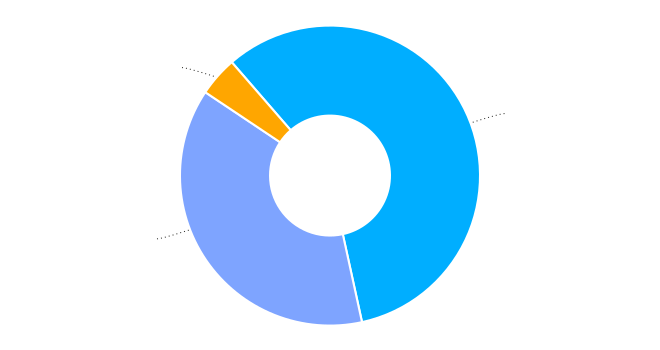

:template: survey/layout.html
:survey_year: 2024
:description: The 6th annual WTD Documentation Salary Survey was filled out by 779 documentarians in 55 countries, working across dozens of industries. Check out the full results here!

.. title:: Documentation Salary Survey Results 2024

.. |icon-info| raw:: html

	<i class="fa-solid fa-circle-info"></i>

.. |icon-question| raw:: html

   <i class="fa-solid fa-circle-question"></i>

.. |icon-quote| raw:: html

   <i class="fa-solid fa-comment-quote"></i>

.. |25| replace:: :abbr:`25 (25th percentile - one quarter of all salaries were lower than this value)`:sup:`th`

.. |25th| replace:: 25\ :sup:`th`

.. |50| replace:: :abbr:`50 (50th percentile or median - half of all salaries were higher than this value, half were lower)`:sup:`th`

.. |50th| replace:: 50\ :sup:`th`

.. |75| replace:: :abbr:`75 (75th percentile - one quarter of all salaries were higher than this value)`:sup:`th`

.. |75th| replace:: 75\ :sup:`th`

.. |N| replace:: :abbr:`No. (Number of respondents)`

.. |%| replace:: :abbr:`% (Percentage of total respondents)`

.. |1| raw:: html

   1.

.. |2| raw:: html

   2.

.. |3| raw:: html

   3.

.. |4| raw:: html

   4.

.. |5| raw:: html

   5.

.. |6| raw:: html

   6.

.. |7| raw:: html

   7.

.. |8| raw:: html

   8.

.. |9| raw:: html

   9.

.. raw:: html

   <nav role="navigation" aria-label="Table of contents" class="main-toc">

.. contents:: Table of contents
   :depth: 3
   :backlinks: none

.. raw:: html

   </nav>
   
<a href="/">Home</a> &raquo; <a href="/surveys/">Salary Surveys</a> &raquo;

  <main>

   <!-- TODO: add survey-only newsletter signup form -->

.. raw:: html

   

      

      <nav role="navigation" id="mobile-nav" class="mobile-nav">
         
.. contents:: Table of Contents
   :depth: 2
   :backlinks: none

.. raw:: html

      </nav>
   

.. _top_2024:

****************************************
Documentation Salary Survey 2024 Results
****************************************

Introduction
============

This sixth incarnation of the Write the Docs Salary Survey drew **779 responses from documentarians in 55 countries**. As always, we are impressed by the skills, experience and diversity of the Write the Docs community, and are grateful to everyone who took the time to fill out the survey and share it with their co-workers.

.. tip::

   **In a hurry?** Jump straight to `Median salary`_ or `Median rates`_.

Feedback
--------

We're always keen to hear your thoughts on this survey, so that we can continue to develop and refine it - and if you have used the data to help negotiate a raise or evaluate an offer, we would love to know about it! Email us at support@writethedocs.org with your feedback, ideas and experiences.

.. container:: text-carousel

   |icon-quote|

   .. rubric:: Your comments

   Here's some of our favourite comments from 2024: 

   .. pull-quote::

      I used the results of this survey to ask for a raise a few years ago. It helped enormously - I got the most significant raise I've ever received!

      I negotiated a much higher salary bracket when hiring a new team member. Other (paid) salary calibrators don't have enough info for tech writers and the 'AI' estimates are always too low.

      Data from past years helped me understand how underpaid I was at the time and gave me confidence to negotiate with the next opportunity.

      In 2025, I expect to convert from a contractor to a full-time employee. I fully expect that I will need to negotiate my salary and will lean heavily on the WTD Salary Survey to do so.

   .. raw:: html

      

         <button id="prev-btn" aria-controls="text-carousel">Previous comment</button>
         <button id="next-btn" aria-controls="text-carousel">Next comment</button>
      

Employment parameters
=====================

This section establishes the parameters of the respondent's employment: the type of employment, number of hours worked, job title and type of role, length of time in current position, and how focused the role is on documentation.

.. contents:: In this section
   :local: 
   :depth: 1
   :backlinks: none
   :class: boxed

Basis of employment
-------------------

.. raw:: html

   

What we asked (click to expand)

.. container:: question

   |icon-question| 
   
   **In the past year, I have worked as:**

   - an employee
   - a contractor
   - both employee and contractor

   **As an employee, currently:**

   - I'm employed
   - I'm not employed

   **As a contractor, currently:**

   - I have work
   - I don't have work

.. raw:: html

   

.. container:: note

   |icon-info|

   .. rubric:: Contractors, freelancers and self-employed people

   We asked those who filled out the survey as independent contractors, freelancers or self-employed people what term they used to describe their type of employment. More than half (63.8%) preferred the term “contractor”, with only 18.1% using “freelancer” and 10.6% using “self-employed”. In this report, we’ll use the term “contractors” to refer to this entire group.

As in previous surveys, employees made up the majority of respondents (686, or 87.9%). Contractors made up 8.5% (66 individuals).

For the first time this year, we included a third option - for respondents who had worked in the past year as both employee and contractor. 28 respondents (3.6%) chose this option, and provided both salary and contract rate data. This means that in total there are 714 employee responses and 94 contractor responses (the highest number of contractor responses yet).

.. table:: Basis of employment (2019-2024)
   :widths: 30 35 35
   :name: tbl-2024-basis-of-employment-history
   :class: sortable col2right col3right

   +-----------------+-----------------+----------------+
   | Survey year     | Employees       | Contractors    |
   +=================+=================+================+
   | 2019            | |2| 652 (93.9%) |  |2| 42 (6.1%) |
   +-----------------+-----------------+----------------+
   | 2020            | |4| 748 (92.9%) |  |3| 57 (7.1%) |
   +-----------------+-----------------+----------------+
   | 2021            | |5| 887 (92.5%) |  |4| 72 (7.5%) |
   +-----------------+-----------------+----------------+
   | 2022            | |1| 491 (93.5%) |  |1| 34 (6.5%) |
   +-----------------+-----------------+----------------+
   | 2023            | |6| 938 (92.2%) |  |5| 79 (7.8%) |
   +-----------------+-----------------+----------------+
   | 2024 [*]_       | |3| 714 (88.4%) | |6| 94 (11.6%) |
   +-----------------+-----------------+----------------+

.. [*] Includes 28 employee-contractor respondents who are counted twice - once as an employee and once as a contractor

As in previous years, we encouraged those currently not working to respond as though still at their previous job/contract, provided they had worked at least some of the past year. 16 employees (2.3%) and 7 contractors (10.6%) filled out the survey on this basis.

Of the 28 respondents who had worked as both employee and contractor in the past year, 15 were currently working in both capacities. The others were currently working as one or the other only, or not working at all (2 respondents).

Hours worked
------------

.. raw:: html

   

What we asked

.. container:: question

   |icon-question| 
   
   **How many hours per week do you work?**

   - 1–20 hours
   - 21–30 hours
   - 31–40 hours
   - 41–50 hours
   - 51–60 hours
   - More than 60 hours

.. raw:: html

   

In total, 95.3% of all respondents worked "full time" hours, using the US standard of 30 hours/week as the minimum. 27% of all respondents worked in excess of 40 hours a week.

- 68.3% worked between 31 and 40 hours
- 24.9% worked between 41 and 50 hours
- 2.2% worked between 51 and 60 hours

For the first time this year, no respondents reported working more than 60 hours.

4.6% of respondents worked "part time" hours, using the US standard of less than 30 hours/week:

- 2.7% worked 21 to 30 hours each week
- 1.9% worked 1 to 20 hours

.. table:: Weekly hours worked (2024)
   :widths: 70 15 15
   :name: tbl-2024-weekly-hours-worked
   :class: std3col sortable

   +--------------+-----+-------+
   | Hours        | |N| | |%|   |
   +==============+=====+=======+
   | 31-40 hours  | 532 | 68.3% |
   +--------------+-----+-------+
   | 41-50 hours  | 194 | 24.9% |
   +--------------+-----+-------+
   | 21-30 hours  | 21  | 2.7%  |
   +--------------+-----+-------+
   | 51-60 hours  | 17  | 2.2%  |
   +--------------+-----+-------+
   | 1-20 hours   | 15  | 1.9%  |
   +--------------+-----+-------+

.. raw:: html

   <figure>
      <object role="img" aria-label="Weekly hours worked (2024)" aria-describedby="figure_hours-worked_desc" type="image/svg+xml" data="/_images/2024-hours-worked.svg">
         
Horizontal bar chart showing weekly hours worked

      </object>
      <figcaption>Figure: Weekly hours worked (2024)</figcaption>
   </figure>

Job title
---------

.. raw:: html

   

What we asked

.. container:: question

   |icon-question| 
   
   **What is your job title?**

.. raw:: html

   

With typos fixed, abbreviations expanded, "stop words" removed and keyword faceting applied, 217 unique job titles could be discerned. One respondent indicated that they did not have a job title.

As in previous years, the most widely used exact title was "Technical Writer", reported by 26.8% of respondents. This term appeared in 6 of the top 10 job titles, in 51 of the 217 unique job titles, and in 65.2% of all job titles.

.. raw:: html

   
<input type="radio" id="tabA3-1" name="tabGroupA3" class="tab" checked tabindex="0"><label for="tabA3-1">Top job titles</label><input type="radio" id="tabA3-2" name="tabGroupA3" class="tab"><label for="tabA3-2">Excluding "technical writer"</label>

.. table:: Most widely-used job titles
   :widths: 70 15 15
   :name: tbl-2024-top-job-titles
   :class: std3col sortable

   +-------------------------------------+-----+-------+
   | Title                               | |N| | |%|   |
   +=====================================+=====+=======+
   | Technical Writer                    | 209 | 26.8% |
   +-------------------------------------+-----+-------+
   | Senior Technical Writer             | 158 | 20.3% |
   +-------------------------------------+-----+-------+
   | Lead Technical Writer               | 32  | 4.1%  |
   +-------------------------------------+-----+-------+
   | Staff Technical Writer              | 26  | 3.3%  |
   +-------------------------------------+-----+-------+
   | Principal Technical Writer          | 16  | 2.1%  |
   +-------------------------------------+-----+-------+
   | Documentation Manager               | 12  | 1.5%  |
   +-------------------------------------+-----+-------+
   | Technical Writer II                 | 12  | 1.5%  |
   +-------------------------------------+-----+-------+
   | Manager, Technical Writing          | 10  | 1.3%  |
   +-------------------------------------+-----+-------+
   | Technical Author                    | 8   | 1.0%  |
   +-------------------------------------+-----+-------+
   | Senior Documentation Manager        | 6   | 0.8%  |
   +-------------------------------------+-----+-------+

.. raw:: html

	

.. table:: Job titles excluding "technical writer"
   :widths: 70 15 15
   :name: tbl-2024-job-titles-excluding-technical-writer
   :class: std3col sortable

   +-------------------------------------+-----+------+
   | Title                               | |N| | |%|  |
   +=====================================+=====+======+
   | Documentation Manager               | 12  | 7.1% |
   +-------------------------------------+-----+------+
   | Documentation Specialist            | 6   | 3.6% |
   +-------------------------------------+-----+------+
   | Senior Documentation Manager        | 6   | 3.6% |
   +-------------------------------------+-----+------+
   | Content Developer                   | 5   | 3.0% |
   +-------------------------------------+-----+------+
   | Knowledge Manager                   | 5   | 3.0% |
   +-------------------------------------+-----+------+
   | Documentation Engineer              | 5   | 3.0% |
   +-------------------------------------+-----+------+
   | User Assistance Developer           | 4   | 2.4% |
   +-------------------------------------+-----+------+
   | Documentation Team Lead             | 4   | 2.4% |
   +-------------------------------------+-----+------+
   | Information Developer               | 4   | 2.4% |
   +-------------------------------------+-----+------+
   | Manager, Product Documentation      | 3   | 1.8% |
   +-------------------------------------+-----+------+

.. raw:: html

   

   
   <figure>
      <object role="img" aria-label="Job title word cloud" aria-describedby="figure_job-title-word-cloud_desc" type="image/svg+xml" data="/_images/2024-job-title-word-cloud.svg">
         
Word cloud showing relative weights of job title keywords

      </object>
      <figcaption>Figure: Job title word cloud</figcaption>
   </figure>
   
   

Role category
-------------

.. raw:: html

   

What we asked

.. container:: question

   |icon-question| 
   
   **How would you categorize your primary role?** Please select one category - you will be able to select additional categories in the next question.

   - Technical writer
   - UX writer
   - Editor
   - Programmer-writer (code, sample apps etc)
   - Content producer (visual, audio, interactive content, etc)
   - Educator, trainer, instructional designer
   - Developer, engineer
   - Support
   - Developer relations, outreach
   - Translation, localization
   - Project or product manager
   - Testing, quality assurance
   - Information architecture
   - DocOps (infrastructure, tools etc)
   - Other (please specify)

   **What additional roles do you also perform?** Select multiple if appropriate, or select "None".

   - Technical writer
   - UX writer
   - Editor
   - Programmer-writer (code, sample apps etc)
   - Content producer (visual, audio, interactive content etc)
   - Educator, trainer, instructional designer
   - Developer, engineer
   - Support
   - Developer relations, outreach, advocate
   - Subject matter expert
   - Translation, localization
   - Project or product manager
   - Testing, quality assurance
   - Information architecture
   - DocOps (infrastructure, process, tools etc)
   - Manager or team leader
   - Marketing
   - Mentoring
   - Other (please specify)
   - None

.. raw:: html

   

   

Question background

.. container:: question

   |icon-info| 
   
   Given that job titles and the responsibilities they entail varies widely, this question attempts to add context to the salary data by identifying the type of work being primarily performed.

   We added the original version of this question - which asked respondents to broadly categorize their role into one of a limited set of options - in the second survey, in 2020. Starting in 2022, we allowed respondents to choose multiple role categories. This highlighted the breadth of talent in our community, but made comparing salaries more difficult.

   After community consultation in 2024, we split this question into two parts - one for primary role category, and one for additional roles - and expanded the number of options.

.. raw:: html

   

Primary role category
~~~~~~~~~~~~~~~~~~~~~

"Technical writer" was by far the most widely-selected primary role category, chosen by 83.7% of respondents. "Editor", "DocOps" and "project/product manager" counted for around 2% each. 

7 respondents selected "other" and provided more detail: most were all-rounders who performed a combination of roles, although "content strategist", "communications writer" and "rebranding tech" were also mentioned.

.. table:: Primary role categories
   :widths: 70 15 15
   :name: tbl-2024-top-role-categories
   :class: std3col sortable

   +------------------------------------------------+-----+-------+
   | Role category                                  | |N| | |%|   |
   +================================================+=====+=======+
   | Technical writer                               | 652 | 84.7% |
   +------------------------------------------------+-----+-------+
   | Editor                                         | 20  | 2.6%  |
   +------------------------------------------------+-----+-------+
   | DocOps                                         | 18  | 2.3%  |
   +------------------------------------------------+-----+-------+
   | Project or product manager                     | 16  | 2.1%  |
   +------------------------------------------------+-----+-------+
   | Programmer-writer                              | 12  | 1.6%  |
   +------------------------------------------------+-----+-------+
   | UX writer                                      | 10  | 1.3%  |
   +------------------------------------------------+-----+-------+
   | Support                                        | 9   | 1.2%  |
   +------------------------------------------------+-----+-------+
   | Content producer                               | 8   | 1.0%  |
   +------------------------------------------------+-----+-------+
   | Information architecture                       | 6   | 0.8%  |
   +------------------------------------------------+-----+-------+
   | Developer or engineer                          | 4   | 0.5%  |
   +------------------------------------------------+-----+-------+
   | Developer relations, outreach or advocate      | 4   | 0.5%  |
   +------------------------------------------------+-----+-------+
   | Educator, trainer, or instructional designer   | 2   | 0.3%  |
   +------------------------------------------------+-----+-------+
   | Testing, quality assurance                     | 2   | 0.3%  |
   +------------------------------------------------+-----+-------+

Additional role categories
~~~~~~~~~~~~~~~~~~~~~~~~~~

45 respondents (5.8%) chose only a primary role category. Of these, 42 listed "technical writer" as their primary role category, 2 selected "editor" and 1 selected "developer or engineer".

Of the respondents who selected additional role categories, the number chosen ranged from 1 (82 respondents) to 10 or more (32 respondents). The most popular number of additional role categories was 3, with 136 respondents selecting 3 additional categories.

This resulted in an incredibly diverse range of primary and secondary role category combinations - over 3,400 in all.

.. raw:: html

   
<input type="radio" id="tabA333-1" name="tabGroupA333" class="tab" checked tabindex="0"><label for="tabA333-1">Technical writer</label><input type="radio" id="tabA333-2" name="tabGroupA333" class="tab"><label for="tabA333-2">Editor</label><input type="radio" id="tabA333-3" name="tabGroupA333" class="tab"><label for="tabA333-3">DocOps</label>

.. table:: Combinations with primary role "technical writer"
   :widths: 90 10
   :name: tbl-2024-top-category-combinations-technical-writer
   :class: sortable col2right

   +-----------------------------------------+-----+
   | Additional role category                | |N| |
   +=========================================+=====+
   | Editor                                  | 380 |
   +-----------------------------------------+-----+
   | Information architecture                | 267 |
   +-----------------------------------------+-----+
   | UX writer                               | 263 |
   +-----------------------------------------+-----+
   | DocOps                                  | 179 |
   +-----------------------------------------+-----+
   | Mentoring                               | 176 |
   +-----------------------------------------+-----+
   | Subject matter expert                   | 155 |
   +-----------------------------------------+-----+
   | Content producer                        | 147 |
   +-----------------------------------------+-----+
   | Manager or team leader                  | 132 |
   +-----------------------------------------+-----+
   | Testing / QA                            | 120 |
   +-----------------------------------------+-----+
   | Educator                                | 116 |
   +-----------------------------------------+-----+
   | Project or product manager              | 109 |
   +-----------------------------------------+-----+
   | Programmer-writer                       |  93 |
   +-----------------------------------------+-----+
   | Translator                              |  79 |
   +-----------------------------------------+-----+
   | Support                                 |  75 |
   +-----------------------------------------+-----+
   | Developer relations                     |  41 |
   +-----------------------------------------+-----+
   | Marketing                               |  40 |
   +-----------------------------------------+-----+
   | Developer or engineer                   |  23 |
   +-----------------------------------------+-----+

.. raw:: html

	

.. table:: Combinations with primary role "editor"
   :widths: 90 10
   :name: tbl-2024-top-category-combinations-editor
   :class: sortable col2right

   +-----------------------------------------+-----+
   | Additional role category                | |N| |
   +=========================================+=====+
   | Technical writer                        |  15 |
   +-----------------------------------------+-----+
   | Mentoring                               |   7 |
   +-----------------------------------------+-----+
   | Subject matter expert                   |   6 |
   +-----------------------------------------+-----+
   | Project or product manager              |   6 |
   +-----------------------------------------+-----+

.. raw:: html

	

.. table:: Combinations with primary role "DocOps"
   :widths: 90 10
   :name: tbl-2024-top-category-combinations-docops
   :class: sortable col2right

   +-----------------------------------------+-----+
   | Additional role category                | |N| |
   +=========================================+=====+
   | Technical writer                        |  14 |
   +-----------------------------------------+-----+
   | Information architecture                |   9 |
   +-----------------------------------------+-----+
   | Mentoring                               |   8 |
   +-----------------------------------------+-----+
   | Editor                                  |   7 |
   +-----------------------------------------+-----+
   | Manager or team leader                  |   7 |
   +-----------------------------------------+-----+

.. raw:: html

   

Team configuration
------------------

.. raw:: html

   

What we asked

.. container:: question

   |icon-question| 
   
   **When working with other people, what is your typical role?** Select multiple options, if appropriate.

   - A solo worker
   - Part of a team of people with the same or similar roles
   - Part of a team of people with different roles
   - Part of multiple teams
   - A manager or team leader
   - Other (please specify)

.. raw:: html

   

50.6% of respondents reported that they were part of a team of people with the same or similar roles, while 45.6% reported being part of a team with different roles. 26.2% reported being part of multiple teams, and 25.3% reported being a solo worker.

.. table:: Team configuration
   :widths: 70 15 15
   :name: tbl-2024-team-configuration
   :class: std3col sortable

   +----------------------------+--------+--------+
   | Configuration              | |N|    | |%|    |
   +============================+========+========+
   | Team - similar roles       | 394    |  50.6% |
   +----------------------------+--------+--------+
   | Team - different roles     | 355    |  45.6% |
   +----------------------------+--------+--------+
   | Multiple teams             | 204    |  26.2% |
   +----------------------------+--------+--------+
   | Solo worker                | 197    |  25.3% |
   +----------------------------+--------+--------+
   | Manager                    | 148    |  19.0% |
   +----------------------------+--------+--------+
   | Other                      | 3      |   0.4% |
   +----------------------------+--------+--------+

Length of time in current role
------------------------------

.. raw:: html

   

What we asked

.. container:: question

   |icon-question| 
   
   **EMPLOYEES**:

   **How long have you worked at your current organization, in your current role?** Please select the length of time for your current position at your current organization only - your total years of experience in documentation will be covered in the individual demographics section. If you have changed roles at the same organization, please select the length of time that you have been in your current role.

   - Less than 1 year
   - 1 year or more but less than 2 years
   - 2 years or more but less than 5 years
   - 5 years or more but less than 10 years
   - 10 years or more (please specify)

   **CONTRACTORS**:

   **How long have you worked as a contractor or freelancer, or been self-employed?** This is how long you have been a contractor or freelancer only - your total years of experience in documentation will be covered later on.

   - Less than 1 year
   - 1 year or more but less than 2 years
   - 2 years or more but less than 5 years
   - 5 years or more but less than 10 years
   - 10 years or more (please specify)

.. raw:: html

   

A spike in respondents with new jobs was first seen in 2021, with 31.7% of respondents reported being in their current position at their current organization for less than a year. In 2022, this number peaked at 36.8% - when respondents with new jobs outstripped the number who had held their current position for medium or long terms. In 2023, the number of respondents with new jobs fell again, to 20.3% - lower than in 2020 although still well above the 9% reported in 2019, and this number has remained steady in 2024, at 21.8%.

.. raw:: html

   
<input type="radio" id="tabD963-1" name="tabGroupD963" class="tab" checked><label for="tabD963-1">Employees</label><input type="radio" id="tabD963-2" name="tabGroupD963" class="tab"><label for="tabD963-2">Contractors</label>

.. table:: Length of time in current role - employees
   :widths: 70 15 15
   :name: tbl-2024-length-of-time-in-current-role-employees
   :class: std3col sortable

   +-------------------------+-----+-------+
   | Time                    | |N| | |%|   |
   +=========================+=====+=======+
   | 2-5 years               | 274 | 38.4% |
   +-------------------------+-----+-------+
   | 0-1 year                | 156 | 21.8% |
   +-------------------------+-----+-------+
   | 1-2 years               | 131 | 18.3% |
   +-------------------------+-----+-------+
   | 5-10 years              | 110 | 15.4% |
   +-------------------------+-----+-------+
   | more than 10 years      | 43  | 6.0%  |
   +-------------------------+-----+-------+

.. raw:: html

   <figure>
      <object role="img" aria-label="Length of time in current role at current organization" aria-describedby="figure_length-of-time-in-current-role_desc" type="image/svg+xml" data="/_images/2024-time-in-role-employees.svg">
         
Length of time in current role (at current organization - employee respondents who have changed roles at the same organization were instructed to specify the length of time they had been in their current role only, not the total length of time at the organization)

      </object>
      <figcaption>Figure: Length of time in current role (employees)</figcaption>
   </figure>

.. raw:: html

   

.. table:: Length of time contracting - contractors
   :widths: 70 15 15
   :name: tbl-2024-length-of-time-in-current-role-contractors
   :class: std3col sortable

   +------------------------+--------+--------+
   | Time                   | |N|    | |%|    |
   +========================+========+========+
   | 1-2 years              | 23     | 24.5%  |
   +------------------------+--------+--------+
   | 0-1 year               | 19     | 20.2%  |
   +------------------------+--------+--------+
   | more than 10 years     | 18     | 19.1%  |
   +------------------------+--------+--------+
   | 5-10 years             | 18     | 19.1%  |
   +------------------------+--------+--------+
   | 2-5 years              | 16     | 17.0%  |
   +------------------------+--------+--------+

.. raw:: html

   <figure>
      <object role="img" aria-label="Length of time contracting" aria-describedby="figure_length-of-time-contracting_desc" type="image/svg+xml" data="/_images/2024-time-in-role-contractors.svg">
         
Length of time contracting

      </object>
      <figcaption>Figure: Length of time contracting</figcaption>
   </figure>

.. raw:: html

   

Proportion of role related to documentation
-------------------------------------------

.. raw:: html

   

What we asked

.. container:: question

   |icon-question| 
   
   **Documentation is:**

   - the whole of my official job description
   - part of my official job description
   - not officially part of my job description, but I am expected to perform documentation-related tasks
   - not officially part of my job description, and I am not expected to perform documentation-related tasks, but I do anyway

   **Approximately what percentage of your day-to-day tasks are documentation-related?**

   - 0-25%
   - 26-50%
   - 51-75%
   - 76-100%

.. raw:: html

   

The majority of respondents (68.8%) reported that documentation makes up their whole official job description, and most or all of their day-to-day tasks (54.7% reporting more than 76% of their daily workload). The portion of respondents performing documentation-related tasks even though it's not part of their job description remained steady at 2.6%.

.. raw:: html

   

.. raw:: html

   <input type="radio" id="tabA7-1" name="tabGroupA7" class="tab" checked tabindex="0"><label for="tabA7-1">Official role</label><input type="radio" id="tabA7-2" name="tabGroupA7" class="tab"><label for="tabA7-2">Actual role</label>

.. table:: Portion of role officially documentation-related
   :widths: 70 15 15
   :name: tbl-2024-portion-of-role-officially-documentation-related
   :class: std3col sortable

   +------------------------------------------+--------+--------+
   | Portion                                  | |N|    | |%|    |
   +==========================================+========+========+
   | Wholly documentation                     | 537    | 68.8%  |
   +------------------------------------------+--------+--------+
   | Partly documentation                     | 215    | 27.6%  |
   +------------------------------------------+--------+--------+
   | Not documentation, but it's expected     | 20     | 2.6%   |
   +------------------------------------------+--------+--------+
   | Not documentation, and not expected      | 8      | 1.0%   |
   +------------------------------------------+--------+--------+

.. raw:: html

   

.. table:: Portion of role actually documentation-related
   :widths: 70 15 15
   :name: tbl-2024-portion-of-role-actually-documentation-related
   :class: std3col sortable

   +--------------------------+--------+--------+
   | Portion                  | |N|    | |%|    |
   +==========================+========+========+
   | 76-100%                  | 427    | 54.7%  |
   +--------------------------+--------+--------+
   | 51-75%                   | 248    | 31.9%  |
   +--------------------------+--------+--------+
   | 26-50%                   | 75     | 9.6%   |
   +--------------------------+--------+--------+
   | 0-25%                    | 30     | 3.8%   |
   +--------------------------+--------+--------+

.. raw:: html

   

Job changes
===========

This section explores the changes in employment experienced by respondents in the past year: losing or gaining employment, changes in salary or contract earnings, and how they feel about the job market.

.. contents:: In this section
   :local: 
   :depth: 1
   :backlinks: none
   :class: boxed

Salary or contract earnings changes
-----------------------------------

.. raw:: html

   

What we asked

.. container:: question

   |icon-question|

   **EMPLOYEES:**

   **Has your salary changed in the past year?** Please do not take outside factors such as inflation, cost of living or currency conversion rates into account - just the actual amount of compensation you receive.

   - Yes - my salary increased
   - Yes - my salary decreased
   - No - my salary stayed the same

   **CONTRACTORS:**

   **Have your total contract or freelance earnings changed in the past year?** Please do not take outside factors such as inflation, cost of living or currency conversion rates into account - just the total amount of money you received from work you have done in the past year.

   - Yes - my earnings increased
   - Yes - my earnings decreased
   - No - my earnings stayed the same

.. raw:: html

   

   

Question background

.. container:: question

   |icon-info| 
   
   In the 2022 survey results, we saw more employee respondents in new positions - jobs that they'd held for less than one year - than in any previous survey. To better explore how the job market shake-up of the past few years is affecting our community - both employees and contractors - we added this new section for job changes in 2023.

   After community input in 2024, we changed the format of the question to ask about salary or earnings changes directly, rather than asking about changes in employment or contract status. We also added a question about whether respondents had attempted to negotiate a salary increase in the past year, regardless of the outcome.

.. raw:: html

   

Of the 713 respondents who worked as employees in the past year, 75% reported that their salary had increased in the past year. 22.3% reported no change, and 2.7% reported a decrease.

Among the 94 respondents who had worked on a contract basis, only 46.8% reported an earnings increase. 37.2% reported no change, and 16% reported a decrease.

.. raw:: html

   

.. raw:: html

   <input type="radio" id="tabB22-1" name="tabGroupB22" class="tab" checked tabindex="0"><label for="tabB22-1">Employees</label><input type="radio" id="tabB22-2" name="tabGroupB22" class="tab"><label for="tabB22-2">Contractors</label>

.. table:: Employee salary change
   :widths: 70 15 15
   :name: tbl-2024-salary-change
   :class: std3col sortable

   +-------------------+------+-------+
   | Change            | |N|  | |%|   |
   +===================+======+=======+
   | |1| Increase      | 535  | 75.0% |
   +-------------------+------+-------+
   | |2| No change     | 159  | 22.3% |
   +-------------------+------+-------+
   | |3| Decrease      | 19   | 2.7%  |
   +-------------------+------+-------+

.. raw:: html

   <figure>
      <object role="img" aria-label="Employee salary change" aria-describedby="figure_employee-salary-change_desc" type="image/svg+xml" data="/_images/2024-salary-change-employees.svg">
         
Donut chart showing employees reporting salary increase, decrease or no change in the past year

      </object>
      <figcaption>Figure: Employee salary change</figcaption>
   </figure>

.. raw:: html

   

.. table:: Contractor earnings change
   :widths: 70 15 15
   :name: tbl-2024-earnings-change
   :class: std3col sortable

   +--------------------+-----+-------+
   | Change             | |N| | |%|   |
   +====================+=====+=======+
   | |1| Increase       | 44  | 46.8% |
   +--------------------+-----+-------+
   | |2| No change      | 35  | 37.2% |
   +--------------------+-----+-------+
   | |3| Decrease       | 15  | 16.0% |
   +--------------------+-----+-------+

.. raw:: html

   <figure>
      <object role="img" aria-label="Contractor earnings change" aria-describedby="figure_earnings-change-contractors_desc" type="image/svg+xml" data="/_images/2024-earnings-change-contractors.svg">
         
Donut chart showing contractors reporting earnings increase, decrease or no change in the past year

      </object>
      <figcaption>Figure: Contractor earnings change</figcaption>
   </figure>

.. raw:: html

   

Reasons for salary increase or decrease
---------------------------------------

.. raw:: html

   

What we asked

.. container:: question

   |icon-question|

   **Why did your salary increase?** Select multiple, if appropriate.

   - I received or negotiated a raise
   - I was promoted within the same organization
   - I moved to another position within the same organization
   - I started a new position in a new organization
   - Other (please specify)

   OR

   **Why did your salary decrease?** Select multiple, if appropriate.

   - Organizational salary cuts
   - I was made redundant, downsized or laid off due to restructuring/bankruptcy/closure
   - My employment was terminated
   - I resigned
   - I moved to another position with the same organization at a lower salary
   - I started a new position in a new organization at a lower salary
   - Other (please specify)

   **Regardless of outcome, did you attempt to negotiate a salary increase in the past year?** This could be through formal or informal procedures.

   - yes
   - no

.. raw:: html

   

61.6% of employees reporting an increase in salary attributed this to a raise. 17.4% received a promotion, and 13.9% started a new position.

After examining the responses entered by those respondents who selected "Other" and provided more detail, four additional options were added to the reasons for salary increase:

- "Adjustment" refers to a salary increase to account for inflation, cost-of-living increases, currency exchange rates or similar - rather than a performance, merit or tenure-based raise;
- "Position change" refers to a change in location, increase in responsibilities or wider scope of tasks that warranted a salary increase, without actually being a promotion or lateral move;
- "Equity" refers to the maturation of stock options or other equity-based compensation increases; and
- "Bonus" refers to a one-time or annual bonus payment that was not part of the respondent's regular salary.

50% of employees reporting a decrease in salary attributed this to starting a new position at a lower salary. 20.8% were made redundant, 12.5% experienced organizational salary cuts, and 8.3% had their employment terminated.

There was only one "other" response for salary decrease, representing a potentially common option which was added:

-  "Relocation" refers to a decrease in salary due to a move to a location with a lower cost of living or lower salary expectations.

32.8% of employees attempted to negotiate a salary increase in the past year.

.. raw:: html

   

.. raw:: html

   <input type="radio" id="tabB32-1" name="tabGroupB32" class="tab" checked tabindex="0"><label for="tabB32-1">Salary increase</label><input type="radio" id="tabB32-2" name="tabGroupB32" class="tab"><label for="tabB32-2">Salary decrease</label>

.. table:: Salary increase
   :widths: 70 15 15
   :name: tbl-2024-salary-increase
   :class: std3col sortable

   +--------------------+-----+-------+
   | Reason             | |N| | |%|   |
   +====================+=====+=======+
   | Raise              | 369 | 61.6% |
   +--------------------+-----+-------+
   | Promotion          | 104 | 17.4% |
   +--------------------+-----+-------+
   | New position       | 83  | 13.9% |
   +--------------------+-----+-------+
   | Adjustment         | 24  | 4.0%  |
   +--------------------+-----+-------+
   | Lateral move       | 9   | 1.5%  |
   +--------------------+-----+-------+
   | Position change    | 7   | 1.2%  |
   +--------------------+-----+-------+
   | Equity             | 2   | 0.3%  |
   +--------------------+-----+-------+
   | Bonus              | 1   | 0.2%  |
   +--------------------+-----+-------+

.. raw:: html

   <figure>
      <object role="img" aria-label="Salary increase reasons - employees" aria-describedby="figure_salary-increase-reasons-employees_desc" type="image/svg+xml" data="/_images/2024-salary-increase-employees.svg">
         
Vertical bar chart showing reasons for employee salary increases in 2024.

      </object>
      <figcaption>Figure: Employee salary increase reasons</figcaption>
   </figure>

.. raw:: html

   

.. table:: Salary decrease
   :widths: 70 15 15
   :name: tbl-2024-salary-decrease
   :class: std3col sortable

   +-------------------------+-----+-------+
   | Reason                  | |N| | |%|   |
   +=========================+=====+=======+
   | New position            | 12  | 50.0% |
   +-------------------------+-----+-------+
   | Redundancy              | 5   | 20.8% |
   +-------------------------+-----+-------+
   | Organizational cuts     | 3   | 12.5% |
   +-------------------------+-----+-------+
   | Termination             | 2   | 8.3%  |
   +-------------------------+-----+-------+
   | Lateral                 | 1   | 4.2%  |
   +-------------------------+-----+-------+
   | Relocation              | 1   | 4.2%  |
   +-------------------------+-----+-------+

.. raw:: html

   <figure>
      <object role="img" aria-label="Salary decrease reasons - employees" aria-describedby="figure_salary-decrease-reasons-employees_desc" type="image/svg+xml" data="/_images/2024-salary-decrease-employees.svg">
         
Vertical bar chart showing reasons for employee salary decreases in 2024.

      </object>
      <figcaption>Figure: Employee salary decrease reasons</figcaption>
   </figure>

.. raw:: html

   

Reasons for contract earnings increase or decrease
--------------------------------------------------

.. raw:: html

   

What we asked

.. container:: question

   |icon-question|

   **Why did your contract or freelance earnings increase?** Select multiple, if appropriate.

   - I started a new contract or freelance project (or multiple projects)
   - I raised my rate
   - I worked more hours
   - Other (please specify)

   OR

   **Why did your contract or freelance earnings decrease?** Select multiple, if appropriate.

   - A contract or freelance project ended prematurely
   - A contract or freelance project ended as expected
   - My contract was not renewed or extended as expected
   - I resigned from a contract or "fired" a freelance client
   - My freelance work pipeline dried up
   - I lowered my rate
   - I worked fewer hours
   - Other (please specify)

   **Regardless of outcome, did you attempt to negotiate a contract or freelance rate increase in the past year?**

   - yes
   - no

.. raw:: html

   

Of those contractors reporting an increase in their earnings, 36.5% raised their rate, 34.9% started new contracts or projects, and 14.3% worked more hours.

Four additional options were added to the reasons for contract earnings increase, based on responses entered by those who selected "Other" and provided more detail:

- "Received a raise" - as distinct from "raised rate" - applies to those contractors who work a single contract in the manner of a regular employee, and received a raise from their client/employer;
- "Job changes" to describe taking on additional responsibility or work scope within the same contract, leading to an increase in earnings;
- "Bonus" for a one-off additional payment; and
- "Promotion" for a change in role or responsibility - again applying to those contractors working a single contract in the manner of a regular employee.

Of those contractors reporting a decrease in their earnings, 20% reported that their pipeline dried up, 16% worked fewer hours, and 16% had a contract end prematurely.

Two new options were added to the reasons for earnings decrease, based on responses entered by those who selected "Other":

- "Stopgap contracting" for those who took on contracts at a lower rate as a temporary measure after losing permanent employment, while searching for a new permanent position; and
- "Relocation" for those who moved to a location with a lower cost of living or lower salary expectations.

45.7% of contractors reported that they attempted to negotiate a rate increase in the past year.

.. raw:: html

   

.. raw:: html

   <input type="radio" id="tabB2-1" name="tabGroupB2" class="tab" checked tabindex="0"><label for="tabB2-1">Earnings increase</label><input type="radio" id="tabB2-2" name="tabGroupB2" class="tab"><label for="tabB2-2">Earnings decrease</label>

.. table:: Reasons for earnings increase
   :widths: 70 15 15
   :name: tbl-2024-earnings-increase
   :class: std3col sortable

   +-----------------------------+-----+-------+
   | Reason                      | |N| | |%|   |
   +=============================+=====+=======+
   | Raised rate                 | 23  | 36.5% |
   +-----------------------------+-----+-------+
   | New contracts or projects   | 22  | 34.9% |
   +-----------------------------+-----+-------+
   | Worked more hours           | 9   | 14.3% |
   +-----------------------------+-----+-------+
   | Received a raise            | 5   | 7.9%  |
   +-----------------------------+-----+-------+
   | Job changes                 | 2   | 3.2%  |
   +-----------------------------+-----+-------+
   | Bonus                       | 1   | 1.6%  |
   +-----------------------------+-----+-------+
   | Promotion                   | 1   | 1.6%  |
   +-----------------------------+-----+-------+

.. raw:: html

   <figure>
      <object role="img" aria-label="Earnings increase reasons - contractors" aria-describedby="figure_earnings-increase-reasons-contractors_desc" type="image/svg+xml" data="/_images/2024-earnings-increase-contractors.svg">
         
Vertical bar chart showing reasons for contractor earnings increases in 2024.

      </object>
      <figcaption>Figure: Contractor earnings increase reasons</figcaption>
   </figure>

.. raw:: html

   

.. table:: Reasons for earnings decrease
   :widths: 70 15 15
   :name: tbl-2024-earnings-decrease
   :class: std3col sortable

   +--------------------------------+-----+-------+
   | Reason                         | |N| | |%|   |
   +================================+=====+=======+
   | Pipeline dried up              | 5   | 20.0% |
   +--------------------------------+-----+-------+
   | Stopgap contracting            | 4   | 16.0% |
   +--------------------------------+-----+-------+
   | Fewer hours                    | 4   | 16.0% |
   +--------------------------------+-----+-------+
   | Contract ended prematurely     | 4   | 16.0% |
   +--------------------------------+-----+-------+
   | Contracted ended normally      | 2   | 8.0%  |
   +--------------------------------+-----+-------+
   | Contract not renewed           | 2   | 8.0%  |
   +--------------------------------+-----+-------+
   | Lowered rate                   | 2   | 8.0%  |
   +--------------------------------+-----+-------+
   | Resigned or fired client       | 1   | 4.0%  |
   +--------------------------------+-----+-------+
   | Relocation                     | 1   | 4.0%  |
   +--------------------------------+-----+-------+

.. raw:: html

   <figure>
      <object role="img" aria-label="Earnings decrease reasons - contractors" aria-describedby="figure_earnings-decrease-reasons-contractors_desc" type="image/svg+xml" data="/_images/2024-earnings-decrease-contractors.svg">
         
Vertical bar chart showing reasons for contractor earnings decreases in 2024.

      </object>
      <figcaption>Figure: Contractor earnings decrease reasons</figcaption>
   </figure>

.. raw:: html

   

Job or contract search status
-----------------------------

.. raw:: html

   

What we asked

.. container:: question

   |icon-question| 
   
   Employees:

   **What is your current job search status?**

   - I'm not looking for a new position, and am not open to employment offers
   - I'm not looking for a new position, but am open to employment offers
   - I'm not looking for a new position, but expect to be within the next year
   - I'm actively looking for a new position
   - I'm actively looking for a new position and would also consider contract/freelance opportunities

   Contractors:

   **What is your current contract/freelance search status?**

   - I'm not looking for new contracts or freelance projects, and am not open to offers
   - I'm not looking for new contracts or freelance projects, but am open to offers
   - I'm not looking for new contracts or freelance projects, but expect to be within the next year
   - I'm actively looking for new contracts or freelance projects
   - I'm actively looking for new contracts or freelance projects and would also consider taking a permanent position
   - I'm only contracting while I search for a permanent position

.. raw:: html

   

The top two responses to "what is your job/contract search status" were the same for employees and contractors:

- 46.8% of employees and 30.9% of contractors reported that they were not actively looking for new positions, but were open to offers; whereas
- 29.5% of employees and 23.4% of contractors reported that they were not actively looking for new positions and were not open to offers.

5.5% of employees were actively looking for new positions and would also consider contract/freelance opportunities, while 18.1% of contractors were actively looking for new contracts or freelance projects and would also consider taking a permanent position. 17% of contractors were only contracting while searching for a permanent position.

.. raw:: html

   

.. raw:: html

   <input type="radio" id="tabB3-1" name="tabGroupB3" class="tab" checked><label for="tabB3-1">Employees</label><input type="radio" id="tabB3-2" name="tabGroupB3" class="tab"><label for="tabB3-2">Contractors</label>

.. table:: Current job search status - employees
   :widths: 70 15 15
   :name: tbl-2024-current-job-search-status-employees
   :class: std3col sortable

   +------------------------------------------------------------+-----+-------+
   | Status                                                     | |N| | |%|   |
   +============================================================+=====+=======+
   | Not actively looking - open to offers                      | 334 | 46.8% |
   +------------------------------------------------------------+-----+-------+
   | Not actively looking - not open to offers                  | 210 | 29.5% |
   +------------------------------------------------------------+-----+-------+
   | Actively looking                                           | 66  | 9.3%  |
   +------------------------------------------------------------+-----+-------+
   | Not looking yet, but expect to be within the next year     | 64  | 9.0%  |
   +------------------------------------------------------------+-----+-------+
   | Actively looking, would consider contract                  | 39  | 5.5%  |
   +------------------------------------------------------------+-----+-------+

.. raw:: html

   

.. table:: Current work search status - contractors
   :widths: 70 15 15
   :name: tbl-2024-current-work-search-status-contractors
   :class: std3col sortable

   +-------------------------------------------------------------+-----+-------+
   | Status                                                      | |N| | |%|   |
   +=============================================================+=====+=======+
   | Not actively looking - open to offers                       | 29  | 30.9% |
   +-------------------------------------------------------------+-----+-------+
   | Not actively looking - not open to offers                   | 22  | 23.4% |
   +-------------------------------------------------------------+-----+-------+
   | Actively looking, would consider a permanent position       | 17  | 18.1% |
   +-------------------------------------------------------------+-----+-------+
   | Only contracting while looking for a permanent position     | 16  | 17.0% |
   +-------------------------------------------------------------+-----+-------+
   | Not looking yet, but expect to be within the next year      | 6   | 6.4%  |
   +-------------------------------------------------------------+-----+-------+
   | Actively looking for new contracts/freelance projects       | 4   | 4.3%  |
   +-------------------------------------------------------------+-----+-------+

.. raw:: html

	

Job security and stability
--------------------------

.. raw:: html

   

What we asked

.. container:: question

   |icon-question|

   Employees who are currently working:

   **How would you characterize your current feelings of job security and stability compared to this time last year?**

   - More confident
   - Around the same
   - Less confident

   Contractors who are currently working:

   **How would you characterize your current feelings of contract/freelance income security and stability compared to this time last year?**

   - More confident
   - Around the same
   - Less confident

.. raw:: html

   

Employees and contractors who had indicated that they were currently unemployed were not shown this question.

Around half of all employees (51.4%) and half of all contractors (50% exactly) reported that their confidence in their job security and stability was around the same as last year. However, while 26.6% of employees reported feeling more confident, only 19.7% of contractors did. Conversely, 21.9% of employees reported feeling less confident, compared to 30.3% of contractors.

.. raw:: html

   

   <input type="radio" id="tabB553-1" name="tabGroupB553" class="tab" checked><label for="tabB553-1">Employees</label><input type="radio" id="tabB553-2" name="tabGroupB553" class="tab"><label for="tabB553-2">Contractors</label>

.. table:: Employee job security
   :widths: 70 15 15
   :name: tbl-2024-job-security-employees
   :class: std3col sortable

   +-------------------------------------------+-----+-------+
   | Confidence                                | |N| | |%|   |
   +===========================================+=====+=======+
   | |2| Around the same                       | 357 | 51.5% |
   +-------------------------------------------+-----+-------+
   | |1| More confident                        | 184 | 26.6% |
   +-------------------------------------------+-----+-------+
   | |3| Less confident                        | 152 | 21.9% |
   +-------------------------------------------+-----+-------+

.. raw:: html 

   <figure>
      <object role="img" aria-label="Job security confidence - employees" aria-describedby="figure_job-security-confidence-employees_desc" type="image/svg+xml" data="/_images/2024-job-security-confidence-employees.svg">
         
Graphic showing job security confidence of employees - less confident, around the same, more confident - as compared to the previous year.
 
      </object>
      <figcaption>Figure: Job security confidence - employees</figcaption>
   </figure>

.. raw:: html

   

.. table:: Contractor earnings security
   :widths: 70 15 15
   :name: tbl-2024-earnings-security-contractor
   :class: std3col sortable

   +------------------------------------------+-----+-------+
   | Confidence                               | |N| | |%|   |
   +==========================================+=====+=======+
   | |2| Around the same                      | 38  | 50.0% |
   +------------------------------------------+-----+-------+
   | |3| Less confident                       | 23  | 30.3% |
   +------------------------------------------+-----+-------+
   | |1| More confident                       | 15  | 19.7% |
   +------------------------------------------+-----+-------+

.. raw:: html

   <figure>
      <object role="img" aria-label="Earnings security confidence - contractors" aria-describedby="figure_earnings-security-confdence-contractors_desc" type="image/svg+xml" data="/_images/2024-earnings-security-confidence-contractors.svg">
         
Graphic showing earnings security confidence of contractors - less confident, around the same, more confident - as compared to the previous year.

      </object>
      <figcaption>Figure: Earnings security confidence - contractors</figcaption>
   </figure>

.. raw:: html

	

Job search confidence
---------------------

.. raw:: html

   

What we asked

.. container:: question

   |icon-question|

   Employees who are currently not working, or who indicated that they were actively looking for a new position:

   **How would you characterize your confidence in your ability to secure a new position with terms favorable to you?**

   - Very confident
   - Confident
   - Neutral
   - Not confident
   - Not confident at all

   Contractors who are currently not working, or who indicated that they were actively looking for new contracts or freelance projects:

   **How would you characterize your confidence in your ability to secure a new contract or freelance project/client with terms favorable to you?**

   - Very confident
   - Confident
   - Neutral
   - Not confident
   - Not confident at all

.. raw:: html

   

Employees and contractors were shown this question if they indicated that they were currently not working, or if they indicated that they were actively looking for a new position or new contract.

Amongst employees, job search confidence was mixed, with around a third (30%) feeling "confident" and another third (27.5%) feeling "not confident". Similarly, a smaller proportion (10%) felt "very confident" and an almost equal number (11.3%) "not confident at all".

Amongst contractors - a smaller number of respondents overall - the trend was towards the negative, with 40.9% feeling "not confident" and 13.6% feeling "not confident at all".

.. raw:: html

   

   <input type="radio" id="tabB563-1" name="tabGroupB563" class="tab" checked><label for="tabB563-1">Employees</label><input type="radio" id="tabB563-2" name="tabGroupB563" class="tab"><label for="tabB563-2">Contractors</label>

.. table:: Employee job search confidence
   :widths: 70 15 15
   :name: tbl-2024-job-search-confidence-employees
   :class: std3col sortable

   +---------------------------+-----+-------+
   | Confidence                | |N| | |%|   |
   +===========================+=====+=======+
   | |2| Confident             | 24  | 30.0% |
   +---------------------------+-----+-------+
   | |4| Not confident         | 22  | 27.5% |
   +---------------------------+-----+-------+
   | |3| Neutral               | 17  | 21.3% |
   +---------------------------+-----+-------+
   | |5| Not confident at all  | 9   | 11.3% |
   +---------------------------+-----+-------+
   | |1| Very confident        | 8   | 10.0% |
   +---------------------------+-----+-------+

.. raw:: html 

   <figure>
      <object role="img" aria-label="Job search confidence - employees" aria-describedby="figure_job-search-confidence-employees_desc" type="image/svg+xml" data="/_images/2024-job-search-confidence-employees.svg">
         
Graphic showing job search confidence of employees.
 
      </object>
      <figcaption>Figure: Job search confidence - employees</figcaption>
   </figure>

.. raw:: html

   

.. table:: Contractor job search confidence
   :widths: 70 15 15
   :name: tbl-2024-job-search-confidence-contractor
   :class: std3col sortable

   +----------------------------+-----+-------+
   | Confidence                 | |N| | |%|   |
   +============================+=====+=======+
   | |4| Not confident          | 9   | 40.9% |
   +----------------------------+-----+-------+
   | |1| Very confident         | 4   | 18.2% |
   +----------------------------+-----+-------+
   | |3| Neutral                | 3   | 13.6% |
   +----------------------------+-----+-------+
   | |5| Not confident at all   | 3   | 13.6% |
   +----------------------------+-----+-------+
   | |2| Confident              | 3   | 13.6% |
   +----------------------------+-----+-------+

.. raw:: html 

   <figure>
      <object role="img" aria-label="Contract search confidence - contractors" aria-describedby="figure_contract-search-confidence-contractors_desc" type="image/svg+xml" data="/_images/2024-contract-search-confidence-contractors.svg">
         
Graphic showing job search confidence of employees.
 
      </object>
      <figcaption>Figure: Contract search confidence - contractors</figcaption>
   </figure>

.. raw:: html

	

Workplace
=========

The questions in this section relate to respondents' workplace: whether they work from home, from an office, or a combination, and how they feel about that. We were also interested in how the much-discussed "return to the office" (RTO) mandates have affected our community.

.. contents:: In this section
   :local: 
   :depth: 1
   :backlinks: none
   :class: boxed

.. container:: note

   .. rubric:: |icon-info| Note on use of the term "remote"

   In previous surveys, this was some confusion as to the definition of the term "remote", as many people suddenly forced to work from home due to the pandemic did not think of that situation as working remotely. To clarify, we consider the word "remote" to have the same meaning as "work from home" or "home office".

Work location
-------------

.. raw:: html

   

What we asked

.. container:: question

   |icon-question| 
   
   **What is your current work location?**

   - I am required to be on-site full time
   - I am on-site full time, but it is not required
   - I am partially on-site, and partially remote (hybrid)
   - I am fully remote, but it is by choice (i.e. an office location is available to me)
   - I am fully remote, and it is required (i.e. no office location is available to me)

   **How do you feel about your work location?**

   - Very negative
   - Negative
   - Neutral
   - Positive
   - Very Positive

.. raw:: html

   

The vast majority of respondents (58.9%) work remotely - 30% by choice, and 28.9% by necessity. 32.3% of respondents report that they work in a hybrid environment. Those working on-site, whether by choice or necessity, make up only 8.7% of respondents.

.. table:: Work location
   :widths: 70 15 15
   :name: tbl-2024-work-location
   :class: std3col sortable

   +------------------------------+-----------+-----------+
   | Location                     | |N|       | |%|       |
   +==============================+===========+===========+
   | Hybrid                       | 252       | 32.3%     |
   +------------------------------+-----------+-----------+
   | Remote (not required)        | 234       | 30.0%     |
   +------------------------------+-----------+-----------+
   | Remote (required)            | 225       | 28.9%     |
   +------------------------------+-----------+-----------+
   | On-site (required)           | 42        | 5.4%      |
   +------------------------------+-----------+-----------+
   | On-site (not required)       | 26        | 3.3%      |
   +------------------------------+-----------+-----------+

.. raw:: html

   <figure>
      <object role="img" aria-label="Work location" aria-describedby="figure_work-location_desc" type="image/svg+xml" data="/_images/2024-work-location.svg">
         
Donut chart showing current work location - remote, hybrid, on-site - and whether the location is their choice or their employer's.

      </object>
      <figcaption>Figure: Work location</figcaption>
   </figure>

The majority of respondents (82.6% overall) reported feeling "positive" about their work location, with 48.8% feeling "very positive".  Only 5.6% reported negative feelings, with 1.5% feeling "very negative".

.. table:: Attitudes towards work location
   :widths: 70 15 15
   :name: tbl-2023-attitudes-towards-work-location
   :class: std3col sortable

   +----------------------+-----------+-----------+
   | Attitudes            | |N|       | |%|       |
   +======================+===========+===========+
   | |1| Very positive    | 380       | 48.8%     |
   +----------------------+-----------+-----------+
   | |2| Positive         | 263       | 33.8%     |
   +----------------------+-----------+-----------+
   | |3| Neutral          | 92        | 11.8%     |
   +----------------------+-----------+-----------+
   | |4| Negative         | 32        | 4.1%      |
   +----------------------+-----------+-----------+
   | |5| Very negative    | 12        | 1.5%      |
   +----------------------+-----------+-----------+

.. raw:: html

   <figure>
      <object role="img" aria-label="Work location" aria-describedby="figure_feelings-about-work-location_desc" type="image/svg+xml" data="/_images/2024-work-location-attitude.svg">
         
Donut chart showing respondents feelings about their work location.

      </object>
      <figcaption>Figure: Attitudes towards work location</figcaption>
   </figure>

"Return to office" (RTO) mandates
---------------------------------

.. raw:: html

   

What we asked

.. container:: question

   |icon-question|  
   
   **In the past year, has your organization (or for contractors, any organization that you work for) implemented an RTO (return to office) policy - requesting or requiring that remote or "work from home" employees/contractors return to working on-site?**

   - Yes, it's required all of the time
   - Yes, it's required but only part of the time (hybrid work is ok)
   - Yes, it's encouraged but not mandatory
   - Yes, but only for some roles
   - No, remote work is still allowed/encouraged/required
   - No, my position was always remote-only
   - No, my position was always hybrid
   - No, my position was always on-site only
   - I don't know, or it doesn't apply to the kind of work I do

   **How do you feel about your organization's "return to office" policy?**

   - Very negative
   - Negative
   - Neutral
   - Positive
   - Very Positive

.. raw:: html

   

In 2024, 51.4% of respondents reported that they have not been affected by RTO policies - either because remote work was still possible, or because their position was always on-site.

For those that have been affected, most reported that a hybrid model was being mandated (25% overall). 9.4% reported that a return was encouraged but not mandatory, and 7.6% reported that it was mandatory for some roles.

.. table:: RTO mandates
   :widths: 70 15 15
   :name: tbl-2024-rto-mandates
   :class: std3col sortable

   +----------------------------------------+-----------+-----------+
   | Policy                                 | |N|       | |%|       |
   +========================================+===========+===========+
   | No - remote work is still ok           | 382       | 49.0%     |
   +----------------------------------------+-----------+-----------+
   | Yes - hybrid                           | 195       | 25.0%     |
   +----------------------------------------+-----------+-----------+
   | Yes - not mandatory                    | 73        | 9.4%      |
   +----------------------------------------+-----------+-----------+
   | Yes - for some roles                   | 59        | 7.6%      |
   +----------------------------------------+-----------+-----------+
   | Don't know or doesn't apply            | 28        | 3.6%      |
   +----------------------------------------+-----------+-----------+
   | Yes - full-time                        | 23        | 3.0%      |
   +----------------------------------------+-----------+-----------+
   | No - position was always on-site       | 19        | 2.4%      |
   +----------------------------------------+-----------+-----------+

Those who reported being affected by an RTO policy were asked about their feelings on the situation.

Overall, the split between positive, negative and neutral feelings was fairly even - 33.4% reported feeling neutral, 39.4% negative or very negative, and 27.1% positive or very positive.

Those who were affected by partial RTO mandates were split in a similar manner - 35.5% reported feeling neutral, 37% negative, and 27.5% positive.

Those affected by a full time RTO mandate felt predominantly negative - 73.9% reported feeling negative or very negative, while only 21.7% reported feeling positive or very positive.

.. raw:: html

   

   <input type="radio" id="tabB5663-1" name="tabGroupB5663" class="tab" checked><label for="tabB5663-1">All affected</label><input type="radio" id="tabB5663-2" name="tabGroupB5663" class="tab"><label for="tabB5663-2">Partial RTO</label><input type="radio" id="tabB5663-3" name="tabGroupB5663" class="tab"><label for="tabB5663-3">Full RTO</label>

.. table:: Attitude to RTO - all affected
   :widths: 70 15 15
   :name: tbl-2024-rto-attitude-all
   :class: std3col sortable

   +-------------------+-----------+-----------+
   | Attitudes         | |N|       | |%|       |
   +===================+===========+===========+
   | |3| Neutral       | 117       | 33.4%     |
   +-------------------+-----------+-----------+
   | |4| Negative      | 95        | 27.1%     |
   +-------------------+-----------+-----------+
   | |2| Positive      | 68        | 19.4%     |
   +-------------------+-----------+-----------+
   | |5| Very negative | 43        | 12.3%     |
   +-------------------+-----------+-----------+
   | |1| Very positive | 27        | 7.7%      |
   +-------------------+-----------+-----------+

.. raw:: html

   <figure>
      <object role="img" aria-label="Attitude towards RTO - all affected respondents" aria-describedby="figure_rto-attitude-all-affected_desc" type="image/svg+xml" data="/_images/2024-rto-attitude-all-affected.svg">
         
Donut chart showing respondents feelings about their work location.

      </object>
      <figcaption>Figure: Attitude towards RTO - all affected respondents</figcaption>
   </figure>

.. raw:: html

   

.. table:: Attitudes to partial RTO
   :widths: 70 15 15
   :name: tbl-2024-rto-attitude-partial
   :class: std3col sortable

   +--------------------+-----------+-----------+
   | Attitudes          | |N|       | |%|       |
   +====================+===========+===========+
   | |3| Neutral        | 116       | 35.5%     |
   +--------------------+-----------+-----------+
   | |4| Negative       | 89        | 27.2%     |
   +--------------------+-----------+-----------+
   | |2| Positive       | 64        | 19.6%     |
   +--------------------+-----------+-----------+
   | |5| Very negative  | 32        | 9.8%      |
   +--------------------+-----------+-----------+
   | |1| Very positive  | 26        | 8.0%      |
   +--------------------+-----------+-----------+

.. raw:: html

   <figure>
      <object role="img" aria-label="Attitude towards RTO - respondents affected by partial RTO" aria-describedby="figure_rto-attitude-affected-by-partial_desc" type="image/svg+xml" data="/_images/2024-rto-attitude-affected-by-partial.svg">
         
Donut chart showing attitudes towards RTO mandates, by respondents affected by partial RTO.

      </object>
      <figcaption>Figure: Attitude towards RTO - respondents affected by partial RTO</figcaption>
   </figure>

.. raw:: html

   

.. table:: Attitudes to full RTO
   :widths: 70 15 15
   :name: tbl-2024-rto-attitude-full
   :class: std3col sortable

   +-------------------+-----------+-----------+
   | Attitudes         | |N|       | |%|       |
   +===================+===========+===========+
   | |5| Very negative | 11        | 47.8%     |
   +-------------------+-----------+-----------+
   | |4| Negative      | 6         | 26.1%     |
   +-------------------+-----------+-----------+
   | |2| Positive      | 4         | 17.4%     |
   +-------------------+-----------+-----------+
   | |1| Very positive | 1         | 4.3%      |
   +-------------------+-----------+-----------+
   | |3| Neutral       | 1         | 4.3%      |
   +-------------------+-----------+-----------+

.. raw:: html

   <figure>
      <object role="img" aria-label="Attitudes towards RTO - respondents affected by full RTO" aria-describedby="figure_rto-attitude-affected-by-full_desc" type="image/svg+xml" data="/_images/2024-rto-attitude-affected-by-full.svg">
         
Donut chart showing attitudes towards RTO by those respondents affeted by full RTO mandates.

      </object>
      <figcaption>Figure: Attitude towards RTO - respondents affected by full RTO</figcaption>
   </figure>

.. raw:: html

	

Preferred work location
-----------------------

.. raw:: html

   

What we asked

.. container:: question

   |icon-question| 
   
   **Regardless of the policy at your current organization or your current situation, what is your preferred work location?**

   - I prefer to work on-site on a full-time basis
   - I prefer to work remotely/from home on a full-time basis
   - I prefer the flexibility of a hybrid work location (partly on-site, partly remote)
   - I have no strong preference / it depends on the situation

.. raw:: html

   

Regardless of their current situation, 52.1% of all respondents said that their preferred work location is remote. Another 40.6% favored a hybrid model (some days in the office, some days working from home or another location). Only 2.8% said they preferred working on-site at their employer's office, and 4.5% stated no preference or that their preference depended upon the situation.

.. table:: Preferred work location
   :widths: 70 15 15
   :name: tbl-2024-preferred-work-location
   :class: std3col sortable

   +----------------------------------+-----------+-----------+
   | Location                         | |N|       | |%|       |
   +==================================+===========+===========+
   | Remote                           | 406       | 52.1%     |
   +----------------------------------+-----------+-----------+
   | Hybrid                           | 316       | 40.6%     |
   +----------------------------------+-----------+-----------+
   | No preference, or it depends     | 35        | 4.5%      |
   +----------------------------------+-----------+-----------+
   | On-site                          | 22        | 2.8%      |
   +----------------------------------+-----------+-----------+

.. raw:: html

   <figure>
      <object role="img" aria-label="Preferred work location" aria-describedby="figure_preferred-work-location_desc" type="image/svg+xml" data="/_images/2024-preferred-work-location.svg">
         
Donut chart showing preferred work location.

      </object>
      <figcaption>Figure: Preferred work location</figcaption>
   </figure>

Employee salary, benefits and satisfaction
==========================================

This section covers employee salaries, associated benefits of different types, levels of satisfaction and the factors affecting those satisfaction levels. 

To protect the privacy of our community, we do not publish median salary figures for any region or category with less than 10 respondents. In regions or categories that meet the minimum threshold of 30 respondents, we're also providing the |25th| percentile (the value below which 25% of the data falls) and |75th| percentile (the value below which 75% of the data falls).

.. contents:: In this section
   :local: 
   :depth: 1
   :backlinks: none
   :class: boxed

Salary
------

.. raw:: html

   

What we asked

.. container:: question

   |icon-question|

   **Please enter your salary before taxes are taken out, and indicate whether this is a monthly or yearly amount** (in some countries it is customary to talk about monthly salary, while in others yearly figures are more common). Monthly figures will be multiplied by 12 for comparison with yearly figures.

   If your total compensation is made up of a base salary and significant bonus, equity or commission payments, please enter your total compensation (or an average, if it fluctuates).

   - currency
   - salary
   - monthly/yearly

.. raw:: html

   

Currency
~~~~~~~~

Employee respondents reported being paid in 33 different currencies. To make comparisons possible, all currencies were converted to USD using mid-market exchange rates, averaged for the whole of 2024.

.. table:: Currencies and exchange rates - employees
   :widths: 55 10 10 10 15
   :name: tbl-2024-currencies-employees
   :class: sortable col3center col4right

   +-----------------------------------+------------+--------+--------+
   | Currency (code)                   | Rate       | |N|    | |%|    |
   +===================================+============+========+========+
   | United States Dollar (USD)        | 1.0        | 321    |  45.0% |
   +-----------------------------------+------------+--------+--------+
   | Euro (EUR)                        | 1.08       | 105    |  14.7% |
   +-----------------------------------+------------+--------+--------+
   | Canadian Dollar (CAD)             | 0.7303     | 76     |  10.7% |
   +-----------------------------------+------------+--------+--------+
   | British Pound Sterling (GBP)      | 1.28       | 43     |   6.0% |
   +-----------------------------------+------------+--------+--------+
   | Indian Rupee (INR)                | 0.012      | 40     |   5.6% |
   +-----------------------------------+------------+--------+--------+
   | Australian Dollar (AUD)           | 0.6602     | 40     |   5.6% |
   +-----------------------------------+------------+--------+--------+
   | Israeli New Shekel (NIS)          | 0.2703     | 26     |   3.6% |
   +-----------------------------------+------------+--------+--------+
   | Swedish Krona (SEK)               | 0.0947     | 9      |   1.3% |
   +-----------------------------------+------------+--------+--------+
   | Romanian Leu (RON)                | 0.2176     | 7      |   1.0% |
   +-----------------------------------+------------+--------+--------+
   | Czech Koruna (CZK)                | 0.0431     | 6      |   0.8% |
   +-----------------------------------+------------+--------+--------+
   | New Zealand Dollar (NZD)          | 0.6055     | 4      |   0.6% |
   +-----------------------------------+------------+--------+--------+
   | Hungarian Forint (HUF)            | 0.0027     | 3      |   0.4% |
   +-----------------------------------+------------+--------+--------+
   | Norwegian Krone (NOK)             | 0.0931     | 3      |   0.4% |
   +-----------------------------------+------------+--------+--------+
   | Colombian Peso (COP)              | 0.0002     | 2      |   0.3% |
   +-----------------------------------+------------+--------+--------+
   | Serbian Dinar (RSD)               | 0.0092     | 2      |   0.3% |
   +-----------------------------------+------------+--------+--------+
   | Kazakhstani Tenge (KZT)           | 0.0021     | 2      |   0.3% |
   +-----------------------------------+------------+--------+--------+
   | Mexican Peso (MXN)                | 0.0549     | 2      |   0.3% |
   +-----------------------------------+------------+--------+--------+
   | Polish Złoty (PLN)                | 0.2514     | 2      |   0.3% |
   +-----------------------------------+------------+--------+--------+
   | United Arab Emirates Dirham (AED) | 0.2723     | 2      |   0.3% |
   +-----------------------------------+------------+--------+--------+
   | Brazilian Real (BRL)              | 0.1866     | 2      |   0.3% |
   +-----------------------------------+------------+--------+--------+
   | Philippine Peso (PHP)             | 0.0175     | 2      |   0.3% |
   +-----------------------------------+------------+--------+--------+
   | Japanese Yen (JPY)                | 0.0066     | 2      |   0.3% |
   +-----------------------------------+------------+--------+--------+
   | Russian Ruble (RUB)               | 0.0108     | 2      |   0.3% |
   +-----------------------------------+------------+--------+--------+
   | Danish Krone (DKK)                | 0.1451     | 1      |   0.1% |
   +-----------------------------------+------------+--------+--------+
   | Pakistani Rupee (PKR)             | 0.0036     | 1      |   0.1% |
   +-----------------------------------+------------+--------+--------+
   | Turkish Lira (TRY)                | 0.0305     | 1      |   0.1% |
   +-----------------------------------+------------+--------+--------+
   | Chilean Peso (CLP)                | 0.0011     | 1      |   0.1% |
   +-----------------------------------+------------+--------+--------+
   | Swiss Franc (CHF)                 | 1.14       | 1      |   0.1% |
   +-----------------------------------+------------+--------+--------+
   | Argentine Peso (ARS)              | 0.0011     | 1      |   0.1% |
   +-----------------------------------+------------+--------+--------+
   | South African Rand (ZAR)          | 0.0546     | 1      |   0.1% |
   +-----------------------------------+------------+--------+--------+
   | Thai Baht (THB)                   | 0.0284     | 1      |   0.1% |
   +-----------------------------------+------------+--------+--------+
   | Chinese Yuan Renminbi (CNY)       | 0.139      | 1      |   0.1% |
   +-----------------------------------+------------+--------+--------+
   | Bulgarian Lev (BGN)               | 0.5534     | 1      |   0.1% |
   +-----------------------------------+------------+--------+--------+

Median salary
-------------

As in previous years, salaries for those working part-time hours (less than 30 per week) have been omitted from the figures in this section. The median salaries are based on 689 full-time employee respondents.

.. contents:: In this section
   :local: 
   :depth: 1
   :backlinks: none
   :class: boxed

.. container:: note

   |icon-info|

   .. rubric:: Definition of percentile values

   Throughout this report, the following definitions apply:

   - |25th| percentile: one quarter of all respondents earned less, three quarters earned more
   - |50th| percentile (median): half of all respondents earned more, half earned less
   - |75th| percentile: one quarter of all respondents earned more, three  quarters earned less

   Medians are used when comparing salary data, as they are less affected by outliers than average values. Medians are shown for any salary breakdown with at least 10 responses, and 25th and 75th percentiles are shown for breakdowns with at least 30 responses.

Median salary by respondent region
~~~~~~~~~~~~~~~~~~~~~~~~~~~~~~~~~~

Given the range of socio-economic differences in the countries in the survey results, median salary figures broken down by country of residence of employee is more useful than overall median salary.

.. container:: note

   |icon-info|

   .. rubric:: Privacy and salary information

   The following countries - all of which had fewer than 10 respondents in 2024 - are excluded from the median salaries breakdown for privary reasons: 

   - North America: Puerto Rico, Mexico
   - Europe: Austria, Bulgaria, Croatia, Czechia, Denmark, Estonia, Finland, Georgia, Greece, Hungary, Ireland, Italy, Lithuania, Malta, Netherlands, Norway, Poland, Portugal, Romania, Russia, Serbia, Slovenia, Spain, Sweden, Switzerland, Turkey, Ukraine
   - Oceania: New Zealand
   - Asia: China, Japan, Kazakhstan, Pakistan, Philippines, Sri Lanka, Taiwan, Thailand
   - Middle East: Lebanon, United Arab Emirates
   - Africa: Nigeria, Rwanda, South Africa
   - South America: Argentina, Brazil, Chile, Colombia

.. table:: Salary (USD) by respondent region
   :name: tbl-2024-salary-by-respondent-region
   :class: sortable medians nosort1

   +-------------------------+-------------+--------------+--------------+
   | Region (|N|)            | |25|        | |50|         | |75|         |
   +=========================+=============+==============+==============+
   | **Worldwide** (689)     | **$60,250** |  **$85,760** | **$120,000** |
   +-------------------------+-------------+--------------+--------------+
   | **North America** (384) | **$80,333** | **$107,050** | **$150,000** |
   +-------------------------+-------------+--------------+--------------+
   | - United States (303)   |     $89,100 |     $120,000 |     $160,000 |
   +-------------------------+-------------+--------------+--------------+
   | - Canada (77)           |     $60,177 |      $73,760 |      $92,018 |
   +-------------------------+-------------+--------------+--------------+
   | **Europe** (180)        | **$47,760** |  **$61,332** |  **$82,620** |
   +-------------------------+-------------+--------------+--------------+
   | - United Kingdom (39)   |     $57,600 |      $75,679 |      $96,000 |
   +-------------------------+-------------+--------------+--------------+
   | - Germany (29)          |     $64,800 |      $75,600 |      $86,832 |
   +-------------------------+-------------+--------------+--------------+
   | - France (19)           | --          |      $54,000 | --           |
   +-------------------------+-------------+--------------+--------------+
   | **Asia** (48)           | **$18,000** |  **$29,400** |  **$46,200** |
   +-------------------------+-------------+--------------+--------------+
   | - India (40)            |     $18,000 |      $28,800 |      $44,400 |
   +-------------------------+-------------+--------------+--------------+
   | **Oceania** (43)        | **$70,972** |  **$83,185** |  **$95,729** |
   +-------------------------+-------------+--------------+--------------+
   | - Australia (39)        |     $73,282 |      $84,506 |     $101,011 |
   +-------------------------+-------------+--------------+--------------+
   | **Middle East** (26)    | **--**      |  **$94,064** | **--**       |
   +-------------------------+-------------+--------------+--------------+
   | - Israel (24)           | --          |      $94,064 | --           |
   +-------------------------+-------------+--------------+--------------+

Respondent numbers allow some additional breakdowns by US state, Candian province and Australian state, as well as a handful of major cities.

.. raw:: html

   
<input type="radio" id="tabD3-1" name="tabGroupD3" class="tab" checked><label for="tabD3-1">United States</label><input type="radio" id="tabD3-2" name="tabGroupD3" class="tab"><label for="tabD3-2">Canada</label><input type="radio" id="tabD3-3" name="tabGroupD3" class="tab"><label for="tabD3-3">Australia</label>

.. table:: Salary (USD) by respondent region - USA
   :name: tbl-2024-salary-by-respondent-region-usa
   :class: medians sortable

   +----------------------+----------+----------+----------+
   | State (|N|)          | |25|     | |50|     | |75|     |
   +======================+==========+==========+==========+
   | California (46)      | $108,000 | $150,000 | $188,000 |
   +----------------------+----------+----------+----------+
   | - San Francisco (23) | --       | $168,000 | --       |
   +----------------------+----------+----------+----------+
   | Washington (24)      | --       | $141,000 | --       |
   +----------------------+----------+----------+----------+
   | - Seattle (19)       | --       | $160,000 | --       |
   +----------------------+----------+----------+----------+
   | North Carolina (19)  | --       | $108,000 | --       |
   +----------------------+----------+----------+----------+
   | New York (18)        | --       | $125,000 | --       |
   +----------------------+----------+----------+----------+
   | - New York City (11) | --       | $170,000 | --       |
   +----------------------+----------+----------+----------+
   | Oregon (16)          | --       | $120,000 | --       |
   +----------------------+----------+----------+----------+
   | - Portland (13)      | --       | $127,600 | --       |
   +----------------------+----------+----------+----------+
   | Texas (15)           | --       | $141,250 | --       |
   +----------------------+----------+----------+----------+
   | Pennsylvania (14)    | --       | $150,000 | --       |
   +----------------------+----------+----------+----------+
   | Colorado (12)        | --       | $115,000 | --       |
   +----------------------+----------+----------+----------+
   | Minnesota (11)       | --       | $104,358 | --       |
   +----------------------+----------+----------+----------+
   | Ohio (11)            | --       | $106,500 | --       |
   +----------------------+----------+----------+----------+
   | Michigan (10)        | --       |  $90,000 | --       |
   +----------------------+----------+----------+----------+
   | Virginia (10)        | --       | $127,000 | --       |
   +----------------------+----------+----------+----------+

.. raw:: html

   

.. table:: Salary (USD) by respondent region - Canada
   :name: tbl-2024-salary-by-respondent-region-canada
   :class: medians sortable

   +-----------------------+---------+---------+---------+
   | Province (|N|)        | |25|    | |50|    | |75|    |
   +=======================+=========+=========+=========+
   | Ontario (32)          | $60,323 | $71,569 | $91,288 |
   +-----------------------+---------+---------+---------+
   | - Toronto (18)        | --      | $80,066 | --      |
   +-----------------------+---------+---------+---------+
   | British Columbia (16) | --      | $86,806 | --      |
   +-----------------------+---------+---------+---------+
   | - Vancouver (10)      | --      | $91,288 | --      |
   +-----------------------+---------+---------+---------+
   | Quebec (12)           | --      | $67,188 | --      |
   +-----------------------+---------+---------+---------+

.. raw:: html

   

.. table:: Salary (USD) by respondent region - Australia
   :name: tbl-2024-salary-by-respondent-region-australia
   :class: medians sortable

   +----------------------+------+---------+------+
   | State (|N|)          | |25| | |50|    | |75| |
   +======================+======+=========+======+
   | Victoria (16)        |      | $79,224 |      |
   +----------------------+------+---------+------+
   | - Melbourne (14)     |      | $82,525 |      |
   +----------------------+------+---------+------+
   | New South Wales (10) |      | $84,506 |      |
   +----------------------+------+---------+------+

.. raw:: html

   

Median salary by gender identity
~~~~~~~~~~~~~~~~~~~~~~~~~~~~~~~~

In order to have large enough numbers for statistical significance, we only break down salary by gender identity for women (57% of all respondents) and men (37.2% of all respondents), and only in regions where there are at least 30 respondents of each gender.

This year, that means that we are able to show breakdowns for Worldwide, North America and Europe. Men earned more than women in all regions, but the difference was largest in Europe (where men earned 19.6% more than women).

.. raw:: html

   
<input type="radio" id="tabD33-1" name="tabGroupD33" class="tab" checked><label for="tabD33-1">Women</label><input type="radio" id="tabD33-2" name="tabGroupD33" class="tab"><label for="tabD33-2">Men</label><input type="radio" id="tabD33-3" name="tabGroupD33" class="tab"><label for="tabD33-3">Comparison</label>

.. table:: Salary (USD) by gender identity - women
   :name: tbl-2024-salary-by-gender-identity-women
   :class: medians sortable

   +---------------------+-------------+--------------+--------------+
   | Region (|N|)        | |25|        | |50|         | |75|         |
   +=====================+=============+==============+==============+
   | Worldwide (378)     | $57,600     | $82,620      | $116,855     |
   +---------------------+-------------+--------------+--------------+
   | North America (220) | $80,000     | $105,000     | $145,000     |
   +---------------------+-------------+--------------+--------------+
   | Europe (93)         | $44,547     | $57,024      | $73,984      |
   +---------------------+-------------+--------------+--------------+

.. raw:: html

   

.. table:: Salary (USD) by gender identity - men
   :name: tbl-2024-salary-by-gender-identity-men
   :class: medians sortable

   +-------------------------+-------------+--------------+--------------+
   | Region (|N|)            | |25|        | |50|         | |75|         |
   +=========================+=============+==============+==============+
   |  Worldwide  (272)       |   $64,000   |    $87,636   |   $124,879   |
   +-------------------------+-------------+--------------+--------------+
   |  North America  (138)   |   $85,000   |   $110,000   |   $155,000   |
   +-------------------------+-------------+--------------+--------------+
   |  Europe  (77)           |   $51,516   |    $68,184   |    $93,077   |
   +-------------------------+-------------+--------------+--------------+

.. raw:: html

   

.. table:: Median salary (USD) by gender identity - comparison
   :name: tbl-2024-salary-by-gender-identity-comparison
   :class: medians sortable

   +-------------------+--------------+--------------+-----------+
   | Region            | Women        | Men          | Diff      |
   +===================+==============+==============+===========+
   |  Worldwide        |   $82,620    |   $87,636    |   6.1%    |
   +-------------------+--------------+--------------+-----------+
   |  North America    |  $105,000    |  $110,000    |   4.8%    |
   +-------------------+--------------+--------------+-----------+
   |  Europe           |   $57,024    |   $68,184    |  19.6%    |
   +-------------------+--------------+--------------+-----------+

.. raw:: html

   

Median salary by years of experience
~~~~~~~~~~~~~~~~~~~~~~~~~~~~~~~~~~~~

The general trend is for salaries to increase with years of experience. This trend holds out throughout regions, with the most pronounced increase in the 10-15 year range.

.. raw:: html

   
<input type="radio" id="tabD943-1" name="tabGroupD943" class="tab" checked><label for="tabD943-1">Worldwide</label><input type="radio" id="tabD943-2" name="tabGroupD943" class="tab"><label for="tabD943-2">North America</label><input type="radio" id="tabD943-3" name="tabGroupD943" class="tab"><label for="tabD943-3">Europe</label>

.. table:: Salary (USD) by experience
   :name: tbl-2024-salary-by-experience
   :class: medians-with-num sortable

   +-----------------+-------+---------+----------+----------+
   | Experience      | |N|   | |25|    | |50|     | |75|     |
   +=================+=======+=========+==========+==========+
   | |1| 0-2 years   | 34    | $44,496 |  $54,000 |  $72,622 |
   +-----------------+-------+---------+----------+----------+
   | |2| 2-5 years   | 124   | $52,500 |  $69,336 |  $90,000 |
   +-----------------+-------+---------+----------+----------+
   | |3| 5-10 years  | 196   | $54,772 |  $81,000 | $112,000 |
   +-----------------+-------+---------+----------+----------+
   | |4| 10-15 years | 135   | $72,500 | $100,000 | $150,000 |
   +-----------------+-------+---------+----------+----------+
   | |5| 15-20 years | 60    | $75,923 |  $95,000 | $124,900 |
   +-----------------+-------+---------+----------+----------+
   | |6| 20+ years   | 138   | $77,821 | $101,000 | $144,000 |
   +-----------------+-------+---------+----------+----------+

.. raw:: html

   

.. table:: Salary (USD) by experience - North America
   :name: tbl-2024-salary-by-experience-region-north-america
   :class: medians-with-num sortable

   +-----------------+-------+---------+----------+----------+
   | Experience      | |N|   | |25|    | |50|     | |75|     |
   +=================+=======+=========+==========+==========+
   | |1| 0-2 years   | 16    |         |  $70,000 |          |
   +-----------------+-------+---------+----------+----------+
   | |2| 2-5 years   | 62    | $63,951 |  $85,000 | $111,736 |
   +-----------------+-------+---------+----------+----------+
   | |3| 5-10 years  | 111   | $75,000 | $100,000 | $144,000 |
   +-----------------+-------+---------+----------+----------+
   | |4| 10-15 years | 81    | $91,288 | $128,500 | $165,000 |
   +-----------------+-------+---------+----------+----------+
   | |5| 15-20 years | 28    | $90,000 | $115,027 | $173,665 |
   +-----------------+-------+---------+----------+----------+
   | |6| 20+ years   | 85    | $97,000 | $120,000 | $166,000 |
   +-----------------+-------+---------+----------+----------+

.. raw:: html

   

.. table:: Salary (USD) by experience - Europe
   :name: tbl-2024-salary-by-experience-region-europe
   :class: medians-with-num sortable

   +-----------------+-------+---------+---------+---------+
   | Experience      | |N|   | |25|    | |50|    | |75|    |
   +=================+=======+=========+=========+=========+
   | |1| 0-2 years   | 13    |         | $48,640 |         |
   +-----------------+-------+---------+---------+---------+
   | |2| 2-5 years   | 39    | $38,879 | $54,000 | $69,336 |
   +-----------------+-------+---------+---------+---------+
   | |3| 5-10 years  | 56    | $46,656 | $60,480 | $81,000 |
   +-----------------+-------+---------+---------+---------+
   | |4| 10-15 years | 29    |         | $77,760 |         |
   +-----------------+-------+---------+---------+---------+
   | |5| 15-20 years | 16    |         | $76,982 |         |
   +-----------------+-------+---------+---------+---------+
   | |6| 20+ years   | 26    |         | $72,900 |         |
   +-----------------+-------+---------+---------+---------+

.. raw:: html

   

Median salary by organization size
~~~~~~~~~~~~~~~~~~~~~~~~~~~~~~~~~~

Salaries generally increase with the size of the organization, with the highest median salaries observed in organizations with more than 100,000 employees. In North America, this trend is particularly pronounced in the 75th percentile for the very largest organizations. In Europe, while the trend of increasing salaries with organization size is also evident, there's a small drop in all salary ranges in the 10,000 - 100,000 employee category.

.. raw:: html

   
<input type="radio" id="tabD9943-1" name="tabGroupD9943" class="tab" checked><label for="tabD9943-1">Worldwide</label><input type="radio" id="tabD9943-2" name="tabGroupD9943" class="tab"><label for="tabD9943-2">North America</label><input type="radio" id="tabD9943-3" name="tabGroupD9943" class="tab"><label for="tabD9943-3">Europe</label>

.. table:: Salary (USD) by organization size
   :name: tbl-2024-salary-by-organization-size
   :class: medians-with-num sortable

   +------------------------+-----+---------+----------+----------+
   | Size                   | |N| | |25|    | |50|     | |75|     |
   +========================+=====+=========+==========+==========+
   | |1| 1-100              | 87  | $54,000 |  $71,222 | $105,000 |
   +------------------------+-----+---------+----------+----------+
   | |2| 101-1,000          | 270 | $60,000 |  $82,620 | $115,000 |
   +------------------------+-----+---------+----------+----------+
   | |3| 1,001-10,000       | 201 | $67,188 |  $92,000 | $120,000 |
   +------------------------+-----+---------+----------+----------+
   | |4| 10,001-100,000     | 85  | $60,250 |  $89,200 | $123,369 |
   +------------------------+-----+---------+----------+----------+
   | |5| 100,000+           | 46  | $73,473 | $107,354 | $180,000 |
   +------------------------+-----+---------+----------+----------+

.. raw:: html

   

.. table:: Salary (USD) by organization size - North America
   :name: tbl-2024-salary-by-organization-size-north-america
   :class: medians-with-num sortable

   +------------------------+-----+---------+----------+----------+
   | Size                   | |N| | |25|    | |50|     | |75|     |
   +========================+=====+=========+==========+==========+
   | |1| 1-100              | 41  | $67,500 |  $90,000 | $125,000 |
   +------------------------+-----+---------+----------+----------+
   | |2| 101-1,000          | 144 | $75,000 | $101,000 | $150,000 |
   +------------------------+-----+---------+----------+----------+
   | |3| 1,001-10,000       | 118 | $87,636 | $108,000 | $150,000 |
   +------------------------+-----+---------+----------+----------+
   | |4| 10,001-100,000     | 55  | $81,000 | $106,000 | $145,000 |
   +------------------------+-----+---------+----------+----------+
   | |5| 100,000+           | 26  |         | $170,000 |          |
   +------------------------+-----+---------+----------+----------+

.. raw:: html

   

.. table:: Salary (USD) by organization size - Europe
   :name: tbl-2024-salary-by-organization-size-europe
   :class: medians-with-num sortable

   +------------------------+-----+---------+---------+---------+
   | Size                   | |N| | |25|    | |50|    | |75|    |
   +========================+=====+=========+=========+=========+
   | |1| 1-100              | 28  |         | $51,840 |         |
   +------------------------+-----+---------+---------+---------+
   | |2| 101-1,000          | 83  | $50,544 | $64,000 | $83,160 |
   +------------------------+-----+---------+---------+---------+
   | |3| 1,001-10,000       | 46  | $51,516 | $61,776 | $86,848 |
   +------------------------+-----+---------+---------+---------+
   | |4| 10,001-100,000     | 16  |         | $57,600 |         |
   +------------------------+-----+---------+---------+---------+

.. raw:: html

   

Employee benefits
-----------------

.. raw:: html

   

What we asked

.. container:: question

   |icon-question| 
   
   **Does your salary package include any of the following statutory benefits?**

   Labor laws in some countries mandate that employees receive some or all of the following benefits as part of their employment (in some cases depending on the size or type of employer).

   Please indicate if you have access to any of the following statutory benefits. Check all that apply, or select "none of the above".

   - Paid vacation
   - Paid parental leave
   - Paid sick leave
   - Healthcare benefits
   - Pension / superannuation / retirement
   - None of the above

   **Does your salary package include any of the following statutory benefits, in excess of the required minimums?**

   Please indicate if you receive any of the following benefits, in excess of any government-mandated minimums that may apply, as part of your salary package. Check all that apply, or select "none of the above".

   For example, in Germany, employees are legally entitled to 20 days of paid vacation per year. An employee living in Germany who has a paid vacation allowance of 30 days would therefore select "paid vacation" for this question, as they receive more than the government mandated minimum.

   - Paid vacation
   - Paid parental leave
   - Paid sick leave
   - Healthcare benefits
   - Pension / superannuation / retirement
   - I'm not sure
   - None of the above

   **Does your salary package include any of the following non-statutory benefits?** Check all that apply, or select "none of the above".

   - Time off or bonuses for community-related activities
   - 401(k) matching or equivalent (additional pension contributions)
   - Unlimited PTO (paid/personal time off)
   - Insurance e.g. life, accident, income protection
   - Stocks, shares, stock options, or equity
   - Commission or bonus payments
   - Professional development / ongoing education / conference budget
   - Meals, meal vouchers, or food-related benefits
   - Gym, fitness, sport, or other wellness-related benefits
   - Transportation-related benefits (company car, public transport passes, parking, fuel vouchers or reimbursements for any transport-related cost)
   - Home office or co-working office budget (including for laptops or other equipment)
   - Phone and/or internet-related benefits or reimbursements
   - Other (please specify)
   - None of the above

.. raw:: html

   

   

Question background

.. container:: question

   |icon-info|

   This question was overhauled in 2024 to distinguish between benefits that are mandated by law in the country of employment, and those that are provided by the employer in addition to what is legally required. Instead of one question asking about all benefits, we now ask three separate questions: one about statutory benefits, one about statutory benefits in excess of legal requirements, and one about non-statutory benefits.

.. raw:: html

   

Statutory benefits such as paid vacation (86.3%), paid sick leave (82.2%), and healthcare benefits (76.6%) were the most commonly reported, with only 1.8% of respondents indicating they received none. 

Extra statutory benefits, such as additional paid vacation (50.2%) and enhanced healthcare benefits (41.3%), were less common, with 14.2% reporting none. 

Among non-statutory benefits, insurance (54.4%), professional development budgets (50.1%), and stock options or equity (45.3%) were the most frequently provided, while only 4.5% reported receiving none.

.. raw:: html

   
<input type="radio" id="tabD603-1" name="tabGroupD603" class="tab" checked><label for="tabD603-1">Statutory</label><input type="radio" id="tabD603-2" name="tabGroupD603" class="tab"><label for="tabD603-2">Extra statutory</label><input type="radio" id="tabD603-3" name="tabGroupD603" class="tab"><label for="tabD603-3">Non-statutory</label>

.. table:: Statutory benefits
   :widths: 70 15 15
   :name: tbl-2024-statutory-benefits
   :class: std3col sortable

   +-------------------------------------------------+--------+--------+
   | Benefit                                         | |N|    | |%|    |
   +=================================================+========+========+
   | Paid vacation                                   | 672    |  86.3% |
   +-------------------------------------------------+--------+--------+
   | Paid sick leave                                 | 640    |  82.2% |
   +-------------------------------------------------+--------+--------+
   | Healthcare benefits                             | 597    |  76.6% |
   +-------------------------------------------------+--------+--------+
   | Paid parental leave                             | 557    |  71.5% |
   +-------------------------------------------------+--------+--------+
   | Pension, superannuation, or retirement fund     | 455    |  58.4% |
   +-------------------------------------------------+--------+--------+
   | None                                            | 14     |   1.8% |
   +-------------------------------------------------+--------+--------+

.. raw:: html

   

.. table:: Extra statutory benefits
   :widths: 70 15 15
   :name: tbl-2024-extra-statutory-benefits
   :class: std3col sortable

   +------------------------------------------------+--------+--------+
   | Benefit                                        | |N|    | |%|    |
   +================================================+========+========+
   | Paid vacation                                  | 391    |  50.2% |
   +------------------------------------------------+--------+--------+
   | Healthcare benefits                            | 322    |  41.3% |
   +------------------------------------------------+--------+--------+
   | Paid sick leave                                | 277    |  35.6% |
   +------------------------------------------------+--------+--------+
   | Paid parental leave                            | 239    |  30.7% |
   +------------------------------------------------+--------+--------+
   | Pension, superannuation or retirement fund     | 204    |  26.2% |
   +------------------------------------------------+--------+--------+
   | Unsure                                         | 164    |  21.1% |
   +------------------------------------------------+--------+--------+
   | None                                           | 111    |  14.2% |
   +------------------------------------------------+--------+--------+

.. raw:: html

   

.. table:: Non-statutory benefits
   :widths: 70 15 15
   :name: tbl-2024-non-statutory-benefits
   :class: std3col sortable

   +------------------------------------------------------------------------+--------+--------+
   | Benefit                                                                | |N|    | |%|    |
   +========================================================================+========+========+
   | Insurance e.g. life, accident, income protection                       | 424    |  54.4% |
   +------------------------------------------------------------------------+--------+--------+
   | Professional development, ongoing education, conference budget         | 390    |  50.1% |
   +------------------------------------------------------------------------+--------+--------+
   | Stocks, shares, stock options, or equity                               | 353    |  45.3% |
   +------------------------------------------------------------------------+--------+--------+
   | 401k matching or equivalent                                            | 328    |  42.1% |
   +------------------------------------------------------------------------+--------+--------+
   | Gym, fitness, sport, or other wellness-related benefits                | 313    |  40.2% |
   +------------------------------------------------------------------------+--------+--------+
   | Home office or co-working office budget, laptop                        | 271    |  34.8% |
   +------------------------------------------------------------------------+--------+--------+
   | Time off or bonuses for community-related activities                   | 244    |  31.3% |
   +------------------------------------------------------------------------+--------+--------+
   | Commission or bonus payments                                           | 244    |  31.3% |
   +------------------------------------------------------------------------+--------+--------+
   | Phone and/or internet-related benefits or reimbursements               | 212    |  27.2% |
   +------------------------------------------------------------------------+--------+--------+
   | Unlimited PTO (paid/personal time off)                                 | 205    |  26.3% |
   +------------------------------------------------------------------------+--------+--------+
   | Meals, meal vouchers, or food-related benefits                         | 204    |  26.2% |
   +------------------------------------------------------------------------+--------+--------+
   | Transportation benefits (company car, public transport, parking, fuel) | 200    |  25.7% |
   +------------------------------------------------------------------------+--------+--------+
   | None                                                                   | 35     |   4.5% |
   +------------------------------------------------------------------------+--------+--------+
   | Other                                                                  | 12     |   1.5% |
   +------------------------------------------------------------------------+--------+--------+

.. raw:: html

   

Employee satisfaction
---------------------

.. raw:: html

   

What we asked

.. container:: question

   |icon-question| 
   
   **Considering only your salary and benefits, rate your level of satisfaction:**

   - Very unsatisfied
   - Unsatisfied
   - Neutral
   - Satisfied
   - Very satisfied

   **Considering your overall employment conditions - separate from your salary and benefits - rate your level of satisfaction:**

   - Very unsatisfied
   - Unsatisfied
   - Neutral
   - Satisfied
   - Very satisfied

.. raw:: html

   

The majority of employee respondents (71.8%) said they were satisfied (46%) or very satisfied (25.8%) with their salary and benefits, while a similar percentage (71.3%) said they were satisfied (44.9%) or very satisfied (26.4%) with their overall employment conditions.

.. raw:: html

   
<input type="radio" id="tabF1a-1" name="tabGroupF1a" class="tab" checked><label for="tabF1a-1">Salary</label><input type="radio" id="tabF1a-2" name="tabGroupF1a" class="tab"><label for="tabF1a-2">Overall</label>

.. table:: Salary satisfaction
   :widths: 70 15 15
   :name: tbl-2024-employee-salary-satisfaction
   :class: std3col sortable

   +-------------------------+--------+--------+
   | Satisfaction            | |N|    | |%|    |
   +=========================+========+========+
   | |2| Satisfied           | 328    | 46.0%  |
   +-------------------------+--------+--------+
   | |1| Very satisfied      | 184    | 25.8%  |
   +-------------------------+--------+--------+
   | |3| Neutral             | 109    | 15.3%  |
   +-------------------------+--------+--------+
   | |4| Unsatisfied         | 79     | 11.1%  |
   +-------------------------+--------+--------+
   | |5| Very unsatisfied    | 13     | 1.8%   |
   +-------------------------+--------+--------+

.. raw:: html

   <figure>
      <object role="img" aria-label="Salary satisfaction" aria-describedby="figure_salary-satisfaction_desc" type="image/svg+xml" data="/_images/2024-salary-satisfaction.svg">
         
Donut chart showing employee salary satisfaction.

      </object>
      <figcaption>Figure: Salary satisfaction</figcaption>
   </figure>

.. figure:: images/2024/2024-salary-satisfaction.svg
   :class: hide

.. raw:: html

   

.. table:: Overall satisfaction
   :widths: 70 15 15
   :name: tbl-2024-employee-overall-satisfaction
   :class: std3col sortable

   +--------------------------+--------+--------+
   | Satisfaction             | |N|    | |%|    |
   +==========================+========+========+
   | |2| Satisfied            | 320    | 44.9%  |
   +--------------------------+--------+--------+
   | |1| Very satisfied       | 188    | 26.4%  |
   +--------------------------+--------+--------+
   | |3| Neutral              | 128    | 18.0%  |
   +--------------------------+--------+--------+
   | |4| Unsatisfied          | 61     | 8.6%   |
   +--------------------------+--------+--------+
   | |5| Very unsatisfied     | 16     | 2.2%   |
   +--------------------------+--------+--------+

.. raw:: html

   <figure>
      <object role="img" aria-label="Overall satisfaction - employees" aria-describedby="figure_overall-satisfaction_desc" type="image/svg+xml" data="/_images/2024-overall-satisfaction-employees.svg">
         
Donut chart showing employee overall satisfaction.

      </object>
      <figcaption>Figure: Overall satisfaction - employees</figcaption>
   </figure>

.. raw:: html

   

Factors affecting salary satisfaction
-------------------------------------

.. raw:: html

   

What we asked

.. container:: question

   |icon-question| 
   
   **How strongly do you agree with the following statements about your salary and benefits?**

   - I'm paid fairly
   - My salary keeps up with inflation / cost-of-living
   - My benefits are sufficient

   **How strongly do you agree with the following statements about your job?**

   - My hours are reasonable
   - I have flexibility in my hours
   - My responsibilities are reasonable
   - My workload is manageable
   - I have opportunities for career advancement
   - I have opportunities for professional development
   - My work is sufficiently interesting/challenging
   - I'm satisfied with the systems and toolsets I use

   **How strongly do you agree with the following statements about your workplace (remote, on-site or hybrid environment)?**

   - I have flexibility in my work location
   - Our remote work systems, tools and practices function well
   - Our on-site work systems, tools and practices function well
   - Our hybrid work systems, tools and practices function well

   **How strongly do you agree with the following statements about your team and organization?**

   - To my knowledge, salaries are consistent across similar roles
   - To my knowledge, all genders are paid equally
   - My role is sufficiently valued/funded
   - I like and/or respect my managers and team leaders
   - I like and/or respect my co-workers
   - I like and/or respect my organization
   - I'm satisfied with our methodologies, systems and practices

.. raw:: html

   

   

Question background

.. container:: question

   |icon-info|

   This question was overhauled in 2024 to be more positive in outlook, and to capture a fuller spectrum of attitudes. Rather than asking respondents to choose from a list of factors that may affect their satisfaction, we asked them to rate their agreement with a series of statements about their salary and benefits, job, workplace, team and organization.

.. raw:: html

   

While the format of this question has changed from previous years, it's possible to see patterns in the responses. For example, most respondents like and/or respect their co-workers (91.7% agreed), and to a lesser extent their managers and team leaders (79.5%) and their organization (66.9%). Many respondents are concerned with their salary not keeping up with inflation (32.6%), and a significant number are not satisfied with their workload (14.2%).

Respondents who indicated that the statement was not relevant to their situation were excluded from the analysis.

.. raw:: html

   
<input type="radio" id="tabF71a-1" name="tabGroupF71a" class="tab" checked><label for="tabF71a-1">Salary</label><input type="radio" id="tabF71a-2" name="tabGroupF71a" class="tab"><label for="tabF71a-2">Job</label><input type="radio" id="tabF71a-3" name="tabGroupF71a" class="tab"><label for="tabF71a-3">Workplace</label><input type="radio" id="tabF71a-4" name="tabGroupF71a" class="tab"><label for="tabF71a-4">Team</label>

.. table:: Satisfaction statements - salary and benefits
   :widths: 55 15 15 15
   :name: tbl-2024-satisfaction-statements-salary-benefits
   :class: sortable statements

   +----------------------------------------------------+----------+---------+----------+
   | Statements                                         | Agree    | Neutral | Disagree |
   +====================================================+==========+=========+==========+
   | I'm paid fairly                                    |    67.0% |   16.1% |    16.8% |
   +----------------------------------------------------+----------+---------+----------+
   | My salary keeps up with inflation / cost-of-living |    44.4% |   22.7% |    32.8% |
   +----------------------------------------------------+----------+---------+----------+
   | My benefits are sufficient                         |    68.9% |   17.8% |    13.4% |
   +----------------------------------------------------+----------+---------+----------+

.. raw:: html

   <figure>
      <object role="img" aria-label="Satisfaction factors - salary and benefits - employees" aria-describedby="figure_satisfaction-factors-salary-employees_desc" type="image/svg+xml" data="/_images/2024-satisfaction-factors-salary-employees.svg">
         
Horizontal bar chart showing levels of agreement with statements about respondents' salary and benefits.

      </object>
      <figcaption>Figure: Satisfaction factors - salary and benefits - employees</figcaption>
   </figure>

.. raw:: html

   

.. table:: Satisfaction statements - job
   :widths: 55 15 15 15
   :name: tbl-2024-satisfaction-statements-job
   :class: sortable statements

   +---------------------------------------------------+----------+---------+----------+
   | Statements                                        | Agree    | Neutral | Disagree |
   +===================================================+==========+=========+==========+
   | My hours are reasonable                           |    88.0% |    7.4% |     4.5% |
   +---------------------------------------------------+----------+---------+----------+
   | I have flexibility in my hours                    |    91.7% |    4.5% |     3.8% |
   +---------------------------------------------------+----------+---------+----------+
   | My responsibilities are reasonable                |    79.1% |   11.5% |     9.4% |
   +---------------------------------------------------+----------+---------+----------+
   | My workload is manageable                         |    69.6% |   16.2% |    14.2% |
   +---------------------------------------------------+----------+---------+----------+
   | I have opportunities for career advancement       |    44.2% |   27.9% |    27.9% |
   +---------------------------------------------------+----------+---------+----------+
   | I have opportunities for professional development |    63.0% |   20.6% |    16.4% |
   +---------------------------------------------------+----------+---------+----------+
   | My work is sufficiently interesting / challenging |    73.3% |   17.0% |     9.7% |
   +---------------------------------------------------+----------+---------+----------+
   | I’m satisfied with the systems and toolsets I use |    60.9% |   20.7% |    18.4% |
   +---------------------------------------------------+----------+---------+----------+

.. raw:: html

   <figure>
      <object role="img" aria-label="Satisfaction factors - overall job - employees" aria-describedby="figure_satisfaction-factors-job-employees_desc" type="image/svg+xml" data="/_images/2024-satisfaction-factors-job-employees.svg">
         
Horizontal bar chart showing levels of agreement with statements about respondents' overall job situation.

      </object>
      <figcaption>Figure: Satisfaction factors - overall job - employees</figcaption>
   </figure>

.. raw:: html

   

.. table:: Satisfaction statements - workplace
   :widths: 55 15 15 15
   :name: tbl-2024-satisfaction-statements-workplace
   :class: sortable statements

   +-------------------------------------------------------------+----------+---------+----------+
   | Statements                                                  | Agree    | Neutral | Disagree |
   +=============================================================+==========+=========+==========+
   | I have flexibility in my work location                      |    82.0% |    6.6% |    11.4% |
   +-------------------------------------------------------------+----------+---------+----------+
   | Our remote work systems, tools and practices function well  |    87.0% |    9.2% |     3.8% |
   +-------------------------------------------------------------+----------+---------+----------+
   | Our on-site work systems, tools and practices function well |    74.9% |   17.2% |     7.9% |
   +-------------------------------------------------------------+----------+---------+----------+
   | Our hybrid work systems, tools and practices function well  |    77.4% |   16.0% |     6.6% |
   +-------------------------------------------------------------+----------+---------+----------+

.. raw:: html

   <figure>
      <object role="img" aria-label="Satisfaction factors - workplace - employees" aria-describedby="figure_satisfaction-factors-workplace-employees_desc" type="image/svg+xml" data="/_images/2024-satisfaction-factors-workplace-employees.svg">
         
Horizontal bar chart showing levels of agreement with statements about respondents' workplace.

      </object>
      <figcaption>Figure: Satisfaction factors - workplace - employees</figcaption>
   </figure>

.. raw:: html

   

.. table:: Satisfaction statements - team and organization
   :widths: 55 15 15 15
   :name: tbl-2024-satisfaction-statements-team-organization
   :class: sortable statements

   +---------------------------------------------------------------+----------+---------+----------+
   | Statements                                                    | Agree    | Neutral | Disagree |
   +===============================================================+==========+=========+==========+
   | To my knowledge, salaries are consistent across similar roles |    43.5% |   35.8% |    20.7% |
   +---------------------------------------------------------------+----------+---------+----------+
   | To my knowledge, all genders are paid equally                 |    54.3% |   32.3% |    13.4% |
   +---------------------------------------------------------------+----------+---------+----------+
   | My role is sufficiently valued  /funded                       |    53.0% |   20.1% |    26.9% |
   +---------------------------------------------------------------+----------+---------+----------+
   | I like and/or respect my managers and team leaders            |    79.8% |   12.0% |     8.2% |
   +---------------------------------------------------------------+----------+---------+----------+
   | I like and/or respect my co-workers                           |    92.2% |    6.2% |     1.6% |
   +---------------------------------------------------------------+----------+---------+----------+
   | I like and/or respect my organization                         |    67.3% |   22.3% |    10.4% |
   +---------------------------------------------------------------+----------+---------+----------+
   | I’m satisfied with our methodologies, systems and practices   |    50.2% |   25.2% |    24.6% |
   +---------------------------------------------------------------+----------+---------+----------+

.. raw:: html

   <figure>
      <object role="img" aria-label="Satisfaction factors - team and organization - employees" aria-describedby="figure_satisfaction-factors-team-employees_desc" type="image/svg+xml" data="/_images/2024-satisfaction-factors-team-employees.svg">
         
Horizontal bar chart showing levels of agreement with statements about respondents' team and organization.

      </object>
      <figcaption>Figure: Satisfaction factors - team and organization - employees</figcaption>
   </figure>

.. raw:: html

   

.. raw:: html

Contract rates and satisfaction
===============================

This section contains questions about the different types of contract work, rates, and feelings of satisfaction with contract work and contract earnings, as well as confidence in the current prospects for new contract work. 

To protect the privacy of our community, we do not publish median salary figures for any region or category with less than 10 respondents. In regions or categories that meet the minimum threshold of 30 respondents, we're also providing the |25th| percentile (the value below which 25% of the data falls) and |75th| percentile (the value below which 75% of the data falls). 

While the 2024 survey results include more contractor data than in any previous year (94 responses) this number is too low, and the respondents too geographically diverse, to determine median rates except for the very largest regions (the United States and Europe).

.. contents:: In this section
   :local: 
   :depth: 1
   :backlinks: none
   :class: boxed

Preferred term
--------------

.. raw:: html

   

What we asked

.. container:: question

   |icon-question| 
   
   **What's your preferred term to describe the kind of work you do?**

   - I consider myself a contractor
   - I consider myself a freelancer
   - I consider myself self-employed
   - I prefer a different term (please specify)

.. raw:: html

   

   

Question background

.. container:: question

   |icon-info| 
   
   In the first few surveys, we often struggled with the wording to describe the group of respondents who are not employees - "contractors, freelance operators, and self-employed people" is cumbersome and doesn't really "roll off the tongue". While we often used "contractor" as a catch-all shorthand term, we were aware that this might not be the preferred term for everyone.

   In 2023, we asked respondents who are not employees what term they prefer to describe the kind of work they do. The results from that year indicated that "contractor" was the most widely-used term, so that's what we used as a shorthand term throughout 2023's results and in the survey form for 2024.

   We'll continue to ask this question in future surveys to ensure that we're using the most appropriate term.

.. raw:: html

   

63.8% of non-employee respondents term themselves "contractors", while 18.1% prefer "freelancer" and 10.6% use "self-employed". Of the 7 individuals who chose "other", 3 indicated that they consider themselves full time employees working under a service agreement (temporary or otherwise), 2 specified "consultant", one specified "agency worker", and the final respondent entered "N/A".

.. table:: Preferred term
   :widths: 70 15 15
   :name: tbl-2024-contractor-preferred-term
   :class: std3col sortable

   +---------------------+-----------+-----------+
   | Term                | |N|       | |%|       |
   +=====================+===========+===========+
   | Contractor          | 60        | 63.8%     |
   +---------------------+-----------+-----------+
   | Freelancer          | 17        | 18.1%     |
   +---------------------+-----------+-----------+
   | Self-employed       | 10        | 10.6%     |
   +---------------------+-----------+-----------+
   | Other               | 7         | 7.4%      |
   +---------------------+-----------+-----------+

Type of contract work
---------------------

.. raw:: html

   

What we asked

.. container:: question

   |icon-question| 
   
   **What kind of contract, freelance or self-employed work do you typically engage in?** Check all that apply.

   - I work for multiple clients at the same time
   - I work for one client at a time
   - I work on short-term projects (days or weeks)
   - I work on medium-term projects (1 to 6 months)
   - I work on long-term projects (6 to 12 months or longer)
   - I offer a specific product or products
   - I offer a specific service or services
   - I work as a contractor or freelance to supplement my regular employment income
   - I work as a contractor or freelance as a stopgap while looking for permanent employment
   - I work as a contractor or freelance with a view to securing permanent employment with the same organization
   - Other (please specify)

.. raw:: html

   

Illustrating how varied contractor working situations are, out of the 94 total contractor respondents, there were 59 different combinations of client type, contract or project type, and product or service offering.

53.2% of contractor respondents indicated that they worked exclusively for a single client at a time. Another 27.7% indicated that they worked exclusively for multiple clients at a time. 5.3% worked at times for either a single client or multiple clients, and 13.8% did not indicate whether they worked for a single client or multiple.

36.2% of contractor respondents did not specify a typical contract length, while 30.9% reported working exclusively on long-term contracts (6-12 months or longer). Mixed contract lengths were reported by 23.4%, with 7.4% working only on medium-term contracts (1-6 months) and 2.1% working exclusively on short-term contracts (days or weeks).

The majority of contractor respondents (64.9%) did not specify offering either products or services. Of those that indicated that they did, 28.7% provided specific services, 5.3% offered both products and services, and only 1.1% reported offering products.

.. raw:: html

   
<input type="radio" id="tabA113-1" name="tabGroupA113" class="tab" checked tabindex="0"><label for="tabA113-1">Clients</label><input type="radio" id="tabA113-2" name="tabGroupA113" class="tab"><label for="tabA113-2">Length</label><input type="radio" id="tabA113-3" name="tabGroupA113" class="tab"><label for="tabA113-3">Products/services</label>

.. table:: Typical client configuration
   :widths: 70 15 15
   :name: tbl-2024-contractor-type-clients
   :class: std3col sortable

   +-------------------------------------+--------+--------+
   | Type                                | |N|    | |%|    |
   +=====================================+========+========+
   | Single client                       |     50 |  53.2% |
   +-------------------------------------+--------+--------+
   | Multiple clients                    |     26 |  27.7% |
   +-------------------------------------+--------+--------+
   | Both single and multiple clients    |      5 |   5.3% |
   +-------------------------------------+--------+--------+
   | Not specified                       |     13 |  13.8% |
   +-------------------------------------+--------+--------+

.. raw:: html

	

.. table:: Typical contract length
   :widths: 70 15 15
   :name: tbl-2024-contractor-type-contract-length
   :class: std3col sortable

   +-------------------------------------------+----------+----------+
   | Length                                    | |N|      | |%|      |
   +===========================================+==========+==========+
   | No contract length specified              |       34 |    36.2% |
   +-------------------------------------------+----------+----------+
   | Long term only (6-12 months or longer)    |       29 |    30.9% |
   +-------------------------------------------+----------+----------+
   | Mixed contract lengths                    |       22 |    23.4% |
   +-------------------------------------------+----------+----------+
   | Medium term only (1 - 6 months)           |        7 |     7.4% |
   +-------------------------------------------+----------+----------+
   | Short term only (days or weeks)           |        2 |     2.1% |
   +-------------------------------------------+----------+----------+

.. raw:: html

	

.. table:: Products and/or services provided
   :widths: 70 15 15
   :name: tbl-2024-contractor-type-products-services
   :class: std3col sortable

   +----------------------------------+--------+--------+
   | Offering                         | |N|    | |%|    |
   +==================================+========+========+
   | Offering neither                 |     61 |  64.9% |
   +----------------------------------+--------+--------+
   | Offering a service/services      |     27 |  28.7% |
   +----------------------------------+--------+--------+
   | Offering both                    |      5 |   5.3% |
   +----------------------------------+--------+--------+
   | Offering a product/products      |      1 |   1.1% |
   +----------------------------------+--------+--------+

.. raw:: html

   

Contract rates
--------------

.. raw:: html

   

What we asked

.. container:: question

   |icon-question| 
   
   Comparing payment rates for contractors, freelancers and self-employed people is difficult due to the number of different ways that individuals in this group operate.

   To simplify this as much as possible while still allowing comparisons, please estimate one or more of the following rate types, even if you normally use a different fee structure.

   Don't include any VAT, GST or sales tax. If you normally charge different rates, enter your most common rate, or an average if you feel that is more representative.

   **My hourly rate is:** 
   
   - currency
   - rate
   
   **My day rate is:**
   
   - currency
   - rate
   
   **My monthly rate is:**
   
   - currency
   - rate

.. raw:: html

   

Contractor respondents were paid in 15 different currencies. To make comparisons possible, all currencies were converted to USD using mid-market exchange rates, averaged for the whole of 2024.

.. table:: Currency and exchange rate
   :widths: 70 15 15
   :name: tbl-2024-currency-exchange-rate-contractors
   :class: sortable col3center col4right

   +------------------------------+------------+---------+---------+
   | Currency (code)              | Rate       | |N|     | |%|     |
   +==============================+============+=========+=========+
   | United States Dollar (USD)   |        1.0 | 56      | 59.6%   |
   +------------------------------+------------+---------+---------+
   | Euro (EUR)                   |       1.08 | 13      | 13.8%   |
   +------------------------------+------------+---------+---------+
   | British Pound Sterling (GBP) |       1.28 | 7       | 7.4%    |
   +------------------------------+------------+---------+---------+
   | Australian Dollar (AUD)      |     0.6602 | 3       | 3.2%    |
   +------------------------------+------------+---------+---------+
   | Canadian Dollar (CAD)        |     0.7303 | 3       | 3.2%    |
   +------------------------------+------------+---------+---------+
   | Israeli New Shekel (NIS)     |     0.2703 | 2       | 2.1%    |
   +------------------------------+------------+---------+---------+
   | Polish Zloty (PLN)           |     0.2514 | 2       | 2.1%    |
   +------------------------------+------------+---------+---------+
   | Danish Krone (DKK)           |     0.1451 | 1       | 1.1%    |
   +------------------------------+------------+---------+---------+
   | New Taiwan Dollar (TWD)      |     0.0312 | 1       | 1.1%    |
   +------------------------------+------------+---------+---------+
   | Norwegian Krone (NOK)        |     0.0931 | 1       | 1.1%    |
   +------------------------------+------------+---------+---------+
   | Japanese Yen (JPY)           |     0.0066 | 1       | 1.1%    |
   +------------------------------+------------+---------+---------+
   | New Zealand Dollar (NZD)     |     0.6055 | 1       | 1.1%    |
   +------------------------------+------------+---------+---------+
   | South African Rand (ZAR)     |     0.0546 | 1       | 1.1%    |
   +------------------------------+------------+---------+---------+
   | Indian Rupee (INR)           |      0.012 | 1       | 1.1%    |
   +------------------------------+------------+---------+---------+
   | Sri Lankan Rupee (LKR)       |     0.0033 | 1       | 1.1%    |
   +------------------------------+------------+---------+---------+

Median rates
~~~~~~~~~~~~

In previous years, we asked contractor respondents to enter multiple rates, if appropriate, and a number did so. This year, although the form allowed multiple rates to be entered, no respondents entered more than one type of rate.

Hourly rates were the most commonly entered fee structure, used by 66% of contractor respondents. 27.7% entered a monthly rate, and the remaining 6.4% - 6 individuals - entered a day rate. Due to the low number of day rates, we're unable to publish any median day rates.

.. raw:: html

   
<input type="radio" id="tabA213-1" name="tabGroupA213" class="tab" checked tabindex="0"><label for="tabA213-1">Hourly rate</label><input type="radio" id="tabA213-2" name="tabGroupA213" class="tab"><label for="tabA213-2">Monthly rate</label>

.. table:: Median hourly rate by region
   :widths: 55 15 15 15
   :name: tbl-2024-median-hourly-rate-by-region
   :class: sortable medians rates

   +--------------------+------+------+------+
   | Region (|N|)       | |25| | |50| | |75| |
   +====================+======+======+======+
   | Worldwide (62)     |  $45 |  $55 |  $75 |
   +--------------------+------+------+------+
   | North America (44) |  $50 |  $60 |  $75 |
   +--------------------+------+------+------+
   | Europe (11)        |      |  $40 |      |
   +--------------------+------+------+------+

.. raw:: html

	

.. table:: Median monthly rate by region
   :widths: 55 15 15 15
   :name: tbl-2024-median-monthly-rate-by-region
   :class: sortable medians

   +--------------------+------+--------+------+
   | Region (|N|)       | |25| | |50|   | |75| |
   +====================+======+========+======+
   | Worldwide (26)     |      | $4,200 |      |
   +--------------------+------+--------+------+
   | Europe (13)        |      | $3,780 |      |
   +--------------------+------+--------+------+

.. raw:: html

   

Contractor satisfaction
-----------------------

.. raw:: html

   

What we asked

.. container:: question

   |icon-question| 
   
   **Considering only your contract or freelance earnings, rate your level of satisfaction:**

   - Very unsatisfied
   - Unsatisfied
   - Neutral
   - Satisfied
   - Very satisfied

   **Considering your overall job situation - separate from your earnings - rate your level of satisfaction:**

   - Very unsatisfied
   - Unsatisfied
   - Neutral
   - Satisfied
   - Very satisfied

.. raw:: html

   

More than half of contractor respondents (63.8%) reported feeling satisfied with their earnings (42.6% satisfied and 21.3% very satisfied), and 66% reported feeling satisfied with their overall contracting situation (42.6% satisfied and 19.1% very satisfied).

.. raw:: html

   
<input type="radio" id="tabF1b-1" name="tabGroupF1b" class="tab" checked><label for="tabF1b-1">Earnings</label><input type="radio" id="tabF1b-2" name="tabGroupF1b" class="tab"><label for="tabF1b-2">Overall</label>

.. table:: Earnings satisfaction
   :widths: 70 15 15
   :name: tbl-2024-earnings-satisfaction-contractors
   :class: std3col sortable

   +---------------------------+--------+--------+
   | Satisfaction              | |N|    | |%|    |
   +===========================+========+========+
   | |2| Satisfied             | 40     | 42.6%  |
   +---------------------------+--------+--------+
   | |1| Very satisfied        | 20     | 21.3%  |
   +---------------------------+--------+--------+
   | |3| Neutral               | 17     | 18.1%  |
   +---------------------------+--------+--------+
   | |4| Unsatisfied           | 13     | 13.8%  |
   +---------------------------+--------+--------+
   | |5| Very unsatisfied      | 4      | 4.3%   |
   +---------------------------+--------+--------+

.. raw:: html

	

.. table:: Overall satisfaction
   :widths: 70 15 15
   :name: tbl-2024-overall-satisfaction-contractors
   :class: std3col sortable

   +--------------------------+--------+--------+
   | Satisfaction             | |N|    | |%|    |
   +==========================+========+========+
   | |2| Satisfied            | 40     | 42.6%  |
   +--------------------------+--------+--------+
   | |3| Neutral              | 22     | 23.4%  |
   +--------------------------+--------+--------+
   | |1| Very satisfied       | 18     | 19.1%  |
   +--------------------------+--------+--------+
   | |4| Unsatisfied          | 10     | 10.6%  |
   +--------------------------+--------+--------+
   | |5| Very unsatisfied     | 4      | 4.3%   |
   +--------------------------+--------+--------+

.. raw:: html

   

Factors affecting contractor satisfaction
-----------------------------------------

.. raw:: html

   

What we asked

.. container:: question

   |icon-question| 
   
   **How strongly do you agree with the following statements about your contract or freelance earnings?**

   - My rates keep pace with inflation / cost-of-living
   - My rates match the expectations of my clients
   - I am comfortable managing the overhead (accounting, insurance, etc.) associated with contracting/freelancing

   **How strongly do you agree with the following statements about your contracts or projects?**

   - My hours are reasonable
   - I have flexibility in my hours
   - My responsibilities are reasonable
   - My workload is manageable
   - I have opportunities for career advancement
   - I have opportunities for professional development
   - My work is sufficiently interesting/challenging
   - I'm satisfied with the systems and toolsets I use

   **How strongly do you agree with the following statements about your workplace(s) (remote, on-site or hybrid environment)?**

   - I have flexibility in my work location
   - Our remote work environment functions well
   - Our on-site work environment functions well
   - Our hybrid work environment functions well

   **How strongly do you agree with the following statements about the people and organizations that you work with?**

   - To my knowledge, rates are consistent across similar roles
   - To my knowledge, all genders are paid equally
   - My role is sufficiently valued/funded
   - I like and/or respect my managers and team leaders
   - I like and/or respect my co-workers
   - I like and/or respect my organization
   - I'm satisfied with our methodologies, systems and practices

.. raw:: html

   

   

Question background

.. container:: question

   |icon-info|

   This question was overhauled in 2024 to be more positive in outlook, and to capture a fuller spectrum of attitudes. Rather than asking respondents to choose from a list of factors that may affect their satisfaction, we asked them to rate their agreement with a series of statements about their salary and benefits, job, workplace, team and organization.

.. raw:: html

   

While the format of this question has changed from previous years, it's possible to see patterns in the responses. For example, many contractors are concerned with keeping up with inflation (32.6%), and career advancement opportunities (42.1% negative).

Respondents who indicated that the statement was not relevant to their situation were excluded from the analysis.

.. raw:: html

   
<input type="radio" id="tabF2b-1" name="tabGroupF2b" class="tab" checked><label for="tabF2b-1">Earnings</label><input type="radio" id="tabF2b-2" name="tabGroupF2b" class="tab"><label for="tabF2b-2">Contracts</label><input type="radio" id="tabF2b-3" name="tabGroupF2b" class="tab"><label for="tabF2b-3">Workplaces</label><input type="radio" id="tabF2b-4" name="tabGroupF2b" class="tab"><label for="tabF2b-4">Teams</label>

.. table:: Satisfaction statements - contractor earnings
   :widths: 55 15 15 15
   :name: tbl-2024-satisfaction-statements-contractor-earnings
   :class: sortable statements

   +----------------------------------------------------------------------------------------------------------------+----------+---------+----------+
   | Statements                                                                                                     | Agree    | Neutral | Disagree |
   +================================================================================================================+==========+=========+==========+
   | My rates keep pace with inflation / cost-of-living                                                             |    39.1% |   28.3% |    32.6% |
   +----------------------------------------------------------------------------------------------------------------+----------+---------+----------+
   | My rates match the expectations of my clients                                                                  |    58.6% |   28.7% |    12.7% |
   +----------------------------------------------------------------------------------------------------------------+----------+---------+----------+
   | I am comfortable managing the overhead (accounting, insurance, etc.) associated with contracting / freelancing |    57.2% |   22.6% |    20.2% |
   +----------------------------------------------------------------------------------------------------------------+----------+---------+----------+

.. raw:: html

	

.. table:: Satisfaction statements - contracts and projects
   :widths: 55 15 15 15
   :name: tbl-2024-satisfaction-statements-contracts
   :class: sortable statements

   +---------------------------------------------------+----------+---------+----------+
   | Statements                                        | Agree    | Neutral | Disagree |
   +===================================================+==========+=========+==========+
   | My hours are reasonable                           |    93.5% |    5.4% |     1.1% |
   +---------------------------------------------------+----------+---------+----------+
   | I have flexibility in my hours                    |    88.1% |    4.3% |     7.6% |
   +---------------------------------------------------+----------+---------+----------+
   | My responsibilities are reasonable                |    90.3% |    6.5% |     3.2% |
   +---------------------------------------------------+----------+---------+----------+
   | My workload is manageable                         |    87.0% |    9.7% |     3.3% |
   +---------------------------------------------------+----------+---------+----------+
   | I have opportunities for career advancement       |    35.2% |   22.7% |    42.1% |
   +---------------------------------------------------+----------+---------+----------+
   | I have opportunities for professional development |    48.9% |   21.1% |    30.0% |
   +---------------------------------------------------+----------+---------+----------+
   | My work is sufficiently interesting / challenging |    69.9% |   17.2% |    12.9% |
   +---------------------------------------------------+----------+---------+----------+
   | I’m satisfied with the systems and toolsets I use |    57.0% |   21.5% |    21.5% |
   +---------------------------------------------------+----------+---------+----------+

.. raw:: html

	

.. table:: Satisfaction statements - workplaces
   :widths: 55 15 15 15
   :name: tbl-2024-satisfaction-statements-contractor-workplaces
   :class: sortable statements

   +---------------------------------------------+----------+---------+----------+
   | Statements                                  | Agree    | Neutral | Disagree |
   +=============================================+==========+=========+==========+
   | I have flexibility in my work location      |    83.5% |    6.6% |     9.9% |
   +---------------------------------------------+----------+---------+----------+
   | Our remote work environment functions well  |    90.8% |    4.6% |     4.6% |
   +---------------------------------------------+----------+---------+----------+
   | Our on-site work environment functions well |    61.0% |   29.3% |     9.7% |
   +---------------------------------------------+----------+---------+----------+
   | Our hybrid work environment functions well  |    64.1% |   28.2% |     7.7% |
   +---------------------------------------------+----------+---------+----------+

.. raw:: html

	

.. table:: Satisfaction statements - teams and organizations
   :widths: 55 15 15 15
   :name: tbl-2024-satisfaction-statements-contractor-teams
   :class: sortable statements

   +---------------------------------------------------------------+----------+---------+----------+
   | Statements                                                    | Agree    | Neutral | Disagree |
   +===============================================================+==========+=========+==========+
   | To my knowledge, rates are consistent across similar roles    |    34.2% |   40.8% |    25.0% |
   +---------------------------------------------------------------+----------+---------+----------+
   | To my knowledge, all genders are paid equally                 |    40.4% |   38.0% |    21.6% |
   +---------------------------------------------------------------+----------+---------+----------+
   | My role is sufficiently valued / funded                       |    50.0% |   24.4% |    25.6% |
   +---------------------------------------------------------------+----------+---------+----------+
   | I like and/or respect my managers and team leaders            |    83.1% |   12.4% |     4.5% |
   +---------------------------------------------------------------+----------+---------+----------+
   | I like and/or respect my co-workers                           |    86.6% |   11.2% |     2.2% |
   +---------------------------------------------------------------+----------+---------+----------+
   | I like and/or respect my organization                         |    74.2% |   18.0% |     7.8% |
   +---------------------------------------------------------------+----------+---------+----------+
   | I’m satisfied with our methodologies, systems and practices   |    57.3% |   27.0% |    15.7% |
   +---------------------------------------------------------------+----------+---------+----------+

.. raw:: html

   

Organization demographics
=========================

This section concerns employing organizations. Contractors were given the option of answering about the main organization they work for, or skipping this section if it was not relevant. Only 6 contractors chose not to answer.

.. contents:: In this section
   :local: 
   :depth: 1
   :backlinks: none
   :class: boxed

Organization size
-----------------

.. raw:: html

   

What we asked

.. container:: question

   |icon-question| 
   
   **What is the approximate size of your organization, in number of employees?**

   - Less than 10
   - 11 - 50
   - 51 - 100
   - 101 - 1000
   - 1001 - 10,000
   - 10,001 - 100,000
   - More than 100,000

.. raw:: html

   

As in previous years, medium-sized organizations make up the largest proportion of the results. 37.4% of respondents work for organizations with 101-1000 employees, and 28.9% work for organizations with 1001-10,000 employees. At the other end of the scale, only 1% of respondents work for organizations with 1-10 employees.

.. table:: Organization size
   :widths: 70 15 15
   :name: tbl-2024-organization-size
   :class: std3col sortable

   +-------------------------------------------------+-----------+-----------+
   | Size                                            | |N|       | |%|       |
   +=================================================+===========+===========+
   | |4| 101-1,000 employees                         | 288       | 37.4%     |
   +-------------------------------------------------+-----------+-----------+
   | |5| 1,001-10,000 employees                      | 223       | 28.9%     |
   +-------------------------------------------------+-----------+-----------+
   | |6| 10,001-100,000 employees                    | 99        | 12.8%     |
   +-------------------------------------------------+-----------+-----------+
   | |7| 100,000+ employees                          | 53        | 6.9%      |
   +-------------------------------------------------+-----------+-----------+
   | |2| 11-50 employees                             | 52        | 6.7%      |
   +-------------------------------------------------+-----------+-----------+
   | |3| 51-100 employees                            | 48        | 6.2%      |
   +-------------------------------------------------+-----------+-----------+
   | |1| 1-10 employees                              | 8         | 1.0%      |
   +-------------------------------------------------+-----------+-----------+

.. raw:: html

   <figure>
      <object role="img" aria-label="Organization size" aria-describedby="figure_organization-size_desc" type="image/svg+xml" data="/_images/2024-organization-size.svg">
         
Vertical bar chart showing approximate organization size, in number of employees. 

      </object>
      <figcaption>Figure: Organization size</figcaption>
   </figure>

Organization type and industry
------------------------------

.. raw:: html

   

What we asked

.. container:: question

   |icon-question| 
   
   **This organization is primarily:**

   - A non-profit, community, political, educational or governmental organization, or an NGO
   - A business, corporation or other for-profit organization

   **Which industry (or industries) does your organization operate in?** Select one or multiple, as appropriate.

   - Advertising, CRM, Marketing, Sales, Customer Service, Customer Support
   - Agriculture
   - Airlines, Aerospace, Defense, Maritime, Military
   - Automotive
   - Business Support, Professional Services, Planning, Project Management, Risk Management, Compliance, Process Automation, Consulting, Outsourcing
   - Construction, Building, Engineering, Machinery, Homes
   - Culture, Arts, Heritage
   - Data Analytics, Data Science, AI, Machine Learning, Semantic Technologies
   - Design, Printing, Packaging
   - Education, Training, Instructional Design, Learning
   - Entertainment, Leisure, Gaming, Gambling, Sports, E-Sports
   - Events, Event Management, Event Services, Venues, Audio/Video
   - Finance, Banking, Financial Services, Financial Technology, Payments, Accounting, Taxation, Cyptocurrency
   - Food, Beverages
   - Government
   - Healthcare, Medical, Pharmaceuticals, Biotechnology
   - Human Resources, Recruitment
   - Insurance
   - Legal Services
   - Manufacturing, Engineering, Precision Engineering, Hardware, Semiconductor
   - Media, Radio, TV, Journalism
   - Non-profit, Community
   - Parks, Recreation, Nature, Wildnerness, Outdoors, Conservation, Ecotourism
   - Retail, Consumer Products, Fashion
   - Real Estate
   - Science, Research
   - Security, Cybersecurity
   - Software, Software Development, Software Development Tools, Open Source
   - Telecommunications, Technology, Internet, Networking, IT Services, IT Infrastructure, Electronics, Domain Registration, Web Hosting, Ecommerce, Cloud Services, Blockchain
   - Translation, Localization
   - Transportation, Delivery, Logistics, GPS, Mapping, Supply Chain
   - Travel, Hospitality, Holidays
   - Utilities, Energy, Mining, Extraction
   - Other (please specify)

   Respondents who selected software development or software development tools were asked to also select the industries that the software product or service created by the organization primarily caters to, if possible. For example, e-learning software would also be categorized as "Education, Training" and point of sale software for restaurants would also be "Food, Beverages".

.. raw:: html

   

The majority of organizations represented in the results - 96.5% - were for-profit businesses or corporations rather than non-profit, community, political, educational, governmental, or NGOs (3.4%).

.. table:: Organization type
   :widths: 70 15 15
   :name: tbl-2024-organization-type
   :class: std3col sortable

   +---------------------------------------------------------------------+-----------+-----------+
   | Type                                                                | |N|       | |%|       |
   +=====================================================================+===========+===========+
   | Business, corporation or other for-profit organization              | 744       | 96.5%     |
   +---------------------------------------------------------------------+-----------+-----------+
   | Non-profit, community, political, educational, governmental, or NGO | 27        | 3.5%      |
   +---------------------------------------------------------------------+-----------+-----------+

Software development (incorporating development tools and open source) was the most common industry, with 25.8% of organizations operating in this area. The equally broad telecommunications category - covering IT services and infrastructure, cloud services, and blockchain - was the next most common industry, with 20.4% of organizations operating in this area. Finance - including banking, financial services and technology, ecommerce and cryptocurrency - was the third most common industry, with 12.7% of organizations operating in this area.

.. table:: Organization industry
   :widths: 70 15 15
   :name: tbl-2024-organization-industry
   :class: std3col sortable

   +----------------------------------------------------------------------------------------------------------------------------------------------------------------------------+-----------+-----------+
   | Industry                                                                                                                                                                   | |N|       | |%|       |
   +============================================================================================================================================================================+===========+===========+
   | Software, Software Development, Software Development Tools, Open Source                                                                                                    | 132       | 25.8%     |
   +----------------------------------------------------------------------------------------------------------------------------------------------------------------------------+-----------+-----------+
   | Telecommunications, Technology, Internet, Networking, IT Services, IT Infrastructure, Electronics, Domain Registration, Web Hosting, Ecommerce, Cloud Services, Blockchain | 104       | 20.4%     |
   +----------------------------------------------------------------------------------------------------------------------------------------------------------------------------+-----------+-----------+
   | Finance, Banking, Financial Services, Financial Technology, Payments, Accounting, Taxation, Cryptocurrency                                                                 | 65        | 12.7%     |
   +----------------------------------------------------------------------------------------------------------------------------------------------------------------------------+-----------+-----------+
   | Security, Cybersecurity                                                                                                                                                    | 33        | 6.5%      |
   +----------------------------------------------------------------------------------------------------------------------------------------------------------------------------+-----------+-----------+
   | Manufacturing, Engineering, Precision Engineering, Hardware, Semiconductor                                                                                                 | 32        | 6.3%      |
   +----------------------------------------------------------------------------------------------------------------------------------------------------------------------------+-----------+-----------+
   | Healthcare, Medical, Pharmaceuticals, Biotechnology                                                                                                                        | 25        | 4.9%      |
   +----------------------------------------------------------------------------------------------------------------------------------------------------------------------------+-----------+-----------+
   | Data Analytics, Data Science, AI, Machine Learning, Semantic Technologies                                                                                                  | 24        | 4.7%      |
   +----------------------------------------------------------------------------------------------------------------------------------------------------------------------------+-----------+-----------+
   | Education, Training, Instructional Design, Learning                                                                                                                        | 12        | 2.3%      |
   +----------------------------------------------------------------------------------------------------------------------------------------------------------------------------+-----------+-----------+
   | Advertising, CRM, Marketing, Sales, Customer Service, Customer Support                                                                                                     | 11        | 2.2%      |
   +----------------------------------------------------------------------------------------------------------------------------------------------------------------------------+-----------+-----------+
   | Utilities, Energy, Mining, Extraction                                                                                                                                      | 10        | 2.0%      |
   +----------------------------------------------------------------------------------------------------------------------------------------------------------------------------+-----------+-----------+
   | Business Support, Professional Services, Planning, Project Management, Risk Management, Compliance, Process Automation, Consulting, Outsourcing                            | 10        | 2.0%      |
   +----------------------------------------------------------------------------------------------------------------------------------------------------------------------------+-----------+-----------+
   | Government                                                                                                                                                                 | 9         | 1.8%      |
   +----------------------------------------------------------------------------------------------------------------------------------------------------------------------------+-----------+-----------+
   | Airlines, Aerospace, Defense, Maritime, Military                                                                                                                           | 8         | 1.6%      |
   +----------------------------------------------------------------------------------------------------------------------------------------------------------------------------+-----------+-----------+
   | Entertainment, Leisure, Gaming, Gambling, Sports, E-Sports                                                                                                                 | 7         | 1.4%      |
   +----------------------------------------------------------------------------------------------------------------------------------------------------------------------------+-----------+-----------+
   | Insurance                                                                                                                                                                  | 6         | 1.2%      |
   +----------------------------------------------------------------------------------------------------------------------------------------------------------------------------+-----------+-----------+
   | Transportation, Delivery, Logistics, GPS, Mapping, Supply Chain                                                                                                            | 5         | 1.0%      |
   +----------------------------------------------------------------------------------------------------------------------------------------------------------------------------+-----------+-----------+
   | Automotive                                                                                                                                                                 | 4         | 0.8%      |
   +----------------------------------------------------------------------------------------------------------------------------------------------------------------------------+-----------+-----------+
   | Construction, Building, Engineering, Machinery, Homes                                                                                                                      | 4         | 0.8%      |
   +----------------------------------------------------------------------------------------------------------------------------------------------------------------------------+-----------+-----------+
   | Travel, Hospitality, Holidays                                                                                                                                              | 3         | 0.6%      |
   +----------------------------------------------------------------------------------------------------------------------------------------------------------------------------+-----------+-----------+
   | Retail, Consumer Products, Fashion                                                                                                                                         | 1         | 0.2%      |
   +----------------------------------------------------------------------------------------------------------------------------------------------------------------------------+-----------+-----------+
   | Events, Event Management, Event Services, Venues, Audio/Video                                                                                                              | 1         | 0.2%      |
   +----------------------------------------------------------------------------------------------------------------------------------------------------------------------------+-----------+-----------+
   | Food, Beverages                                                                                                                                                            | 1         | 0.2%      |
   +----------------------------------------------------------------------------------------------------------------------------------------------------------------------------+-----------+-----------+
   | Human Resources, Recruitment                                                                                                                                               | 1         | 0.2%      |
   +----------------------------------------------------------------------------------------------------------------------------------------------------------------------------+-----------+-----------+
   | Translation, Localization                                                                                                                                                  | 1         | 0.2%      |
   +----------------------------------------------------------------------------------------------------------------------------------------------------------------------------+-----------+-----------+
   | Non-profit, Community                                                                                                                                                      | 1         | 0.2%      |
   +----------------------------------------------------------------------------------------------------------------------------------------------------------------------------+-----------+-----------+

Pay transparency
----------------

.. raw:: html

   

What we asked

.. container:: question

   |icon-question| 
   
   **Is there an official pay transparency policy at your organization?**  Organizations with pay transparency are open about salaries and benefits for existing and prospective employees.

   - Yes - compensation is disclosed for all roles, levels, and job listings to all employees and candidates
   - Yes - but disclosure is limited to certain roles, levels, candidacy or employment status, or location
   - Yes - the policy forbids disclosure on compensation
   - No - there is no policy on compensation disclosure
   - I am not sure

   **Is pay transparency required by law in the location where your organization operates?** `Check in this Wikipedia article <https://en.wikipedia.org/wiki/Equal_pay_for_equal_work#Transparency_laws>`_.

   - Yes
   - No
   - I'm not sure

   **Regardless of official policy, is there a culture of sharing salary information at your organization?**

   - Yes - all or most of my co-workers openly share salary information
   - Partial - some of my co-workers share salary information
   - No - salary information is not openly shared
   - I'm not sure, or I do not participate

   **Regardless of the situation at your organization, how do you personally feel about pay transparency?**

   - Strongly support
   - Support
   - Neutral
   - Oppose
   - Strongly oppose

.. raw:: html

   

   

Question background

.. container:: question

   |icon-info|

   Pay transparency was first included in the 2022 survey. Due to feedback from contractors in this first year, pay transparency questions were only shown to employee respondents in 2023. However, as some contractors work long-term contracts for single clients in the manner of regular employees, pay transparency may still be relevant.

   In 2024, we moved the pay transparency questions from the employee salary section to the organization demographics section, as it's organization-related. Contractors were given the option of filling out this section or skipping it, depending on whether they deemed it relevant to their situation or not. The question about the legal requirement for pay transparency in the organization's location was also added.

.. raw:: html

   

.. container:: note

   |icon-info|

   .. rubric:: Pay transparency legislation

   A number of US states have made some level of pay transparency law - Maryland, Colorado, Connecticut, Nevada, Rhode Island, Washington, California and New York - and a number of others are considering doing so. The exact requirements, level of compliance and enforcement mechanisms vary from state to state, and as most laws have only been enacted recently, it will take some time for the effects to be felt. An overview is available here: `Quick facts about state salary range transparency laws <https://www.americanprogress.org/article/quick-facts-about-state-salary-range-transparency-laws/>`_

   Additionally, The European Parliament approved a new Pay Transparency Directive in March 2023. EU member states have three years to enact legislation based on the directive, and several - including Sweden, Belgium, Poland, and Ireland - have already taken steps. Part of the directive involves measuring and eliminating any gender-based pay discrepancies. More information is available here: `Commission welcomes the political agreement on new EU rules for pay transparency <https://ec.europa.eu/commission/presscorner/detail/en/ip_22_7739>`_

Pay transparency policy and legal requirements
~~~~~~~~~~~~~~~~~~~~~~~~~~~~~~~~~~~~~~~~~~~~~~

47.6% of respondants - the majority - reported that their organization had no pay transparency policy. The next largest group, at 27.9%, were unsure if there was a policy or not. The final 24.5% were fairly evenly split between partial disclosure (9.5%), disclosure forbidden (8.3%), and full disclosure (6.7%).

The proportions of organizations in each category has not changed significantly over the three years we have asked this question.

We asked for the first time in 2024 if respondents were aware of the legal requirement for pay transparency in their organization's location. 44.6% were unsure, 42.9% reported that there was no legal requirement, and 12.5% said that pay transparency was legally required.

.. raw:: html

   
<input type="radio" id="tabGa1-1" name="tabGroupGa1" class="tab" checked tabindex="0"><label for="tabGa1-1">Policy</label><input type="radio" id="tabGa1-2" name="tabGroupGa1" class="tab"><label for="tabGa1-2">Legal requirement</label>

.. table:: Pay transparency policy
   :widths: 70 15 15
   :name: tbl-2024-pay-transparency-policy
   :class: std3col sortable

   +-----------------------------------+-----+-------+
   | Policy                            | |N| | |%|   |
   +===================================+=====+=======+
   | No policy                         | 367 | 47.6% |
   +-----------------------------------+-----+-------+
   | Unsure                            | 215 | 27.9% |
   +-----------------------------------+-----+-------+
   | Yes - partial disclosure          | 73  | 9.5%  |
   +-----------------------------------+-----+-------+
   | Yes - disclosure is forbidden     | 64  | 8.3%  |
   +-----------------------------------+-----+-------+
   | Yes - full disclosure             | 52  | 6.7%  |
   +-----------------------------------+-----+-------+

.. raw:: html

   <figure>
      <object role="img" aria-label="Pay transparency - official policy" aria-describedby="figure_pay-transparency-policy_desc" type="image/svg+xml" data="/_images/2024-pay-transparency-policy.svg">
         
Donut chart showing official pay transparency policy.

      </object>
      <figcaption>Figure: Pay transparency policy</figcaption>
   </figure>

.. raw:: html

	

.. table:: Pay transparency law
   :widths: 70 15 15
   :name: tbl-2024-pay-transparency-law
   :class: std3col sortable

   +-------------------------------+-----+-------+
   | Required?                     | |N| | |%|   |
   +===============================+=====+=======+
   | Unsure                        | 344 | 44.6% |
   +-------------------------------+-----+-------+
   | No, not legally required      | 331 | 42.9% |
   +-------------------------------+-----+-------+
   | Yes, legally required         | 96  | 12.5% |
   +-------------------------------+-----+-------+

.. raw:: html

   <figure>
      <object role="img" aria-label="Pay transparency - law" aria-describedby="figure_pay-transparency-law_desc" type="image/svg+xml" data="/_images/2024-pay-transparency-law.svg">
         
Donut chart showing awareness of pay transparency policy law in respondent location.

      </object>
      <figcaption>Figure: Pay transparency law</figcaption>
   </figure>

.. raw:: html

   

Pay transparency culture
~~~~~~~~~~~~~~~~~~~~~~~~

The majority of respondents reported that there was not a culture of sharing salary information at their organization. 66.3% said that salary information was not openly shared, and 19.3% said that only some co-workers shared salary information. Only 1.6% reported that all or most of their co-workers openly shared salary information.

.. table:: Pay transparency culture
   :widths: 70 15 15
   :name: tbl-2024-pay-transparency-culture
   :class: std3col sortable

   +--------------------------------------------+-----+-------+
   | Practice                                   | |N| | |%|   |
   +============================================+=====+=======+
   | No, information is not openly shared       | 511 | 66.3% |
   +--------------------------------------------+-----+-------+
   | Partial - some co-workers openly share     | 149 | 19.3% |
   +--------------------------------------------+-----+-------+
   | Unsure                                     | 99  | 12.8% |
   +--------------------------------------------+-----+-------+
   | Yes, co-workers openly share               | 12  | 1.6%  |
   +--------------------------------------------+-----+-------+

.. raw:: html

   <figure>
      <object role="img" aria-label="Pay transparency - unofficial culture" aria-describedby="figure_pay-transparency-culture_desc" type="image/svg+xml" data="/_images/2024-pay-transparency-culture.svg">
         
Donut chart showing unofficial pay transparency culture.

      </object>
      <figcaption>Figure: Pay transparency culture</figcaption>
   </figure>

Support for pay transparency
~~~~~~~~~~~~~~~~~~~~~~~~~~~~

76% of respondents were supportive of pay transparency, with 46.8% expressing strong support. Those in opposition were in the minority (4.5%).

.. table:: Support for pay transparency
   :widths: 70 15 15
   :name: tbl-2024-support-pay-transparency
   :class: std3col sortable

   +----------------------------+-----+-------+
   | Level of support           | |N| | |%|   |
   +============================+=====+=======+
   | |1| Strongly support       | 361 | 46.8% |
   +----------------------------+-----+-------+
   | |2| Support                | 225 | 29.2% |
   +----------------------------+-----+-------+
   | |3| Neutral                | 150 | 19.5% |
   +----------------------------+-----+-------+
   | |4| Oppose                 | 27  | 3.5%  |
   +----------------------------+-----+-------+
   | |5| Strongly oppose        | 8   | 1.0%  |
   +----------------------------+-----+-------+

.. raw:: html

   <figure>
      <object role="img" aria-label="Pay transparency - respondent support" aria-describedby="figure_pay-transparency-support_desc" type="image/svg+xml" data="/_images/2024-pay-transparency-support.svg">
         
Donut chart showing respondent support for pay transparency.

      </object>
      <figcaption>Figure: Pay transparency support</figcaption>
   </figure>

.. raw:: html

Organization origin and location
--------------------------------

.. raw:: html

   

What we asked

.. container:: question

   |icon-question|

   **Is your organization multinational? A multinational organization is defined as one that has office locations and business operations in two or more countries.**

   - Yes
   - No

   **Where is your organization based?** This is the primary location, headquarters or main location - or for multinational organizations, the location where the organization originated. This is not your location - that will be covered in the next section.

   - Country:
   - State/Province/Region:
   - City/Town (optional):

.. raw:: html

   

83% of respondents reported that their employer organization was a multinational organization - one with office locations and business operations in two or more countries. These respondents were asked to specify the location where the organization originated.

A total of 63.8% of organizations originated in North America, with the bulk of those being US-based.

.. raw:: html

   
<input type="radio" id="tabG3-1" name="tabGroupG3" class="tab" checked tabindex="0"><label for="tabG3-1">Regions</label><input type="radio" id="tabG3-2" name="tabGroupG3" class="tab"><label for="tabG3-2">North America</label><input type="radio" id="tabG3-3" name="tabGroupG3" class="tab"><label for="tabG3-3">Europe</label><input type="radio" id="tabG3-4" name="tabGroupG3" class="tab"><label for="tabG3-4">Other regions</label>

.. table:: Organization location - Regions
   :widths: 70 15 15
   :name: tbl-2024-organization-location-regions
   :class: std3col sortable

   +---------------------------------------+------------+------------+
   | Region                                | |N|        | |%|        |
   +=======================================+============+============+
   | North America                         | 491        | 63.8%      |
   +---------------------------------------+------------+------------+
   | Europe                                | 197        | 25.6%      |
   +---------------------------------------+------------+------------+
   | Oceania                               | 32         | 4.2%       |
   +---------------------------------------+------------+------------+
   | Asia                                  | 24         | 3.1%       |
   +---------------------------------------+------------+------------+
   | Middle East                           | 22         | 2.9%       |
   +---------------------------------------+------------+------------+
   | South America                         | 3          | 0.4%       |
   +---------------------------------------+------------+------------+
   | Africa                                | 1          | 0.1%       |
   +---------------------------------------+------------+------------+

.. raw:: html

	

.. table:: Organization location - North America
   :widths: 70 15 15
   :name: tbl-2024-organization-location-north-america
   :class: std3col sortable

   +-------------------------------------------------+-----------+-----------+
   | Country                                         | |N|       | |%|       |
   +=================================================+===========+===========+
   | United States                                   | 445       | 57.8%     |
   +-------------------------------------------------+-----------+-----------+
   | Canada                                          | 45        | 5.8%      |
   +-------------------------------------------------+-----------+-----------+
   | Mexico                                          | 1         | 0.1%      |
   +-------------------------------------------------+-----------+-----------+

.. raw:: html

	

.. table:: Organization location - Europe
   :widths: 70 15 15
   :name: tbl-2024-organization-location-europe
   :class: std3col sortable

   +--------------------------------------------------------+-----------+-----------+
   | Country                                                | |N|       | |%|       |
   +========================================================+===========+===========+
   | United Kingdom                                         | 45        | 5.8%      |
   +--------------------------------------------------------+-----------+-----------+
   | Germany                                                | 41        | 5.3%      |
   +--------------------------------------------------------+-----------+-----------+
   | France                                                 | 23        | 3.0%      |
   +--------------------------------------------------------+-----------+-----------+
   | Netherlands                                            | 14        | 1.8%      |
   +--------------------------------------------------------+-----------+-----------+
   | Sweden, Switzerland                                    | 12        | 1.6%      |
   +--------------------------------------------------------+-----------+-----------+
   | Ukraine                                                | 7         | 0.9%      |
   +--------------------------------------------------------+-----------+-----------+
   | Finland                                                | 6         | 0.8%      |
   +--------------------------------------------------------+-----------+-----------+
   | Czechia, Denmark, Russia                               | 4         | 0.5%      |
   +--------------------------------------------------------+-----------+-----------+
   | Croatia, Malta, Norway                                 | 3         | 0.4%      |
   +--------------------------------------------------------+-----------+-----------+
   | Austria, Belgium, Greece, Italy, Spain                 | 2         | 0.3%      |
   +--------------------------------------------------------+-----------+-----------+
   | Bulgaria, Estonia, Hungary, Luxembourg, Poland, Serbia | 1         | 0.1%      |
   +--------------------------------------------------------+-----------+-----------+

.. raw:: html

	

.. table:: Organization location - Oceania
   :widths: 70 15 15
   :name: tbl-2024-organization-location-oceania
   :class: std3col sortable

   +--------------------------------------------------------------+-----------+-----------+
   | Country                                                      | |N|       | |%|       |
   +==============================================================+===========+===========+
   | Australia                                                    | 29        | 3.8%      |
   +--------------------------------------------------------------+-----------+-----------+
   | New Zealand                                                  | 3         | 0.4%      |
   +--------------------------------------------------------------+-----------+-----------+

.. table:: Organization location - Asia
   :widths: 70 15 15
   :name: tbl-2024-organization-location-asia
   :class: std3col sortable

   +--------------------------------------------------------------+-----------+-----------+
   | Country                                                      | |N|       | |%|       |
   +==============================================================+===========+===========+
   | India                                                        | 11        | 1.4%      |
   +--------------------------------------------------------------+-----------+-----------+
   | Japan                                                        | 5         | 0.6%      |
   +--------------------------------------------------------------+-----------+-----------+
   | Philippines                                                  | 2         | 0.3%      |
   +--------------------------------------------------------------+-----------+-----------+
   | China, Hong Kong, Kazakhstan, Singapore, Sri Lanka, Taiwan   | 1         | 0.1%      |
   +--------------------------------------------------------------+-----------+-----------+

.. table:: Organization location - Middle East
   :widths: 70 15 15
   :name: tbl-2024-organization-location-middle-east
   :class: std3col sortable

   +--------------------------------------------------------------+-----------+-----------+
   | Country                                                      | |N|       | |%|       |
   +==============================================================+===========+===========+
   | Israel                                                       | 19        | 2.5%      |
   +--------------------------------------------------------------+-----------+-----------+
   | United Arab Emirates                                         | 2         | 0.3%      |
   +--------------------------------------------------------------+-----------+-----------+
   | Saudi Arabia                                                 | 1         | 0.1%      |
   +--------------------------------------------------------------+-----------+-----------+

.. table:: Organization location - South America
   :widths: 70 15 15
   :name: tbl-2024-organization-location-south-america
   :class: std3col sortable

   +--------------------------------------------------------------+-----------+-----------+
   | Country                                                      | |N|       | |%|       |
   +==============================================================+===========+===========+
   | Brazil                                                       | 2         |  0.3%     |
   +--------------------------------------------------------------+-----------+-----------+
   | Argentina                                                    | 1         |  0.1%     |
   +--------------------------------------------------------------+-----------+-----------+

.. table:: Organization location - Africa
   :widths: 70 15 15
   :name: tbl-2024-organization-location-africa
   :class: std3col sortable

   +--------------------------------------------------------------+-----------+-----------+
   | Country                                                      | |N|       | |%|       |
   +==============================================================+===========+===========+
   | Nigeria                                                      | 1         | 0.1%      |
   +--------------------------------------------------------------+-----------+-----------+

.. raw:: html

   

Respondent demographics
=======================

Who makes up the Write the Docs community? The questions in this section on respondent age, gender identity, education, experience, and location provide context for the salary/rate and satisfaction data. All questions in this section had an "I'd rather not say" option, with the exception of geographical location (country and state or province only), without which the core objective of the survey cannot be achieved.

.. contents:: In this section
   :local: 
   :depth: 1
   :backlinks: none
   :class: boxed

Age group
---------

.. raw:: html

   

What we asked

.. container:: question

   |icon-question| 
   
   **What is your age?**

   - 18-25
   - 26-35
   - 36-45
   - 46-55
   - 56-65
   - 66+
   - I'd rather not say

.. raw:: html

   

The age group split in 2024 was similar to previous years, with the majority of respondents falling into the 26-35 and 36-45 age groups. 5 respondents (0.6%) chose not to provide an answer.

.. table:: Respondent Age
   :widths: 70 15 15
   :name: tbl-2024-age-group
   :class: std3col sortable

   +------------------+-----+-------+
   | Age group        | |N| | |%|   |
   +==================+=====+=======+
   | 18-25 years      | 30  | 3.9%  |
   +------------------+-----+-------+
   | 26-35 years      | 255 | 32.7% |
   +------------------+-----+-------+
   | 36-45 years      | 244 | 31.3% |
   +------------------+-----+-------+
   | 46-55 years      | 156 | 20.0% |
   +------------------+-----+-------+
   | 56-65 years      | 76  | 9.8%  |
   +------------------+-----+-------+
   | 66+ years        | 13  | 1.7%  |
   +------------------+-----+-------+

.. raw:: html

   <figure>
      <object role="img" aria-label="Respondent age group" aria-describedby="figure_respondent-age-group_desc" type="image/svg+xml" data="/_images/2024-age-group.svg">
         
Vertical bar chart showing age groupings of respondents. 

      </object>
      <figcaption>Figure: Respondent age group</figcaption>
   </figure>

Gender identity
---------------

.. raw:: html

   

What we asked

.. container:: question

   |icon-question| 
   
   **What gender identity do you most identify with?**

   - Woman
   - Man
   - Non-binary
   - Other (please specify)
   - I'd rather not say

.. raw:: html

   

As in previous surveys, the majority of respondents in 2024 were women - 57% - with men making up 37.2%. 3.9% of respondents were non-binary, transgender or other, and 1.7% chose to not provide an answer.

.. table:: Respondent gender identity
   :widths: 70 15 15
   :name: tbl-2024-gender-identity
   :class: std3col sortable

   +---------------------+-----+-------+
   | Identity            | |N| | |%|   |
   +=====================+=====+=======+
   | Woman               | 444 | 57.0% |
   +---------------------+-----+-------+
   | Man                 | 290 | 37.2% |
   +---------------------+-----+-------+
   | Non-binary or other | 32  | 4.2%  |
   +---------------------+-----+-------+
   | Not specified       | 13  | 1.7%  |
   +---------------------+-----+-------+

.. raw:: html

   <figure>
      <object role="img" aria-label="Respondent gender identity" aria-describedby="figure_respondent-gender-identity_desc" type="image/svg+xml" data="/_images/2024-gender-identity.svg">
         
Donut chart showing gender identity of respondents.

      </object>
      <figcaption>Figure: Respondent gender identity</figcaption>
   </figure>

Experience
----------

.. raw:: html

   

What we asked

.. container:: question

   |icon-question| 
   
   **How many years of experience do you have in documentation?**

   - Less than 1 year
   - 1 year or more but less than 2 years
   - 2 years or more but less than 5 years
   - 5 years or more but less than 10 years
   - 10 years or more but less than 15 years
   - 15 years or more but less than 20 years
   - 20 years or more but less than 25 years
   - 25 years or more but less than 30 years
   - 30 years or more (please specify)
   - I'd rather not say

.. raw:: html

   

The experience level spread of respondents echoed previous years - most falling into the 5-10 years range (28.2%), 10-15 years range (15.8%) and 2-5 years range (20.0%). New documentarians - those with less than 2 years of experience - made up 8.3% of respondents, and the most experienced documentarians - those with more than 20 years of experience - made up 17.7%. The five most experienced respondents had 40, 41 or 42 years in the game. 0.3% chose not to provide an answer.

.. table:: Experience in documentation
   :widths: 70 15 15
   :name: tbl-2024-experience
   :class: std3col sortable

   +---------------------+-----+-------+
   | Experience          | |N| | |%|   |
   +=====================+=====+=======+
   | |1| 0-1 years       | 12  | 1.5%  |
   +---------------------+-----+-------+
   | |2| 1-2 years       | 28  | 3.6%  |
   +---------------------+-----+-------+
   | |3| 2-5 years       | 138 | 17.7% |
   +---------------------+-----+-------+
   | |4| 5-10 years      | 220 | 28.2% |
   +---------------------+-----+-------+
   | |5| 10-15 years     | 145 | 18.6% |
   +---------------------+-----+-------+
   | |6| 15-20 years     | 74  | 9.5%  |
   +---------------------+-----+-------+
   | |7| 20-25 years     | 63  | 8.1%  |
   +---------------------+-----+-------+
   | |8| 25-30 years     | 62  | 8.0%  |
   +---------------------+-----+-------+
   | |9| 30+ years       | 35  | 4.5%  |
   +---------------------+-----+-------+

.. raw:: html

   <figure>
      <object role="img" aria-label="Respondent years of experience" aria-describedby="figure_respondent-years-experience_desc" type="image/svg+xml" data="/_images/2024-years-experience.svg">
         
Vertical bar chart showing respondents' years of experience in documentation. 

      </object>
      <figcaption>Figure: Years of experience in documentation</figcaption>
   </figure>

Education level
---------------

.. raw:: html

   

What we asked

.. container:: question

   |icon-question| 
   
   **What is the highest level of education that you have completed?**
   If your education level isn't listed, choose the option that's the closest equivalent to the level you have completed. We're asking for the highest level completed, so if you are still working towards a qualification, please select the highest level you have actually finished.

   - High school
   - Technical or vocational qualification
   - College or university graduate qualification (certificate, diploma, associate degree, bachelor's degree)
   - Multiple graduate qualifications
   - Post-graduate degree (master's degree, post-graduate diploma or certificate, doctorate, PhD)
   - Multiple post-graduate qualifications
   - None of the above
   - I'd rather not say

.. raw:: html

   

As in previous years, most respondents are university- or college-educated: 94.2% held at least one graduate qualification, and 39.9% also held one or more post-graduate qualifications.

.. table:: Highest education level completed
   :widths: 70 15 15
   :name: tbl-2024-education
   :class: std3col sortable

   +--------------------------------+-----+-------+
   | Level                          | |N| | |%|   |
   +================================+=====+=======+
   | Graduate                       | 403 | 51.7% |
   +--------------------------------+-----+-------+
   | Post-graduate                  | 270 | 34.7% |
   +--------------------------------+-----+-------+
   | Multiple post-graduate         | 41  | 5.3%  |
   +--------------------------------+-----+-------+
   | High school                    | 22  | 2.8%  |
   +--------------------------------+-----+-------+
   | Multiple graduate              | 20  | 2.6%  |
   +--------------------------------+-----+-------+
   | Technical or vocational        | 17  | 2.2%  |
   +--------------------------------+-----+-------+
   | Not specified                  | 4   | 0.5%  |
   +--------------------------------+-----+-------+
   | None of the listed options     | 2   | 0.3%  |
   +--------------------------------+-----+-------+

.. raw:: html

   <figure>
      <object role="img" aria-label="Respondent education level" aria-describedby="figure_respondent-education-level_desc" type="image/svg+xml" data="/_images/2024-education-level.svg">
         
Vertical bar chart showing respondents' highest completed level of education. 

      </object>
      <figcaption>Figure: Education level</figcaption>
   </figure>

Location
--------

.. raw:: html

   

What we asked

.. container:: question

   |icon-question|

   While most questions in this section are optional, general geographical location is not - this is because without it, we cannot calculate median salaries, which is one of the main objectives of the survey. For privacy reasons, finer-grained geographical location is optional.

   **Please enter your country, state or province, and town or city, or the nearest large city that you feel comfortable specifying. If the autofill does not include a state or province for your location, please enter N/A.**

   - Country
   - State/Province/Region
   - City/Town (optional)

.. raw:: html

   

Around half of all respondents (55.3%) were based in North America, the bulk of those (80% of this region, or 44.3% overall) in the United States. In total, 55 countries were represented.

Chile and Malta appeared in the results for the first time this year, with one respondent each.

.. raw:: html

   
<input type="radio" id="tabH6-1" name="tabGroupH6" class="tab" checked><label for="tabH6-1">North America</label><input type="radio" id="tabH6-2" name="tabGroupH6" class="tab"><label for="tabH6-2">Europe</label><input type="radio" id="tabH6-3" name="tabGroupH6" class="tab"><label for="tabH6-3">Other Regions</label>

.. table:: Respondent location - North America
   :widths: 70 15 15
   :name: tbl-2024-respondent-location-north-america
   :class: std3col sortable

   +----------------------+-----+-------+
   | Country              | |N| | |%|   |
   +======================+=====+=======+
   | United States        | 345 | 44.3% |
   +----------------------+-----+-------+
   | Canada               | 82  | 10.5% |
   +----------------------+-----+-------+
   | Mexico               | 3   | 0.4%  |
   +----------------------+-----+-------+
   | Puerto Rico          | 1   | 0.1%  |
   +----------------------+-----+-------+

.. raw:: html

	

.. table:: Respondent location - Europe
   :widths: 70 15 15
   :name: tbl-2024-respondent-location-europe
   :class: std3col sortable

   +------------------------------------------------------------+-----+------+
   | Country                                                    | |N| | |%|  |
   +============================================================+=====+======+
   | United Kingdom                                             |  47 | 6.0% |
   +------------------------------------------------------------+-----+------+
   | Germany                                                    |  32 | 4.1% |
   +------------------------------------------------------------+-----+------+
   | France                                                     |  20 | 2.6% |
   +------------------------------------------------------------+-----+------+
   | Sweden, Ukraine                                            |  9  | 1.2% |
   +------------------------------------------------------------+-----+------+
   | Netherlands, Poland, Serbia, Spain                         |  8  | 1.0% |
   +------------------------------------------------------------+-----+------+
   | Romania                                                    |  7  | 0.9% |
   +------------------------------------------------------------+-----+------+
   | Czechia                                                    |  6  | 0.8% |
   +------------------------------------------------------------+-----+------+
   | Croatia, Ireland                                           |  5  | 0.6% |
   +------------------------------------------------------------+-----+------+
   | Hungary                                                    |  4  | 0.5% |
   +------------------------------------------------------------+-----+------+
   | Bulgaria, Finland, Greece, Italy, Norway, Portugal, Russia |  3  | 0.4% |
   +------------------------------------------------------------+-----+------+
   | Austria, Denmark, Estonia, Switzerland                     |  2  | 0.3% |
   +------------------------------------------------------------+-----+------+
   | Georgia, Lithuania, Malta, Slovenia, Turkey                |  1  | 0.1% |
   +------------------------------------------------------------+-----+------+

.. raw:: html

	

.. table:: Respondent location - Asia
   :widths: 70 15 15
   :name: tbl-2024-respondent-location-asia
   :class: std3col sortable

   +------------------------------------------------------------+-----+------+
   | Country                                                    | |N| |  |%| |
   +============================================================+=====+======+
   | - India                                                    |  42 | 5.4% |
   +------------------------------------------------------------+-----+------+
   | - Japan, Philippines                                       |  2  | 0.3% |
   +------------------------------------------------------------+-----+------+
   | - China, Kazakhstan, Pakistan, Sri Lanka, Taiwan, Thailand |  1  | 0.1% |
   +------------------------------------------------------------+-----+------+

.. table:: Respondent location - Oceania
   :widths: 70 15 15
   :name: tbl-2024-respondent-location-oceania
   :class: std3col sortable

   +------------------------------------------------------------+-----+------+
   | Country                                                    | |N| |  |%| |
   +============================================================+=====+======+
   | - Australia                                                |  43 | 5.5% |
   +------------------------------------------------------------+-----+------+
   | - New Zealand                                              |  4  | 0.5% |
   +------------------------------------------------------------+-----+------+

.. table:: Respondent location - Middle East
   :widths: 70 15 15
   :name: tbl-2024-respondent-location-middle-east
   :class: std3col sortable

   +------------------------------------------------------------+-----+------+
   | Country                                                    | |N| |  |%| |
   +============================================================+=====+======+
   | - Israel                                                   |  27 | 3.5% |
   +------------------------------------------------------------+-----+------+
   | - Labanon, United Arab Emirates                            |  1  | 0.1% |
   +------------------------------------------------------------+-----+------+

.. table:: Respondent location - South America
   :widths: 70 15 15
   :name: tbl-2024-respondent-location-south-america
   :class: std3col sortable

   +------------------------------------------------------------+-----+------+
   | Country                                                    | |N| |  |%| |
   +============================================================+=====+======+
   | - Brazil, Colombia                                         |  2  | 0.3% |
   +------------------------------------------------------------+-----+------+
   | - Argentina, Chile                                         |  1  | 0.1% |
   +------------------------------------------------------------+-----+------+

.. table:: Respondent location - Africa
   :widths: 70 15 15
   :name: tbl-2024-respondent-location-africa
   :class: std3col sortable

   +------------------------------------------------------------+-----+------+
   | Country                                                    | |N| |  |%| |
   +============================================================+=====+======+
   | - South Africa                                             |  2  | 0.3% |
   +------------------------------------------------------------+-----+------+
   | - Nigeria, Rwanda                                          |  1  | 0.1% |
   +------------------------------------------------------------+-----+------+

.. raw:: html

   

Respondent location regional breakdowns
~~~~~~~~~~~~~~~~~~~~~~~~~~~~~~~~~~~~~~~

Cities with at least 10 respondents are shown.

.. raw:: html

   
<input type="radio" id="tabH62-1" name="tabGroupH62" class="tab" checked><label for="tabH62-1">USA</label><input type="radio" id="tabH62-2" name="tabGroupH62" class="tab"><label for="tabH62-2">Canada</label><input type="radio" id="tabH62-3" name="tabGroupH62" class="tab"><label for="tabH62-3">Australia</label>

.. table:: Respondent location - US state
   :widths: 70 15 15
   :name: tbl-2024-respondent-location-us-state
   :class: std3col sortable

   +-------------------------------------------------------------+-----+------+
   | State                                                       | |N| | |%|  |
   +=============================================================+=====+======+
   | California                                                  |  52 | 6.7% |
   +-------------------------------------------------------------+-----+------+
   |  - San Francisco                                            |  24 |      |
   +-------------------------------------------------------------+-----+------+
   | Washington                                                  |  26 | 3.3% |
   +-------------------------------------------------------------+-----+------+
   | - Seattle                                                   |  20 |      |
   +-------------------------------------------------------------+-----+------+
   | Texas                                                       |  21 | 2.7% |
   +-------------------------------------------------------------+-----+------+
   | New York                                                    |  19 | 2.4% |
   +-------------------------------------------------------------+-----+------+
   | - New York                                                  |  11 |      |
   +-------------------------------------------------------------+-----+------+
   | North Carolina                                              |  19 | 2.4% |
   +-------------------------------------------------------------+-----+------+
   | Ohio                                                        |  18 | 2.3% |
   +-------------------------------------------------------------+-----+------+
   | Oregon                                                      |  18 | 2.3% |
   +-------------------------------------------------------------+-----+------+
   | - Portland                                                  |  14 |      |
   +-------------------------------------------------------------+-----+------+
   | Pennsylvania                                                |  16 | 2.1% |
   +-------------------------------------------------------------+-----+------+
   | Colorado, Massachusetts                                     |  12 | 1.5% |
   +-------------------------------------------------------------+-----+------+
   | Minnesota                                                   |  11 | 1.4% |
   +-------------------------------------------------------------+-----+------+
   | Illinois, Michigan, Virginia, Utah                          |  10 | 1.3% |
   +-------------------------------------------------------------+-----+------+
   | Florida, Wisconsin                                          |  8  | 1.0% |
   +-------------------------------------------------------------+-----+------+
   | District of Columbia, Georgia                               |  7  | 0.9% |
   +-------------------------------------------------------------+-----+------+
   | Arizona                                                     |  6  | 0.8% |
   +-------------------------------------------------------------+-----+------+
   | Tennessee                                                   |  5  | 0.6% |
   +-------------------------------------------------------------+-----+------+
   | Missouri, New Jersey, Vermont                               |  4  | 0.5% |
   +-------------------------------------------------------------+-----+------+
   | Indiana, Maryland, Michigan                                 |  3  | 0.4% |
   +-------------------------------------------------------------+-----+------+
   | Kentucky, Montana, New Hampshire, New Mexico, Oklahoma      |  2  | 0.3% |
   +-------------------------------------------------------------+-----+------+
   | Alabama, Idaho, Louisiana, Nebraska, Nevada, South Carolina |  1  | 0.1% |
   +-------------------------------------------------------------+-----+------+

.. raw:: html

   

.. table:: Respondent location - Canadian province
   :widths: 70 15 15
   :name: tbl-2024-respondent-location-canadian-province
   :class: std3col sortable

   +-------------------------------------+-----+------+
   | Province                            | |N| | |%|  |
   +=====================================+=====+======+
   | Ontario                             | 34  | 4.4% |
   +-------------------------------------+-----+------+
   | - Toronto                           | 18  |      |
   +-------------------------------------+-----+------+
   | British Columbia                    | 16  | 2.1% |
   +-------------------------------------+-----+------+
   | - Vancouver                         | 10  |      |
   +-------------------------------------+-----+------+
   | Quebec                              | 13  | 1.7% |
   +-------------------------------------+-----+------+
   | - Montreal                          | 10  |      |
   +-------------------------------------+-----+------+
   | Alberta                             | 6   | 0.8% |
   +-------------------------------------+-----+------+
   | Nova Scotia                         | 4   | 0.5% |
   +-------------------------------------+-----+------+
   | New Brunswick, Saskatchewan         | 2   | 0.3% |
   +-------------------------------------+-----+------+
   | Manitoba, Newfoundland and Labrador | 1   | 0.1% |
   +-------------------------------------+-----+------+

.. raw:: html

   

.. table:: Respondent location - Australian state
   :widths: 70 15 15
   :name: tbl-2024-respondent-location-australian-state
   :class: std3col sortable

   +------------------------+-----+------+
   | State                  | |N| | |%|  |
   +========================+=====+======+
   | Victoria               | 18  | 2.3% |
   +------------------------+-----+------+
   | - Melbourne            | 16  |      |
   +------------------------+-----+------+
   | New South Wales        | 11  | 1.4% |
   +------------------------+-----+------+
   | Queensland             | 10  | 1.3% |
   +------------------------+-----+------+
   | Western Australia      | 3   | 0.4% |
   +------------------------+-----+------+
   | South Australia        | 1   | 0.1% |
   +------------------------+-----+------+

.. raw:: html

   

Survey feedback
===============

Following on from last year, we again included some questions about the survey itself.

.. raw:: html

   

What we asked

.. container:: question

   |icon-question| 
   
   **Have you participated in a WTD Salary Survey before?**

   - Yes
   - No

   **How strongly do you agree with the following statements about this survey?** [Strongly agree] [Agree] [Neutral] [Disagree] [Strongly disagree]

   - The questions are relevant
   - The survey form and website are usable
   - The length of the survey is appropriate

.. raw:: html

   

Half of respondents were repeat participants, with 50.1% having taken part in a previous survey.

Overall, most respondents were positive about the survey, with "Strongly agree" and "Agree" being the top options selected for each of the feedback rating scales. 2.7% felt that the length of the survey was not appropriate, and 0.6% felt the questions were not relevant. 3% expressed doubts about the usability of the survey form and website, undoubtedly caused by known issues with the performance and layout on mobile devices.

.. raw:: html

   
<input type="radio" id="tabW1-1" name="tabGroupW1" class="tab" checked><label for="tabW1-1">Length</label><input type="radio" id="tabW1-2" name="tabGroupW1" class="tab"><label for="tabW1-2">Relevance</label><input type="radio" id="tabW1-3" name="tabGroupW1" class="tab"><label for="tabW1-3">Usability</label>

.. table:: Survey feedback - length
   :widths: 70 15 15
   :name: tbl-2024-survey-feedback-length
   :class: std3col sortable

   +----------------------------+-----+-------+
   | Length is appropriate      | |N| | |%|   |
   +============================+=====+=======+
   | |1| Strongly agree         | 429 | 55.1% |
   +----------------------------+-----+-------+
   | |2| Agree                  | 285 | 36.6% |
   +----------------------------+-----+-------+
   | |3| Neutral                | 44  | 5.6%  |
   +----------------------------+-----+-------+
   | |4| Disagree               | 18  | 2.3%  |
   +----------------------------+-----+-------+
   | |5| Strongly disagree      | 3   | 0.4%  |
   +----------------------------+-----+-------+

.. raw:: html

   <figure>
      <object role="img" aria-label="Survey feedback - length" aria-describedby="figure_feedback-survey-length_desc" type="image/svg+xml" data="/_images/2024-feedback-survey-length.svg">
         
Donut chart showing respondent agreement with the statement: the length of the survey is appropriate

      </object>
      <figcaption>Figure: Agreement - survey length is appropriate</figcaption>
   </figure>

.. raw:: html

   

.. table:: Survey feedback - relevance
   :widths: 70 15 15
   :name: tbl-2024-survey-feedback-relevance
   :class: std3col sortable

   +-----------------------------+-----+-------+
   | Questions are relevant      | |N| | |%|   |
   +=============================+=====+=======+
   | |1| Strongly agree          | 456 | 58.5% |
   +-----------------------------+-----+-------+
   | |2| Agree                   | 297 | 38.1% |
   +-----------------------------+-----+-------+
   | |3| Neutral                 | 21  | 2.7%  |
   +-----------------------------+-----+-------+
   | |4| Disagree                | 4   | 0.5%  |
   +-----------------------------+-----+-------+
   | |5| Strongly disagree       | 1   | 0.1%  |
   +-----------------------------+-----+-------+

.. raw:: html

   <figure>
      <object role="img" aria-label="Survey feedback - relevance" aria-describedby="figure_feedback-relevance_desc" type="image/svg+xml" data="/_images/2024-feedback-relevance.svg">
         
Donut chart showing respondent agreement with the statement: the survey questions are relevant

      </object>
      <figcaption>Figure: Agreement - survey questions are relevant</figcaption>
   </figure>

.. raw:: html

   

.. table:: Survey feedback - usability
   :widths: 70 15 15
   :name: tbl-2024-survey-feedback-usability
   :class: std3col sortable

   +----------------------------+-----+-------+
   | Form/website is usable     | |N| | |%|   |
   +============================+=====+=======+
   | |1| Strongly agree         | 447 | 57.4% |
   +----------------------------+-----+-------+
   | |2| Agree                  | 273 | 35.0% |
   +----------------------------+-----+-------+
   | |3| Neutral                | 36  | 4.6%  |
   +----------------------------+-----+-------+
   | |4| Disagree               | 20  | 2.6%  |
   +----------------------------+-----+-------+
   | |5| Strongly disagree      | 3   | 0.4%  |
   +----------------------------+-----+-------+

.. raw:: html

   <figure>
      <object role="img" aria-label="Survey feedback - usability" aria-describedby="figure_feedback-usability_desc" type="image/svg+xml" data="/_images/2024-feedback-usability.svg">
         
Donut chart showing respondent agreement with the statement: the survey form/website are usable

      </object>
      <figcaption>Figure: Agreement - survey form/website are usable</figcaption>
   </figure>

.. raw:: html

   

