:template: survey/layout.html
:survey_year: 2025
:description: The 7th annual WTD Documentation Salary Survey was filled out by 755 documentarians in 48 countries, working across dozens of industries. Check out the full results here!

.. title:: Documentation Salary Survey Results 2025

.. |icon-info| raw:: html

	<i class="fa-solid fa-circle-info"></i>

.. |icon-question| raw:: html

   <i class="fa-solid fa-circle-question"></i>

.. |icon-quote| raw:: html

   <i class="fa-solid fa-comment-quote"></i>

.. |icon-newsletter| raw:: html

   <i class="fa-solid fa-mailbox-flag-up"></i>

.. |25| replace:: :abbr:`25 (25th percentile — one quarter of all salaries were lower than this value)`:sup:`th`

.. |25th| replace:: 25\ :sup:`th`

.. |50| replace:: :abbr:`50 (50th percentile or median — half of all salaries were higher than this value, half were lower)`:sup:`th`

.. |50th| replace:: 50\ :sup:`th`

.. |75| replace:: :abbr:`75 (75th percentile — one quarter of all salaries were higher than this value)`:sup:`th`

.. |75th| replace:: 75\ :sup:`th`

.. |N| replace:: :abbr:`No. (Number of respondents)`

.. |%| replace:: :abbr:`% (Percentage of total respondents)`

.. |1| raw:: html

   1.

.. |2| raw:: html

   2.

.. |3| raw:: html

   3.

.. |4| raw:: html

   4.

.. |5| raw:: html

   5.

.. |6| raw:: html

   6.

.. |7| raw:: html

   7.

.. |8| raw:: html

   8.

.. |9| raw:: html

   9.

.. |10| raw:: html

   10.

.. raw:: html

   <nav role="navigation" aria-label="Table of contents" class="main-toc">

.. contents:: Table of contents
   :depth: 4
   :backlinks: none

.. raw:: html

   </nav>
   
<a href="/">Home</a> &raquo; <a href="/surveys/">Salary Surveys</a> &raquo;

  <main>

.. raw:: html

   

      

      <nav role="navigation" id="mobile-nav" class="mobile-nav">

.. contents:: Table of Contents
   :depth: 3
   :backlinks: none

.. raw:: html

      </nav>
   

.. _top_2025:

*****************************************
Documentation Salary Survey: 2025 Results
*****************************************

Introduction
============

The Write the Docs Salary Survey for 2025 — our seventh annual survey — drew 755 responses from documentarians in 48 countries.

Thank you to everyone in the Write the Docs community who responded: to the 45% who had filled out the survey in a previous year, whose continued participation helps us track how salaries are evolving over time; and to the new respondents, who help us expand the survey's reach. Each response increases the overall value of the survey data, and we are grateful to everyone who took the time to share their information with us.

Compared with 2024
------------------

Median employee salaries by region rose in 2025 — the worldwide median from **$85,793** to **$93,759**, with the same upward trend in North America and Europe (see `Median salary by respondent region`_). Employee salary satisfaction fell from **71.8%** to **66.0%**, and overall job satisfaction from **71.3%** to **65.7%** (see `Employee satisfaction`_). The share of employees feeling less confident in their job security rose from **21.9%** to **36.0%**, and the share not working at the time of the survey rose from **2.8%** to **4.9%** (see `Job changes`_).

Stay in the loop
-----------------

Sign up to the Write the Docs newsletter below to get updates about all things WTD, including the salary survey. If you are not already subscribed and would like to *only* receive survey announcements, submit the form with just the "Salary Survey Announcements" box checked.

.. raw:: html

   

Write the Docs newsletter signup (click to expand)

|icon-newsletter|

   .. raw:: html

      

         

            <form action="https://writethedocs.us6.list-manage.com/subscribe/post?u=94377ea46d8b176a11a325d03&amp;id=dcf0ed349b&amp;f_id=005135e1f0" method="post" id="mc-embedded-subscribe-form" name="mc-embedded-subscribe-form" class="validate" target="_blank">
               

                  

                     <label for="mce-EMAIL">Email Address <input type="email" name="EMAIL" class="required email" id="mce-EMAIL" required="" value="" placeholder="Email address">
                  

                  
What types of updates would you like?
                     <ul>
                        <li><input type="checkbox" name="group[14633][32]" id="mce-group[14633]-14633-5" value="" checked><label for="mce-group[14633]-14633-5"><strong>Salary Survey Announcements</strong></label></li>
                        <li><input type="checkbox" name="group[14633][1]" id="mce-group[14633]-14633-0" value=""><label for="mce-group[14633]-14633-0">Monthly Community Newsletter</label></li>
                        <li><input type="checkbox" name="group[14633][2]" id="mce-group[14633]-14633-1" value=""><label for="mce-group[14633]-14633-1">North American Conference Announcements</label></li>
                        <li><input type="checkbox" name="group[14633][4]" id="mce-group[14633]-14633-2" value=""><label for="mce-group[14633]-14633-2">European Conference Announcements</label></li><li><input type="checkbox" name="group[14633][8]" id="mce-group[14633]-14633-3" value=""><label for="mce-group[14633]-14633-3">Australian Conference Announcements</label></li>
                        <li><input type="checkbox" name="group[14633][16]" id="mce-group[14633]-14633-4" value=""><label for="mce-group[14633]-14633-4">Atlantic Conference Announcements</label></li>

                     </ul>
                  

                  

                     

                  

                  
<input type="text" name="b_94377ea46d8b176a11a325d03_dcf0ed349b" tabindex="-1" value="">

                  
<input type="submit" name="subscribe" id="mc-embedded-subscribe" class="button" value="Subscribe">

               

            </form>
         

         

.. raw:: html

   

About this year's survey
------------------------

Repeat survey participants may have noticed that the survey form was shorter this year. For more information on what was removed and why, see the following section.

.. raw:: html

   

Changes to the survey form (click to expand)

.. container:: info

   |icon-info|

   To keep the survey shorter and focused on factors that measurably affect salary, the following sections were removed:

   1. **Team composition**: This section asked how respondents fit into teams and how much of their work time was focused on documentation. Responses varied widely, but with no consistent definitions for team structures or documentation-related tasks, the data could not be reliably related to salary.

   2. **Work location**: This section tracked the dramatic shift to remote and hybrid work that occurred after 2019. In 2024 it was apparent that a new normal had emerged — most respondents work remotely or hybrid and prefer it that way — and further questions were unlikely to reveal new trends.

   3. **Employee benefits**: Labour laws and benefits structures vary widely between countries — and in some cases between states — so responses from previous surveys couldn't be meaningfully compared. Without comparable data, there was no reliable way to determine how benefits affect salary.

   4. **Pay transparency**: Previous surveys showed broad respondent support for pay transparency, with most uncertainty centring on local laws. Continuing to ask the same questions was unlikely to reveal new trends.

.. raw:: html

   

Feedback
--------

We're always keen to hear your thoughts on this survey, so that we can continue to develop and refine it — and if you have used the data to help negotiate a raise or evaluate an offer, we would love to know about it! Email us at support@writethedocs.org with your feedback, ideas and experiences.

Here's some of our favourite comments from 2025:

.. container:: text-carousel

   |icon-quote|

   .. rubric:: Your comments

   .. pull-quote::

      Previous WTD data gave me the confidence I needed to ask for (and justify to myself) a $45,000 salary increase when I joined a new company in 2023. And I got the job.

      I always share the WTD survey results with my manager every year, and the information has been so instrumental in helping my manager understand the value of my work in a very specialized field.

      The WTD Salary Survey is my go-to resource when discussing salaries with potential employers.

      Really appreciate the salary survey, which allows us all to get a feel for the range of skills and pay in our industry.

      This is a super valuable site and survey. Thank you for helping us know where we land.

      Thank you for running this every year! The survey results are super helpful for job search and career development.

      To surprise you with perspective: Completing this survey annually, around the performance review cycle, really helps me to reflect on where I actually am in my career development and what I want next.

      Thank you for providing this important community service!

      When I was new to a full-time technical writer role, the WTD Salary Survey provided me with a baseline of what was considered fair and helped me negotiate a better raise the year after.

      Thanks! I shall see if I can use this survey information to support my job search this year and next year.

      Let's get every tech writer to 200k and above!

      Useful questions for a thorough self-assessment. I am curious now and looking forward to the results!

      Thanks for holding the survey! I've used it for negotiations so I find it invaluable.

      Previous surveys helped me negotiate my current salary!

      Sharing our salaries is empowering and enables us to stay competitive.

      The survey supports my yearly performance review discussions with management.

   .. raw:: html

      

         <button id="prev-btn" aria-controls="text-carousel">Previous comment</button>
         <button id="next-btn" aria-controls="text-carousel">Next comment</button>
      

Employment parameters
=====================

This section establishes the parameters of the respondent's employment: the type of employment, number of hours worked, job title and type of role, and length of time in current position.

.. contents:: In this section
   :local:
   :depth: 1
   :backlinks: none
   :class: boxed

Basis of employment
-------------------

.. raw:: html

   

What we asked (click to expand)

.. container:: question

   |icon-question|

   **In the past year, I have worked as:**

   - an employee
   - a contractor
   - both employee and contractor

   **As an employee, currently:**

   - I'm employed
   - I'm not employed

   **As a contractor, currently:**

   - I have work
   - I don't have work

.. raw:: html

   

.. container:: note

   |icon-info|

   .. rubric:: Contractors, freelancers and self-employed people

   We asked those who filled out the survey as independent contractors, freelancers or self-employed people their `preferred term`_ to describe their type of employment. The majority (68.8%) preferred the term "contractor", with only 12.5% using "self-employed" and 11.2% using "freelancer". In this report, we'll use the term "contractors" to refer to this entire group.

Employees made up the majority of survey respondents in 2025 (675, or 89.4%). Contractors made up 6.1% (46 individuals) and those who had worked in both capacities made up 4.5% (34 individuals).

Including both salary and rate data for employee-contractors means that in total, we have 709 employee salaries and 80 sets of contract rates for our median breakdowns.

.. table:: Basis of employment (2019-2025)
   :widths: 1 3 3 3 1
   :name: tbl-2025-basis-of-employment-history
   :class: sortable col2right col3right col4right col5right

   +------+-------------+-------------+----------------------+-------+
   | Year |   Employees | Contractors | Employee-contractors | Total |
   +======+=============+=============+======================+=======+
   | 2019 | 652 (93.9%) |   42 (6.1%) | --                   |   694 |
   +------+-------------+-------------+----------------------+-------+
   | 2020 | 748 (92.9%) |   57 (7.1%) | --                   |   805 |
   +------+-------------+-------------+----------------------+-------+
   | 2021 | 887 (92.5%) |   72 (7.5%) | --                   |   959 |
   +------+-------------+-------------+----------------------+-------+
   | 2022 | 491 (93.5%) |   34 (6.5%) | --                   |   525 |
   +------+-------------+-------------+----------------------+-------+
   | 2023 | 938 (92.2%) |   79 (7.8%) | --                   |  1017 |
   +------+-------------+-------------+----------------------+-------+
   | 2024 | 686 (87.9%) |   66 (8.5%) | 28 (3.6%)            |   780 |
   +------+-------------+-------------+----------------------+-------+
   | 2025 | 675 (89.4%) |   46 (6.1%) | 34 (4.5%)            |   755 |
   +------+-------------+-------------+----------------------+-------+

.. raw:: html

   <figure>
      <object role="img" aria-label="Basis of employment history (2019-2025)" aria-describedby="figure_basis-of-employment-history_desc" type="image/svg+xml" data="/_images/2025-basis-of-employment-history-v2.svg">
         
Stacked vertical bar chart showing respondent counts by basis of employment for each survey year from 2019 through 2025. Each bar is divided into employees, contractors, and employee-contractors.

      </object>
      <figcaption>Figure: Basis of employment (2019-2025)</figcaption>
   </figure>

As in previous years, we encouraged those currently not working to respond as though still at their previous job/contract, provided they had worked at least some of the past year. 33 employees and 4 contractors filled out the survey on this basis. Of the employee-contractor respondents, 2 were completely unemployed, 7 were only working as a contractor and 13 were only working as an employee.

Hours worked
------------

.. raw:: html

   

What we asked

.. container:: question

   |icon-question|

   **As an employee, how many hours per week do you work, on average?**

   - 1–20 hours
   - 21–30 hours
   - 31–40 hours
   - 41–50 hours
   - 51–60 hours
   - More than 60 hours (please specify)

   **As a contractor, how many hours per week do you work, on average?**

   - 1–20 hours
   - 21–30 hours
   - 31–40 hours
   - 41–50 hours
   - 51–60 hours
   - More than 60 hours (please specify)

.. raw:: html

   

Among respondents who worked only as employees, two-thirds (67.0%) worked standard full-time hours of 31–40 hours per week. A further 31.6% worked more than 40 hours per week.

Contractor-only respondents showed a wider spread. Half (50.0%) worked 31–40 hours per week, while 28.2% worked fewer than 31 hours.

Among employee-contractors, most (24 of 34, or 70.6%) worked more hours as employees than as contractors; 9 (26.5%) worked roughly equal hours in both roles, and only 1 (2.9%) worked more as a contractor. Based on combined hour ranges, most fell in the 41–80 hours per week band — though because the survey used bucketed ranges rather than exact figures, these represent the upper bound of each range and likely overstate actual hours worked.

.. raw:: html

   
<input type="radio" id="tabA2-1" name="tabGroupA2" class="tab" checked tabindex="0"><label for="tabA2-1">Employees</label><input type="radio" id="tabA2-2" name="tabGroupA2" class="tab"><label for="tabA2-2">Contractors</label><input type="radio" id="tabA2-3" name="tabGroupA2" class="tab"><label for="tabA2-3">Employee-contractors</label>

.. table:: Weekly hours worked — employees only (2025)
   :widths: 80 10 10
   :name: tbl-2025-weekly-hours-worked-employees
   :class: std3col sortable

   +--------------+-----+-------+
   | Hours        | |N| | |%|   |
   +==============+=====+=======+
   | 31-40 hours  | 452 | 67.0% |
   +--------------+-----+-------+
   | 41-50 hours  | 198 | 29.3% |
   +--------------+-----+-------+
   | 51-60 hours  | 15  | 2.2%  |
   +--------------+-----+-------+
   | 21-30 hours  | 7   | 1.0%  |
   +--------------+-----+-------+
   | 1-20 hours   | 3   | 0.4%  |
   +--------------+-----+-------+
   | 60+ hours    | 0   | 0.0%  |
   +--------------+-----+-------+

.. raw:: html

      <figure>
         <object role="img" aria-label="Weekly hours worked, employees only (2025)" aria-describedby="figure_hours-worked-employees_desc" type="image/svg+xml" data="/_images/2025-hours-worked-employees-v2.svg">
            
Bar chart showing weekly hours worked by respondents who only worked as employees

         </object>
         <figcaption>Figure: Weekly hours worked — employees only (2025)</figcaption>
      </figure>

   

.. table:: Weekly hours worked — contractors only (2025)
   :widths: 80 10 10
   :name: tbl-2025-weekly-hours-worked-contractors
   :class: std3col sortable

   +--------------+-----+-------+
   | Hours        | |N| | |%|   |
   +==============+=====+=======+
   | 31-40 hours  | 23  | 50.0% |
   +--------------+-----+-------+
   | 41-50 hours  | 9   | 19.6% |
   +--------------+-----+-------+
   | 1-20 hours   | 7   | 15.2% |
   +--------------+-----+-------+
   | 21-30 hours  | 6   | 13.0% |
   +--------------+-----+-------+
   | 51-60 hours  | 1   | 2.2%  |
   +--------------+-----+-------+
   | 60+ hours    | 0   | 0.0%  |
   +--------------+-----+-------+

.. raw:: html

      <figure>
         <object role="img" aria-label="Weekly hours worked, contractors only (2025)" aria-describedby="figure_hours-worked-contractors_desc" type="image/svg+xml" data="/_images/2025-hours-worked-contractors-v2.svg">
            
Bar chart showing weekly hours worked by respondents who only worked as contractors

         </object>
         <figcaption>Figure: Weekly hours worked — contractors only (2025)</figcaption>
      </figure>

   

.. table:: Employee-contractors: hours balance and approximate total hours (2025)
   :widths: 32 12 12 12 12 24
   :name: tbl-2025-weekly-hours-worked-employee-contractors
   :class: sortable col2right col3right col4right col5right col6right

   +---------------------------+------+-------+------+------+-----------------+
   | Pattern                   | 1–40 | 41–60 | 61–80| 81+  | |N| (%)         |
   +===========================+======+=======+======+======+=================+
   | More hours as employee    | 2    | 15    | 5    | 2    | |1| 24 (70.6%)  |
   +---------------------------+------+-------+------+------+-----------------+
   | About the same            | 1    | 0     | 8    | 0    | |2| 9 (26.5%)   |
   +---------------------------+------+-------+------+------+-----------------+
   | More hours as contractor  | 0    | 0     | 1    | 0    | |3| 1 (2.9%)    |
   +---------------------------+------+-------+------+------+-----------------+

.. raw:: html

      <figure>
         <object role="img" aria-label="Approximate total weekly hours, employee-contractors (2025)" aria-describedby="figure_hours-worked-employee-contractors_desc" type="image/svg+xml" data="/_images/2025-hours-worked-employee-contractors-v2.svg">
            
Bar chart showing approximate total weekly hours worked by employee-contractors

         </object>
         <figcaption>Figure: Approximate total weekly hours — employee-contractors (2025)</figcaption>
      </figure>

   

Job title
---------

.. raw:: html

   

What we asked

.. container:: question

   |icon-question|

   **What is your job title?**

.. raw:: html

   

After normalizing for typos, abbreviations, and stop words, and applying keyword faceting, the 2025 data contained 231 unique job titles.

As in previous years, the most widely used exact title was "Technical Writer", appearing in 26.9% of titles. This term appeared in 6 of the top 10 job titles, in 27 of the 231 unique job titles, and in 62.9% of all titles.

.. raw:: html

   
<input type="radio" id="tabA3-1" name="tabGroupA3" class="tab" checked tabindex="0"><label for="tabA3-1">Top job titles</label><input type="radio" id="tabA3-2" name="tabGroupA3" class="tab"><label for="tabA3-2">Excluding "technical writer"</label>

.. table:: Most widely-used job titles
   :widths: 80 10 10
   :name: tbl-2025-top-job-titles
   :class: std3col sortable

   +-------------------------------------+-----+-------+
   | Title                               | |N| | |%|   |
   +=====================================+=====+=======+
   | Technical Writer                    | 208 | 26.9% |
   +-------------------------------------+-----+-------+
   | Senior Technical Writer             | 168 | 21.7% |
   +-------------------------------------+-----+-------+
   | Lead Technical Writer               | 29  | 3.8%  |
   +-------------------------------------+-----+-------+
   | Staff Technical Writer              | 18  | 2.3%  |
   +-------------------------------------+-----+-------+
   | Principal Technical Writer          | 17  | 2.2%  |
   +-------------------------------------+-----+-------+
   | Technical Writer II                 | 17  | 2.2%  |
   +-------------------------------------+-----+-------+
   | Technical Writing Manager           | 11  | 1.4%  |
   +-------------------------------------+-----+-------+
   | Documentation Manager               | 7   | 0.9%  |
   +-------------------------------------+-----+-------+
   | Documentation Specialist            | 7   | 0.9%  |
   +-------------------------------------+-----+-------+
   | Documentation Engineer              | 6   | 0.8%  |
   +-------------------------------------+-----+-------+

.. raw:: html

   <figure>
      <object role="img" aria-label="Top job titles" aria-describedby="figure_top-job-titles_desc" type="image/svg+xml" data="/_images/2025-job-titles-v2.svg">
         
Horizontal bar chart showing the most common job titles, for titles with 5 or more respondents.

      </object>
      <figcaption>Figure: Top job titles</figcaption>
   </figure>

.. raw:: html

	

.. table:: Job titles excluding "technical writer"
   :widths: 80 10 10
   :name: tbl-2025-job-titles-excluding-technical-writer
   :class: std3col sortable

   +-------------------------------------+-----+------+
   | Title                               | |N| | |%|  |
   +=====================================+=====+======+
   | Technical Writing Manager           | 11  | 3.8% |
   +-------------------------------------+-----+------+
   | Documentation Manager               | 7   | 2.4% |
   +-------------------------------------+-----+------+
   | Documentation Specialist            | 7   | 2.4% |
   +-------------------------------------+-----+------+
   | Documentation Engineer              | 6   | 2.1% |
   +-------------------------------------+-----+------+
   | Technical Author                    | 6   | 2.1% |
   +-------------------------------------+-----+------+
   | Content Developer                   | 5   | 1.7% |
   +-------------------------------------+-----+------+
   | Content Strategist                  | 5   | 1.7% |
   +-------------------------------------+-----+------+
   | Documentation Head                  | 5   | 1.7% |
   +-------------------------------------+-----+------+
   | Senior Documentation Manager        | 5   | 1.7% |
   +-------------------------------------+-----+------+
   | Technical Content Writer            | 4   | 1.4% |
   +-------------------------------------+-----+------+

.. raw:: html

   <figure>
      <object role="img" aria-label="Job titles excluding Technical Writer" aria-describedby="figure_job-titles-excl-tw_desc" type="image/svg+xml" data="/_images/2025-job-titles-excl-tw-v2.svg">
         
Horizontal bar chart showing the most common job titles that do not contain the words "Technical Writer", for titles with 4 or more respondents.

      </object>
      <figcaption>Figure: Job titles excluding "Technical Writer"</figcaption>
   </figure>

.. raw:: html

   

   

Role category
-------------

.. raw:: html

   

What we asked

.. container:: question

   |icon-question|

   **How would you categorize your primary role?** Please select one category - you will be able to select additional categories in the next question.

   - Technical writer
   - UX writer
   - Editor
   - Programmer-writer (code, sample apps etc)
   - Content producer (visual, audio, interactive content, etc)
   - Educator, trainer, instructional designer
   - Developer, engineer
   - Support
   - Developer relations, outreach
   - Translation, localization
   - Project or product manager
   - Testing, quality assurance
   - Information architecture
   - DocOps (infrastructure, tools etc)
   - Other (please specify)

   **What additional roles do you also perform?** Select multiple if appropriate, or select "None".

   - Technical writer
   - UX writer
   - Editor
   - Programmer-writer (code, sample apps etc)
   - Content producer (visual, audio, interactive content etc)
   - Educator, trainer, instructional designer
   - Developer, engineer
   - Support
   - Developer relations, outreach, advocate
   - Subject matter expert
   - Translation, localization
   - Project or product manager
   - Testing, quality assurance
   - Information architecture
   - DocOps (infrastructure, process, tools etc)
   - Manager or team leader
   - Marketing
   - Mentoring
   - Other (please specify)
   - None

.. raw:: html

   

   

Question background

.. container:: question

   |icon-info|

   Given that job titles and the responsibilities they entail vary widely, this question aimed to add context to the salary data by identifying the type of work being primarily performed.

   We added the original version of this question — which asked respondents to broadly categorize their role into one of a limited set of options — in the second survey, in 2020. Starting in 2022, we allowed respondents to choose multiple role categories. This highlighted the breadth of talent in our community, but made comparing salaries more difficult.

   After community consultation in 2024, we split this question into two parts — one for primary role category, and one for additional roles — and expanded the number of options.

.. raw:: html

   

Primary role category
~~~~~~~~~~~~~~~~~~~~~

"Technical writer" was again the most widely-selected primary role category, chosen by 81.2% of respondents. "Project or product manager" (2.6%), "editor" (2.5%), and "DocOps" (1.9%) were the next most common. "Manager or team leader" appears as a distinct primary role category for the first time in 2025, with 11 respondents, following reclassification of write-in responses to the "other" option.

14 respondents selected "other" and provided more detail: responses included content strategist, knowledge manager, documentation specialist, and consultant roles, as well as respondents who described performing a combination of multiple roles.

.. table:: Primary role categories
   :widths: 80 10 10
   :name: tbl-2025-top-role-categories
   :class: std3col sortable

   +------------------------------------------------+-----+-------+
   | Role category                                  | |N| | |%|   |
   +================================================+=====+=======+
   | Technical writer                               | 613 | 81.2% |
   +------------------------------------------------+-----+-------+
   | Project or product manager                     | 20  | 2.6%  |
   +------------------------------------------------+-----+-------+
   | Editor                                         | 19  | 2.5%  |
   +------------------------------------------------+-----+-------+
   | DocOps                                         | 14  | 1.9%  |
   +------------------------------------------------+-----+-------+
   | Other                                          | 14  | 1.9%  |
   +------------------------------------------------+-----+-------+
   | Manager or team leader                         | 11  | 1.5%  |
   +------------------------------------------------+-----+-------+
   | Developer or engineer                          | 11  | 1.5%  |
   +------------------------------------------------+-----+-------+
   | Programmer-writer                              | 10  | 1.3%  |
   +------------------------------------------------+-----+-------+
   | Support                                        | 8   | 1.1%  |
   +------------------------------------------------+-----+-------+
   | UX writer                                      | 8   | 1.1%  |
   +------------------------------------------------+-----+-------+
   | Educator, trainer, or instructional designer   | 8   | 1.1%  |
   +------------------------------------------------+-----+-------+
   | Information architecture                       | 8   | 1.1%  |
   +------------------------------------------------+-----+-------+
   | Content producer                               | 7   | 0.9%  |
   +------------------------------------------------+-----+-------+
   | Developer relations, outreach or advocate      | 2   | 0.3%  |
   +------------------------------------------------+-----+-------+
   | Testing, quality assurance                     | 1   | 0.1%  |
   +------------------------------------------------+-----+-------+
   | Translator                                     | 1   | 0.1%  |
   +------------------------------------------------+-----+-------+

.. raw:: html

   <figure>
      <object role="img" aria-label="Top 10 primary role categories" aria-describedby="figure_primary-role-categories_desc" type="image/svg+xml" data="/_images/2025-primary-role-categories-v2.svg">
         
Horizontal bar chart showing the top 10 primary role categories.

      </object>
      <figcaption>Figure: Primary role categories</figcaption>
   </figure>

Additional role categories
~~~~~~~~~~~~~~~~~~~~~~~~~~

53 respondents (7.0%) chose only a primary role category. Of these, 48 listed "technical writer" as their primary role category, 2 selected "programmer-writer", and 1 each selected "project or product manager", "developer or engineer", and "editor".

Of the respondents who selected additional role categories, the number chosen ranged from 1 (82 respondents) to 15 (1 respondent). The most common count was 4 additional categories, chosen by 125 respondents. 10 or more additional categories were selected by 26 respondents.

.. raw:: html

   
<input type="radio" id="tabA333-1" name="tabGroupA333" class="tab" checked tabindex="0"><label for="tabA333-1">Technical writer</label><input type="radio" id="tabA333-2" name="tabGroupA333" class="tab"><label for="tabA333-2">Editor</label><input type="radio" id="tabA333-3" name="tabGroupA333" class="tab"><label for="tabA333-3">DocOps</label><input type="radio" id="tabA333-4" name="tabGroupA333" class="tab"><label for="tabA333-4">Project/product manager</label>

.. table:: Combinations with primary role "technical writer"
   :widths: 90 10
   :name: tbl-2025-top-category-combinations-technical-writer
   :class: sortable col2right

   +-----------------------------------------+-----+
   | Additional role category                | |N| |
   +=========================================+=====+
   | Editor                                  | 347 |
   +-----------------------------------------+-----+
   | Information architecture                | 279 |
   +-----------------------------------------+-----+
   | UX writer                               | 230 |
   +-----------------------------------------+-----+
   | DocOps                                  | 195 |
   +-----------------------------------------+-----+
   | Content producer                        | 145 |
   +-----------------------------------------+-----+
   | Mentoring                               | 143 |
   +-----------------------------------------+-----+
   | Subject matter expert                   | 141 |
   +-----------------------------------------+-----+
   | Testing / QA                            | 123 |
   +-----------------------------------------+-----+
   | Manager or team leader                  | 116 |
   +-----------------------------------------+-----+
   | Project or product manager              | 108 |
   +-----------------------------------------+-----+
   | Programmer-writer                       | 101 |
   +-----------------------------------------+-----+
   | Educator                                |  84 |
   +-----------------------------------------+-----+
   | Translator                              |  72 |
   +-----------------------------------------+-----+
   | Developer relations                     |  65 |
   +-----------------------------------------+-----+
   | Support                                 |  49 |
   +-----------------------------------------+-----+
   | Marketing                               |  48 |
   +-----------------------------------------+-----+
   | Other                                   |  29 |
   +-----------------------------------------+-----+
   | Developer or engineer                   |  19 |
   +-----------------------------------------+-----+

.. raw:: html

	

.. table:: Combinations with primary role "editor"
   :widths: 90 10
   :name: tbl-2025-top-category-combinations-editor
   :class: sortable col2right

   +-----------------------------------------+-----+
   | Additional role category                | |N| |
   +=========================================+=====+
   | Technical writer                        |  18 |
   +-----------------------------------------+-----+
   | DocOps                                  |   7 |
   +-----------------------------------------+-----+
   | Educator                                |   7 |
   +-----------------------------------------+-----+
   | Content producer                        |   7 |
   +-----------------------------------------+-----+
   | Information architecture                |   6 |
   +-----------------------------------------+-----+
   | Subject matter expert                   |   5 |
   +-----------------------------------------+-----+
   | Support                                 |   5 |
   +-----------------------------------------+-----+
   | Testing / QA                            |   5 |
   +-----------------------------------------+-----+
   | UX writer                               |   4 |
   +-----------------------------------------+-----+
   | Mentoring                               |   4 |
   +-----------------------------------------+-----+
   | Project or product manager              |   3 |
   +-----------------------------------------+-----+
   | Translator                              |   3 |
   +-----------------------------------------+-----+
   | Developer relations                     |   3 |
   +-----------------------------------------+-----+
   | Programmer-writer                       |   1 |
   +-----------------------------------------+-----+
   | Developer or engineer                   |   1 |
   +-----------------------------------------+-----+
   | Manager or team leader                  |   1 |
   +-----------------------------------------+-----+
   | Other                                   |   1 |
   +-----------------------------------------+-----+

.. raw:: html

	

.. table:: Combinations with primary role "DocOps"
   :widths: 90 10
   :name: tbl-2025-top-category-combinations-docops
   :class: sortable col2right

   +-----------------------------------------+-----+
   | Additional role category                | |N| |
   +=========================================+=====+
   | Technical writer                        |  12 |
   +-----------------------------------------+-----+
   | Information architecture                |  11 |
   +-----------------------------------------+-----+
   | Programmer-writer                       |   9 |
   +-----------------------------------------+-----+
   | Editor                                  |   7 |
   +-----------------------------------------+-----+
   | Project or product manager              |   6 |
   +-----------------------------------------+-----+
   | Manager or team leader                  |   6 |
   +-----------------------------------------+-----+
   | Testing / QA                            |   5 |
   +-----------------------------------------+-----+
   | Educator                                |   5 |
   +-----------------------------------------+-----+
   | UX writer                               |   4 |
   +-----------------------------------------+-----+
   | Subject matter expert                   |   2 |
   +-----------------------------------------+-----+
   | Developer or engineer                   |   2 |
   +-----------------------------------------+-----+
   | Translator                              |   2 |
   +-----------------------------------------+-----+
   | Marketing                               |   2 |
   +-----------------------------------------+-----+
   | Mentoring                               |   1 |
   +-----------------------------------------+-----+
   | Developer relations                     |   1 |
   +-----------------------------------------+-----+
   | Content producer                        |   1 |
   +-----------------------------------------+-----+
   | Support                                 |   1 |
   +-----------------------------------------+-----+

.. raw:: html

	

.. table:: Combinations with primary role "project/product manager"
   :widths: 90 10
   :name: tbl-2025-top-category-combinations-project-product-manager
   :class: sortable col2right

   +-----------------------------------------+-----+
   | Additional role category                | |N| |
   +=========================================+=====+
   | Technical writer                        |  14 |
   +-----------------------------------------+-----+
   | Manager or team leader                  |  13 |
   +-----------------------------------------+-----+
   | Mentoring                               |  10 |
   +-----------------------------------------+-----+
   | Editor                                  |   9 |
   +-----------------------------------------+-----+
   | Information architecture                |   8 |
   +-----------------------------------------+-----+
   | Testing / QA                            |   6 |
   +-----------------------------------------+-----+
   | DocOps                                  |   4 |
   +-----------------------------------------+-----+
   | Support                                 |   4 |
   +-----------------------------------------+-----+
   | UX writer                               |   4 |
   +-----------------------------------------+-----+
   | Translator                              |   4 |
   +-----------------------------------------+-----+
   | Developer relations                     |   4 |
   +-----------------------------------------+-----+
   | Content producer                        |   3 |
   +-----------------------------------------+-----+
   | Educator                                |   3 |
   +-----------------------------------------+-----+
   | Subject matter expert                   |   2 |
   +-----------------------------------------+-----+
   | Programmer-writer                       |   2 |
   +-----------------------------------------+-----+
   | Developer or engineer                   |   1 |
   +-----------------------------------------+-----+

.. raw:: html

   

.. raw:: html

   <figure>
      <object role="img" aria-label="Top 10 additional role categories" aria-describedby="figure_additional-role-categories_desc" type="image/svg+xml" data="/_images/2025-additional-role-categories-v2.svg">
         
Horizontal bar chart showing the top 10 additional role categories.

      </object>
      <figcaption>Figure: Additional role categories</figcaption>
   </figure>

Length of time in current role
------------------------------

.. raw:: html

   

What we asked

.. container:: question

   |icon-question|

   **EMPLOYEES**:

   **How long have you worked at your current organization, in your current role?** Please select the length of time for your current position at your current organization only - your total years of experience in documentation will be covered in the individual demographics section. If you have changed roles at the same organization, please select the length of time that you have been in your current role.

   - Less than 1 year
   - 1 year or more but less than 2 years
   - 2 years or more but less than 5 years
   - 5 years or more but less than 10 years
   - 10 years or more (please specify)

   **CONTRACTORS**:

   **How long have you worked as a contractor or freelancer, or been self-employed?** This is how long you have been a contractor or freelancer only - your total years of experience in documentation will be covered later on.

   - Less than 1 year
   - 1 year or more but less than 2 years
   - 2 years or more but less than 5 years
   - 5 years or more but less than 10 years
   - 10 years or more (please specify)

.. raw:: html

   

An elevated share of respondents with new jobs first appeared in 2021, with 31.7% reporting that they had been in their current position at their current organization for less than a year. In 2022, this number peaked at 36.8% — when respondents with new jobs outstripped the number who had held their current position for medium or long terms. In 2023, the number of respondents with new jobs fell again, to 20.3% — lower than in 2020 although still well above the 9% reported in 2019. This trend has remained largely unchanged in 2024 (21.8%) and 2025 (20.6%).

.. raw:: html

   
<input type="radio" id="tabD963-1" name="tabGroupD963" class="tab" checked><label for="tabD963-1">Employees</label><input type="radio" id="tabD963-2" name="tabGroupD963" class="tab"><label for="tabD963-2">Contractors</label>

.. table:: Length of time in current role — employees
   :widths: 80 10 10
   :name: tbl-2025-length-of-time-in-current-role-employees
   :class: std3col sortable

   +-------------------------+-----+-------+
   | Time                    | |N| | |%|   |
   +=========================+=====+=======+
   | 2-5 years               | 284 | 40.1% |
   +-------------------------+-----+-------+
   | 0-1 year                | 146 | 20.6% |
   +-------------------------+-----+-------+
   | 5-10 years              | 123 | 17.3% |
   +-------------------------+-----+-------+
   | 1-2 years               | 111 | 15.7% |
   +-------------------------+-----+-------+
   | more than 10 years      | 45  | 6.3%  |
   +-------------------------+-----+-------+

.. raw:: html

   <figure>
      <object role="img" aria-label="Length of time in current role at current organization" aria-describedby="figure_length-of-time-in-current-role_desc" type="image/svg+xml" data="/_images/2025-time-in-role-employees-v2.svg">
         
Length of time in current role (at current organization - employee respondents who have changed roles at the same organization were instructed to specify the length of time they had been in their current role only, not the total length of time at the organization)

      </object>
      <figcaption>Figure: Length of time in current role (employees)</figcaption>
   </figure>

.. raw:: html

   

.. table:: Length of time contracting — contractors
   :widths: 80 10 10
   :name: tbl-2025-length-of-time-in-current-role-contractors
   :class: std3col sortable

   +------------------------+----+-------+
   | Time                   | |N|| |%|   |
   +========================+====+=======+
   | 2-5 years              | 19 | 23.8% |
   +------------------------+----+-------+
   | 1-2 years              | 16 | 20.0% |
   +------------------------+----+-------+
   | 5-10 years             | 16 | 20.0% |
   +------------------------+----+-------+
   | more than 10 years     | 16 | 20.0% |
   +------------------------+----+-------+
   | 0-1 year               | 13 | 16.2% |
   +------------------------+----+-------+

.. raw:: html

   <figure>
      <object role="img" aria-label="Length of time contracting" aria-describedby="figure_length-of-time-contracting_desc" type="image/svg+xml" data="/_images/2025-time-in-role-contractors-v2.svg">
         
Length of time contracting

      </object>
      <figcaption>Figure: Length of time contracting</figcaption>
   </figure>

.. raw:: html

   

Job changes
===========

This section explores the changes in employment experienced by respondents in the past year: losing or gaining employment, changes in salary or contract earnings, and how they felt about the job market.

.. container:: note

   |icon-info|

   .. rubric:: Compared with 2024

   The largest year-over-year change in this section was in perceived job security. The share of employee respondents
   who said they felt **less confident** in their job security rose from **21.9%** in 2024 to **36.0%** in 2025, while the share
   feeling **more confident** in their job security fell from **26.6%** to **18.4%**. A larger share of employee respondents
   were also not working at the time of the survey: **2.8%** in 2024 compared with **4.9%** in 2025. 
   
   Job search confidence also weakened. The share of employees feeling **"very confident"** fell from **10.0%** to **3.7%** and **"confident"** from **30.0%** to **25.0%**, while the share feeling **"not confident"** rose from **27.5%** to **38.0%**.

.. contents:: In this section
   :local:
   :depth: 1
   :backlinks: none
   :class: boxed

Salary or contract earnings changes
-----------------------------------

.. raw:: html

   

What we asked

.. container:: question

   |icon-question|

   **EMPLOYEES:**

   **Has your salary changed in the past year?** Please do not take outside factors such as inflation, cost of living or currency conversion rates into account - just the actual amount of compensation you receive.

   - Yes - my salary increased
   - Yes - my salary decreased
   - No - my salary stayed the same

   **Regardless of outcome, did you attempt to negotiate a salary increase in the past year?** This could be through formal or informal procedures.

   - Yes
   - No

   **CONTRACTORS:**

   **Have your total contract or freelance earnings changed in the past year?** Please do not take outside factors such as inflation, cost of living or currency conversion rates into account - just the total amount of money you received from work you have done in the past year.

   - Yes - my earnings increased
   - Yes - my earnings decreased
   - No - my earnings stayed the same

   **Regardless of outcome, did you attempt to negotiate a contract or freelance rate increase in the past year?**

   - Yes
   - No

.. raw:: html

   

   

Question background

.. container:: question

   |icon-info|

   In the 2022 survey results, we saw more employee respondents in new positions — jobs that they'd held for less than one year — than in any previous survey. To better explore how the job market shake-up of the past few years is affecting our community — both employees and contractors — we added this new section for job changes in 2023.

   After community input in 2024, we changed the format of the question to ask about salary or earnings changes directly, rather than asking about changes in employment or contract status. We also added a question about whether respondents had attempted to negotiate a salary increase in the past year, regardless of the outcome.

.. raw:: html

   

Of the 709 respondents who worked as employees in the past year, 71.4% reported a salary increase, 24.5% no change, and 4.1% a decrease. 32.3% of these employees attempted to negotiate a salary increase in the past year, essentially unchanged from 32.8% in 2024.

Among the 80 respondents who had worked on a contract basis, 42.5% reported an earnings increase. 36.2% reported no change, and 21.2% reported a decrease. 48.8% of contractors attempted to negotiate a rate increase, up from 45.7% in 2024.

.. raw:: html

   

.. raw:: html

   <input type="radio" id="tabB22-1" name="tabGroupB22" class="tab" checked tabindex="0"><label for="tabB22-1">Employees</label><input type="radio" id="tabB22-2" name="tabGroupB22" class="tab"><label for="tabB22-2">Contractors</label>

.. table:: Employee salary change
   :widths: 80 10 10
   :name: tbl-2025-salary-change
   :class: std3col sortable

   +-------------------+-----+-------+
   | Change            | |N| | |%|   |
   +===================+=====+=======+
   | |1| Increase      | 506 | 71.4% |
   +-------------------+-----+-------+
   | |2| No change     | 174 | 24.5% |
   +-------------------+-----+-------+
   | |3| Decrease      | 29  | 4.1%  |
   +-------------------+-----+-------+

.. raw:: html

   <figure>
      <object role="img" aria-label="Employee salary change" aria-describedby="figure_employee-salary-change_desc" type="image/svg+xml" data="/_images/2025-salary-change-employees-v2.svg">
         
Donut chart showing employees reporting salary increase, decrease or no change in the past year

      </object>
      <figcaption>Figure: Employee salary change</figcaption>
   </figure>

.. figure:: images/2025/2025-salary-change-employees-v2.svg
   :class: hide

.. raw:: html

   

.. table:: Contractor earnings change
   :widths: 80 10 10
   :name: tbl-2025-earnings-change
   :class: std3col sortable

   +--------------------+-----+-------+
   | Change             | |N| | |%|   |
   +====================+=====+=======+
   | |1| Increase       | 34  | 42.5% |
   +--------------------+-----+-------+
   | |2| No change      | 29  | 36.2% |
   +--------------------+-----+-------+
   | |3| Decrease       | 17  | 21.2% |
   +--------------------+-----+-------+

.. raw:: html

   <figure>
      <object role="img" aria-label="Contractor earnings change" aria-describedby="figure_earnings-change-contractors_desc" type="image/svg+xml" data="/_images/2025-earnings-change-contractors-v2.svg">
         
Donut chart showing contractors reporting earnings increase, decrease or no change in the past year

      </object>
      <figcaption>Figure: Contractor earnings change</figcaption>
   </figure>

.. raw:: html

   

Job or contract search status
-----------------------------

.. raw:: html

   

What we asked

.. container:: question

   |icon-question|

   Employees:

   **What is your current job search status?**

   - I'm not looking for a new position, and am not open to employment offers
   - I'm not looking for a new position, but am open to employment offers
   - I'm not looking for a new position, but expect to be within the next year
   - I'm actively looking for a new position
   - I'm actively looking for a new position and would also consider contract/freelance opportunities

   Contractors:

   **What is your current contract/freelance search status?**

   - I'm not looking for new contracts or freelance projects, and am not open to offers
   - I'm not looking for new contracts or freelance projects, but am open to offers
   - I'm not looking for new contracts or freelance projects, but expect to be within the next year
   - I'm actively looking for new contracts or freelance projects
   - I'm actively looking for new contracts or freelance projects and would also consider taking a permanent position
   - I'm only contracting while I search for a permanent position

.. raw:: html

   

For employees, the two most common responses remained "not looking, but open to offers" (46.2%) and "not looking, not open to offers" (26.1%), consistent with the pattern seen in 2024. 12.7% were actively looking for a new position, and 5.5% were actively looking and open to contract work.

Among contractors, responses were more evenly distributed. 34.8% were not looking but open to offers. 23.9% were actively looking and open to a permanent role, and 13.0% were only contracting while searching for a permanent position.

Employee-contractors are shown separately for their employee and contractor search status, as they answered both questions.

.. raw:: html

   
<input type="radio" id="tabB3-1" name="tabGroupB3" class="tab" checked tabindex="0"><label for="tabB3-1">Employees</label><input type="radio" id="tabB3-2" name="tabGroupB3" class="tab"><label for="tabB3-2">Contractors</label><input type="radio" id="tabB3-3" name="tabGroupB3" class="tab"><label for="tabB3-3">Employee-contractors</label>

.. table:: Current job search status — employees
   :widths: 80 10 10
   :name: tbl-2025-current-job-search-status-employees
   :class: std3col sortable

   +------------------------------------------------------------+-----+-------+
   | Status                                                     | |N| | |%|   |
   +============================================================+=====+=======+
   | Not actively looking - open to offers                      | 312 | 46.2% |
   +------------------------------------------------------------+-----+-------+
   | Not actively looking - not open to offers                  | 176 | 26.1% |
   +------------------------------------------------------------+-----+-------+
   | Actively looking                                           | 86  | 12.7% |
   +------------------------------------------------------------+-----+-------+
   | Not looking yet, but expect to be within the next year     | 64  | 9.5%  |
   +------------------------------------------------------------+-----+-------+
   | Actively looking, would consider contract                  | 37  | 5.5%  |
   +------------------------------------------------------------+-----+-------+

.. raw:: html

   <figure>
      <object role="img" aria-label="Employee job search status" aria-describedby="figure_job-search-employees_desc" type="image/svg+xml" data="/_images/2025-job-search-employees-v2.svg">
         
Donut chart showing employee job search status.

      </object>
      <figcaption>Figure: Employee job search status</figcaption>
   </figure>

.. raw:: html

   

.. table:: Current work search status — contractors
   :widths: 80 10 10
   :name: tbl-2025-current-work-search-status-contractors
   :class: std3col sortable

   +----------------------------------------------------------+----+-------+
   | Status                                                   | |N|| |%|   |
   +==========================================================+====+=======+
   | Not actively looking - open to offers                    | 16 | 34.8% |
   +----------------------------------------------------------+----+-------+
   | Actively looking, open to a permanent role               | 11 | 23.9% |
   +----------------------------------------------------------+----+-------+
   | Only contracting while looking for a permanent position  | 6  | 13.0% |
   +----------------------------------------------------------+----+-------+
   | Not actively looking - not open to offers                | 5  | 10.9% |
   +----------------------------------------------------------+----+-------+
   | Not looking yet, but expect to be within the next year   | 5  | 10.9% |
   +----------------------------------------------------------+----+-------+
   | Actively looking for new contracts/freelance projects    | 3  | 6.5%  |
   +----------------------------------------------------------+----+-------+

.. raw:: html

   <figure>
      <object role="img" aria-label="Contractor job search status" aria-describedby="figure_job-search-contractors_desc" type="image/svg+xml" data="/_images/2025-job-search-contractors-v2.svg">
         
Donut chart showing contractor job search status.

      </object>
      <figcaption>Figure: Contractor job search status</figcaption>
   </figure>

.. raw:: html

   

.. table:: Current job search status — employee-contractors (as employee)
   :widths: 80 10 10
   :name: tbl-2025-current-job-search-status-ec-employee
   :class: std3col sortable

   +------------------------------------------------------------+----+-------+
   | Status (as employee)                                       | |N|| |%|   |
   +============================================================+====+=======+
   | Not actively looking - open to offers                      | 13 | 38.2% |
   +------------------------------------------------------------+----+-------+
   | Not actively looking - not open to offers                  | 11 | 32.4% |
   +------------------------------------------------------------+----+-------+
   | Actively looking, would consider contract                  | 5  | 14.7% |
   +------------------------------------------------------------+----+-------+
   | Actively looking                                           | 3  | 8.8%  |
   +------------------------------------------------------------+----+-------+
   | Not looking yet, but expect to be within the next year     | 2  | 5.9%  |
   +------------------------------------------------------------+----+-------+

.. raw:: html

   <figure>
      <object role="img" aria-label="Employee-contractor job search status (as employee)" aria-describedby="figure_job-search-ec-employee_desc" type="image/svg+xml" data="/_images/2025-job-search-ec-employee-v2.svg">
         
Donut chart showing employee-contractor job search status as employee.

      </object>
      <figcaption>Figure: Employee-contractor job search status (as employee)</figcaption>
   </figure>

.. raw:: html

   

.. table:: Current work search status — employee-contractors (as contractor)
   :widths: 80 10 10
   :name: tbl-2025-current-work-search-status-ec-contractor
   :class: std3col sortable

   +----------------------------------------------------------+----+-------+
   | Status (as contractor)                                   | |N|| |%|   |
   +==========================================================+====+=======+
   | Not actively looking - open to offers                    | 16 | 47.1% |
   +----------------------------------------------------------+----+-------+
   | Not actively looking - not open to offers                | 10 | 29.4% |
   +----------------------------------------------------------+----+-------+
   | Actively looking, open to a permanent role               | 4  | 11.8% |
   +----------------------------------------------------------+----+-------+
   | Actively looking for new contracts/freelance projects    | 3  | 8.8%  |
   +----------------------------------------------------------+----+-------+
   | Only contracting while looking for a permanent position  | 1  | 2.9%  |
   +----------------------------------------------------------+----+-------+

.. raw:: html

   <figure>
      <object role="img" aria-label="Employee-contractor job search status (as contractor)" aria-describedby="figure_job-search-ec-contractor_desc" type="image/svg+xml" data="/_images/2025-job-search-ec-contractor-v2.svg">
         
Donut chart showing employee-contractor job search status as contractor.

      </object>
      <figcaption>Figure: Employee-contractor job search status (as contractor)</figcaption>
   </figure>

.. raw:: html

   

Salary factors and active job searching
----------------------------------------

Three patterns stand out in how salary-related factors relate to active job searching. In the tables below, "actively looking" covers both respondents who described themselves as looking for permanent work and those also open to contract work.

**Salary satisfaction.** Only 5.1% of those very satisfied with their salary were actively looking, compared to 55.6% of those very unsatisfied. The jump from "satisfied" to "neutral" is the largest single step in the table — a nearly four-fold increase from 6.8% to 26.5%.

.. table:: Actively looking for work, by salary satisfaction
   :name: tbl-2025-job-search-by-salary-satisfaction
   :class: medians-with-num sortable

   +----------------------+-----+-----------+----------+
   | Salary satisfaction  | |N| | % looking | |50|     |
   +======================+=====+===========+==========+
   | |1| Very satisfied   | 136 |      5.1% | $130,000 |
   +----------------------+-----+-----------+----------+
   | |2| Satisfied        | 309 |      6.8% |  $95,000 |
   +----------------------+-----+-----------+----------+
   | |3| Neutral          | 117 |     26.5% |  $74,824 |
   +----------------------+-----+-----------+----------+
   | |4| Unsatisfied      |  87 |     31.0% |  $66,422 |
   +----------------------+-----+-----------+----------+
   | |5| Very unsatisfied |  18 |     55.6% |  $66,457 |
   +----------------------+-----+-----------+----------+

.. raw:: html

   <figure>
      <object role="img" aria-label="Percentage actively looking for work, by salary satisfaction" aria-describedby="figure_job-search-salary-satisfaction_desc" type="image/svg+xml" data="/_images/2025-job-search-salary-satisfaction-v2.svg">
         
Horizontal bar chart showing the percentage of employees actively looking for work at each salary satisfaction level, ranging from 5.1% for very satisfied to 55.6% for very unsatisfied.

      </object>
      <figcaption>Figure: Actively looking for work, by salary satisfaction</figcaption>
   </figure>

**Salary change.** Respondents who received a salary increase were considerably less likely to be looking (12.4%) than those whose salary stayed the same (19.7%) or decreased (20.0%). The near-identical rates for the no-change and decrease groups suggest the two outcomes are equally associated with active searching.

.. table:: Actively looking for work, by recent salary change
   :name: tbl-2025-job-search-by-salary-change
   :class: medians-with-num sortable

   +------------------+-----+-----------+----------+
   | Salary change    | |N| | % looking | |50|     |
   +==================+=====+===========+==========+
   | |1| Got increase | 485 |     12.4% |  $95,000 |
   +------------------+-----+-----------+----------+
   | |2| No change    | 157 |     19.7% |  $82,500 |
   +------------------+-----+-----------+----------+
   | |3| Got decrease |  25 |     20.0% |  $85,852 |
   +------------------+-----+-----------+----------+

**Years of experience.** The 2–5 year bracket shows the highest rate (17.1%). Rates gradually decline through mid-career. The 25–30 year bracket shows a higher rate (21.7%), before dropping to 4.7% among those with 30 or more years of experience.

.. table:: Actively looking for work, by years of experience
   :name: tbl-2025-job-search-by-experience
   :class: medians-with-num sortable

   +---------------------+-----+-----------+----------+
   | Years of experience | |N| | % looking | |50|     |
   +=====================+=====+===========+==========+
   | |1| 0-1 year        |  12 |      0.0% |  $76,902 |
   +---------------------+-----+-----------+----------+
   | |2| 1-2 years       |  24 |      8.3% |  $63,250 |
   +---------------------+-----+-----------+----------+
   | |3| 2-5 years       | 117 |     17.1% |  $66,000 |
   +---------------------+-----+-----------+----------+
   | |4| 5-10 years      | 188 |     15.4% |  $86,740 |
   +---------------------+-----+-----------+----------+
   | |5| 10-15 years     | 135 |     14.8% | $105,000 |
   +---------------------+-----+-----------+----------+
   | |6| 15-20 years     |  55 |     12.7% | $102,000 |
   +---------------------+-----+-----------+----------+
   | |7| 20-25 years     |  46 |     10.9% | $105,769 |
   +---------------------+-----+-----------+----------+
   | |8| 25-30 years     |  46 |     21.7% | $118,818 |
   +---------------------+-----+-----------+----------+
   | |9| 30+ years       |  43 |      4.7% | $140,000 |
   +---------------------+-----+-----------+----------+

Job security and stability
--------------------------

.. raw:: html

   

What we asked

.. container:: question

   |icon-question|

   Employees who are currently working:

   **How would you characterize your current feelings of job security and stability compared to this time last year?**

   - More confident
   - Around the same
   - Less confident

   Contractors who are currently working:

   **How would you characterize your current feelings of contract/freelance income security and stability compared to this time last year?**

   - More confident
   - Around the same
   - Less confident

.. raw:: html

   

Respondents who had indicated that they were currently unemployed were not shown this question.

Among employees, the most common response was "around the same" (45.6%), with 36.0% feeling less confident and 18.4% more confident — a shift toward less confidence compared to 2024, when 21.9% reported feeling less confident. Among contractors, 40.5% felt less confident, 31.0% around the same, and 28.6% more confident. Employee-contractors showed a notably different picture: as employees, 48.0% felt more confident, while as contractors, the three responses were evenly split at around 31–37%.

.. raw:: html

   
<input type="radio" id="tabB553-1" name="tabGroupB553" class="tab" checked tabindex="0"><label for="tabB553-1">Employees</label><input type="radio" id="tabB553-2" name="tabGroupB553" class="tab"><label for="tabB553-2">Contractors</label><input type="radio" id="tabB553-3" name="tabGroupB553" class="tab"><label for="tabB553-3">Employee-contractors</label>

.. table:: Employee job security
   :widths: 80 10 10
   :name: tbl-2025-job-security-employees
   :class: std3col sortable

   +-------------------------------------------+-----+-------+
   | Confidence                                | |N| | |%|   |
   +===========================================+=====+=======+
   | |2| Around the same                       | 293 | 45.6% |
   +-------------------------------------------+-----+-------+
   | |3| Less confident                        | 231 | 36.0% |
   +-------------------------------------------+-----+-------+
   | |1| More confident                        | 118 | 18.4% |
   +-------------------------------------------+-----+-------+

.. raw:: html

   <figure>
      <object role="img" aria-label="Job security confidence — employees" aria-describedby="figure_job-security-confidence-employees_desc" type="image/svg+xml" data="/_images/2025-job-security-confidence-employees-v2.svg">
         
Half-donut chart showing job security confidence of employees — less confident, around the same, more confident — as compared to the previous year.

      </object>
      <figcaption>Figure: Job security confidence — employees</figcaption>
   </figure>

.. raw:: html

   

.. table:: Contractor earnings security
   :widths: 80 10 10
   :name: tbl-2025-earnings-security-contractors
   :class: std3col sortable

   +------------------------------------------+----+-------+
   | Confidence                               | |N|| |%|   |
   +==========================================+====+=======+
   | |3| Less confident                       | 17 | 40.5% |
   +------------------------------------------+----+-------+
   | |2| Around the same                      | 13 | 31.0% |
   +------------------------------------------+----+-------+
   | |1| More confident                       | 12 | 28.6% |
   +------------------------------------------+----+-------+

.. raw:: html

   <figure>
      <object role="img" aria-label="Earnings security confidence — contractors" aria-describedby="figure_earnings-security-confidence-contractors_desc" type="image/svg+xml" data="/_images/2025-earnings-security-confidence-contractors-v2.svg">
         
Half-donut chart showing earnings security confidence of contractors — less confident, around the same, more confident — as compared to the previous year.

      </object>
      <figcaption>Figure: Earnings security confidence — contractors</figcaption>
   </figure>

.. raw:: html

   

.. table:: Employee-contractor job security — as employee
   :widths: 80 10 10
   :name: tbl-2025-job-security-ec-employee
   :class: std3col sortable

   +-------------------------------------------+----+-------+
   | Confidence (as employee)                  | |N|| |%|   |
   +===========================================+====+=======+
   | |1| More confident                        | 12 | 48.0% |
   +-------------------------------------------+----+-------+
   | |2| Around the same                       | 7  | 28.0% |
   +-------------------------------------------+----+-------+
   | |3| Less confident                        | 6  | 24.0% |
   +-------------------------------------------+----+-------+

.. raw:: html

   <figure>
      <object role="img" aria-label="Job security confidence — employee-contractors as employee" aria-describedby="figure_job-security-confidence-ec-employee_desc" type="image/svg+xml" data="/_images/2025-job-security-confidence-ec-employee-v2.svg">
         
Half-donut chart showing job security confidence of employee-contractors in their employee role.

      </object>
      <figcaption>Figure: Job security confidence — employee-contractors (as employee)</figcaption>
   </figure>

.. raw:: html

   

.. table:: Employee-contractor earnings security — as contractor
   :widths: 80 10 10
   :name: tbl-2025-earnings-security-ec-contractor
   :class: std3col sortable

   +------------------------------------------+----+-------+
   | Confidence (as contractor)               | |N|| |%|   |
   +==========================================+====+=======+
   | |3| Less confident                       | 7  | 36.8% |
   +------------------------------------------+----+-------+
   | |2| Around the same                      | 6  | 31.6% |
   +------------------------------------------+----+-------+
   | |1| More confident                       | 6  | 31.6% |
   +------------------------------------------+----+-------+

.. raw:: html

   <figure>
      <object role="img" aria-label="Earnings security confidence — employee-contractors as contractor" aria-describedby="figure_earnings-security-confidence-ec-contractor_desc" type="image/svg+xml" data="/_images/2025-earnings-security-confidence-ec-contractor-v2.svg">
         
Half-donut chart showing earnings security confidence of employee-contractors in their contractor role.

      </object>
      <figcaption>Figure: Earnings security confidence — employee-contractors (as contractor)</figcaption>
   </figure>

.. raw:: html

   

Job search confidence
---------------------

.. raw:: html

   

What we asked

.. container:: question

   |icon-question|

   Employees who are currently not working, or who indicated that they were actively looking for a new position:

   **How would you characterize your confidence in your ability to secure a new position with terms favorable to you?**

   - Very confident
   - Confident
   - Neutral
   - Not confident
   - Not confident at all

   Contractors who are currently not working, or who indicated that they were actively looking for new contracts or freelance projects:

   **How would you characterize your confidence in your ability to secure a new contract or freelance project/client with terms favorable to you?**

   - Very confident
   - Confident
   - Neutral
   - Not confident
   - Not confident at all

.. raw:: html

   

Employees and contractors were shown this question if they indicated that they were currently not working, or if they were actively looking for a new position or new contract.

Among employees, the trend has shifted significantly toward the negative compared to 2024. In 2025, 38.0% reported feeling "not confident" (up from 27.5%) and 8.3% "not confident at all" (down from 11.3%). Those feeling "confident" dropped to 25.0% (from 30.0%), and "very confident" fell sharply to 3.7% (from 10.0%).

Among the small sample of contractors who qualified for this question in 2025 — 6 individuals — the distribution was evenly split between positive and negative responses, with no respondents feeling "very confident".

.. raw:: html

   

   <input type="radio" id="tabB563-1" name="tabGroupB563" class="tab" checked><label for="tabB563-1">Employees</label><input type="radio" id="tabB563-2" name="tabGroupB563" class="tab"><label for="tabB563-2">Contractors</label><input type="radio" id="tabB563-3" name="tabGroupB563" class="tab"><label for="tabB563-3">Employee-contractors</label>

.. table:: Employee job search confidence
   :widths: 80 10 10
   :name: tbl-2025-job-search-confidence-employees
   :class: std3col sortable

   +--------------------------+----+-------+
   | Confidence               | |N|| |%|   |
   +==========================+====+=======+
   | |4| Not confident        | 41 | 38.0% |
   +--------------------------+----+-------+
   | |3| Neutral              | 27 | 25.0% |
   +--------------------------+----+-------+
   | |2| Confident            | 27 | 25.0% |
   +--------------------------+----+-------+
   | |5| Not confident at all | 9  | 8.3%  |
   +--------------------------+----+-------+
   | |1| Very confident       | 4  | 3.7%  |
   +--------------------------+----+-------+

.. raw:: html

   <figure>
      <object role="img" aria-label="Job search confidence — employees" aria-describedby="figure_job-search-confidence-employees_desc" type="image/svg+xml" data="/_images/2025-job-search-confidence-employees-v2.svg">
         
Half-donut chart showing job search confidence of employees.

      </object>
      <figcaption>Figure: Job search confidence — employees</figcaption>
   </figure>

.. raw:: html

   

.. table:: Contractor contract search confidence
   :widths: 80 10 10
   :name: tbl-2025-contract-search-confidence-contractors
   :class: std3col sortable

   +--------------------------+----+-------+
   | Confidence               | |N|| |%|   |
   +==========================+====+=======+
   | |3| Neutral              | 2  | 33.3% |
   +--------------------------+----+-------+
   | |4| Not confident        | 2  | 33.3% |
   +--------------------------+----+-------+
   | |2| Confident            | 1  | 16.7% |
   +--------------------------+----+-------+
   | |5| Not confident at all | 1  | 16.7% |
   +--------------------------+----+-------+

.. raw:: html

   <figure>
      <object role="img" aria-label="Contract search confidence — contractors" aria-describedby="figure_contract-search-confidence-contractors_desc" type="image/svg+xml" data="/_images/2025-contract-search-confidence-contractors-v2.svg">
         
Half-donut chart showing contract search confidence of contractors.

      </object>
      <figcaption>Figure: Contract search confidence — contractors</figcaption>
   </figure>

.. raw:: html

   

.. table:: Employee-contractor job search confidence — as employee
   :widths: 80 10 10
   :name: tbl-2025-job-search-confidence-ec-employee
   :class: std3col sortable

   +--------------------------+----+-------+
   | Confidence (as employee) | |N|| |%|   |
   +==========================+====+=======+
   | |3| Neutral              | 5  | 50.0% |
   +--------------------------+----+-------+
   | |2| Confident            | 3  | 30.0% |
   +--------------------------+----+-------+
   | |4| Not confident        | 2  | 20.0% |
   +--------------------------+----+-------+

.. raw:: html

   <figure>
      <object role="img" aria-label="Job search confidence — employee-contractors as employee" aria-describedby="figure_job-search-confidence-ec-employee_desc" type="image/svg+xml" data="/_images/2025-job-search-confidence-ec-employee-v2.svg">
         
Half-donut chart showing job search confidence of employee-contractors in their employee role.

      </object>
      <figcaption>Figure: Job search confidence — employee-contractors (as employee)</figcaption>
   </figure>

.. raw:: html

   

.. table:: Employee-contractor contract search confidence — as contractor
   :widths: 80 10 10
   :name: tbl-2025-contract-search-confidence-ec-contractor
   :class: std3col sortable

   +--------------------------+----+-------+
   | Confidence (as           | |N|| |%|   |
   | contractor)              |    |       |
   +==========================+====+=======+
   | |3| Neutral              | 7  | 41.2% |
   +--------------------------+----+-------+
   | |2| Confident            | 5  | 29.4% |
   +--------------------------+----+-------+
   | |4| Not confident        | 4  | 23.5% |
   +--------------------------+----+-------+
   | |5| Not confident at all | 1  | 5.9%  |
   +--------------------------+----+-------+

.. raw:: html

   <figure>
      <object role="img" aria-label="Contract search confidence — employee-contractors as contractor" aria-describedby="figure_contract-search-confidence-ec-contractor_desc" type="image/svg+xml" data="/_images/2025-contract-search-confidence-ec-contractor-v2.svg">
         
Half-donut chart showing contract search confidence of employee-contractors in their contractor role.

      </object>
      <figcaption>Figure: Contract search confidence — employee-contractors (as contractor)</figcaption>
   </figure>

.. raw:: html

   

Employee salary
===============

This section covers employee salaries, levels of satisfaction and the factors affecting those satisfaction levels.

To protect the privacy of our community, we do not publish median salary figures for any region or category with fewer than 10 respondents. In regions or categories that meet the minimum threshold of 30 respondents, we're also providing the |25th| percentile (the value below which 25% of the data falls) and |75th| percentile (the value below which 75% of the data falls).

.. contents:: In this section
   :local:
   :depth: 1
   :backlinks: none
   :class: boxed

Salary
------

.. raw:: html

   

What we asked

.. container:: question

   |icon-question|

   **Enter your gross salary - i.e. including tax - and indicate whether this is a monthly or yearly amount.** If your compensation is made up of a base salary and significant bonus, equity or commission payments, enter your total compensation. If this number fluctuates, enter what you expect to earn in total in 2025.

   - Currency
   - Salary including tax
   - This amount is: monthly/yearly

.. raw:: html

   

Currency
~~~~~~~~

Employee respondents reported being paid in 34 different currencies. To make comparisons possible, all currencies were converted to USD using mid-market exchange rates, averaged for the whole of 2025.

USD representation grew from 45.0% to 54.2%; Canadian dollar, Indian rupee, and Australian dollar shares all declined. The biggest mover was the Brazilian real, which grew from 2 to 12 respondents. Six currencies from 2024 — including the Argentine peso, Philippine peso, and Kazakhstani tenge — dropped out entirely, while seven new currencies appeared.

.. raw:: html

   
<input type="radio" id="tabCurr-1" name="tabGroupCurr" class="tab" checked><label for="tabCurr-1">Major currencies</label><input type="radio" id="tabCurr-2" name="tabGroupCurr" class="tab"><label for="tabCurr-2">Additional currencies</label>

.. table:: Currencies and exchange rates - employees (≥1% representation)
   :widths: 55 10 10 15
   :name: tbl-2025-currencies-employees-major
   :class: sortable col3center col4right

   +-----------------------------------------------+------------+--------+--------+
   | Currency (code)                               | Rate       | |N|    | |%|    |
   +===============================================+============+========+========+
   | United States Dollar (USD)                    | 1.0        | 384    |  54.2% |
   +-----------------------------------------------+------------+--------+--------+
   | Euro (EUR)                                    | 1.13       | 105    |  14.8% |
   +-----------------------------------------------+------------+--------+--------+
   | Canadian Dollar (CAD)                         | 0.7154     | 50     |   7.1% |
   +-----------------------------------------------+------------+--------+--------+
   | British Pound Sterling (GBP)                  | 1.318      | 43     |   6.1% |
   +-----------------------------------------------+------------+--------+--------+
   | Indian Rupee (INR)                            | 0.01148    | 27     |   3.8% |
   +-----------------------------------------------+------------+--------+--------+
   | Australian Dollar (AUD)                       | 0.6447     | 26     |   3.7% |
   +-----------------------------------------------+------------+--------+--------+
   | Brazilian Real (BRL)                          | 0.1791     | 12     |   1.7% |
   +-----------------------------------------------+------------+--------+--------+
   | Romanian Leu (RON)                            | 0.224      | 9      |   1.3% |
   +-----------------------------------------------+------------+--------+--------+
   | Israeli New Shekel (NIS)                      | 0.2904     | 7      |   1.0% |
   +-----------------------------------------------+------------+--------+--------+

.. raw:: html

   

.. table:: Currencies and exchange rates — employees (<1% representation)
   :widths: 55 10 10 25
   :name: tbl-2025-currencies-employees-additional
   :class: sortable col3center col4right

   +-----------------------------------------------+------------+--------+--------+
   | Currency (code)                               | Rate       | |N|    | |%|    |
   +===============================================+============+========+========+
   | Polish Złoty (PLN)                            | 0.2664     | 5      |   0.7% |
   +-----------------------------------------------+------------+--------+--------+
   | New Zealand Dollar (NZD)                      | 0.5817     | 4      |   0.6% |
   +-----------------------------------------------+------------+--------+--------+
   | Swedish Krona (SEK)                           | 0.1021     | 4      |   0.6% |
   +-----------------------------------------------+------------+--------+--------+
   | Czech Koruna (CZK)                            | 0.04578    | 3      |   0.4% |
   +-----------------------------------------------+------------+--------+--------+
   | Japanese Yen (JPY)                            | 0.006687   | 3      |   0.4% |
   +-----------------------------------------------+------------+--------+--------+
   | Swiss Franc (CHF)                             | 1.206      | 2      |   0.3% |
   +-----------------------------------------------+------------+--------+--------+
   | Norwegian Krone (NOK)                         | 0.0964     | 2      |   0.3% |
   +-----------------------------------------------+------------+--------+--------+
   | Danish Krone (DKK)                            | 0.1514     | 2      |   0.3% |
   +-----------------------------------------------+------------+--------+--------+
   | Hungarian Forint (HUF)                        | 0.002843   | 2      |   0.3% |
   +-----------------------------------------------+------------+--------+--------+
   | Sri Lankan Rupee (LKR)                        | 0.003233   | 2      |   0.3% |
   +-----------------------------------------------+------------+--------+--------+
   | Singapore Dollar (SGD)                        | 0.7653     | 2      |   0.3% |
   +-----------------------------------------------+------------+--------+--------+
   | South African Rand (ZAR)                      | 0.05599    | 2      |   0.3% |
   +-----------------------------------------------+------------+--------+--------+
   | Vietnamese Dong (VND)                         | 0.00003834 | 1      |   0.1% |
   +-----------------------------------------------+------------+--------+--------+
   | Turkish Lira (TRY)                            | 0.02537    | 1      |   0.1% |
   +-----------------------------------------------+------------+--------+--------+
   | Bulgarian Lev (BGN)                           | 0.5776     | 1      |   0.1% |
   +-----------------------------------------------+------------+--------+--------+
   | South Korean Won (KRW)                        | 0.0007038  | 1      |   0.1% |
   +-----------------------------------------------+------------+--------+--------+
   | Colombian Peso (COP)                          | 0.0002699  | 1      |   0.1% |
   +-----------------------------------------------+------------+--------+--------+
   | Indonesian Rupiah (IDR)                       | 0.00006069 | 1      |   0.1% |
   +-----------------------------------------------+------------+--------+--------+
   | Russian Ruble (RUB)                           | 0.01305    | 1      |   0.1% |
   +-----------------------------------------------+------------+--------+--------+
   | Serbian Dinar (RSD)                           | 0.01003    | 1      |   0.1% |
   +-----------------------------------------------+------------+--------+--------+
   | Chinese Yuan Renminbi (CNY)                   | 0.1391     | 1      |   0.1% |
   +-----------------------------------------------+------------+--------+--------+
   | Mexican Peso (MXN)                            | 0.05214    | 1      |   0.1% |
   +-----------------------------------------------+------------+--------+--------+
   | Nigerian Naira (NGN)                          | 0.0007375  | 1      |   0.1% |
   +-----------------------------------------------+------------+--------+--------+
   | Bosnia and Herzegovina Convertible Mark (BAM) | 0.6034     | 1      |   0.1% |
   +-----------------------------------------------+------------+--------+--------+
   | Pakistani Rupee (PKR)                         | 0.003577   | 1      |   0.1% |
   +-----------------------------------------------+------------+--------+--------+

.. raw:: html

   

Median salary
-------------

As in previous years, salaries for those working part-time hours (less than 30 per week) have been omitted from the figures in this section. The median salaries are based on 696 full-time employee respondents.

.. contents:: In this section
   :local:
   :depth: 1
   :backlinks: none
   :class: boxed

.. container:: note

   |icon-info|

   .. rubric:: Definition of percentile values

   Throughout this report, the following definitions apply:

   - |25th| percentile: one quarter of all respondents earned less, three quarters earned more
   - |50th| percentile (median): half of all respondents earned more, half earned less
   - |75th| percentile: one quarter of all respondents earned more, three quarters earned less

   Medians are used when comparing salary data, as they are less affected by outliers than average values. Medians are shown for any salary breakdown with at least 10 responses, and 25th and 75th percentiles are shown for breakdowns with at least 30 responses.

Median salary by respondent region
~~~~~~~~~~~~~~~~~~~~~~~~~~~~~~~~~~

Given the range of socio-economic differences in the countries in the survey results, salary figures broken down by respondents' country of residence are more useful than a single worldwide median.

.. container:: note

   |icon-info|

   .. rubric:: Compared with 2024

   Median employee salaries by region were generally steady to moderately higher in 2025. The worldwide median rose from
   **$85,793** in 2024 to **$93,759** in 2025, while North America rose from **$107,100** to **$119,000** and Europe from
   **$62,625** to **$66,808**. Asia was broadly flat year over year, while Oceania was lower than in 2024. These shifts
   are consistent with the gradual upward trends seen in previous years.

.. container:: note

   |icon-info|

   .. rubric:: Privacy and salary information

   The following countries — all of which had fewer than 10 respondents in 2025 — are excluded from the median salaries breakdown for privacy reasons:

   - North America: Mexico
   - Europe: Austria, Belgium, Bosnia and Herzegovina, Bulgaria, Croatia, Cyprus, Czechia, Denmark, Estonia, Finland, Hungary, Ireland, Italy, Netherlands, Norway, Poland, Portugal, Serbia, Spain, Sweden, Turkey, Ukraine
   - Oceania: New Zealand
   - Asia: China, Indonesia, Japan, Pakistan, Philippines, Singapore, South Korea, Sri Lanka, Vietnam
   - Middle East: Israel, Lebanon, United Arab Emirates
   - Africa: Nigeria, South Africa
   - South America: Argentina, Colombia

.. table:: Salary (USD) by respondent region
   :name: tbl-2025-salary-by-respondent-region
   :widths: 46 18 18 18
   :class: sortable medians nosort1

   +-------------------------+-------------+--------------+--------------+
   | Region (|N|)            | |25|        | |50|         | |75|         |
   +=========================+=============+==============+==============+
   | **Worldwide** (696)     | **$65,450** |  **$93,759** | **$138,625** |
   +-------------------------+-------------+--------------+--------------+
   | **North America** (421) | **$90,000** | **$119,000** | **$160,000** |
   +-------------------------+-------------+--------------+--------------+
   | - United States (370)   |     $95,000 |     $125,000 |     $166,862 |
   +-------------------------+-------------+--------------+--------------+
   | - Canada (50)           |     $62,779 |      $71,543 |      $96,404 |
   +-------------------------+-------------+--------------+--------------+
   | **Europe** (182)        | **$50,397** |  **$66,808** |  **$90,830** |
   +-------------------------+-------------+--------------+--------------+
   | - United Kingdom (43)   |     $59,450 |      $85,681 |     $105,941 |
   +-------------------------+-------------+--------------+--------------+
   | - Germany (39)          |     $63,882 |      $76,815 |      $93,420 |
   +-------------------------+-------------+--------------+--------------+
   | - France (16)           | --          |      $49,619 | --           |
   +-------------------------+-------------+--------------+--------------+
   | - Romania (12)          | --          |      $53,420 | --           |
   +-------------------------+-------------+--------------+--------------+
   | **Asia** (39)           | **$20,220** |  **$32,134** |  **$59,762** |
   +-------------------------+-------------+--------------+--------------+
   | - India (27)            | --          |      $32,134 | --           |
   +-------------------------+-------------+--------------+--------------+
   | **Oceania** (29)        | **--**      |  **$80,591** | **--**       |
   +-------------------------+-------------+--------------+--------------+
   | - Australia (25)        | --          |      $88,006 | --           |
   +-------------------------+-------------+--------------+--------------+
   | **South America** (15)  | **--**      |  **$13,325** | **--**       |
   +-------------------------+-------------+--------------+--------------+
   | - Brazil (13)           | --          |      $12,895 | --           |
   +-------------------------+-------------+--------------+--------------+

.. raw:: html

   <figure>
      <object role="img" aria-label="Median salary by respondent region" aria-describedby="figure_salary-by-region_desc" type="image/svg+xml" data="/_images/2025-salary-by-region-v2.svg">
         
Chart showing median salary ranges by respondent region, with 25th to 75th percentile bars for regions with 30 or more respondents.

      </object>
      <figcaption>Figure: Median salary by respondent region</figcaption>
   </figure>


Respondent numbers allow additional breakdowns by US state and Canadian province, as well as a handful of major US cities. In Australia, only one state (Queensland) meets the minimum threshold of 10 respondents.

.. raw:: html

   
<input type="radio" id="tabD3-1" name="tabGroupD3" class="tab" checked><label for="tabD3-1">United States</label><input type="radio" id="tabD3-2" name="tabGroupD3" class="tab"><label for="tabD3-2">Other regions</label>

.. table:: Salary (USD) by respondent region — USA
   :name: tbl-2025-salary-by-respondent-region-usa
   :widths: 46 18 18 18
   :class: medians sortable

   +--------------------------+----------+----------+----------+
   | State (|N|)              | |25|     | |50|     | |75|     |
   +==========================+==========+==========+==========+
   | **UNITED STATES (370)**  |  $95,000 | $125,000 | $166,862 |
   +--------------------------+----------+----------+----------+
   | California (74)          | $121,250 | $160,000 | $196,250 |
   +--------------------------+----------+----------+----------+
   | - San Francisco (16)     | --       | $178,842 | --       |
   +--------------------------+----------+----------+----------+
   | - San Jose (11)          | --       | $165,000 | --       |
   +--------------------------+----------+----------+----------+
   | Texas (26)               | --       | $141,072 | --       |
   +--------------------------+----------+----------+----------+
   | - Austin (18)            | --       | $150,000 | --       |
   +--------------------------+----------+----------+----------+
   | Washington (23)          | --       | $164,000 | --       |
   +--------------------------+----------+----------+----------+
   | - Seattle (11)           | --       | $185,000 | --       |
   +--------------------------+----------+----------+----------+
   | Oregon (22)              | --       | $127,800 | --       |
   +--------------------------+----------+----------+----------+
   | - Portland (17)          | --       | $130,000 | --       |
   +--------------------------+----------+----------+----------+
   | New York (18)            | --       | $127,500 | --       |
   +--------------------------+----------+----------+----------+
   | - New York (10)          | --       | $141,300 | --       |
   +--------------------------+----------+----------+----------+
   | Pennsylvania (16)        | --       | $141,250 | --       |
   +--------------------------+----------+----------+----------+
   | Illinois (16)            | --       | $117,500 | --       |
   +--------------------------+----------+----------+----------+
   | - Chicago (12)           | --       | $129,500 | --       |
   +--------------------------+----------+----------+----------+
   | North Carolina (15)      | --       | $119,800 | --       |
   +--------------------------+----------+----------+----------+
   | Massachusetts (14)       | --       | $132,000 | --       |
   +--------------------------+----------+----------+----------+
   | Ohio (11)                | --       | $105,480 | --       |
   +--------------------------+----------+----------+----------+
   | Colorado (11)            | --       | $106,800 | --       |
   +--------------------------+----------+----------+----------+
   | Florida (10)             | --       | $102,564 | --       |
   +--------------------------+----------+----------+----------+
   | Wisconsin (10)           | --       | $111,000 | --       |
   +--------------------------+----------+----------+----------+

.. raw:: html

   <figure>
      <object role="img" aria-label="Median salary by US state" aria-describedby="figure_salary-by-us-state_desc" type="image/svg+xml" data="/_images/2025-salary-by-us-state-v2.svg">
         
Vertical bar chart showing median salary for US states with 10 or more respondents, sorted from highest to lowest median salary.

      </object>
      <figcaption>Figure: Median salary by US state</figcaption>
   </figure>

.. raw:: html

   

.. table:: Salary (USD) by respondent region — Canada
   :name: tbl-2025-salary-by-respondent-region-canada
   :widths: 46 18 18 18
   :class: medians sortable

   +-----------------------+---------+---------+---------+
   | Province (|N|)        | |25|    | |50|    | |75|    |
   +=======================+=========+=========+=========+
   | **Canada** (50)       | $62,779 | $71,543 | $96,404 |
   +-----------------------+---------+---------+---------+
   | Ontario (26)          | --      | $75,836 | --      |
   +-----------------------+---------+---------+---------+
   | - Toronto (17)        | --      | $75,120 | --      |
   +-----------------------+---------+---------+---------+

.. table:: Salary (USD) by respondent region — United Kingdom
   :name: tbl-2025-salary-by-respondent-region-united-kingdom
   :widths: 46 18 18 18
   :class: medians sortable

   +--------------------------+----------+----------+--------------+
   | Region (|N|)             | |25|     | |50|     | |75|         |
   +==========================+==========+==========+==============+
   | **United Kingdom** (43)  | $59,450  | $85,681  | $105,941     |
   +--------------------------+----------+----------+--------------+
   | Greater London (13)      | --       | $90,953  | --           |
   +--------------------------+----------+----------+--------------+

.. table:: Salary (USD) by respondent region — Australia
   :name: tbl-2025-salary-by-respondent-region-australia
   :widths: 46 18 18 18
   :class: medians sortable

   +----------------------+------+---------+------+
   | State (|N|)          | |25| | |50|    | |75| |
   +======================+======+=========+======+
   | **Australia** (25)   | --   | $88,006 | --   |
   +----------------------+------+---------+------+
   | Queensland (10)      | --   | $91,552 | --   |
   +----------------------+------+---------+------+

.. raw:: html

   

Median salary by gender identity
~~~~~~~~~~~~~~~~~~~~~~~~~~~~~~~~

To produce meaningful medians, salary is only broken down by gender for women and men — 61.8% and 33.5% of respondents respectively — and only in regions with at least 30 respondents of each gender.

This year, that means that we are able to show breakdowns for Worldwide, North America and Europe. Men earned more than women in all these regions, but the difference was largest in Europe (where men earned 25.8% more than women). These are raw medians and do not control for differences in role, experience, country mix, or hours worked between the two groups, which may contribute to the observed gaps.

.. raw:: html

   
<input type="radio" id="tabD33-1" name="tabGroupD33" class="tab" checked><label for="tabD33-1">Women</label><input type="radio" id="tabD33-2" name="tabGroupD33" class="tab"><label for="tabD33-2">Men</label><input type="radio" id="tabD33-3" name="tabGroupD33" class="tab"><label for="tabD33-3">Comparison</label>

.. table:: Salary (USD) by gender identity — women
   :name: tbl-2025-salary-by-gender-identity-women
   :widths: 46 18 18 18
   :class: medians sortable

   +---------------------+-------------+--------------+--------------+
   | Region (|N|)        | |25|        | |50|         | |75|         |
   +=====================+=============+==============+==============+
   | Worldwide (430)     | $62,396     | $91,750      | $133,900     |
   +---------------------+-------------+--------------+--------------+
   | North America (275) | $86,869     | $116,000     | $150,000     |
   +---------------------+-------------+--------------+--------------+
   | Europe (106)        | $47,444     | $60,526      | $79,086      |
   +---------------------+-------------+--------------+--------------+

.. raw:: html

   

.. table:: Salary (USD) by gender identity — men
   :name: tbl-2025-salary-by-gender-identity-men
   :widths: 46 18 18 18
   :class: medians sortable

   +-------------------------+-------------+--------------+--------------+
   | Region (|N|)            | |25|        | |50|         | |75|         |
   +=========================+=============+==============+==============+
   |  Worldwide  (233)       |   $69,700   |    $99,000   |   $147,000   |
   +-------------------------+-------------+--------------+--------------+
   |  North America  (126)   |   $95,000   |   $131,500   |   $179,250   |
   +-------------------------+-------------+--------------+--------------+
   |  Europe  (67)           |   $56,234   |    $76,137   |   $101,983   |
   +-------------------------+-------------+--------------+--------------+

.. raw:: html

   

.. table:: Median salary (USD) by gender identity — comparison
   :name: tbl-2025-salary-by-gender-identity-comparison
   :widths: 46 18 18 18
   :class: medians sortable

   +-------------------+--------------+--------------+-----------+
   | Region            | Women        | Men          | Diff      |
   +===================+==============+==============+===========+
   |  Worldwide        |   $91,750    |   $99,000    |   7.9%    |
   +-------------------+--------------+--------------+-----------+
   |  North America    |  $116,000    |  $131,500    |  13.4%    |
   +-------------------+--------------+--------------+-----------+
   |  Europe           |   $60,526    |   $76,137    |  25.8%    |
   +-------------------+--------------+--------------+-----------+

.. raw:: html

   

.. raw:: html

   <figure>
      <object role="img" aria-label="Median salary by gender identity" aria-describedby="figure_salary-gender-gap_desc" type="image/svg+xml" data="/_images/2025-salary-gender-gap-v2.svg">
         
Track chart showing median salary for women and men in three regions, with the percentage gap labelled between the markers.

      </object>
      <figcaption>Figure: Median salary by gender identity</figcaption>
   </figure>

Median salary by years of experience
~~~~~~~~~~~~~~~~~~~~~~~~~~~~~~~~~~~~

The general trend is for salaries to increase with years of experience. This trend holds across all regions, with the most pronounced increase in the 5-10 year range.

.. raw:: html

   
<input type="radio" id="tabD943-1" name="tabGroupD943" class="tab" checked><label for="tabD943-1">Worldwide</label><input type="radio" id="tabD943-2" name="tabGroupD943" class="tab"><label for="tabD943-2">North America</label><input type="radio" id="tabD943-3" name="tabGroupD943" class="tab"><label for="tabD943-3">Europe</label>

.. table:: Salary (USD) by experience
   :name: tbl-2025-salary-by-experience
   :widths: 36 10 18 18 18
   :class: medians-with-num sortable

   +-----------------+-------+---------+----------+----------+
   | Experience      | |N|   | |25|    | |50|     | |75|     |
   +=================+=======+=========+==========+==========+
   | |1| 0-2 years   | 35    | $51,900 |  $66,690 |  $85,861 |
   +-----------------+-------+---------+----------+----------+
   | |2| 2-5 years   | 123   | $47,184 |  $66,931 |  $90,000 |
   +-----------------+-------+---------+----------+----------+
   | |3| 5-10 years  | 189   | $62,130 |  $86,981 | $114,333 |
   +-----------------+-------+---------+----------+----------+
   | |4| 10-15 years | 138   | $77,321 | $104,775 | $150,000 |
   +-----------------+-------+---------+----------+----------+
   | |5| 15-20 years | 56    | $71,115 | $107,918 | $180,000 |
   +-----------------+-------+---------+----------+----------+
   | |6| 20+ years   | 153   | $95,184 | $120,000 | $160,000 |
   +-----------------+-------+---------+----------+----------+

.. raw:: html

   

.. table:: Salary (USD) by experience — North America
   :name: tbl-2025-salary-by-experience-region-north-america
   :widths: 36 10 18 18 18
   :class: medians-with-num sortable

   +-----------------+-------+----------+----------+-----------+
   | Experience      | |N|   | |25|     | |50|     | |75|      |
   +=================+=======+==========+==========+===========+
   | |1| 0-2 years   | 16    | --       |  $85,250 | --        |
   +-----------------+-------+----------+----------+-----------+
   | |2| 2-5 years   | 65    | $69,397  |  $86,400 | $110,000  |
   +-----------------+-------+----------+----------+-----------+
   | |3| 5-10 years  | 103   | $80,050  | $108,000 | $141,196  |
   +-----------------+-------+----------+----------+-----------+
   | |4| 10-15 years | 89    | $99,413  | $138,500 | $175,000  |
   +-----------------+-------+----------+----------+-----------+
   | |5| 15-20 years | 31    | $107,000 | $145,000 | $200,160  |
   +-----------------+-------+----------+----------+-----------+
   | |6| 20+ years   | 115   | $110,000 | $136,500 | $168,214  |
   +-----------------+-------+----------+----------+-----------+

.. raw:: html

   

.. table:: Salary (USD) by experience — Europe
   :name: tbl-2025-salary-by-experience-region-europe
   :widths: 36 10 18 18 18
   :class: medians-with-num sortable

   +-----------------+-------+---------+---------+---------+
   | Experience      | |N|   | |25|    | |50|    | |75|    |
   +=================+=======+=========+=========+=========+
   | |1| 0-2 years   | 13    | --      | $65,550 | --      |
   +-----------------+-------+---------+---------+---------+
   | |2| 2-5 years   | 36    | $39,057 | $48,574 | $62,650 |
   +-----------------+-------+---------+---------+---------+
   | |3| 5-10 years  | 65    | $50,833 | $70,037 | $93,759 |
   +-----------------+-------+---------+---------+---------+
   | |4| 10-15 years | 33    | $59,870 | $74,759 | $90,370 |
   +-----------------+-------+---------+---------+---------+
   | |5| 15-20 years | 16    | --      | $78,836 | --      |
   +-----------------+-------+---------+---------+---------+
   | |6| 20+ years   | 19    | --      | $79,090 | --      |
   +-----------------+-------+---------+---------+---------+

.. raw:: html

   

.. raw:: html

   <figure>
      <object role="img" aria-label="Median salary by years of experience" aria-describedby="figure_salary-by-experience_desc" type="image/svg+xml" data="/_images/2025-salary-by-experience-v2.svg">
         
Line chart showing how median salary increases with years of experience, with separate lines for worldwide, North America, and Europe.

      </object>
      <figcaption>Figure: Median salary by years of experience</figcaption>
   </figure>

Median salary by time in current role
~~~~~~~~~~~~~~~~~~~~~~~~~~~~~~~~~~~~~

Worldwide, salary rises modestly with time in the current role — from $90,000 for those in their first year to $104,748 for those who have been in the same role for 10 years or more. The progression is slow through the first five years (the 1–2 and 2–5 year medians are identical at $92,000), before accelerating at 10+.

North America shows a different pattern. Salaries start high ($120,000 for 0–1 years) and remain near $120,000 through 2–5 years. They then dip to $111,000 at 5–10 years before recovering to $129,000 for the 10+ group.

In Europe the pattern is less clear, partly due to small sample sizes at the upper end (only 12 respondents in the 10+ years bracket). The 5–10 year bracket ($75,065) is higher than both adjacent groups, which is likely noise at that sample size rather than a genuine signal.

.. raw:: html

   
<input type="radio" id="tabA6role-1" name="tabGroupA6role" class="tab" checked><label for="tabA6role-1">Worldwide</label><input type="radio" id="tabA6role-2" name="tabGroupA6role" class="tab"><label for="tabA6role-2">North America</label><input type="radio" id="tabA6role-3" name="tabGroupA6role" class="tab"><label for="tabA6role-3">Europe</label>

.. table:: Salary (USD) by time in current role
   :name: tbl-2025-salary-by-time-in-current-role
   :widths: 36 10 18 18 18
   :class: medians-with-num sortable

   +----------------------+-----+----------+----------+----------+
   | Time in current role | |N| | |25|     | |50|     | |75|     |
   +======================+=====+==========+==========+==========+
   | |1| 0-1 year         | 139 |  $57,115 |  $90,000 | $130,000 |
   +----------------------+-----+----------+----------+----------+
   | |2| 1-2 years        | 105 |  $62,436 |  $92,000 | $135,280 |
   +----------------------+-----+----------+----------+----------+
   | |3| 2-5 years        | 264 |  $64,207 |  $92,000 | $133,900 |
   +----------------------+-----+----------+----------+----------+
   | |4| 5-10 years       | 116 |  $70,207 |  $93,954 | $139,750 |
   +----------------------+-----+----------+----------+----------+
   | |5| 10+ years        | 43  |  $67,881 | $104,748 | $150,000 |
   +----------------------+-----+----------+----------+----------+

.. raw:: html

      <figure>
         <object role="img" aria-label="Salary (USD) by time in current role" aria-describedby="figure_salary-by-time-in-role_desc" type="image/svg+xml" data="/_images/2025-salary-by-time-in-role-v2.svg">
            
Median salary chart showing worldwide salary by time in current role, with bars for the 25th to 75th percentile range and a median marker for each tenure band. Salary rises from about $90,000 at 0–1 years to about $104,000 at 10 or more years.

         </object>
         <figcaption>Figure: Salary (USD) by time in current role</figcaption>
      </figure>

   

.. table:: Salary (USD) by time in current role — North America
   :name: tbl-2025-salary-by-time-in-current-role-north-america
   :widths: 36 10 18 18 18
   :class: medians-with-num sortable

   +----------------------+-----+----------+----------+----------+
   | Time in current role | |N| | |25|     | |50|     | |75|     |
   +======================+=====+==========+==========+==========+
   | |1| 0-1 year         | 77  |  $84,250 | $120,000 | $160,500 |
   +----------------------+-----+----------+----------+----------+
   | |2| 1-2 years        | 59  |  $87,000 | $118,000 | $171,000 |
   +----------------------+-----+----------+----------+----------+
   | |3| 2-5 years        | 149 |  $90,614 | $120,000 | $157,547 |
   +----------------------+-----+----------+----------+----------+
   | |4| 5-10 years       | 78  |  $82,444 | $111,000 | $152,500 |
   +----------------------+-----+----------+----------+----------+
   | |5| 10+ years        | 28  |       -- | $129,000 |       -- |
   +----------------------+-----+----------+----------+----------+

.. raw:: html

      <figure>
         <object role="img" aria-label="Salary (USD) by time in current role — North America" aria-describedby="figure_salary-by-time-in-role-na_desc" type="image/svg+xml" data="/_images/2025-salary-by-time-in-role-na-v2.svg">
            
Median salary chart showing North America salary by time in current role, with percentile ranges for the first four tenure bands and a median-only marker at 10 or more years. Salaries stay clustered around $120,000 before dipping at 5–10 years.

         </object>
         <figcaption>Figure: Salary (USD) by time in current role — North America</figcaption>
      </figure>

   

.. table:: Salary (USD) by time in current role — Europe
   :name: tbl-2025-salary-by-time-in-current-role-europe
   :widths: 36 10 18 18 18
   :class: medians-with-num sortable

   +----------------------+-----+----------+----------+----------+
   | Time in current role | |N| | |25|     | |50|     | |75|     |
   +======================+=====+==========+==========+==========+
   | |1| 0-1 year         | 39  |  $51,836 |  $70,037 |  $90,953 |
   +----------------------+-----+----------+----------+----------+
   | |2| 1-2 years        | 33  |  $57,282 |  $67,778 |  $96,028 |
   +----------------------+-----+----------+----------+----------+
   | |3| 2-5 years        | 77  |  $47,444 |  $65,518 |  $86,416 |
   +----------------------+-----+----------+----------+----------+
   | |4| 5-10 years       | 23  |       -- |  $75,065 |       -- |
   +----------------------+-----+----------+----------+----------+
   | |5| 10+ years        | 12  |       -- |  $60,167 |       -- |
   +----------------------+-----+----------+----------+----------+

.. raw:: html

      <figure>
         <object role="img" aria-label="Salary (USD) by time in current role — Europe" aria-describedby="figure_salary-by-time-in-role-eu_desc" type="image/svg+xml" data="/_images/2025-salary-by-time-in-role-eu-v2.svg">
            
Median salary chart showing European salary by time in current role, with percentile ranges for the first three tenure bands and median-only markers for the upper two brackets. The pattern is less clear than other regions because of smaller sample sizes.

         </object>
         <figcaption>Figure: Salary (USD) by time in current role — Europe</figcaption>
      </figure>

   


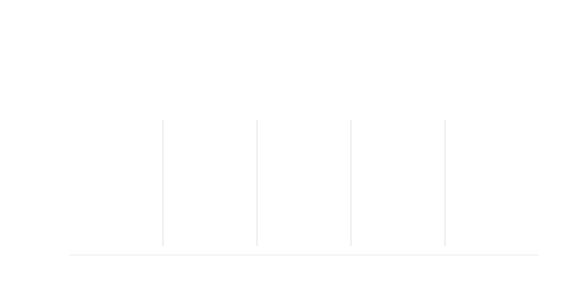


Median salary by age group
~~~~~~~~~~~~~~~~~~~~~~~~~~

Salary increases with age across all three regions, though not in a perfectly linear way. In North America, the 46–55 age group has a slightly lower median ($120,000) than the 36–45 group ($127,000), though the overall upward trend holds.

Europe shows a much flatter progression than North America — EU medians rise only from $62,130 (26–35) to $72,499 (46–55), compared to $94,000 to $139,500 over the same span in North America.

The 18–25 age group is below the 30-respondent threshold in all regions, and is excluded from the Europe breakdown (fewer than 10 respondents). The 56–65 group is also excluded from Europe for the same reason. Respondents aged 66 or older are not included in any breakdown; with only 8 worldwide, no region met the minimum threshold.

.. raw:: html

   
<input type="radio" id="tabG1age-1" name="tabGroupG1age" class="tab" checked><label for="tabG1age-1">Worldwide</label><input type="radio" id="tabG1age-2" name="tabGroupG1age" class="tab"><label for="tabG1age-2">North America</label><input type="radio" id="tabG1age-3" name="tabGroupG1age" class="tab"><label for="tabG1age-3">Europe</label>

.. table:: Salary (USD) by age group
   :name: tbl-2025-salary-by-age-group
   :widths: 36 10 18 18 18
   :class: medians-with-num sortable

   +-----------+-----+----------+----------+----------+
   | Age group | |N| | |25|     | |50|     | |75|     |
   +===========+=====+==========+==========+==========+
   | |1| 18-25 | 24  |       -- |  $72,713 |       -- |
   +-----------+-----+----------+----------+----------+
   | |2| 26-35 | 205 |  $54,338 |  $74,000 | $110,711 |
   +-----------+-----+----------+----------+----------+
   | |3| 36-45 | 239 |  $62,130 |  $93,081 | $135,800 |
   +-----------+-----+----------+----------+----------+
   | |4| 46-55 | 124 |  $77,103 | $104,192 | $148,527 |
   +-----------+-----+----------+----------+----------+
   | |5| 56-65 | 65  |  $91,233 | $125,200 | $171,650 |
   +-----------+-----+----------+----------+----------+

.. raw:: html

   

.. table:: Salary (USD) by age group — North America
   :name: tbl-2025-salary-by-age-group-north-america
   :widths: 36 10 18 18 18
   :class: medians-with-num sortable

   +-----------+-----+----------+----------+----------+
   | Age group | |N| | |25|     | |50|     | |75|     |
   +===========+=====+==========+==========+==========+
   | |1| 18-25 | 17  |       -- |  $78,000 |       -- |
   +-----------+-----+----------+----------+----------+
   | |2| 26-35 | 112 |  $74,000 |  $94,000 | $148,272 |
   +-----------+-----+----------+----------+----------+
   | |3| 36-45 | 126 |  $91,750 | $127,000 | $156,500 |
   +-----------+-----+----------+----------+----------+
   | |4| 46-55 | 79  |  $99,410 | $120,000 | $160,000 |
   +-----------+-----+----------+----------+----------+
   | |5| 56-65 | 50  | $110,825 | $139,500 | $188,748 |
   +-----------+-----+----------+----------+----------+

.. raw:: html

   

.. table:: Salary (USD) by age group — Europe
   :name: tbl-2025-salary-by-age-group-europe
   :widths: 36 10 18 18 18
   :class: medians-with-num sortable

   +-----------+-----+----------+----------+----------+
   | Age group | |N| | |25|     | |50|     | |75|     |
   +===========+=====+==========+==========+==========+
   | |1| 26-35 | 63  |  $47,444 |  $62,130 |  $83,044 |
   +-----------+-----+----------+----------+----------+
   | |2| 36-45 | 77  |  $50,833 |  $70,037 |  $92,290 |
   +-----------+-----+----------+----------+----------+
   | |3| 46-55 | 33  |  $57,704 |  $72,499 | $101,360 |
   +-----------+-----+----------+----------+----------+

.. raw:: html

   

.. raw:: html

   <figure>
      <object role="img" aria-label="Median salary (USD) by age group" aria-describedby="figure_salary-by-age-group_desc" type="image/svg+xml" data="/_images/2025-salary-by-age-group-v2.svg">
         
Line chart showing median salary by age group for worldwide, North America, and Europe. Salary generally increases with age, with North America significantly higher than Europe across all age groups.

      </object>
      <figcaption>Figure: Median salary (USD) by age group</figcaption>
   </figure>

Median salary by education level
~~~~~~~~~~~~~~~~~~~~~~~~~~~~~~~~~

Worldwide, graduate respondents had the highest median salary ($99,410), appearing to outperform post-graduate respondents ($86,450). This seems counterintuitive, but is probably a composition effect rather than a genuine finding — graduate respondents are concentrated in North America (66% of that group), while post-graduate respondents are more globally distributed (52% in NA). Within each region individually, the gap narrows to near-zero: in North America, graduates earned $118,500 and post-graduates $119,500; in Europe, graduates earned $64,022 and post-graduates $67,350. Both regional breakdowns show post-graduate slightly ahead.

The Europe tab covers only three education levels — graduate, post-graduate, and multiple post-graduate — as the other categories had fewer than 10 respondents in the region. Worldwide, 32 respondents who declined to provide an education level are excluded from all breakdowns.

.. raw:: html

   
<input type="radio" id="tabG4edu-1" name="tabGroupG4edu" class="tab" checked><label for="tabG4edu-1">Worldwide</label><input type="radio" id="tabG4edu-2" name="tabGroupG4edu" class="tab"><label for="tabG4edu-2">North America</label><input type="radio" id="tabG4edu-3" name="tabGroupG4edu" class="tab"><label for="tabG4edu-3">Europe</label>

.. table:: Salary (USD) by education level
   :name: tbl-2025-salary-by-education-level
   :widths: 36 10 18 18 18
   :class: medians-with-num sortable

   +-----------------------------+-----+----------+----------+----------+
   | Education level             | |N| | |25|     | |50|     | |75|     |
   +=============================+=====+==========+==========+==========+
   | |1| High school             | 23  |       -- |  $93,000 |       -- |
   +-----------------------------+-----+----------+----------+----------+
   | |2| Technical/vocational    | 16  |       -- |  $90,935 |       -- |
   +-----------------------------+-----+----------+----------+----------+
   | |3| Graduate                | 317 |  $64,731 |  $99,410 | $136,487 |
   +-----------------------------+-----+----------+----------+----------+
   | |4| Multiple graduate       | 22  |       -- |  $92,592 |       -- |
   +-----------------------------+-----+----------+----------+----------+
   | |5| Post-graduate           | 254 |  $62,327 |  $86,450 | $135,791 |
   +-----------------------------+-----+----------+----------+----------+
   | |6| Multiple post-graduate  | 32  |  $56,782 |  $85,426 | $126,550 |
   +-----------------------------+-----+----------+----------+----------+

.. raw:: html

      <figure>
         <object role="img" aria-label="Salary (USD) by education level" aria-describedby="figure_salary-by-education_desc" type="image/svg+xml" data="/_images/2025-salary-by-education-v2.svg">
            
Median salary chart showing worldwide salary by education level, with percentile ranges where sample sizes support them and median-only markers for smaller groups. Graduate has the highest worldwide median at about $99,000.

         </object>
         <figcaption>Figure: Salary (USD) by education level</figcaption>
      </figure>

   

.. table:: Salary (USD) by education level — North America
   :name: tbl-2025-salary-by-education-level-north-america
   :widths: 36 10 18 18 18
   :class: medians-with-num sortable

   +-----------------------------+-----+----------+----------+----------+
   | Education level             | |N| | |25|     | |50|     | |75|     |
   +=============================+=====+==========+==========+==========+
   | |1| High school             | 13  |       -- | $116,000 |       -- |
   +-----------------------------+-----+----------+----------+----------+
   | |2| Graduate                | 208 |  $90,108 | $118,500 | $156,796 |
   +-----------------------------+-----+----------+----------+----------+
   | |3| Multiple graduate       | 15  |       -- | $101,000 |       -- |
   +-----------------------------+-----+----------+----------+----------+
   | |4| Post-graduate           | 132 |  $85,026 | $119,500 | $160,809 |
   +-----------------------------+-----+----------+----------+----------+
   | |5| Multiple post-graduate  | 14  |       -- | $122,500 |       -- |
   +-----------------------------+-----+----------+----------+----------+

.. raw:: html

      <figure>
         <object role="img" aria-label="Salary (USD) by education level — North America" aria-describedby="figure_salary-by-education-na_desc" type="image/svg+xml" data="/_images/2025-salary-by-education-na-v2.svg">
            
Median salary chart showing North America salary by education level, with percentile ranges where sample sizes support them and median-only markers for smaller groups. The medians cluster between about $101,000 and $122,000.

         </object>
         <figcaption>Figure: Salary (USD) by education level — North America</figcaption>
      </figure>

   

.. table:: Salary (USD) by education level — Europe
   :name: tbl-2025-salary-by-education-level-europe
   :widths: 36 10 18 18 18
   :class: medians-with-num sortable

   +-----------------------------+-----+----------+----------+----------+
   | Education level             | |N| | |25|     | |50|     | |75|     |
   +=============================+=====+==========+==========+==========+
   | |1| Graduate                | 60  |  $47,625 |  $64,022 |  $98,151 |
   +-----------------------------+-----+----------+----------+----------+
   | |2| Post-graduate           | 92  |  $50,505 |  $67,350 |  $89,949 |
   +-----------------------------+-----+----------+----------+----------+
   | |3| Multiple post-graduate  | 13  |       -- |  $57,687 |       -- |
   +-----------------------------+-----+----------+----------+----------+

.. raw:: html

      <figure>
         <object role="img" aria-label="Salary (USD) by education level — Europe" aria-describedby="figure_salary-by-education-eu_desc" type="image/svg+xml" data="/_images/2025-salary-by-education-eu-v2.svg">
            
Median salary chart showing European salary by education level, with percentile ranges for graduate and post-graduate respondents and a median-only marker for multiple post-graduate respondents. Post-graduate is slightly higher than graduate.

         </object>
         <figcaption>Figure: Salary (USD) by education level — Europe</figcaption>
      </figure>

   



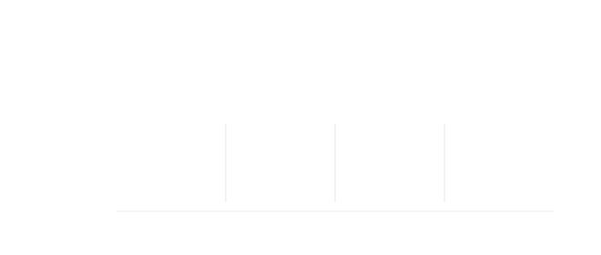

Median salary by organization size
~~~~~~~~~~~~~~~~~~~~~~~~~~~~~~~~~~

Salaries generally increase with the size of the organization, with the highest median salaries in organizations with more than 100,000 employees. The trend is not perfectly monotonic: globally and in North America, median salaries dip slightly for organizations in the 101–1,000 employee range before rising for larger ones. In Europe, salaries increase steadily from the 101–1,000 band upward, with the 10,001–100,000 employee category showing the highest recorded median among European respondents.

.. raw:: html

   
<input type="radio" id="tabD9943-1" name="tabGroupD9943" class="tab" checked><label for="tabD9943-1">Worldwide</label><input type="radio" id="tabD9943-2" name="tabGroupD9943" class="tab"><label for="tabD9943-2">North America</label><input type="radio" id="tabD9943-3" name="tabGroupD9943" class="tab"><label for="tabD9943-3">Europe</label>

.. table:: Salary (USD) by organization size
   :name: tbl-2025-salary-by-organization-size
   :widths: 36 10 18 18 18
   :class: medians-with-num sortable

   +------------------------+-----+---------+----------+----------+
   | Size                   | |N| | |25|    | |50|     | |75|     |
   +========================+=====+=========+==========+==========+
   | |1| 1-100              | 83  | $60,565 |  $81,000 | $138,500 |
   +------------------------+-----+---------+----------+----------+
   | |2| 101-1,000          | 243 | $55,307 |  $80,591 | $119,000 |
   +------------------------+-----+---------+----------+----------+
   | |3| 1,001-10,000       | 212 | $65,919 |  $95,000 | $121,625 |
   +------------------------+-----+---------+----------+----------+
   | |4| 10,001-100,000     | 102 | $90,385 | $121,000 | $161,317 |
   +------------------------+-----+---------+----------+----------+
   | |5| 100,000+           | 56  | $93,525 | $129,400 | $200,380 |
   +------------------------+-----+---------+----------+----------+

.. raw:: html

   

.. table:: Salary (USD) by organization size — North America
   :name: tbl-2025-salary-by-organization-size-north-america
   :widths: 36 10 18 18 18
   :class: medians-with-num sortable

   +------------------------+-----+----------+-----------+----------+
   | Size                   | |N| | |25|     | |50|      | |75|     |
   +========================+=====+==========+===========+==========+
   | |1| 1-100              | 41  | $92,000  | $120,000  | $175,000 |
   +------------------------+-----+----------+-----------+----------+
   | |2| 101-1,000          | 123 | $80,300  | $112,000  | $148,000 |
   +------------------------+-----+----------+-----------+----------+
   | |3| 1,001-10,000       | 132 | $84,972  | $104,474  | $145,250 |
   +------------------------+-----+----------+-----------+----------+
   | |4| 10,001-100,000     | 80  | $102,625 | $141,196  | $176,970 |
   +------------------------+-----+----------+-----------+----------+
   | |5| 100,000+           | 45  | $110,000 | $145,000  | $200,561 |
   +------------------------+-----+----------+-----------+----------+

.. raw:: html

   

.. table:: Salary (USD) by organization size — Europe
   :name: tbl-2025-salary-by-organization-size-europe
   :widths: 36 10 18 18 18
   :class: medians-with-num sortable

   +------------------------+-----+---------+---------+----------+
   | Size                   | |N| | |25|    | |50|    | |75|     |
   +========================+=====+=========+=========+==========+
   | |1| 1-100              | 28  |      -- | $63,801 |  --      |
   +------------------------+-----+---------+---------+----------+
   | |2| 101-1,000          | 87  | $46,083 | $62,130 | $83,883  |
   +------------------------+-----+---------+---------+----------+
   | |3| 1,001-10,000       | 49  | $56,481 | $72,716 | $102,300 |
   +------------------------+-----+---------+---------+----------+
   | |4| 10,001-100,000     | 11  |      -- | $90,370 |  --      |
   +------------------------+-----+---------+---------+----------+

.. raw:: html

   

.. raw:: html

   <figure>
      <object role="img" aria-label="Median salary (USD) by organization size" aria-describedby="figure_salary-by-org-size_desc" type="image/svg+xml" data="/_images/2025-salary-by-org-size-v2.svg">
         
Line chart showing how median salary increases with organization size, with separate lines for worldwide, North America, and Europe.

      </object>
      <figcaption>Figure: Median salary (USD) by organization size</figcaption>
   </figure>

Median salary by primary role category
~~~~~~~~~~~~~~~~~~~~~~~~~~~~~~~~~~~~~~

Among the five primary role categories with at least 10 respondents, DocOps practitioners had the highest median salary at $128,800. Technical writers — by far the most common primary role, with 539 respondents — had a median of $90,610. Developers or engineers, project or product managers, and editors all fell within a narrow range of $90,370 to $93,759. Role categories with fewer than 10 respondents are not shown.

25th and 75th percentile figures are only available for the technical writer category, which was the only primary role category with at least 30 respondents. The DocOps result ($128,800) is based on 14 respondents and should be treated as indicative rather than definitive.

.. table:: Salary (USD) by primary role category
   :name: tbl-2025-salary-by-primary-role-category
   :widths: 36 10 18 18 18
   :class: medians-with-num sortable

   +--------------------------------+-----+----------+----------+----------+
   | Role category                  | |N| | |25|     | |50|     | |75|     |
   +================================+=====+==========+==========+==========+
   | |1| DocOps                     | 14  |       -- | $128,800 |       -- |
   +--------------------------------+-----+----------+----------+----------+
   | |2| Developer or engineer      | 11  |       -- |  $93,759 |       -- |
   +--------------------------------+-----+----------+----------+----------+
   | |3| Project or product manager | 19  |       -- |  $91,811 |       -- |
   +--------------------------------+-----+----------+----------+----------+
   | |4| Technical writer           | 539 |  $62,355 |  $90,610 | $135,005 |
   +--------------------------------+-----+----------+----------+----------+
   | |5| Editor                     | 17  |       -- |  $90,370 |       -- |
   +--------------------------------+-----+----------+----------+----------+

.. raw:: html

   <figure>
      <object role="img" aria-label="Salary (USD) by primary role category" aria-describedby="figure_salary-by-primary-role-category_desc" type="image/svg+xml" data="/_images/2025-salary-by-primary-role-category-v2.svg">
         
Median salary chart showing salary by primary role category, with a percentile range shown for technical writers and median-only markers for the other categories. DocOps has the highest median at about $128,000.

      </object>
      <figcaption>Figure: Salary (USD) by primary role category</figcaption>
   </figure>


Median salary by number of additional role categories
~~~~~~~~~~~~~~~~~~~~~~~~~~~~~~~~~~~~~~~~~~~~~~~~~~~~~

Respondents who performed a wider range of roles tended to earn more, and this pattern holds across all three regions. Worldwide, those with no additional role categories had a median salary of $68,720, compared to $108,000 for those with six or more — a 57% difference. In North America the gradient is steeper: from $95,000 (no additional roles) to $137,500 (six or more). In Europe the range is more compressed, rising from $57,115 to $74,792, with the 1–2 and 3–5 groups nearly identical at around $65,000–$66,000.

This pattern likely reflects experience as a confounding factor: practitioners with more years in the field tend both to take on broader responsibilities and to command higher salaries. The data cannot distinguish between the two effects, but the relationship is clear and consistent across regions.

.. raw:: html

   
<input type="radio" id="tabA4roles-1" name="tabGroupA4roles" class="tab" checked><label for="tabA4roles-1">Worldwide</label><input type="radio" id="tabA4roles-2" name="tabGroupA4roles" class="tab"><label for="tabA4roles-2">North America</label><input type="radio" id="tabA4roles-3" name="tabGroupA4roles" class="tab"><label for="tabA4roles-3">Europe</label>

.. table:: Salary (USD) by number of additional role categories
   :name: tbl-2025-salary-by-additional-role-categories
   :widths: 36 10 18 18 18
   :class: medians-with-num sortable

   +----------------------------+-----+----------+----------+----------+
   | Additional role categories | |N| | |25|     | |50|     | |75|     |
   +============================+=====+==========+==========+==========+
   | |1| None                   | 47  |  $42,128 |  $68,720 |  $95,000 |
   +----------------------------+-----+----------+----------+----------+
   | |2| 1-2                    | 133 |  $58,314 |  $88,111 | $130,000 |
   +----------------------------+-----+----------+----------+----------+
   | |3| 3-5                    | 286 |  $63,473 |  $90,692 | $124,125 |
   +----------------------------+-----+----------+----------+----------+
   | |4| 6 or more              | 201 |  $72,250 | $108,000 | $150,620 |
   +----------------------------+-----+----------+----------+----------+

.. raw:: html

   

.. table:: Salary (USD) by number of additional role categories — North America
   :name: tbl-2025-salary-by-additional-role-categories-north-america
   :widths: 36 10 18 18 18
   :class: medians-with-num sortable

   +----------------------------+-----+----------+----------+----------+
   | Additional role categories | |N| | |25|     | |50|     | |75|     |
   +============================+=====+==========+==========+==========+
   | |1| None                   | 19  |       -- |  $95,000 |       -- |
   +----------------------------+-----+----------+----------+----------+
   | |2| 1-2                    | 74  |  $82,444 | $104,146 | $158,046 |
   +----------------------------+-----+----------+----------+----------+
   | |3| 3-5                    | 167 |  $86,400 | $118,000 | $145,000 |
   +----------------------------+-----+----------+----------+----------+
   | |4| 6 or more              | 131 |  $95,000 | $137,500 | $180,000 |
   +----------------------------+-----+----------+----------+----------+

.. raw:: html

   

.. table:: Salary (USD) by number of additional role categories — Europe
   :name: tbl-2025-salary-by-additional-role-categories-europe
   :widths: 36 10 18 18 18
   :class: medians-with-num sortable

   +----------------------------+-----+----------+----------+----------+
   | Additional role categories | |N| | |25|     | |50|     | |75|     |
   +============================+=====+==========+==========+==========+
   | |1| None                   | 15  |       -- |  $57,115 |       -- |
   +----------------------------+-----+----------+----------+----------+
   | |2| 1-2                    | 38  |  $50,268 |  $65,066 |  $95,470 |
   +----------------------------+-----+----------+----------+----------+
   | |3| 3-5                    | 81  |  $47,982 |  $65,908 |  $86,331 |
   +----------------------------+-----+----------+----------+----------+
   | |4| 6 or more              | 50  |  $51,931 |  $74,792 | $100,728 |
   +----------------------------+-----+----------+----------+----------+

.. raw:: html

   

.. raw:: html

   <figure>
      <object role="img" aria-label="Median salary (USD) by number of additional role categories" aria-describedby="figure_salary-by-additional-role-categories_desc" type="image/svg+xml" data="/_images/2025-salary-by-additional-role-categories-v2.svg">
         
Line chart showing median salary by number of additional role categories for worldwide, North America, and Europe. All three regions show an upward trend, with North America significantly higher than Europe across all groups.

      </object>
      <figcaption>Figure: Median salary (USD) by number of additional role categories</figcaption>
   </figure>

Median salary by industry
~~~~~~~~~~~~~~~~~~~~~~~~~

Salary varies substantially across industries, from a worldwide median of $78,500 in finance to $140,391 in advertising. However, the industry breakdown has two limitations worth noting.

First, respondents could select multiple industries — the same person may be counted in several industry categories. Second, some industries have a strong geographic concentration that inflates or deflates their worldwide median. Advertising is the clearest example: 31 of its 39 worldwide respondents are in North America, so its $140,391 worldwide median largely reflects North American salary levels rather than a true global industry premium.

The Worldwide tab below shows the 10 most common industries reported in the 2025 results. The North America tab shows all 10 industries, with advertising ($158,000) and data/analytics ($157,394) having the highest medians. The Europe tab covers the 7 industries with at least 10 European respondents; advertising, government, and healthcare fall below that threshold.

.. raw:: html

   
<input type="radio" id="tabF3ind-1" name="tabGroupF3ind" class="tab" checked><label for="tabF3ind-1">Worldwide</label><input type="radio" id="tabF3ind-2" name="tabGroupF3ind" class="tab"><label for="tabF3ind-2">North America</label><input type="radio" id="tabF3ind-3" name="tabGroupF3ind" class="tab"><label for="tabF3ind-3">Europe</label>

.. table:: Salary (USD) by industry
   :name: tbl-2025-salary-by-industry
   :widths: 36 10 18 18 18
   :class: medians-with-num sortable

   +-----------------------+-----+----------+----------+----------+
   | Industry              | |N| | |25|     | |50|     | |75|     |
   +=======================+=====+==========+==========+==========+
   | |1| Advertising       | 39  |  $89,516 | $140,391 | $193,200 |
   +-----------------------+-----+----------+----------+----------+
   | |2| Data/analytics    | 70  |  $71,884 | $113,930 | $172,306 |
   +-----------------------+-----+----------+----------+----------+
   | |3| Security          | 58  |  $72,037 | $105,002 | $145,234 |
   +-----------------------+-----+----------+----------+----------+
   | |4| Software          | 314 |  $65,886 |  $94,334 | $143,022 |
   +-----------------------+-----+----------+----------+----------+
   | |5| Telecoms          | 163 |  $61,973 |  $93,600 | $143,086 |
   +-----------------------+-----+----------+----------+----------+
   | |6| Business services | 42  |  $75,295 |  $91,000 | $136,250 |
   +-----------------------+-----+----------+----------+----------+
   | |7| Government        | 25  |       -- |  $89,516 |       -- |
   +-----------------------+-----+----------+----------+----------+
   | |8| Healthcare        | 50  |  $69,346 |  $88,334 | $110,223 |
   +-----------------------+-----+----------+----------+----------+
   | |9| Manufacturing     | 54  |  $65,386 |  $86,819 | $117,403 |
   +-----------------------+-----+----------+----------+----------+
   | |10| Finance          | 94  |  $57,254 |  $78,500 | $112,418 |
   +-----------------------+-----+----------+----------+----------+

.. raw:: html

      <figure>
         <object role="img" aria-label="Salary (USD) by industry" aria-describedby="figure_salary-by-industry_desc" type="image/svg+xml" data="/_images/2025-salary-by-industry-v2.svg">
            
Median salary chart showing worldwide salary by industry, with percentile ranges for most industries and a median-only marker for government. Advertising leads at about $140,000, while finance is lowest at about $78,000.

         </object>
         <figcaption>Figure: Salary (USD) by industry</figcaption>
      </figure>

   

.. table:: Salary (USD) by industry — North America
   :name: tbl-2025-salary-by-industry-north-america
   :widths: 36 10 18 18 18
   :class: medians-with-num sortable

   +-----------------------+-----+----------+----------+----------+
   | Industry              | |N| | |25|     | |50|     | |75|     |
   +=======================+=====+==========+==========+==========+
   | |1| Advertising       | 31  | $105,480 | $158,000 | $200,000 |
   +-----------------------+-----+----------+----------+----------+
   | |2| Data/analytics    | 45  | $108,446 | $157,394 | $200,155 |
   +-----------------------+-----+----------+----------+----------+
   | |3| Security          | 30  | $111,723 | $140,500 | $171,250 |
   +-----------------------+-----+----------+----------+----------+
   | |4| Telecoms          | 90  |  $93,450 | $140,000 | $180,250 |
   +-----------------------+-----+----------+----------+----------+
   | |5| Software          | 173 |  $89,714 | $128,600 | $169,889 |
   +-----------------------+-----+----------+----------+----------+
   | |6| Business services | 26  |       -- | $112,946 |       -- |
   +-----------------------+-----+----------+----------+----------+
   | |7| Finance           | 47  |  $80,000 | $105,000 | $150,000 |
   +-----------------------+-----+----------+----------+----------+
   | |8| Manufacturing     | 33  |  $79,800 |  $93,000 | $125,000 |
   +-----------------------+-----+----------+----------+----------+
   | |9| Government        | 21  |       -- |  $92,000 |       -- |
   +-----------------------+-----+----------+----------+----------+
   | |10| Healthcare       | 42  |  $71,956 |  $90,215 | $113,750 |
   +-----------------------+-----+----------+----------+----------+

.. raw:: html

      <figure>
         <object role="img" aria-label="Salary (USD) by industry — North America" aria-describedby="figure_salary-by-industry-na_desc" type="image/svg+xml" data="/_images/2025-salary-by-industry-na-v2.svg">
            
Median salary chart showing North America salary by industry, with percentile ranges for most industries and median-only markers for business services and government. Advertising and data/analytics are nearly tied at the top.

         </object>
         <figcaption>Figure: Salary (USD) by industry — North America</figcaption>
      </figure>

   

.. table:: Salary (USD) by industry — Europe
   :name: tbl-2025-salary-by-industry-europe
   :widths: 36 10 18 18 18
   :class: medians-with-num sortable

   +-----------------------+-----+----------+----------+----------+
   | Industry              | |N| | |25|     | |50|     | |75|     |
   +=======================+=====+==========+==========+==========+
   | |1| Business services | 10  |       -- |  $82,188 |       -- |
   +-----------------------+-----+----------+----------+----------+
   | |2| Security          | 17  |       -- |  $72,716 |       -- |
   +-----------------------+-----+----------+----------+----------+
   | |3| Manufacturing     | 18  |       -- |  $70,609 |       -- |
   +-----------------------+-----+----------+----------+----------+
   | |4| Software          | 97  |  $51,686 |  $67,778 |  $93,759 |
   +-----------------------+-----+----------+----------+----------+
   | |5| Finance           | 26  |       -- |  $67,642 |       -- |
   +-----------------------+-----+----------+----------+----------+
   | |6| Data/analytics    | 19  |       -- |  $65,908 |       -- |
   +-----------------------+-----+----------+----------+----------+
   | |7| Telecoms          | 51  |  $47,878 |  $60,052 |  $84,722 |
   +-----------------------+-----+----------+----------+----------+

.. raw:: html

      <figure>
         <object role="img" aria-label="Salary (USD) by industry — Europe" aria-describedby="figure_salary-by-industry-eu_desc" type="image/svg+xml" data="/_images/2025-salary-by-industry-eu-v2.svg">
            
Median salary chart showing European salary by industry, with percentile ranges for software and telecoms and median-only markers for the other industries. The range is compressed compared with North America.

         </object>
         <figcaption>Figure: Salary (USD) by industry — Europe</figcaption>
      </figure>

   



Median salary by multinational status
~~~~~~~~~~~~~~~~~~~~~~~~~~~~~~~~~~~~~~

Respondents at multinational organizations had a worldwide median salary of $95,184, compared to $74,912 for those at domestic-only organizations — a gap of 27%. This difference should be interpreted cautiously: it reflects a mix of genuine organizational factors (multinationals may offer stronger compensation packages) and geographic composition (domestic organizations are disproportionately located in lower-wage countries, while multinationals are more concentrated in high-wage markets like North America).

.. table:: Salary (USD) by multinational status
   :name: tbl-2025-salary-by-multinational-status
   :widths: 36 10 18 18 18
   :class: medians-with-num sortable

   +-------------------+-----+----------+----------+----------+
   | Organization type | |N| | |25|     | |50|     | |75|     |
   +===================+=====+==========+==========+==========+
   | |1| Multinational | 545 |  $65,612 |  $95,184 | $142,000 |
   +-------------------+-----+----------+----------+----------+
   | |2| Domestic only | 122 |  $54,122 |  $74,912 | $104,138 |
   +-------------------+-----+----------+----------+----------+

Employee satisfaction
---------------------

.. raw:: html

   

What we asked

.. container:: question

   |icon-question|

   **Considering only your salary and benefits, rate your level of satisfaction:**

   - Very unsatisfied
   - Unsatisfied
   - Neutral
   - Satisfied
   - Very satisfied

   **Considering your overall employment conditions - separate from your salary and benefits - rate your level of satisfaction:**

   - Very unsatisfied
   - Unsatisfied
   - Neutral
   - Satisfied
   - Very satisfied

.. raw:: html

   

66.0% of employee respondents said they were satisfied (45.4%) or very satisfied (20.6%) with their salary and benefits, while a slightly lower percentage (65.7%) said they were satisfied (44.3%) or very satisfied (21.4%) with their overall employment conditions.

.. container:: note

   |icon-info|

   .. rubric:: Compared with 2024

   Employee satisfaction was lower in 2025 than in 2024. The share of respondents who reported feeling satisfied or very
   satisfied with their salary and benefits fell from **71.8%** in 2024 to **66.0%** in 2025, while the share who felt
   satisfied or very satisfied with their overall employment conditions fell from **71.3%** to **65.7%**. The decline was
   slightly larger for overall employment conditions than for salary and benefits specifically.

.. raw:: html

   
<input type="radio" id="tabF1a-1" name="tabGroupF1a" class="tab" checked><label for="tabF1a-1">Salary</label><input type="radio" id="tabF1a-2" name="tabGroupF1a" class="tab"><label for="tabF1a-2">Overall</label>

.. table:: Salary satisfaction
   :widths: 80 10 10
   :name: tbl-2025-employee-salary-satisfaction
   :class: std3col sortable

   +-------------------------+--------+--------+
   | Satisfaction            | |N|    | |%|    |
   +=========================+========+========+
   | |2| Satisfied           | 322    | 45.4%  |
   +-------------------------+--------+--------+
   | |1| Very satisfied      | 146    | 20.6%  |
   +-------------------------+--------+--------+
   | |3| Neutral             | 122    | 17.2%  |
   +-------------------------+--------+--------+
   | |4| Unsatisfied         | 99     | 14.0%  |
   +-------------------------+--------+--------+
   | |5| Very unsatisfied    | 20     | 2.8%   |
   +-------------------------+--------+--------+

.. raw:: html

   <figure>
      <object role="img" aria-label="Salary satisfaction" aria-describedby="figure_salary-satisfaction_desc" type="image/svg+xml" data="/_images/2025-salary-satisfaction-v2.svg">
         
Donut chart showing employee salary satisfaction.

      </object>
      <figcaption>Figure: Salary satisfaction</figcaption>
   </figure>

.. raw:: html

   

.. table:: Overall satisfaction
   :widths: 80 10 10
   :name: tbl-2025-employee-overall-satisfaction
   :class: std3col sortable

   +--------------------------+--------+--------+
   | Satisfaction             | |N|    | |%|    |
   +==========================+========+========+
   | |2| Satisfied            | 314    | 44.3%  |
   +--------------------------+--------+--------+
   | |1| Very satisfied       | 152    | 21.4%  |
   +--------------------------+--------+--------+
   | |3| Neutral              | 114    | 16.1%  |
   +--------------------------+--------+--------+
   | |4| Unsatisfied          | 105    | 14.8%  |
   +--------------------------+--------+--------+
   | |5| Very unsatisfied     | 24     | 3.4%   |
   +--------------------------+--------+--------+

.. raw:: html

   <figure>
      <object role="img" aria-label="Overall satisfaction — employees" aria-describedby="figure_overall-satisfaction_desc" type="image/svg+xml" data="/_images/2025-overall-satisfaction-employees-v2.svg">
         
Donut chart showing employee overall satisfaction.

      </object>
      <figcaption>Figure: Overall satisfaction — employees</figcaption>
   </figure>

.. raw:: html

   

Factors affecting salary satisfaction
-------------------------------------

.. raw:: html

   

What we asked

.. container:: question

   |icon-question|

   **How strongly do you agree with the following statements about your salary and benefits?**

   - I'm paid fairly
   - My salary keeps up with inflation / cost-of-living
   - My benefits are sufficient

   **How strongly do you agree with the following statements about your job?**

   - My hours are reasonable
   - I have flexibility in my hours
   - My responsibilities are reasonable
   - My workload is manageable
   - I have opportunities for career advancement
   - I have opportunities for professional development
   - My work is sufficiently interesting/challenging
   - I'm satisfied with the systems and toolsets I use

   **How strongly do you agree with the following statements about your workplace (remote, on-site or hybrid environment)?**

   - I have flexibility in my work location
   - Our remote work systems, tools and practices function well
   - Our on-site work systems, tools and practices function well
   - Our hybrid work systems, tools and practices function well

   **How strongly do you agree with the following statements about your team and organization?**

   - To my knowledge, salaries are consistent across similar roles
   - To my knowledge, all genders are paid equally
   - My role is sufficiently valued/funded
   - I like and/or respect my managers and team leaders
   - I like and/or respect my co-workers
   - I like and/or respect my organization
   - I'm satisfied with our methodologies, systems and practices

.. raw:: html

   

   

Question background

.. container:: question

   |icon-info|

   This question was overhauled in 2024 to be more positive in outlook, and to capture a fuller spectrum of attitudes. Rather than asking respondents to choose from a list of factors that may affect their satisfaction, we asked them to rate their agreement with a series of statements about their salary and benefits, job, workplace, team and organization.

.. raw:: html

   

Across all categories, the clearest pattern is how positively respondents feel about their colleagues: 90.5% agreed they like and/or respect their co-workers, 75.5% their managers and team leaders, and 61.5% their organization. The most common concerns were salary not keeping pace with inflation (37.9% disagreed) and workload manageability (17.8% disagreed).

Respondents who indicated that the statement was not relevant to their situation were excluded from the analysis.

.. raw:: html

   
<input type="radio" id="tabF71a-1" name="tabGroupF71a" class="tab" checked><label for="tabF71a-1">Salary</label><input type="radio" id="tabF71a-2" name="tabGroupF71a" class="tab"><label for="tabF71a-2">Job</label><input type="radio" id="tabF71a-3" name="tabGroupF71a" class="tab"><label for="tabF71a-3">Workplace</label><input type="radio" id="tabF71a-4" name="tabGroupF71a" class="tab"><label for="tabF71a-4">Team</label>

.. table:: Satisfaction statements — salary and benefits
   :widths: 55 15 15 15
   :name: tbl-2025-satisfaction-statements-salary-benefits
   :class: sortable statements

   +----------------------------------------------------+----------+---------+----------+
   | Statements                                         | Agree    | Neutral | Disagree |
   +====================================================+==========+=========+==========+
   | I'm paid fairly                                    |    63.0% |   17.6% |    19.3% |
   +----------------------------------------------------+----------+---------+----------+
   | My salary keeps up with inflation / cost-of-living |    41.5% |   20.6% |    37.9% |
   +----------------------------------------------------+----------+---------+----------+
   | My benefits are sufficient                         |    67.4% |   16.3% |    16.3% |
   +----------------------------------------------------+----------+---------+----------+

.. raw:: html

   <figure>
      <object role="img" aria-label="Satisfaction factors — salary and benefits — employees" aria-describedby="figure_satisfaction-factors-salary-employees_desc" type="image/svg+xml" data="/_images/2025-satisfaction-factors-salary-employees-v2.svg">
         
Horizontal bar chart showing levels of agreement with statements about respondents' salary and benefits.

      </object>
      <figcaption>Figure: Satisfaction factors — salary and benefits — employees</figcaption>
   </figure>

.. raw:: html

   

.. table:: Satisfaction statements — job
   :widths: 55 15 15 15
   :name: tbl-2025-satisfaction-statements-job
   :class: sortable statements

   +---------------------------------------------------+----------+---------+----------+
   | Statements                                        | Agree    | Neutral | Disagree |
   +===================================================+==========+=========+==========+
   | My hours are reasonable                           |    86.7% |    6.2% |     7.1% |
   +---------------------------------------------------+----------+---------+----------+
   | I have flexibility in my hours                    |    90.7% |    5.2% |     4.1% |
   +---------------------------------------------------+----------+---------+----------+
   | My responsibilities are reasonable                |    75.5% |   11.7% |    12.8% |
   +---------------------------------------------------+----------+---------+----------+
   | My workload is manageable                         |    65.8% |   16.4% |    17.8% |
   +---------------------------------------------------+----------+---------+----------+
   | I have opportunities for career advancement       |    38.1% |   25.7% |    36.1% |
   +---------------------------------------------------+----------+---------+----------+
   | I have opportunities for professional development |    60.6% |   19.7% |    19.7% |
   +---------------------------------------------------+----------+---------+----------+
   | My work is sufficiently interesting / challenging |    70.5% |   17.9% |    11.6% |
   +---------------------------------------------------+----------+---------+----------+
   | I'm satisfied with the systems and toolsets I use |    55.4% |   21.3% |    23.3% |
   +---------------------------------------------------+----------+---------+----------+

.. raw:: html

   <figure>
      <object role="img" aria-label="Satisfaction factors — overall job — employees" aria-describedby="figure_satisfaction-factors-job-employees_desc" type="image/svg+xml" data="/_images/2025-satisfaction-factors-job-employees-v2.svg">
         
Horizontal bar chart showing levels of agreement with statements about respondents' overall job situation.

      </object>
      <figcaption>Figure: Satisfaction factors — overall job — employees</figcaption>
   </figure>


.. raw:: html

   

.. table:: Satisfaction statements — workplace
   :widths: 55 15 15 15
   :name: tbl-2025-satisfaction-statements-workplace
   :class: sortable statements

   +-------------------------------------------------------------+----------+---------+----------+
   | Statements                                                  | Agree    | Neutral | Disagree |
   +=============================================================+==========+=========+==========+
   | I have flexibility in my work location                      |    75.8% |    7.6% |    16.6% |
   +-------------------------------------------------------------+----------+---------+----------+
   | Our remote work systems, tools and practices function well  |    85.4% |    8.8% |     5.9% |
   +-------------------------------------------------------------+----------+---------+----------+
   | Our on-site work systems, tools and practices function well |    72.7% |   19.0% |     8.2% |
   +-------------------------------------------------------------+----------+---------+----------+
   | Our hybrid work systems, tools and practices function well  |    72.7% |   19.1% |     8.2% |
   +-------------------------------------------------------------+----------+---------+----------+

.. raw:: html

   <figure>
      <object role="img" aria-label="Satisfaction factors — workplace — employees" aria-describedby="figure_satisfaction-factors-workplace-employees_desc" type="image/svg+xml" data="/_images/2025-satisfaction-factors-workplace-employees-v2.svg">
         
Horizontal bar chart showing levels of agreement with statements about respondents' workplace.

      </object>
      <figcaption>Figure: Satisfaction factors — workplace — employees</figcaption>
   </figure>

.. raw:: html

   

.. table:: Satisfaction statements — team and organization
   :widths: 46 12 12 12 18
   :name: tbl-2025-satisfaction-statements-team-organization
   :class: sortable statements

   +---------------------------------------------------------------+----------+---------+----------+------------+
   | Statements                                                    | Agree    | Neutral | Disagree | Don't know |
   +===============================================================+==========+=========+==========+============+
   | To my knowledge, salaries are consistent across similar roles |    33.7% |   12.8% |    18.2% |      35.3% |
   +---------------------------------------------------------------+----------+---------+----------+------------+
   | To my knowledge, all genders are paid equally                 |    39.1% |   10.3% |    10.9% |      39.8% |
   +---------------------------------------------------------------+----------+---------+----------+------------+
   | My role is sufficiently valued/funded                         |    48.7% |   18.6% |    32.7% |         -- |
   +---------------------------------------------------------------+----------+---------+----------+------------+
   | I like and/or respect my managers and team leaders            |    75.5% |   12.8% |    11.7% |         -- |
   +---------------------------------------------------------------+----------+---------+----------+------------+
   | I like and/or respect my co-workers                           |    90.5% |    6.1% |     3.4% |         -- |
   +---------------------------------------------------------------+----------+---------+----------+------------+
   | I like and/or respect my organization                         |    61.5% |   24.4% |    14.2% |         -- |
   +---------------------------------------------------------------+----------+---------+----------+------------+
   | I'm satisfied with our methodologies, systems and practices   |    43.9% |   27.6% |    28.5% |         -- |
   +---------------------------------------------------------------+----------+---------+----------+------------+

.. raw:: html

   <figure>
      <object role="img" aria-label="Satisfaction factors — team and organization — employees" aria-describedby="figure_satisfaction-factors-team-employees_desc" type="image/svg+xml" data="/_images/2025-satisfaction-factors-team-employees-v2.svg">
         
Horizontal bar chart showing levels of agreement with statements about respondents' team and organization.

      </object>
      <figcaption>Figure: Satisfaction factors — team and organization — employees</figcaption>
   </figure>


.. raw:: html

   

Contract rates
==============

This section covers contract work types, rates, satisfaction with earnings, and confidence in the market for new work.

To protect the privacy of our community, we do not publish median salary figures for any region or category with fewer than 10 respondents. In regions or categories that meet the minimum threshold of 30 respondents, we're also providing the |25th| percentile (the value below which 25% of the data falls) and |75th| percentile (the value below which 75% of the data falls).

The 2025 survey received 80 contractor responses. This number is too low, and the respondents too geographically diverse, to determine median rates except for the very largest regions (North America and Europe).

.. contents:: In this section
   :local:
   :depth: 1
   :backlinks: none
   :class: boxed

Preferred term
--------------

.. raw:: html

   

What we asked

.. container:: question

   |icon-question|

   **What's your preferred term to describe the kind of work you do?**

   - I consider myself a contractor
   - I consider myself a freelancer
   - I consider myself self-employed
   - I prefer a different term (please specify)

.. raw:: html

   

   

Question background

.. container:: question

   |icon-info|

   In the first few surveys, we often struggled with the wording to describe the group of respondents who are not employees — "contractors, freelance operators, and self-employed people" is cumbersome. While we often used "contractor" as a catch-all shorthand term, we were aware that this might not be the preferred term for everyone.

   In 2023, we asked respondents who are not employees what term they prefer to describe the kind of work they do. The results from that year indicated that "contractor" was the most widely-used term, so that's what we used as a shorthand term throughout 2023's results and in the survey form for 2024.

   We'll continue to ask this question in future surveys to ensure that we're using the most appropriate term.

.. raw:: html

   

68.8% of non-employee respondents termed themselves "contractors", while 12.5% preferred "self-employed" and 11.2% used "freelancer". Of the 6 individuals who chose "other", 2 specified "consultant", and the remaining four described themselves variously as "legally a contractor but factually an employee", "a business owner", "someone who doesn't differentiate between terms", and "a student employee".

.. table:: Preferred term
   :widths: 80 10 10
   :name: tbl-2025-contractor-preferred-term
   :class: std3col sortable

   +---------------------+-----------+-----------+
   | Term                | |N|       | |%|       |
   +=====================+===========+===========+
   | Contractor          | 55        | 68.8%     |
   +---------------------+-----------+-----------+
   | Self-employed       | 10        | 12.5%     |
   +---------------------+-----------+-----------+
   | Freelancer          | 9         | 11.2%     |
   +---------------------+-----------+-----------+
   | Other               | 6         | 7.5%      |
   +---------------------+-----------+-----------+

.. raw:: html

   <figure>
      <object role="img" aria-label="Preferred term — contractors" aria-describedby="figure_contractor-preferred-term_desc" type="image/svg+xml" data="/_images/2025-contractor-preferred-term-v2.svg">
         
Donut chart showing preferred term for contractors.

      </object>
      <figcaption>Figure: Preferred term — contractors</figcaption>
   </figure>

Type of contract work
---------------------

.. raw:: html

   

What we asked

.. container:: question

   |icon-question|

   **What kind of contract, freelance or self-employed work do you typically engage in?** Check all that apply.

   - I work for multiple clients at the same time
   - I work for one client at a time
   - I work on short-term projects (days or weeks)
   - I work on medium-term projects (1 to 6 months)
   - I work on long-term projects (6 to 12 months or longer)
   - I offer a specific product or products
   - I offer a specific service or services
   - I work as a contractor or freelance to supplement my regular employment income
   - I work as a contractor or freelance as a stopgap while looking for permanent employment
   - I work as a contractor or freelance with a view to securing permanent employment with the same organization
   - Other (please specify)

.. raw:: html

   

Illustrating how varied contractor working situations are, out of the 80 total contractor respondents, there were 51 different combinations of client type, contract or project type, and product or service offering.

Because the question allowed multiple selections, "not specified" in the breakdowns below means the respondent did not tick any option in that dimension.

57.5% of contractor respondents indicated that they worked only with a single client at a time. Another 23.8% indicated that they worked with multiple clients concurrently. 6.2% worked at times for either a single client or multiple clients, and 12.5% did not indicate whether they worked for a single client or multiple.

30.1% of contractor respondents reported working exclusively on long-term contracts (6-12 months or longer), while 28.7% did not specify a typical contract length. Mixed contract lengths were reported by 25.0%, with 10.0% working exclusively on short-term contracts (days or weeks) — up from just 2.1% in the previous year — and 6.2% working only on medium-term contracts (1-6 months).

The majority of contractor respondents (71.3%) did not specify offering either products or services. Of those that indicated that they did, 22.5% provided specific services, 5.0% offered both products and services, and only 1.2% reported offering products.

.. raw:: html

   
<input type="radio" id="tabA113-1" name="tabGroupA113" class="tab" checked tabindex="0"><label for="tabA113-1">Clients</label><input type="radio" id="tabA113-2" name="tabGroupA113" class="tab"><label for="tabA113-2">Length</label><input type="radio" id="tabA113-3" name="tabGroupA113" class="tab"><label for="tabA113-3">Products/services</label>

.. table:: Typical client configuration
   :widths: 80 10 10
   :name: tbl-2025-contractor-type-clients
   :class: std3col sortable

   +-------------------------------------+--------+--------+
   | Type                                | |N|    | |%|    |
   +=====================================+========+========+
   | Single client                       |     46 |  57.5% |
   +-------------------------------------+--------+--------+
   | Multiple clients                    |     19 |  23.8% |
   +-------------------------------------+--------+--------+
   | Not specified                       |     10 |  12.5% |
   +-------------------------------------+--------+--------+
   | Both single and multiple clients    |      5 |   6.2% |
   +-------------------------------------+--------+--------+

.. raw:: html

   <figure>
      <object role="img" aria-label="Typical client configuration — contractors" aria-describedby="figure_contractor-type-clients_desc" type="image/svg+xml" data="/_images/2025-contractor-type-clients-v2.svg">
         
Donut chart showing typical client configuration for contractors.

      </object>
      <figcaption>Figure: Typical client configuration — contractors</figcaption>
   </figure>

.. raw:: html

	

.. table:: Typical contract length
   :widths: 80 10 10
   :name: tbl-2025-contractor-type-contract-length
   :class: std3col sortable

   +-------------------------------------------+----------+----------+
   | Length                                    | |N|      | |%|      |
   +===========================================+==========+==========+
   | Long term only (6-12 months or longer)    |       24 |    30.0% |
   +-------------------------------------------+----------+----------+
   | No contract length specified              |       23 |    28.7% |
   +-------------------------------------------+----------+----------+
   | Mixed contract lengths                    |       20 |    25.0% |
   +-------------------------------------------+----------+----------+
   | Short term only (days or weeks)           |        8 |    10.0% |
   +-------------------------------------------+----------+----------+
   | Medium term only (1 - 6 months)           |        5 |     6.2% |
   +-------------------------------------------+----------+----------+

.. raw:: html

   <figure>
      <object role="img" aria-label="Typical contract length — contractors" aria-describedby="figure_contractor-type-contract-length_desc" type="image/svg+xml" data="/_images/2025-contractor-type-contract-length-v2.svg">
         
Donut chart showing typical contract length for contractors.

      </object>
      <figcaption>Figure: Typical contract length — contractors</figcaption>
   </figure>

.. raw:: html

	

.. table:: Products and/or services provided
   :widths: 80 10 10
   :name: tbl-2025-contractor-type-products-services
   :class: std3col sortable

   +----------------------------------+--------+--------+
   | Offering                         | |N|    | |%|    |
   +==================================+========+========+
   | Offering neither                 |     57 |  71.2% |
   +----------------------------------+--------+--------+
   | Offering a service/services      |     18 |  22.5% |
   +----------------------------------+--------+--------+
   | Offering both                    |      4 |   5.0% |
   +----------------------------------+--------+--------+
   | Offering a product/products      |      1 |   1.2% |
   +----------------------------------+--------+--------+

.. raw:: html

   <figure>
      <object role="img" aria-label="Products and/or services provided — contractors" aria-describedby="figure_contractor-type-products-services_desc" type="image/svg+xml" data="/_images/2025-contractor-type-products-services-v2.svg">
         
Donut chart showing products and/or services provided by contractors.

      </object>
      <figcaption>Figure: Products and/or services provided — contractors</figcaption>
   </figure>

.. raw:: html

   

Contract rates
--------------

.. raw:: html

   

What we asked

.. container:: question

   |icon-question|

   Comparing payment rates for contractors, freelancers and self-employed people is difficult due to the number of different ways that individuals in this group operate.

   To simplify this as much as possible while still allowing comparisons, please estimate one or more of the following rate types, even if you normally use a different fee structure.

   Don't include any VAT, GST or sales tax. If you normally charge different rates, enter your most common rate, or an average if you feel that is more representative.

   **My hourly rate is:**

   - currency
   - rate

   **My day rate is:**

   - currency
   - rate

   **My monthly rate is:**

   - currency
   - rate

.. raw:: html

   

Contractor respondents were paid in 9 different currencies. To make comparisons possible, all currencies were converted to USD using mid-market exchange rates, averaged for the whole of 2025.

The contractor currency pool narrowed from 15 currencies to 9, with USD dominance rising from 59.6% to 73.8%. Most of the smaller currencies from 2024 — including GBP (7 respondents in 2024, down to 1), NIS, PLN, and DKK — either disappeared or were represented by a single respondent.

.. table:: Currency and exchange rate
   :widths: 55 15 15 15
   :name: tbl-2025-currency-exchange-rate-contractors
   :class: sortable col3center col4right

   +------------------------------+------------+--------+--------+
   | Currency (code)              | Rate       | |N|    | |%|    |
   +==============================+============+========+========+
   | United States Dollar (USD)   | 1.0        | 59     |  73.8% |
   +------------------------------+------------+--------+--------+
   | Euro (EUR)                   | 1.13       | 10     |  12.5% |
   +------------------------------+------------+--------+--------+
   | Canadian Dollar (CAD)        | 0.7154     | 4      |   5.0% |
   +------------------------------+------------+--------+--------+
   | Australian Dollar (AUD)      | 0.6447     | 2      |   2.5% |
   +------------------------------+------------+--------+--------+
   | Indian Rupee (INR)           | 0.01148    | 1      |   1.2% |
   +------------------------------+------------+--------+--------+
   | Brazilian Real (BRL)         | 0.1791     | 1      |   1.2% |
   +------------------------------+------------+--------+--------+
   | New Zealand Dollar (NZD)     | 0.5817     | 1      |   1.2% |
   +------------------------------+------------+--------+--------+
   | Czech Koruna (CZK)           | 0.04578    | 1      |   1.2% |
   +------------------------------+------------+--------+--------+
   | British Pound Sterling (GBP) | 1.318      | 1      |   1.2% |
   +------------------------------+------------+--------+--------+

Median rates
~~~~~~~~~~~~

In previous years, we asked contractor respondents to enter multiple rates where applicable, and many did. This year, as in 2024, almost all respondents entered only one type of rate. One respondent entered both an hourly and a day rate; for consistency with the currency breakdown and median analysis, that respondent is counted once under hourly rates.

Hourly rates were the most commonly entered fee structure, used by 83.8% of contractor respondents (67 individuals) — up from 66% in 2024. The remaining respondents entered either a monthly rate (10 respondents, 12.5%) or a day rate (3 respondents, 3.8%). Due to the low number of day rates, we're unable to publish any median day rates. Monthly rate data was too geographically dispersed — with no region reaching the 10-respondent threshold — to publish meaningful regional medians.

.. table:: Median hourly rate by region
   :widths: 46 18 18 18
   :name: tbl-2025-median-hourly-rate-by-region
   :class: sortable medians rates

   +--------------------+------+------+------+
   | Region (|N|)       | |25| | |50| | |75| |
   +====================+======+======+======+
   | Worldwide (67)     |  $44 |  $58 |  $84 |
   +--------------------+------+------+------+
   | North America (47) |  $48 |  $60 |  $84 |
   +--------------------+------+------+------+
   | Europe (11)        |  --  |  $65 | --   |
   +--------------------+------+------+------+

Contractor satisfaction
-----------------------

.. raw:: html

   

What we asked

.. container:: question

   |icon-question|

   **Considering only your contract or freelance earnings, rate your level of satisfaction:**

   - Very unsatisfied
   - Unsatisfied
   - Neutral
   - Satisfied
   - Very satisfied

   **Considering your overall job situation - separate from your earnings - rate your level of satisfaction:**

   - Very unsatisfied
   - Unsatisfied
   - Neutral
   - Satisfied
   - Very satisfied

.. raw:: html

   

52.5% of contractor respondents reported feeling satisfied with their earnings (41.2% satisfied and 11.2% very satisfied), and 57.5% reported feeling satisfied with their overall contracting situation (33.8% satisfied and 23.8% very satisfied).

.. raw:: html

   
<input type="radio" id="tabF1b-1" name="tabGroupF1b" class="tab" checked><label for="tabF1b-1">Earnings</label><input type="radio" id="tabF1b-2" name="tabGroupF1b" class="tab"><label for="tabF1b-2">Overall</label>

.. table:: Earnings satisfaction
   :widths: 80 10 10
   :name: tbl-2025-earnings-satisfaction-contractors
   :class: std3col sortable

   +---------------------------+--------+--------+
   | Satisfaction              | |N|    | |%|    |
   +===========================+========+========+
   | |2| Satisfied             | 33     | 41.2%  |
   +---------------------------+--------+--------+
   | |3| Neutral               | 14     | 17.5%  |
   +---------------------------+--------+--------+
   | |4| Unsatisfied           | 13     | 16.2%  |
   +---------------------------+--------+--------+
   | |5| Very unsatisfied      | 11     | 13.8%  |
   +---------------------------+--------+--------+
   | |1| Very satisfied        | 9      | 11.2%  |
   +---------------------------+--------+--------+

.. raw:: html

   <figure>
      <object role="img" aria-label="Earnings satisfaction — contractors" aria-describedby="figure_earnings-satisfaction-contractors_desc" type="image/svg+xml" data="/_images/2025-earnings-satisfaction-contractors-v2.svg">
         
Half-donut chart showing contractor earnings satisfaction.

      </object>
      <figcaption>Figure: Earnings satisfaction — contractors</figcaption>
   </figure>

.. raw:: html

	

.. table:: Overall satisfaction
   :widths: 80 10 10
   :name: tbl-2025-overall-satisfaction-contractors
   :class: std3col sortable

   +--------------------------+--------+--------+
   | Satisfaction             | |N|    | |%|    |
   +==========================+========+========+
   | |2| Satisfied            | 27     | 33.8%  |
   +--------------------------+--------+--------+
   | |1| Very satisfied       | 19     | 23.8%  |
   +--------------------------+--------+--------+
   | |3| Neutral              | 15     | 18.8%  |
   +--------------------------+--------+--------+
   | |4| Unsatisfied          | 10     | 12.5%  |
   +--------------------------+--------+--------+
   | |5| Very unsatisfied     | 9      | 11.2%  |
   +--------------------------+--------+--------+

.. raw:: html

   <figure>
      <object role="img" aria-label="Overall satisfaction — contractors" aria-describedby="figure_overall-satisfaction-contractors_desc" type="image/svg+xml" data="/_images/2025-overall-satisfaction-contractors-v2.svg">
         
Half-donut chart showing contractor overall satisfaction.

      </object>
      <figcaption>Figure: Overall satisfaction — contractors</figcaption>
   </figure>

.. raw:: html

   

Factors affecting contractor satisfaction
-----------------------------------------

.. raw:: html

   

What we asked

.. container:: question

   |icon-question|

   **How strongly do you agree with the following statements about your contract or freelance earnings?**

   - My rates keep pace with inflation / cost-of-living
   - My rates match the expectations of my clients
   - I am comfortable managing the overhead (accounting, insurance, etc.) associated with contracting/freelancing

   **How strongly do you agree with the following statements about your contracts or projects?**

   - My hours are reasonable
   - I have flexibility in my hours
   - My responsibilities are reasonable
   - My workload is manageable
   - I have opportunities for career advancement
   - I have opportunities for professional development
   - My work is sufficiently interesting/challenging
   - I'm satisfied with the systems and toolsets I use

   **How strongly do you agree with the following statements about your workplace(s) (remote, on-site or hybrid environment)?**

   - I have flexibility in my work location
   - Our remote work environment functions well
   - Our on-site work environment functions well
   - Our hybrid work environment functions well

   **How strongly do you agree with the following statements about the people and organizations that you work with?**

   - To my knowledge, rates are consistent across similar roles
   - To my knowledge, all genders are paid equally
   - My role is sufficiently valued/funded
   - I like and/or respect my managers and team leaders
   - I like and/or respect my co-workers
   - I like and/or respect my organization
   - I'm satisfied with our methodologies, systems and practices

.. raw:: html

   

   

Question background

.. container:: question

   |icon-info|

   This question was overhauled in 2024 to be more positive in outlook, and to capture a fuller spectrum of attitudes. Rather than asking respondents to choose from a list of factors that may affect their satisfaction, we asked them to rate their agreement with a series of statements about their salary and benefits, job, workplace, team and organization.

.. raw:: html

   

Contractors reported strong satisfaction with their working conditions — hours, flexibility, and responsibilities — but were more concerned about career advancement (40.3% disagreed that they had opportunities) and keeping rates in line with inflation (43.6% disagreed).

Respondents who indicated that the statement was not relevant to their situation were excluded from the analysis.

.. raw:: html

   
<input type="radio" id="tabF2b-1" name="tabGroupF2b" class="tab" checked><label for="tabF2b-1">Earnings</label><input type="radio" id="tabF2b-2" name="tabGroupF2b" class="tab"><label for="tabF2b-2">Contracts</label><input type="radio" id="tabF2b-3" name="tabGroupF2b" class="tab"><label for="tabF2b-3">Workplaces</label><input type="radio" id="tabF2b-4" name="tabGroupF2b" class="tab"><label for="tabF2b-4">Teams</label>

.. table:: Satisfaction statements — contractor earnings
   :widths: 55 15 15 15
   :name: tbl-2025-satisfaction-statements-contractor-earnings
   :class: sortable statements

   +----------------------------------------------------------------------------------------------------------------+----------+---------+----------+
   | Statements                                                                                                     | Agree    | Neutral | Disagree |
   +================================================================================================================+==========+=========+==========+
   | My rates keep pace with inflation / cost-of-living                                                             |    37.2% |   19.2% |    43.6% |
   +----------------------------------------------------------------------------------------------------------------+----------+---------+----------+
   | My rates match the expectations of my clients                                                                  |    64.0% |   18.7% |    17.3% |
   +----------------------------------------------------------------------------------------------------------------+----------+---------+----------+
   | I am comfortable managing the overhead (accounting, insurance, etc.) associated with contracting / freelancing |    59.7% |   12.5% |    27.8% |
   +----------------------------------------------------------------------------------------------------------------+----------+---------+----------+

.. raw:: html

   <figure>
      <object role="img" aria-label="Satisfaction factors — earnings — contractors" aria-describedby="figure_satisfaction-factors-earnings-contractors_desc" type="image/svg+xml" data="/_images/2025-satisfaction-factors-earnings-contractors-v2.svg">
         
Horizontal bar chart showing contractor respondents' level of agreement with statements about their earnings.

      </object>
      <figcaption>Figure: Satisfaction factors — earnings — contractors</figcaption>
   </figure>

.. raw:: html

	

.. table:: Satisfaction statements — contracts and projects
   :widths: 55 15 15 15
   :name: tbl-2025-satisfaction-statements-contracts
   :class: sortable statements

   +---------------------------------------------------+----------+---------+----------+
   | Statements                                        | Agree    | Neutral | Disagree |
   +===================================================+==========+=========+==========+
   | My hours are reasonable                           |    92.5% |    6.2% |     1.2% |
   +---------------------------------------------------+----------+---------+----------+
   | I have flexibility in my hours                    |    87.5% |    6.2% |     6.2% |
   +---------------------------------------------------+----------+---------+----------+
   | My responsibilities are reasonable                |    87.5% |    7.5% |     5.0% |
   +---------------------------------------------------+----------+---------+----------+
   | My workload is manageable                         |    81.2% |   12.5% |     6.2% |
   +---------------------------------------------------+----------+---------+----------+
   | I have opportunities for career advancement       |    28.4% |   31.3% |    40.3% |
   +---------------------------------------------------+----------+---------+----------+
   | I have opportunities for professional development |    52.2% |   18.8% |    29.0% |
   +---------------------------------------------------+----------+---------+----------+
   | My work is sufficiently interesting / challenging |    71.2% |   12.5% |    16.2% |
   +---------------------------------------------------+----------+---------+----------+
   | I'm satisfied with the systems and toolsets I use |    46.2% |   26.2% |    27.5% |
   +---------------------------------------------------+----------+---------+----------+

.. raw:: html

   <figure>
      <object role="img" aria-label="Satisfaction factors — contracts and projects — contractors" aria-describedby="figure_satisfaction-factors-contracts-contractors_desc" type="image/svg+xml" data="/_images/2025-satisfaction-factors-contracts-contractors-v2.svg">
         
Horizontal bar chart showing contractor respondents' level of agreement with statements about their contracts and projects.

      </object>
      <figcaption>Figure: Satisfaction factors — contracts and projects — contractors</figcaption>
   </figure>


.. raw:: html

	

.. table:: Satisfaction statements — workplaces
   :widths: 55 15 15 15
   :name: tbl-2025-satisfaction-statements-contractor-workplaces
   :class: sortable statements

   +---------------------------------------------+----------+---------+----------+
   | Statements                                  | Agree    | Neutral | Disagree |
   +=============================================+==========+=========+==========+
   | I have flexibility in my work location      |    89.7% |    3.8% |     6.4% |
   +---------------------------------------------+----------+---------+----------+
   | Our remote work environment functions well  |    93.2% |    2.7% |     4.1% |
   +---------------------------------------------+----------+---------+----------+
   | Our on-site work environment functions well |    87.1% |    6.5% |     6.5% |
   +---------------------------------------------+----------+---------+----------+
   | Our hybrid work environment functions well  |    86.7% |   10.0% |     3.3% |
   +---------------------------------------------+----------+---------+----------+

.. raw:: html

   <figure>
      <object role="img" aria-label="Satisfaction factors — workplaces — contractors" aria-describedby="figure_satisfaction-factors-workplaces-contractors_desc" type="image/svg+xml" data="/_images/2025-satisfaction-factors-workplaces-contractors-v2.svg">
         
Horizontal bar chart showing contractor respondents' level of agreement with statements about their workplace(s).

      </object>
      <figcaption>Figure: Satisfaction factors — workplaces — contractors</figcaption>
   </figure>

.. raw:: html

	

.. table:: Satisfaction statements — teams and organizations
   :widths: 46 12 12 12 18
   :name: tbl-2025-satisfaction-statements-contractor-teams
   :class: sortable statements

   +---------------------------------------------------------------+----------+---------+----------+------------+
   | Statements                                                    | Agree    | Neutral | Disagree | Don't know |
   +===============================================================+==========+=========+==========+============+
   | To my knowledge, rates are consistent across similar roles    |    26.8% |    8.5% |    25.4% |      39.4% |
   +---------------------------------------------------------------+----------+---------+----------+------------+
   | To my knowledge, all genders are paid equally                 |    25.0% |    8.3% |    18.1% |      48.6% |
   +---------------------------------------------------------------+----------+---------+----------+------------+
   | My role is sufficiently valued / funded                       |    57.1% |   13.0% |    29.9% |         -- |
   +---------------------------------------------------------------+----------+---------+----------+------------+
   | I like and/or respect my managers and team leaders            |    84.2% |    7.9% |     7.9% |         -- |
   +---------------------------------------------------------------+----------+---------+----------+------------+
   | I like and/or respect my co-workers                           |    93.2% |    5.4% |     1.4% |         -- |
   +---------------------------------------------------------------+----------+---------+----------+------------+
   | I like and/or respect my organization                         |    66.7% |   24.0% |     9.3% |         -- |
   +---------------------------------------------------------------+----------+---------+----------+------------+
   | I'm satisfied with our methodologies, systems and practices   |    44.0% |   25.3% |    30.7% |         -- |
   +---------------------------------------------------------------+----------+---------+----------+------------+

.. raw:: html

   <figure>
      <object role="img" aria-label="Satisfaction factors — teams and organizations — contractors" aria-describedby="figure_satisfaction-factors-teams-contractors_desc" type="image/svg+xml" data="/_images/2025-satisfaction-factors-teams-contractors-v2.svg">
         
Horizontal bar chart showing contractor respondents' level of agreement with statements about their teams and organizations.

      </object>
      <figcaption>Figure: Satisfaction factors — teams and organizations — contractors</figcaption>
   </figure>


.. raw:: html

   

Organization demographics
=========================

This section concerns employing organizations. Contractors were given the option of answering about the main organization they work for, or skipping this section if it was not relevant. Of the 80 contractor respondents, 7 chose not to answer this section.

.. contents:: In this section
   :local:
   :depth: 1
   :backlinks: none
   :class: boxed

Organization size
-----------------

.. raw:: html

   

What we asked

.. container:: question

   |icon-question|

   **What is the approximate size of your organization, in number of employees?**

   - Less than 10
   - 11 - 50
   - 51 - 100
   - 101 - 1000
   - 1001 - 10,000
   - 10,001 - 100,000
   - More than 100,000

.. raw:: html

   

As in previous years, medium-sized organizations make up the largest proportion of the results. 34.4% of respondents work for organizations with 101-1,000 employees, and 29.4% work for organizations with 1,001-10,000 employees. At the other end of the scale, only 1.2% of respondents work for organizations with 1-10 employees.

.. table:: Organization size
   :widths: 80 10 10
   :name: tbl-2025-organization-size
   :class: std3col sortable

   +-------------------------------------------------+-----------+-----------+
   | Size                                            | |N|       | |%|       |
   +=================================================+===========+===========+
   | |4| 101-1,000 employees                         | 257       | 34.4%     |
   +-------------------------------------------------+-----------+-----------+
   | |5| 1,001-10,000 employees                      | 220       | 29.4%     |
   +-------------------------------------------------+-----------+-----------+
   | |6| 10,001-100,000 employees                    | 108       | 14.4%     |
   +-------------------------------------------------+-----------+-----------+
   | |7| 100,000+ employees                          | 62        | 8.3%      |
   +-------------------------------------------------+-----------+-----------+
   | |3| 51-100 employees                            | 55        | 7.4%      |
   +-------------------------------------------------+-----------+-----------+
   | |2| 11-50 employees                             | 37        | 4.9%      |
   +-------------------------------------------------+-----------+-----------+
   | |1| 1-10 employees                              | 9         | 1.2%      |
   +-------------------------------------------------+-----------+-----------+

.. raw:: html

   <figure>
      <object role="img" aria-label="Organization size" aria-describedby="figure_organization-size_desc" type="image/svg+xml" data="/_images/2025-organization-size-v2.svg">
         
Vertical bar chart showing approximate organization size, in number of employees. 

      </object>
      <figcaption>Figure: Organization size</figcaption>
   </figure>

Organization type and industry
------------------------------

.. raw:: html

   

What we asked

.. container:: question

   |icon-question|

   **This organization is primarily:**

   - A non-profit, community, political, educational or governmental organization, or an NGO
   - A business, corporation or other for-profit organization

   **Which industry (or industries) does your organization operate in?** Select one or multiple, as appropriate.

   - Advertising, CRM, Marketing, Sales, Customer Service, Customer Support
   - Agriculture
   - Airlines, Aerospace, Defense, Maritime, Military
   - Automotive
   - Business Support, Professional Services, Planning, Project Management, Risk Management, Compliance, Process Automation, Consulting, Outsourcing
   - Construction, Building, Engineering, Machinery, Homes
   - Culture, Arts, Heritage
   - Data Analytics, Data Science, AI, Machine Learning, Semantic Technologies
   - Design, Printing, Packaging
   - Education, Training, Instructional Design, Learning
   - Entertainment, Leisure, Gaming, Gambling, Sports, E-Sports
   - Events, Event Management, Event Services, Venues, Audio/Video
   - Finance, Banking, Financial Services, Financial Technology, Payments, Accounting, Taxation, Cryptocurrency
   - Food, Beverages
   - Government
   - Healthcare, Medical, Pharmaceuticals, Biotechnology
   - Human Resources, Recruitment
   - Insurance
   - Legal Services
   - Manufacturing, Engineering, Precision Engineering, Hardware, Semiconductor
   - Media, Radio, TV, Journalism
   - Non-profit, Community
   - Parks, Recreation, Nature, Wilderness, Outdoors, Conservation, Ecotourism
   - Retail, Consumer Products, Fashion
   - Real Estate
   - Science, Research
   - Security, Cybersecurity
   - Software, Software Development, Software Development Tools, Open Source
   - Telecommunications, Technology, Internet, Networking, IT Services, IT Infrastructure, Electronics, Domain Registration, Web Hosting, Ecommerce, Cloud Services, Blockchain
   - Translation, Localization
   - Transportation, Delivery, Logistics, GPS, Mapping, Supply Chain
   - Travel, Hospitality, Holidays
   - Utilities, Energy, Mining, Extraction
   - Other (please specify)

   Respondents who selected software development or software development tools were asked to also select the industries that the software product or service created by the organization primarily caters to, if possible. For example, e-learning software would also be categorized as "Education, Training" and point of sale software for restaurants would also be "Food, Beverages".

.. raw:: html

   

The vast majority (97.2%) of organizations were for-profit; 2.8% were non-profit, governmental, or NGOs.

.. table:: Organization type
   :widths: 80 10 10
   :name: tbl-2025-organization-type
   :class: std3col sortable

   +---------------------------------------------------------------------+-----------+-----------+
   | Type                                                                | |N|       | |%|       |
   +=====================================================================+===========+===========+
   | Business, corporation or other for-profit organization              | 727       | 97.2%     |
   +---------------------------------------------------------------------+-----------+-----------+
   | Non-profit, community, political, educational, governmental, or NGO | 21        | 2.8%      |
   +---------------------------------------------------------------------+-----------+-----------+

Software development (incorporating development tools and open source) was the most common industry, with 47.0% of respondents working for organizations in this area. The broad telecommunications category — covering IT services and infrastructure, cloud services, and blockchain — was the next most common industry at 23.7%. Finance — including banking, financial services and technology, and cryptocurrency — was the third most common industry at 13.6%.

.. table:: Organization industry
   :widths: 80 10 10
   :name: tbl-2025-organization-industry
   :class: std3col sortable

   +----------------------------------------------------------------------------------------------------------------------------------------------------------------------------+-----------+-----------+
   | Industry                                                                                                                                                                   | |N|       | |%|       |
   +============================================================================================================================================================================+===========+===========+
   | Software, Software Development, Software Development Tools, Open Source                                                                                                    | 355       | 47.0%     |
   +----------------------------------------------------------------------------------------------------------------------------------------------------------------------------+-----------+-----------+
   | Telecommunications, Technology, Internet, Networking, IT Services, IT Infrastructure, Electronics, Domain Registration, Web Hosting, Ecommerce, Cloud Services, Blockchain | 179       | 23.7%     |
   +----------------------------------------------------------------------------------------------------------------------------------------------------------------------------+-----------+-----------+
   | Finance, Banking, Financial Services, Financial Technology, Payments, Accounting, Taxation, Cryptocurrency                                                                 | 103       | 13.6%     |
   +----------------------------------------------------------------------------------------------------------------------------------------------------------------------------+-----------+-----------+
   | Data Analytics, Data Science, AI, Machine Learning, Semantic Technologies                                                                                                  | 83        | 11.0%     |
   +----------------------------------------------------------------------------------------------------------------------------------------------------------------------------+-----------+-----------+
   | Security, Cybersecurity                                                                                                                                                    | 62        | 8.2%      |
   +----------------------------------------------------------------------------------------------------------------------------------------------------------------------------+-----------+-----------+
   | Healthcare, Medical, Pharmaceuticals, Biotechnology                                                                                                                        | 59        | 7.8%      |
   +----------------------------------------------------------------------------------------------------------------------------------------------------------------------------+-----------+-----------+
   | Manufacturing, Engineering, Precision Engineering, Hardware, Semiconductor                                                                                                 | 59        | 7.8%      |
   +----------------------------------------------------------------------------------------------------------------------------------------------------------------------------+-----------+-----------+
   | Business Support, Professional Services, Planning, Project Management, Risk Management, Compliance, Process Automation, Consulting, Outsourcing                            | 46        | 6.1%      |
   +----------------------------------------------------------------------------------------------------------------------------------------------------------------------------+-----------+-----------+
   | Advertising, CRM, Marketing, Sales, Customer Service, Customer Support                                                                                                     | 41        | 5.4%      |
   +----------------------------------------------------------------------------------------------------------------------------------------------------------------------------+-----------+-----------+
   | Education, Training, Instructional Design, Learning                                                                                                                        | 27        | 3.6%      |
   +----------------------------------------------------------------------------------------------------------------------------------------------------------------------------+-----------+-----------+
   | Government                                                                                                                                                                 | 27        | 3.6%      |
   +----------------------------------------------------------------------------------------------------------------------------------------------------------------------------+-----------+-----------+
   | Other (please specify)                                                                                                                                                     | 24        | 3.2%      |
   +----------------------------------------------------------------------------------------------------------------------------------------------------------------------------+-----------+-----------+
   | Construction, Building, Engineering, Machinery, Homes                                                                                                                      | 23        | 3.0%      |
   +----------------------------------------------------------------------------------------------------------------------------------------------------------------------------+-----------+-----------+
   | Utilities, Energy, Mining, Extraction                                                                                                                                      | 23        | 3.0%      |
   +----------------------------------------------------------------------------------------------------------------------------------------------------------------------------+-----------+-----------+
   | Entertainment, Leisure, Gaming, Gambling, Sports, E-Sports                                                                                                                 | 19        | 2.5%      |
   +----------------------------------------------------------------------------------------------------------------------------------------------------------------------------+-----------+-----------+
   | Airlines, Aerospace, Defense, Maritime, Military                                                                                                                           | 17        | 2.3%      |
   +----------------------------------------------------------------------------------------------------------------------------------------------------------------------------+-----------+-----------+
   | Automotive                                                                                                                                                                 | 16        | 2.1%      |
   +----------------------------------------------------------------------------------------------------------------------------------------------------------------------------+-----------+-----------+
   | Science, Research                                                                                                                                                          | 15        | 2.0%      |
   +----------------------------------------------------------------------------------------------------------------------------------------------------------------------------+-----------+-----------+
   | Transportation, Delivery, Logistics, GPS, Mapping, Supply Chain                                                                                                            | 15        | 2.0%      |
   +----------------------------------------------------------------------------------------------------------------------------------------------------------------------------+-----------+-----------+
   | Insurance                                                                                                                                                                  | 12        | 1.6%      |
   +----------------------------------------------------------------------------------------------------------------------------------------------------------------------------+-----------+-----------+
   | Human Resources, Recruitment                                                                                                                                               | 10        | 1.3%      |
   +----------------------------------------------------------------------------------------------------------------------------------------------------------------------------+-----------+-----------+
   | Retail, Consumer Products, Fashion                                                                                                                                         | 10        | 1.3%      |
   +----------------------------------------------------------------------------------------------------------------------------------------------------------------------------+-----------+-----------+
   | Design, Printing, Packaging                                                                                                                                                | 6         | 0.8%      |
   +----------------------------------------------------------------------------------------------------------------------------------------------------------------------------+-----------+-----------+
   | Legal Services                                                                                                                                                             | 6         | 0.8%      |
   +----------------------------------------------------------------------------------------------------------------------------------------------------------------------------+-----------+-----------+
   | Non-profit, Community                                                                                                                                                      | 5         | 0.7%      |
   +----------------------------------------------------------------------------------------------------------------------------------------------------------------------------+-----------+-----------+
   | Events, Event Management, Event Services, Venues, Audio/Video                                                                                                              | 4         | 0.5%      |
   +----------------------------------------------------------------------------------------------------------------------------------------------------------------------------+-----------+-----------+
   | Food, Beverages                                                                                                                                                            | 4         | 0.5%      |
   +----------------------------------------------------------------------------------------------------------------------------------------------------------------------------+-----------+-----------+
   | Media, Radio, TV, Journalism                                                                                                                                               | 4         | 0.5%      |
   +----------------------------------------------------------------------------------------------------------------------------------------------------------------------------+-----------+-----------+
   | Translation, Localization                                                                                                                                                  | 4         | 0.5%      |
   +----------------------------------------------------------------------------------------------------------------------------------------------------------------------------+-----------+-----------+
   | Agriculture                                                                                                                                                                | 2         | 0.3%      |
   +----------------------------------------------------------------------------------------------------------------------------------------------------------------------------+-----------+-----------+
   | Parks, Recreation, Nature, Wilderness, Outdoors, Conservation, Ecotourism                                                                                                  | 2         | 0.3%      |
   +----------------------------------------------------------------------------------------------------------------------------------------------------------------------------+-----------+-----------+
   | Real Estate                                                                                                                                                                | 2         | 0.3%      |
   +----------------------------------------------------------------------------------------------------------------------------------------------------------------------------+-----------+-----------+
   | Travel, Hospitality, Holidays                                                                                                                                              | 2         | 0.3%      |
   +----------------------------------------------------------------------------------------------------------------------------------------------------------------------------+-----------+-----------+
   | Culture, Arts, Heritage                                                                                                                                                    | 1         | 0.1%      |
   +----------------------------------------------------------------------------------------------------------------------------------------------------------------------------+-----------+-----------+

.. raw:: html

   <figure>
      <object role="img" aria-label="Organization industry" aria-describedby="figure_organization-industry_desc" type="image/svg+xml" data="/_images/2025-organization-industry-v2.svg">
         
Horizontal bar chart showing the top seven organization industries plus a combined Other category. Software is highest at 47.0%, followed by telecoms at 23.7%. Respondents could select more than one industry.

      </object>
      <figcaption>Figure: Organization industry</figcaption>
   </figure>

Organization origin and location
--------------------------------

.. raw:: html

   

What we asked

.. container:: question

   |icon-question|

   **Is your organization multinational?** A multinational organization is defined as one that has office locations and business operations in two or more countries.

   - Yes
   - No

   **Where is your organization based?** This is the primary location, headquarters or main location - or for multinational organizations, the location where the organization originated. This is not your location - that will be covered in the next section.

   - Country:
   - State/Province/Region:
   - City/Town (optional):

.. raw:: html

   

81.6% of respondents reported that their employer was a multinational — an organization with office locations and business operations in two or more countries. These respondents were asked to specify the location where the organization originated.

A total of 67.9% of organizations originated in North America, with the bulk of those being US-based.

.. raw:: html

   
<input type="radio" id="tabG3-1" name="tabGroupG3" class="tab" checked tabindex="0"><label for="tabG3-1">Regions</label><input type="radio" id="tabG3-2" name="tabGroupG3" class="tab"><label for="tabG3-2">North America</label><input type="radio" id="tabG3-3" name="tabGroupG3" class="tab"><label for="tabG3-3">Europe</label><input type="radio" id="tabG3-4" name="tabGroupG3" class="tab"><label for="tabG3-4">Other regions</label>

.. table:: Organization location — Regions
   :widths: 80 10 10
   :name: tbl-2025-organization-location-regions
   :class: std3col sortable

   +---------------------------------------+------------+------------+
   | Region                                | |N|        | |%|        |
   +=======================================+============+============+
   | North America                         | 508        | 67.9%      |
   +---------------------------------------+------------+------------+
   | Europe                                | 163        | 21.8%      |
   +---------------------------------------+------------+------------+
   | Asia and Middle East                  | 39         | 5.2%       |
   +---------------------------------------+------------+------------+
   | Oceania                               | 23         | 3.1%       |
   +---------------------------------------+------------+------------+
   | South America                         | 11         | 1.5%       |
   +---------------------------------------+------------+------------+
   | Africa and other                      | 4          | 0.5%       |
   +---------------------------------------+------------+------------+

.. raw:: html

	

.. table:: Organization location — North America
   :widths: 80 10 10
   :name: tbl-2025-organization-location-north-america
   :class: std3col sortable

   +-------------------------------------------------+-----------+-----------+
   | Country                                         | |N|       | |%|       |
   +=================================================+===========+===========+
   | United States                                   | 476       | 63.6%     |
   +-------------------------------------------------+-----------+-----------+
   | Canada                                          | 32        | 4.3%      |
   +-------------------------------------------------+-----------+-----------+

.. raw:: html

	

.. table:: Organization location — Europe
   :widths: 80 10 10
   :name: tbl-2025-organization-location-europe
   :class: std3col sortable

   +------------------------------------------------------------------+-----------+-----------+
   | Country                                                          | |N|       | |%|       |
   +==================================================================+===========+===========+
   | Germany                                                          | 45        | 6.0%      |
   +------------------------------------------------------------------+-----------+-----------+
   | United Kingdom                                                   | 32        | 4.3%      |
   +------------------------------------------------------------------+-----------+-----------+
   | France                                                           | 15        | 2.0%      |
   +------------------------------------------------------------------+-----------+-----------+
   | Netherlands                                                      | 14        | 1.9%      |
   +------------------------------------------------------------------+-----------+-----------+
   | Sweden, Switzerland                                              | 6         | 0.8%      |
   +------------------------------------------------------------------+-----------+-----------+
   | Czechia, Ireland                                                 | 5         | 0.7%      |
   +------------------------------------------------------------------+-----------+-----------+
   | Austria, Finland, Norway, Romania                                | 4         | 0.5%      |
   +------------------------------------------------------------------+-----------+-----------+
   | Estonia, Spain                                                   | 3         | 0.4%      |
   +------------------------------------------------------------------+-----------+-----------+
   | Cyprus, Denmark, Serbia                                          | 2         | 0.3%      |
   +------------------------------------------------------------------+-----------+-----------+
   | Belgium, Bosnia, Croatia, Italy, Malta, Poland, Portugal         | 1         | 0.1%      |
   +------------------------------------------------------------------+-----------+-----------+

.. raw:: html

	

.. table:: Organization location — Oceania
   :widths: 80 10 10
   :name: tbl-2025-organization-location-oceania
   :class: std3col sortable

   +--------------------------------------------------------------+-----------+-----------+
   | Country                                                      | |N|       | |%|       |
   +==============================================================+===========+===========+
   | Australia                                                    | 20        | 2.7%      |
   +--------------------------------------------------------------+-----------+-----------+
   | New Zealand                                                  | 3         | 0.4%      |
   +--------------------------------------------------------------+-----------+-----------+

.. table:: Organization location — Asia and Middle East
   :widths: 80 10 10
   :name: tbl-2025-organization-location-asia
   :class: std3col sortable

   +--------------------------------------------------------------+-----------+-----------+
   | Country                                                      | |N|       | |%|       |
   +==============================================================+===========+===========+
   | India                                                        | 14        | 1.9%      |
   +--------------------------------------------------------------+-----------+-----------+
   | Israel                                                       | 10        | 1.3%      |
   +--------------------------------------------------------------+-----------+-----------+
   | Japan                                                        | 4         | 0.5%      |
   +--------------------------------------------------------------+-----------+-----------+
   | Singapore                                                    | 3         | 0.4%      |
   +--------------------------------------------------------------+-----------+-----------+
   | South Korea                                                  | 2         | 0.3%      |
   +--------------------------------------------------------------+-----------+-----------+
   | China, Hong Kong, Indonesia, Pakistan, Sri Lanka, Thailand   | 1         | 0.1%      |
   +--------------------------------------------------------------+-----------+-----------+

.. table:: Organization location — South America
   :widths: 80 10 10
   :name: tbl-2025-organization-location-south-america
   :class: std3col sortable

   +--------------------------------------------------------------+-----------+-----------+
   | Country                                                      | |N|       | |%|       |
   +==============================================================+===========+===========+
   | Brazil                                                       | 11        | 1.5%      |
   +--------------------------------------------------------------+-----------+-----------+

.. table:: Organization location — Africa and other
   :widths: 80 10 10
   :name: tbl-2025-organization-location-other
   :class: std3col sortable

   +--------------------------------------------------------------+-----------+-----------+
   | Country                                                      | |N|       | |%|       |
   +==============================================================+===========+===========+
   | Georgia, Nigeria, Russia, South Africa                       | 1         | 0.1%      |
   +--------------------------------------------------------------+-----------+-----------+

.. raw:: html

   

Respondent demographics
=======================

Who makes up the Write the Docs community? The questions in this section on respondent age, gender identity, education, experience, and location provide context for the salary/rate and satisfaction data. All questions in this section had an "I'd rather not say" option, except for geographical location (country and state or province only) — required for the regional salary breakdowns.

.. contents:: In this section
   :local:
   :depth: 1
   :backlinks: none
   :class: boxed

Age group
---------

.. raw:: html

   

What we asked

.. container:: question

   |icon-question|

   **What is your age group?**

   - 18-25
   - 26-35
   - 36-45
   - 46-55
   - 56-65
   - 66+
   - I'd rather not say

.. raw:: html

   

The age group split in 2025 was similar to previous years, with the majority of respondents falling into the 36-45 and 26-35 age groups. The 36-45 group was the largest at 34.6%, followed by 26-35 at 29.5%. 5 respondents (0.7%) chose not to provide an answer.

.. table:: Respondent Age
   :widths: 80 10 10
   :name: tbl-2025-age-group
   :class: std3col sortable

   +------------------+-----+-------+
   | Age group        | |N| | |%|   |
   +==================+=====+=======+
   | 18-25 years      | 24  | 3.2%  |
   +------------------+-----+-------+
   | 26-35 years      | 223 | 29.5% |
   +------------------+-----+-------+
   | 36-45 years      | 261 | 34.6% |
   +------------------+-----+-------+
   | 46-55 years      | 137 | 18.1% |
   +------------------+-----+-------+
   | 56-65 years      | 92  | 12.2% |
   +------------------+-----+-------+
   | 66+ years        | 13  | 1.7%  |
   +------------------+-----+-------+
   | Not specified    | 5   | 0.7%  |
   +------------------+-----+-------+

.. raw:: html

   <figure>
      <object role="img" aria-label="Respondent age group (2025)" aria-describedby="figure_respondent-age-group_desc" type="image/svg+xml" data="/_images/2025-age-group-v2.svg">
         
Vertical bar chart showing age groupings of respondents. 

      </object>
      <figcaption>Figure: Respondent age group</figcaption>
   </figure>

Gender identity
---------------

.. raw:: html

   

What we asked

.. container:: question

   |icon-question|

   **What gender identity do you most identify with?**

   - Woman
   - Man
   - Non-binary
   - Other (please specify)
   - I'd rather not say

.. raw:: html

   

As in previous surveys, the majority of respondents in 2025 were women — 61.9% — with men making up 33.4%. 3.0% of respondents were non-binary or other, and 1.7% chose not to provide an answer.

.. table:: Respondent gender identity
   :widths: 80 10 10
   :name: tbl-2025-gender-identity
   :class: std3col sortable

   +---------------------+-----+-------+
   | Identity            | |N| | |%|   |
   +=====================+=====+=======+
   | Woman               | 467 | 61.9% |
   +---------------------+-----+-------+
   | Man                 | 252 | 33.4% |
   +---------------------+-----+-------+
   | Non-binary or other | 23  | 3.0%  |
   +---------------------+-----+-------+
   | Not specified       | 13  | 1.7%  |
   +---------------------+-----+-------+

.. raw:: html

   <figure>
      <object role="img" aria-label="Respondent gender identity" aria-describedby="figure_respondent-gender-identity_desc" type="image/svg+xml" data="/_images/2025-gender-identity-v2.svg">
         
Donut chart showing gender identity of respondents.

      </object>
      <figcaption>Figure: Respondent gender identity</figcaption>
   </figure>

Experience
----------

.. raw:: html

   

What we asked

.. container:: question

   |icon-question|

   **How many years of experience do you have in documentation?**

   - Less than 1 year
   - 1 year or more but less than 2 years
   - 2 years or more but less than 5 years
   - 5 years or more but less than 10 years
   - 10 years or more but less than 15 years
   - 15 years or more but less than 20 years
   - 20 years or more but less than 25 years
   - 25 years or more but less than 30 years
   - 30 years or more (please specify)
   - I'd rather not say

.. raw:: html

   

The experience level spread of respondents echoed previous years — most falling into the 5-10 years range (26.8%), 10-15 years range (19.2%) and 2-5 years range (17.4%). New documentarians — those with less than 2 years of experience — made up 4.9% of respondents, and the most experienced documentarians — those with more than 20 years of experience — made up 22.4%. Two respondents reported 42 and 43 years respectively. 0.4% chose not to provide an answer.

.. table:: Experience in documentation
   :widths: 80 10 10
   :name: tbl-2025-experience
   :class: std3col sortable

   +---------------------+-----+-------+
   | Experience          | |N| | |%|   |
   +=====================+=====+=======+
   | |1| 0-1 years       | 12  | 1.6%  |
   +---------------------+-----+-------+
   | |2| 1-2 years       | 25  | 3.3%  |
   +---------------------+-----+-------+
   | |3| 2-5 years       | 131 | 17.4% |
   +---------------------+-----+-------+
   | |4| 5-10 years      | 202 | 26.8% |
   +---------------------+-----+-------+
   | |5| 10-15 years     | 145 | 19.2% |
   +---------------------+-----+-------+
   | |6| 15-20 years     | 68  | 9.0%  |
   +---------------------+-----+-------+
   | |7| 20-25 years     | 52  | 6.9%  |
   +---------------------+-----+-------+
   | |8| 25-30 years     | 58  | 7.7%  |
   +---------------------+-----+-------+
   | |9| 30+ years       | 59  | 7.8%  |
   +---------------------+-----+-------+

.. raw:: html

   <figure>
      <object role="img" aria-label="Respondent years of experience (2025)" aria-describedby="figure_respondent-years-experience_desc" type="image/svg+xml" data="/_images/2025-years-experience-v2.svg">
         
Vertical bar chart showing respondents' years of experience in documentation. 

      </object>
      <figcaption>Figure: Years of experience in documentation</figcaption>
   </figure>

Education level
---------------

.. raw:: html

   

What we asked

.. container:: question

   |icon-question|

   **What is the highest level of education that you have completed?** If your education level isn't listed, choose the option that's the closest equivalent to the level you have completed. We're asking for the highest level completed, so if you are still working towards a qualification, please select the highest level you have actually finished.

   - High school
   - Technical or vocational qualification
   - College or university graduate qualification (certificate, diploma, associate degree, bachelor's degree)
   - Multiple graduate qualifications
   - Post-graduate degree (master's degree, post-graduate diploma or certificate, doctorate, PhD)
   - Multiple post-graduate qualifications
   - None of the above
   - I'd rather not say

.. raw:: html

   

As in previous years, most respondents were university- or college-educated: 93.2% held at least one graduate (bachelor's-level) qualification, and 41.7% also held one or more post-graduate (master's or higher) qualifications.

.. table:: Highest education level completed
   :widths: 80 10 10
   :name: tbl-2025-education
   :class: std3col sortable

   +--------------------------------+-----+-------+
   | Level                          | |N| | |%|   |
   +================================+=====+=======+
   | Graduate                       | 365 | 48.3% |
   +--------------------------------+-----+-------+
   | Post-graduate                  | 281 | 37.2% |
   +--------------------------------+-----+-------+
   | Multiple post-graduate         | 34  | 4.5%  |
   +--------------------------------+-----+-------+
   | High school                    | 28  | 3.7%  |
   +--------------------------------+-----+-------+
   | Multiple graduate              | 24  | 3.2%  |
   +--------------------------------+-----+-------+
   | Technical or vocational        | 20  | 2.6%  |
   +--------------------------------+-----+-------+
   | Not specified                  | 3   | 0.4%  |
   +--------------------------------+-----+-------+
   | None of the listed options     | 0   | 0.0%  |
   +--------------------------------+-----+-------+

.. raw:: html

   <figure>
      <object role="img" aria-label="Respondent education level (2025)" aria-describedby="figure_respondent-education-level_desc" type="image/svg+xml" data="/_images/2025-education-level-v2.svg">
         
Vertical bar chart showing respondents' highest completed level of education. 

      </object>
      <figcaption>Figure: Education level</figcaption>
   </figure>

Location
--------

.. raw:: html

   

What we asked

.. container:: question

   |icon-question|

   **Please enter your country, state or province (if applicable), and town or city.** While most questions in this section are optional, general geographical location is not - this is because without it, we cannot calculate median salaries, which is the main objective of the survey. If you don't feel comfortable specifying your exact location, please enter the nearest large town or city. If the autofill does not include a state or province for your location, please enter N/A.

   - Country
   - State/Province/Region
   - City/Town (optional)

.. raw:: html

   

59.9% of respondents were based in North America; of those, 88.3% (53.0% of all respondents) were in the United States. In total, 48 countries were represented.

.. raw:: html

   
<input type="radio" id="tabH6-1" name="tabGroupH6" class="tab" checked><label for="tabH6-1">North America</label><input type="radio" id="tabH6-2" name="tabGroupH6" class="tab"><label for="tabH6-2">Europe</label><input type="radio" id="tabH6-3" name="tabGroupH6" class="tab"><label for="tabH6-3">Other Regions</label>

.. table:: Respondent location — North America
   :widths: 80 10 10
   :name: tbl-2025-respondent-location-north-america
   :class: std3col sortable

   +----------------------+-----+-------+
   | Country              | |N| | |%|   |
   +======================+=====+=======+
   | United States        | 400 | 53.0% |
   +----------------------+-----+-------+
   | Canada               | 52  | 6.9%  |
   +----------------------+-----+-------+
   | Mexico               | 1   | 0.1%  |
   +----------------------+-----+-------+

.. raw:: html

	

.. table:: Respondent location — Europe
   :widths: 80 10 10
   :name: tbl-2025-respondent-location-europe
   :class: std3col sortable

   +------------------------------------------------------------+-----+------+
   | Country                                                    | |N| | |%|  |
   +============================================================+=====+======+
   | United Kingdom                                             | 44  | 5.8% |
   +------------------------------------------------------------+-----+------+
   | Germany                                                    | 42  | 5.6% |
   +------------------------------------------------------------+-----+------+
   | France                                                     | 16  | 2.1% |
   +------------------------------------------------------------+-----+------+
   | Romania                                                    | 12  | 1.6% |
   +------------------------------------------------------------+-----+------+
   | Ireland                                                    | 9   | 1.2% |
   +------------------------------------------------------------+-----+------+
   | Netherlands                                                | 8   | 1.1% |
   +------------------------------------------------------------+-----+------+
   | Poland, Spain                                              | 7   | 0.9% |
   +------------------------------------------------------------+-----+------+
   | Czechia, Estonia                                           | 6   | 0.8% |
   +------------------------------------------------------------+-----+------+
   | Portugal                                                   | 5   | 0.7% |
   +------------------------------------------------------------+-----+------+
   | Finland, Sweden                                            | 4   | 0.5% |
   +------------------------------------------------------------+-----+------+
   | Belgium, Hungary, Serbia, Ukraine                          | 3   | 0.4% |
   +------------------------------------------------------------+-----+------+
   | Austria, Bulgaria, Cyprus, Denmark, Italy, Norway          | 2   | 0.3% |
   +------------------------------------------------------------+-----+------+
   | Bosnia, Croatia, Georgia, Switzerland, Turkey              | 1   | 0.1% |
   +------------------------------------------------------------+-----+------+

.. raw:: html

	

.. table:: Respondent location — Asia
   :widths: 80 10 10
   :name: tbl-2025-respondent-location-asia
   :class: std3col sortable

   +------------------------------------------------------------+-----+------+
   | Country                                                    | |N| |  |%| |
   +============================================================+=====+======+
   | India                                                      | 30  | 4.0% |
   +------------------------------------------------------------+-----+------+
   | Japan                                                      | 3   | 0.4% |
   +------------------------------------------------------------+-----+------+
   | Singapore, Sri Lanka, Vietnam                              | 2   | 0.3% |
   +------------------------------------------------------------+-----+------+
   | China, Indonesia, Pakistan, South Korea                    | 1   | 0.1% |
   +------------------------------------------------------------+-----+------+

.. table:: Respondent location — Oceania
   :widths: 80 10 10
   :name: tbl-2025-respondent-location-oceania
   :class: std3col sortable

   +------------------------------------------------------------+-----+------+
   | Country                                                    | |N| |  |%| |
   +============================================================+=====+======+
   | Australia                                                  | 27  | 3.6% |
   +------------------------------------------------------------+-----+------+
   | New Zealand                                                | 4   | 0.5% |
   +------------------------------------------------------------+-----+------+

.. table:: Respondent location — Middle East
   :widths: 80 10 10
   :name: tbl-2025-respondent-location-middle-east
   :class: std3col sortable

   +------------------------------------------------------------+-----+------+
   | Country                                                    | |N| |  |%| |
   +============================================================+=====+======+
   | Israel                                                     | 7   | 0.9% |
   +------------------------------------------------------------+-----+------+

.. table:: Respondent location — South America
   :widths: 80 10 10
   :name: tbl-2025-respondent-location-south-america
   :class: std3col sortable

   +------------------------------------------------------------+-----+------+
   | Country                                                    | |N| |  |%| |
   +============================================================+=====+======+
   | Brazil                                                     | 17  | 2.3% |
   +------------------------------------------------------------+-----+------+
   | Argentina, Colombia                                        | 1   | 0.1% |
   +------------------------------------------------------------+-----+------+

.. table:: Respondent location — Africa
   :widths: 80 10 10
   :name: tbl-2025-respondent-location-africa
   :class: std3col sortable

   +------------------------------------------------------------+-----+------+
   | Country                                                    | |N| |  |%| |
   +============================================================+=====+======+
   | South Africa                                               | 2   | 0.3% |
   +------------------------------------------------------------+-----+------+
   | Nigeria                                                    | 1   | 0.1% |
   +------------------------------------------------------------+-----+------+

.. raw:: html

   

Respondent location regional breakdowns
~~~~~~~~~~~~~~~~~~~~~~~~~~~~~~~~~~~~~~~

United States
^^^^^^^^^^^^^

.. raw:: html

   
<input type="radio" id="tabH62us-1" name="tabGroupH62us" class="tab" checked><label for="tabH62us-1">West</label><input type="radio" id="tabH62us-2" name="tabGroupH62us" class="tab"><label for="tabH62us-2">Midwest</label><input type="radio" id="tabH62us-3" name="tabGroupH62us" class="tab"><label for="tabH62us-3">South</label><input type="radio" id="tabH62us-4" name="tabGroupH62us" class="tab"><label for="tabH62us-4">Northeast</label>

.. table:: Respondent location — US West
   :widths: 80 10 10
   :name: tbl-2025-respondent-location-us-west
   :class: std3col sortable

   +------------------------------------------------------------------------------------------------------------------------------------------------------------------------+-----+-------+
   | State                                                                                                                                                                  | |N| | |%|   |
   +========================================================================================================================================================================+=====+=======+
   | California                                                                                                                                                             | 79  | 10.5% |
   +------------------------------------------------------------------------------------------------------------------------------------------------------------------------+-----+-------+
   | - San Francisco                                                                                                                                                        | 19  |       |
   +------------------------------------------------------------------------------------------------------------------------------------------------------------------------+-----+-------+
   | - San Jose                                                                                                                                                             | 11  |       |
   +------------------------------------------------------------------------------------------------------------------------------------------------------------------------+-----+-------+
   | - Los Angeles                                                                                                                                                          | 7   |       |
   +------------------------------------------------------------------------------------------------------------------------------------------------------------------------+-----+-------+
   | - Oakland                                                                                                                                                              | 5   |       |
   +------------------------------------------------------------------------------------------------------------------------------------------------------------------------+-----+-------+
   | - Sacramento                                                                                                                                                           | 4   |       |
   +------------------------------------------------------------------------------------------------------------------------------------------------------------------------+-----+-------+
   | - Sunnyvale                                                                                                                                                            | 3   |       |
   +------------------------------------------------------------------------------------------------------------------------------------------------------------------------+-----+-------+
   | - Cupertino, Mountain View, Palo Alto, Pleasanton, Redlands, San Diego, Santa Clara                                                                                    | 2   |       |
   +------------------------------------------------------------------------------------------------------------------------------------------------------------------------+-----+-------+
   | - Alameda, Berkeley, Colton, Costa Mesa, Dublin, El Sobrante, Gilroy, Glendale, Hemet, Irvine, Menlo Park, Palm Springs, Redwood City, Rohnert Park, San Ramon, Sanger | 1   |       |
   +------------------------------------------------------------------------------------------------------------------------------------------------------------------------+-----+-------+
   | Washington                                                                                                                                                             | 26  | 3.4%  |
   +------------------------------------------------------------------------------------------------------------------------------------------------------------------------+-----+-------+
   | - Seattle                                                                                                                                                              | 13  |       |
   +------------------------------------------------------------------------------------------------------------------------------------------------------------------------+-----+-------+
   | - Bellevue, Kirkland, Spokane                                                                                                                                          | 2   |       |
   +------------------------------------------------------------------------------------------------------------------------------------------------------------------------+-----+-------+
   | - Maple Valley, Puyallup, Redmond, Silverdale, Steilacoom, Tacoma, Vancouver                                                                                           | 1   |       |
   +------------------------------------------------------------------------------------------------------------------------------------------------------------------------+-----+-------+
   | Oregon                                                                                                                                                                 | 24  | 3.2%  |
   +------------------------------------------------------------------------------------------------------------------------------------------------------------------------+-----+-------+
   | - Portland                                                                                                                                                             | 18  |       |
   +------------------------------------------------------------------------------------------------------------------------------------------------------------------------+-----+-------+
   | - Beaverton                                                                                                                                                            | 3   |       |
   +------------------------------------------------------------------------------------------------------------------------------------------------------------------------+-----+-------+
   | - Boring, Hillsboro                                                                                                                                                    | 1   |       |
   +------------------------------------------------------------------------------------------------------------------------------------------------------------------------+-----+-------+
   | Colorado                                                                                                                                                               | 11  | 1.5%  |
   +------------------------------------------------------------------------------------------------------------------------------------------------------------------------+-----+-------+
   | - Denver                                                                                                                                                               | 4   |       |
   +------------------------------------------------------------------------------------------------------------------------------------------------------------------------+-----+-------+
   | - Golden                                                                                                                                                               | 2   |       |
   +------------------------------------------------------------------------------------------------------------------------------------------------------------------------+-----+-------+
   | - Boulder, Castle Rock, Colorado Springs, Nunn, Westminster                                                                                                            | 1   |       |
   +------------------------------------------------------------------------------------------------------------------------------------------------------------------------+-----+-------+
   | Utah                                                                                                                                                                   | 5   | 0.7%  |
   +------------------------------------------------------------------------------------------------------------------------------------------------------------------------+-----+-------+
   | - Salt Lake City                                                                                                                                                       | 4   |       |
   +------------------------------------------------------------------------------------------------------------------------------------------------------------------------+-----+-------+
   | - North Salt Lake                                                                                                                                                      | 1   |       |
   +------------------------------------------------------------------------------------------------------------------------------------------------------------------------+-----+-------+
   | Arizona                                                                                                                                                                | 3   | 0.4%  |
   +------------------------------------------------------------------------------------------------------------------------------------------------------------------------+-----+-------+
   | - Flagstaff, Mesa, Tucson                                                                                                                                              | 1   |       |
   +------------------------------------------------------------------------------------------------------------------------------------------------------------------------+-----+-------+
   | Idaho                                                                                                                                                                  | 3   | 0.4%  |
   +------------------------------------------------------------------------------------------------------------------------------------------------------------------------+-----+-------+
   | - Boise                                                                                                                                                                | 2   |       |
   +------------------------------------------------------------------------------------------------------------------------------------------------------------------------+-----+-------+
   | - Coeur d'Alene                                                                                                                                                        | 1   |       |
   +------------------------------------------------------------------------------------------------------------------------------------------------------------------------+-----+-------+
   | Nevada                                                                                                                                                                 | 3   | 0.4%  |
   +------------------------------------------------------------------------------------------------------------------------------------------------------------------------+-----+-------+
   | - Las Vegas, North Las Vegas, Reno                                                                                                                                     | 1   |       |
   +------------------------------------------------------------------------------------------------------------------------------------------------------------------------+-----+-------+
   | New Mexico                                                                                                                                                             | 2   | 0.3%  |
   +------------------------------------------------------------------------------------------------------------------------------------------------------------------------+-----+-------+
   | - Albuquerque                                                                                                                                                          | 2   |       |
   +------------------------------------------------------------------------------------------------------------------------------------------------------------------------+-----+-------+
   | Alaska                                                                                                                                                                 | 1   | 0.1%  |
   +------------------------------------------------------------------------------------------------------------------------------------------------------------------------+-----+-------+
   | - Anchorage                                                                                                                                                            | 1   |       |
   +------------------------------------------------------------------------------------------------------------------------------------------------------------------------+-----+-------+
   | Montana                                                                                                                                                                | 1   | 0.1%  |
   +------------------------------------------------------------------------------------------------------------------------------------------------------------------------+-----+-------+
   | - Lolo                                                                                                                                                                 | 1   |       |
   +------------------------------------------------------------------------------------------------------------------------------------------------------------------------+-----+-------+

.. raw:: html

   

.. table:: Respondent location — US Midwest
   :widths: 80 10 10
   :name: tbl-2025-respondent-location-us-midwest
   :class: std3col sortable

   +--------------------------------------------------------------------------------------------------------+-----+------+
   | State                                                                                                  | |N| | |%|  |
   +========================================================================================================+=====+======+
   | Illinois                                                                                               | 16  | 2.1% |
   +--------------------------------------------------------------------------------------------------------+-----+------+
   | - Chicago                                                                                              | 12  |      |
   +--------------------------------------------------------------------------------------------------------+-----+------+
   | - Champaign, Lake Zurich, Naperville, Wheaton                                                          | 1   |      |
   +--------------------------------------------------------------------------------------------------------+-----+------+
   | Ohio                                                                                                   | 12  | 1.6% |
   +--------------------------------------------------------------------------------------------------------+-----+------+
   | - Columbus                                                                                             | 4   |      |
   +--------------------------------------------------------------------------------------------------------+-----+------+
   | - Cleveland                                                                                            | 3   |      |
   +--------------------------------------------------------------------------------------------------------+-----+------+
   | - Fairfield Township, Hudson, Litchfield, Sylvania, Westerville                                        | 1   |      |
   +--------------------------------------------------------------------------------------------------------+-----+------+
   | Wisconsin                                                                                              | 11  | 1.5% |
   +--------------------------------------------------------------------------------------------------------+-----+------+
   | - Madison                                                                                              | 5   |      |
   +--------------------------------------------------------------------------------------------------------+-----+------+
   | - Milwaukee                                                                                            | 3   |      |
   +--------------------------------------------------------------------------------------------------------+-----+------+
   | - Eau Claire, Green Bay, Stevens Point                                                                 | 1   |      |
   +--------------------------------------------------------------------------------------------------------+-----+------+
   | Michigan                                                                                               | 9   | 1.2% |
   +--------------------------------------------------------------------------------------------------------+-----+------+
   | - Ann Arbor, Canton Township, Detroit, Ferndale, Grand Rapids, Holland, Kalamazoo, Okemos, Williamston | 1   |      |
   +--------------------------------------------------------------------------------------------------------+-----+------+
   | Minnesota                                                                                              | 7   | 0.9% |
   +--------------------------------------------------------------------------------------------------------+-----+------+
   | - Minneapolis                                                                                          | 5   |      |
   +--------------------------------------------------------------------------------------------------------+-----+------+
   | - Duluth, St Paul                                                                                      | 1   |      |
   +--------------------------------------------------------------------------------------------------------+-----+------+
   | Missouri                                                                                               | 7   | 0.9% |
   +--------------------------------------------------------------------------------------------------------+-----+------+
   | - Kansas City                                                                                          | 3   |      |
   +--------------------------------------------------------------------------------------------------------+-----+------+
   | - St. Louis                                                                                            | 2   |      |
   +--------------------------------------------------------------------------------------------------------+-----+------+
   | - Raymore, St Charles                                                                                  | 1   |      |
   +--------------------------------------------------------------------------------------------------------+-----+------+
   | Indiana                                                                                                | 2   | 0.3% |
   +--------------------------------------------------------------------------------------------------------+-----+------+
   | - Indianapolis, McCordsville                                                                           | 1   |      |
   +--------------------------------------------------------------------------------------------------------+-----+------+
   | Iowa                                                                                                   | 2   | 0.3% |
   +--------------------------------------------------------------------------------------------------------+-----+------+
   | - Des Moines                                                                                           | 2   |      |
   +--------------------------------------------------------------------------------------------------------+-----+------+
   | Kansas                                                                                                 | 1   | 0.1% |
   +--------------------------------------------------------------------------------------------------------+-----+------+
   | - Kansas City                                                                                          | 1   |      |
   +--------------------------------------------------------------------------------------------------------+-----+------+
   | Nebraska                                                                                               | 1   | 0.1% |
   +--------------------------------------------------------------------------------------------------------+-----+------+
   | - Omaha                                                                                                | 1   |      |
   +--------------------------------------------------------------------------------------------------------+-----+------+

.. raw:: html

   

.. table:: Respondent location — US South
   :widths: 80 10 10
   :name: tbl-2025-respondent-location-us-south
   :class: std3col sortable

   +-------------------------------------------------------------------------------+-----+------+
   | State                                                                         | |N| | |%|  |
   +===============================================================================+=====+======+
   | Texas                                                                         | 29  | 3.8% |
   +-------------------------------------------------------------------------------+-----+------+
   | - Austin                                                                      | 18  |      |
   +-------------------------------------------------------------------------------+-----+------+
   | - Dallas, Houston                                                             | 3   |      |
   +-------------------------------------------------------------------------------+-----+------+
   | - Celina, Frisco, Lewisville, New Braunfels, Temple                           | 1   |      |
   +-------------------------------------------------------------------------------+-----+------+
   | North Carolina                                                                | 17  | 2.3% |
   +-------------------------------------------------------------------------------+-----+------+
   | - Raleigh                                                                     | 5   |      |
   +-------------------------------------------------------------------------------+-----+------+
   | - Durham                                                                      | 3   |      |
   +-------------------------------------------------------------------------------+-----+------+
   | - Chapel Hill, Charlotte, Wilmington                                          | 2   |      |
   +-------------------------------------------------------------------------------+-----+------+
   | - Apex, Goldsboro, Wake Forest                                                | 1   |      |
   +-------------------------------------------------------------------------------+-----+------+
   | Florida                                                                       | 13  | 1.7% |
   +-------------------------------------------------------------------------------+-----+------+
   | - Tampa                                                                       | 4   |      |
   +-------------------------------------------------------------------------------+-----+------+
   | - Orlando                                                                     | 2   |      |
   +-------------------------------------------------------------------------------+-----+------+
   | - Casselberry, Clearwater, Cocoa Beach, Lake Mary, Miami, St. Petersburg      | 1   |      |
   +-------------------------------------------------------------------------------+-----+------+
   | Georgia                                                                       | 10  | 1.3% |
   +-------------------------------------------------------------------------------+-----+------+
   | - Atlanta                                                                     | 8   |      |
   +-------------------------------------------------------------------------------+-----+------+
   | - Alpharetta, Macon                                                           | 1   |      |
   +-------------------------------------------------------------------------------+-----+------+
   | Virginia                                                                      | 7   | 0.9% |
   +-------------------------------------------------------------------------------+-----+------+
   | - Arlington, Richmond                                                         | 2   |      |
   +-------------------------------------------------------------------------------+-----+------+
   | - Bristow, Fairfax, Reston                                                    | 1   |      |
   +-------------------------------------------------------------------------------+-----+------+
   | Maryland                                                                      | 6   | 0.8% |
   +-------------------------------------------------------------------------------+-----+------+
   | - Baltimore                                                                   | 2   |      |
   +-------------------------------------------------------------------------------+-----+------+
   | - Crofton, Gaithersburg, Germantown, Middletown                               | 1   |      |
   +-------------------------------------------------------------------------------+-----+------+
   | Tennessee                                                                     | 6   | 0.8% |
   +-------------------------------------------------------------------------------+-----+------+
   | - Bristol, Caryville, Knoxville, Maryville, Memphis, Signal Mountain          | 1   |      |
   +-------------------------------------------------------------------------------+-----+------+
   | South Carolina                                                                | 5   | 0.7% |
   +-------------------------------------------------------------------------------+-----+------+
   | - Columbia                                                                    | 3   |      |
   +-------------------------------------------------------------------------------+-----+------+
   | - Charleston                                                                  | 2   |      |
   +-------------------------------------------------------------------------------+-----+------+
   | District of Columbia                                                          | 2   | 0.3% |
   +-------------------------------------------------------------------------------+-----+------+
   | - Washington                                                                  | 2   |      |
   +-------------------------------------------------------------------------------+-----+------+
   | Oklahoma                                                                      | 2   | 0.3% |
   +-------------------------------------------------------------------------------+-----+------+
   | - Tulsa                                                                       | 1   |      |
   +-------------------------------------------------------------------------------+-----+------+
   | Kentucky                                                                      | 1   | 0.1% |
   +-------------------------------------------------------------------------------+-----+------+
   | - Berea                                                                       | 1   |      |
   +-------------------------------------------------------------------------------+-----+------+

.. raw:: html

   

.. table:: Respondent location — US Northeast
   :widths: 80 10 10
   :name: tbl-2025-respondent-location-us-northeast
   :class: std3col sortable

   +--------------------------------------------------------------------------------+-----+------+
   | State                                                                          | |N| | |%|  |
   +================================================================================+=====+======+
   | New York                                                                       | 20  | 2.6% |
   +--------------------------------------------------------------------------------+-----+------+
   | - New York                                                                     | 10  |      |
   +--------------------------------------------------------------------------------+-----+------+
   | - Brooklyn, Buffalo                                                            | 2   |      |
   +--------------------------------------------------------------------------------+-----+------+
   | - Glenville, Hilton, Huntington, Sherburne, Syracuse, Victor                   | 1   |      |
   +--------------------------------------------------------------------------------+-----+------+
   | Pennsylvania                                                                   | 17  | 2.3% |
   +--------------------------------------------------------------------------------+-----+------+
   | - Pittsburgh                                                                   | 7   |      |
   +--------------------------------------------------------------------------------+-----+------+
   | - Philadelphia                                                                 | 5   |      |
   +--------------------------------------------------------------------------------+-----+------+
   | - State College                                                                | 3   |      |
   +--------------------------------------------------------------------------------+-----+------+
   | - West Chester, Wilkes-Barre                                                   | 1   |      |
   +--------------------------------------------------------------------------------+-----+------+
   | Massachusetts                                                                  | 16  | 2.1% |
   +--------------------------------------------------------------------------------+-----+------+
   | - Boston                                                                       | 6   |      |
   +--------------------------------------------------------------------------------+-----+------+
   | - Burlington, Hadley                                                           | 2   |      |
   +--------------------------------------------------------------------------------+-----+------+
   | - Cambridge, Marlborough, South Hadley, Springfield, Sutton, Worcester         | 1   |      |
   +--------------------------------------------------------------------------------+-----+------+
   | New Jersey                                                                     | 9   | 1.2% |
   +--------------------------------------------------------------------------------+-----+------+
   | - Newark                                                                       | 2   |      |
   +--------------------------------------------------------------------------------+-----+------+
   | - Asbury Park, Holmdel, Long Branch, Princeton, Red Bank, Union, West Deptford | 1   |      |
   +--------------------------------------------------------------------------------+-----+------+
   | New Hampshire                                                                  | 4   | 0.5% |
   +--------------------------------------------------------------------------------+-----+------+
   | - Danville, Exeter, Keene, Nashua                                              | 1   |      |
   +--------------------------------------------------------------------------------+-----+------+
   | Vermont                                                                        | 4   | 0.5% |
   +--------------------------------------------------------------------------------+-----+------+
   | - Burlington, Rutland, South Burlington, Washington                            | 1   |      |
   +--------------------------------------------------------------------------------+-----+------+
   | Connecticut                                                                    | 2   | 0.3% |
   +--------------------------------------------------------------------------------+-----+------+
   | - New Hartford, Stonington                                                     | 1   |      |
   +--------------------------------------------------------------------------------+-----+------+
   | Rhode Island                                                                   | 2   | 0.3% |
   +--------------------------------------------------------------------------------+-----+------+
   | - Pawtucket, Warwick                                                           | 1   |      |
   +--------------------------------------------------------------------------------+-----+------+
   | Maine                                                                          | 1   | 0.1% |
   +--------------------------------------------------------------------------------+-----+------+
   | - Augusta                                                                      | 1   |      |
   +--------------------------------------------------------------------------------+-----+------+

.. raw:: html

   

Europe, Canada and Australia
^^^^^^^^^^^^^^^^^^^^^^^^^^^^

.. raw:: html

   
<input type="radio" id="tabH62caau-1" name="tabGroupH62caau" class="tab" checked><label for="tabH62caau-1">Europe</label><input type="radio" id="tabH62caau-2" name="tabGroupH62caau" class="tab"><label for="tabH62caau-2">Canada</label><input type="radio" id="tabH62caau-3" name="tabGroupH62caau" class="tab"><label for="tabH62caau-3">Australia</label>

.. table:: Respondent location — Europe larger countries
   :widths: 80 10 10
   :name: tbl-2025-respondent-location-europe-larger-countries
   :class: std3col sortable

   +-------------------------------------------------------------------------------------------------------------------------------------------------------------------------------------------------------------------------------------------------------------------+-----+------+
   | Country / city                                                                                                                                                                                                                                                    | |N| | |%|  |
   +===================================================================================================================================================================================================================================================================+=====+======+
   | United Kingdom                                                                                                                                                                                                                                                    | 44  | 5.8% |
   +-------------------------------------------------------------------------------------------------------------------------------------------------------------------------------------------------------------------------------------------------------------------+-----+------+
   | - London                                                                                                                                                                                                                                                          | 14  |      |
   +-------------------------------------------------------------------------------------------------------------------------------------------------------------------------------------------------------------------------------------------------------------------+-----+------+
   | - Edinburgh                                                                                                                                                                                                                                                       | 3   |      |
   +-------------------------------------------------------------------------------------------------------------------------------------------------------------------------------------------------------------------------------------------------------------------+-----+------+
   | - Belfast, Glasgow                                                                                                                                                                                                                                                | 2   |      |
   +-------------------------------------------------------------------------------------------------------------------------------------------------------------------------------------------------------------------------------------------------------------------+-----+------+
   | - Bath, Brighton, Bristol, Cambridge, Dartford, Derby, Dunfermline, Gloucester, Hook, Hyde, Leeds, Lincoln, Liverpool, Maidenhead, Manchester, Milton Keynes, Newbury, Nottingham, Sheffield, Stockport, Westgate-on-Sea, Worthing                                | 1   |      |
   +-------------------------------------------------------------------------------------------------------------------------------------------------------------------------------------------------------------------------------------------------------------------+-----+------+
   | Germany                                                                                                                                                                                                                                                           | 42  | 5.6% |
   +-------------------------------------------------------------------------------------------------------------------------------------------------------------------------------------------------------------------------------------------------------------------+-----+------+
   | - Berlin                                                                                                                                                                                                                                                          | 10  |      |
   +-------------------------------------------------------------------------------------------------------------------------------------------------------------------------------------------------------------------------------------------------------------------+-----+------+
   | - Munich                                                                                                                                                                                                                                                          | 9   |      |
   +-------------------------------------------------------------------------------------------------------------------------------------------------------------------------------------------------------------------------------------------------------------------+-----+------+
   | - Bielefeld, Bonn, Bremen, Frankfurt am Main, Karlsruhe, Kassel                                                                                                                                                                                                   | 2   |      |
   +-------------------------------------------------------------------------------------------------------------------------------------------------------------------------------------------------------------------------------------------------------------------+-----+------+
   | - Augsburg, Dortmund, Dresden, Düsseldorf, Hamburg, Hanau, Heidelberg, Leipzig, Lörrach, Nuremberg, Stuttgart                                                                                                                                                     | 1   |      |
   +-------------------------------------------------------------------------------------------------------------------------------------------------------------------------------------------------------------------------------------------------------------------+-----+------+
   | France                                                                                                                                                                                                                                                            | 16  | 2.1% |
   +-------------------------------------------------------------------------------------------------------------------------------------------------------------------------------------------------------------------------------------------------------------------+-----+------+
   | - Paris                                                                                                                                                                                                                                                           | 6   |      |
   +-------------------------------------------------------------------------------------------------------------------------------------------------------------------------------------------------------------------------------------------------------------------+-----+------+
   | - Lyon                                                                                                                                                                                                                                                            | 4   |      |
   +-------------------------------------------------------------------------------------------------------------------------------------------------------------------------------------------------------------------------------------------------------------------+-----+------+
   | - Annecy                                                                                                                                                                                                                                                          | 2   |      |
   +-------------------------------------------------------------------------------------------------------------------------------------------------------------------------------------------------------------------------------------------------------------------+-----+------+
   | - Montpellier, N/A, Orsay, Rennes                                                                                                                                                                                                                                 | 1   |      |
   +-------------------------------------------------------------------------------------------------------------------------------------------------------------------------------------------------------------------------------------------------------------------+-----+------+
   | Romania                                                                                                                                                                                                                                                           | 12  | 1.6% |
   +-------------------------------------------------------------------------------------------------------------------------------------------------------------------------------------------------------------------------------------------------------------------+-----+------+
   | - Bucharest                                                                                                                                                                                                                                                       | 11  |      |
   +-------------------------------------------------------------------------------------------------------------------------------------------------------------------------------------------------------------------------------------------------------------------+-----+------+
   | - Cluj-Napoca                                                                                                                                                                                                                                                     | 1   |      |
   +-------------------------------------------------------------------------------------------------------------------------------------------------------------------------------------------------------------------------------------------------------------------+-----+------+
   | Ireland                                                                                                                                                                                                                                                           | 9   | 1.2% |
   +-------------------------------------------------------------------------------------------------------------------------------------------------------------------------------------------------------------------------------------------------------------------+-----+------+
   | - Dublin                                                                                                                                                                                                                                                          | 7   |      |
   +-------------------------------------------------------------------------------------------------------------------------------------------------------------------------------------------------------------------------------------------------------------------+-----+------+
   | - Cork                                                                                                                                                                                                                                                            | 2   |      |
   +-------------------------------------------------------------------------------------------------------------------------------------------------------------------------------------------------------------------------------------------------------------------+-----+------+
   | Netherlands                                                                                                                                                                                                                                                       | 8   | 1.1% |
   +-------------------------------------------------------------------------------------------------------------------------------------------------------------------------------------------------------------------------------------------------------------------+-----+------+
   | - Amsterdam                                                                                                                                                                                                                                                       | 5   |      |
   +-------------------------------------------------------------------------------------------------------------------------------------------------------------------------------------------------------------------------------------------------------------------+-----+------+
   | - Amstelveen, Eindhoven, The Hague                                                                                                                                                                                                                                | 1   |      |
   +-------------------------------------------------------------------------------------------------------------------------------------------------------------------------------------------------------------------------------------------------------------------+-----+------+

.. raw:: html

   

.. table:: Respondent location — Canadian province
   :widths: 80 10 10
   :name: tbl-2025-respondent-location-canadian-province
   :class: std3col sortable

   +------------------------------------------------+-----+------+
   | Province                                       | |N| | |%|  |
   +================================================+=====+======+
   | Ontario                                        | 29  | 3.8% |
   +------------------------------------------------+-----+------+
   | - Toronto                                      | 18  |      |
   +------------------------------------------------+-----+------+
   | - Ottawa                                       | 5   |      |
   +------------------------------------------------+-----+------+
   | - Burlington, Waterloo                         | 2   |      |
   +------------------------------------------------+-----+------+
   | - Kitchener, Mississauga                       | 1   |      |
   +------------------------------------------------+-----+------+
   | Quebec                                         | 8   | 1.1% |
   +------------------------------------------------+-----+------+
   | - Montreal                                     | 6   |      |
   +------------------------------------------------+-----+------+
   | - Matane, Québec City                          | 1   |      |
   +------------------------------------------------+-----+------+
   | British Columbia                               | 6   | 0.8% |
   +------------------------------------------------+-----+------+
   | - Vancouver                                    | 2   |      |
   +------------------------------------------------+-----+------+
   | - Ladysmith, Langley, Port Coquitlam, Victoria | 1   |      |
   +------------------------------------------------+-----+------+
   | Alberta                                        | 3   | 0.4% |
   +------------------------------------------------+-----+------+
   | - Calgary                                      | 3   |      |
   +------------------------------------------------+-----+------+
   | Nova Scotia                                    | 3   | 0.4% |
   +------------------------------------------------+-----+------+
   | - Halifax                                      | 3   |      |
   +------------------------------------------------+-----+------+
   | Saskatchewan                                   | 2   | 0.3% |
   +------------------------------------------------+-----+------+
   | - Debden, Regina                               | 1   |      |
   +------------------------------------------------+-----+------+
   | Newfoundland and Labrador                      | 1   | 0.1% |
   +------------------------------------------------+-----+------+
   | - St. John's                                   | 1   |      |
   +------------------------------------------------+-----+------+

.. raw:: html

   

.. table:: Respondent location — Australian state
   :widths: 80 10 10
   :name: tbl-2025-respondent-location-australian-state
   :class: std3col sortable

   +---------------------------------------+-----+------+
   | State                                 | |N| | |%|  |
   +=======================================+=====+======+
   | Queensland                            | 11  | 1.5% |
   +---------------------------------------+-----+------+
   | - Brisbane                            | 8   |      |
   +---------------------------------------+-----+------+
   | - Brisbane City, Buderim, North Lakes | 1   |      |
   +---------------------------------------+-----+------+
   | Victoria                              | 10  | 1.3% |
   +---------------------------------------+-----+------+
   | - Melbourne                           | 8   |      |
   +---------------------------------------+-----+------+
   | - Geelong                             | 2   |      |
   +---------------------------------------+-----+------+
   | New South Wales                       | 4   | 0.5% |
   +---------------------------------------+-----+------+
   | - Sydney                              | 4   |      |
   +---------------------------------------+-----+------+
   | South Australia                       | 1   | 0.1% |
   +---------------------------------------+-----+------+
   | - Adelaide                            | 1   |      |
   +---------------------------------------+-----+------+
   | Western Australia                     | 1   | 0.1% |
   +---------------------------------------+-----+------+
   | - Perth                               | 1   |      |
   +---------------------------------------+-----+------+

.. raw:: html

   

Survey feedback
===============

As in 2024, the survey included some questions about the survey itself.

.. raw:: html

   

What we asked

.. container:: question

   |icon-question|

   **Have you participated in a WTD Salary Survey before?**

   - Yes
   - No

   **How strongly do you agree with the following statements about this survey?** [Strongly agree] [Agree] [Neutral] [Disagree] [Strongly disagree]

   - The questions are relevant
   - The survey form and website are usable
   - The length of the survey is appropriate

.. raw:: html

   

45% of the respondents in 2025 were repeat participants. Across all three statements, more than 95% of respondents agreed or strongly agreed.

.. raw:: html

   
<input type="radio" id="tabW1-1" name="tabGroupW1" class="tab" checked><label for="tabW1-1">Length</label><input type="radio" id="tabW1-2" name="tabGroupW1" class="tab"><label for="tabW1-2">Relevance</label><input type="radio" id="tabW1-3" name="tabGroupW1" class="tab"><label for="tabW1-3">Usability</label>

.. table:: Survey feedback — length
   :widths: 80 10 10
   :name: tbl-2025-survey-feedback-length
   :class: std3col sortable

   +----------------------------+-----+-------+
   | Length is appropriate      | |N| | |%|   |
   +============================+=====+=======+
   | |1| Strongly agree         | 445 | 58.9% |
   +----------------------------+-----+-------+
   | |2| Agree                  | 274 | 36.3% |
   +----------------------------+-----+-------+
   | |3| Neutral                | 24  | 3.2%  |
   +----------------------------+-----+-------+
   | |4| Disagree               | 10  | 1.3%  |
   +----------------------------+-----+-------+
   | |5| Strongly disagree      | 2   | 0.3%  |
   +----------------------------+-----+-------+

.. raw:: html

   <figure>
      <object role="img" aria-label="Survey feedback — length (2025)" aria-describedby="figure_feedback-survey-length_desc" type="image/svg+xml" data="/_images/2025-feedback-survey-length-v2.svg">
         
Donut chart showing respondent agreement with the statement: the length of the survey is appropriate

      </object>
      <figcaption>Figure: Agreement — survey length is appropriate</figcaption>
   </figure>

.. raw:: html

   

.. table:: Survey feedback — relevance
   :widths: 80 10 10
   :name: tbl-2025-survey-feedback-relevance
   :class: std3col sortable

   +-----------------------------+-----+-------+
   | Questions are relevant      | |N| | |%|   |
   +=============================+=====+=======+
   | |1| Strongly agree          | 443 | 58.7% |
   +-----------------------------+-----+-------+
   | |2| Agree                   | 290 | 38.4% |
   +-----------------------------+-----+-------+
   | |3| Neutral                 | 20  | 2.6%  |
   +-----------------------------+-----+-------+
   | |4| Disagree                | 2   | 0.3%  |
   +-----------------------------+-----+-------+

.. raw:: html

   <figure>
      <object role="img" aria-label="Survey feedback — relevance (2025)" aria-describedby="figure_feedback-relevance_desc" type="image/svg+xml" data="/_images/2025-feedback-relevance-v2.svg">
         
Donut chart showing respondent agreement with the statement: the survey questions are relevant

      </object>
      <figcaption>Figure: Agreement — survey questions are relevant</figcaption>
   </figure>

.. raw:: html

   

.. table:: Survey feedback — usability
   :widths: 80 10 10
   :name: tbl-2025-survey-feedback-usability
   :class: std3col sortable

   +----------------------------+-----+-------+
   | Form/website is usable     | |N| | |%|   |
   +============================+=====+=======+
   | |1| Strongly agree         | 463 | 61.3% |
   +----------------------------+-----+-------+
   | |2| Agree                  | 258 | 34.2% |
   +----------------------------+-----+-------+
   | |3| Neutral                | 29  | 3.8%  |
   +----------------------------+-----+-------+
   | |4| Disagree               | 5   | 0.7%  |
   +----------------------------+-----+-------+

.. raw:: html

   <figure>
      <object role="img" aria-label="Survey feedback — usability (2025)" aria-describedby="figure_feedback-usability_desc" type="image/svg+xml" data="/_images/2025-feedback-usability-v2.svg">
         
Donut chart showing respondent agreement with the statement: the survey form/website are usable

      </object>
      <figcaption>Figure: Agreement — survey form/website are usable</figcaption>
   </figure>

.. raw:: html

   

